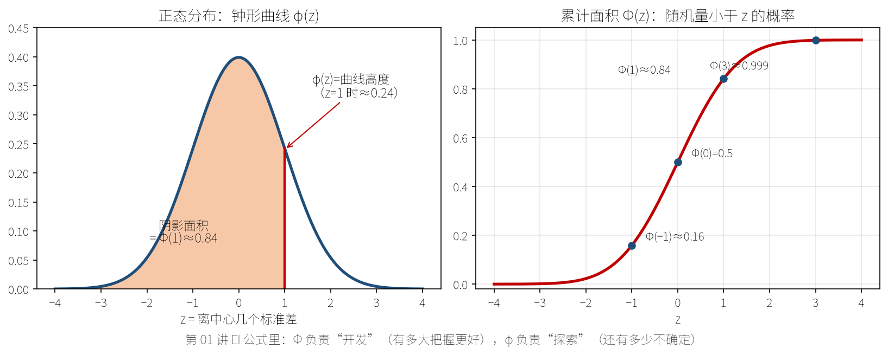

# 燃气轮机智能设计与前沿算法自学白皮书：从高中物理到顶刊前沿

> **👑 著者前言与自学导读**（可读性优化版）

本书面向**零基础初入燃气轮机、航空发动机与科学机器学习（AI for Science / AI4Turbomachinery）领域的本科生与初学者**，基于郭振东老师及其合作团队的学术成果编写。

## 本书覆盖的文献范围（口径统一说明）

全书涉及 **20 篇**论文，统一采用 **01–20** 的规范编号（见仓库 README「论文全景索引表」）：

| 类别 | 数量 | 说明 |
| :--- | :---: | :--- |
| **全集** | **20 篇** | 期刊与会议论文总览 |
| 其中**本地有原文** | **15 篇** | 13 篇 PDF 全文 + 2 篇 ScienceDirect 页面 HTML（论文 09、10，**仅摘要与著录**） |
| 其中**无本地文件** | **5 篇** | 论文 04、05、13、14、20；均已取得权威著录 + 出版商摘要 |

每讲章末元数据表标明**证据等级**：

- **A 级**：本地有全文，论述可回溯 `corpus/txt/`（13 篇 PDF）；
- **B 级**：无本地全文，依据权威著录与摘要；超出摘要一律标「原文未获取」；
- **C 级**：**截至 2026-09-07 定稿核验，全集已无 C 级条目**。


> 上图是全书 20 讲的技术坐标：从**代理模型与 EGO**（第 01–02 讲），到**多保真**（第 02、05、08 讲），到**生成式与迁移**（第 06–09 讲），再到**神经算子与物理增强**（第 10–15 讲），最后回到**流动控制与实验**（第 16–20 讲）。  
> 主线一句话：**先把「下一次评估」变聪明，再把「一次评估」变便宜，最后让模型学会物理本身。**

## 三条写作铁律（不变）

1. **没有出处的话不写。** 百分比、倍数、样本量后有 `［来源］`；查不到就标 `［待核实］` 或不写。  
2. **跑不通的代码不交。** 第五篇代码来自 `code/` 真实文件。  
3. **对不上的数字不填。** 与原文冲突时以原文为准。

由 `tools/verify_all.py` 自动验收。

## 怎么读这本书（请先读完本段）

### 主路 vs 深潜

每讲正文是**主路**：开场口诀 → 比喻 → 死穴 → 少数核心式 → 值班手册 → 比分 → 可信度。  
标有 `【深潜｜可跳过】` 的框是加长跑道：公式、偏导、实现细节**知识仍在**，第一遍读不懂可以整框跳过，第二遍再回来。

### 每讲固定导航条

1. **开场 90 秒**：反派绰号 + 3 句口诀 + 心智图  
2. **§1 直觉剧场**：生活比喻（会贯穿全讲）  
3. **§2 工程死穴**：有预算、有截止时间的现场  
4. **§3 数学缓坡**：人话 → 符号卡 → 核心式 → 深潜  
5. **§4 值班手册**：决策树优先于公式  
6. **§5 比分日**：先胜负，再表格  
7. **§6 可信度**：软肋打分 + 下一集预告  
8. **章末**：30 秒复述 + 自测 + 元数据

### 四条过桥

篇与篇之间有「过桥」短章，专门帮你**换脑子**（采样 → 潜空间 → 场预测 → 实验）。目录里能点到。

### 若你时间很少

| 你有… | 建议路径 |
| :--- | :--- |
| **2 小时** | 第零章 + 第 01 讲 + 过桥 C 开头 + 第 17 讲 |
| **10 小时** | 第零章 → 01 → 02 → 05 → 10 → 16 → 17 → 第六篇 6.5 |
| **一个学期** | 按目录顺序；深潜框第二遍再吃 |

### 图怎么看

- **主路径默认中文图**；英文对照图保留在仓库，不堵阅读。  
- 见到「指读」二字：请按左/右/箭头真的看图，不要跳过。  
- 心智图 = 该讲地图；决策树 = 算法说明书；比分板 = 证据。

### 只学过高数、线代的大二同学（2026-09-13 起专设通道）

2026-09-13 做了一次「大二生模拟通读」（报告见 `docs/大二生审读报告与整改清单.md`）：第零章能读，从第 01 讲起每讲平均 16 个没学过的词。为此全书加了四层脚手架，**请按顺序用**：

1. **第零章 0.4「概率统计急救包」、0.5「叶轮机词典」**——σ、Φ/φ、高斯过程、总压损失、三涡……全书最常见的 40 个词，各一段人话一个例子。  
2. **四座过桥各带一节「急救包」**——过桥 A 优化与代理、过桥 B 生成模型、过桥 C 神经网络、过桥 D 实验与不确定性。读某篇前先读它的过桥。  
3. **每讲开头「开讲前置知识检查」**——告诉你本讲默认你读过哪几节，附三道自检题；答不上就翻回去。  
4. **附录 G 全书术语表**——★ 高数线代已覆盖 / ★★ 本书教过 / ★★★ 只给直觉；每行注明在哪教过。

### 完全零基础 / 有数学 / 要做研究 / 要复现

- **零基础**：必须先第零章；再 01，且允许跳深潜。  
- **有数学**：深潜框是你的主菜。  
- **要做研究**：每讲 §6 软肋 = 选题富矿。  
- **要复现**：`code/README.md`。

---

> 📖 **阅读体验建议：** 犯困时不要硬刚公式——回到开场三句口诀，出声读一遍章末 30 秒复述，再继续。本书故意写长，是为了把密度摊薄，不是为了堆字数。

---

## 定稿状态（2026-09-07）

| 项 | 口径 |
| :--- | :--- |
| 讲次 | 20/20，结构齐全（开场→死穴→数学→值班→比分→可信度→章末） |
| 单讲正文（去空白） | 全部 ≥ 8.5k 字 |
| 单讲配图 | 全部 ≥ 10 张（主路径中文教学图） |
| 公式 | Unicode 纯文本，禁止美元符数学环境与裸 LaTeX |
| 数字 | 百分比/倍数/次数断言带来源；图注含数字带 `Pxx` 出处 |
| 工况红线 | 凡写 NAE 降损 14.0% 必绑 Ma=0.8［原文 P09 摘要］ |
| 装配 | 本文件 + `docs/lectures/` + 过桥 + 第六篇 + 附录 → `tools/build_whitepaper.py` |
| 验收 | `make verify`（A–F + 可读性 R1–R4，共 48 项）；语料需先 `make corpus` |

> 修改讲稿请只改 `docs/lectures/`，再跑 `make whitepaper && make verify`。

> **2026-09-07 证据收官：** 关键参数化维数（P07 18=15+3、P06 Z/C=13/3、P08 FFD 50 标量、P03 端壁 13、P11 28/60、P19 93）已回 PDF；B 级讲次禁止假拆零件表。详见 `docs/pedagogy/EVIDENCE_LEDGER.md`。

> 📌 **本文件由 `tools/build_whitepaper.py` 自动装配生成，请勿直接编辑。**
> 修改内容请改 `docs/lectures/` 下的讲稿源文件后重新运行装配脚本。
> 内容版本：src-99266ca5aa02（= 讲稿/代码源文件的内容哈希；源不变则装配结果逐字节不变）

---

## 目录

- [第零章 极简前置铺垫：初高中物理/数学如何托起航空燃气轮机？](#ch0)
  - [0.1 燃气轮机到底是个啥？](#ch0-1)
  - [0.2 什么是 CFD？——把牛顿定律和微积分扔给超算](#ch0-2)
  - [0.3 为什么设计叶片这么难？——高维昂贵黑箱（HEB）与"算不起的悲剧"](#ch0-3)
  - [0.4 概率统计急救包：只学过高数线代，也能看懂 σ、Φ 和"高斯过程"](#ch0-4)
  - [0.5 叶轮机词典：第 09、16–20 讲会反复用到的 20 个词](#ch0-5)
  - [0.6 20 讲路线「地铁图」（文字版）](#ch0-6)
  - [0.7 第零章自测（3 题）](#ch0-7)
- [【贝叶斯优化与高维代理模型篇】](#part-1)
  - [过桥 A · 从第零章到采样主线](#bridge-a)
  - [【第01讲】CR-EI：贝叶斯优化为什么会"瞎逛"——过度探索的发现与校准（**论文 01**）](#lec-01)
  - [【第02讲】Filter-GEI：老专家与实习生——多保真并行优化怎样把钱花在刀刃上（**论文 02**）](#lec-02)
  - [【第03讲】GSDE：126 维的奇迹——为什么贝叶斯优化在高维叶栅面前必须让位（**论文 07**）](#lec-03)
  - [【第04讲】DA-EGO：把 126 维切成小块——动态分解与聚合如何救活贝叶斯优化（**论文 11**）](#lec-04)
  - [【第05讲】EMFS / MSFO：当"便宜的粗网格"开始骗人——多保真优化的暗面（**论文 13**）](#lec-05)
- [【生成式模型与跨任务知识迁移篇】](#part-2)
  - [过桥 B · 从采样到潜空间](#bridge-b)
  - [【第06讲】GMFoO：一个潜空间不够，那就同时用好几个（**论文 06**）](#lec-06)
  - [【第07讲】SW-VAE / KT-ASO：把上一个型号的设计经验"搬"到新型号上（**论文 08**）](#lec-07)
  - [【第08讲】GTO：GAN 不会"反推"，那就用梯度硬算出来（**论文 17**）](#lec-08)
  - [【第09讲】VAE-NURBS 端壁参数化：把生成式参数化从叶型推广到非轴对称端壁（**论文 14**）](#lec-09)
- [【物理增强神经算子与 AI4Turbomachinery 篇】](#part-3)
  - [过桥 C · 从优化到场预测](#bridge-c)
  - [【第10讲】TNO：不优化，而是让"一次评估"变得几乎免费（**论文 16**）](#lec-10)
  - [【第11讲】SDNO：让网络"照着物理公式"长——把叠加原理写进神经算子（**论文 12**）](#lec-11)
  - [【第12讲】P-ResUNet：把"相似原理"写进输入，把"载荷分布"写进输出（**论文 18**）](#lec-12)
  - [【第13讲】SHAP：优化跑完之后，那一堆数据里到底藏着什么？（**论文 19**）](#lec-13)
  - [【第14讲】从流体到结构：给叶片建一个"流固耦合数字孪生"（**论文 15**）](#lec-14)
  - [【第15讲】子午面全景预测：把"物理"写进 AI 预测模型的最后一块拼图（**论文 20**）](#lec-15)
- [【流动控制、气动热耦合与风洞实验篇】](#part-4)
  - [过桥 D · 从网络回到物理](#bridge-d)
  - [【第16讲】端壁：涡轮里最热、最难冷却、也最容易被忽略的角落（**论文 03**）](#lec-16)
  - [【第17讲】把端壁真的送进风洞：跨声速涡轮转子的非轴对称端壁实验（**论文 09**）](#lec-17)
  - [【第18讲】叶尖：涡轮里泄漏、刮擦、换热三件事同时发生的地方（**论文 10**）](#lec-18)
  - [【第19讲】图纸上挑不出毛病的设计，造出来还好用吗？——端壁气热性能的不确定性量化（**论文 04**）](#lec-19)
  - [【第20讲】内外夹攻：冲击冷却 + 气膜冷却的复合冷却构型（**论文 05**）](#lec-20)
- [第五篇 【实践与代码篇】可运行算法原型库](#part-5)
  - [`benchmarks.py`](#code-benchmarks-py)
  - [`decomposition.py`](#code-decomposition-py)
  - [`gp.py`](#code-gp-py)
  - [`metrics.py`](#code-metrics-py)
  - [`moo.py`](#code-moo-py)
  - [`multifidelity.py`](#code-multifidelity-py)
  - [`optimizer.py`](#code-optimizer-py)
  - [`rbf.py`](#code-rbf-py)
  - [`sampling.py`](#code-sampling-py)
  - [`transfer.py`](#code-transfer-py)
- [第六篇 【对比、批判与前瞻篇】](#part-6)
  - [6.0 二十讲口诀墙（一张纸版）](#sec-6-0)
  - [6.1 全景对比矩阵](#sec-6-1)
  - [6.2 横向批判：这 20 篇共享的六个软肋](#sec-6-2)
  - [6.3 前瞻选题：从上述六个软肋直接生长出来](#sec-6-3)
  - [6.4 已删除的旧版虚构数字（公示，避免复现）](#sec-6-4)
  - [6.5 全书收口：一句话版](#sec-6-5)
- [附录](#appendix)
- [附录 G · 全书术语表（大二生分级版）](#glossary)

---

<a id="ch0" name="ch0"></a>
# 第零章 极简前置铺垫：初高中物理/数学如何托起航空燃气轮机？

很多刚进大学的同学，一看到"跨声速多级压气机""非轴对称端壁二次流""纳维-斯托克斯方程""高斯过程回归"就心里发怵。别怕——**所有看似高不可攀的工程黑科技，其物理地基都在你初中和高中学过的知识里。** 本章只用初高中水平的物理与数学，把后面 20 讲要用到的三件事讲清楚。

---

<a id="ch0-1" name="ch0-1"></a>
### 0.1 燃气轮机到底是个啥？


> 上图把全书的研究对象拆成四步：**吸气 → 压缩 → 点火 → 喷气**。后面二十讲所做的一切优化，归根结底都在服务于中间那两步——**让压气机压得更省功、让涡轮转得更高效**。

把航空发动机简化到极致，它就是一根管子，干四件事：**吸气 → 压缩 → 点火 → 喷气**。

**① 吸气（进气道）**
初中物理的**连续性方程**：管子细的地方流速快、粗的地方流速慢。进气道做成先粗后细的形状，就是为了把迎面高速气流"收拾"成适合压气机入口的速度。

**② 压缩（压气机）**
这是全书的主角。压气机由一排排**叶片**组成，每一排都在给空气"做功"——就像你用扇子扇风时给空气加了能量。
- **转子（Rotor）**：转动的叶片排，通过旋转把机械能传给气体，气体的**压力升高、速度升高**；
- **静子（Stator）**：不动的叶片排，把气体的**速度"收拾"成压力**（扩压），并为下一级整理好进气角度。

一对"转子+静子"就是一个**级（stage）**。本书第 03 讲要优化的，是一台 **3.5 级压气机**（1 排进口导叶 + 3 个级，共 7 排叶片）［原文 P07 §Geometry definition］。

这里用到的高中物理是**能量守恒**：压气机耗功 = 气体的焓升（压力与温度同时上升）。工程上衡量压缩"划不划算"的指标叫**等熵效率**：
**〔式〕** η_is = (理想（等熵）压缩所需功)/(实际消耗的功)

**这个数每提高 1 个百分点，都是发动机行业的重大胜利。** 记住这个量级感：本书第 03 讲里，一次成功的优化把 3.5 级压气机的总对总效率从 85.825% 提到 86.929%，增量 **1.104%**，就已经是一篇 *Aerospace Science and Technology* 论文的核心成果［原文 P07 Table 3］。

**③ 点火（燃烧室）**
燃油与高压空气混合燃烧，化学能变成热能，气体温度骤升（现代发动机涡轮前温度已远超金属熔点，必须靠气膜冷却保护叶片——这就是第 19、20 讲要解决的问题）。

**④ 喷气（涡轮 + 尾喷管）**
高温高压气体冲过**涡轮**，推动涡轮叶片旋转；涡轮通过一根轴**反过来带动压气机**（这正是燃气轮机最精妙的自持设计）。剩下的能量从尾喷管高速喷出，按**动量守恒**（高中物理）产生反作用推力。

> **一句话串起来**：压气机是"花钱的"（耗功），涡轮是"赚钱的"（出功），燃烧室是"本钱"。整机设计的全部艺术，就是让这笔账越算越划算。

---

<a id="ch0-2" name="ch0-2"></a>
### 0.2 什么是 CFD？——把牛顿定律和微积分扔给超算

叶片形状好不好，不能靠猜，得算流场。所谓 CFD（计算流体力学），就是把**牛顿第二定律 F=ma** 写成流体的形式——**纳维-斯托克斯方程（N-S 方程）**——然后在计算机上解它。

对本书而言，你只需要理解三件事：

**① 控制方程（不必会解，但要知道它在说什么）**

- **质量守恒（连续性方程）**：流进多少，流出多少，不能凭空产生；
- **动量守恒（N-S 方程）**：F=ma 的流体版，左边是惯性，右边是压力、粘性、体积力；
- **能量守恒**：热力学第一定律，决定了温度场与换热。

**② 湍流模型：必须"造假"的一层**

工程上直接解 N-S 方程（DNS）的代价大到不可想象，于是工业界普遍解**雷诺平均 N-S 方程（RANS）**，把湍流的脉动用一个模型"糊"上去。
本书第 03 讲的算例采用 **Spalart-Allmaras 一方程湍流模型**，用 **NUMECA FINE/Turbo** 求解器，网格为 O4H 拓扑的六面体结构网格、**322 万节点**，第一层网格高度 0.001 mm 以保证 y^+<1［原文 P07 §Numerical method］。

> **这里的工程直觉**：网格越细越准，但计算量暴涨。本书第 02 讲的核心思想恰恰就是建立在这个矛盾之上——**粗网格（低保真）便宜，细网格（高保真）昂贵，怎么搭配着用？**

**③ CFD 的代价：一切优化的起点**

第 03 讲报告了真实数字：在上述配置下，**单次 3.5 级压气机 CFD 评估需要 1~1.5 小时**（双路 AMD EPYC 7502 32 核服务器）［原文 P07 §Result analysis］。

**请记住这个数量级：一次评估 = 一小时。** 后面所有算法（贝叶斯优化、多保真、代理辅助进化、神经算子）存在的唯一理由，都是为了让"一小时的评估"少做几次。

---

<a id="ch0-3" name="ch0-3"></a>
### 0.3 为什么设计叶片这么难？——高维昂贵黑箱（HEB）与"算不起的悲剧"

现在把前面两节合起来，看看叶栅设计到底难在哪。

**难点一：维数灾难（Curse of Dimensionality）**

一个叶片形状要用多少个数字描述？第 03 讲（论文 07）把计数单位钉成「优化器接收的独立标量」：每排 **18 维** = 三截面吸力面各 5 个法向主动点（15）+ 中周向 + 尖周向 + 尖轴向（3）；7 排同构得 **126 维**名义设计空间［原文 P07 Blade parameterization；摘要亦直接给出 126 variables］。

为什么必须这么多？因为**叶片排之间是相互影响的**（0.1 节说过：第 2 排吃的是被第 1 排搅过的气流）。原文说得明确：**为充分考虑叶片排与级之间的相互作用，两级以上的叶栅必须同时优化**［原文 P07 摘要］——单独优化每一排在物理上就是错的。

做个量级感受：在 126 维空间里撒 1000 个样本点，平均到每个维度上只能分成
**〔式〕** 1000^(1/126) ≈ 1.056

份——**连"每个方向一分为二"都做不到**。这就是维数灾难。

**难点二：每次评估贵得要命（Expensive）**

一次 CFD 一小时（0.2 节）。一个设计周期能负担多少次？原文给出的现实约束是：**几百到几千次**［原文 P07 摘要］。

**难点三：没有导数可用（Black-box）**

CFD 求解器是一个"扔进去几何、吐出来一个数"的黑箱。你拿不到 ∂η_is/∂x_i 这样的梯度信息，因此**基于梯度的优化方法（最速下降、SQP 等）通通用不上**，只能用无导数/进化类方法。

**难点四：一个点都不许浪费**

综合以上三点，就得到了本书要解决的**高维昂贵黑箱（High-dimensional Expensive Black-box, HEB）**问题。原文对它的定义性描述是：

> 基于 CFD 的叶栅设计优化是典型的高维昂贵黑箱问题……变量数可达 100 以上，而一个设计周期内可负担的 CFD 次数只有几百到几千次。［原文 P07 摘要］

**于是全书 20 讲，本质上都是在回答同一个问题：**

> **在 126 维、每次评估一小时、总共只有一两千次机会的约束下，下一个点应该算在哪里？**

| 主线 | 策略 | 对应讲次 / 论文 |
| :--- | :--- | :--- |
| 让每一次采样更聪明 | 改造采集函数（EI → CEI/REI → 滤波 GEI） | 第 01、02 讲（论文 01、02） |
| 让便宜的粗网格多干活 | 多保真 + 并行 + 失真区侦测 | 第 02、05 讲（论文 02、13） |
| 换掉撑不住高维的代理 | 代理辅助进化、子空间分解 | 第 03、04 讲（论文 07、11） |
| 不每次从零开始 | 生成式参数化 + 知识迁移 | 第 07、08 讲（论文 08、17） |
| 干脆不优化，直接预测流场 | 物理增强神经算子 | 第 10–12 讲（论文 16、12、18） |
| 回到物理本体 | 流动控制 + 实验与不确定性量化 | 第 16–19 讲（论文 03、09、10、04） |

---

> 📖 **读完第零章，你已经具备了读懂全部 20 讲的物理基础。**  
> 接下来每一讲固定导航：**开场口诀 → ① 直觉剧场 → ② 工程死穴 → ③ 数学缓坡（含可跳过的深潜）→ ④ 值班手册 → ⑤ 比分日 → ⑥ 可信度刻度 → 章末复述与自测。**
>
> **下一集预告：** 第 01 讲的反派叫「瞎逛」——采样次数很多，算法却在差区出不来。过桥 A 会把你从本章的问题，送上「让下一次采样更聪明」的主线。

---

<a id="ch0-4" name="ch0-4"></a>
### 0.4 概率统计急救包：只学过高数线代，也能看懂 σ、Φ 和"高斯过程"

> **写给谁：** 还没修概率论与数理统计的同学。第 01–05 讲、第 19–20 讲每一页都在用这一节的六个词。**读完这一节大约 15 分钟，能省掉后面十几个小时的懵。**  
> **写法：** 每个概念只给一句人话、一个能心算的例子，不证明任何定理。

**① 均值、方差、标准差：一堆数的"中心"和"散开程度"**

你量了 5 次同一叶片的效率（单位略去）：86.0、86.2、85.9、86.1、86.3。

- **均值** μ：加起来除以个数 → 86.1。这是"中心"。  
- **方差**：每个数减均值、平方、再取平均 → 0.02。平方是为了让正负偏差不互相抵消。  
- **标准差** σ：方差开根号 → 约 0.14。它的单位和原数据一样，所以**σ 是"典型偏差有多大"**。  

以后凡是看到「均值 ± 标准差」这种写法（第 01 讲 §5 的翼型表），就读成：**中心在哪、通常离中心多远**。标准差小 = 十次实验挤在一起 = **稳**。

**② 中位数：排队站中间那个**

把数从小到大排，站在正中间的那个就是**中位数**。它不怕极端值：五个数里混进一个 60，均值被拖到 80.9，中位数还是 86.1。  
第 01 讲的 CR-EI 用"已有样本的中位数"当预警线，就是取它"不被个别烂点带偏"这个性质。

**③ 正态分布、Φ 和 φ：钟形曲线，以及它下面的面积**

大量微小随机因素叠加出来的量，往往长成一条**钟形曲线**：中间高、两边低、左右对称。这叫**正态分布（高斯分布）**，只由两个数决定——中心 μ 和宽度 σ。

把它标准化（减 μ、除 σ）之后，横轴上的数叫 **z**，意思是"离中心几个标准差"。此时只剩两个函数要认识：

- **φ(z)**（小写 phi）：钟形曲线本身的**高度**。z=0 时最高（约 0.40），z=±1 时约 0.24，z=±3 时几乎贴地（约 0.004）。  
- **Φ(z)**（大写 Phi）：从最左边一直到 z 为止，曲线下方的**累计面积**，也就是"随机量小于 z 的概率"。Φ(0)=0.5（正好一半）；Φ(1)≈0.84；Φ(−1)≈0.16；Φ(3)≈0.999。

**只需记住三条形状规律**（第 01 讲全部推导都靠它们）：  
1. z 很大（≫0）时，Φ→1、φ→0：几乎"确定发生"，而钟形曲线已经贴地。  
2. z 很负（≪0）时，Φ→0、φ→0，但 **φ 比 Φ 衰减得慢**——所以两者的"比值"会变化，这正是第 01 讲说"z≤0 时算法只听 σ 的话"的数学根源。  
3. 二者都不会小于 0。



> **指读：** 上图左半：钟形曲线，竖线所在位置的高度就是 φ(z)；右半：把左边阴影面积随 z 累加，就画出 S 形的 Φ(z)。第 01 讲的 EI 公式里，Φ 管"开发"、φ 管"探索"。

**④ 置信带："我猜这个值在这条带子里"**

模型对某个点的预测不是一个数，而是"一个中心 ŷ 加一条上下各 2σ 的带子"（按正态分布，真值落在带内的概率约为 0.95）。带子瘦 = 有把握；带子胖 = 没把握。第 01 讲 GP 图里那条随样本点变瘦变胖的阴影，就是置信带。

**⑤ 协方差与"相关"：两件事是否一起动**

两个量 A、B，如果 A 偏大时 B 也倾向偏大，它们**正相关**，协方差为正；反过来为负；互不相干接近 0。  
把它推广到"任意两个位置 x 和 x′ 的函数值"上：**离得近的两个点，函数值应该相近** → 协方差大；离得远 → 协方差小。给出"距离 → 协方差"的那条公式，就叫**核函数**（第 02、03 讲会用到"长度尺度"这个词，它就是核函数里"多远算远"的旋钮）。

**⑥ 高斯过程（GP）：把正态分布从"一个数"推广到"一整条曲线"**

- 正态分布：描述**一个不确定的数**——给出中心 μ 和宽度 σ。  
- 高斯过程：描述**一条不确定的曲线**——给出每一点的中心 μ(x)，以及任意两点之间的协方差 k(x, x′)。  

有了它，"代理模型"就不只是插值：**在采过样的地方带子收窄到 0，在没采过样的地方带子鼓起来**。这就是第 01 讲 GP 图的全部秘密，也是"σ 大只说明没人来过，不说明这里好"这句口诀的出处。  
（工程界把这套方法叫 **Kriging（克里金）**，和高斯过程回归是一回事，只是来自地质勘探那边的叫法。）

**⑦ 贝叶斯思路：先信一点、看到数据再改口**

"先验"= 看数据之前你的信念（例如：曲线应该光滑）；"后验"= 看完数据之后更新过的信念。贝叶斯优化里"后验均值/后验方差"，就是"看过这些 CFD 结果之后，模型对每个位置的中心和带宽"。第 01 讲说"后验"，请自动翻译成"看完数据以后的"。

**⑧ 蒙特卡洛：不会积分就靠抽签**

想知道一个复杂量的分布，最笨也最可靠的办法：随机抽很多组输入，逐个算输出，把输出画成直方图。这就是**蒙特卡洛**。它贵在"很多组"，所以第 19 讲会先建一个便宜的代理模型，再对代理模型抽签。

> **急救包自测：** 若某点预测 ŷ=85.0、σ=0.5，当前最优 ξ=86.0，z=(ξ−ŷ)/σ=2。查上面的数：Φ(2)≈0.977，φ(2)≈0.054。这个点"很有把握不如冠军"——请把这句话记到第 01 讲。

---

<a id="ch0-5" name="ch0-5"></a>
### 0.5 叶轮机词典：第 09、16–20 讲会反复用到的 20 个词

> **写给谁：** 没修过流体力学与叶轮机原理的同学。第四篇每讲平均出现 10 个以上下面的词。  
> **用法：** 不要背。读到第四篇卡住时翻回来查。

**A. 叶片的解剖（配合 0.1 节的转子/静子）**

| 词 | 人话 | 你会在哪见到 |
| :--- | :--- | :--- |
| **前缘 / 尾缘**（LE / TE） | 叶片迎风的圆头 / 背风的尖尾 | 第 07 讲"尾缘不薄于基准"；第 16 讲"尾缘分离" |
| **压力面 / 吸力面**（PS / SS） | 叶片凹的一侧（压力高）/ 凸的一侧（气流快、压力低） | 第 13 讲"吸力面前缘控制点"；第 16 讲端壁造型分 PS 侧/SS 侧 |
| **叶高（span）** | 从轮毂（根）到机匣（尖）的方向；"叶高一半处（50 percent span）"= 叶片正中间那一层截面 | 第 04 讲"中段叶高提升"；第 10 讲"某叶高截面" |
| **弦长 C** | 前缘到尾缘的直线距离，叶片的"身长"，常用来做无量纲基准 | 第 12 讲"以弦长为基准归一化" |
| **栅距 t 与稠度** | 相邻两片叶片的间距 t；**稠度 = 弦长 / 栅距**，越大叶片越密 | 第 12 讲"相对栅距 t/C" |
| **冲角（攻角）** | 来流方向与叶片前缘设计方向的夹角；偏了就容易分离 | 第 12 讲"进口冲角 α" |
| **积叠 / 弯掠** | 把各叶高的二维截面沿某条线"叠"成三维叶片；截面横着挪叫弯（lean），前后挪叫掠（sweep） | 第 03 讲"三截面 + 积叠"参数化 |
| **叶尖间隙** | 转子叶尖与机匣之间那条缝，气体从这里漏过去会产生泄漏涡 | 第 18 讲叶尖凹槽 |
| **端壁** | 流道的上下"墙"（轮毂面与机匣面）；叶片和墙的交角处流动最乱 | 第 09、16、17 讲非轴对称端壁 |

**B. 衡量"好不好"的气动量**

- **静压 / 总压**：静压是气体真实的压力；**总压** = 静压 + 把气流完全刹停能换回的压力，代表"气流身上还剩多少可用能量"。**总压只会因为摩擦、涡、激波而下降**，所以——  
- **总压损失系数**：进口总压减出口总压，再除以一个参考动压（½ρU²）。它是整本书第四篇最常见的目标函数：**越小越好**，降了就说明流道里的"内耗"少了。  
- **等熵效率**：见 0.1 节；压气机与涡轮"划不划算"的总分。  
- **熵增**：内耗的另一种账本。熵只增不减；云图里"高熵区"= 能量被白白耗掉的地方（第 04 讲三个高熵区 A、B、C）。  
- **马赫数 Ma**：气流速度除以当地声速。Ma<1 亚声速、≈1 跨声速、>1 超声速；**激波**只在超声速区出现，是一道极薄的压力突跃面，过了就损失一截总压。第 17 讲的"Ma=0.8 工况"要看成"跨声速区，激波开始冒头的工况"。  
- **雷诺数 Re**：惯性力与黏性力之比；越大越"不粘"。第 12 讲说"Re 在自模化区可以不喂给网络"，意思是 Re 大到一定程度后再变也不太影响流动形态。  
- **分离**：气流贴不住壁面、脱开形成回流区。分离一出现，损失和堵塞都上来。

**C. 端壁附近的"三涡"（第 09、16、17 讲的物理主角）**

气流在端壁上有一层薄薄的**边界层**（贴墙、走得慢）。它撞上叶片前缘时，被压成一个"马蹄"形绕过叶片，这就是**马蹄涡**；马蹄的一条腿被压力面→吸力面的**横向压差**推着穿过流道，卷成大个的**通道涡**；通道涡挤到吸力面根部时又搓出小小的**角涡**。三者合称**端壁二次流**，是低展弦比涡轮里最大的一块损失来源。  
**非轴对称端壁（NAE）**的思路就是：把原本旋转对称的"平墙"局部抬高/挖低，改变横向压差，让通道涡长不大。

**D. 冷却相关（第 11、16、19、20 讲）**

- **气膜冷却**：从壁面小孔或封严缝吹出一层冷气，贴着壁面铺开，把高温主流隔开。  
- **吹风比 / 质量流量比（MFR）**：冷气流量与主流流量之比。太小盖不住，太大冷气"射穿"边界层反而卷入主流。  
- **气膜冷却效率 η**：(主流温度 − 壁面绝热温度)/(主流温度 − 冷气温度)，1 表示壁面完全被冷气覆盖，0 表示毫无保护。  
- **换热系数 h / 努塞尔数 Nu**：单位温差下壁面吸热的快慢；h 越大壁面越"烫得快"。冷却设计要同时看 η 高、h 低、总压损失低——第 16 讲三目标的来历。  
- **封严缝（purge slot）**：转静子之间的缝，本来是为了防止热气倒灌进轮盘腔，顺便吹出来的冷气也能给端壁前半段降温。

**E. 几何表示（第 03、07、09、10、18 讲）**

- **B 样条 / NURBS**：用少量"控制点"牵引出的光滑曲线/曲面。挪一个控制点，曲线局部跟着动。  
- **FFD（自由变形）**：把叶片装进一个橡皮格子箱，挪箱子的格点，箱里的叶片跟着连续变形。  
- **参数化 / 设计变量**：把一个形状压缩成一串数字的过程；那串数字的个数就是"维数"（见 0.3 节与 `docs/pedagogy/CONCEPT_GLOSSARY.md` 的维数语法）。

> **词典自测：** 用自己的话解释"为什么第四篇几乎每讲都把总压损失系数当目标函数"。答案在 B 段第二条。

---

<a id="ch0-6" name="ch0-6"></a>
### 0.6 20 讲路线「地铁图」（文字版）

```

第零章 HEB 问题
    │
    ├─ 第一篇 采样更聪明 ── 01 瞎逛 → 02 空转 → 03 失明 → 04 分房 → 05 假优
    ├─ 第二篇 换潜空间   ── 06 两难 → 07 迁移 → 08 反推 → 09 端壁
    ├─ 第三篇 场预测     ── 10 免费评估 → 11 叠加 → 12 相似 → 13 归因 → 14 孪生 → 15 子午
    └─ 第四篇 物理实验   ── 16 墙角 → 17 风洞 → 18 叶尖 → 19 UQ → 20 冷却

```

> 把这张图截下来。以后每读完一讲，就在对应站点打勾——比你「感觉读了很多」可靠。

<a id="ch0-7" name="ch0-7"></a>
### 0.7 第零章自测（3 题）

1. 一对「转子 + 静子」叫什么？整机里压气机与涡轮谁在「花钱」、谁在「赚钱」？  
2. 为什么本书把「一次 CFD ≈ 一小时」反复钉在墙上？  
3. HEB 三个字母分别卡住了优化的哪条路？

<details>
<summary>参考答案</summary>

1. 叫一个**级（stage）**；压气机耗功（花钱），涡轮出功（赚钱）。  
2. 因为所有智能算法存在的理由，都是让「一小时」少花几次——没有量级感，就听不懂后面各讲的增益百分比与 CFD 次数（如第 01 讲 2.92%［由 Table 2 计算］、第 03 讲 1500 次［原文 P07 Table 3］）。  
3. **H**igh-dim 维数灾难；**E**xpensive 评估贵；**B**lack-box 无导数。

</details>

---

<a id="part-1" name="part-1"></a>