# 第一篇 【贝叶斯优化与高维代理模型篇】

本篇覆盖**论文 01、02、07、11、13**。这一条主线回答一个问题：**当一次 CFD 贵得要命时，下一个点该算在哪里？** 从校准采集函数（CR-EI），到多保真并行分配（Filter-GEI），再到 126 维下被迫改换门庭的代理进化（GSDE）与子空间聚合（DA-EGO），最后以「多保真也会骗人」这一反直觉发现（EMFS / MSFO）收尾。

<a id="bridge-a"></a>

### 过桥 A · 从第零章到第 01 讲：问题已经清楚，答案从「下一次采样」开始

第零章结束时，你手里只有一个问题，没有算法：

> 在高维、昂贵、无导数的黑箱里，**下一个点该算在哪里？**

从现在起，第一篇（第 01–05 讲）给出第一条主线答案：**让每一次采样更聪明。**

| 你将依次遇见 | 它专治的病 |
| :--- | :--- |
| 第 01 讲 CR-EI | 采样「瞎逛」 |
| 第 02 讲 Filter-GEI | 机房「空转」 |
| 第 03 讲 GSDE | 高维下 GP「失明」 |
| 第 04 讲 DA-EGO | 整屋翻修太贵 |
| 第 05 讲 EMFS | 多保真「后期假优」 |

**阅读纪律（本篇通用）：**

1. 先读开场 90 秒的三句口诀；  
2. 图看懂了再啃〔式〕；  
3. 深潜框可跳，知识不丢；  
4. 章末自测做不出来，回到心智图，不要硬背符号。

下一页反派登场，它的名字叫**瞎逛**。

---

<a id="lec-01" name="lec-01"></a>
### 【第01讲】CR-EI：贝叶斯优化为什么会"瞎逛"——过度探索的发现与校准（**论文 01**）

#### 本讲开场 90 秒

**上讲闪回（第零章）：** 叶片设计是 HEB 问题——维数高、每次 CFD 贵、没有导数。全书都在问：下一笔预算该砸哪？

**本讲反派：** 「瞎逛」——采样次数已经很多，算法却在明显很差的空白区打转，出不来。

**只要带走 3 句口诀：**

1. **病根是 z ≤ 0**：不确定度 σ 大的地方，未必是好地方。  
2. **治则是改 ξ，不是改 σ**：前人爱调探索权重；本文抬高"当前最优"这根尺子。  
3. **近处 CEI、远处 REI，EI 瞎了再换班**：值班经理三规则。

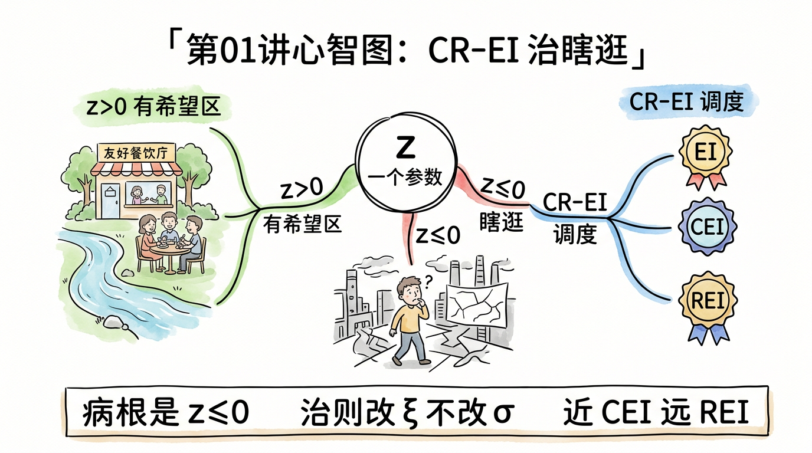

> **看图三秒：** 中间是参数 z；左边 z>0 是"有希望的街区"；右边 z≤0 是工业区瞎逛；底部三条口诀请先刻住，后面只是在证明它们。

**本讲赌注：** 若放任 z≤0 的瞎逛，有限 CFD 预算会永久巡逻工业区。

---

#### 1. 生活与物理直觉引子：三种"找最佳餐厅"的策略

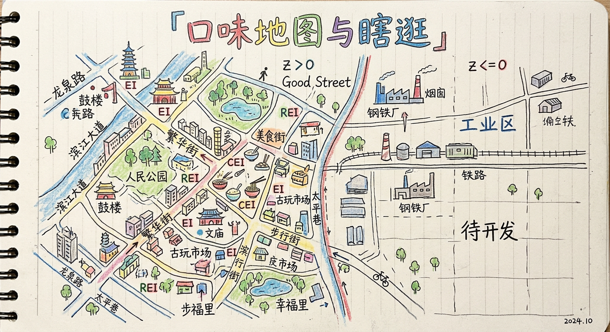

> **指读：** 左有希望区、右工业区巡逻；CR-EI 改的是尺子 ξ 与近远分工。

假设你搬到一座新城市，给自己定了死规矩：**30 天内，找到全城最好吃的那家面馆。**

每一顿饭都要花钱、花时间——这顿饭就是一次**昂贵实验**。放到叶片设计里，它对应动辄几小时的一次 CFD。

你口袋里的钱，只够吃大约几十顿。于是策略选择，比"爱吃辣还是爱清汤"更要命。

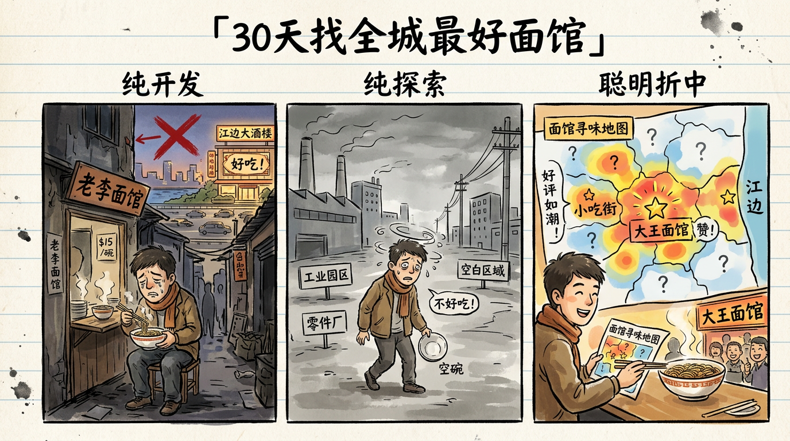

> **指读：** 左格人死守小巷（河对岸的神店永远没机会）；中格人专钻空白工业区（反复确认"这儿难吃"）；右格人手里有一张口味地图——颜色深的是已知好吃，问号是不确定。

**策略 A · 纯开发（exploitation）**  
找到一家还不错的，就天天去，只在附近小巷换着吃。  
风险：全市第一在河对岸，你这辈子不会知道。

**策略 B · 纯探索（exploration）**  
专挑地图上空白的地方。  
风险：空白区常常是没人去的工业区，你只是在验证"确实难吃"。

**策略 C · 聪明折中**  
维护一张"口味地图"：  
- 已知好吃的街区 → 猜附近也可能好吃；  
- 空白处 → 标成"不确定"，不确定越大，越值得去试试。

贝叶斯优化里的**期望改善（Expected Improvement, EI）**，就是策略 C 的数学版。

本讲要讲的，是策略 C 里一个**藏了二十年**的陷阱：地图用着用着，会把你系统性、持续地推进工业区——而且还可能**永远出不来**。我们给它起个绰号：**瞎逛**。

| 生活元素 | 工程元素 | 本讲符号（先混个眼熟） |
| :--- | :--- | :--- |
| 面馆坐标 | 设计变量 | x |
| 口味得分 | 性能（如 −L/D、损失） | y |
| 口味地图的"估计均分" | 代理模型预测均值 | ŷ(x) |
| 地图上的"不确定带宽" | 预测标准差 | σ(x) |
| 目前吃过的最高分 | 当前最优（incumbent） | ξ |
| 要不要再去这家的冲动 | 期望改善 | EI(x) |

> **先猜后揭：** 若算法开始专挑"地图上最空白、但也最可能难吃"的点，病在地图（σ）还是在尺子（ξ）？  
> 揭晓在 §3：主流改 σ，本文改 ξ。

**策略 C 的藏二十年陷阱（加长）：**  
口味地图用着用着，会系统性把你推进工业区：好区被采密后 σ 变小，差区反而更空、σ 更大，EI 听空白的话。  
这不像偷懒，像勤奋——所以叫**瞎逛**更阴。郭振东等指出过度探索与过度开发是一对病，只治贪不够。

---

#### 2. 叶轮机械中的真实工程死穴：算不起，但停不下

把面馆换成叶片。现场是这样的：

周五下班前，组长丢来一句话——「下个型号的叶型，预算只够再跑几百次 CFD，给我一个比现在更好的外形。」

你面对的不是一道可以慢慢推的数学题，而是一个**昂贵黑箱**：

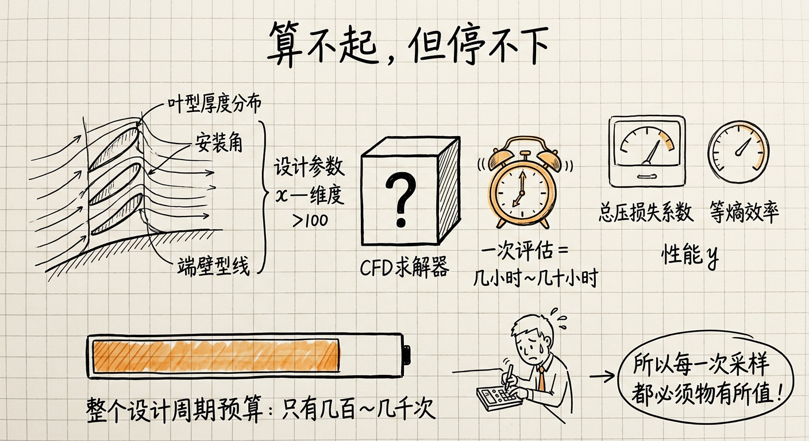

> **指读：** 左边塞进几何参数 x，中间黑箱是 CFD，右边吐出一个数 y。箭头上写着时间与金钱。

- 给一组几何参数 x（厚度分布、安装角、端壁型线……），求解器吐回性能 y；  
- 一次高保真 CFD 可能要**几小时到几十小时**；  
- 一个设计周期能负担的次数往往只有**几百到几千次**［原文 P07 §1］；  
- 设计变量轻易超过 **100 维**［原文 P07 摘要］。

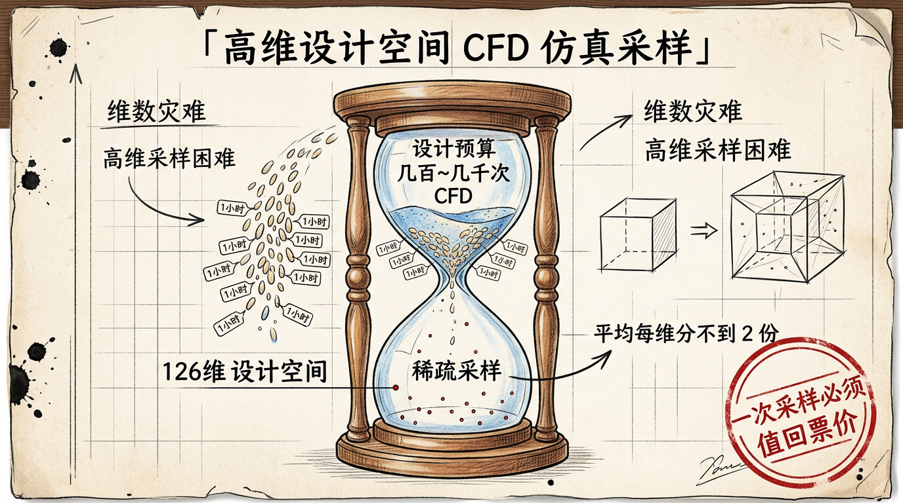

> **指读：** 上半斗是有限次数，每粒沙标着"1 小时"；下半斗是高维空间里稀疏的点。红章的意思只有一个——**点错一次，就烧一笔不可回收的预算。**

在这种现场，EI 成为贝叶斯优化的默认配置，是因为它直接回答：

> 「这个点，值得再花一次 CFD 吗？」

可 EI 有个久治不愈的毛病：**次数已经很多了，结果却卡在次优解上。**

此前学界常说：那是**过度开发**——算法太贪，只在当前最优点附近打转。

郭振东等指出：**这个解释只对了一半。** 还有一半叫**过度探索**，而且更阴险——它长得像"勤奋地探索"，其实是在工业区永久巡逻。这就是本讲反派 **瞎逛**。

**预算沙漏的第二读法：**  
上半斗是次数，下半斗是维数稀疏。  
EI 默认很香，是因为它直接回答「值不值得再花一次」；  
但当 z 掉到明显负值，它回答的其实是「空白大不大」，不是「空白处好不好」。  
CR-EI 的贡献，是把值班经理请回来：瞎了换班，而不是继续勤奋地错。

---

#### 3. 数学公式从 0 到 1 推导：一个参数 z，两种病

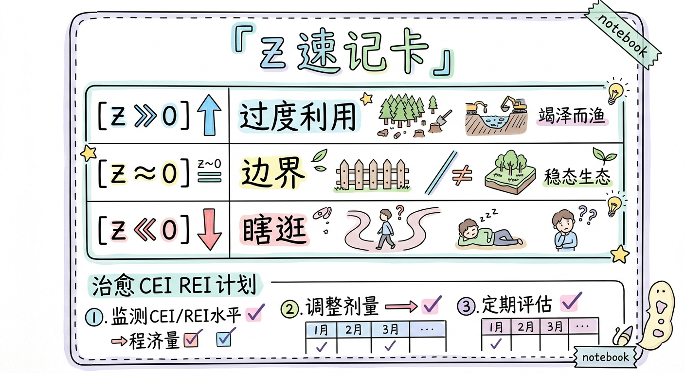

> **指读：** z≫0 过度开发；z≪0 瞎逛；治则抬 ξ、近 CEI 远 REI。

先把公式关掉。只用餐厅语言说一遍：

> 你的口味地图在每个位置给出两个量：  
> **估计均分** ŷ，和 **不确定带宽** σ。  
> 你还记得目前吃过的最高分 ξ。  
> 定义一个无量纲分数 z，衡量"最高分比估计均分高多少个不确定带宽"。  
> **z 很大** → 地图很有把握地说"这儿不如已经最好的那家"→ 你只会在已知好区精耕（贪）。  
> **z 很小（很负）** → 你几乎只听带宽 σ 的话 → 专往空白处钻；而空白处常常是差区 → **瞎逛**。

下面用符号把这话说死。本讲主文只留 **3 条核心式**；偏导与积分细节在深潜框，不挡路。

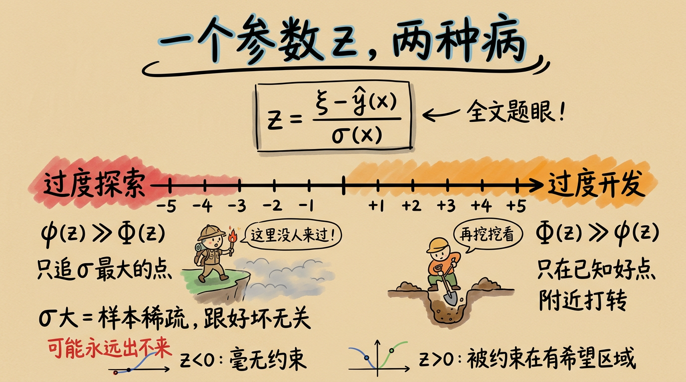

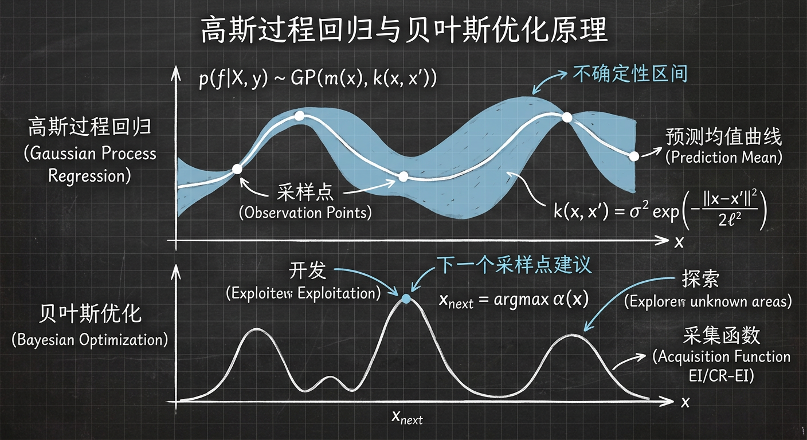

> **指读 GP 图：** 上半幅是后验均值与置信带——样本越密，带子越瘦；下半幅是 EI 曲线，它在"预测更好"与"更不确定"之间拉扯。后面 CEI/REI/GEI 改的都是这张图上的东西。

##### 3B. 本讲符号卡（建议截图留存）

| 符号 | 人话 | 备注 |
| :--- | :--- | :--- |
| x | 设计点（面馆坐标） | 向量 |
| ŷ(x) | 地图估计均分 | 越小/越大取决于问题方向；本文按原文最小化语境理解 |
| σ(x) | 不确定带宽 | **只反映稀疏，不反映好吃** |
| ξ | 目前最优观测 | incumbent |
| z | (ξ − ŷ)/σ | **全文题眼** |
| Φ, φ | 标准正态的"累积"与"钟形密度" | 可先当两个已知函数 |
| EI(x) | 去 x 的"期望改善冲动" | |
| y_PBS | 当前最优设计点上的值 | |
| ξ_Calibrated | 被抬高的尺子 | CEI 用 |
| δ₁, δ₂ | 近处/远处地盘开关 | 互补 |
| y_T | 已有样本的中位数 | 瞎逛预警线 |
| n_Breakthrough | 连续突破计数 | 调度用 |

##### 3C. 主路径只要三条式

**核心式 ① — z 的定义**

**〔式〕** z = (ξ − ŷ(x)) / (σ(x))

**回译：** z 是"比当前最优好（或差）多少个不确定带宽"。  
**停顿：** 若 σ 很大，分母大，z 的绝对值容易变小——地图会更听"空白"的话。

**核心式 ② — EI 的人话版（结构）**

EI 可以写成（原文式 5、式 11）：

**〔式〕** EI(x) = σ(x) · (z Φ(z) + φ(z)) = σ(x) · EI*(z)

**回译：**  
- 前面的 σ(x) 像"冲动的音量"；  
- 括号里的 EI*(z) 像"这首歌好不好听"。  
z 决定你唱的是开发调还是探索调。

**核心式 ③ — 符号约束（为什么瞎逛出不来）**

**〔式〕** z > 0 ⇒ ŷ(x*_EI) < ξ（被关在有希望区）；z ≤ 0 ⇒ 对 ŷ 无任何约束

**回译：**  
z>0 时，EI 选出的点，预测值必须优于当前最优——像只在"可能超越冠军"的街区转。  
z≤0 时，这道门消失。再叠加"σ 大的地方往往是早期没人去的差区"，算法就会**系统性地、持续地**冲进工业区。

**两种病（看图 L01_s3，不必先啃偏导）：**

| 病名 | z 的极端 | 行为 | 餐厅版 |
| :--- | :--- | :--- | :--- |
| 过度开发 | z > 3 | 几乎只跟 ŷ 走 | 死守已经好吃的小巷 |
| 过度探索（瞎逛） | z < −3 | 几乎只跟 σ 走 | 永久巡逻工业区 |

**论文里的触目惊心例子**［原文 P01 §3.1］：  
6 维 Hartman6 上，EI 用 LHS 撒 36 个初始点后很快陷入过度探索（z 在 −5 附近抖，σ²/σ²_max≈1，maxEI 从 10⁻⁵ 掉到 10⁻²⁰）。若按"maxEI 小于阈值就停"，得到 **−2.7890**，而真全局最优是 **−3.0424**。

**附带结论（仍属主路径）：** EI*(z) 在 z>0 近似线性好优化，在 z≤0 指数衰减、极难优化。所以**保持 z>0 是明智的**；但简单加阈值停机又会早熟。这就是 CR-EI 要解的死结。

> 【深潜｜可跳过】完整解析式、偏导与梯度权重
>
> 完整写法（原文式 5）：  
> **〔式〕** EI(x) = ∫_{−∞}^{ξ} (ξ − Y) dF_Y = (ξ − ŷ) Φ(z) + σ φ(z)
>
> 偏导（用于理解权重，不必会推）：  
> **〔式〕** ∂EI/∂ŷ = −Φ(z)， ∂EI/∂σ = φ(z)
>
> 负梯度：  
> **〔式〕** −∇EI(x) = Φ(z) (∂ŷ/∂x) − φ(z) (∂σ/∂x)
>
> - 第一项开发、第二项探索；权重分别是 Φ(z)、φ(z)。  
> - z>3 时 Φ≫φ → **〔式〕** −∇EI|_{z>3} ≈ Φ(z) (∂ŷ/∂x) → 过度开发  
> - z<−3 时 φ≫Φ → **〔式〕** −∇EI|_{z<−3} ≈ −φ(z) (∂σ/∂x) → 过度探索  
>
> 读完可以回到主文 §4，不影响值班手册。

---

#### 4. 算法控制流：EI / CEI / REI 三兄弟如何轮班

核心思想，一句就够：

> **别再拧 σ 那个旋钮了（前人都拧过）。改 incumbent 这根尺子 ξ。**

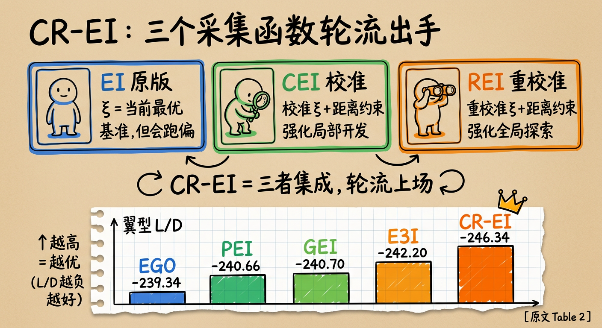

> **指读：** 三人分工——EI 主攻、CEI 守近处、REI 侦远处；右侧比分是后文伏笔。

**(a) CEI — 校准 EI：治瞎逛，强化近处开发**

把尺子从 y_PBS **抬高**到 ξ_Calibrated > y_PBS，重算 z：

**〔式〕** z̃ = (ξ_Calibrated − ŷ(x)) / σ(x)，  CEI(x) = σ(x) (z̃ Φ(z̃) + φ(z̃))

**回译：** 许多原来 z≤0 的点，被抬尺后变成 z̃>0，重新关回"有希望区"。  
再叠加**距离窗** δ₁：只接受落在当前最优点附近的建议（ε < ‖x−x_PBS‖ ≤ d_T 时为 1，ε 常取 0.001 防重复采样）。

**(b) REI — 重校准 EI：治死守小巷，强化远处探索**

**〔式〕** REI(x) = CEI(x) · δ₂(‖x−x_PBS‖)，  δ₂ = 1 − δ₁

**回译：** REI **只**在近处地盘之外取点。δ₁ 与 δ₂ 像两块互补的城区规划——**CEI 管近，REI 管远。**

**(c) 值班经理手册 — CR-EI 调度（原文式 17–18）**

预警线 y_T = 已有样本目标值的**中位数**；计数器 n_Breakthrough 看 EI 是否还在"打破纪录"。

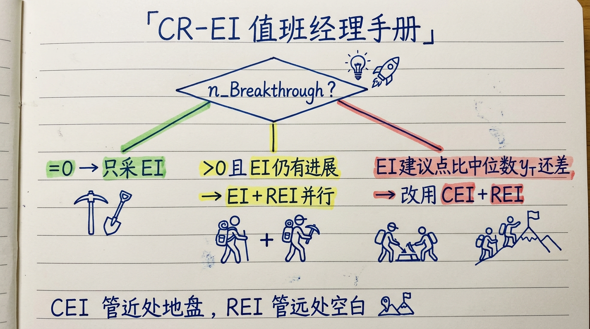

> **指读：** 从上往下互斥优先。绿：EI 正常只采 EI；黄：有进展则 EI+REI 并行；红：EI 建议点比中位数还差 → 判定瞎逛，改 CEI+REI。

1. n_Breakthrough = 0（EI 正常）→ 只采 EI：  
   **〔式〕** x*_new = {x*_EI}  
2. n_Breakthrough > 0（仍有进展）→ EI 与 REI 并行：  
   **〔式〕** x*_new = {x*_EI, x*_REI}  
3. y(x*_EI) ≥ y_T（疑似瞎逛）→ 改 CEI + REI：  
   **〔式〕** x*_new = {x*_CEI, x*_REI}

**餐厅版回扣：**  
EI 像主探路员；REI 是派去河对岸的侦察兵；一旦主探路员开始在工业区空转（建议点还不如半数已吃过的店），经理立刻把主探路员换成"只准在冠军店附近精耕"的 CEI，同时保留远侦察。

> **一句话记住：** EI 顺就让它跑，同时派 REI 远眺；EI 一瞎逛，就换成 CEI 收近 + REI 保远。

**CEI/REI 餐厅排班表：**  
| 角色 | 地盘 | 一句话 |
| CEI | 冠军店附近 | 抬尺，只精耕有希望区 |
| REI | 河对岸 | 保远方选项，防死守小巷 |
| EI | 全局默认 | 正常时主攻 |
经理看中位数预警线：建议点还不如半数已吃过的店 → 判定瞎逛换班。

---

#### 5. 实验验证与量化突破

**先报胜负：** 在 7 个基准和翼型工程题上，CR-EI 相对经典 EI 变体，**更快、更稳、更好**。

**算例一：7 个基准函数**（每算法 20 次独立运行；对手 EGO / PEI / GEI / E3I）

| 函数 | EGO | PEI | GEI | E3I | **CR-EI** |
| :--- | :---: | :---: | :---: | :---: | :---: |
| Shekel4 成功率 | 17/20 | 20/20 | 6/20 | 14/20 | **20/20** |
| Trid10 成功率 | 14/20 | 10/20 | 13/20 | 20/20 | **20/20** |

原文结论：**除 10 维 Trid10 外，CR-EI 在其余 6 个基准上均以更快收敛取得最优**［原文 P01 Table 1 / §4.3］。

**算例二：低速翼型（工程级）**

- 参数化：GAN + UIUC 翼型库，**13 维**；  
- 求解器 XFOIL；Re = 1.8×10⁶、Ma = 0.01、AoA = 0°；  
- 目标：最大化升阻比 L/D（实现为最小化 −L/D）；每组 10 次运行。

| 指标 | EGO | PEI | GEI | E3I | **CR-EI** |
| :--- | :---: | :---: | :---: | :---: | :---: |
| 均值 ± 标准差 | −239.34 ± 8.60 | −240.66 ± 6.41 | −240.70 ± 4.57 | −242.20 ± 4.48 | **−246.34 ± 3.56** |
| 中位数 | −241.44 | −242.74 | −240.82 | −241.92 | **−248.09** |

**体感换算（只读两格就够）：**

- 相对 EGO，平均 L/D 提升 **2.92%**［由 Table 2：(246.34−239.34)/239.34］；  
- 标准差 8.60 → 3.56，**离散度降 58.6%**［由 Table 2］——不是"平均好看一点"，而是**十次里次次更稳**。对要签字画押的工程设计，这比均值更救命。

**参数敏感性：** 距离参数 α、incumbent 参数 β。Camel6 / Hartman6 扫描显示 **β = 0.1 综合最优**；β 越大越抗瞎逛，但搜索区膨胀，过大则约束作废［原文 P01 §4.5］。

**翼型工程读法加长：**  
均值更好：平均 L/D 更香。  
标准差下降：十次独立运行更挤在一起——签字要的是可重复，不是一次运气。  
β=0.1 是综合甜点：越大越抗瞎逛，过大搜索区膨胀约束作废［原文 P01 §4.5］。

---

#### 6. 审稿人批判与承前启后

把软肋放上**可信度刻度**（0 = 完全不信，5 = 可当默认工具）：

| 维度 | 打分 | 人话 |
| :--- | :---: | :--- |
| 机理清晰度 | 4 | z 的故事完整、好讲 |
| 实验充分度 | 4 | 基准 + 翼型，有对照 |
| 超参稳健 | 2 | β、d_T、α 要调；β=0.1 不保证可迁移 |
| 理论保证 | 1 | 无收敛证明 / regret bound |
| 维数外推 | 2 | 天花板约 10 维；真叶栅 100+ 维时 GP 本身先垮 |
| 对 GP 质量依赖 | 2 | ŷ、σ 若糊，调度全糊 |

**可以攻击的点（保留原文力度）：**

1. **超参**：α、d_T、β；d_T 绝对距离、高维下欧氏距离会"挤成一团"。  
2. **无理论保证**。  
3. **维数天花板 ~10**；真叶栅 100+ 维时，"抬 ξ"救不了 GP 失明。  
4. **切换逻辑绑在 GP 质量上**。

**承前：** 站在 EGO 的 EI 上，用"调 incumbent"统一审视 GEI（调 σ 权重）、E3I（Thompson 样本最优当 ξ）、PEI（伪 EI）。

**启后（下一集预告）：**

- **第 02 讲（Filter-GEI）**：值班切换思想，搬进"专家+实习生"多保真并行——反派变成**集群空转**。  
- **第 03–04 讲（GSDE / DA-EGO）**：本讲 10 维天花板撞墙后，高维必须换门庭。  
- **第 08 讲（GTO）**：本讲 GAN 13 维翼型，后面升级为梯度反推的生成式迁移。

**可信度刻度使用说明：**  
4 分机理 = 可以教；2 分超参 = 换题要重调；1 分理论 = 别指望 regret bound。  
10 维天花板写在这里，是为了让你读到 03/04 时知道：不是 CR-EI 变笨，是 GP 舞台塌了。

---

#### 附：三调度口令速查

| 信号 | 动作 |
| :--- | :--- |
| EI 正常 | 只采 EI |
| 仍有突破 | EI + REI 并行 |
| 建议点差于中位数 | CEI 守近 + REI 保远 |

餐厅版：主探路员一进工业区空转，经理立刻换人，远侦察不停。

---

#### 附：从 CR-EI 走向全书

| 下一站 | 你带走的问题 |
| :--- | :--- |
| 02 Filter-GEI | 并行与多保真时，谁配见专家？ |
| 03–04 | 10 维天花板破了怎么办？ |
| 05 | 多保真后期是否开始撒谎？ |
| 06+ | 合法形状与场预测、实验信任 |

本讲是「下一笔预算砸哪」的第一课；后面所有课都在改场景，不改这个母问题。

---

**母问题回声：** 读完任何后讲，用一句话回答「下一笔预算砸哪」。答不出，说明开场母问题断了，请回第 01 讲。

---

#### 附：z 的餐厅速记卡

| z | 人话 | 风险 |
| :--- | :--- | :--- |
| ≫0 | 很有把握不如冠军 | 过度开发 |
| ≈0 | 边界 | 需调度 |
| ≪0 | 几乎只听空白 | **瞎逛** |

治：抬 ξ、近 CEI、远 REI、瞎了换班。

---

**翼型算例的工程读法：** 均值更好是「平均更香」；标准差下降是「十次里更稳」。对要签字的设计，稳往往比均值多 0.1 更救命。数字与出处以 §5 表为准［原文 P01 Table 2］。

**调度树口袋卡：** 绿 EI；黄 EI+REI；红 CEI+REI。口袋卡贴显示器，公式放深潜。

---

#### 附：开场母问题检查单（全书通用）

读完任意后讲，用 30 秒回答：  
1. 本讲的「一次评估」有多贵？  
2. 下一笔预算砸在采样、代理、还是实验？  
3. 失败模式（反派）若赢了，报表会不会仍看起来很绿？  

答不出第 3 问，说明还在被利用率/云图欺骗。

---

#### 章末：30 秒复述 · 自测 · 元数据

**30 秒复述稿（可朗读）：** EI 用 z 在已知好与空白之间折中。z≤0 时约束消失，空白又常是差区，于是瞎逛。CR-EI 不拧 σ 而抬 ξ，CEI 守近、REI 探远，按是否突破中位数换班。翼型上它均值更好也更稳。

**自测（先做再对答案）：**

1. 为什么说 σ 大**不等于**"那里值得去"？  
2. CEI 与 REI 的地盘如何用 δ₁、δ₂ 划分？  
3. 三调度里，哪一条专门对付瞎逛？

<details>
<summary>点开看参考答案</summary>

1. σ 只反映样本稀疏，不反映目标好坏；早期好区被采密后，差区反而更空、σ 更大。  
2. δ₁=1 近处（CEI）；δ₂=1−δ₁ 远处（REI）。  
3. 第 3 条：y(x*_EI) ≥ y_T 时改 CEI+REI。

</details>

> **本讲元数据**（读完再看，不挡故事）
>
> | 项 | 值 |
> | :--- | :--- |
> | 规范编号 | **01** |
> | 原始文献 | *Structural and Multidisciplinary Optimization*, 2021, **64: 3549–3567** |
> | DOI | `10.1007/s00158-021-03038-3` |
> | 作者 | Zhendong Guo, Yew-Soon Ong, Haitao Liu |
> | 本地原文 | `s00158-021-03038-3.pdf` |
> | 证据等级 | **A（本地原文逐句可查）** |
> | 反派绰号 | 瞎逛 |
> | 主比喻 | 30 天找面馆 |

---

<a id="lec-02" name="lec-02"></a>
### 【第02讲】Filter-GEI：老专家与实习生——多保真并行优化怎样把钱花在刀刃上（**论文 02**）

#### 本讲开场 90 秒

**上讲闪回：** 上讲（CR-EI）：EI 会瞎逛；治则是改 ξ、近 CEI 远 REI。值班经理管「下一笔预算砸哪」。

**本讲反派：** 「集群空转」

**只要带走 3 句口诀：**

1. **实习生（LF）铺路，老专家（HF）拍板**
2. **滤波门槛 T 决定谁配见专家**
3. **相关高就严进，相关差就放宽**

**主比喻：** 设计公司：老专家 vs 实习生

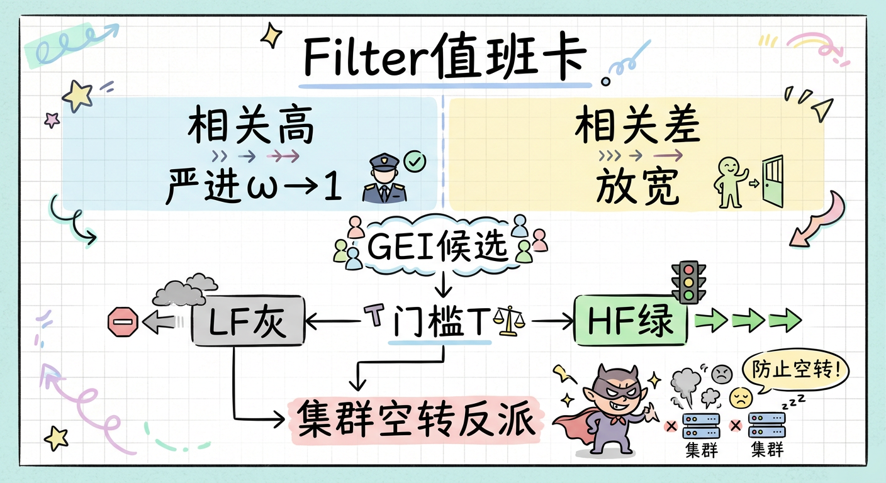

> **指读：** 左列相关高→ω严进；右列相关差→放宽；中间门槛 T 分流 HF/LF。

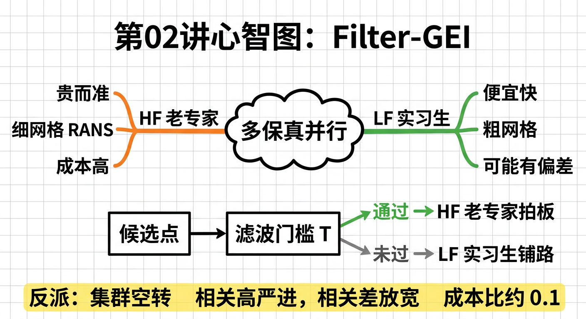

> **看图三秒：** 与技术双图同构——**左**多保真建模（大量 LF× 铺路 + 少量 HF● 校准）；**右**并行批滤波（绿点过门槛 T 入选，灰叉被滤除）；底条口诀「实习生铺路、老专家拍板 / T 决定谁进批 / 相关高严进、相关差放宽 / 别让机房空转」。细节曲线见下节 `filter_gei_multifidelity_parallel_zh`。
**本讲赌注：** 没有门槛的并行，只是让专家更快地淹没在平庸图里。

---

#### 1. 生活与物理直觉引子：老专家与实习生

想象你经营一家设计公司，手下有两类人：

- **老专家**：画图精准、结论可靠，但**时薪 3000 元，一天只能出 1 张图**；
- **实习生**：速度快、一天能出 10 张图，**时薪 300 元**，但图纸常有偏差，只能看个大概趋势。

现在要做一个设计招标。聪明的做法显然不是"所有图都让老专家画"（太贵），也不是"全让实习生画"（不可靠）。你会让**实习生先铺开画一批，把大致方向摸出来；老专家只在最关键的几张图上出手**。

这就是**多保真优化（Multi-Fidelity Optimization, MFO）**的全部思想。在叶轮机械里：

- **低保真（LF）** = 粗网格 CFD（1.2 万单元）、无粘 Euler、二维简化模型；
- **高保真（HF）** = 细网格 RANS（10 万单元）、三维全环、带转捩模型。

本文的工程算例中，**LF 与 HF 的成本比是 0.1**——也就是说，一次高保真的钱能做十次低保真［原文 P02 §4.3］。

**但这里有个二十年的老问题**：每轮迭代里，到底哪些点该让老专家（HF）看，哪些点交给实习生（LF）？这就是本文所说的 **sample assignment（样本分配）问题**。

**把招标周历摊开看一遍（趣味回扣）：**

| 工作日 | 实习生（LF） | 老专家（HF） | 经理在想什么 |
| :--- | :--- | :--- | :--- |
| 周一 | 狂出 10 张草图 | 休息 | 「先把地形摸出来」 |
| 周二 | 再出 10 张 | 挑 1 张精修 | 「只在苗头处砸钱」 |
| …… | …… | …… | 若没有滤波，专家会被灌进一堆平庸图 |

若没有 Filter 那道门槛，并行批次里会混进大量「GEI 看起来花哨、其实不配见专家」的点——机房灯亮着，智慧在空转。这就是反派**集群空转**。

**周历回扣：** 若无 Filter，并行批会塞满「GEI 花哨但不配见专家」的点——灯亮着，智慧空转。

> **先猜后揭：** 若本讲反派「集群空转」赢了，你的下一笔 CFD/实验预算会怎样被浪费？揭晓贯穿 §3–§5。

| 生活元素 | 工程元素 | 符号 |
| :--- | :--- | :--- |
| 主比喻侧 | 低/高保真 | y_LF/y_HF |
| 主比喻侧 | 缩放因子 | ρ |
| 主比喻侧 | 差异函数 | Z_DF |
| 主比喻侧 | 广义EI/幂次 | GEI,g |

**把「时薪」再算一遍（趣味加长）：**  
若招标只要 30 张「可信图」，全专家贵、全实习险。混合策略的关键不是拍脑袋比例，而是**每一张专家图都对应一个过了门槛的理由**——这正是 T 存在的意义。

**失败剧本：** 经理取消滤波器，「GEI 前 10 名全给专家」。两周后专家工位堆满平庸图，实习生反而闲着。机房利用率很高，**有效学习率**很低。这就是集群空转的生活版。

**招标周的正确打开方式：**  
周一 LF 铺图；门槛决定周二专家看谁；周末对照无滤波是否假快速。  
周历本身就是算法。

---

#### 2. 叶轮机械中的真实工程死穴：串行加点浪费了整个机房

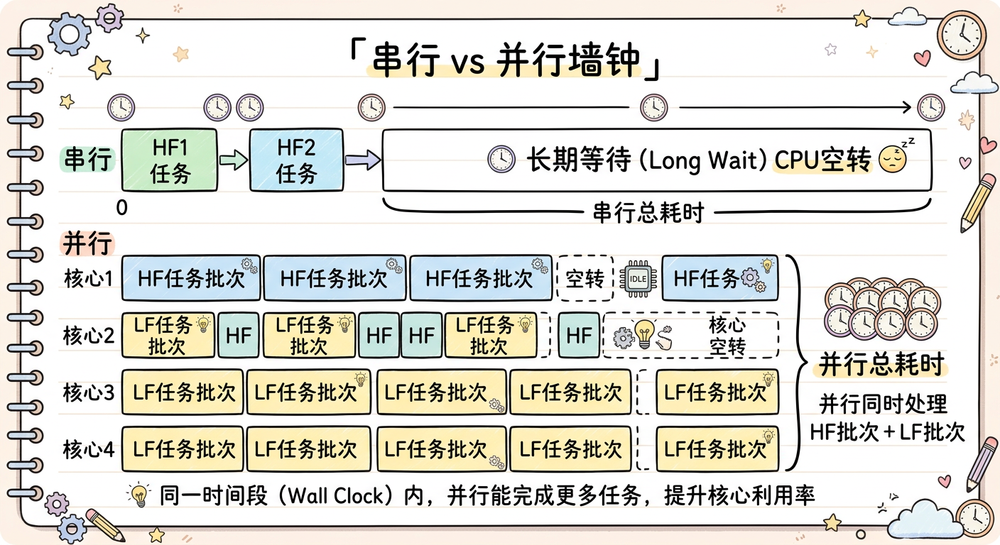

> **指读：** 上条串行等核；下条 HF+LF 同批；空转是调度病。

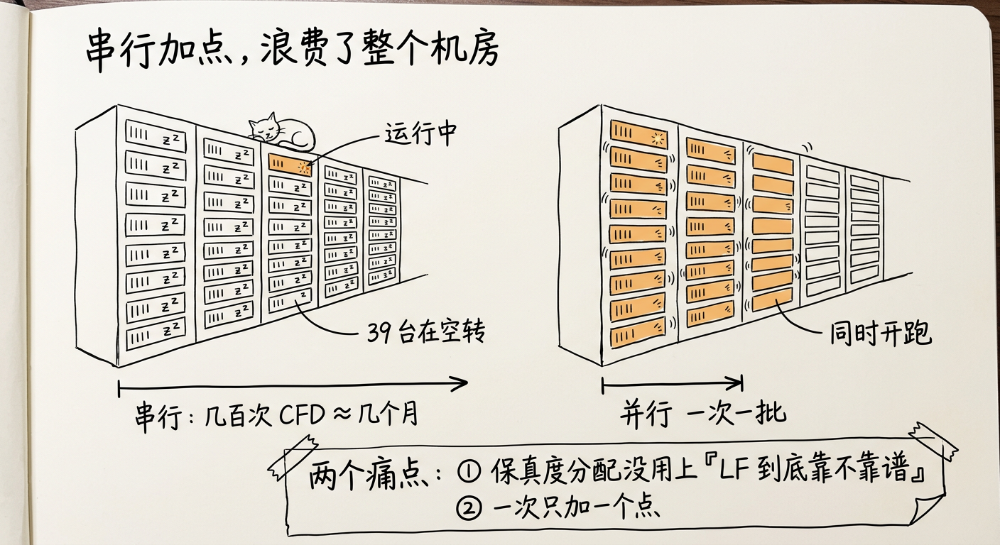

> **指读：** 这张图是本讲工程死穴的一张图版本。

传统的多保真 EGO 类算法（如 augmented-EI、VF-EI）有一个共同特征：**每轮迭代只加一个样本**。

问题在两方面：

1. **贵**：一次 CFD 几小时，一个设计周期几百次调用，串行下来是几个月；
2. **浪费**：现代计算集群一晚上能同时跑几十个 CFD 作业，单点串行加点意味着**大部分核在空转**。

同时，已有算法在决定"这个点用 HF 还是 LF"时，往往只看相似性与成本比，**没有利用"LF 模型到底靠不靠谱"这一关键信息**。本文要解决的，正是这两个痛点：**把保真度分配做对，并且一次分配一批**。

**现场感：** 周五下班前组长要数——你面对的不是可以慢慢推的练习题，而是**算错一次就不可回收**的预算。

**串行 vs 并行的时间线（人话）：**  
串行：HF₁ 完成 → 更新模型 → HF₂ → … 墙钟 ≈ n × t_HF。  
并行（本讲）：同一轮抛出 {HF 批, LF 批}，墙钟 ≈ max(t_HF, t_LF)——前提是足够许可证。  
软肋里「并行收益绑许可证」不是抬杠，是工程事实。

**集群空转的两种形态：**  
1) 算法串行加点，核在等；  
2) 算法并行但无 Filter，HF 批次塞满假尖子，核在忙，智慧仍空转。  
第二种更危险，因为利用率报表是绿的，学习曲线却在骗人。

---

#### 3. 数学公式从 0 到 1 推导

先把公式关掉，用主比喻说一遍：

> **设计公司：老专家 vs 实习生**  
> 本讲反派是「集群空转」。下面公式是这句话的展开；每条核心式尽量带**回译**。知识总量不删——深潜只是阅读路径，不是垃圾桶。

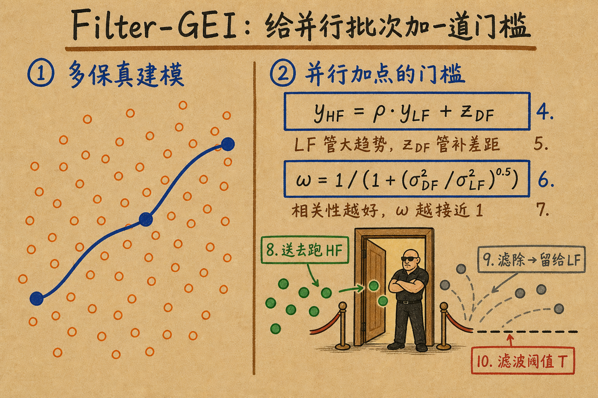

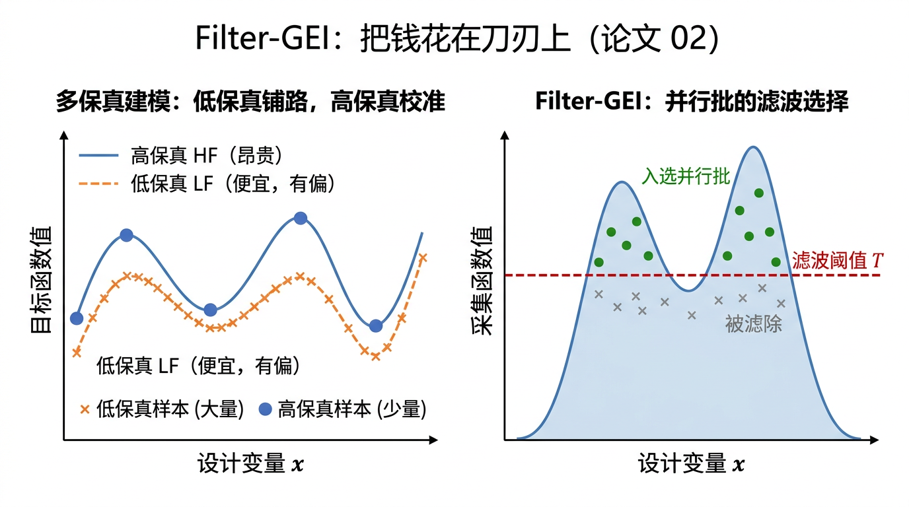

> 上图是本讲全部数学的「一张图版本」：**左图**是多保真建模——低保真模型（橙虚线）便宜但有偏，用大量低保真样本铺路、少量高保真样本（蓝点）校准；**右图**是 Filter-GEI 的并行加点——GEI 值超过滤波阈值 T 的候选（绿点）才入选并行批，其余被滤除（灰叉）。正文推导的 ω/T 公式，改的就是右图这道「门槛」。

##### 3B. 本讲符号卡（建议截图留存）

| 符号 | 人话 | 备注 |
| :--- | :--- | :--- |
| y_LF/y_HF | 低/高保真 | 成本比≈0.1 |
| ρ | 缩放因子 |  |
| Z_DF | 差异函数 | 修正后还差多少 |
| GEI,g | 广义EI/幂次 | g大偏探索 |
| T | 滤波门槛 | 谁配见专家 |
| ω | 相关权重 | 相关高→严进 |

> 🧭 先认符号再读公式；主文核心式有「回译」，装不下的细节仍在正文完整保留（不删知识）。

##### 3C. 主路径公式与推导（知识全保留）

**第一步：多保真代理模型 Co-kriging**

把 LF 与 HF 都当成随机过程：
**〔式〕** Y_LF(x) = μ_LF + Z_LF(x), Y_HF(x) = μ_HF + Z_HF(x)

**回译：** 上式是主路径构件——先记住它在算法里负责哪一步，再抠每一个符号。

关键假设是 HF 可以写成"LF 的缩放 + 一个差异函数"：
**〔式〕** y_HF(x) = ρ·y_LF(x) + Z_DF(x)

其中 ρ 是缩放因子，Z_DF 是差异函数（discrepancy function），专门负责刻画"LF 修正后仍与 HF 差多少"。这样，**LF 负责大趋势，DF 负责补差距**，两套高斯过程拼成一个联合协方差矩阵（原文式 4–6）。

**第二步：基线采集函数 GEI（广义期望改善）**

经典 EI 有个毛病：太贪恋当前最优附近。Schonlau（1997）把它推广为带幂次 g 的 GEI：
**〔式〕** E[I(x)^g] = s^g∑_{k=0}^{g}(-1)^kC(g, k)u^{g-k} T_k, u = (f_min-ŷ(x))/(s(x))

**〔式〕** T₀ = Φ(u), T₁ = -φ(u), Tₖ = -u^{k-1} φ(u) + (k-1)T_{k-2}

**g 越大，越偏向全局探索；g=1 时退化为经典 EI。** 取若干个不同的 g，就同时得到一批"有的爱开发、有的爱探索"的候选点——这天然适配并行加点。

**第三步：核心创新——给 GEI 装一个"滤波器"（原文式 10–12）**

定义一个阈值：
**〔式〕** T = ω·y_HF-min + (1-ω)·y_HF-mean

其中 y_HF-min 是当前最优，y_HF-mean 是历史加权平均：
**〔式〕** y_HF-mean = (1)/(iter)∑_{i=0}^{iter}((1)/(nᵢ)∑_{j=1}^{n}_iy_HF-ij)

而权重 ω **由 HF 与 LF 的相关性自适应决定**——这是全文最漂亮的一笔：
**〔式〕** ω = (1)/(1 + (σ̂²_DF/σ̂²_LF)^{0.5})

**物理含义请务必记住：**

- 当 **LF 与 HF 高度相关**时，差异函数 Z_DF 的方差 σ̂²_DF 相对很小 → 分母趋近 1 → **ω→1** → 阈值 T 贴近当前最优值 y_HF-min → **只有非常好（优于 T）的点才配用 HF**，采样极度聚焦于局部开发。
- 当 **LF 与 HF 相关性差**时，σ̂²_DF 大 → ω 变小 → 阈值 T 贴近历史均值 → **HF 的投放区域被放大**，避免在不可信的 LF 引导下钻牛角尖，转而加强全局探索。

**第四步：候选点去重叠**

不同 g 给出的候选点可能重合，直接一起投进 Co-kriging 会让协方差矩阵病态。本文用层次聚类（逐个合并距离最小的一类，直到类间最小距离大于阈值 d_T）把重叠点聚掉。

---

#### 4. 算法控制流

> 🧭 **值班手册：** 先看「什么情况下走哪条分支」，公式是对白速记不是主角。

```

每轮迭代：
  1. 用现有 HF + LF 样本拟合 Co-kriging 代理
  2. 用多个不同 g 的 GEI，生成一批候选点（既含开发点，也含探索点）
  3. 层次聚类去掉重叠候选点
  4. 计算自适应权重 ω = 1/(1+ (σ²_DF/σ²_LF)^0.5 )
  5. 计算阈值 T = ω·y_HF-min + (1-ω)·y_HF-mean
  6. 分流：
       预测值优于 T 的候选点  → 送 HF 仿真（贵，但值得）
       其余候选点            → 送 LF 仿真（便宜，用于全局探索+降不确定性）
  7. 一批 HF 与一批 LF 样本同时提交，并行计算

```

> **一句话记住**：**GEI 负责"去哪儿采"，滤波器负责"花多少钱采"。**

**主比喻回扣：** 把上面的分支再翻译成「设计公司：老专家 vs 实习生」——若某步在生活里说不通，多半是符号没对齐。

**并行批的现场约束清单：**  
- 许可证 ≥ 批大小？否则自动降批。  
- LF/HF 网格与求解器队列是否两条线？  
- 相关 ω 是否每轮重算，还是冻结了过期相关？  
门槛 T 在许可证不足时**仍然值钱**：它决定稀缺的 HF 名额给谁。

---

#### 5. 实验验证与量化突破

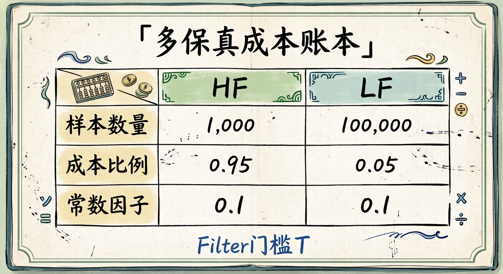

> **指读：** 成本比折算后，多花的 LF 是否换来更好的 HF 最优——读表先问假快速。

**先报胜负：** 先读结论句与最大那一格，再读全表；表是证据架不是背诵清单。

**算例一：5 个基准函数**（Forrester1a/1b、Hartman3+MA3、Ackley5+MA5、Hartmann6+MA6，最高 6 维；初始样本 HF=3×维数、LF=6×维数；统一用开源 ooDACE 工具箱）

| 观察点 | 结果 |
| :--- | :--- |
| HF 样本消耗 | Filter-GEI 在 5 个算例上**始终用最少的 HF 样本**取得有竞争力的最优解；无滤波的 GEI-MFO 需要"significantly more HF samples"（原文自评用语，未给具体倍数）［原文 P02 §4.2］ |
| 迭代次数 | 由于每轮并行加多样本，Filter-GEI 与 GEI-MFO 的迭代次数**远少于**单点的 EI-MFO |
| 成功率 | Filter-GEI **5 个算例全部成功**；VF-EI 在 5 维 Ackley5 上仅 **12/20**；augmented-EI 在 6 维 Hartman6 上仅 **12/20** |
| 稳定性 | Filter-GEI 迭代次数波动**明显小于** VF-EI 与 augmented-EI |

［以上均出自原文 P02 §4.2 与 Table 4］

**算例二：GE-E3 涡轮静子叶片气动优化（工程级）**

- 设计变量：**7 个**几何参数；HF 网格 100,701 单元，LF 网格 12,141 单元；
- 初始样本 42 LF + 21 HF（最近邻采样），终止条件为**再消耗 35 个 HF 样本**；独立运行 5 次；
- 代理模型交叉验证 CV-R² **全部 > 0.85，多数 > 0.95**［原文 Table 7］，说明 Co-kriging 拟合可信。

| 算法 | 达到最优所需迭代数 | 最优值(%) 均值±标准差 | LF 样本消耗 |
| :--- | :---: | :---: | :---: |
| **Filter-GEI** | **13 ± 1** | **2.720 ± 0.0245** | 91 ± 10 |
| GEI（无滤波） | 8 ± 0 | 2.760 ± 0.0224 | 79 ± 2 |
| EI | 36 ± 0 | 2.732 ± 0.0192 | 77 ± 0 |
| VF-EI | 45 ± 3 | 2.748 ± 0.0239 | 51 ± 3 |
| augmented-EI | 51 ± 6 | 2.726 ± 0.0358 | 59 ± 9 |

［原文 P02 Table 8］

**怎么读这张表（很关键，别读错）：**

- **GEI 只用了 8 次迭代就"收敛"了，但收敛到的是最差的最优值 2.760**——没有滤波器时，HF 被挥霍在不太有希望的点上，看似快，实则跑偏。
- **Filter-GEI 用 13 次迭代拿到全场最好的 2.720**，而且**Min 值 2.70 是全场最低**。
- 相比串行的 EI / VF-EI / augmented-EI（36 / 45 / 51 次迭代），Filter-GEI 的迭代次数**只有它们的 1/3 左右**——这正是并行加点的直接收益。
- 代价是：**用了更多 LF 样本（91 vs 79）**。但按 0.1 的成本比折算，多花 12 次 LF ≈ 1.2 次 HF 的钱，换来最优值从 2.760 降到 2.720，这笔账是划算的。

**体感换算：** 把关键数字换成「工程师的周/月」或「一次签字的风险」——数字才进长期记忆。若原文给了墙钟时间或成本比，优先用原文换算。

**账本精读（再钉一次）：**  
无滤波 GEI：迭代 8，最优 2.760（差）。Filter-GEI：迭代 13，最优 2.720（好）。  
慢 5 轮迭代，换的是**不跑偏**。相对串行 36–51 轮仍是断崖优势。读表先问「快是真快还是假快」。

---

**值班经理对照第 01 讲：** 01 看是否瞎逛；02 看 LF 还准不准。都是自适应指标，旋钮从 ξ 换成 ω–T。

#### 6. 审稿人批判与承前启后

把软肋放上**可信度刻度**（0=完全不信，5=可当默认工具）：

| 维度 | 打分 | 人话 |
| :--- | :---: | :--- |
| 机理 | 4 | ω–T 好讲 |
| 实验 | 4 | 基准+静子 |
| 超参 | 3 | d_T/g 集 |
| 理论 | 2 | 启发式 |
| 维数 | 2 | ≤7 维 |
| 成本比入模 | 2 | 未进公式 |

**可以攻击的点：**

1. **"并行"是算法层面的并行，实验是串行模拟的**。真拿到工程现场，收益取决于你有多少个 CFD 许可证/核；很多单位恰恰卡在许可证数量上。
2. **成本比没有进入公式**。ω 只用了方差比 σ̂²_DF/σ̂²_LF，**没有把 LF/HF 的实际成本比纳入**。本文工程算例的成本比恰好是 0.1；若 LF 也很贵（成本比接近 1），多投 LF 的滤波策略就不一定划算了。
3. **阈值与权重的启发式本质**。T 取"最优值与加权均值的凸组合"缺乏最优性证明；ω 的自适应也只有定性论证。
4. **维数量级有限**：基准最高 6 维，工程算例 7 维。真正的多级叶栅是 100+ 维（见**论文 07**），Co-kriging 在高维下的建模能力本身就是瓶颈。
5. **隐含前提"LF 大体能捕捉 HF 趋势"**。一旦这个前提在某块区域失效，滤波器反而会把 HF 集中投到被 LF 误导的区域——这正是**论文 13（EMFS / MSFO）**要处理的问题。

**承前：** 建立在 Co-kriging（Forrester et al. 2007）与 GEI（Schonlau 1997）之上，思想直接继承自同组前作 **论文 01（CR-EI）**——"用一个自适应指标来决定这一轮怎么采样"。

**启后：**
- **论文 13（EMFS / MSFO）**：正面处理"LF 在某些区域反而误导优化"的场景，用 DBSCAN 找出多保真代理建不准的区域，在那里改建单保真代理；
- **论文 07（GSDE）**：把优化从"低维多保真 + 贝叶斯"推进到"126 维 + 代理辅助进化"；
- **论文 11（DA-EGO）**：把"自适应分配"从**保真度维度**迁移到**子空间维度**。

---

**Table 8 再读（防假快速）：**  
无滤波 GEI：迭代少、最优差。  
Filter-GEI：迭代略多、最优好。  
串行基线：迭代是三倍级。  
读表顺序：最优值 → 是否跑偏 → 迭代 → LF 成本折算［原文 P02 Table 8］。

---

#### 附：Filter 值班卡（可打印）

| 本轮信号 | 经理口令 | 对应公式角色 |
| :--- | :--- | :--- |
| LF–HF 相关很高 | 「严进：只有尖子见专家」 | ω→1，T 贴 y_HF-min |
| LF–HF 相关崩了 | 「放宽：专家多看全局」 | ω 变小，T 贴均值 |
| 候选点扎堆 | 「层次聚类去重叠」 | 防协方差病态 |
| 集群有空核 | 「HF 批 + LF 批同时交」 | 反派集群空转的直接解药 |

**和 CR-EI 的对照表（请钉在显示器边）：**

| | 第 01 讲 CR-EI | 第 02 讲 Filter-GEI |
| :--- | :--- | :--- |
| 反派 | 瞎逛 | 集群空转 |
| 自适应旋钮 | ξ（尺子） | ω–T（门槛） |
| 并行？ | 近 CEI + 远 REI 可并行 | **HF 批 + LF 批** 并行 |
| 多保真？ | 通常单保真 GP | Co-kriging 标配 |

**成本比 0.1 的心算模板：**  
多花 Δn_LF 次低保真 ≈ 0.1·Δn_LF 次高保真。  
若最优值从 2.760 降到 2.720，问自己：这 0.040 个点，值不值那 1.2 次 HF 的钱？——原文 Table 8 的答案是值［原文 P02 Table 8］。

**读表口诀：** 先看最优值，再看迭代数，最后看 LF 消耗。无滤波 GEI「迭代少但最优差」= **假快速**。

---

#### 附：并行加点的许可证现实

算法说「一批 HF + 一批 LF」时，现场常卡在：

- CFD 许可证数 < 批大小；  
- 队列策略把并行拆回串行；  
- LF 与 HF 网格流程不共享，调度摩擦大。

**所以 §6 软肋不是抬杠：** 并行收益是「算法可达上限 × 许可证可达上限」的乘积。Filter 仍值得做——即使批变小，**门槛 T 依然决定谁配见专家**。

---

#### 附：相关高/低的经理台词

| 相关 | 台词 | T 行为 |
| :--- | :--- | :--- |
| 高 | 「只有尖子见专家」 | 严，贴最优 |
| 低 | 「专家多看全局，防被带沟」 | 松，贴均值 |

---

#### 附：Filter-GEI 上线前 10 分钟检查

1. 成本比是否仍约工程设定量级（本文算例 0.1）［原文 P02 §4.3］？  
2. ω 是否每轮更新？冻结相关会让门槛过时。  
3. 批大小是否超过许可证？超过则降批，**不降门槛逻辑**。  
4. 对照无滤波 GEI：若「更快但更差」，记为假快速案例。  
5. 相关崩塌时，HF 批是否自动放大探索——对应 ω 变小。

**经理一句话：** GEI 找点，Filter 分钱；并行是手段，不跑偏才是目的。

---

#### 图卡：许可证墙

算法批大小 × 许可证/队列可达 = 实际墙钟收益。批可变小，**门槛 T 逻辑不降**——Filter 仍决定谁配见专家。

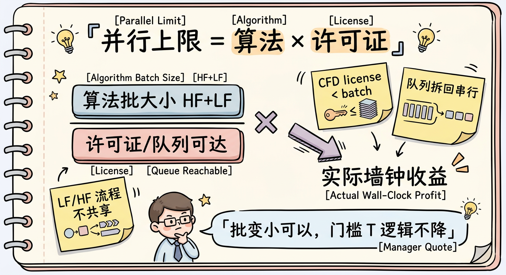

---

#### 图卡：ω–T 松紧旋钮

ω 高 → T 严（只有尖子见专家）；ω 低 → T 松（专家多看全局防带沟）。GEI 找点，Filter 分钱。

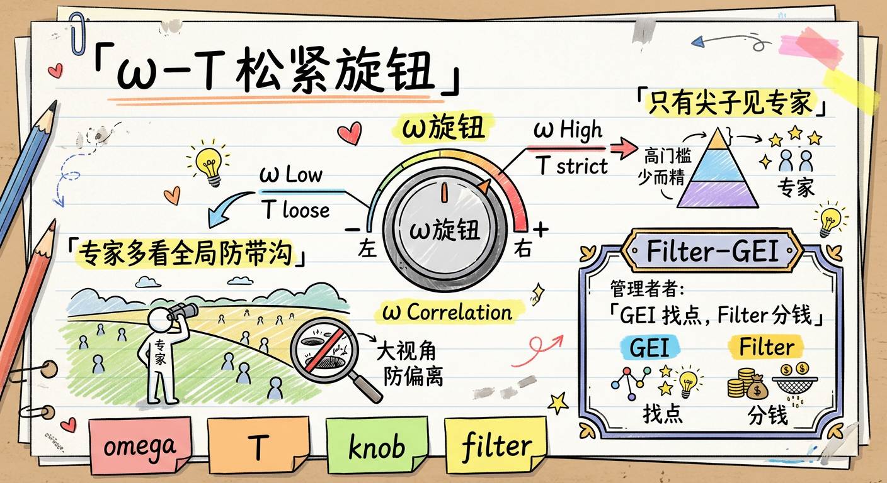

---

#### 图卡：假快速

迭代少但最优差 = 假快速。读表口令：先看最优值，再看迭代数，最后看 LF 消耗；无滤波 GEI 常栽在这里。


---

#### 章末：30 秒复述 · 自测 · 元数据

**30 秒复述稿（可朗读）：** 多保真是实习生铺路、专家拍板。Filter-GEI 用多 g 的 GEI 出一批点，门槛 T 分流 HF/LF；ω 听相关——高严进、差放宽。静子上它比无滤波更不跑偏，比串行少大量轮次。反派是集群空转。

**自测（先做再对答案）：**

1. 成本比0.1意味？多12次LF≈几次HF？
2. T变严HF怎样？谁拧松紧？
3. 相关差为何放宽T？

<details>
<summary>点开看参考答案</summary>

1. 一次HF≈十次LF；12次LF≈1.2次HF。
2. 更少点见专家；ω→1时T贴最优。
3. LF不可信时严进会被假尖子骗；放宽让HF看全局。

</details>

> **本讲元数据**（读完再看，不挡故事）
> | 项 | 值 |
> | :--- | :--- |
> | 规范编号 | **02** |
> | 原始文献 | *Structural and Multidisciplinary Optimization*, 2021, **64: 1457–1468** |
> | DOI | `10.1007/s00158-021-02931-1` |
> | 作者 | Zhendong Guo, Qineng Wang, Liming Song, Jun Li（西安交通大学） |
> | 本地原文 | `s00158-021-02931-1.pdf` |
> | 证据等级 | **A（本地原文逐句可查）** |
> | 反派绰号 | 集群空转 |
> | 主比喻 | 设计公司：老专家 vs 实习生 |

---

<a id="lec-03" name="lec-03"></a>
### 【第03讲】GSDE：126 维的奇迹——为什么贝叶斯优化在高维叶栅面前必须让位（**论文 07**）

#### 本讲开场 90 秒

**上讲闪回：** Filter-GEI 把便宜评估用起来；维度 100+ 时 GP 先失明。第01讲 10 维天花板，本讲正面撞上。

**本讲反派：** 「维数灾难」

**只要带走 3 句口诀：**

1. **高维别硬上 Kriging**
2. **RBF 像橡胶膜，一次解线性系统**
3. **约一成预算换接近 DE 的增益（1500/20000，+1.104%/+1.115%）［原文 P07 Table 3］**

**主比喻：** 多排叶片是一支必须一起训练的队伍

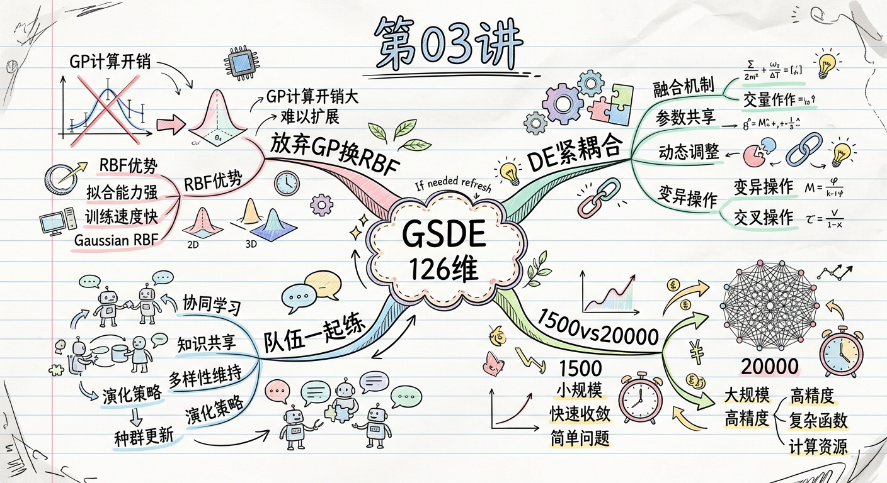

> **看图三秒：** 中心 GSDE（126 维名义空间）；四支——放弃 GP 换 RBF、DE 紧耦合、7 排一起练（18×7=126）、预算约 1/13（［原文 P07 Table 3］1500 vs 20000 次 CFD）；底条反派「维数灾难 + 评估太贵」。
**本讲赌注：** 在 126 维上硬上 GP，会先失明再空转；不换路线就只是在调一个看不见的核。

---

#### 1. 生活与物理直觉引子：为什么不能"一排叶片一排叶片地优化"


> **指读：** 排间传球（尾迹/旋流）改了，单排最优作废。

先建立一个物理直觉。**压气机不是一个叶片在战斗，而是一支队伍在战斗。**

空气从第 1 排叶片流过时，会在出口留下"尾迹"和"旋流"；第 2 排叶片吃到的，正是被第 1 排搅过的气流。如果你把第 1 排单独优化到极限，第 2 排的进口条件就变了，它的最优形状也随之改变——反过来又影响第 1 排。

这就是为什么原文强调：**为充分考虑叶片排与级之间的相互作用，两级以上的叶栅必须同时优化**［原文 P07 摘要］。

代价是变量数的爆炸。先把**被计数的对象**钉死，再谈算法——否则「18 维」「126 维」只是口号。

**① 几何对象**［原文 P07 §Geometry definition / Blade parameterization］

- 一台 **3.5 级**压气机：进口导叶 **S0** + 三个低压级 **R1/S1、R2/S2、R3/S3**，共 **7 排叶片**。
- **级 ≠ 排**：一对「转子+静子」常称一级；此处 3.5 级 = 1 排导叶 + 3 个完整级，排数跟原文，不靠常识瞎加。
- 优化对象是各排叶片的三维形状（NURBS 截面 + 积叠），7 排**同时**进同一个设计向量。

**② 单排 18 维怎么来？**（计数单位 = 优化器接收的**独立标量**，不是图上的点数）［原文 P07 Blade parameterization；Table 2］

> **口径警告：** 控制点是几何操纵对象；**设计变量**才是维数。一点可以固定（0 维）、只沿法向动（1 维）、或不进优化向量。

| 块 | 原文设定 | 独立标量 |
| :--- | :--- | ---: |
| 截面 | 根 / 中 / 尖 共 3 个二维截面，蒙皮成三维叶片 | — |
| 只动哪面 | **只调吸力面**（压力面不动）［原文］ | — |
| 每截面控制点 | 吸力面 **7** 点：前缘、尾缘**固定**；其余 **5** 点沿拟合曲线**法向**主动移动；每点 **1** 标量 | 3×5 = **15** |
| 积叠（弯/掠） | **中**截面**周向**平移 1 + **尖**截面**周向**平移 1 + **尖**截面**轴向**平移 1 | **3** |
| **单排合计** | 原文：*18 design variables … each blade* | **15+3 = 18** |

旧讲义曾缩写成「根/中/尖各 5 点 + 周向平移 + 轴向平移」，字面 5×3+1+1=**17≠18**——是把 **3 个积叠标量**收成两个词的**转述错误**，不是原文少一维。已按 PDF 纠正。

**③ 整机 126 维**

原文直接写明：7 排 × 每排 18 = **126** 个设计变量（**名义**输入维）［原文 P07 Blade parameterization / 摘要 *126 variables*］。  
乘法前提（原文均满足）：7 排都优化、每排同构 18、无跨排共享、此处未改报「有效自由度」。

**〔式〕** 单排 18（标量）× 7 排 = **126 维**名义设计空间［原文 P07］

而一个设计周期里，你**只负担得起几百到几千次 CFD**［原文 P07 摘要］。126 维里撒 1000 个点，平均每维约 1000^(1/126)≈1.056 份——**比「每个方向一分为二」还稀**。

这就是所谓**高维昂贵黑箱（High-dimensional Expensive Black-box, HEB）**问题。

**量级感再钉一根钉子：**

一次 3.5 级压气机 CFD ≈ **1–1.5 小时**［原文 P07］。  
DE 要两万次量级，就是两个月量级的墙钟时间；GSDE 用约 1500 次，大约一周。  
你不是在省「几次点击」，你是在省**工程师的整个季度**。

队伍比喻回扣：第 1 排改理想、第 2 排入口就变了——**单独优化每一排，在物理上就是做错题**。

**量级钉：** 单次CFD约1–1.5小时。DE两月，GSDE约一周——省的是工程师的季度。

> **先猜后揭：** 若本讲反派「维数灾难」赢了，你的下一笔 CFD/实验预算会怎样被浪费？揭晓贯穿 §3–§5。

| 生活元素 | 工程元素 | 符号 |
| :--- | :--- | :--- |
| 主比喻侧 | 维度126 | D |
| 主比喻侧 | 三次RBF | φ(r)=r³ |
| 主比喻侧 | DE参数 | F,CR |
| 主比喻侧 | 种群 | N |

**队伍训练的反例：**  
「先把第 1 排优化到头再冻住」像让前锋单练冲顶却不让中场传球——进口边界一变，单排最优作废。两级以上必须同时优化，是流动耦合硬约束［原文 P07 摘要］。

**126 维体感：** 想「7 个人各 18 个动作要领，同一套战术」；代理是陪练，CFD 是正式出场次数。

**126 维的第二个类比：**  
不是 126 个独立旋钮，而是 7 排叶片的联合战术板。  
改第 1 排出口，第 2 排进口边界条件改写——单独最优是物理错题。  
GSDE 用 RBF+DE 紧耦合，是因为 GP 在这个维度上先失明。

**队伍战术板（加长）：**  
7 排叶片像 7 个位置：前锋的冲顶依赖中场传球角度。  
你把第 1 排「优化到头」并冻结，等于让前锋在错误传球线路上练一百次——第 2 排进口旋流一变，单排最优当场作废。  
原文坚持两级以上必须同时优化，不是方法论偏好，是流动耦合的硬约束［原文 P07 摘要］。

**126 维的第三个体感：**  
1000 个点摊在 126 维，每个方向约 1000^(1/126)≈1.056 份——连「一分为二」都做不到。  
这时还问 GP「哪里不确定」，答案本身就不可信。

---

#### 2. 叶轮机械中的真实工程死穴：高斯过程在高维下会"失明"

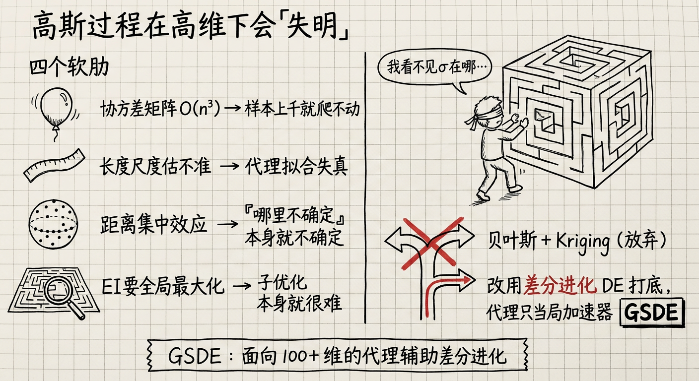

> **指读：** 这张图是本讲工程死穴的一张图版本。

第 01 讲的 CR-EI、第 02 讲的 Filter-GEI 都建立在**高斯过程（Kriging）**之上。它们很优雅，但有个致命的软肋：

| 问题 | 后果 |
| :--- | :--- |
| GP 的协方差矩阵随样本数 n 呈 O(n³) 增长 | 样本上千就非常慢 |
| 高维下核函数的长度尺度难以估计 | 代理模型拟合失真 |
| 高维下"距离"失去区分度（距离集中效应） | "哪里不确定"这件事本身就不确定了 |
| EI 类采集函数需要在整个空间上全局最大化 | 高维下这个子优化本身就很难 |

所以本文做了一个**路线选择**：**放弃贝叶斯优化框架，改用进化算法（差分进化 DE）打底，把代理模型作为"局部搜索加速器"嵌入进去。** 这就是 GSDE（Generalized Surrogate-assisted Differential Evolution）。

**现场感：** 周五下班前组长要数——你面对的不是可以慢慢推的练习题，而是**算错一次就不可回收**的预算。

**为何 GSDE「不时髦也选 RBF」：** GP 的 O(n³)、高维核长度尺度、距离集中、EI 子优化——四只钉子。RBF 一次解线性系，是工程上的少即是多。

**GP 四软肋 → GSDE 四对策（对照表）：**

| GP 软肋 | 后果 | GSDE 对策 |
| :--- | :--- | :--- |
| O(n³) 协方差 | 样本上千训练炸 | 局部 RBF，一次解线性系 |
| 高维长度尺度难估 | 拟合失真 | 不抠核超参，橡胶膜直接铺 |
| 距离集中 | 「不确定在哪」失效 | 代理嵌入 DE 生成基因，不靠全局 EI 寻峰 |
| EI 子优化也难 | 采集函数本身卡死 | 进化 + 有限真 CFD 名额 |

选 RBF 不是赶时髦，是工程上的少即是多。

---

#### 3. 数学公式从 0 到 1 推导

先把公式关掉，用主比喻说一遍：

> **多排叶片是一支必须一起训练的队伍**  
> 本讲反派是「维数灾难」。下面公式是这句话的展开；每条核心式尽量带**回译**。知识总量不删——深潜只是阅读路径，不是垃圾桶。

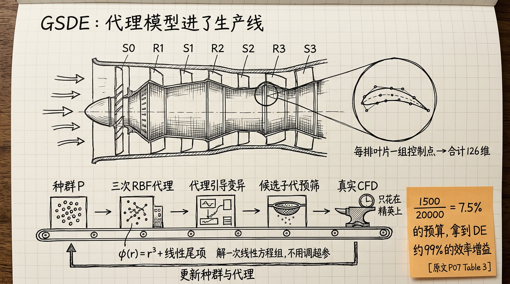

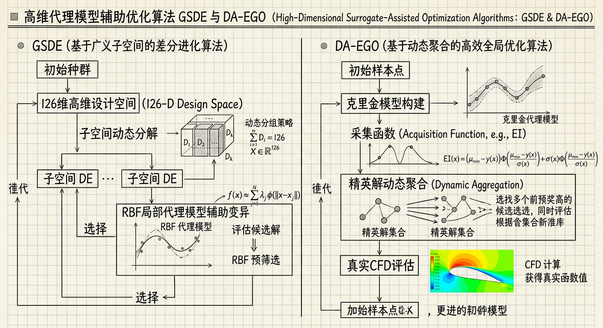

> 上图左半支是本讲（GSDE）的路线：**放弃贝叶斯、拥抱进化**，代理模型直接参与生成子代基因；右半支是第 04 讲（DA-EGO）的路线：**把高维切成低维子空间，各自优化后再用精英点聚合**。两条路线是对同一个难题的两种回答。

##### 3B. 本讲符号卡（建议截图留存）

| 符号 | 人话 | 备注 |
| :--- | :--- | :--- |
| D | 维度126 | 7排×18 |
| φ(r)=r³ | 三次RBF | 橡胶膜 |
| F,CR | DE参数 | 0.3/0.9 |
| N | 种群 | 50 |
| x_i^* | 预测父点 | 局部RBF+PSO |
| T=9 | 每轮真CFD名额 |  |

> 🧭 先认符号再读公式；主文核心式有「回译」，装不下的细节仍在正文完整保留（不删知识）。

##### 3C. 主路径公式与推导（知识全保留）

**第一步：为什么代理模型换成 RBF**

原文指出：在高维设计空间，RBF 的预测精度强于其他常见代理，且训练时间随变量数增长仍可接受。GSDE 采用**三次 RBF + 线性多项式尾项**：
**〔式〕** f̂(x_new) = ∑_{i=1}^{n}λᵢ φ(‖x_new-xᵢ‖) + p(x_new)

**回译：** 上式是主路径构件——先记住它在算法里负责哪一步，再抠每一个符号。

**〔式〕** φ(r) = r³, p(x) = ∑_{i=1}^{D} b_i xᵢ + a

待定系数共 n+D+1 个（λ₁…λ_n, b₁…b_D, a），由一个线性方程组**一次性解出**（不需要迭代优化超参数，这正是 RBF 在高维工程场景的实用之处）：

分块线性系统 Φλ + Pc = F，P^T λ = 0，其中核矩阵 Φ_ij = φ(‖x_i − x_j‖)，P 为多项式基矩阵，λ 与 c 为待定系数。

**第二步：策略一——代理引导的差分进化（GSDE 的核心）**

经典 DE 的 best/1 变异是：
**〔式〕** vᵢ = x_best + F(xᵣ₁-xᵣ₂), N = 50, F = 0.3 （默认）

GSDE 的关键改动是**给每个父代点 xᵢ 建一个局部 RBF**：

- 训练点取距 xᵢ 最近的 5× D 个样本（126 维时即 630 个）；
- 局部区域半径**自适应**：

**〔式〕** rᵢ = 0.5 D_{i,max}√\[D\]((N-1)/(D))

其中 Dᵢ,max 是 xᵢ 到其他父代点的最大距离——**维数 D 越高，这个根式越接近 1，半径越大**，这正是对高维稀疏性的补偿；
- 用 PSO（种群 50、迭代 100 次）在这个局部 RBF 上找出**预测父点** xᵢ^*。

然后做**指数交叉**，把变异点与预测父点缝合成候选个体：

二项式交叉（默认 CR=0.9）：从随机维 j_rand 起，若 rand[0,1] ≤ CR 则取试验分量 v_i,j，否则保留预测父点分量 x*_i,j，记作 
**〔式〕** uᵢ = Crossover(vᵢ, x*ᵢ; CR = 0.9)

> **请特别注意这里的设计哲学**：在传统"DE + 代理"的松散耦合里，代理模型只用来**筛选**已经生成的候选点；而在 GSDE 里，代理模型**直接参与生成子代的基因**——xᵢ^* 的某些维度会直接进入下一代。原文说得很明确：这种"紧耦合（tight form）"正是 GSDE 在高维下仍能表现良好的特殊之处［原文 P07 §Proposed algorithm］。

**第三步：策略二——基于父代的选择（省下真金白银）**

每轮生成的候选点如果全做 CFD，开销受不了。GSDE 的办法是：**按父代适应度给候选点排序，只挑前 T=9 个去做真实 CFD**。理由是"优秀父代产生的子代更可能携带好基因"。这 9 个子代随后替换父代中最差的 9 个点。

**第四步：策略三——基于代理的局部搜索（并行进行）**

在当前最优点 x_best 附近再建一个局部 RBF，用 PSO 找局部最优：
**〔式〕** x* = argmin f̂_RBF(x), x ∈ [x_best-Δ, x_best + Δ]∩[lb, ub]

其中 Δ 取"x_best 到训练点中适应度最差者距离"的一半。若 x* 优于 x_best 就替换它。

**这三条策略是并行执行的**——这是 GSDE 适配真实计算集群的工程设计。

---

#### 4. 算法控制流

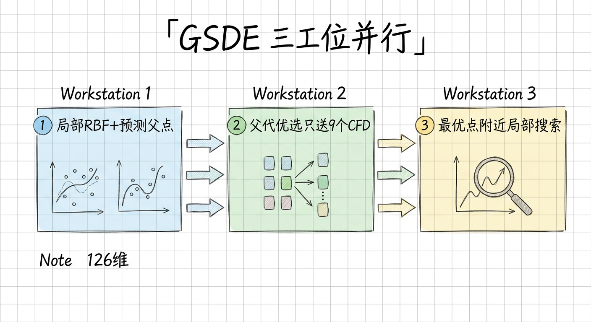

> **指读：** ①局部RBF出预测父点 ②父代优选只送有限真CFD ③最优点附近局部搜索——三路并行。

> 🧭 **值班手册：** 先看「什么情况下走哪条分支」，公式是对白速记不是主角。

```

初始化：采样 → 建 RBF 代理
每轮迭代（三路并行）：
  ① 代理引导差分进化
       对每个父点 xi：
          局部 RBF（5D 个最近邻点，半径 ri 自适应）
          PSO 在局部 RBF 上求预测父点 xi*
          best/1 变异 vi = x_best + F(x_r1 - x_r2)
          指数交叉 vi 与 xi* → 候选 ui
  ② 基于父代的选择
          按父代适应度给所有 ui 排序，只取前 T=9 个送真实 CFD
          用这 9 个子代替换父代中最差的 9 个
  ③ 基于代理的局部搜索（并行）
          在 x_best 附近建局部 RBF，PSO 求 x*，优于 x_best 则替换

```

> **一句话记住：** 高维别硬上 Kriging；进阶：RBF 像橡胶膜，一次解线性系统。

**主比喻回扣：** 把上面的分支再翻译成「多排叶片是一支必须一起训练的队伍」——若某步在生活里说不通，多半是符号没对齐。

**三工位并行的集群含义：**  
工位①生成候选基因；工位②只让前 T 个做真 CFD；工位③在精英附近局部挖。  
墙钟接近「最慢工位」，而不是三工位串行相加——前提是许可证与队列允许。  
**回扣：** 维数灾难的解药不只是数学，也是调度。

---

#### 5. 实验验证与量化突破

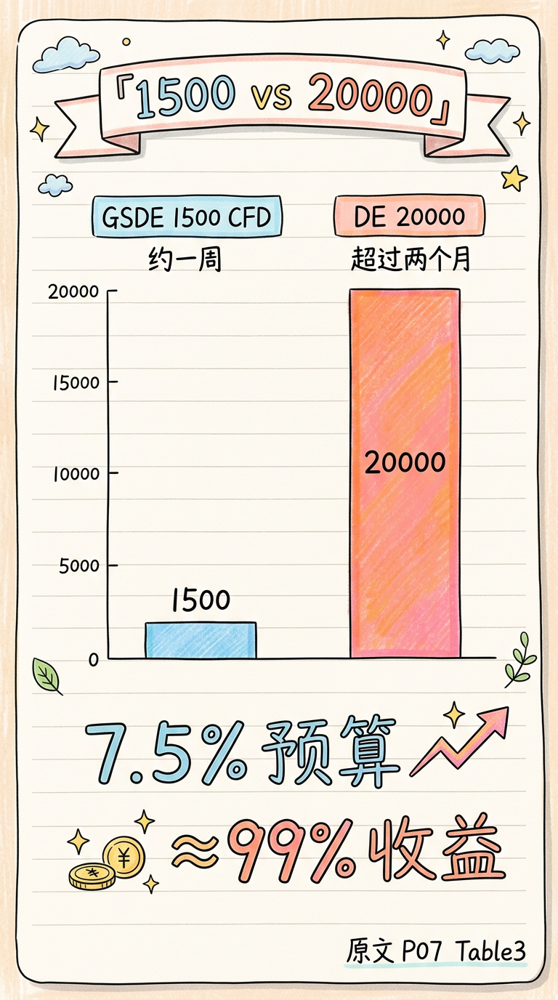

> **指读：** 约 7.5% CFD 预算换约 99% 增益［原文 P07 Table 3］——省的是季度。

**先报胜负：** 先读结论句与最大那一格，再读全表；表是证据架不是背诵清单。

**算例一：4 个经典数值函数（50–100 维）**

设计空间归一化到 [0,1]，**最大函数调用 1000 次**，每算法独立运行 10 次；基线为 DE、GA 与当时的先进代理辅助进化算法 **GSGA**。结论：**GSDE 在 1000 次调用内找到真实最优解，收敛速率远优于对比算法**［原文 P07 摘要与 Performance validation 节］。

**算例二：3.5 级压气机，126 维（工程级）**［以下设置均出自原文 P07 §Geometry definition / §Numerical method / Table 2］

- 几何：进口导叶 S0 + 3 个低压压气机级（R1/S1、R2/S2、R3/S3），共 7 排叶片；NURBS 参数化，每排 **18 独立标量**［原文 P07 Blade parameterization；Table 2］（三截面吸力面各 5 个**法向**主动点，每截面 7 点中 LE/TE 固定；+ 中周向 + 尖周向 + 尖轴向 共 3 个积叠标量）；型线控制点变化幅度为轴向弦长的 ±0.6% / ±1.2% / ±1.5% / ±1.2% / ±0.6%，周向平移 ±15%，轴向平移 ±5%；
- 求解器：NUMECA FINE/Turbo，三维定常 RANS + Spalart-Allmaras；O4H 六面体结构网格 **322 万节点**，第一层 0.001 mm 保证 y^+<1；
- 工况：进口总温 288.15 K、总压 101,325 Pa，出口平均静压 164,000 Pa，转速 8297.7 RPM，壁面绝热无滑移；
- 目标与约束：最大化 η_is/p(x)（p 为罚函数），约束总压比在基准的 [0.98,1.05] 倍、流量在基准的 [0.98,1.02] 倍内。
  ［以上几何、求解器、工况与约束设置均出自原文 P07 §Geometry definition、§Numerical method、Table 2 与式 9］

| 参数 | 参考设计 | GSDE(1000) | **GSDE(1500)** | DE |
| :--- | :---: | :---: | :---: | :---: |
| 等熵总对总效率 η_is (%) | 85.825 | 86.867 | **86.929** | 86.940 |
| 效率增量 (%) | — | +1.042 | **+1.104** | +1.115 |
| 总压比相对变化 (%) | — | −0.068 | −0.074 | −5.7×10⁻³ |
| 流量相对变化 (%) | — | +0.30 | +0.33 | +0.66 |
| **CFD 次数** | — | 1000 | **1500** | **20,000** |

［原文 P07 Table 3］

**怎么读这张表——这里必须诚实，不能夸大：**

- **DE 的最终效率增量 +1.115% 其实略高于 GSDE 的 +1.104%**。所以正确的结论**不是**"GSDE 结果更好"，而是：
 **GSDE 用 1500/20000 = 7.5% 的 CFD 预算，拿到了 DE 约 99% 的效率增益（1.104/1.115 ≈ 99.0%）。**
- 在硬件上（双路 AMD EPYC 7502 32 核 + 256 GB 内存的微服务器，单次 CFD 1~1.5 小时，每轮并行 10 个样本）：GSDE 完成 126 维优化**约 1 周**，DE 完成同等任务**超过 2 个月**［原文 P07 Result analysis］。
- 换算成原文的表述：GSDE 的计算开销约为常用进化算法的 **1/13**。

> ⚠️ **旧版白皮书把这里写成"GSDE 优于 DE"，是不严谨的。请以本表为准。**

**气动机理（后验观察）**：优化后 S0 向吸力面倾斜并后掠；其余三级叶片均向压力面倾斜；三个转子（R1/R2/R3）前掠、三个静子（S1/S2/S3）后掠；除 S0 外，六个叶片的吸力面型线普遍变薄［原文 P07 §Aerodynamic analysis］。

**体感换算：** 把关键数字换成「工程师的周/月」或「一次签字的风险」——数字才进长期记忆。若原文给了墙钟时间或成本比，优先用原文换算。

**口号化（但诚实）：** 「用一成预算拿九成九增益」来自 1500/20000 与 1.104/1.115。DE 终值仍略高，话术必须是预算-增益权衡，不是全面碾压。

---

**路线分叉：** 本讲放弃贝叶斯；下讲 DA-EGO 改造贝叶斯。你是换队伍（进化）还是换场地（子空间）？

#### 6. 审稿人批判与承前启后

把软肋放上**可信度刻度**（0=完全不信，5=可当默认工具）：

| 维度 | 打分 | 人话 |
| :--- | :---: | :--- |
| 工程 | 5 | 126维跑通 |
| 预算比 | 5 | 7.5%≈99%增益［原文 P07 Table 3］ |
| 超参 | 2 | 缺敏感性 |
| 多点工况 | 1 | 只设计点 |
| 局部性 | 2 | 5D近邻存疑 |

**可以攻击的点**（以下为本文方法层面的合理质疑，涉及的设置参数均出自原文 P07 §Proposed algorithm）：

1. **只在设计点优化**。现代压气机要求在整个工作线（近失速到近堵塞）上都达标，单点优化得到的叶片很可能在非设计点恶化——本文未做多点优化。
2. **超参数多且缺乏敏感性分析**。N=50, F=0.3, CR=0.9, T=9, 5D 训练集、PSO(50×100) 基本都是默认值，原文没有报告它们对结果的影响［原文 P07 参数设置段：种群规模取 50 以平衡精度与开销，F=0.3、CR=0.9、局部训练集 5D］。
3. **局部 RBF 在高维下的"局部性"存疑**。取 5D=630 个"最近邻"点，在 126 维空间里，最近邻与最远邻的距离差距会因距离集中效应而急剧缩小，"局部"可能已经不再局部。
4. **约束处理用了罚函数**，而非更严谨的可行性保持策略；最终方案的总压比相对基准下降 0.074%，虽在约束带内，但确是"贴着下边界"过约束［原文 P07 Table 3 / §Result analysis］。
5. **气动机理是后验解释**，没有提炼成可迁移的设计准则（例如"转子前掠多少度能改善多少"）。
   ［以上第 1–5 点均基于原文 P07 报告的方法设置与结果所作的合理质疑；其中 N=50、F=0.3、CR=0.9、T=9、5D 训练集、PSO(50×100) 等参数出自 §Proposed algorithm］

**承前：** 直接回应了**论文 01（CR-EI）**遗留的天花板——CR-EI 最高只测到 10 维，而 GSDE 把可用维数推到 **126 维**。路线选择上，它放弃了贝叶斯优化的优雅，换取了工程可用性。

**启后：**
- **论文 11（DA-EGO）**：GSDE 走的是"放弃贝叶斯、拥抱进化"；DA-EGO 反过来问"那能不能改造贝叶斯框架本身来扛高维"，答案是用动态子空间分解；
- **论文 08（SW-VAE）与论文 17（GTO）**：GSDE 仍需 1500 次 CFD［原文 P07 Table 3；数值另见本讲 §5 表］，这两篇试图用**生成式先验 + 知识迁移**把样本量再降一个量级；
- **论文 19（SHAP-Turbine）**：126 维优化做完之后，自然会追问"这 126 个变量里到底谁在起决定性作用"——这正是 SHAP 可解释性挖掘的出发点。

---

**墙钟对照（再读一遍 Table 3）：**  
GSDE 约 1500 次 CFD、约一周；DE 约 20000 次、超过两月［原文 P07 Table 3 / Result analysis］。  
增益 1.104% vs 1.115%——话术必须是**预算-增益权衡**，不是「全面碾压 DE」。

**诚实口号墙：**  
✅ 「用约一成预算拿约九成九增益」（1500/20000 与 1.104/1.115）［原文 P07 Table 3］  
❌ 「GSDE 全面碾压 DE」——终值 DE 仍略高。  
气动机理（倾斜/掠/变薄）是后验观察，不要写成可迁移设计准则，除非另有归因讲次支撑。

---

#### 附：高维路线选择卡

| 路线 | 代表 | 一句话 |
| :--- | :--- | :--- |
| 换队伍 | GSDE（本讲） | 弃 GP，RBF+DE 紧耦合 |
| 换场地 | DA-EGO（04） | 保贝叶斯，动态子空间 |
| 换先验 | 06–08 | 生成流形降有效维 |

维数一爆，先选路线，再调超参。

---

#### 附：GSDE 超参「先别乱拧」清单

| 符号 | 默认直觉 | 乱拧风险 |
| :--- | :--- | :--- |
| N 种群 | 太大贵、太小多样性差 | 预算爆炸或早熟 |
| F / CR | 缩放与交叉 | 搜索过猛/过黏 |
| T 真 CFD 名额 | 每轮送几个 | 太小学不动、太大变纯 DE |
| 局部邻域 5D | 高维「局部」存疑 | 距离集中下名不副实 |

原文缺系统性敏感性时，工程上先锁默认，用对照实验小步改一两个旋钮［原文 P07 §Proposed algorithm］。

---

#### 附：紧耦合 vs 松耦合（一句话）

松：代理只筛选已生成的候选。  
紧（GSDE）：代理参与生成子代基因——x* 的某些维直接进入下一代。  
高维能打，往往因为紧。

---

#### 图卡：高维失明与 GSDE 让位

维数 100+ 时经典 GP 协方差「失明」；GSDE 用代理+进化+评估流水线扛 126 维叶栅。贝叶斯优化在高维叶栅面前必须让位——不是理论过时，是尺度换了。

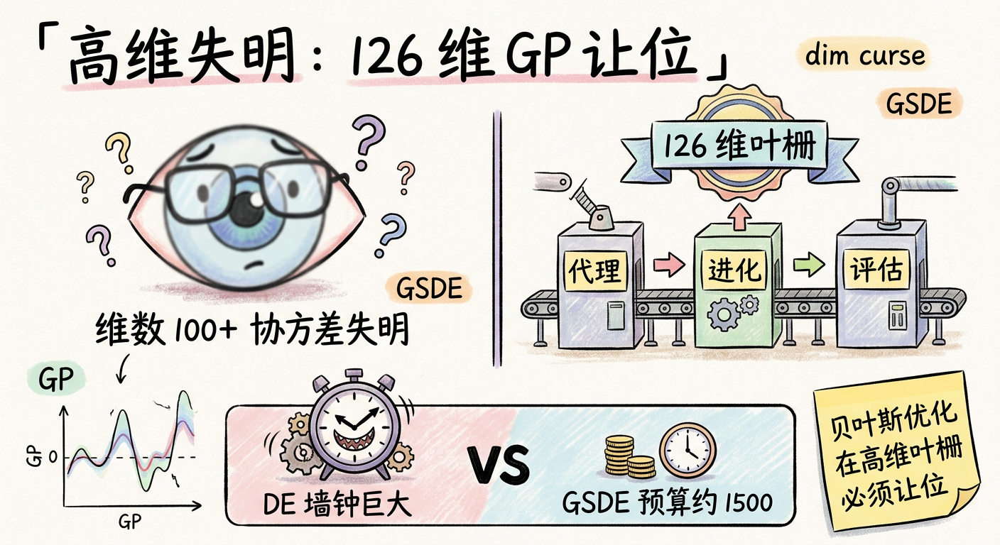

---

#### 图卡：紧耦合 vs 松耦合

紧耦合把代理-进化-评估咬在同一进程；松耦合用队列把三工位拆开可换可并行。高维叶栅现场常常 **先松后紧**——先跑得动，再咬死精度。

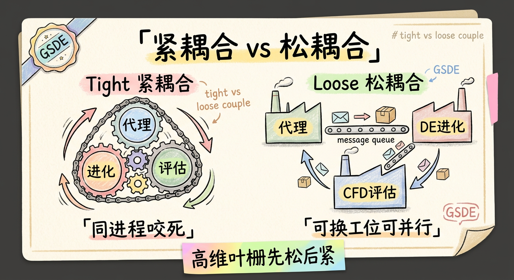

---

#### 图卡：超参先别乱拧

早期别乱拧种群/变异/换代理；先对齐预算墙钟、工位并行与 DE 基线对照。能跑稳再微调。


---

#### 章末：30 秒复述 · 自测 · 元数据

**30 秒复述稿（可朗读）：** 126 维要整队练，不能一排排抠。GP 在高维失明，GSDE 改用 RBF+DE 紧耦合，三工位并行，每轮只送有限真 CFD。约 1500 对 20000 次，增益接近但预算差一个数量级［原文 P07 Table 3］——话术是权衡，不是碾压。

**自测（先做再对答案）：**

1. 为什么「一排排优化」在物理上是错题？  
2. GSDE 相对纯 DE，省的是最终精度还是预算？依据哪张表？  
3. 三工位里，哪一个直接决定「这轮烧几发真 CFD」？

<details>
<summary>点开看参考答案</summary>

1. 排间尾迹/旋流耦合，上游改了下游进口就变。  
2. 主要省预算：1500 vs 20000，增益 1.104% vs 1.115%［原文 P07 Table 3］。  
3. 父代优选 / T 名额工位。

</details>

> **本讲元数据**（读完再看，不挡故事）
> | 项 | 值 |
> | :--- | :--- |
> | 规范编号 | **07** |
> | 原始文献 | *Aerospace Science and Technology*, 2023, **142: 108675** |
> | DOI | `10.1016/j.ast.2023.108675` |
> | 作者 | Zhendong Guo, Zijun Zhang, Yun Chen, Guangjian Ma, Liming Song\*, Jun Li, Zhenping Feng |
> | 本地原文 | `1-s2.0-S1270963823005710-main.pdf` |
> | 证据等级 | **A（本地原文逐句可查）** |
> | 反派绰号 | 维数灾难 |
> | 主比喻 | 多排叶片是一支必须一起训练的队伍 |

---

<a id="lec-04" name="lec-04"></a>
### 【第04讲】DA-EGO：把 126 维切成小块——动态分解与聚合如何救活贝叶斯优化（**论文 11**）

#### 本讲开场 90 秒

**上讲闪回：** GSDE用进化扛126维；本讲问：贝叶斯能否靠动态切块重返高维？

**本讲反派：** 「假交互」

**只要带走 3 句口诀：**

1. **交互变量同屋，可分离才分房**
2. **评估越贵分解越值，分错比不分更惨**
3. **P_C绑死，P_S疑似先验**

**主比喻：** 超大房子分区装修：水电墙不能拆标段


> **指读：** 水电墙同屋、客房可分房；P_C 绑死、P_S 再验。


> **看图三秒：** 大房子分区；红墙强交互；绿门可分离。
**本讲赌注：** 分错交互，比不分更浪费——假可分离会制造返工。

---

#### 1. 生活与物理直觉引子：为什么"分而治之"在优化里这么难

先讲一个生活场景。你要装修一套 126 个房间的超大房子，预算只够请设计师做 **1000 次**方案评审。

**笨办法**：每次都让设计师把整套房子从头到尾重新设计一遍。1000 次下来，每个房间平均只被认真推敲过 8 次——大概率烂尾。

**聪明办法**：把房子按功能分区（客厅区、卧室区、厨卫区……），**每次集中精力改一个区**，其他区保持现状；改完一个区就把它的最优方案"固化"下来，再改下一个区；改完一轮后重新审视：**哪些区之间其实互相影响**（比如开放式厨房和客厅必须一起改），把它们合并后重新规划。

这就是 DA-EGO 的核心思路。但这里有个真正的难点，也是本文的贡献所在：

> **你事先并不知道哪些房间之间互相影响。**

在叶轮机械里，这个"影响"是物理上真实存在的：改动第 1 排叶片，会改变第 2 排的进口气流角，于是第 1 排和第 2 排的变量之间存在**交互作用（interaction）**。把它们拆进不同子空间各自优化，就会得到互相矛盾的结果。

所以 DA-EGO 的关键不是"分解"，而是"**动态**分解"——**每轮迭代都重新判断谁和谁该分在一起**。

**装修监理的口令：**

- 水电墙（强交互）→ 绝不能拆到两个标段；  
- 两间不相干的客房（可分离）→ 可以轮流施工；  
- 疑似承重墙（P_S）→ 先小范围验证，再决定打不打通。

DA-EGO 的「动态」两个字，意思是：**标段划分会随着你对新房结构的理解而改**，不是一锤子合同。

**监理口令：** 水电墙不拆标段；客房可轮流；疑似承重先验。

> **先猜后揭：** 若本讲反派「假交互」赢了，你的下一笔 CFD/实验预算会怎样被浪费？揭晓贯穿 §3–§5。

| 生活元素 | 工程元素 | 符号 |
| :--- | :--- | :--- |
| 主比喻侧 | 交互分 | SPCE_ij |
| 主比喻侧 | 确认/疑似 | P_C/P_S |
| 主比喻侧 | 变量子集 | 子空间 |
| 主比喻侧 | 精英拼回 | 聚合 |

**装修事故集：** 承重墙拆进两个包工队→返工；客房绑死同一工期→浪费并行。交互分数就是给每面墙打「能否拆标段」的分。

**假交互的两种事故：**  
- 把强交互拆进两个包工队 → 返工（假可分离）。  
- 把弱交互绑死同一工期 → 浪费并行（假必须同屋）。  
交互分数 + P_C/P_S 就是给每面墙打「能否拆标段」的监理报告。

**装修监理的一天：**  
上午：水电墙（强交互）被拆进两个标段，下午返工。  
傍晚：客房（弱交互）被绑死同一工期，并行度浪费。  
DA-EGO 的交互分数，就是自动出具「这面墙能不能拆标段」的报告；P_C 绑死，P_S 疑似先验。

---

#### 2. 叶轮机械中的真实工程死穴：GSDE 的代价与贝叶斯框架的"不甘心"

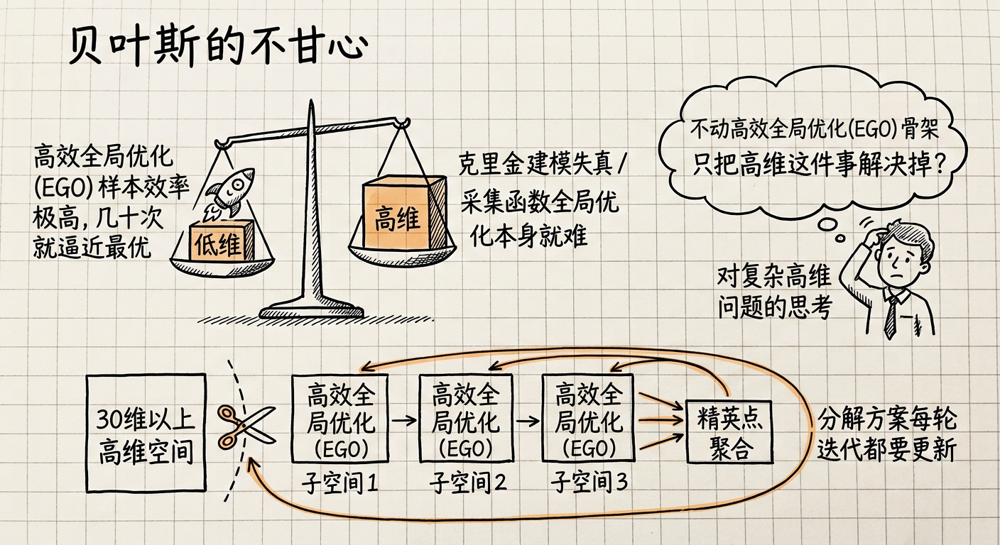

> **指读：** 这张图是本讲工程死穴的一张图版本。

第 03 讲的 GSDE 用进化算法硬扛 126 维，效果很好，但它放弃了贝叶斯优化（EGO）这套东西。站在贝叶斯阵营看，这是有遗憾的：

- EGO/Kriging 的**样本效率**在**低维**问题上其实远高于进化算法——几十次评估就能逼近最优；
- 它失效的地方是**高维**：Kriging 建模失真、采集函数全局最优化本身变成难题。

于是问题变成：**能不能不动 EGO 的骨架，只把"高维"这件事解决掉？**

本文给出的答案是：**把高维问题分解成若干低维子问题，在每个子问题上用 EGO 好好优化，再把各子空间学到的知识聚合回全空间。** 而且——**分解方案每轮迭代都要更新**。

原文定义的问题规模是 **d≥ 30 的高维昂贵黑箱问题**［原文 P11 摘要］。

**现场感：** 周五下班前组长要数——你面对的不是可以慢慢推的练习题，而是**算错一次就不可回收**的预算。

**GSDE 已能扛 126 维，为何还要 DA-EGO？**  
因为有人仍想保留贝叶斯的不确定度叙事与 EI 族工具。  
DA-EGO 的回答：不换队伍，换场地——把高维切成可 EGO 的子空间，再聚合精英。  
两条路线不是站队，是工具箱里的两种扳手。

---

#### 3. 数学公式从 0 到 1 推导

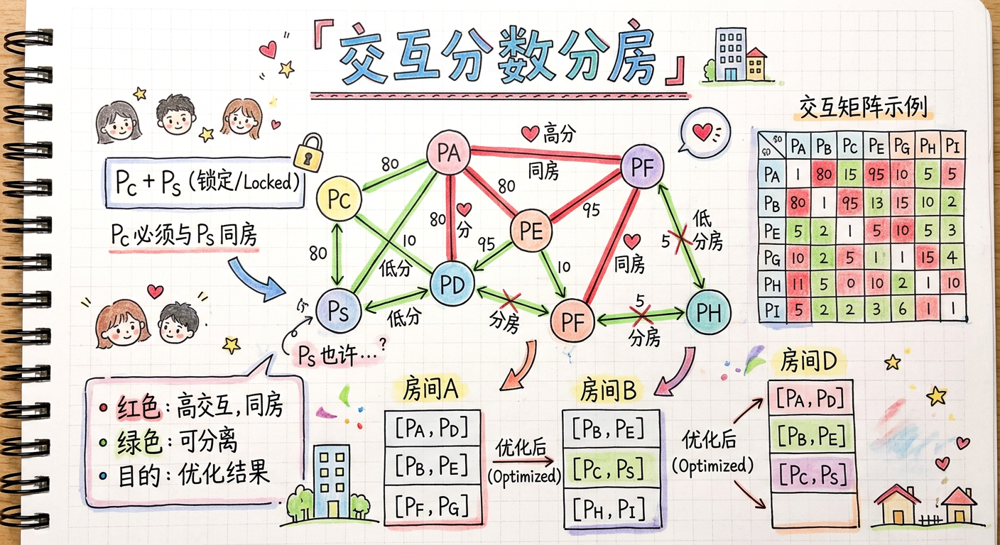

> **指读：** 高交互绑 P_C；疑似进 P_S 再验；分错比不分更惨。

先把公式关掉，用主比喻说一遍：

> **超大房子分区装修：水电墙不能拆标段**  
> 本讲反派是「假交互」。下面公式是这句话的展开；每条核心式尽量带**回译**。知识总量不删——深潜只是阅读路径，不是垃圾桶。

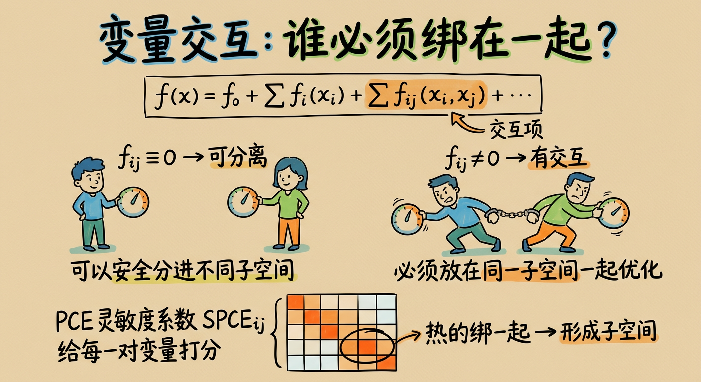


> 右半支即本讲的 DA-EGO：**分解 → 各子空间独立优化 → 精英点聚合 → 更新交互知识**，且分解方案每轮迭代都要更新。与左半支的 GSDE 对照看，两条路线的取舍最清楚。

> **指读：** 先把这张图当 §3 地图，再读公式。

##### 3B. 本讲符号卡（建议截图留存）

| 符号 | 人话 | 备注 |
| :--- | :--- | :--- |
| SPCE_ij | 交互分 | 高→同屋 |
| P_C/P_S | 确认/疑似 |  |
| 子空间 | 变量子集 | 低维EGO |
| 聚合 | 精英拼回 |  |

> 🧭 先认符号再读公式；主文核心式有「回译」，装不下的细节仍在正文完整保留（不删知识）。

##### 3C. 主路径公式与推导（知识全保留）

**第一步：什么是"变量交互"（interaction）**

设目标函数 f(x)。若变量 x_i 的取值会**改变** x_j 对 f 的影响，则称 x_i 与 x_j 存在交互。

用方差分析（ANOVA）的语言说：把 f 分解成主效应项与交互效应项
**〔式〕** f(x) = f₀ + ∑ᵢ fᵢ(xᵢ) + ∑_{i<j} f_ij(xᵢ, xⱼ) + ⋯

**回译：** 上式是主路径构件——先记住它在算法里负责哪一步，再抠每一个符号。

若 f_ij ≡ 0，则 x_i 与 x_j **可分离**，可以安全地分进不同子空间；反之必须放在同一个子空间里一起优化。

**第二步：怎么在只有稀疏样本时判断交互？——PCE 灵敏度系数**

本文用**多项式混沌展开（PCE）**的灵敏度系数 SPCE_ij 给每一对变量 (x_i, x_j) 打分。D 个变量共有

**〔式〕** (D(D-1))/(2)

个变量对（126 维时是 7875 对）。DA-EGO 把它们分成三类［原文 P11 §3.2.1］：

| 类别 | 记号 | 含义 |
| :--- | :--- | :--- |
| 确认交互 | P_C | 已由低维代理模型验证确认有交互的 t 对 |
| 疑似交互 | P_S | 在剩余变量对中 SPCE_ij 最高的一批，**待验证** |
| 非交互 | — | 其余（可能交互很弱） |

> **原文自己给出的警告（务必记住）**："由于维数灾难的存在，**高维 PCE 代理的精度有限，这会导致交互变量对的选取出现误差**。" 正因如此，P_S 中的疑似交互还要**再用低维代理模型验证确认**。

**第三步：精英点（elite-point）——子空间与全空间之间的知识桥梁**

取全部已评估样本中的**当前最优样本**作为精英点。各子空间优化得到的最优解被**组合进精英点**，再用于全空间的全局搜索。

这一步的意义是：子空间是低维的、好优化的，但它只是"局部视野"；精英点把各局部视野的最优解**拼装成一个全局可行解**，保证子空间优化不会跑偏到全空间的劣解上去。

**第四步：三类知识构成闭环**

原文把"设计空间的知识"明确定义为三类数据［原文 P11 §3］：

1. **采样数据**：所有已评估样本的坐标与函数值；
2. **变量交互关系**：已发现（确认/疑似）的交互变量对；
3. **搜索边界**：每个变量当前的搜索范围。

由此形成闭环：

```

[知识] → 构造子任务（分解方案 + 搜索范围）
            ↓
     各子空间独立做基于代理的优化
            ↓
   子任务数据挖掘（摄动法 + ANOVA 检测交互）
            ↓
[知识更新] → 下一轮的分解方案与搜索范围

```

**第五步：搜索范围收缩**

若此前求解过**相似子任务**（变量相同、精英点不同），则可依据累积经验缩小子问题的搜索范围，从而同时提升优化效率与交互分析的精度［原文 P11 §3.2.2］。

---

#### 4. 算法控制流

> 🧭 **值班手册：** 先看「什么情况下走哪条分支」，公式是对白速记不是主角。

```

① 初始化
     LHS 采样 50 个点并评估
     默认：任意变量间无交互
     默认：每个变量搜索范围 [0,1]

② 循环直到满足停止条件：
   (a) 高维分解
        计算所有变量对的 PCE 灵敏度系数 SPCE_ij
        分为：确认交互 PC / 疑似交互 PS / 非交互
        用低维代理模型验证 PS → 更新 PC
        据 PC 把 D 维空间分解为若干低维子空间
        取当前最优样本作为 elite-point
        若历史上有相似子任务 → 收缩该子问题的搜索范围
   (b) 子问题优化与知识挖掘
        在每个子空间上用 Kriging + EGO 采集函数优化
        用摄动法 + ANOVA 在子空间/全空间中检测变量交互
        把新发现的交互关系写回知识库
        把各子空间最优解组合进 elite-point

```

> **一句话记住：** 交互变量同屋，可分离才分房；进阶：评估越贵分解越值，分错比不分更惨。

**主比喻回扣：** 把上面的分支再翻译成「超大房子分区装修：水电墙不能拆标段」——若某步在生活里说不通，多半是符号没对齐。

**分解循环值班：**  
打分 → 验证疑似 → 子空间 EGO → 精英聚合 → 下一轮重打分。  
评估越贵，分解越值；样本很便宜时，管理开销可能反超收益——§6 软肋要当排期条件读。

---

#### 5. 实验验证与量化突破

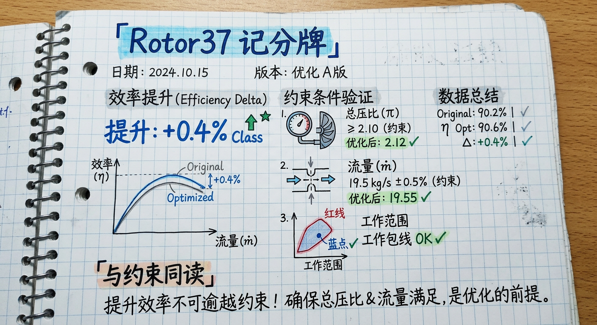

> **指读：** 效率增量要和压比/流量/强度一起读，防单指标狂欢。

**先报胜负：** 先读结论句与最大那一格，再读全表；表是证据架不是背诵清单。

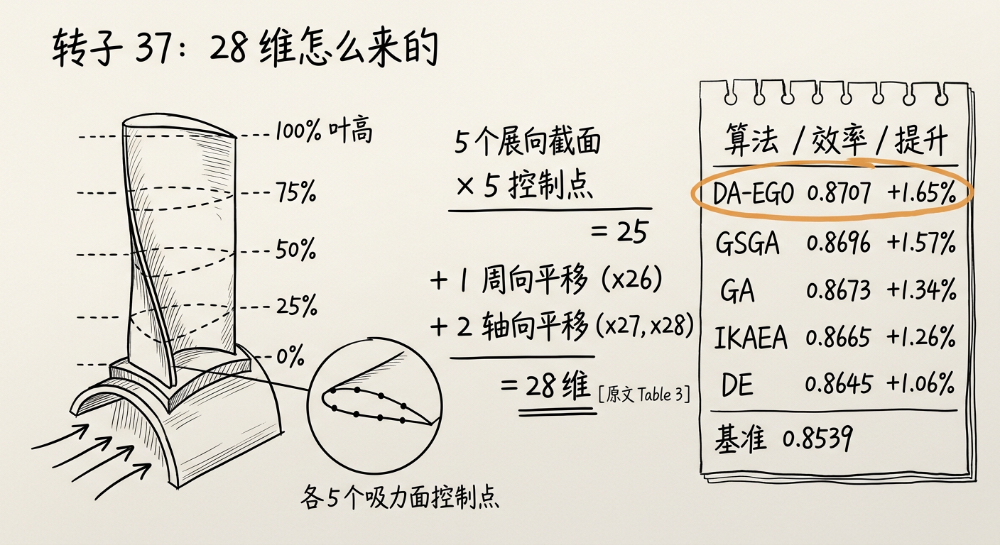

**算例一：21 个基准函数，30–90 维**［原文 P11 摘要与 §4］，用于证明算法的效率与鲁棒性。

**算例二：NASA Rotor 37 跨声速压气机转子（28 变量）**

- 参数化（计数单位=独立标量）：5 截面×各 5 吸力面控制点=25；积叠为 **中周向** x26 + **中、尖轴向** x27/x28（与 P07「中周向+尖周向+尖轴向」**不同分配**），共 **28 维**［原文 P11 Table 3］；
- 设计条件：转速 17,188.7 rpm，36 个叶片，展弦比 1.19，叶尖间隙 0.356 mm，进口 288.15 K / 101,325 Pa，出口静压 115,000 Pa［原文 Table 4］；
- 网格与求解：约 **400 万节点**，H–O–I 拓扑（NUMECA AutoGrid5），第一层网格 3×10⁻⁶ m，SA 湍流模型，NUMECA FINE/Turbo；**单样本约 600 秒**（Intel i5-9400F）［原文 §5.1.2］；
- 约束：流量与压比均限制在基准值的 **[0.98, 1.02]** 倍内，以罚函数实现；
- 目标：最大化 η_is/p(x)，其中 η_is = [(p^T_outlet/p^T_inlet)^((γ−1)/γ) − 1] / [T^T_outlet/T^T_inlet − 1]。

| 算法 | 效率 | 压比 | 流量 (kg/s) | 效率提升 |
| :--- | :---: | :---: | :---: | :---: |
| 基准设计 | 0.8539 | 2.040 | 20.62 | — |
| **DA-EGO** | **0.8707** | 2.055 | 20.96 | **+1.65%** |
| GSGA | 0.8696 | 2.051 | 20.89 | +1.57% |
| GA | 0.8673 | 2.049 | 20.88 | +1.34% |
| IKAEA | 0.8665 | 2.050 | 20.88 | +1.26% |
| DE | 0.8645 | 2.049 | 20.83 | +1.06% |

［原文 P11 Table 5；每算法独立运行 5 次，每次 1000 次 CFD］

- DA-EGO 相对最强的对手 GSGA 高 **0.08 个百分点**，相对 DE 高 **0.59 个百分点**［由 Table 5 计算］；
- 原文指出：DA-EGO、GA、DE 的 5 次重复运行**方差很小**，说明**受初始样本分布影响小**——这对工程应用的可复现性很关键。

**气动机理**：基准设计的吸力面存在明显的**激波–附面层干扰**现象，尾缘附近发生严重流动分离，尾缘叶尖处还伴有回流；DA-EGO 优化后分离线形态改变（原文用语 "highly-optimized separation lines"），分离区面积与回流强度都减小，原文将其归为效率提升的流动根源［原文 P11 §5.1.3, Fig. 8］。

**算例三：多级轴流压气机（60 变量）**

- 构型：IGV + 2 级（R1/S1、R2/S2）共 5 排，**IGV 不优化**；转子每排 **18**（3 截面×5 主动 + 3 弯掠）、静子每排 **12**（3 截面×3 主动 + 3 弯掠），四排 **60** 维［原文 P11 §5.2.1］；
- 网格约 **2300 万节点**，**单样本约 4200 秒**［原文 §5.2.1］。

| 算法 | 效率 | 压比 | 流量 (kg/s) | 效率提升 |
| :--- | :---: | :---: | :---: | :---: |
| 基准设计 | 88.072% | 2.4604 | 53.6465 | — |
| **DA-EGO** | **89.142%** | 2.4644 | 53.9005 | **+1.070%** |
| GSGA | 88.973% | 2.4630 | 53.7780 | +0.901% |
| IKAEA | 88.905% | 2.4623 | 53.8325 | +0.833% |
| GA | 88.804% | 2.4634 | 53.8110 | +0.732% |
| DE | 88.495% | 2.4575 | 53.5025 | +0.423% |

［原文 P11 Table 7；同样 1000 次 CFD 预算］

- 在 60 维这一更接近真实工业规模的算例上，DA-EGO 的优势**比 28 维时更明显**：相对 DE 的效率提升从 +0.59 个百分点扩大到 **+0.647 个百分点**（1.070% vs 0.423%）［由 Table 7 计算］。
- **气动机理**：沿叶高看，优化后 **90% 叶高以上区域效率变化不大、中段叶高明显提升、近端壁处略有下降**；分级看，第一级各叶高均提升约 1%，第二级则是根部（<10% 叶高）与顶部（>85% 叶高）下降、中 span 提升"very obvious"（原文定性用语）。熵函数云图显示流道内三个高熵区（A、B、C）熵值均"significant decreases"，其中 A、B 区下降"most obviously"（以上三处均为原文定性用语，原文未给数值）——原因是叶型改变**削弱了转子 R1 通道内的激波**；中截面的周向静压分布均匀性提高，也佐证了激波的削弱（原文定性描述，未给均匀性指标数值）［原文 §5.2.2］。

**体感换算：** 把关键数字换成「工程师的周/月」或「一次签字的风险」——数字才进长期记忆。若原文给了墙钟时间或成本比，优先用原文换算。

**Rotor37 体感：** 效率增益达到工程上「型号卖点」那一档时（具体数见本讲 §5 记分牌与［原文］表），

---

**与 GSDE：** 一个换算法族，一个保算法族改问题结构。两把扳手都要会。

#### 6. 审稿人批判与承前启后

把软肋放上**可信度刻度**（0=完全不信，5=可当默认工具）：

| 维度 | 打分 | 人话 |
| :--- | :---: | :--- |
| 问题 | 5 | |
| Rotor37 | 5 | |
| PCE成本 | 2 | |
| 理论 | 2 | |
| 维数 | 4 | |

**可以攻击的点：**

1. **作者自己承认的时间复杂度问题**。原文结论原话：该方法"提高了算法的时间复杂度，导致算法自身消耗更多计算资源。虽然这对昂贵样本问题不构成阻碍，但在**样本廉价**的场景下会削弱算法性能；样本的主要计算发生在 Kriging 模型构建，可用增强 Kriging 方法加以解决"［原文 §6 Conclusions］。翻译成人话：**这套方法只在"评估很贵"时才划算**——而这恰恰是叶轮机械的场景，所以问题不大，但必须有这个前提意识。
2. **交互检测的可靠性是方法的阿喀琉斯之踵**。原文明确说高维 PCE 精度有限会导致交互对选取出错。一旦分解错了，子空间优化就是在错误的子空间里做无用功。
3. **搜索范围收缩依赖历史经验，且没有回退机制**。若早期收缩把最优区域提前排除出去了，原文未说明如何恢复。
4. **超参与停止条件未做敏感性分析**：初始 50 个 LHS 样本、1000 次 CFD 预算均为设定值。
5. **仍是单点工况优化**：与 GSDE 相同，只优化设计点，未考虑非设计点性能与失速裕度。
6. **维数仍低于 GSDE**：本文工程算例最高 60 维，而 GSDE 做到了 126 维。两条路线各有适用范围。

**承前：**
- 直接回应了**论文 07 GSDE** 所代表的分歧：高维 HEB 到底该"放弃贝叶斯走进化"还是"改造贝叶斯扛高维"。DA-EGO 选了后者。
- 方法论上继承自 EGO/Kriging 与变量交互分析（PCE、ANOVA）。

**启后：**
- **论文 19（SHAP-Turbine）**：DA-EGO 里的变量交互分析是**为优化服务的副产品**；SHAP 那篇把"变量重要性与交互"本身作为研究目标，做成了可解释的设计知识。
- **论文 13（EMFS / MSFO）**：同样关心"代理模型在哪些区域不可信"，但切入点在保真度而非子空间。

---

**Rotor37 记分纪律：**  
效率增益的量级解读必须回到本讲 §5 记分牌与［原文］表：哪怕看起来只是很小的百分点数，在压气机设计里也可能是型号卖点级，但必须与压比、流量、强度约束同屏。  
单指标冠军若贴着约束下沿，签字会要听到「裕度」两个字。

---

#### 附：假交互识别口令

| 现象 | 可能 |
| :--- | :--- |
| 拆开优化再拼总翻车 | 真强交互，应 P_C |
| 绑在一起却从不联动 | 假交互，可试分离 |
| 分数噪声大 | 先 P_S 小步验证 |

---

#### 图卡：假交互识别口令

真交互红门同屋，假交互绿门可分。分房前先审 PCE 交互分数——看起来相关不等于必须绑死在同一子空间。

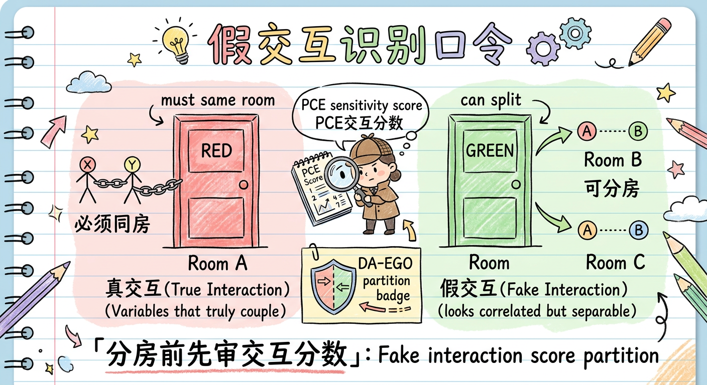

---

#### 图卡：分区装修值班

交互分数 → 分房 → 子空间 EGO → 汇总。真交互同屋、假交互可拆；值班不是一次分完就散场。

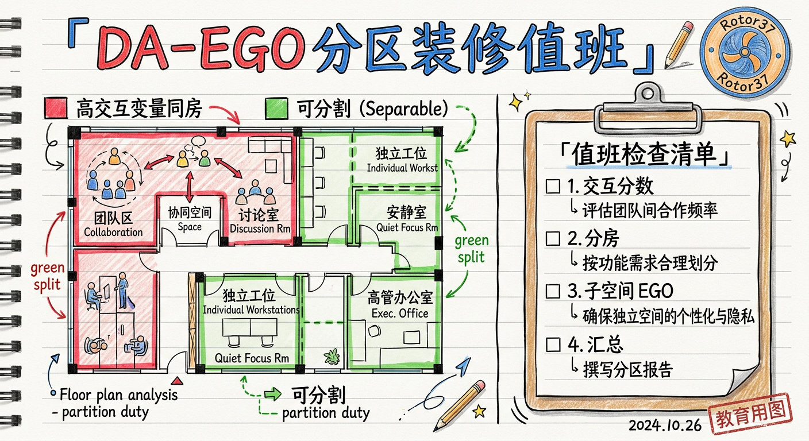

---

#### 章末：30 秒复述 · 自测 · 元数据

**30 秒复述稿（可朗读）：** 高维别整屋翻修。DA-EGO 用交互分数把变量分成确认绑死与疑似再验，子空间跑 EGO 再聚合。分对省预算，分错比不分更惨。与 GSDE 是换场地 vs 换队伍。

**自测（先做再对答案）：**

1. 可分离？
2. P_S为何再验？
3. 样本便宜时分解划算吗？

<details>
<summary>点开看参考答案</summary>

1. 无交叉项可拆；强耦合几何通常不可分。
2. 分数有噪声，防假交互绑死。
3. 不一定，管理开销可能更高。

</details>

> **本讲元数据**（读完再看，不挡故事）
> | 项 | 值 |
> | :--- | :--- |
> | 规范编号 | **11** |
> | 原始文献 | *Engineering Optimization*, **2025, 57(2): 514–542**（线上发表于 2024-04-18） |
> | DOI | `10.1080/0305215X.2024.2325651` |
> | 作者 | Qineng Wang, Zhendong Guo, Yun Chen, Guangjian Ma, Liming Song, Jun Li |
> | 本地原文 | `A dynamic aggregation strategy enhanced efficient global optimization algorithm...pdf` |
> | 开源代码 | https://github.com/zhet1997/DA_EGO_publish |
> | 证据等级 | **A（本地原文逐句可查）** |
> | 反派绰号 | 假交互 |
> | 主比喻 | 126 个房间的超大房子装修 |

---

<a id="lec-05" name="lec-05"></a>
### 【第05讲】EMFS / MSFO：当"便宜的粗网格"开始骗人——多保真优化的暗面（**论文 13**）

#### 本讲开场 90 秒

**上讲闪回：** Filter问谁配见专家；本讲问：专家看过的区还信不信实习生？

**本讲反派：** 「后期假优」

**只要带走 3 句口诀：**

1. **多保真不总更好**
2. **HF扎堆处Z_DF可能失真**
3. **失准区DBSCAN局部验尸再融合**

**主比喻：** 专家盯过的区，实习生反而开始系统性撒谎

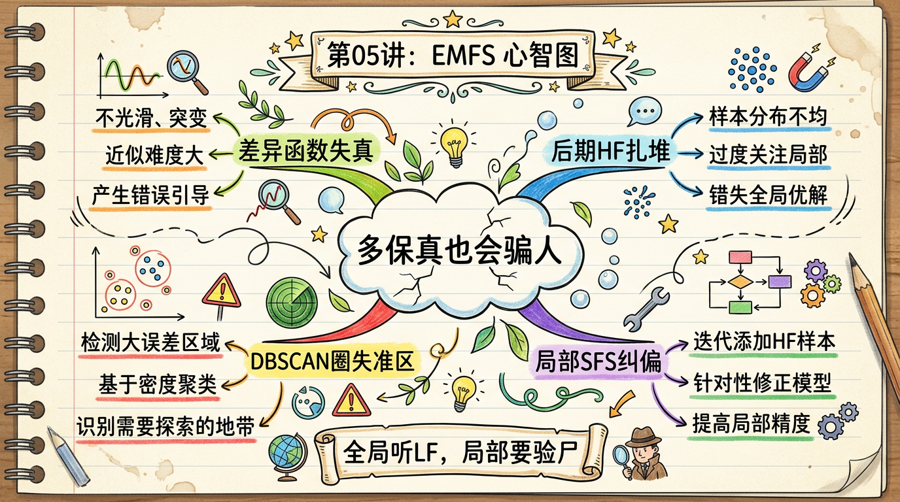

> **看图三秒：** 前期MFS领先，后期SFS反超；DBSCAN圈失准区。
**本讲赌注：** 把「MFO 必胜」当宗教，会在后期交叉后继续向假谷冲刺。

---

#### 1. 生活与物理直觉引子：老专家带的实习生，也会把你带沟里

第 02 讲（Filter-GEI）讲过"老专家 + 实习生"的比喻：实习生（低保真 LF）便宜、出活快，负责摸清大方向；老专家（高保真 HF）贵，只在关键点出手。

但那个比喻里藏着一个**没被追问的前提**：

> **实习生的判断，大体上是对的。**

如果这个前提不成立呢？想象一下：实习生看图纸有个**系统性偏差**——他总把某种特定结构画得比实际更结实。在设计的早期，这个偏差无所谓，因为大方向是对的；但当设计推进到精细阶段、你已经逼近最优解时，**这个系统性偏差会把你往错误的方向一直带**。

这时候，继续让实习生参与决策，不但不省钱，反而是**负资产**——你花的每一分钱都在加固一个错误。

这就是本文的出发点，而且它是**反直觉**的：

> 多保真优化（MFO）**并不总是**优于单保真优化。在优化的后期，随着高保真样本不断积累，低保真样本会产生**负面效果，误导优化搜索**。［原文 P13 摘要］

**后期假优的日常版：**

项目前半段，实习生的图确实让方案从「一团糟」变成「像回事」，经理很开心。  
后半段要比拼毫厘时，实习生那套「总把某结构画结实」的系统偏差，开始把最优解往歪处拽。  
若你还在用「早期真快」当理由继续信他，就会在终点输给「全程只请老专家、虽然慢但没被带沟」的队伍。

原文把这件事说得很干脆：MFO **不总是**更好；后期 LF 可能**负面**［原文 P13 摘要］。

**EMFS 值班口令（对照第 02 讲）：**

- 第 02 讲滤波问的是：「这个点配不配见老专家？」  
- 本讲集成问的是：「老专家已经看过的区域里，实习生是不是还在撒谎？」  

DBSCAN 圈出的是**失准区**，不是「坏点垃圾箱」。圈里改建局部 SFS，再与全局 MFS 按权重融合——像给惯于撒谎的街道派驻专人复核。

**对照02：** 一个管分配，一个管失准验尸。

> **先猜后揭：** 若本讲反派「后期假优」赢了，你的下一笔 CFD/实验预算会怎样被浪费？揭晓贯穿 §3–§5。

| 生活元素 | 工程元素 | 符号 |
| :--- | :--- | :--- |
| 主比喻侧 | 多/单保真 | MFS/SFS |
| 主比喻侧 | 差异函数 | Z_DF |
| 主比喻侧 | 集成多保真 | EMFS |
| 主比喻侧 | 圈失准区 | DBSCAN |

**连续翻车故事（加长）：**  
前 20 轮：LF 带路，曲线好看。第 21–40 轮：HF 在「有希望区」密集加班，Z_DF 过度自信。第 41 轮起：MFS 仍听 LF，可 LF 在这片区开始系统性画错——假最优越跑越稳。SFS 更慢但不自欺。这就是后期假优。

**实习生撒谎的时间线（加长到可写进事故报告）：**  
T0–T1：LF 带路，曲线好看，老板表扬「多保真真香」。  
T1–T2：HF 在「有希望区」扎堆，差异函数被局部残差喂胖，过度自信。  
T2 后：全局 MFS 仍听 LF，搜索被推进假谷；SFS 更慢但更不自欺。  
交叉点出现 = 本讲定理的实验指纹，不是噪声。

---

#### 2. 叶轮机械中的真实工程死穴：一个被"MFO 一定更好"掩盖的问题

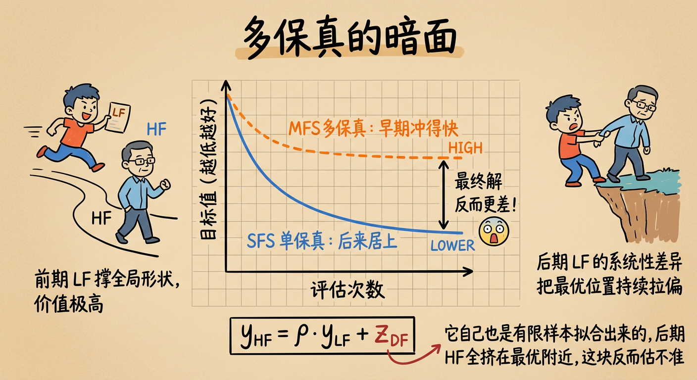

> **指读：** 这张图是本讲工程死穴的一张图版本。

多保真方法（Co-kriging、多保真 EGO 等）在 2010 年代后成为叶轮机械优化的主流工具，因为它确实省钱。行业内逐渐形成一种默认认知："**只要能用多保真，就该用多保真。**"

本文要戳破的正是这个默认认知。原文描述的观察是：

> 基于多保真代理（MFS）的优化，**有时只能在优化早期取得更好的收敛速率，但最终解反而比"只用高保真样本的单保真代理（SFS）优化"更差**。［原文 P13 摘要］

为什么会这样？原文给出的机理是：

> 随着优化过程中 HF 样本的增加，**LF 样本会产生负面效果，从而误导优化搜索**。［原文 P13 摘要］

用物理语言翻译一遍：优化前期，LF 的"大趋势"信息价值极高，因为 HF 样本太少、全靠 LF 撑着全局形状；但到了后期，HF 样本已经足够刻画局部细节，此时 LF 与 HF 之间的**系统性差异**（discrepancy）就从"可容忍的噪声"变成了"**系统性的偏差**"——它会持续把代理模型的最优位置拉偏。

**现场感：** 周五下班前组长要数——你面对的不是可以慢慢推的练习题，而是**算错一次就不可回收**的预算。

**与第 02 讲边界：** Filter 假设 LF 大体可用；EMFS 处理 LF 局部有毒。同一公司隐喻，病不同。

**「MFO 一定更好」如何成为教条：**  
论文摘要与综述常强调早期加速；很少把后期交叉当标题。  
工程值班却必须问：学习曲线有没有交叉？交叉后你还信谁？  
原文立场需要诚实引用：多保真不总更好［原文 P13 摘要］。

---

#### 3. 数学公式从 0 到 1 推导

先把公式关掉，用主比喻说一遍：

> **专家盯过的区，实习生反而开始系统性撒谎**  
> 本讲反派是「后期假优」。下面公式是这句话的展开；每条核心式尽量带**回译**。知识总量不删——深潜只是阅读路径，不是垃圾桶。

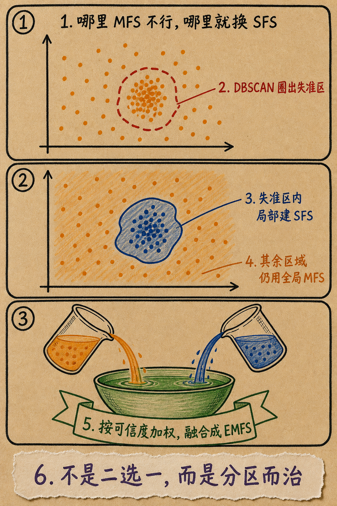

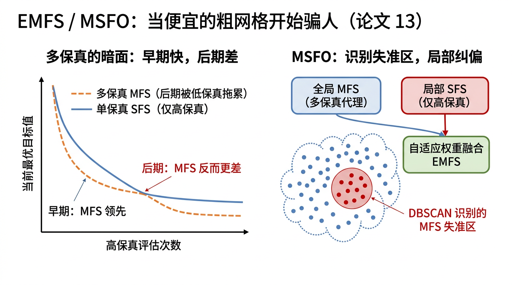

> 上图是本讲难点的「一张图版本」：**左图**是多保真的暗面——MFS（橙虚线）早期收敛快，后期反被低保真样本拖累，最终解比只用高保真样本的 SFS（蓝实线）更差；**右图**是 MSFO 的解法——用 DBSCAN 聚出 MFS 失准区（红色圈），在该区域局部构建 SFS，再与全局 MFS 按自适应权重融合成 EMFS。

##### 3B. 本讲符号卡（建议截图留存）

| 符号 | 人话 | 备注 |
| :--- | :--- | :--- |
| MFS/SFS | 多/单保真 |  |
| Z_DF | 差异函数 |  |
| EMFS | 集成多保真 |  |
| DBSCAN | 圈失准区 |  |

> 🧭 先认符号再读公式；主文核心式有「回译」，装不下的细节仍在正文完整保留（不删知识）。

##### 3C. 主路径公式与推导（知识全保留）

**第一步：把"多保真为什么失效"写清楚**

多保真代理（以 Co-kriging 为例，参见第 02 讲）把 HF 建模为

**〔式〕** y_HF(x) = ρ·y_LF(x) + Z_DF(x)

**回译：** 上式是主路径构件——先记住它在算法里负责哪一步，再抠每一个符号。

其中 Z_DF 是差异函数（discrepancy function），负责修正 LF 的系统性偏差。

问题在于：**Z_DF 本身也是用有限样本拟合出来的高斯过程**。当 HF 样本在优化后期**高度聚集于当前最优附近**时，Z_DF 在"你真正关心的那块区域"里的估计反而可能很不准——因为 LF 在那里从来就没被 HF 校验过。

于是出现了本文说的现象：**在 MFS 建不准的那块区域，MFS 反而不如一个纯用 HF 建的单保真代理（SFS）。**

**第二步：核心思想——不是"全用 MFS"或"全用 SFS"，而是"哪里 MFS 不行，哪里就换 SFS"**

本文的做法可以概括成一句话：

> 用 **DBSCAN 密度聚类**找出"MFS 建不准"的区域，在该区域**局部改建一个单保真代理（local SFS）**，再用**自适应权重**把 MFS 与这个局部 SFS 融合成一个集成代理 **EMFS**（Ensemble weighted Multi-Fidelity Surrogate）。［原文 P13 摘要］

**第三步：为什么用 DBSCAN 而不是别的聚类？**

DBSCAN（Density-Based Spatial Clustering of Applications with Noise）的特点是：

- **不需要预先指定簇的个数**——你事先并不知道有几个"失真区"；
- **能识别噪声点**——稀疏的离群样本不会被硬塞进某个簇；
- **能发现任意形状的簇**——失真区的几何形状未必是凸的。

这三点恰好契合"找出代理模型失真区域"这个任务：失真区可能不止一个、形状不规则、且边界处样本稀疏。

> 📌 **DBSCAN 的具体参数（邻域半径 ε、最小样本数 MinPts）与自适应权重的具体公式，摘要未给出，原文未获取，本讲不作推测。**

**第四步：命名规范（旧版白皮书在这里错了，必须纠正）**

| 名称 | 全称 | 指代对象 |
| :--- | :--- | :--- |
| **EMFS** | Ensemble weighted Multi-Fidelity Surrogate | **代理模型**：MFS 与局部 SFS 的自适应加权集成体 |
| **MSFO** | Multi- and Single-fidelity surrogate fused Optimization | **优化算法**：用 EMFS 引导搜索的完整算法 |

> ❌ 旧版白皮书第 05 讲的标题写作"**EMFS 算法**：DBSCAN 空间聚类识别失真区的多保真局部融合"，把**代理模型的名字当成了算法名**。
> ✅ 正确表述：**EMFS 是代理模型，MSFO 才是优化算法。**

---

#### 4. 算法控制流

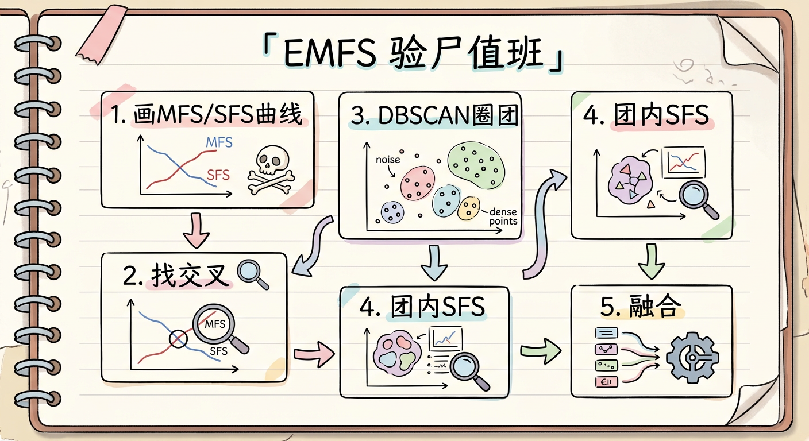

> **指读：** 画曲线→找交叉→DBSCAN圈团→团内SFS→融合。与 Filter 串联而非二选一。

> 🧭 **值班手册：** 先看「什么情况下走哪条分支」，公式是对白速记不是主角。

依据摘要可确认的流程骨架（**细节参数原文未获取**）：

```

每轮迭代：
  1. 用现有 HF + LF 样本建立多保真代理 MFS（如 Co-kriging）
  2. 用 DBSCAN 对样本/设计空间做密度聚类，
     侦测出 "MFS 在该区域建不准" 的区域
  3. 在这些失真区域内，仅用 HF 样本建立一个局部单保真代理 local SFS
  4. 用自适应权重把 MFS 与 local SFS 融合为集成代理 EMFS
  5. 用 EMFS 引导下一轮加点（这就是 MSFO 算法）

```

> 一句话记住：**不是"多保真 vs 单保真"的二选一，而是"哪里可信就用哪套"的自适应切换。**

**主比喻回扣：** 把上面的分支再翻译成「专家盯过的区，实习生反而开始系统性撒谎」——若某步在生活里说不通，多半是符号没对齐。

**融合口令：** 失准区专家说了算（SFS）；其余区仍可 MFS。权重问「这片区最近谁在撒谎」。

**EMFS 排班：**  
全局仍可用 MFS 探路；DBSCAN 圈出的失准团改 SFS；融合权重看「这片区谁在撒谎」。  
与 Filter 串联：先分配谁见专家，再验尸专家盯过的区。

**EMFS 与 Filter 的串联脚本：**  
每 10 轮：更新 MFS/SFS 曲线。  
发现交叉：启动 DBSCAN 圈失准团。  
团内：SFS 说了算；团外：MFS 仍可探路。  
融合后再跑，看交叉是否消失；不消失则检查 LF 是否结构性失效（不是聚类能救）。

---

#### 5. 实验验证与量化突破

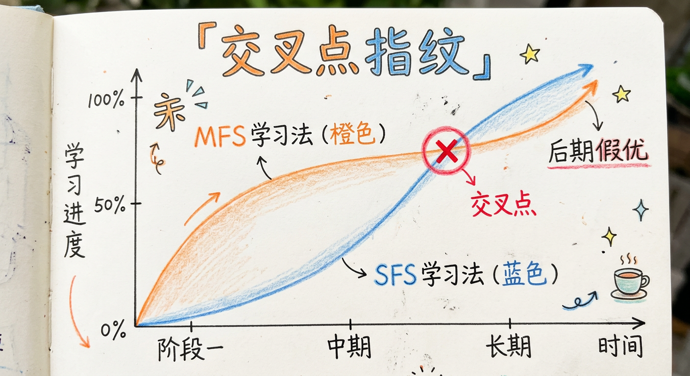

> **指读：** 交叉不是噪声，是后期假优的实验指纹。

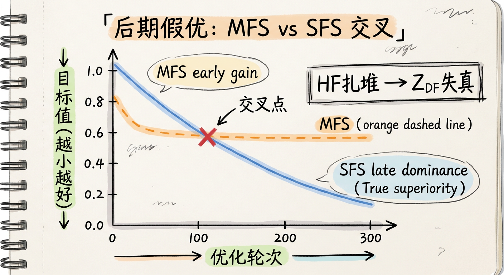

> **指读：** 前期 MFS 领先，后期交叉后 SFS 反超——交叉点是本讲定理的实验指纹。

**读后期陷阱实验的正确姿势：**  
不要只看「谁最终最优」。看**学习曲线有没有交叉**、交叉出现在第几轮、交叉后 MFS 是否仍假装领先。  
交叉 = 本讲定理的实验指纹；没有交叉图，就没有「后期假优」的证据链。

**先报胜负：** 先读结论句与最大那一格，再读全表；表是证据架不是背诵清单。

**可确认的验证算例**［原文 P13 摘要］：

1. **GE-E3 叶片优化**（与第 02 讲 Filter-GEI 用的是同一个公开标杆几何）；
2. **涡轮端壁气膜孔布局设计**（the film cooling layout design of a turbine endwall）。

摘要的原话是："Through tests on GE-E3 blade optimization and the film cooling layout design of a turbine endwall, the effectiveness of proposed MSFO is well demonstrated."

> ⚠️ **重要提醒**：摘要**没有给出**任何量化对比数字（提升了多少、节省了多少次 CFD、成功率如何）。
> 因此本讲**不列出任何性能数字**。
>
> 🗑️ **旧版白皮书 6.1 矩阵中写的「250 次 CFD」「15D~30D」「消除低保真模型失真误导现象」等条目，均无出处，属填充内容，已在重建版中删除或标注待补。**

**体感换算：** 把关键数字换成「工程师的周/月」或「一次签字的风险」——数字才进长期记忆。若原文给了墙钟时间或成本比，优先用原文换算。

**盯交叉点：** 学习曲线上 MFS 前期领先、后期被 SFS 反超——可能是本讲定理的实验版。

---

**进工具箱：** 多保真是默认选项，不是宗教信仰。后期要会验尸。

#### 6. 审稿人批判与承前启后

把软肋放上**可信度刻度**（0=完全不信，5=可当默认工具）：

| 维度 | 打分 | 人话 |
| :--- | :---: | :--- |
| 问题 | 5 | 打脸MFO必胜 |
| 直觉 | 4 | |
| 细节 | 3 | |
| 广度 | 3 | |

**可以攻击的点：**

1. **"失真区"的判定标准本身依赖代理模型**。用 MFS 去判断"MFS 在哪不准"，存在自我指涉的风险；判定失准时会连锁出错。
2. **DBSCAN 的参数敏感性**。密度聚类对邻域半径与最小样本数非常敏感，而这两个参数与"代理模型误差阈值"之间并无直接的物理换算关系——调参很大程度上靠试。
3. **局部 SFS 的样本从哪里来**？失真区之所以失真，恰恰是因为那里 HF 样本稀少；在 HF 样本稀少的区域建单保真代理，可能同样不可靠。原文未提供此处的处理细节（原文未获取）。
4. **权重的自适应规则缺少理论依据**（原文未获取，无法评价）。
5. **仅两个算例**，且都为该课题组的常规算例，未在更广泛的基准上验证泛化性。

**承前：**
- 直接**修正了第 02 讲（Filter-GEI）的隐含前提**。Filter-GEI 假定"LF 大体能捕捉 HF 趋势"，并据此设计滤波阈值；本文则处理**这个前提在局部失效**的情形。两篇论文构成"多保真方法"的一体两面。
- 方法上继承了 Co-kriging 与多保真 EGO 的体系。

**启后：**
- **论文 07（GSDE）与论文 11（DA-EGO）**：如果说 EMFS 处理的是"**保真度维度**上的模型不可信"，那么 GSDE 与 DA-EGO 处理的是"**维度灾难**带来的模型不可信"。三者共享同一个哲学——**先识别代理模型在哪里不可信，再在那里换一种策略**。
- **论文 19（SHAP-Turbine）**：同样是对"模型/数据不可信"的反思，但转向可解释性视角。

---

> 📎 **如果想把本讲升级为 A 级证据**，需要取得 ASME 全文（DOI `10.1115/1.4064228`）。届时可在 `corpus/facts/P13.md` 中补全：DBSCAN 参数、自适应权重公式、Table 中的量化对比结果。

---

**交叉点会议怎么开：**  
投影学习曲线，用红笔标交叉轮次。  
问三句：HF 最密在哪？Z_DF 是否过自信？失准团是否可解释物理？  
答完再动超参，避免「先调 DBSCAN 碰运气」。

---

#### 附：读完本讲你应能画的一张因果图

```

HF 样本在「好区」越来越密
        ↓
差异函数 Z_DF 被局部残差主导 / 过拟合
        ↓
全局 MFS 仍信任 LF 趋势
        ↓
搜索被推进「LF 系统性偏差」的谷
        ↓
后期 MFS 曲线交叉，SFS 反超  →  后期假优
        ↓
EMFS：DBSCAN 圈失准区 → 局部 SFS → 融合

```

**经理答辩词（30 秒）：**  
「我们不是抛弃多保真，而是拒绝在失准区继续听实习生。Filter 解决谁配见专家；EMFS 解决专家盯过的区还信不信实习生。」

**与全书地图：** 02 分配 → 05 验尸 → 若维数再爆则 03/04；若要生成先验则 06+。

---

**EMFS 值班口令（再压缩）：**  
1. 先画 MFS vs SFS 学习曲线，找有没有交叉。  
2. 有交叉 → 用 DBSCAN（或同类密度方法）在输入空间圈失准团。  
3. 团内改 SFS，团外保留 MFS，融合后再跑几轮看交叉是否消失。  
4. 若交叉不消失，检查 LF 定义本身是否在该物理机制上结构性失效（不是聚类能救的）。

**和 Filter-GEI 联用时的顺序建议：**  
先 Filter 管「谁见专家」，再 EMFS 管「专家扎堆区还听不听实习」——两道闸，不是二选一。

---

#### 附：后期假优的「验尸报告」模板

**现场记录（建议每 10 轮写一行）：**

| 轮次 | MFS 最优 | SFS 最优 | 交叉？ | HF 最密的区域（人话） | 决策 |
| :--- | :--- | :--- | :--- | :--- | :--- |
| 10 | … | … | 否 | 全局散 | 继续 MFS |
| 30 | … | … | 苗头 | 某角区 | 盯 Z_DF |
| 50 | … | … | **是** | HF 扎堆谷 | **启动 EMFS** |

**DBSCAN 在本故事里的角色（人话，不推导）：**  
它不负责「找到最优」，只负责在输入空间里圈出「代理不可信的团」。团内改单保真，团外仍可多保真——像把医院隔离区与普通病房分开。

**失败模式点名：**

1. **宗教多保真**：从不画 MFS/SFS 对照曲线。  
2. **只调滤波不验尸**：Filter 解决分配，解决不了局部有毒。  
3. **失准定义随手定**：ε 与 MinPts 乱拧，圈出半个设计空间。  
4. **融合权重拍脑袋**：该信 SFS 的区仍 50/50。

**和全书的接口：**  
02 管「谁见专家」→ 05 管「专家盯过的区还听谁」→ 若维数爆了转 03/04；若要生成先验转 06+。

---

#### 附：与 02 的双闸门

| 闸门 | 问句 | 工具 |
| :--- | :--- | :--- |
| Filter（02） | 谁配见专家？ | ω–T |
| EMFS（05） | 专家盯过的区还信实习生吗？ | DBSCAN+局部 SFS |

只开一闸，另一类事故仍会来。

---

#### 附：后期假优的一页纸定义

前期加速 ≠ 全程更优。  
当 HF 扎堆导致差异函数失真，LF 开始系统性撒谎，MFS 可能输给 SFS。  
EMFS = 局部验尸 + 融合，不是抛弃多保真。

---

#### 图卡：Filter × EMFS 双闸门

Gate1 Filter：谁配见专家（ω–T）；Gate2 EMFS：专家盯过的区还信实习生吗（DBSCAN+局部 SFS）。只开一闸，另一类事故仍会来。

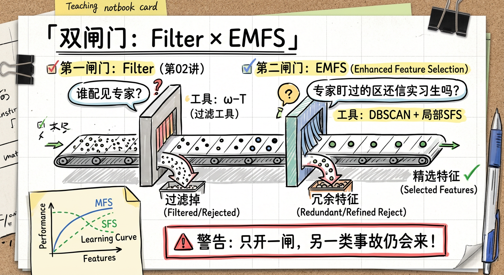

---

#### 图卡：后期假优验尸日志

每轮记 MFS/SFS 最优与是否交叉；交叉苗头出现就启动 EMFS（DBSCAN 圈失准区）。从不画对照曲线 = 宗教多保真。

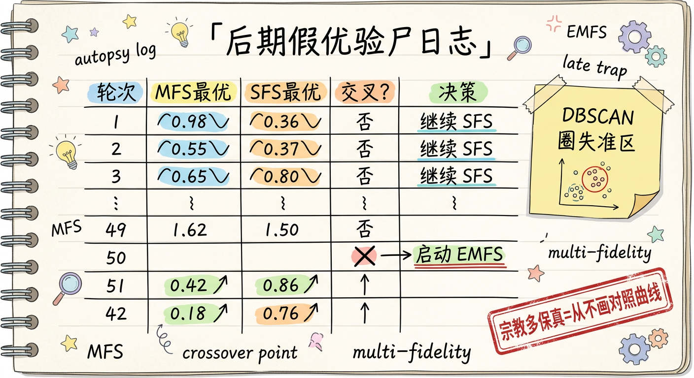

---

#### 图卡：失准区隔离病房

DBSCAN 画出失准团：团内改局部 SFS，团外仍可 MFS。EMFS 是隔离+融合，不是抛弃多保真。

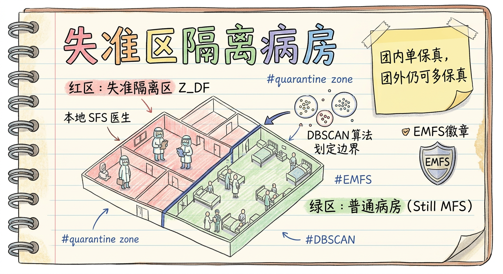

---

#### 章末：30 秒复述 · 自测 · 元数据

**30 秒复述稿（可朗读）：** 多保真不总更好。HF 扎堆处 Z_DF 可能失真，后期 MFS 会交叉输给 SFS。EMFS 用 DBSCAN 圈失准区，局部改单保真再融合。Filter 管谁见专家，EMFS 管看过的区还信谁。

**自测（先做再对答案）：**

1. MFO必胜？
2. 后期LF为何负？
3. EMFS三步？

<details>
<summary>点开看参考答案</summary>

1. 不；原文：MFO不总更好［原文 P13 摘要］。
2. HF密使Z_DF失真。
3. 圈失准→局部SFS→融合。

</details>

> **本讲元数据**（读完再看，不挡故事）
> | 项 | 值 |
> | :--- | :--- |
> | 规范编号 | **13** |
> | 原始文献 | *ASME Journal of Turbomachinery*, **2024, 146(4): 041011**（10 页） |
> | DOI | `10.1115/1.4064228` |
> | 论文号 | TURBO-23-1281（线上 2023-12-21） |
> | 作者 | Qineng Wang, Liming Song, Zhendong Guo（通讯）, Jun Li, Zhenping Feng |
> | 本地原文 | **无（ASME 订阅墙）** |
> | 证据等级 | **B（出版商页面 + 摘要全文）** |

> ⚠️ **本讲的写作边界**：本文无本地全文，以下内容**仅取自出版商页面的标题/作者/卷期/摘要原文**，以及可核验的著录信息。
> **凡摘要未给出的数字（具体提升幅度、样本量、DBSCAN 参数、权重公式），本讲一律不写，并明确标注「原文未获取」。**
> | 反派绰号 | 后期假优 |
> | 主比喻 | 实习生总把某种结构画得更结实 |

---
