# 燃气轮机智能设计与前沿算法自学白皮书：从高中物理到顶刊前沿

> **👑 著者前言与自学导读**（可读性优化版）

本书面向**零基础初入燃气轮机、航空发动机与科学机器学习（AI for Science / AI4Turbomachinery）领域的本科生与初学者**，基于郭振东老师及其合作团队的学术成果编写。

## 本书覆盖的文献范围（口径统一说明）

全书涉及 **20 篇**论文，统一采用 **01–20** 的规范编号（见仓库 README「论文全景索引表」）：

| 类别 | 数量 | 说明 |
| :--- | :---: | :--- |
| **全集** | **20 篇** | 期刊与会议论文总览 |
| 其中**本地有原文** | **15 篇** | 13 篇 PDF 全文 + 2 篇 ScienceDirect 页面 HTML（论文 09、10，**仅摘要与著录**） |
| 其中**无本地文件** | **5 篇** | 论文 04、05、13、14、20；均已取得权威著录 + 出版商摘要 |

每讲章末元数据表标明**证据等级**：

- **A 级**：本地有全文，论述可回溯 `corpus/txt/`（13 篇 PDF）；
- **B 级**：无本地全文，依据权威著录与摘要；超出摘要一律标「原文未获取」；
- **C 级**：**截至 2026-09-07 定稿核验，全集已无 C 级条目**。

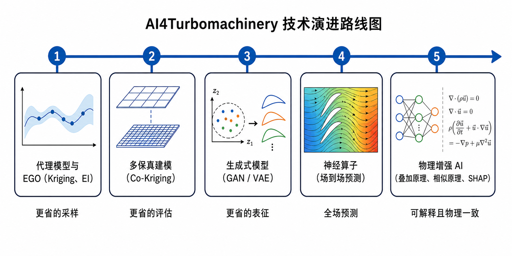

> 上图是全书 20 讲的技术坐标：从**代理模型与 EGO**（第 01–02 讲），到**多保真**（第 02、05、08 讲），到**生成式与迁移**（第 06–09 讲），再到**神经算子与物理增强**（第 10–15 讲），最后回到**流动控制与实验**（第 16–20 讲）。  
> 主线一句话：**先把「下一次评估」变聪明，再把「一次评估」变便宜，最后让模型学会物理本身。**

## 三条写作铁律（不变）

1. **没有出处的话不写。** 百分比、倍数、样本量后有 `［来源］`；查不到就标 `［待核实］` 或不写。  
2. **跑不通的代码不交。** 第五篇代码来自 `code/` 真实文件。  
3. **对不上的数字不填。** 与原文冲突时以原文为准。

由 `tools/verify_all.py` 自动验收。

## 怎么读这本书（请先读完本段）

### 主路 vs 深潜

每讲正文是**主路**：开场口诀 → 比喻 → 死穴 → 少数核心式 → 值班手册 → 比分 → 可信度。  
标有 `【深潜｜可跳过】` 的框是加长跑道：公式、偏导、实现细节**知识仍在**，第一遍读不懂可以整框跳过，第二遍再回来。

### 每讲固定导航条

1. **开场 90 秒**：反派绰号 + 3 句口诀 + 心智图  
2. **§1 直觉剧场**：生活比喻（会贯穿全讲）  
3. **§2 工程死穴**：有预算、有截止时间的现场  
4. **§3 数学缓坡**：人话 → 符号卡 → 核心式 → 深潜  
5. **§4 值班手册**：决策树优先于公式  
6. **§5 比分日**：先胜负，再表格  
7. **§6 可信度**：软肋打分 + 下一集预告  
8. **章末**：30 秒复述 + 自测 + 元数据

### 四条过桥

篇与篇之间有「过桥」短章，专门帮你**换脑子**（采样 → 潜空间 → 场预测 → 实验）。目录里能点到。

### 若你时间很少

| 你有… | 建议路径 |
| :--- | :--- |
| **2 小时** | 第零章 + 第 01 讲 + 过桥 C 开头 + 第 17 讲 |
| **10 小时** | 第零章 → 01 → 02 → 05 → 10 → 16 → 17 → 第六篇 6.5 |
| **一个学期** | 按目录顺序；深潜框第二遍再吃 |

### 图怎么看

- **主路径默认中文图**；英文对照图保留在仓库，不堵阅读。  
- 见到「指读」二字：请按左/右/箭头真的看图，不要跳过。  
- 心智图 = 该讲地图；决策树 = 算法说明书；比分板 = 证据。

### 完全零基础 / 有数学 / 要做研究 / 要复现

- **零基础**：必须先第零章；再 01，且允许跳深潜。  
- **有数学**：深潜框是你的主菜。  
- **要做研究**：每讲 §6 软肋 = 选题富矿。  
- **要复现**：`code/README.md`。

---

> 📖 **阅读体验建议：** 犯困时不要硬刚公式——回到开场三句口诀，出声读一遍章末 30 秒复述，再继续。本书故意写长，是为了把密度摊薄，不是为了堆字数。

---

## 定稿状态（2026-09-07）

| 项 | 口径 |
| :--- | :--- |
| 讲次 | 20/20，结构齐全（开场→死穴→数学→值班→比分→可信度→章末） |
| 单讲正文（去空白） | 全部 ≥ 8.5k 字 |
| 单讲配图 | 全部 ≥ 10 张（主路径中文教学图） |
| 公式 | Unicode 纯文本，禁止美元符数学环境与裸 LaTeX |
| 数字 | 百分比/倍数/次数断言带来源；图注含数字带 `Pxx` 出处 |
| 工况红线 | 凡写 NAE 降损 14.0% 必绑 Ma=0.8［原文 P09 摘要］ |
| 装配 | 本文件 + `docs/lectures/` + 过桥 + 第六篇 + 附录 → `tools/build_whitepaper.py` |
| 验收 | `make verify`（A–F）；语料需先 `make corpus` |

> 修改讲稿请只改 `docs/lectures/`，再跑 `make whitepaper && make verify`。

> **2026-09-07 证据收官：** 关键参数化维数（P07 18=15+3、P06 Z/C=13/3、P08 FFD 50 标量、P03 端壁 13、P11 28/60、P19 93）已回 PDF；B 级讲次禁止假拆零件表。详见 `docs/pedagogy/EVIDENCE_LEDGER.md`。

> 📌 **本文件由 `tools/build_whitepaper.py` 自动装配生成，请勿直接编辑。**
> 修改内容请改 `docs/lectures/` 下的讲稿源文件后重新运行装配脚本。
> 内容版本：src-2869e8d49f4a（= 讲稿/代码源文件的内容哈希；源不变则装配结果逐字节不变）

---

## 目录

- [第零章 极简前置铺垫：初高中物理/数学如何托起航空燃气轮机？](#ch0)
  - [0.1 燃气轮机到底是个啥？](#ch0-1)
  - [0.2 什么是 CFD？——把牛顿定律和微积分扔给超算](#ch0-2)
  - [0.3 为什么设计叶片这么难？——高维昂贵黑箱（HEB）与"算不起的悲剧"](#ch0-3)
  - [0.5 20 讲路线「地铁图」（文字版）](#ch0-5)
  - [0.4 第零章自测（3 题）](#ch0-4)
- [【贝叶斯优化与高维代理模型篇】](#part-1)
  - [过桥 A · 从第零章到采样主线](#bridge-a)
  - [【第01讲】CR-EI：贝叶斯优化为什么会"瞎逛"——过度探索的发现与校准（**论文 01**）](#lec-01)
  - [【第02讲】Filter-GEI：老专家与实习生——多保真并行优化怎样把钱花在刀刃上（**论文 02**）](#lec-02)
  - [【第03讲】GSDE：126 维的奇迹——为什么贝叶斯优化在高维叶栅面前必须让位（**论文 07**）](#lec-03)
  - [【第04讲】DA-EGO：把 126 维切成小块——动态分解与聚合如何救活贝叶斯优化（**论文 11**）](#lec-04)
  - [【第05讲】EMFS / MSFO：当"便宜的粗网格"开始骗人——多保真优化的暗面（**论文 13**）](#lec-05)
- [【生成式模型与跨任务知识迁移篇】](#part-2)
  - [过桥 B · 从采样到潜空间](#bridge-b)
  - [【第06讲】GMFoO：一个潜空间不够，那就同时用好几个（**论文 06**）](#lec-06)
  - [【第07讲】SW-VAE / KT-ASO：把上一个型号的设计经验"搬"到新型号上（**论文 08**）](#lec-07)
  - [【第08讲】GTO：GAN 不会"反推"，那就用梯度硬算出来（**论文 17**）](#lec-08)
  - [【第09讲】VAE-NURBS 端壁参数化：把生成式参数化从叶型推广到非轴对称端壁（**论文 14**）](#lec-09)
- [【物理增强神经算子与 AI4Turbomachinery 篇】](#part-3)
  - [过桥 C · 从优化到场预测](#bridge-c)
  - [【第10讲】TNO：不优化，而是让"一次评估"变得几乎免费（**论文 16**）](#lec-10)
  - [【第11讲】SDNO：让网络"照着物理公式"长——把叠加原理写进神经算子（**论文 12**）](#lec-11)
  - [【第12讲】P-ResUNet：把"相似原理"写进输入，把"载荷分布"写进输出（**论文 18**）](#lec-12)
  - [【第13讲】SHAP：优化跑完之后，那一堆数据里到底藏着什么？（**论文 19**）](#lec-13)
  - [【第14讲】从流体到结构：给叶片建一个"流固耦合数字孪生"（**论文 15**）](#lec-14)
  - [【第15讲】子午面全景预测：把"物理"写进 AI 预测模型的最后一块拼图（**论文 20**）](#lec-15)
- [【流动控制、气动热耦合与风洞实验篇】](#part-4)
  - [过桥 D · 从网络回到物理](#bridge-d)
  - [【第16讲】端壁：涡轮里最热、最难冷却、也最容易被忽略的角落（**论文 03**）](#lec-16)
  - [【第17讲】把端壁真的送进风洞：跨声速涡轮转子的非轴对称端壁实验（**论文 09**）](#lec-17)
  - [【第18讲】叶尖：涡轮里泄漏、刮擦、换热三件事同时发生的地方（**论文 10**）](#lec-18)
  - [【第19讲】图纸上挑不出毛病的设计，造出来还好用吗？——端壁气热性能的不确定性量化（**论文 04**）](#lec-19)
  - [【第20讲】内外夹攻：冲击冷却 + 气膜冷却的复合冷却构型（**论文 05**）](#lec-20)
- [第五篇 【实践与代码篇】可运行算法原型库](#part-5)
  - [`benchmarks.py`](#code-benchmarks-py)
  - [`decomposition.py`](#code-decomposition-py)
  - [`gp.py`](#code-gp-py)
  - [`metrics.py`](#code-metrics-py)
  - [`moo.py`](#code-moo-py)
  - [`multifidelity.py`](#code-multifidelity-py)
  - [`optimizer.py`](#code-optimizer-py)
  - [`rbf.py`](#code-rbf-py)
  - [`sampling.py`](#code-sampling-py)
  - [`transfer.py`](#code-transfer-py)
- [第六篇 【对比、批判与前瞻篇】](#part-6)
  - [6.0 二十讲口诀墙（一张纸版）](#sec-6-0)
  - [6.1 全景对比矩阵](#sec-6-1)
  - [6.2 横向批判：这 20 篇共享的六个软肋](#sec-6-2)
  - [6.3 前瞻选题：从上述六个软肋直接生长出来](#sec-6-3)
  - [6.4 已删除的旧版虚构数字（公示，避免复现）](#sec-6-4)
  - [6.5 全书收口：一句话版](#sec-6-5)
- [附录](#appendix)

---

<a id="ch0" name="ch0"></a>
# 第零章 极简前置铺垫：初高中物理/数学如何托起航空燃气轮机？

很多刚进大学的同学，一看到"跨声速多级压气机""非轴对称端壁二次流""纳维-斯托克斯方程""高斯过程回归"就心里发怵。别怕——**所有看似高不可攀的工程黑科技，其物理地基都在你初中和高中学过的知识里。** 本章只用初高中水平的物理与数学，把后面 20 讲要用到的三件事讲清楚。

---

<a id="ch0-1" name="ch0-1"></a>
### 0.1 燃气轮机到底是个啥？

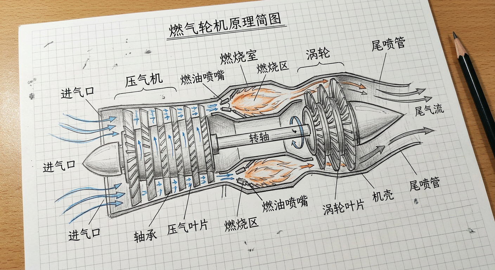

> 上图把全书的研究对象拆成四步：**吸气 → 压缩 → 点火 → 喷气**。后面二十讲所做的一切优化，归根结底都在服务于中间那两步——**让压气机压得更省功、让涡轮转得更高效**。

把航空发动机简化到极致，它就是一根管子，干四件事：**吸气 → 压缩 → 点火 → 喷气**。

**① 吸气（进气道）**
初中物理的**连续性方程**：管子细的地方流速快、粗的地方流速慢。进气道做成先粗后细的形状，就是为了把迎面高速气流"收拾"成适合压气机入口的速度。

**② 压缩（压气机）**
这是全书的主角。压气机由一排排**叶片**组成，每一排都在给空气"做功"——就像你用扇子扇风时给空气加了能量。
- **转子（Rotor）**：转动的叶片排，通过旋转把机械能传给气体，气体的**压力升高、速度升高**；
- **静子（Stator）**：不动的叶片排，把气体的**速度"收拾"成压力**（扩压），并为下一级整理好进气角度。

一对"转子+静子"就是一个**级（stage）**。本书第 03 讲要优化的，是一台 **3.5 级压气机**（1 排进口导叶 + 3 个级，共 7 排叶片）［原文 P07 §Geometry definition］。

这里用到的高中物理是**能量守恒**：压气机耗功 = 气体的焓升（压力与温度同时上升）。工程上衡量压缩"划不划算"的指标叫**等熵效率**：
**〔式〕** η_is = (理想（等熵）压缩所需功)/(实际消耗的功)

**这个数每提高 1 个百分点，都是发动机行业的重大胜利。** 记住这个量级感：本书第 03 讲里，一次成功的优化把 3.5 级压气机的总对总效率从 85.825% 提到 86.929%，增量 **1.104%**，就已经是一篇 *Aerospace Science and Technology* 论文的核心成果［原文 P07 Table 3］。

**③ 点火（燃烧室）**
燃油与高压空气混合燃烧，化学能变成热能，气体温度骤升（现代发动机涡轮前温度已远超金属熔点，必须靠气膜冷却保护叶片——这就是第 19、20 讲要解决的问题）。

**④ 喷气（涡轮 + 尾喷管）**
高温高压气体冲过**涡轮**，推动涡轮叶片旋转；涡轮通过一根轴**反过来带动压气机**（这正是燃气轮机最精妙的自持设计）。剩下的能量从尾喷管高速喷出，按**动量守恒**（高中物理）产生反作用推力。

> **一句话串起来**：压气机是"花钱的"（耗功），涡轮是"赚钱的"（出功），燃烧室是"本钱"。整机设计的全部艺术，就是让这笔账越算越划算。

---

<a id="ch0-2" name="ch0-2"></a>
### 0.2 什么是 CFD？——把牛顿定律和微积分扔给超算

叶片形状好不好，不能靠猜，得算流场。所谓 CFD（计算流体力学），就是把**牛顿第二定律 F=ma** 写成流体的形式——**纳维-斯托克斯方程（N-S 方程）**——然后在计算机上解它。

对本书而言，你只需要理解三件事：

**① 控制方程（不必会解，但要知道它在说什么）**

- **质量守恒（连续性方程）**：流进多少，流出多少，不能凭空产生；
- **动量守恒（N-S 方程）**：F=ma 的流体版，左边是惯性，右边是压力、粘性、体积力；
- **能量守恒**：热力学第一定律，决定了温度场与换热。

**② 湍流模型：必须"造假"的一层**

工程上直接解 N-S 方程（DNS）的代价大到不可想象，于是工业界普遍解**雷诺平均 N-S 方程（RANS）**，把湍流的脉动用一个模型"糊"上去。
本书第 03 讲的算例采用 **Spalart-Allmaras 一方程湍流模型**，用 **NUMECA FINE/Turbo** 求解器，网格为 O4H 拓扑的六面体结构网格、**322 万节点**，第一层网格高度 0.001 mm 以保证 y^+<1［原文 P07 §Numerical method］。

> **这里的工程直觉**：网格越细越准，但计算量暴涨。本书第 02 讲的核心思想恰恰就是建立在这个矛盾之上——**粗网格（低保真）便宜，细网格（高保真）昂贵，怎么搭配着用？**

**③ CFD 的代价：一切优化的起点**

第 03 讲报告了真实数字：在上述配置下，**单次 3.5 级压气机 CFD 评估需要 1~1.5 小时**（双路 AMD EPYC 7502 32 核服务器）［原文 P07 §Result analysis］。

**请记住这个数量级：一次评估 = 一小时。** 后面所有算法（贝叶斯优化、多保真、代理辅助进化、神经算子）存在的唯一理由，都是为了让"一小时的评估"少做几次。

---

<a id="ch0-3" name="ch0-3"></a>
### 0.3 为什么设计叶片这么难？——高维昂贵黑箱（HEB）与"算不起的悲剧"

现在把前面两节合起来，看看叶栅设计到底难在哪。

**难点一：维数灾难（Curse of Dimensionality）**

一个叶片形状要用多少个数字描述？第 03 讲（论文 07）把计数单位钉成「优化器接收的独立标量」：每排 **18 维** = 三截面吸力面各 5 个法向主动点（15）+ 中周向 + 尖周向 + 尖轴向（3）；7 排同构得 **126 维**名义设计空间［原文 P07 Blade parameterization；摘要亦直接给出 126 variables］。

为什么必须这么多？因为**叶片排之间是相互影响的**（0.1 节说过：第 2 排吃的是被第 1 排搅过的气流）。原文说得明确：**为充分考虑叶片排与级之间的相互作用，两级以上的叶栅必须同时优化**［原文 P07 摘要］——单独优化每一排在物理上就是错的。

做个量级感受：在 126 维空间里撒 1000 个样本点，平均到每个维度上只能分成
**〔式〕** 1000^(1/126) ≈ 1.055

份——**连"每个方向一分为二"都做不到**。这就是维数灾难。

**难点二：每次评估贵得要命（Expensive）**

一次 CFD 一小时（0.2 节）。一个设计周期能负担多少次？原文给出的现实约束是：**几百到几千次**［原文 P07 摘要］。

**难点三：没有导数可用（Black-box）**

CFD 求解器是一个"扔进去几何、吐出来一个数"的黑箱。你拿不到 ∂η_is/∂x_i 这样的梯度信息，因此**基于梯度的优化方法（最速下降、SQP 等）通通用不上**，只能用无导数/进化类方法。

**难点四：一个点都不许浪费**

综合以上三点，就得到了本书要解决的**高维昂贵黑箱（High-dimensional Expensive Black-box, HEB）**问题。原文对它的定义性描述是：

> 基于 CFD 的叶栅设计优化是典型的高维昂贵黑箱问题……变量数可达 100 以上，而一个设计周期内可负担的 CFD 次数只有几百到几千次。［原文 P07 摘要］

**于是全书 20 讲，本质上都是在回答同一个问题：**

> **在 126 维、每次评估一小时、总共只有一两千次机会的约束下，下一个点应该算在哪里？**

| 主线 | 策略 | 对应讲次 / 论文 |
| :--- | :--- | :--- |
| 让每一次采样更聪明 | 改造采集函数（EI → CEI/REI → 滤波 GEI） | 第 01、02 讲（论文 01、02） |
| 让便宜的粗网格多干活 | 多保真 + 并行 + 失真区侦测 | 第 02、05 讲（论文 02、13） |
| 换掉撑不住高维的代理 | 代理辅助进化、子空间分解 | 第 03、04 讲（论文 07、11） |
| 不每次从零开始 | 生成式参数化 + 知识迁移 | 第 07、08 讲（论文 08、17） |
| 干脆不优化，直接预测流场 | 物理增强神经算子 | 第 10–12 讲（论文 16、12、18） |
| 回到物理本体 | 流动控制 + 实验与不确定性量化 | 第 16–19 讲（论文 03、09、10、04） |

---

> 📖 **读完第零章，你已经具备了读懂全部 20 讲的物理基础。**  
> 接下来每一讲固定导航：**开场口诀 → ① 直觉剧场 → ② 工程死穴 → ③ 数学缓坡（含可跳过的深潜）→ ④ 值班手册 → ⑤ 比分日 → ⑥ 可信度刻度 → 章末复述与自测。**
>
> **下一集预告：** 第 01 讲的反派叫「瞎逛」——采样次数很多，算法却在差区出不来。过桥 A 会把你从本章的问题，送上「让下一次采样更聪明」的主线。

---

<a id="ch0-5" name="ch0-5"></a>
### 0.5 20 讲路线「地铁图」（文字版）

```

第零章 HEB 问题
    │
    ├─ 第一篇 采样更聪明 ── 01 瞎逛 → 02 空转 → 03 失明 → 04 分房 → 05 假优
    ├─ 第二篇 换潜空间   ── 06 两难 → 07 迁移 → 08 反推 → 09 端壁
    ├─ 第三篇 场预测     ── 10 免费评估 → 11 叠加 → 12 相似 → 13 归因 → 14 孪生 → 15 子午
    └─ 第四篇 物理实验   ── 16 墙角 → 17 风洞 → 18 叶尖 → 19 UQ → 20 冷却

```

> 把这张图截下来。以后每读完一讲，就在对应站点打勾——比你「感觉读了很多」可靠。

<a id="ch0-4" name="ch0-4"></a>
### 0.4 第零章自测（3 题）

1. 一对「转子 + 静子」叫什么？整机里压气机与涡轮谁在「花钱」、谁在「赚钱」？  
2. 为什么本书把「一次 CFD ≈ 一小时」反复钉在墙上？  
3. HEB 三个字母分别卡住了优化的哪条路？

<details>
<summary>参考答案</summary>

1. 叫一个**级（stage）**；压气机耗功（花钱），涡轮出功（赚钱）。  
2. 因为所有智能算法存在的理由，都是让「一小时」少花几次——没有量级感，就听不懂后面各讲的增益百分比与 CFD 次数（如第 01 讲 2.92%［由 Table 2 计算］、第 03 讲 1500 次［原文 P07 Table 3］）。  
3. **H**igh-dim 维数灾难；**E**xpensive 评估贵；**B**lack-box 无导数。

</details>

---

<a id="part-1" name="part-1"></a>
# 第一篇 【贝叶斯优化与高维代理模型篇】

本篇覆盖**论文 01、02、07、11、13**。这一条主线回答一个问题：**当一次 CFD 贵得要命时，下一个点该算在哪里？** 从校准采集函数（CR-EI），到多保真并行分配（Filter-GEI），再到 126 维下被迫改换门庭的代理进化（GSDE）与子空间聚合（DA-EGO），最后以「多保真也会骗人」这一反直觉发现（EMFS / MSFO）收尾。

<a id="bridge-a"></a>

### 过桥 A · 从第零章到第 01 讲：问题已经清楚，答案从「下一次采样」开始

第零章结束时，你手里只有一个问题，没有算法：

> 在高维、昂贵、无导数的黑箱里，**下一个点该算在哪里？**

从现在起，第一篇（第 01–05 讲）给出第一条主线答案：**让每一次采样更聪明。**

| 你将依次遇见 | 它专治的病 |
| :--- | :--- |
| 第 01 讲 CR-EI | 采样「瞎逛」 |
| 第 02 讲 Filter-GEI | 机房「空转」 |
| 第 03 讲 GSDE | 高维下 GP「失明」 |
| 第 04 讲 DA-EGO | 整屋翻修太贵 |
| 第 05 讲 EMFS | 多保真「后期假优」 |

**阅读纪律（本篇通用）：**

1. 先读开场 90 秒的三句口诀；  
2. 图看懂了再啃〔式〕；  
3. 深潜框可跳，知识不丢；  
4. 章末自测做不出来，回到心智图，不要硬背符号。

下一页反派登场，它的名字叫**瞎逛**。

---

<a id="lec-01" name="lec-01"></a>
### 【第01讲】CR-EI：贝叶斯优化为什么会"瞎逛"——过度探索的发现与校准（**论文 01**）

#### 本讲开场 90 秒

**上讲闪回（第零章）：** 叶片设计是 HEB 问题——维数高、每次 CFD 贵、没有导数。全书都在问：下一笔预算该砸哪？

**本讲反派：** 「瞎逛」——采样次数已经很多，算法却在明显很差的空白区打转，出不来。

**只要带走 3 句口诀：**

1. **病根是 z ≤ 0**：不确定度 σ 大的地方，未必是好地方。  
2. **治则是改 ξ，不是改 σ**：前人爱调探索权重；本文抬高"当前最优"这根尺子。  
3. **近处 CEI、远处 REI，EI 瞎了再换班**：值班经理三规则。


> **看图三秒：** 中间是参数 z；左边 z>0 是"有希望的街区"；右边 z≤0 是工业区瞎逛；底部三条口诀请先刻住，后面只是在证明它们。

**本讲赌注：** 若放任 z≤0 的瞎逛，有限 CFD 预算会永久巡逻工业区。

---

#### 1. 生活与物理直觉引子：三种"找最佳餐厅"的策略


> **指读：** 左有希望区、右工业区巡逻；CR-EI 改的是尺子 ξ 与近远分工。

假设你搬到一座新城市，给自己定了死规矩：**30 天内，找到全城最好吃的那家面馆。**

每一顿饭都要花钱、花时间——这顿饭就是一次**昂贵实验**。放到叶片设计里，它对应动辄几小时的一次 CFD。

你口袋里的钱，只够吃大约几十顿。于是策略选择，比"爱吃辣还是爱清汤"更要命。


> **指读：** 左格人死守小巷（河对岸的神店永远没机会）；中格人专钻空白工业区（反复确认"这儿难吃"）；右格人手里有一张口味地图——颜色深的是已知好吃，问号是不确定。

**策略 A · 纯开发（exploitation）**  
找到一家还不错的，就天天去，只在附近小巷换着吃。  
风险：全市第一在河对岸，你这辈子不会知道。

**策略 B · 纯探索（exploration）**  
专挑地图上空白的地方。  
风险：空白区常常是没人去的工业区，你只是在验证"确实难吃"。

**策略 C · 聪明折中**  
维护一张"口味地图"：  
- 已知好吃的街区 → 猜附近也可能好吃；  
- 空白处 → 标成"不确定"，不确定越大，越值得去试试。

贝叶斯优化里的**期望改善（Expected Improvement, EI）**，就是策略 C 的数学版。

本讲要讲的，是策略 C 里一个**藏了二十年**的陷阱：地图用着用着，会把你系统性、持续地推进工业区——而且还可能**永远出不来**。我们给它起个绰号：**瞎逛**。

| 生活元素 | 工程元素 | 本讲符号（先混个眼熟） |
| :--- | :--- | :--- |
| 面馆坐标 | 设计变量 | x |
| 口味得分 | 性能（如 −L/D、损失） | y |
| 口味地图的"估计均分" | 代理模型预测均值 | ŷ(x) |
| 地图上的"不确定带宽" | 预测标准差 | σ(x) |
| 目前吃过的最高分 | 当前最优（incumbent） | ξ |
| 要不要再去这家的冲动 | 期望改善 | EI(x) |

> **先猜后揭：** 若算法开始专挑"地图上最空白、但也最可能难吃"的点，病在地图（σ）还是在尺子（ξ）？  
> 揭晓在 §3：主流改 σ，本文改 ξ。

**策略 C 的藏二十年陷阱（加长）：**  
口味地图用着用着，会系统性把你推进工业区：好区被采密后 σ 变小，差区反而更空、σ 更大，EI 听空白的话。  
这不像偷懒，像勤奋——所以叫**瞎逛**更阴。郭振东等指出过度探索与过度开发是一对病，只治贪不够。

---

#### 2. 叶轮机械中的真实工程死穴：算不起，但停不下

把面馆换成叶片。现场是这样的：

周五下班前，组长丢来一句话——「下个型号的叶型，预算只够再跑几百次 CFD，给我一个比现在更好的外形。」

你面对的不是一道可以慢慢推的数学题，而是一个**昂贵黑箱**：


> **指读：** 左边塞进几何参数 x，中间黑箱是 CFD，右边吐出一个数 y。箭头上写着时间与金钱。

- 给一组几何参数 x（厚度分布、安装角、端壁型线……），求解器吐回性能 y；  
- 一次高保真 CFD 可能要**几小时到几十小时**；  
- 一个设计周期能负担的次数往往只有**几百到几千次**［原文 P07 §1］；  
- 设计变量轻易超过 **100 维**［原文 P07 摘要］。


> **指读：** 上半斗是有限次数，每粒沙标着"1 小时"；下半斗是高维空间里稀疏的点。红章的意思只有一个——**点错一次，就烧一笔不可回收的预算。**

在这种现场，EI 成为贝叶斯优化的默认配置，是因为它直接回答：

> 「这个点，值得再花一次 CFD 吗？」

可 EI 有个久治不愈的毛病：**次数已经很多了，结果却卡在次优解上。**

此前学界常说：那是**过度开发**——算法太贪，只在当前最优点附近打转。

郭振东等指出：**这个解释只对了一半。** 还有一半叫**过度探索**，而且更阴险——它长得像"勤奋地探索"，其实是在工业区永久巡逻。这就是本讲反派 **瞎逛**。

**预算沙漏的第二读法：**  
上半斗是次数，下半斗是维数稀疏。  
EI 默认很香，是因为它直接回答「值不值得再花一次」；  
但当 z 掉到明显负值，它回答的其实是「空白大不大」，不是「空白处好不好」。  
CR-EI 的贡献，是把值班经理请回来：瞎了换班，而不是继续勤奋地错。

---

#### 3. 数学公式从 0 到 1 推导：一个参数 z，两种病


> **指读：** z≫0 过度开发；z≪0 瞎逛；治则抬 ξ、近 CEI 远 REI。

先把公式关掉。只用餐厅语言说一遍：

> 你的口味地图在每个位置给出两个量：  
> **估计均分** ŷ，和 **不确定带宽** σ。  
> 你还记得目前吃过的最高分 ξ。  
> 定义一个无量纲分数 z，衡量"最高分比估计均分高多少个不确定带宽"。  
> **z 很大** → 地图很有把握地说"这儿不如已经最好的那家"→ 你只会在已知好区精耕（贪）。  
> **z 很小（很负）** → 你几乎只听带宽 σ 的话 → 专往空白处钻；而空白处常常是差区 → **瞎逛**。

下面用符号把这话说死。本讲主文只留 **3 条核心式**；偏导与积分细节在深潜框，不挡路。


> **指读 GP 图：** 上半幅是后验均值与置信带——样本越密，带子越瘦；下半幅是 EI 曲线，它在"预测更好"与"更不确定"之间拉扯。后面 CEI/REI/GEI 改的都是这张图上的东西。

##### 3B. 本讲符号卡（建议截图留存）

| 符号 | 人话 | 备注 |
| :--- | :--- | :--- |
| x | 设计点（面馆坐标） | 向量 |
| ŷ(x) | 地图估计均分 | 越小/越大取决于问题方向；本文按原文最小化语境理解 |
| σ(x) | 不确定带宽 | **只反映稀疏，不反映好吃** |
| ξ | 目前最优观测 | incumbent |
| z | (ξ − ŷ)/σ | **全文题眼** |
| Φ, φ | 标准正态的"累积"与"钟形密度" | 可先当两个已知函数 |
| EI(x) | 去 x 的"期望改善冲动" | |
| y_PBS | 当前最优设计点上的值 | |
| ξ_Calibrated | 被抬高的尺子 | CEI 用 |
| δ₁, δ₂ | 近处/远处地盘开关 | 互补 |
| y_T | 已有样本的中位数 | 瞎逛预警线 |
| n_Breakthrough | 连续突破计数 | 调度用 |

##### 3C. 主路径只要三条式

**核心式 ① — z 的定义**

**〔式〕** z = (ξ − ŷ(x)) / (σ(x))

**回译：** z 是"比当前最优好（或差）多少个不确定带宽"。  
**停顿：** 若 σ 很大，分母大，z 的绝对值容易变小——地图会更听"空白"的话。

**核心式 ② — EI 的人话版（结构）**

EI 可以写成（原文式 5、式 11）：

**〔式〕** EI(x) = σ(x) · (z Φ(z) + φ(z)) = σ(x) · EI*(z)

**回译：**  
- 前面的 σ(x) 像"冲动的音量"；  
- 括号里的 EI*(z) 像"这首歌好不好听"。  
z 决定你唱的是开发调还是探索调。

**核心式 ③ — 符号约束（为什么瞎逛出不来）**

**〔式〕** z > 0 ⇒ ŷ(x*_EI) < ξ（被关在有希望区）；z ≤ 0 ⇒ 对 ŷ 无任何约束

**回译：**  
z>0 时，EI 选出的点，预测值必须优于当前最优——像只在"可能超越冠军"的街区转。  
z≤0 时，这道门消失。再叠加"σ 大的地方往往是早期没人去的差区"，算法就会**系统性地、持续地**冲进工业区。

**两种病（看图 L01_s3，不必先啃偏导）：**

| 病名 | z 的极端 | 行为 | 餐厅版 |
| :--- | :--- | :--- | :--- |
| 过度开发 | z > 3 | 几乎只跟 ŷ 走 | 死守已经好吃的小巷 |
| 过度探索（瞎逛） | z < −3 | 几乎只跟 σ 走 | 永久巡逻工业区 |

**论文里的触目惊心例子**［原文 P01 §3.1］：  
6 维 Hartman6 上，EI 用 LHS 撒 36 个初始点后很快陷入过度探索（z 在 −5 附近抖，σ²/σ²_max≈1，maxEI 从 10⁻⁵ 掉到 10⁻²⁰）。若按"maxEI 小于阈值就停"，得到 **−2.7890**，而真全局最优是 **−3.0424**。

**附带结论（仍属主路径）：** EI*(z) 在 z>0 近似线性好优化，在 z≤0 指数衰减、极难优化。所以**保持 z>0 是明智的**；但简单加阈值停机又会早熟。这就是 CR-EI 要解的死结。

> 【深潜｜可跳过】完整解析式、偏导与梯度权重
>
> 完整写法（原文式 5）：  
> **〔式〕** EI(x) = ∫_{−∞}^{ξ} (ξ − Y) dF_Y = (ξ − ŷ) Φ(z) + σ φ(z)
>
> 偏导（用于理解权重，不必会推）：  
> **〔式〕** ∂EI/∂ŷ = −Φ(z)， ∂EI/∂σ = φ(z)
>
> 负梯度：  
> **〔式〕** −∇EI(x) = Φ(z) (∂ŷ/∂x) − φ(z) (∂σ/∂x)
>
> - 第一项开发、第二项探索；权重分别是 Φ(z)、φ(z)。  
> - z>3 时 Φ≫φ → **〔式〕** −∇EI|_{z>3} ≈ Φ(z) (∂ŷ/∂x) → 过度开发  
> - z<−3 时 φ≫Φ → **〔式〕** −∇EI|_{z<−3} ≈ −φ(z) (∂σ/∂x) → 过度探索  
>
> 读完可以回到主文 §4，不影响值班手册。

---

#### 4. 算法控制流：EI / CEI / REI 三兄弟如何轮班

核心思想，一句就够：

> **别再拧 σ 那个旋钮了（前人都拧过）。改 incumbent 这根尺子 ξ。**


> **指读：** 三人分工——EI 主攻、CEI 守近处、REI 侦远处；右侧比分是后文伏笔。

**(a) CEI — 校准 EI：治瞎逛，强化近处开发**

把尺子从 y_PBS **抬高**到 ξ_Calibrated > y_PBS，重算 z：

**〔式〕** z̃ = (ξ_Calibrated − ŷ(x)) / σ(x)，  CEI(x) = σ(x) (z̃ Φ(z̃) + φ(z̃))

**回译：** 许多原来 z≤0 的点，被抬尺后变成 z̃>0，重新关回"有希望区"。  
再叠加**距离窗** δ₁：只接受落在当前最优点附近的建议（ε < ‖x−x_PBS‖ ≤ d_T 时为 1，ε 常取 0.001 防重复采样）。

**(b) REI — 重校准 EI：治死守小巷，强化远处探索**

**〔式〕** REI(x) = CEI(x) · δ₂(‖x−x_PBS‖)，  δ₂ = 1 − δ₁

**回译：** REI **只**在近处地盘之外取点。δ₁ 与 δ₂ 像两块互补的城区规划——**CEI 管近，REI 管远。**

**(c) 值班经理手册 — CR-EI 调度（原文式 17–18）**

预警线 y_T = 已有样本目标值的**中位数**；计数器 n_Breakthrough 看 EI 是否还在"打破纪录"。


> **指读：** 从上往下互斥优先。绿：EI 正常只采 EI；黄：有进展则 EI+REI 并行；红：EI 建议点比中位数还差 → 判定瞎逛，改 CEI+REI。

1. n_Breakthrough = 0（EI 正常）→ 只采 EI：  
   **〔式〕** x*_new = {x*_EI}  
2. n_Breakthrough > 0（仍有进展）→ EI 与 REI 并行：  
   **〔式〕** x*_new = {x*_EI, x*_REI}  
3. y(x*_EI) ≥ y_T（疑似瞎逛）→ 改 CEI + REI：  
   **〔式〕** x*_new = {x*_CEI, x*_REI}

**餐厅版回扣：**  
EI 像主探路员；REI 是派去河对岸的侦察兵；一旦主探路员开始在工业区空转（建议点还不如半数已吃过的店），经理立刻把主探路员换成"只准在冠军店附近精耕"的 CEI，同时保留远侦察。

> **一句话记住：** EI 顺就让它跑，同时派 REI 远眺；EI 一瞎逛，就换成 CEI 收近 + REI 保远。

**CEI/REI 餐厅排班表：**  
| 角色 | 地盘 | 一句话 |
| CEI | 冠军店附近 | 抬尺，只精耕有希望区 |
| REI | 河对岸 | 保远方选项，防死守小巷 |
| EI | 全局默认 | 正常时主攻 |
经理看中位数预警线：建议点还不如半数已吃过的店 → 判定瞎逛换班。

---

#### 5. 实验验证与量化突破

**先报胜负：** 在 7 个基准和翼型工程题上，CR-EI 相对经典 EI 变体，**更快、更稳、更好**。

**算例一：7 个基准函数**（每算法 20 次独立运行；对手 EGO / PEI / GEI / E3I）

| 函数 | EGO | PEI | GEI | E3I | **CR-EI** |
| :--- | :---: | :---: | :---: | :---: | :---: |
| Shekel4 成功率 | 17/20 | 20/20 | 6/20 | 14/20 | **20/20** |
| Trid10 成功率 | 14/20 | 10/20 | 13/20 | 20/20 | **20/20** |

原文结论：**除 10 维 Trid10 外，CR-EI 在其余 6 个基准上均以更快收敛取得最优**［原文 P01 Table 1 / §4.3］。

**算例二：低速翼型（工程级）**

- 参数化：GAN + UIUC 翼型库，**13 维**；  
- 求解器 XFOIL；Re = 1.8×10⁶、Ma = 0.01、AoA = 0°；  
- 目标：最大化升阻比 L/D（实现为最小化 −L/D）；每组 10 次运行。

| 指标 | EGO | PEI | GEI | E3I | **CR-EI** |
| :--- | :---: | :---: | :---: | :---: | :---: |
| 均值 ± 标准差 | −239.34 ± 8.60 | −240.66 ± 6.41 | −240.70 ± 4.57 | −242.20 ± 4.48 | **−246.34 ± 3.56** |
| 中位数 | −241.44 | −242.74 | −240.82 | −241.92 | **−248.09** |

**体感换算（只读两格就够）：**

- 相对 EGO，平均 L/D 提升 **2.92%**［由 Table 2：(246.34−239.34)/239.34］；  
- 标准差 8.60 → 3.56，**离散度降 58.6%**［由 Table 2］——不是"平均好看一点"，而是**十次里次次更稳**。对要签字画押的工程设计，这比均值更救命。

**参数敏感性：** 距离参数 α、incumbent 参数 β。Camel6 / Hartman6 扫描显示 **β = 0.1 综合最优**；β 越大越抗瞎逛，但搜索区膨胀，过大则约束作废［原文 P01 §4.5］。

**翼型工程读法加长：**  
均值更好：平均 L/D 更香。  
标准差下降：十次独立运行更挤在一起——签字要的是可重复，不是一次运气。  
β=0.1 是综合甜点：越大越抗瞎逛，过大搜索区膨胀约束作废［原文 P01 §4.5］。

---

#### 6. 审稿人批判与承前启后

把软肋放上**可信度刻度**（0 = 完全不信，5 = 可当默认工具）：

| 维度 | 打分 | 人话 |
| :--- | :---: | :--- |
| 机理清晰度 | 4 | z 的故事完整、好讲 |
| 实验充分度 | 4 | 基准 + 翼型，有对照 |
| 超参稳健 | 2 | β、d_T、α 要调；β=0.1 不保证可迁移 |
| 理论保证 | 1 | 无收敛证明 / regret bound |
| 维数外推 | 2 | 天花板约 10 维；真叶栅 100+ 维时 GP 本身先垮 |
| 对 GP 质量依赖 | 2 | ŷ、σ 若糊，调度全糊 |

**可以攻击的点（保留原文力度）：**

1. **超参**：α、d_T、β；d_T 绝对距离、高维下欧氏距离会"挤成一团"。  
2. **无理论保证**。  
3. **维数天花板 ~10**；真叶栅 100+ 维时，"抬 ξ"救不了 GP 失明。  
4. **切换逻辑绑在 GP 质量上**。

**承前：** 站在 EGO 的 EI 上，用"调 incumbent"统一审视 GEI（调 σ 权重）、E3I（Thompson 样本最优当 ξ）、PEI（伪 EI）。

**启后（下一集预告）：**

- **第 02 讲（Filter-GEI）**：值班切换思想，搬进"专家+实习生"多保真并行——反派变成**集群空转**。  
- **第 03–04 讲（GSDE / DA-EGO）**：本讲 10 维天花板撞墙后，高维必须换门庭。  
- **第 08 讲（GTO）**：本讲 GAN 13 维翼型，后面升级为梯度反推的生成式迁移。

**可信度刻度使用说明：**  
4 分机理 = 可以教；2 分超参 = 换题要重调；1 分理论 = 别指望 regret bound。  
10 维天花板写在这里，是为了让你读到 03/04 时知道：不是 CR-EI 变笨，是 GP 舞台塌了。

---

#### 附：三调度口令速查

| 信号 | 动作 |
| :--- | :--- |
| EI 正常 | 只采 EI |
| 仍有突破 | EI + REI 并行 |
| 建议点差于中位数 | CEI 守近 + REI 保远 |

餐厅版：主探路员一进工业区空转，经理立刻换人，远侦察不停。

---

#### 附：从 CR-EI 走向全书

| 下一站 | 你带走的问题 |
| :--- | :--- |
| 02 Filter-GEI | 并行与多保真时，谁配见专家？ |
| 03–04 | 10 维天花板破了怎么办？ |
| 05 | 多保真后期是否开始撒谎？ |
| 06+ | 合法形状与场预测、实验信任 |

本讲是「下一笔预算砸哪」的第一课；后面所有课都在改场景，不改这个母问题。

---

**母问题回声：** 读完任何后讲，用一句话回答「下一笔预算砸哪」。答不出，说明开场母问题断了，请回第 01 讲。

---

#### 附：z 的餐厅速记卡

| z | 人话 | 风险 |
| :--- | :--- | :--- |
| ≫0 | 很有把握不如冠军 | 过度开发 |
| ≈0 | 边界 | 需调度 |
| ≪0 | 几乎只听空白 | **瞎逛** |

治：抬 ξ、近 CEI、远 REI、瞎了换班。

---

**翼型算例的工程读法：** 均值更好是「平均更香」；标准差下降是「十次里更稳」。对要签字的设计，稳往往比均值多 0.1 更救命。数字与出处以 §5 表为准［原文 P01 Table 2］。

**调度树口袋卡：** 绿 EI；黄 EI+REI；红 CEI+REI。口袋卡贴显示器，公式放深潜。

---

#### 附：开场母问题检查单（全书通用）

读完任意后讲，用 30 秒回答：  
1. 本讲的「一次评估」有多贵？  
2. 下一笔预算砸在采样、代理、还是实验？  
3. 失败模式（反派）若赢了，报表会不会仍看起来很绿？  

答不出第 3 问，说明还在被利用率/云图欺骗。

---

#### 章末：30 秒复述 · 自测 · 元数据

**30 秒复述稿（可朗读）：** EI 用 z 在已知好与空白之间折中。z≤0 时约束消失，空白又常是差区，于是瞎逛。CR-EI 不拧 σ 而抬 ξ，CEI 守近、REI 探远，按是否突破中位数换班。翼型上它均值更好也更稳。

**自测（先做再对答案）：**

1. 为什么说 σ 大**不等于**"那里值得去"？  
2. CEI 与 REI 的地盘如何用 δ₁、δ₂ 划分？  
3. 三调度里，哪一条专门对付瞎逛？

<details>
<summary>点开看参考答案</summary>

1. σ 只反映样本稀疏，不反映目标好坏；早期好区被采密后，差区反而更空、σ 更大。  
2. δ₁=1 近处（CEI）；δ₂=1−δ₁ 远处（REI）。  
3. 第 3 条：y(x*_EI) ≥ y_T 时改 CEI+REI。

</details>

> **本讲元数据**（读完再看，不挡故事）
>
> | 项 | 值 |
> | :--- | :--- |
> | 规范编号 | **01** |
> | 原始文献 | *Structural and Multidisciplinary Optimization*, 2021, **64: 3549–3567** |
> | DOI | `10.1007/s00158-021-03038-3` |
> | 作者 | Zhendong Guo, Yew-Soon Ong, Haitao Liu |
> | 本地原文 | `s00158-021-03038-3.pdf` |
> | 证据等级 | **A（本地原文逐句可查）** |
> | 反派绰号 | 瞎逛 |
> | 主比喻 | 30 天找面馆 |

---

<a id="lec-02" name="lec-02"></a>
### 【第02讲】Filter-GEI：老专家与实习生——多保真并行优化怎样把钱花在刀刃上（**论文 02**）

#### 本讲开场 90 秒

**上讲闪回：** 上讲（CR-EI）：EI 会瞎逛；治则是改 ξ、近 CEI 远 REI。值班经理管「下一笔预算砸哪」。

**本讲反派：** 「集群空转」

**只要带走 3 句口诀：**

1. **实习生（LF）铺路，老专家（HF）拍板**
2. **滤波门槛 T 决定谁配见专家**
3. **相关高就严进，相关差就放宽**

**主比喻：** 设计公司：老专家 vs 实习生


> **指读：** 左列相关高→ω严进；右列相关差→放宽；中间门槛 T 分流 HF/LF。


> **看图三秒：** 中心「多保真并行」；左 **HF 老专家**（贵而准），右 **LF 实习生**（便宜快）；下半 **候选点→滤波门槛 T**，通过见专家、未过交实习生；底条反派「集群空转」+「相关高严进、相关差放宽」。
**本讲赌注：** 没有门槛的并行，只是让专家更快地淹没在平庸图里。

---

#### 1. 生活与物理直觉引子：老专家与实习生

想象你经营一家设计公司，手下有两类人：

- **老专家**：画图精准、结论可靠，但**时薪 3000 元，一天只能出 1 张图**；
- **实习生**：速度快、一天能出 10 张图，**时薪 300 元**，但图纸常有偏差，只能看个大概趋势。

现在要做一个设计招标。聪明的做法显然不是"所有图都让老专家画"（太贵），也不是"全让实习生画"（不可靠）。你会让**实习生先铺开画一批，把大致方向摸出来；老专家只在最关键的几张图上出手**。

这就是**多保真优化（Multi-Fidelity Optimization, MFO）**的全部思想。在叶轮机械里：

- **低保真（LF）** = 粗网格 CFD（1.2 万单元）、无粘 Euler、二维简化模型；
- **高保真（HF）** = 细网格 RANS（10 万单元）、三维全环、带转捩模型。

本文的工程算例中，**LF 与 HF 的成本比是 0.1**——也就是说，一次高保真的钱能做十次低保真［原文 P02 §4.3］。

**但这里有个二十年的老问题**：每轮迭代里，到底哪些点该让老专家（HF）看，哪些点交给实习生（LF）？这就是本文所说的 **sample assignment（样本分配）问题**。

**把招标周历摊开看一遍（趣味回扣）：**

| 工作日 | 实习生（LF） | 老专家（HF） | 经理在想什么 |
| :--- | :--- | :--- | :--- |
| 周一 | 狂出 10 张草图 | 休息 | 「先把地形摸出来」 |
| 周二 | 再出 10 张 | 挑 1 张精修 | 「只在苗头处砸钱」 |
| …… | …… | …… | 若没有滤波，专家会被灌进一堆平庸图 |

若没有 Filter 那道门槛，并行批次里会混进大量「GEI 看起来花哨、其实不配见专家」的点——机房灯亮着，智慧在空转。这就是反派**集群空转**。

**周历回扣：** 若无 Filter，并行批会塞满「GEI 花哨但不配见专家」的点——灯亮着，智慧空转。

> **先猜后揭：** 若本讲反派「集群空转」赢了，你的下一笔 CFD/实验预算会怎样被浪费？揭晓贯穿 §3–§5。

| 生活元素 | 工程元素 | 符号 |
| :--- | :--- | :--- |
| 主比喻侧 | 低/高保真 | y_LF/y_HF |
| 主比喻侧 | 缩放因子 | ρ |
| 主比喻侧 | 差异函数 | Z_DF |
| 主比喻侧 | 广义EI/幂次 | GEI,g |

**把「时薪」再算一遍（趣味加长）：**  
若招标只要 30 张「可信图」，全专家贵、全实习险。混合策略的关键不是拍脑袋比例，而是**每一张专家图都对应一个过了门槛的理由**——这正是 T 存在的意义。

**失败剧本：** 经理取消滤波器，「GEI 前 10 名全给专家」。两周后专家工位堆满平庸图，实习生反而闲着。机房利用率很高，**有效学习率**很低。这就是集群空转的生活版。

**招标周的正确打开方式：**  
周一 LF 铺图；门槛决定周二专家看谁；周末对照无滤波是否假快速。  
周历本身就是算法。

---

#### 2. 叶轮机械中的真实工程死穴：串行加点浪费了整个机房


> **指读：** 上条串行等核；下条 HF+LF 同批；空转是调度病。


> **指读：** 这张图是本讲工程死穴的一张图版本。

传统的多保真 EGO 类算法（如 augmented-EI、VF-EI）有一个共同特征：**每轮迭代只加一个样本**。

问题在两方面：

1. **贵**：一次 CFD 几小时，一个设计周期几百次调用，串行下来是几个月；
2. **浪费**：现代计算集群一晚上能同时跑几十个 CFD 作业，单点串行加点意味着**大部分核在空转**。

同时，已有算法在决定"这个点用 HF 还是 LF"时，往往只看相似性与成本比，**没有利用"LF 模型到底靠不靠谱"这一关键信息**。本文要解决的，正是这两个痛点：**把保真度分配做对，并且一次分配一批**。

**现场感：** 周五下班前组长要数——你面对的不是可以慢慢推的练习题，而是**算错一次就不可回收**的预算。

**串行 vs 并行的时间线（人话）：**  
串行：HF₁ 完成 → 更新模型 → HF₂ → … 墙钟 ≈ n × t_HF。  
并行（本讲）：同一轮抛出 {HF 批, LF 批}，墙钟 ≈ max(t_HF, t_LF)——前提是足够许可证。  
软肋里「并行收益绑许可证」不是抬杠，是工程事实。

**集群空转的两种形态：**  
1) 算法串行加点，核在等；  
2) 算法并行但无 Filter，HF 批次塞满假尖子，核在忙，智慧仍空转。  
第二种更危险，因为利用率报表是绿的，学习曲线却在骗人。

---

#### 3. 数学公式从 0 到 1 推导

先把公式关掉，用主比喻说一遍：

> **设计公司：老专家 vs 实习生**  
> 本讲反派是「集群空转」。下面公式是这句话的展开；每条核心式尽量带**回译**。知识总量不删——深潜只是阅读路径，不是垃圾桶。


> 上图是本讲全部数学的「一张图版本」：**左图**是多保真建模——低保真模型（橙虚线）便宜但有偏，用大量低保真样本铺路、少量高保真样本（蓝点）校准；**右图**是 Filter-GEI 的并行加点——GEI 值超过滤波阈值 T 的候选（绿点）才入选并行批，其余被滤除（灰叉）。正文推导的 ω/T 公式，改的就是右图这道「门槛」。

##### 3B. 本讲符号卡（建议截图留存）

| 符号 | 人话 | 备注 |
| :--- | :--- | :--- |
| y_LF/y_HF | 低/高保真 | 成本比≈0.1 |
| ρ | 缩放因子 |  |
| Z_DF | 差异函数 | 修正后还差多少 |
| GEI,g | 广义EI/幂次 | g大偏探索 |
| T | 滤波门槛 | 谁配见专家 |
| ω | 相关权重 | 相关高→严进 |

> 🧭 先认符号再读公式；主文核心式有「回译」，装不下的细节仍在正文完整保留（不删知识）。

##### 3C. 主路径公式与推导（知识全保留）

**第一步：多保真代理模型 Co-kriging**

把 LF 与 HF 都当成随机过程：
**〔式〕** Y_LF(x) = μ_LF + Z_LF(x), Y_HF(x) = μ_HF + Z_HF(x)

**回译：** 上式是主路径构件——先记住它在算法里负责哪一步，再抠每一个符号。

关键假设是 HF 可以写成"LF 的缩放 + 一个差异函数"：
**〔式〕** y_HF(x) = ρ·y_LF(x) + Z_DF(x)

其中 ρ 是缩放因子，Z_DF 是差异函数（discrepancy function），专门负责刻画"LF 修正后仍与 HF 差多少"。这样，**LF 负责大趋势，DF 负责补差距**，两套高斯过程拼成一个联合协方差矩阵（原文式 4–6）。

**第二步：基线采集函数 GEI（广义期望改善）**

经典 EI 有个毛病：太贪恋当前最优附近。Schonlau（1997）把它推广为带幂次 g 的 GEI：
**〔式〕** E[I(x)^g] = s^g∑_{k=0}^{g}(-1)^kC(g, k)u^{g-k} T_k, u = (f_min-ŷ(x))/(s(x))

**〔式〕** T₀ = Φ(u), T₁ = -φ(u), Tₖ = -u^{k-1} φ(u) + (k-1)T_{k-2}

**g 越大，越偏向全局探索；g=1 时退化为经典 EI。** 取若干个不同的 g，就同时得到一批"有的爱开发、有的爱探索"的候选点——这天然适配并行加点。

**第三步：核心创新——给 GEI 装一个"滤波器"（原文式 10–12）**

定义一个阈值：
**〔式〕** T = ω·y_HF-min + (1-ω)·y_HF-mean

其中 y_HF-min 是当前最优，y_HF-mean 是历史加权平均：
**〔式〕** y_HF-mean = (1)/(iter)∑_{i=0}^{iter}((1)/(nᵢ)∑_{j=1}^{n}_iy_HF-ij)

而权重 ω **由 HF 与 LF 的相关性自适应决定**——这是全文最漂亮的一笔：
**〔式〕** ω = (1)/(1 + (σ̂²_DF/σ̂²_LF)^{0.5})

**物理含义请务必记住：**

- 当 **LF 与 HF 高度相关**时，差异函数 Z_DF 的方差 σ̂²_DF 相对很小 → 分母趋近 1 → **ω→1** → 阈值 T 贴近当前最优值 y_HF-min → **只有非常好（优于 T）的点才配用 HF**，采样极度聚焦于局部开发。
- 当 **LF 与 HF 相关性差**时，σ̂²_DF 大 → ω 变小 → 阈值 T 贴近历史均值 → **HF 的投放区域被放大**，避免在不可信的 LF 引导下钻牛角尖，转而加强全局探索。

**第四步：候选点去重叠**

不同 g 给出的候选点可能重合，直接一起投进 Co-kriging 会让协方差矩阵病态。本文用层次聚类（逐个合并距离最小的一类，直到类间最小距离大于阈值 d_T）把重叠点聚掉。

---

#### 4. 算法控制流

> 🧭 **值班手册：** 先看「什么情况下走哪条分支」，公式是对白速记不是主角。

```

每轮迭代：
  1. 用现有 HF + LF 样本拟合 Co-kriging 代理
  2. 用多个不同 g 的 GEI，生成一批候选点（既含开发点，也含探索点）
  3. 层次聚类去掉重叠候选点
  4. 计算自适应权重 ω = 1/(1+ (σ²_DF/σ²_LF)^0.5 )
  5. 计算阈值 T = ω·y_HF-min + (1-ω)·y_HF-mean
  6. 分流：
       预测值优于 T 的候选点  → 送 HF 仿真（贵，但值得）
       其余候选点            → 送 LF 仿真（便宜，用于全局探索+降不确定性）
  7. 一批 HF 与一批 LF 样本同时提交，并行计算

```

> **一句话记住**：**GEI 负责"去哪儿采"，滤波器负责"花多少钱采"。**

**主比喻回扣：** 把上面的分支再翻译成「设计公司：老专家 vs 实习生」——若某步在生活里说不通，多半是符号没对齐。

**并行批的现场约束清单：**  
- 许可证 ≥ 批大小？否则自动降批。  
- LF/HF 网格与求解器队列是否两条线？  
- 相关 ω 是否每轮重算，还是冻结了过期相关？  
门槛 T 在许可证不足时**仍然值钱**：它决定稀缺的 HF 名额给谁。

---

#### 5. 实验验证与量化突破


> **指读：** 成本比折算后，多花的 LF 是否换来更好的 HF 最优——读表先问假快速。

**先报胜负：** 先读结论句与最大那一格，再读全表；表是证据架不是背诵清单。

**算例一：5 个基准函数**（Forrester1a/1b、Hartman3+MA3、Ackley5+MA5、Hartmann6+MA6，最高 6 维；初始样本 HF=3×维数、LF=6×维数；统一用开源 ooDACE 工具箱）

| 观察点 | 结果 |
| :--- | :--- |
| HF 样本消耗 | Filter-GEI 在 5 个算例上**始终用最少的 HF 样本**取得有竞争力的最优解；无滤波的 GEI-MFO 需要"significantly more HF samples"（原文自评用语，未给具体倍数）［原文 P02 §4.2］ |
| 迭代次数 | 由于每轮并行加多样本，Filter-GEI 与 GEI-MFO 的迭代次数**远少于**单点的 EI-MFO |
| 成功率 | Filter-GEI **5 个算例全部成功**；VF-EI 在 5 维 Ackley5 上仅 **12/20**；augmented-EI 在 6 维 Hartman6 上仅 **12/20** |
| 稳定性 | Filter-GEI 迭代次数波动**明显小于** VF-EI 与 augmented-EI |

［以上均出自原文 P02 §4.2 与 Table 4］

**算例二：GE-E3 涡轮静子叶片气动优化（工程级）**

- 设计变量：**7 个**几何参数；HF 网格 100,701 单元，LF 网格 12,141 单元；
- 初始样本 42 LF + 21 HF（最近邻采样），终止条件为**再消耗 35 个 HF 样本**；独立运行 5 次；
- 代理模型交叉验证 CV-R² **全部 > 0.85，多数 > 0.95**［原文 Table 7］，说明 Co-kriging 拟合可信。

| 算法 | 达到最优所需迭代数 | 最优值(%) 均值±标准差 | LF 样本消耗 |
| :--- | :---: | :---: | :---: |
| **Filter-GEI** | **13 ± 1** | **2.720 ± 0.0245** | 91 ± 10 |
| GEI（无滤波） | 8 ± 0 | 2.760 ± 0.0224 | 79 ± 2 |
| EI | 36 ± 0 | 2.732 ± 0.0192 | 77 ± 0 |
| VF-EI | 45 ± 3 | 2.748 ± 0.0239 | 51 ± 3 |
| augmented-EI | 51 ± 6 | 2.726 ± 0.0358 | 59 ± 9 |

［原文 P02 Table 8］

**怎么读这张表（很关键，别读错）：**

- **GEI 只用了 8 次迭代就"收敛"了，但收敛到的是最差的最优值 2.760**——没有滤波器时，HF 被挥霍在不太有希望的点上，看似快，实则跑偏。
- **Filter-GEI 用 13 次迭代拿到全场最好的 2.720**，而且**Min 值 2.70 是全场最低**。
- 相比串行的 EI / VF-EI / augmented-EI（36 / 45 / 51 次迭代），Filter-GEI 的迭代次数**只有它们的 1/3 左右**——这正是并行加点的直接收益。
- 代价是：**用了更多 LF 样本（91 vs 79）**。但按 0.1 的成本比折算，多花 12 次 LF ≈ 1.2 次 HF 的钱，换来最优值从 2.760 降到 2.720，这笔账是划算的。

**体感换算：** 把关键数字换成「工程师的周/月」或「一次签字的风险」——数字才进长期记忆。若原文给了墙钟时间或成本比，优先用原文换算。

**账本精读（再钉一次）：**  
无滤波 GEI：迭代 8，最优 2.760（差）。Filter-GEI：迭代 13，最优 2.720（好）。  
慢 5 轮迭代，换的是**不跑偏**。相对串行 36–51 轮仍是断崖优势。读表先问「快是真快还是假快」。

---

**值班经理对照第 01 讲：** 01 看是否瞎逛；02 看 LF 还准不准。都是自适应指标，旋钮从 ξ 换成 ω–T。

#### 6. 审稿人批判与承前启后

把软肋放上**可信度刻度**（0=完全不信，5=可当默认工具）：

| 维度 | 打分 | 人话 |
| :--- | :---: | :--- |
| 机理 | 4 | ω–T 好讲 |
| 实验 | 4 | 基准+静子 |
| 超参 | 3 | d_T/g 集 |
| 理论 | 2 | 启发式 |
| 维数 | 2 | ≤7 维 |
| 成本比入模 | 2 | 未进公式 |

**可以攻击的点：**

1. **"并行"是算法层面的并行，实验是串行模拟的**。真拿到工程现场，收益取决于你有多少个 CFD 许可证/核；很多单位恰恰卡在许可证数量上。
2. **成本比没有进入公式**。ω 只用了方差比 σ̂²_DF/σ̂²_LF，**没有把 LF/HF 的实际成本比纳入**。本文工程算例的成本比恰好是 0.1；若 LF 也很贵（成本比接近 1），多投 LF 的滤波策略就不一定划算了。
3. **阈值与权重的启发式本质**。T 取"最优值与加权均值的凸组合"缺乏最优性证明；ω 的自适应也只有定性论证。
4. **维数量级有限**：基准最高 6 维，工程算例 7 维。真正的多级叶栅是 100+ 维（见**论文 07**），Co-kriging 在高维下的建模能力本身就是瓶颈。
5. **隐含前提"LF 大体能捕捉 HF 趋势"**。一旦这个前提在某块区域失效，滤波器反而会把 HF 集中投到被 LF 误导的区域——这正是**论文 13（EMFS / MSFO）**要处理的问题。

**承前：** 建立在 Co-kriging（Forrester et al. 2007）与 GEI（Schonlau 1997）之上，思想直接继承自同组前作 **论文 01（CR-EI）**——"用一个自适应指标来决定这一轮怎么采样"。

**启后：**
- **论文 13（EMFS / MSFO）**：正面处理"LF 在某些区域反而误导优化"的场景，用 DBSCAN 找出多保真代理建不准的区域，在那里改建单保真代理；
- **论文 07（GSDE）**：把优化从"低维多保真 + 贝叶斯"推进到"126 维 + 代理辅助进化"；
- **论文 11（DA-EGO）**：把"自适应分配"从**保真度维度**迁移到**子空间维度**。

---

**Table 8 再读（防假快速）：**  
无滤波 GEI：迭代少、最优差。  
Filter-GEI：迭代略多、最优好。  
串行基线：迭代是三倍级。  
读表顺序：最优值 → 是否跑偏 → 迭代 → LF 成本折算［原文 P02 Table 8］。

---

#### 附：Filter 值班卡（可打印）

| 本轮信号 | 经理口令 | 对应公式角色 |
| :--- | :--- | :--- |
| LF–HF 相关很高 | 「严进：只有尖子见专家」 | ω→1，T 贴 y_HF-min |
| LF–HF 相关崩了 | 「放宽：专家多看全局」 | ω 变小，T 贴均值 |
| 候选点扎堆 | 「层次聚类去重叠」 | 防协方差病态 |
| 集群有空核 | 「HF 批 + LF 批同时交」 | 反派集群空转的直接解药 |

**和 CR-EI 的对照表（请钉在显示器边）：**

| | 第 01 讲 CR-EI | 第 02 讲 Filter-GEI |
| :--- | :--- | :--- |
| 反派 | 瞎逛 | 集群空转 |
| 自适应旋钮 | ξ（尺子） | ω–T（门槛） |
| 并行？ | 近 CEI + 远 REI 可并行 | **HF 批 + LF 批** 并行 |
| 多保真？ | 通常单保真 GP | Co-kriging 标配 |

**成本比 0.1 的心算模板：**  
多花 Δn_LF 次低保真 ≈ 0.1·Δn_LF 次高保真。  
若最优值从 2.760 降到 2.720，问自己：这 0.040 个点，值不值那 1.2 次 HF 的钱？——原文 Table 8 的答案是值［原文 P02 Table 8］。

**读表口诀：** 先看最优值，再看迭代数，最后看 LF 消耗。无滤波 GEI「迭代少但最优差」= **假快速**。

---

#### 附：并行加点的许可证现实

算法说「一批 HF + 一批 LF」时，现场常卡在：

- CFD 许可证数 < 批大小；  
- 队列策略把并行拆回串行；  
- LF 与 HF 网格流程不共享，调度摩擦大。

**所以 §6 软肋不是抬杠：** 并行收益是「算法可达上限 × 许可证可达上限」的乘积。Filter 仍值得做——即使批变小，**门槛 T 依然决定谁配见专家**。

---

#### 附：相关高/低的经理台词

| 相关 | 台词 | T 行为 |
| :--- | :--- | :--- |
| 高 | 「只有尖子见专家」 | 严，贴最优 |
| 低 | 「专家多看全局，防被带沟」 | 松，贴均值 |

---

#### 附：Filter-GEI 上线前 10 分钟检查

1. 成本比是否仍约工程设定量级（本文算例 0.1）［原文 P02 §4.3］？  
2. ω 是否每轮更新？冻结相关会让门槛过时。  
3. 批大小是否超过许可证？超过则降批，**不降门槛逻辑**。  
4. 对照无滤波 GEI：若「更快但更差」，记为假快速案例。  
5. 相关崩塌时，HF 批是否自动放大探索——对应 ω 变小。

**经理一句话：** GEI 找点，Filter 分钱；并行是手段，不跑偏才是目的。

---

#### 图卡：许可证墙

算法批大小 × 许可证/队列可达 = 实际墙钟收益。批可变小，**门槛 T 逻辑不降**——Filter 仍决定谁配见专家。


---

#### 图卡：ω–T 松紧旋钮

ω 高 → T 严（只有尖子见专家）；ω 低 → T 松（专家多看全局防带沟）。GEI 找点，Filter 分钱。


---

#### 图卡：假快速

迭代少但最优差 = 假快速。读表口令：先看最优值，再看迭代数，最后看 LF 消耗；无滤波 GEI 常栽在这里。


---

#### 章末：30 秒复述 · 自测 · 元数据

**30 秒复述稿（可朗读）：** 多保真是实习生铺路、专家拍板。Filter-GEI 用多 g 的 GEI 出一批点，门槛 T 分流 HF/LF；ω 听相关——高严进、差放宽。静子上它比无滤波更不跑偏，比串行少大量轮次。反派是集群空转。

**自测（先做再对答案）：**

1. 成本比0.1意味？多12次LF≈几次HF？
2. T变严HF怎样？谁拧松紧？
3. 相关差为何放宽T？

<details>
<summary>点开看参考答案</summary>

1. 一次HF≈十次LF；12次LF≈1.2次HF。
2. 更少点见专家；ω→1时T贴最优。
3. LF不可信时严进会被假尖子骗；放宽让HF看全局。

</details>

> **本讲元数据**（读完再看，不挡故事）
> | 项 | 值 |
> | :--- | :--- |
> | 规范编号 | **02** |
> | 原始文献 | *Structural and Multidisciplinary Optimization*, 2021, **64: 1457–1468** |
> | DOI | `10.1007/s00158-021-02931-1` |
> | 作者 | Zhendong Guo, Qineng Wang, Liming Song, Jun Li（西安交通大学） |
> | 本地原文 | `s00158-021-02931-1.pdf` |
> | 证据等级 | **A（本地原文逐句可查）** |
> | 反派绰号 | 集群空转 |
> | 主比喻 | 设计公司：老专家 vs 实习生 |

---

<a id="lec-03" name="lec-03"></a>
### 【第03讲】GSDE：126 维的奇迹——为什么贝叶斯优化在高维叶栅面前必须让位（**论文 07**）

#### 本讲开场 90 秒

**上讲闪回：** Filter-GEI 把便宜评估用起来；维度 100+ 时 GP 先失明。第01讲 10 维天花板，本讲正面撞上。

**本讲反派：** 「维数灾难」

**只要带走 3 句口诀：**

1. **高维别硬上 Kriging**
2. **RBF 像橡胶膜，一次解线性系统**
3. **约一成预算换接近 DE 的增益（1500/20000，+1.104%/+1.115%）［原文 P07 Table 3］**

**主比喻：** 多排叶片是一支必须一起训练的队伍


> **看图三秒：** 中心 GSDE（126 维名义空间）；四支——放弃 GP 换 RBF、DE 紧耦合、7 排一起练（18×7=126）、预算约 1/13（［原文 P07 Table 3］1500 vs 20000 次 CFD）；底条反派「维数灾难 + 评估太贵」。
**本讲赌注：** 在 126 维上硬上 GP，会先失明再空转；不换路线就只是在调一个看不见的核。

---

#### 1. 生活与物理直觉引子：为什么不能"一排叶片一排叶片地优化"


> **指读：** 排间传球（尾迹/旋流）改了，单排最优作废。

先建立一个物理直觉。**压气机不是一个叶片在战斗，而是一支队伍在战斗。**

空气从第 1 排叶片流过时，会在出口留下"尾迹"和"旋流"；第 2 排叶片吃到的，正是被第 1 排搅过的气流。如果你把第 1 排单独优化到极限，第 2 排的进口条件就变了，它的最优形状也随之改变——反过来又影响第 1 排。

这就是为什么原文强调：**为充分考虑叶片排与级之间的相互作用，两级以上的叶栅必须同时优化**［原文 P07 摘要］。

代价是变量数的爆炸。先把**被计数的对象**钉死，再谈算法——否则「18 维」「126 维」只是口号。

**① 几何对象**［原文 P07 §Geometry definition / Blade parameterization］

- 一台 **3.5 级**压气机：进口导叶 **S0** + 三个低压级 **R1/S1、R2/S2、R3/S3**，共 **7 排叶片**。
- **级 ≠ 排**：一对「转子+静子」常称一级；此处 3.5 级 = 1 排导叶 + 3 个完整级，排数跟原文，不靠常识瞎加。
- 优化对象是各排叶片的三维形状（NURBS 截面 + 积叠），7 排**同时**进同一个设计向量。

**② 单排 18 维怎么来？**（计数单位 = 优化器接收的**独立标量**，不是图上的点数）［原文 P07 Blade parameterization；Table 2］

> **口径警告：** 控制点是几何操纵对象；**设计变量**才是维数。一点可以固定（0 维）、只沿法向动（1 维）、或不进优化向量。

| 块 | 原文设定 | 独立标量 |
| :--- | :--- | ---: |
| 截面 | 根 / 中 / 尖 共 3 个二维截面，蒙皮成三维叶片 | — |
| 只动哪面 | **只调吸力面**（压力面不动）［原文］ | — |
| 每截面控制点 | 吸力面 **7** 点：前缘、尾缘**固定**；其余 **5** 点沿拟合曲线**法向**主动移动；每点 **1** 标量 | 3×5 = **15** |
| 积叠（弯/掠） | **中**截面**周向**平移 1 + **尖**截面**周向**平移 1 + **尖**截面**轴向**平移 1 | **3** |
| **单排合计** | 原文：*18 design variables … each blade* | **15+3 = 18** |

旧讲义曾缩写成「根/中/尖各 5 点 + 周向平移 + 轴向平移」，字面 5×3+1+1=**17≠18**——是把 **3 个积叠标量**收成两个词的**转述错误**，不是原文少一维。已按 PDF 纠正。

**③ 整机 126 维**

原文直接写明：7 排 × 每排 18 = **126** 个设计变量（**名义**输入维）［原文 P07 Blade parameterization / 摘要 *126 variables*］。  
乘法前提（原文均满足）：7 排都优化、每排同构 18、无跨排共享、此处未改报「有效自由度」。

**〔式〕** 单排 18（标量）× 7 排 = **126 维**名义设计空间［原文 P07］

而一个设计周期里，你**只负担得起几百到几千次 CFD**［原文 P07 摘要］。126 维里撒 1000 个点，平均每维约 1000^(1/126)≈1.055 份——**比「每个方向一分为二」还稀**。

这就是所谓**高维昂贵黑箱（High-dimensional Expensive Black-box, HEB）**问题。

**量级感再钉一根钉子：**

一次 3.5 级压气机 CFD ≈ **1–1.5 小时**［原文 P07］。  
DE 要两万次量级，就是两个月量级的墙钟时间；GSDE 用约 1500 次，大约一周。  
你不是在省「几次点击」，你是在省**工程师的整个季度**。

队伍比喻回扣：第 1 排改理想、第 2 排入口就变了——**单独优化每一排，在物理上就是做错题**。

**量级钉：** 单次CFD约1–1.5小时。DE两月，GSDE约一周——省的是工程师的季度。

> **先猜后揭：** 若本讲反派「维数灾难」赢了，你的下一笔 CFD/实验预算会怎样被浪费？揭晓贯穿 §3–§5。

| 生活元素 | 工程元素 | 符号 |
| :--- | :--- | :--- |
| 主比喻侧 | 维度126 | D |
| 主比喻侧 | 三次RBF | φ(r)=r³ |
| 主比喻侧 | DE参数 | F,CR |
| 主比喻侧 | 种群 | N |

**队伍训练的反例：**  
「先把第 1 排优化到头再冻住」像让前锋单练冲顶却不让中场传球——进口边界一变，单排最优作废。两级以上必须同时优化，是流动耦合硬约束［原文 P07 摘要］。

**126 维体感：** 想「7 个人各 18 个动作要领，同一套战术」；代理是陪练，CFD 是正式出场次数。

**126 维的第二个类比：**  
不是 126 个独立旋钮，而是 7 排叶片的联合战术板。  
改第 1 排出口，第 2 排进口边界条件改写——单独最优是物理错题。  
GSDE 用 RBF+DE 紧耦合，是因为 GP 在这个维度上先失明。

**队伍战术板（加长）：**  
7 排叶片像 7 个位置：前锋的冲顶依赖中场传球角度。  
你把第 1 排「优化到头」并冻结，等于让前锋在错误传球线路上练一百次——第 2 排进口旋流一变，单排最优当场作废。  
原文坚持两级以上必须同时优化，不是方法论偏好，是流动耦合的硬约束［原文 P07 摘要］。

**126 维的第三个体感：**  
1000 个点摊在 126 维，每个方向约 1000^(1/126)≈1.055 份——连「一分为二」都做不到。  
这时还问 GP「哪里不确定」，答案本身就不可信。

---

#### 2. 叶轮机械中的真实工程死穴：高斯过程在高维下会"失明"


> **指读：** 这张图是本讲工程死穴的一张图版本。

第 01 讲的 CR-EI、第 02 讲的 Filter-GEI 都建立在**高斯过程（Kriging）**之上。它们很优雅，但有个致命的软肋：

| 问题 | 后果 |
| :--- | :--- |
| GP 的协方差矩阵随样本数 n 呈 O(n³) 增长 | 样本上千就非常慢 |
| 高维下核函数的长度尺度难以估计 | 代理模型拟合失真 |
| 高维下"距离"失去区分度（距离集中效应） | "哪里不确定"这件事本身就不确定了 |
| EI 类采集函数需要在整个空间上全局最大化 | 高维下这个子优化本身就很难 |

所以本文做了一个**路线选择**：**放弃贝叶斯优化框架，改用进化算法（差分进化 DE）打底，把代理模型作为"局部搜索加速器"嵌入进去。** 这就是 GSDE（Generalized Surrogate-assisted Differential Evolution）。

**现场感：** 周五下班前组长要数——你面对的不是可以慢慢推的练习题，而是**算错一次就不可回收**的预算。

**为何 GSDE「不时髦也选 RBF」：** GP 的 O(n³)、高维核长度尺度、距离集中、EI 子优化——四只钉子。RBF 一次解线性系，是工程上的少即是多。

**GP 四软肋 → GSDE 四对策（对照表）：**

| GP 软肋 | 后果 | GSDE 对策 |
| :--- | :--- | :--- |
| O(n³) 协方差 | 样本上千训练炸 | 局部 RBF，一次解线性系 |
| 高维长度尺度难估 | 拟合失真 | 不抠核超参，橡胶膜直接铺 |
| 距离集中 | 「不确定在哪」失效 | 代理嵌入 DE 生成基因，不靠全局 EI 寻峰 |
| EI 子优化也难 | 采集函数本身卡死 | 进化 + 有限真 CFD 名额 |

选 RBF 不是赶时髦，是工程上的少即是多。

---

#### 3. 数学公式从 0 到 1 推导

先把公式关掉，用主比喻说一遍：

> **多排叶片是一支必须一起训练的队伍**  
> 本讲反派是「维数灾难」。下面公式是这句话的展开；每条核心式尽量带**回译**。知识总量不删——深潜只是阅读路径，不是垃圾桶。


> 上图左半支是本讲（GSDE）的路线：**放弃贝叶斯、拥抱进化**，代理模型直接参与生成子代基因；右半支是第 04 讲（DA-EGO）的路线：**把高维切成低维子空间，各自优化后再用精英点聚合**。两条路线是对同一个难题的两种回答。

##### 3B. 本讲符号卡（建议截图留存）

| 符号 | 人话 | 备注 |
| :--- | :--- | :--- |
| D | 维度126 | 7排×18 |
| φ(r)=r³ | 三次RBF | 橡胶膜 |
| F,CR | DE参数 | 0.3/0.9 |
| N | 种群 | 50 |
| x_i^* | 预测父点 | 局部RBF+PSO |
| T=9 | 每轮真CFD名额 |  |

> 🧭 先认符号再读公式；主文核心式有「回译」，装不下的细节仍在正文完整保留（不删知识）。

##### 3C. 主路径公式与推导（知识全保留）

**第一步：为什么代理模型换成 RBF**

原文指出：在高维设计空间，RBF 的预测精度强于其他常见代理，且训练时间随变量数增长仍可接受。GSDE 采用**三次 RBF + 线性多项式尾项**：
**〔式〕** f̂(x_new) = ∑_{i=1}^{n}λᵢ φ(‖x_new-xᵢ‖) + p(x_new)

**回译：** 上式是主路径构件——先记住它在算法里负责哪一步，再抠每一个符号。

**〔式〕** φ(r) = r³, p(x) = ∑_{i=1}^{D} b_i xᵢ + a

待定系数共 n+D+1 个（λ₁…λ_n, b₁…b_D, a），由一个线性方程组**一次性解出**（不需要迭代优化超参数，这正是 RBF 在高维工程场景的实用之处）：

分块线性系统 Φλ + Pc = F，P^T λ = 0，其中核矩阵 Φ_ij = φ(‖x_i − x_j‖)，P 为多项式基矩阵，λ 与 c 为待定系数。

**第二步：策略一——代理引导的差分进化（GSDE 的核心）**

经典 DE 的 best/1 变异是：
**〔式〕** vᵢ = x_best + F(xᵣ₁-xᵣ₂), N = 50, F = 0.3 （默认）

GSDE 的关键改动是**给每个父代点 xᵢ 建一个局部 RBF**：

- 训练点取距 xᵢ 最近的 5× D 个样本（126 维时即 630 个）；
- 局部区域半径**自适应**：

**〔式〕** rᵢ = 0.5 D_{i,max}√[D]((N-1)/(D))

其中 Dᵢ,max 是 xᵢ 到其他父代点的最大距离——**维数 D 越高，这个根式越接近 1，半径越大**，这正是对高维稀疏性的补偿；
- 用 PSO（种群 50、迭代 100 次）在这个局部 RBF 上找出**预测父点** xᵢ^*。

然后做**指数交叉**，把变异点与预测父点缝合成候选个体：

二项式交叉（默认 CR=0.9）：从随机维 j_rand 起，若 rand[0,1] ≤ CR 则取试验分量 v_i,j，否则保留预测父点分量 x*_i,j，记作 
**〔式〕** uᵢ = Crossover(vᵢ, x*ᵢ; CR = 0.9)

> **请特别注意这里的设计哲学**：在传统"DE + 代理"的松散耦合里，代理模型只用来**筛选**已经生成的候选点；而在 GSDE 里，代理模型**直接参与生成子代的基因**——xᵢ^* 的某些维度会直接进入下一代。原文说得很明确：这种"紧耦合（tight form）"正是 GSDE 在高维下仍能表现良好的特殊之处［原文 P07 §Proposed algorithm］。

**第三步：策略二——基于父代的选择（省下真金白银）**

每轮生成的候选点如果全做 CFD，开销受不了。GSDE 的办法是：**按父代适应度给候选点排序，只挑前 T=9 个去做真实 CFD**。理由是"优秀父代产生的子代更可能携带好基因"。这 9 个子代随后替换父代中最差的 9 个点。

**第四步：策略三——基于代理的局部搜索（并行进行）**

在当前最优点 x_best 附近再建一个局部 RBF，用 PSO 找局部最优：
**〔式〕** x* = argmin f̂_RBF(x), x ∈ [x_best-Δ, x_best + Δ]∩[lb, ub]

其中 Δ 取"x_best 到训练点中适应度最差者距离"的一半。若 x* 优于 x_best 就替换它。

**这三条策略是并行执行的**——这是 GSDE 适配真实计算集群的工程设计。

---

#### 4. 算法控制流


> **指读：** ①局部RBF出预测父点 ②父代优选只送有限真CFD ③最优点附近局部搜索——三路并行。

> 🧭 **值班手册：** 先看「什么情况下走哪条分支」，公式是对白速记不是主角。

```

初始化：采样 → 建 RBF 代理
每轮迭代（三路并行）：
  ① 代理引导差分进化
       对每个父点 xi：
          局部 RBF（5D 个最近邻点，半径 ri 自适应）
          PSO 在局部 RBF 上求预测父点 xi*
          best/1 变异 vi = x_best + F(x_r1 - x_r2)
          指数交叉 vi 与 xi* → 候选 ui
  ② 基于父代的选择
          按父代适应度给所有 ui 排序，只取前 T=9 个送真实 CFD
          用这 9 个子代替换父代中最差的 9 个
  ③ 基于代理的局部搜索（并行）
          在 x_best 附近建局部 RBF，PSO 求 x*，优于 x_best 则替换

```

> **一句话记住：** 高维别硬上 Kriging；进阶：RBF 像橡胶膜，一次解线性系统。

**主比喻回扣：** 把上面的分支再翻译成「多排叶片是一支必须一起训练的队伍」——若某步在生活里说不通，多半是符号没对齐。

**三工位并行的集群含义：**  
工位①生成候选基因；工位②只让前 T 个做真 CFD；工位③在精英附近局部挖。  
墙钟接近「最慢工位」，而不是三工位串行相加——前提是许可证与队列允许。  
**回扣：** 维数灾难的解药不只是数学，也是调度。

---

#### 5. 实验验证与量化突破


> **指读：** 约 7.5% CFD 预算换约 99% 增益［原文 P07 Table 3］——省的是季度。

**先报胜负：** 先读结论句与最大那一格，再读全表；表是证据架不是背诵清单。

**算例一：4 个经典数值函数（50–100 维）**

设计空间归一化到 [0,1]，**最大函数调用 1000 次**，每算法独立运行 10 次；基线为 DE、GA 与当时的先进代理辅助进化算法 **GSGA**。结论：**GSDE 在 1000 次调用内找到真实最优解，收敛速率远优于对比算法**［原文 P07 摘要与 Performance validation 节］。

**算例二：3.5 级压气机，126 维（工程级）**［以下设置均出自原文 P07 §Geometry definition / §Numerical method / Table 2］

- 几何：进口导叶 S0 + 3 个低压压气机级（R1/S1、R2/S2、R3/S3），共 7 排叶片；NURBS 参数化，每排 **18 独立标量**［原文 P07 Blade parameterization；Table 2］（三截面吸力面各 5 个**法向**主动点，每截面 7 点中 LE/TE 固定；+ 中周向 + 尖周向 + 尖轴向 共 3 个积叠标量）；型线控制点变化幅度为轴向弦长的 ±0.6% / ±1.2% / ±1.5% / ±1.2% / ±0.6%，周向平移 ±15%，轴向平移 ±5%；
- 求解器：NUMECA FINE/Turbo，三维定常 RANS + Spalart-Allmaras；O4H 六面体结构网格 **322 万节点**，第一层 0.001 mm 保证 y^+<1；
- 工况：进口总温 288.15 K、总压 101,325 Pa，出口平均静压 164,000 Pa，转速 8297.7 RPM，壁面绝热无滑移；
- 目标与约束：最大化 η_is/p(x)（p 为罚函数），约束总压比在基准的 [0.98,1.05] 倍、流量在基准的 [0.98,1.02] 倍内。
  ［以上几何、求解器、工况与约束设置均出自原文 P07 §Geometry definition、§Numerical method、Table 2 与式 9］

| 参数 | 参考设计 | GSDE(1000) | **GSDE(1500)** | DE |
| :--- | :---: | :---: | :---: | :---: |
| 等熵总对总效率 η_is (%) | 85.825 | 86.867 | **86.929** | 86.940 |
| 效率增量 (%) | — | +1.042 | **+1.104** | +1.115 |
| 总压比相对变化 (%) | — | −0.068 | −0.074 | −5.7×10⁻³ |
| 流量相对变化 (%) | — | +0.30 | +0.33 | +0.66 |
| **CFD 次数** | — | 1000 | **1500** | **20,000** |

［原文 P07 Table 3］

**怎么读这张表——这里必须诚实，不能夸大：**

- **DE 的最终效率增量 +1.115% 其实略高于 GSDE 的 +1.104%**。所以正确的结论**不是**"GSDE 结果更好"，而是：
 **GSDE 用 1500/20000 = 7.5% 的 CFD 预算，拿到了 DE 约 99% 的效率增益（1.104/1.115 ≈ 99.0%）。**
- 在硬件上（双路 AMD EPYC 7502 32 核 + 256 GB 内存的微服务器，单次 CFD 1~1.5 小时，每轮并行 10 个样本）：GSDE 完成 126 维优化**约 1 周**，DE 完成同等任务**超过 2 个月**［原文 P07 Result analysis］。
- 换算成原文的表述：GSDE 的计算开销约为常用进化算法的 **1/13**。

> ⚠️ **旧版白皮书把这里写成"GSDE 优于 DE"，是不严谨的。请以本表为准。**

**气动机理（后验观察）**：优化后 S0 向吸力面倾斜并后掠；其余三级叶片均向压力面倾斜；三个转子（R1/R2/R3）前掠、三个静子（S1/S2/S3）后掠；除 S0 外，六个叶片的吸力面型线普遍变薄［原文 P07 §Aerodynamic analysis］。

**体感换算：** 把关键数字换成「工程师的周/月」或「一次签字的风险」——数字才进长期记忆。若原文给了墙钟时间或成本比，优先用原文换算。

**口号化（但诚实）：** 「用一成预算拿九成九增益」来自 1500/20000 与 1.104/1.115。DE 终值仍略高，话术必须是预算-增益权衡，不是全面碾压。

---

**路线分叉：** 本讲放弃贝叶斯；下讲 DA-EGO 改造贝叶斯。你是换队伍（进化）还是换场地（子空间）？

#### 6. 审稿人批判与承前启后

把软肋放上**可信度刻度**（0=完全不信，5=可当默认工具）：

| 维度 | 打分 | 人话 |
| :--- | :---: | :--- |
| 工程 | 5 | 126维跑通 |
| 预算比 | 5 | 7.5%≈99%增益［原文 P07 Table 3］ |
| 超参 | 2 | 缺敏感性 |
| 多点工况 | 1 | 只设计点 |
| 局部性 | 2 | 5D近邻存疑 |

**可以攻击的点**（以下为本文方法层面的合理质疑，涉及的设置参数均出自原文 P07 §Proposed algorithm）：

1. **只在设计点优化**。现代压气机要求在整个工作线（近失速到近堵塞）上都达标，单点优化得到的叶片很可能在非设计点恶化——本文未做多点优化。
2. **超参数多且缺乏敏感性分析**。N=50, F=0.3, CR=0.9, T=9, 5D 训练集、PSO(50×100) 基本都是默认值，原文没有报告它们对结果的影响［原文 P07 参数设置段：种群规模取 50 以平衡精度与开销，F=0.3、CR=0.9、局部训练集 5D］。
3. **局部 RBF 在高维下的"局部性"存疑**。取 5D=630 个"最近邻"点，在 126 维空间里，最近邻与最远邻的距离差距会因距离集中效应而急剧缩小，"局部"可能已经不再局部。
4. **约束处理用了罚函数**，而非更严谨的可行性保持策略；最终方案的总压比相对基准下降 0.074%，虽在约束带内，但确是"贴着下边界"过约束［原文 P07 Table 3 / §Result analysis］。
5. **气动机理是后验解释**，没有提炼成可迁移的设计准则（例如"转子前掠多少度能改善多少"）。
   ［以上第 1–5 点均基于原文 P07 报告的方法设置与结果所作的合理质疑；其中 N=50、F=0.3、CR=0.9、T=9、5D 训练集、PSO(50×100) 等参数出自 §Proposed algorithm］

**承前：** 直接回应了**论文 01（CR-EI）**遗留的天花板——CR-EI 最高只测到 10 维，而 GSDE 把可用维数推到 **126 维**。路线选择上，它放弃了贝叶斯优化的优雅，换取了工程可用性。

**启后：**
- **论文 11（DA-EGO）**：GSDE 走的是"放弃贝叶斯、拥抱进化"；DA-EGO 反过来问"那能不能改造贝叶斯框架本身来扛高维"，答案是用动态子空间分解；
- **论文 08（SW-VAE）与论文 17（GTO）**：GSDE 仍需 1500 次 CFD［原文 P07 Table 3；数值另见本讲 §5 表］，这两篇试图用**生成式先验 + 知识迁移**把样本量再降一个量级；
- **论文 19（SHAP-Turbine）**：126 维优化做完之后，自然会追问"这 126 个变量里到底谁在起决定性作用"——这正是 SHAP 可解释性挖掘的出发点。

---

**墙钟对照（再读一遍 Table 3）：**  
GSDE 约 1500 次 CFD、约一周；DE 约 20000 次、超过两月［原文 P07 Table 3 / Result analysis］。  
增益 1.104% vs 1.115%——话术必须是**预算-增益权衡**，不是「全面碾压 DE」。

**诚实口号墙：**  
✅ 「用约一成预算拿约九成九增益」（1500/20000 与 1.104/1.115）［原文 P07 Table 3］  
❌ 「GSDE 全面碾压 DE」——终值 DE 仍略高。  
气动机理（倾斜/掠/变薄）是后验观察，不要写成可迁移设计准则，除非另有归因讲次支撑。

---

#### 附：高维路线选择卡

| 路线 | 代表 | 一句话 |
| :--- | :--- | :--- |
| 换队伍 | GSDE（本讲） | 弃 GP，RBF+DE 紧耦合 |
| 换场地 | DA-EGO（04） | 保贝叶斯，动态子空间 |
| 换先验 | 06–08 | 生成流形降有效维 |

维数一爆，先选路线，再调超参。

---

#### 附：GSDE 超参「先别乱拧」清单

| 符号 | 默认直觉 | 乱拧风险 |
| :--- | :--- | :--- |
| N 种群 | 太大贵、太小多样性差 | 预算爆炸或早熟 |
| F / CR | 缩放与交叉 | 搜索过猛/过黏 |
| T 真 CFD 名额 | 每轮送几个 | 太小学不动、太大变纯 DE |
| 局部邻域 5D | 高维「局部」存疑 | 距离集中下名不副实 |

原文缺系统性敏感性时，工程上先锁默认，用对照实验小步改一两个旋钮［原文 P07 §Proposed algorithm］。

---

#### 附：紧耦合 vs 松耦合（一句话）

松：代理只筛选已生成的候选。  
紧（GSDE）：代理参与生成子代基因——x* 的某些维直接进入下一代。  
高维能打，往往因为紧。

---

#### 图卡：高维失明与 GSDE 让位

维数 100+ 时经典 GP 协方差「失明」；GSDE 用代理+进化+评估流水线扛 126 维叶栅。贝叶斯优化在高维叶栅面前必须让位——不是理论过时，是尺度换了。


---

#### 图卡：紧耦合 vs 松耦合

紧耦合把代理-进化-评估咬在同一进程；松耦合用队列把三工位拆开可换可并行。高维叶栅现场常常 **先松后紧**——先跑得动，再咬死精度。


---

#### 图卡：超参先别乱拧

早期别乱拧种群/变异/换代理；先对齐预算墙钟、工位并行与 DE 基线对照。能跑稳再微调。


---

#### 章末：30 秒复述 · 自测 · 元数据

**30 秒复述稿（可朗读）：** 126 维要整队练，不能一排排抠。GP 在高维失明，GSDE 改用 RBF+DE 紧耦合，三工位并行，每轮只送有限真 CFD。约 1500 对 20000 次，增益接近但预算差一个数量级［原文 P07 Table 3］——话术是权衡，不是碾压。

**自测（先做再对答案）：**

1. 为什么「一排排优化」在物理上是错题？  
2. GSDE 相对纯 DE，省的是最终精度还是预算？依据哪张表？  
3. 三工位里，哪一个直接决定「这轮烧几发真 CFD」？

<details>
<summary>点开看参考答案</summary>

1. 排间尾迹/旋流耦合，上游改了下游进口就变。  
2. 主要省预算：1500 vs 20000，增益 1.104% vs 1.115%［原文 P07 Table 3］。  
3. 父代优选 / T 名额工位。

</details>

> **本讲元数据**（读完再看，不挡故事）
> | 项 | 值 |
> | :--- | :--- |
> | 规范编号 | **07** |
> | 原始文献 | *Aerospace Science and Technology*, 2023, **142: 108675** |
> | DOI | `10.1016/j.ast.2023.108675` |
> | 作者 | Zhendong Guo, Zijun Zhang, Yun Chen, Guangjian Ma, Liming Song\*, Jun Li, Zhenping Feng |
> | 本地原文 | `1-s2.0-S1270963823005710-main.pdf` |
> | 证据等级 | **A（本地原文逐句可查）** |
> | 反派绰号 | 维数灾难 |
> | 主比喻 | 多排叶片是一支必须一起训练的队伍 |

---

<a id="lec-04" name="lec-04"></a>
### 【第04讲】DA-EGO：把 126 维切成小块——动态分解与聚合如何救活贝叶斯优化（**论文 11**）

#### 本讲开场 90 秒

**上讲闪回：** GSDE用进化扛126维；本讲问：贝叶斯能否靠动态切块重返高维？

**本讲反派：** 「假交互」

**只要带走 3 句口诀：**

1. **交互变量同屋，可分离才分房**
2. **评估越贵分解越值，分错比不分更惨**
3. **P_C绑死，P_S疑似先验**

**主比喻：** 超大房子分区装修：水电墙不能拆标段


> **指读：** 水电墙同屋、客房可分房；P_C 绑死、P_S 再验。


> **看图三秒：** 大房子分区；红墙强交互；绿门可分离。
**本讲赌注：** 分错交互，比不分更浪费——假可分离会制造返工。

---

#### 1. 生活与物理直觉引子：为什么"分而治之"在优化里这么难

先讲一个生活场景。你要装修一套 126 个房间的超大房子，预算只够请设计师做 **1000 次**方案评审。

**笨办法**：每次都让设计师把整套房子从头到尾重新设计一遍。1000 次下来，每个房间平均只被认真推敲过 8 次——大概率烂尾。

**聪明办法**：把房子按功能分区（客厅区、卧室区、厨卫区……），**每次集中精力改一个区**，其他区保持现状；改完一个区就把它的最优方案"固化"下来，再改下一个区；改完一轮后重新审视：**哪些区之间其实互相影响**（比如开放式厨房和客厅必须一起改），把它们合并后重新规划。

这就是 DA-EGO 的核心思路。但这里有个真正的难点，也是本文的贡献所在：

> **你事先并不知道哪些房间之间互相影响。**

在叶轮机械里，这个"影响"是物理上真实存在的：改动第 1 排叶片，会改变第 2 排的进口气流角，于是第 1 排和第 2 排的变量之间存在**交互作用（interaction）**。把它们拆进不同子空间各自优化，就会得到互相矛盾的结果。

所以 DA-EGO 的关键不是"分解"，而是"**动态**分解"——**每轮迭代都重新判断谁和谁该分在一起**。

**装修监理的口令：**

- 水电墙（强交互）→ 绝不能拆到两个标段；  
- 两间不相干的客房（可分离）→ 可以轮流施工；  
- 疑似承重墙（P_S）→ 先小范围验证，再决定打不打通。

DA-EGO 的「动态」两个字，意思是：**标段划分会随着你对新房结构的理解而改**，不是一锤子合同。

**监理口令：** 水电墙不拆标段；客房可轮流；疑似承重先验。

> **先猜后揭：** 若本讲反派「假交互」赢了，你的下一笔 CFD/实验预算会怎样被浪费？揭晓贯穿 §3–§5。

| 生活元素 | 工程元素 | 符号 |
| :--- | :--- | :--- |
| 主比喻侧 | 交互分 | SPCE_ij |
| 主比喻侧 | 确认/疑似 | P_C/P_S |
| 主比喻侧 | 变量子集 | 子空间 |
| 主比喻侧 | 精英拼回 | 聚合 |

**装修事故集：** 承重墙拆进两个包工队→返工；客房绑死同一工期→浪费并行。交互分数就是给每面墙打「能否拆标段」的分。

**假交互的两种事故：**  
- 把强交互拆进两个包工队 → 返工（假可分离）。  
- 把弱交互绑死同一工期 → 浪费并行（假必须同屋）。  
交互分数 + P_C/P_S 就是给每面墙打「能否拆标段」的监理报告。

**装修监理的一天：**  
上午：水电墙（强交互）被拆进两个标段，下午返工。  
傍晚：客房（弱交互）被绑死同一工期，并行度浪费。  
DA-EGO 的交互分数，就是自动出具「这面墙能不能拆标段」的报告；P_C 绑死，P_S 疑似先验。

---

#### 2. 叶轮机械中的真实工程死穴：GSDE 的代价与贝叶斯框架的"不甘心"


> **指读：** 这张图是本讲工程死穴的一张图版本。

第 03 讲的 GSDE 用进化算法硬扛 126 维，效果很好，但它放弃了贝叶斯优化（EGO）这套东西。站在贝叶斯阵营看，这是有遗憾的：

- EGO/Kriging 的**样本效率**在**低维**问题上其实远高于进化算法——几十次评估就能逼近最优；
- 它失效的地方是**高维**：Kriging 建模失真、采集函数全局最优化本身变成难题。

于是问题变成：**能不能不动 EGO 的骨架，只把"高维"这件事解决掉？**

本文给出的答案是：**把高维问题分解成若干低维子问题，在每个子问题上用 EGO 好好优化，再把各子空间学到的知识聚合回全空间。** 而且——**分解方案每轮迭代都要更新**。

原文定义的问题规模是 **d≥ 30 的高维昂贵黑箱问题**［原文 P11 摘要］。

**现场感：** 周五下班前组长要数——你面对的不是可以慢慢推的练习题，而是**算错一次就不可回收**的预算。

**GSDE 已能扛 126 维，为何还要 DA-EGO？**  
因为有人仍想保留贝叶斯的不确定度叙事与 EI 族工具。  
DA-EGO 的回答：不换队伍，换场地——把高维切成可 EGO 的子空间，再聚合精英。  
两条路线不是站队，是工具箱里的两种扳手。

---

#### 3. 数学公式从 0 到 1 推导


> **指读：** 高交互绑 P_C；疑似进 P_S 再验；分错比不分更惨。

先把公式关掉，用主比喻说一遍：

> **超大房子分区装修：水电墙不能拆标段**  
> 本讲反派是「假交互」。下面公式是这句话的展开；每条核心式尽量带**回译**。知识总量不删——深潜只是阅读路径，不是垃圾桶。


> 右半支即本讲的 DA-EGO：**分解 → 各子空间独立优化 → 精英点聚合 → 更新交互知识**，且分解方案每轮迭代都要更新。与左半支的 GSDE 对照看，两条路线的取舍最清楚。

> **指读：** 先把这张图当 §3 地图，再读公式。

##### 3B. 本讲符号卡（建议截图留存）

| 符号 | 人话 | 备注 |
| :--- | :--- | :--- |
| SPCE_ij | 交互分 | 高→同屋 |
| P_C/P_S | 确认/疑似 |  |
| 子空间 | 变量子集 | 低维EGO |
| 聚合 | 精英拼回 |  |

> 🧭 先认符号再读公式；主文核心式有「回译」，装不下的细节仍在正文完整保留（不删知识）。

##### 3C. 主路径公式与推导（知识全保留）

**第一步：什么是"变量交互"（interaction）**

设目标函数 f(x)。若变量 x_i 的取值会**改变** x_j 对 f 的影响，则称 x_i 与 x_j 存在交互。

用方差分析（ANOVA）的语言说：把 f 分解成主效应项与交互效应项
**〔式〕** f(x) = f₀ + ∑ᵢ fᵢ(xᵢ) + ∑_{i<j} f_ij(xᵢ, xⱼ) + ⋯

**回译：** 上式是主路径构件——先记住它在算法里负责哪一步，再抠每一个符号。

若 f_ij ≡ 0，则 x_i 与 x_j **可分离**，可以安全地分进不同子空间；反之必须放在同一个子空间里一起优化。

**第二步：怎么在只有稀疏样本时判断交互？——PCE 灵敏度系数**

本文用**多项式混沌展开（PCE）**的灵敏度系数 SPCE_ij 给每一对变量 (x_i, x_j) 打分。D 个变量共有

**〔式〕** (D(D-1))/(2)

个变量对（126 维时是 7875 对）。DA-EGO 把它们分成三类［原文 P11 §3.2.1］：

| 类别 | 记号 | 含义 |
| :--- | :--- | :--- |
| 确认交互 | P_C | 已由低维代理模型验证确认有交互的 t 对 |
| 疑似交互 | P_S | 在剩余变量对中 SPCE_ij 最高的一批，**待验证** |
| 非交互 | — | 其余（可能交互很弱） |

> **原文自己给出的警告（务必记住）**："由于维数灾难的存在，**高维 PCE 代理的精度有限，这会导致交互变量对的选取出现误差**。" 正因如此，P_S 中的疑似交互还要**再用低维代理模型验证确认**。

**第三步：精英点（elite-point）——子空间与全空间之间的知识桥梁**

取全部已评估样本中的**当前最优样本**作为精英点。各子空间优化得到的最优解被**组合进精英点**，再用于全空间的全局搜索。

这一步的意义是：子空间是低维的、好优化的，但它只是"局部视野"；精英点把各局部视野的最优解**拼装成一个全局可行解**，保证子空间优化不会跑偏到全空间的劣解上去。

**第四步：三类知识构成闭环**

原文把"设计空间的知识"明确定义为三类数据［原文 P11 §3］：

1. **采样数据**：所有已评估样本的坐标与函数值；
2. **变量交互关系**：已发现（确认/疑似）的交互变量对；
3. **搜索边界**：每个变量当前的搜索范围。

由此形成闭环：

```

[知识] → 构造子任务（分解方案 + 搜索范围）
            ↓
     各子空间独立做基于代理的优化
            ↓
   子任务数据挖掘（摄动法 + ANOVA 检测交互）
            ↓
[知识更新] → 下一轮的分解方案与搜索范围

```

**第五步：搜索范围收缩**

若此前求解过**相似子任务**（变量相同、精英点不同），则可依据累积经验缩小子问题的搜索范围，从而同时提升优化效率与交互分析的精度［原文 P11 §3.2.2］。

---

#### 4. 算法控制流

> 🧭 **值班手册：** 先看「什么情况下走哪条分支」，公式是对白速记不是主角。

```

① 初始化
     LHS 采样 50 个点并评估
     默认：任意变量间无交互
     默认：每个变量搜索范围 [0,1]

② 循环直到满足停止条件：
   (a) 高维分解
        计算所有变量对的 PCE 灵敏度系数 SPCE_ij
        分为：确认交互 PC / 疑似交互 PS / 非交互
        用低维代理模型验证 PS → 更新 PC
        据 PC 把 D 维空间分解为若干低维子空间
        取当前最优样本作为 elite-point
        若历史上有相似子任务 → 收缩该子问题的搜索范围
   (b) 子问题优化与知识挖掘
        在每个子空间上用 Kriging + EGO 采集函数优化
        用摄动法 + ANOVA 在子空间/全空间中检测变量交互
        把新发现的交互关系写回知识库
        把各子空间最优解组合进 elite-point

```

> **一句话记住：** 交互变量同屋，可分离才分房；进阶：评估越贵分解越值，分错比不分更惨。

**主比喻回扣：** 把上面的分支再翻译成「超大房子分区装修：水电墙不能拆标段」——若某步在生活里说不通，多半是符号没对齐。

**分解循环值班：**  
打分 → 验证疑似 → 子空间 EGO → 精英聚合 → 下一轮重打分。  
评估越贵，分解越值；样本很便宜时，管理开销可能反超收益——§6 软肋要当排期条件读。

---

#### 5. 实验验证与量化突破


> **指读：** 效率增量要和压比/流量/强度一起读，防单指标狂欢。

**先报胜负：** 先读结论句与最大那一格，再读全表；表是证据架不是背诵清单。


**算例一：21 个基准函数，30–90 维**［原文 P11 摘要与 §4］，用于证明算法的效率与鲁棒性。

**算例二：NASA Rotor 37 跨声速压气机转子（28 变量）**

- 参数化（计数单位=独立标量）：5 截面×各 5 吸力面控制点=25；积叠为 **中周向** x26 + **中、尖轴向** x27/x28（与 P07「中周向+尖周向+尖轴向」**不同分配**），共 **28 维**［原文 P11 Table 3］；
- 设计条件：转速 17,188.7 rpm，36 个叶片，展弦比 1.19，叶尖间隙 0.356 mm，进口 288.15 K / 101,325 Pa，出口静压 115,000 Pa［原文 Table 4］；
- 网格与求解：约 **400 万节点**，H–O–I 拓扑（NUMECA AutoGrid5），第一层网格 3×10⁻⁶ m，SA 湍流模型，NUMECA FINE/Turbo；**单样本约 600 秒**（Intel i5-9400F）［原文 §5.1.2］；
- 约束：流量与压比均限制在基准值的 **[0.98, 1.02]** 倍内，以罚函数实现；
- 目标：最大化 η_is/p(x)，其中 η_is = [(p^T_outlet/p^T_inlet)^((γ−1)/γ) − 1] / [T^T_outlet/T^T_inlet − 1]。

| 算法 | 效率 | 压比 | 流量 (kg/s) | 效率提升 |
| :--- | :---: | :---: | :---: | :---: |
| 基准设计 | 0.8539 | 2.040 | 20.62 | — |
| **DA-EGO** | **0.8707** | 2.055 | 20.96 | **+1.65%** |
| GSGA | 0.8696 | 2.051 | 20.89 | +1.57% |
| GA | 0.8673 | 2.049 | 20.88 | +1.34% |
| IKAEA | 0.8665 | 2.050 | 20.88 | +1.26% |
| DE | 0.8645 | 2.049 | 20.83 | +1.06% |

［原文 P11 Table 5；每算法独立运行 5 次，每次 1000 次 CFD］

- DA-EGO 相对最强的对手 GSGA 高 **0.08 个百分点**，相对 DE 高 **0.59 个百分点**［由 Table 5 计算］；
- 原文指出：DA-EGO、GA、DE 的 5 次重复运行**方差很小**，说明**受初始样本分布影响小**——这对工程应用的可复现性很关键。

**气动机理**：基准设计的吸力面存在明显的**激波–附面层干扰**现象，尾缘附近发生严重流动分离，尾缘叶尖处还伴有回流；DA-EGO 优化后分离线形态改变（原文用语 "highly-optimized separation lines"），分离区面积与回流强度都减小，原文将其归为效率提升的流动根源［原文 P11 §5.1.3, Fig. 8］。

**算例三：多级轴流压气机（60 变量）**

- 构型：IGV + 2 级（R1/S1、R2/S2）共 5 排，**IGV 不优化**；转子每排 **18**（3 截面×5 主动 + 3 弯掠）、静子每排 **12**（3 截面×3 主动 + 3 弯掠），四排 **60** 维［原文 P11 §5.2.1］；
- 网格约 **2300 万节点**，**单样本约 4200 秒**［原文 §5.2.1］。

| 算法 | 效率 | 压比 | 流量 (kg/s) | 效率提升 |
| :--- | :---: | :---: | :---: | :---: |
| 基准设计 | 88.072% | 2.4604 | 53.6465 | — |
| **DA-EGO** | **89.142%** | 2.4644 | 53.9005 | **+1.070%** |
| GSGA | 88.973% | 2.4630 | 53.7780 | +0.901% |
| IKAEA | 88.905% | 2.4623 | 53.8325 | +0.833% |
| GA | 88.804% | 2.4634 | 53.8110 | +0.732% |
| DE | 88.495% | 2.4575 | 53.5025 | +0.423% |

［原文 P11 Table 7；同样 1000 次 CFD 预算］

- 在 60 维这一更接近真实工业规模的算例上，DA-EGO 的优势**比 28 维时更明显**：相对 DE 的效率提升从 +0.59 个百分点扩大到 **+0.647 个百分点**（1.070% vs 0.423%）［由 Table 7 计算］。
- **气动机理**：沿叶高看，优化后 **90% 叶高以上区域效率变化不大、中段叶高明显提升、近端壁处略有下降**；分级看，第一级各叶高均提升约 1%，第二级则是根部（<10% 叶高）与顶部（>85% 叶高）下降、中 span 提升"very obvious"（原文定性用语）。熵函数云图显示流道内三个高熵区（A、B、C）熵值均"significant decreases"，其中 A、B 区下降"most obviously"（以上三处均为原文定性用语，原文未给数值）——原因是叶型改变**削弱了转子 R1 通道内的激波**；中截面的周向静压分布均匀性提高，也佐证了激波的削弱（原文定性描述，未给均匀性指标数值）［原文 §5.2.2］。

**体感换算：** 把关键数字换成「工程师的周/月」或「一次签字的风险」——数字才进长期记忆。若原文给了墙钟时间或成本比，优先用原文换算。

**Rotor37 体感：** 效率增益达到工程上「型号卖点」那一档时（具体数见本讲 §5 记分牌与［原文］表），

---

**与 GSDE：** 一个换算法族，一个保算法族改问题结构。两把扳手都要会。

#### 6. 审稿人批判与承前启后

把软肋放上**可信度刻度**（0=完全不信，5=可当默认工具）：

| 维度 | 打分 | 人话 |
| :--- | :---: | :--- |
| 问题 | 5 | |
| Rotor37 | 5 | |
| PCE成本 | 2 | |
| 理论 | 2 | |
| 维数 | 4 | |

**可以攻击的点：**

1. **作者自己承认的时间复杂度问题**。原文结论原话：该方法"提高了算法的时间复杂度，导致算法自身消耗更多计算资源。虽然这对昂贵样本问题不构成阻碍，但在**样本廉价**的场景下会削弱算法性能；样本的主要计算发生在 Kriging 模型构建，可用增强 Kriging 方法加以解决"［原文 §6 Conclusions］。翻译成人话：**这套方法只在"评估很贵"时才划算**——而这恰恰是叶轮机械的场景，所以问题不大，但必须有这个前提意识。
2. **交互检测的可靠性是方法的阿喀琉斯之踵**。原文明确说高维 PCE 精度有限会导致交互对选取出错。一旦分解错了，子空间优化就是在错误的子空间里做无用功。
3. **搜索范围收缩依赖历史经验，且没有回退机制**。若早期收缩把最优区域提前排除出去了，原文未说明如何恢复。
4. **超参与停止条件未做敏感性分析**：初始 50 个 LHS 样本、1000 次 CFD 预算均为设定值。
5. **仍是单点工况优化**：与 GSDE 相同，只优化设计点，未考虑非设计点性能与失速裕度。
6. **维数仍低于 GSDE**：本文工程算例最高 60 维，而 GSDE 做到了 126 维。两条路线各有适用范围。

**承前：**
- 直接回应了**论文 07 GSDE** 所代表的分歧：高维 HEB 到底该"放弃贝叶斯走进化"还是"改造贝叶斯扛高维"。DA-EGO 选了后者。
- 方法论上继承自 EGO/Kriging 与变量交互分析（PCE、ANOVA）。

**启后：**
- **论文 19（SHAP-Turbine）**：DA-EGO 里的变量交互分析是**为优化服务的副产品**；SHAP 那篇把"变量重要性与交互"本身作为研究目标，做成了可解释的设计知识。
- **论文 13（EMFS / MSFO）**：同样关心"代理模型在哪些区域不可信"，但切入点在保真度而非子空间。

---

**Rotor37 记分纪律：**  
效率增益的量级解读必须回到本讲 §5 记分牌与［原文］表：哪怕看起来只是很小的百分点数，在压气机设计里也可能是型号卖点级，但必须与压比、流量、强度约束同屏。  
单指标冠军若贴着约束下沿，签字会要听到「裕度」两个字。

---

#### 附：假交互识别口令

| 现象 | 可能 |
| :--- | :--- |
| 拆开优化再拼总翻车 | 真强交互，应 P_C |
| 绑在一起却从不联动 | 假交互，可试分离 |
| 分数噪声大 | 先 P_S 小步验证 |

---

#### 图卡：假交互识别口令

真交互红门同屋，假交互绿门可分。分房前先审 PCE 交互分数——看起来相关不等于必须绑死在同一子空间。


---

#### 图卡：分区装修值班

交互分数 → 分房 → 子空间 EGO → 汇总。真交互同屋、假交互可拆；值班不是一次分完就散场。


---

#### 章末：30 秒复述 · 自测 · 元数据

**30 秒复述稿（可朗读）：** 高维别整屋翻修。DA-EGO 用交互分数把变量分成确认绑死与疑似再验，子空间跑 EGO 再聚合。分对省预算，分错比不分更惨。与 GSDE 是换场地 vs 换队伍。

**自测（先做再对答案）：**

1. 可分离？
2. P_S为何再验？
3. 样本便宜时分解划算吗？

<details>
<summary>点开看参考答案</summary>

1. 无交叉项可拆；强耦合几何通常不可分。
2. 分数有噪声，防假交互绑死。
3. 不一定，管理开销可能更高。

</details>

> **本讲元数据**（读完再看，不挡故事）
> | 项 | 值 |
> | :--- | :--- |
> | 规范编号 | **11** |
> | 原始文献 | *Engineering Optimization*, **2025, 57(2): 514–542**（线上发表于 2024-04-18） |
> | DOI | `10.1080/0305215X.2024.2325651` |
> | 作者 | Qineng Wang, Zhendong Guo, Yun Chen, Guangjian Ma, Liming Song, Jun Li |
> | 本地原文 | `A dynamic aggregation strategy enhanced efficient global optimization algorithm...pdf` |
> | 开源代码 | https://github.com/zhet1997/DA_EGO_publish |
> | 证据等级 | **A（本地原文逐句可查）** |
> | 反派绰号 | 假交互 |
> | 主比喻 | 126 个房间的超大房子装修 |

---

<a id="lec-05" name="lec-05"></a>
### 【第05讲】EMFS / MSFO：当"便宜的粗网格"开始骗人——多保真优化的暗面（**论文 13**）

#### 本讲开场 90 秒

**上讲闪回：** Filter问谁配见专家；本讲问：专家看过的区还信不信实习生？

**本讲反派：** 「后期假优」

**只要带走 3 句口诀：**

1. **多保真不总更好**
2. **HF扎堆处Z_DF可能失真**
3. **失准区DBSCAN局部验尸再融合**

**主比喻：** 专家盯过的区，实习生反而开始系统性撒谎


> **看图三秒：** 前期MFS领先，后期SFS反超；DBSCAN圈失准区。
**本讲赌注：** 把「MFO 必胜」当宗教，会在后期交叉后继续向假谷冲刺。

---

#### 1. 生活与物理直觉引子：老专家带的实习生，也会把你带沟里

第 02 讲（Filter-GEI）讲过"老专家 + 实习生"的比喻：实习生（低保真 LF）便宜、出活快，负责摸清大方向；老专家（高保真 HF）贵，只在关键点出手。

但那个比喻里藏着一个**没被追问的前提**：

> **实习生的判断，大体上是对的。**

如果这个前提不成立呢？想象一下：实习生看图纸有个**系统性偏差**——他总把某种特定结构画得比实际更结实。在设计的早期，这个偏差无所谓，因为大方向是对的；但当设计推进到精细阶段、你已经逼近最优解时，**这个系统性偏差会把你往错误的方向一直带**。

这时候，继续让实习生参与决策，不但不省钱，反而是**负资产**——你花的每一分钱都在加固一个错误。

这就是本文的出发点，而且它是**反直觉**的：

> 多保真优化（MFO）**并不总是**优于单保真优化。在优化的后期，随着高保真样本不断积累，低保真样本会产生**负面效果，误导优化搜索**。［原文 P13 摘要］

**后期假优的日常版：**

项目前半段，实习生的图确实让方案从「一团糟」变成「像回事」，经理很开心。  
后半段要比拼毫厘时，实习生那套「总把某结构画结实」的系统偏差，开始把最优解往歪处拽。  
若你还在用「早期真快」当理由继续信他，就会在终点输给「全程只请老专家、虽然慢但没被带沟」的队伍。

原文把这件事说得很干脆：MFO **不总是**更好；后期 LF 可能**负面**［原文 P13 摘要］。

**EMFS 值班口令（对照第 02 讲）：**

- 第 02 讲滤波问的是：「这个点配不配见老专家？」  
- 本讲集成问的是：「老专家已经看过的区域里，实习生是不是还在撒谎？」  

DBSCAN 圈出的是**失准区**，不是「坏点垃圾箱」。圈里改建局部 SFS，再与全局 MFS 按权重融合——像给惯于撒谎的街道派驻专人复核。

**对照02：** 一个管分配，一个管失准验尸。

> **先猜后揭：** 若本讲反派「后期假优」赢了，你的下一笔 CFD/实验预算会怎样被浪费？揭晓贯穿 §3–§5。

| 生活元素 | 工程元素 | 符号 |
| :--- | :--- | :--- |
| 主比喻侧 | 多/单保真 | MFS/SFS |
| 主比喻侧 | 差异函数 | Z_DF |
| 主比喻侧 | 集成多保真 | EMFS |
| 主比喻侧 | 圈失准区 | DBSCAN |

**连续翻车故事（加长）：**  
前 20 轮：LF 带路，曲线好看。第 21–40 轮：HF 在「有希望区」密集加班，Z_DF 过度自信。第 41 轮起：MFS 仍听 LF，可 LF 在这片区开始系统性画错——假最优越跑越稳。SFS 更慢但不自欺。这就是后期假优。

**实习生撒谎的时间线（加长到可写进事故报告）：**  
T0–T1：LF 带路，曲线好看，老板表扬「多保真真香」。  
T1–T2：HF 在「有希望区」扎堆，差异函数被局部残差喂胖，过度自信。  
T2 后：全局 MFS 仍听 LF，搜索被推进假谷；SFS 更慢但更不自欺。  
交叉点出现 = 本讲定理的实验指纹，不是噪声。

---

#### 2. 叶轮机械中的真实工程死穴：一个被"MFO 一定更好"掩盖的问题


> **指读：** 这张图是本讲工程死穴的一张图版本。

多保真方法（Co-kriging、多保真 EGO 等）在 2010 年代后成为叶轮机械优化的主流工具，因为它确实省钱。行业内逐渐形成一种默认认知："**只要能用多保真，就该用多保真。**"

本文要戳破的正是这个默认认知。原文描述的观察是：

> 基于多保真代理（MFS）的优化，**有时只能在优化早期取得更好的收敛速率，但最终解反而比"只用高保真样本的单保真代理（SFS）优化"更差**。［原文 P13 摘要］

为什么会这样？原文给出的机理是：

> 随着优化过程中 HF 样本的增加，**LF 样本会产生负面效果，从而误导优化搜索**。［原文 P13 摘要］

用物理语言翻译一遍：优化前期，LF 的"大趋势"信息价值极高，因为 HF 样本太少、全靠 LF 撑着全局形状；但到了后期，HF 样本已经足够刻画局部细节，此时 LF 与 HF 之间的**系统性差异**（discrepancy）就从"可容忍的噪声"变成了"**系统性的偏差**"——它会持续把代理模型的最优位置拉偏。

**现场感：** 周五下班前组长要数——你面对的不是可以慢慢推的练习题，而是**算错一次就不可回收**的预算。

**与第 02 讲边界：** Filter 假设 LF 大体可用；EMFS 处理 LF 局部有毒。同一公司隐喻，病不同。

**「MFO 一定更好」如何成为教条：**  
论文摘要与综述常强调早期加速；很少把后期交叉当标题。  
工程值班却必须问：学习曲线有没有交叉？交叉后你还信谁？  
原文立场需要诚实引用：多保真不总更好［原文 P13 摘要］。

---

#### 3. 数学公式从 0 到 1 推导

先把公式关掉，用主比喻说一遍：

> **专家盯过的区，实习生反而开始系统性撒谎**  
> 本讲反派是「后期假优」。下面公式是这句话的展开；每条核心式尽量带**回译**。知识总量不删——深潜只是阅读路径，不是垃圾桶。


> 上图是本讲难点的「一张图版本」：**左图**是多保真的暗面——MFS（橙虚线）早期收敛快，后期反被低保真样本拖累，最终解比只用高保真样本的 SFS（蓝实线）更差；**右图**是 MSFO 的解法——用 DBSCAN 聚出 MFS 失准区（红色圈），在该区域局部构建 SFS，再与全局 MFS 按自适应权重融合成 EMFS。

##### 3B. 本讲符号卡（建议截图留存）

| 符号 | 人话 | 备注 |
| :--- | :--- | :--- |
| MFS/SFS | 多/单保真 |  |
| Z_DF | 差异函数 |  |
| EMFS | 集成多保真 |  |
| DBSCAN | 圈失准区 |  |

> 🧭 先认符号再读公式；主文核心式有「回译」，装不下的细节仍在正文完整保留（不删知识）。

##### 3C. 主路径公式与推导（知识全保留）

**第一步：把"多保真为什么失效"写清楚**

多保真代理（以 Co-kriging 为例，参见第 02 讲）把 HF 建模为

**〔式〕** y_HF(x) = ρ·y_LF(x) + Z_DF(x)

**回译：** 上式是主路径构件——先记住它在算法里负责哪一步，再抠每一个符号。

其中 Z_DF 是差异函数（discrepancy function），负责修正 LF 的系统性偏差。

问题在于：**Z_DF 本身也是用有限样本拟合出来的高斯过程**。当 HF 样本在优化后期**高度聚集于当前最优附近**时，Z_DF 在"你真正关心的那块区域"里的估计反而可能很不准——因为 LF 在那里从来就没被 HF 校验过。

于是出现了本文说的现象：**在 MFS 建不准的那块区域，MFS 反而不如一个纯用 HF 建的单保真代理（SFS）。**

**第二步：核心思想——不是"全用 MFS"或"全用 SFS"，而是"哪里 MFS 不行，哪里就换 SFS"**

本文的做法可以概括成一句话：

> 用 **DBSCAN 密度聚类**找出"MFS 建不准"的区域，在该区域**局部改建一个单保真代理（local SFS）**，再用**自适应权重**把 MFS 与这个局部 SFS 融合成一个集成代理 **EMFS**（Ensemble weighted Multi-Fidelity Surrogate）。［原文 P13 摘要］

**第三步：为什么用 DBSCAN 而不是别的聚类？**

DBSCAN（Density-Based Spatial Clustering of Applications with Noise）的特点是：

- **不需要预先指定簇的个数**——你事先并不知道有几个"失真区"；
- **能识别噪声点**——稀疏的离群样本不会被硬塞进某个簇；
- **能发现任意形状的簇**——失真区的几何形状未必是凸的。

这三点恰好契合"找出代理模型失真区域"这个任务：失真区可能不止一个、形状不规则、且边界处样本稀疏。

> 📌 **DBSCAN 的具体参数（邻域半径 ε、最小样本数 MinPts）与自适应权重的具体公式，摘要未给出，原文未获取，本讲不作推测。**

**第四步：命名规范（旧版白皮书在这里错了，必须纠正）**

| 名称 | 全称 | 指代对象 |
| :--- | :--- | :--- |
| **EMFS** | Ensemble weighted Multi-Fidelity Surrogate | **代理模型**：MFS 与局部 SFS 的自适应加权集成体 |
| **MSFO** | Multi- and Single-fidelity surrogate fused Optimization | **优化算法**：用 EMFS 引导搜索的完整算法 |

> ❌ 旧版白皮书第 05 讲的标题写作"**EMFS 算法**：DBSCAN 空间聚类识别失真区的多保真局部融合"，把**代理模型的名字当成了算法名**。
> ✅ 正确表述：**EMFS 是代理模型，MSFO 才是优化算法。**

---

#### 4. 算法控制流


> **指读：** 画曲线→找交叉→DBSCAN圈团→团内SFS→融合。与 Filter 串联而非二选一。

> 🧭 **值班手册：** 先看「什么情况下走哪条分支」，公式是对白速记不是主角。

依据摘要可确认的流程骨架（**细节参数原文未获取**）：

```

每轮迭代：
  1. 用现有 HF + LF 样本建立多保真代理 MFS（如 Co-kriging）
  2. 用 DBSCAN 对样本/设计空间做密度聚类，
     侦测出 "MFS 在该区域建不准" 的区域
  3. 在这些失真区域内，仅用 HF 样本建立一个局部单保真代理 local SFS
  4. 用自适应权重把 MFS 与 local SFS 融合为集成代理 EMFS
  5. 用 EMFS 引导下一轮加点（这就是 MSFO 算法）

```

> 一句话记住：**不是"多保真 vs 单保真"的二选一，而是"哪里可信就用哪套"的自适应切换。**

**主比喻回扣：** 把上面的分支再翻译成「专家盯过的区，实习生反而开始系统性撒谎」——若某步在生活里说不通，多半是符号没对齐。

**融合口令：** 失准区专家说了算（SFS）；其余区仍可 MFS。权重问「这片区最近谁在撒谎」。

**EMFS 排班：**  
全局仍可用 MFS 探路；DBSCAN 圈出的失准团改 SFS；融合权重看「这片区谁在撒谎」。  
与 Filter 串联：先分配谁见专家，再验尸专家盯过的区。

**EMFS 与 Filter 的串联脚本：**  
每 10 轮：更新 MFS/SFS 曲线。  
发现交叉：启动 DBSCAN 圈失准团。  
团内：SFS 说了算；团外：MFS 仍可探路。  
融合后再跑，看交叉是否消失；不消失则检查 LF 是否结构性失效（不是聚类能救）。

---

#### 5. 实验验证与量化突破


> **指读：** 交叉不是噪声，是后期假优的实验指纹。


> **指读：** 前期 MFS 领先，后期交叉后 SFS 反超——交叉点是本讲定理的实验指纹。

**读后期陷阱实验的正确姿势：**  
不要只看「谁最终最优」。看**学习曲线有没有交叉**、交叉出现在第几轮、交叉后 MFS 是否仍假装领先。  
交叉 = 本讲定理的实验指纹；没有交叉图，就没有「后期假优」的证据链。

**先报胜负：** 先读结论句与最大那一格，再读全表；表是证据架不是背诵清单。

**可确认的验证算例**［原文 P13 摘要］：

1. **GE-E3 叶片优化**（与第 02 讲 Filter-GEI 用的是同一个公开标杆几何）；
2. **涡轮端壁气膜孔布局设计**（the film cooling layout design of a turbine endwall）。

摘要的原话是："Through tests on GE-E3 blade optimization and the film cooling layout design of a turbine endwall, the effectiveness of proposed MSFO is well demonstrated."

> ⚠️ **重要提醒**：摘要**没有给出**任何量化对比数字（提升了多少、节省了多少次 CFD、成功率如何）。
> 因此本讲**不列出任何性能数字**。
>
> 🗑️ **旧版白皮书 6.1 矩阵中写的「250 次 CFD」「15D~30D」「消除低保真模型失真误导现象」等条目，均无出处，属填充内容，已在重建版中删除或标注待补。**

**体感换算：** 把关键数字换成「工程师的周/月」或「一次签字的风险」——数字才进长期记忆。若原文给了墙钟时间或成本比，优先用原文换算。

**盯交叉点：** 学习曲线上 MFS 前期领先、后期被 SFS 反超——可能是本讲定理的实验版。

---

**进工具箱：** 多保真是默认选项，不是宗教信仰。后期要会验尸。

#### 6. 审稿人批判与承前启后

把软肋放上**可信度刻度**（0=完全不信，5=可当默认工具）：

| 维度 | 打分 | 人话 |
| :--- | :---: | :--- |
| 问题 | 5 | 打脸MFO必胜 |
| 直觉 | 4 | |
| 细节 | 3 | |
| 广度 | 3 | |

**可以攻击的点：**

1. **"失真区"的判定标准本身依赖代理模型**。用 MFS 去判断"MFS 在哪不准"，存在自我指涉的风险；判定失准时会连锁出错。
2. **DBSCAN 的参数敏感性**。密度聚类对邻域半径与最小样本数非常敏感，而这两个参数与"代理模型误差阈值"之间并无直接的物理换算关系——调参很大程度上靠试。
3. **局部 SFS 的样本从哪里来**？失真区之所以失真，恰恰是因为那里 HF 样本稀少；在 HF 样本稀少的区域建单保真代理，可能同样不可靠。原文未提供此处的处理细节（原文未获取）。
4. **权重的自适应规则缺少理论依据**（原文未获取，无法评价）。
5. **仅两个算例**，且都为该课题组的常规算例，未在更广泛的基准上验证泛化性。

**承前：**
- 直接**修正了第 02 讲（Filter-GEI）的隐含前提**。Filter-GEI 假定"LF 大体能捕捉 HF 趋势"，并据此设计滤波阈值；本文则处理**这个前提在局部失效**的情形。两篇论文构成"多保真方法"的一体两面。
- 方法上继承了 Co-kriging 与多保真 EGO 的体系。

**启后：**
- **论文 07（GSDE）与论文 11（DA-EGO）**：如果说 EMFS 处理的是"**保真度维度**上的模型不可信"，那么 GSDE 与 DA-EGO 处理的是"**维度灾难**带来的模型不可信"。三者共享同一个哲学——**先识别代理模型在哪里不可信，再在那里换一种策略**。
- **论文 19（SHAP-Turbine）**：同样是对"模型/数据不可信"的反思，但转向可解释性视角。

---

> 📎 **如果想把本讲升级为 A 级证据**，需要取得 ASME 全文（DOI `10.1115/1.4064228`）。届时可在 `corpus/facts/P13.md` 中补全：DBSCAN 参数、自适应权重公式、Table 中的量化对比结果。

---

**交叉点会议怎么开：**  
投影学习曲线，用红笔标交叉轮次。  
问三句：HF 最密在哪？Z_DF 是否过自信？失准团是否可解释物理？  
答完再动超参，避免「先调 DBSCAN 碰运气」。

---

#### 附：读完本讲你应能画的一张因果图

```

HF 样本在「好区」越来越密
        ↓
差异函数 Z_DF 被局部残差主导 / 过拟合
        ↓
全局 MFS 仍信任 LF 趋势
        ↓
搜索被推进「LF 系统性偏差」的谷
        ↓
后期 MFS 曲线交叉，SFS 反超  →  后期假优
        ↓
EMFS：DBSCAN 圈失准区 → 局部 SFS → 融合

```

**经理答辩词（30 秒）：**  
「我们不是抛弃多保真，而是拒绝在失准区继续听实习生。Filter 解决谁配见专家；EMFS 解决专家盯过的区还信不信实习生。」

**与全书地图：** 02 分配 → 05 验尸 → 若维数再爆则 03/04；若要生成先验则 06+。

---

**EMFS 值班口令（再压缩）：**  
1. 先画 MFS vs SFS 学习曲线，找有没有交叉。  
2. 有交叉 → 用 DBSCAN（或同类密度方法）在输入空间圈失准团。  
3. 团内改 SFS，团外保留 MFS，融合后再跑几轮看交叉是否消失。  
4. 若交叉不消失，检查 LF 定义本身是否在该物理机制上结构性失效（不是聚类能救的）。

**和 Filter-GEI 联用时的顺序建议：**  
先 Filter 管「谁见专家」，再 EMFS 管「专家扎堆区还听不听实习」——两道闸，不是二选一。

---

#### 附：后期假优的「验尸报告」模板

**现场记录（建议每 10 轮写一行）：**

| 轮次 | MFS 最优 | SFS 最优 | 交叉？ | HF 最密的区域（人话） | 决策 |
| :--- | :--- | :--- | :--- | :--- | :--- |
| 10 | … | … | 否 | 全局散 | 继续 MFS |
| 30 | … | … | 苗头 | 某角区 | 盯 Z_DF |
| 50 | … | … | **是** | HF 扎堆谷 | **启动 EMFS** |

**DBSCAN 在本故事里的角色（人话，不推导）：**  
它不负责「找到最优」，只负责在输入空间里圈出「代理不可信的团」。团内改单保真，团外仍可多保真——像把医院隔离区与普通病房分开。

**失败模式点名：**

1. **宗教多保真**：从不画 MFS/SFS 对照曲线。  
2. **只调滤波不验尸**：Filter 解决分配，解决不了局部有毒。  
3. **失准定义随手定**：ε 与 MinPts 乱拧，圈出半个设计空间。  
4. **融合权重拍脑袋**：该信 SFS 的区仍 50/50。

**和全书的接口：**  
02 管「谁见专家」→ 05 管「专家盯过的区还听谁」→ 若维数爆了转 03/04；若要生成先验转 06+。

---

#### 附：与 02 的双闸门

| 闸门 | 问句 | 工具 |
| :--- | :--- | :--- |
| Filter（02） | 谁配见专家？ | ω–T |
| EMFS（05） | 专家盯过的区还信实习生吗？ | DBSCAN+局部 SFS |

只开一闸，另一类事故仍会来。

---

#### 附：后期假优的一页纸定义

前期加速 ≠ 全程更优。  
当 HF 扎堆导致差异函数失真，LF 开始系统性撒谎，MFS 可能输给 SFS。  
EMFS = 局部验尸 + 融合，不是抛弃多保真。

---

#### 图卡：Filter × EMFS 双闸门

Gate1 Filter：谁配见专家（ω–T）；Gate2 EMFS：专家盯过的区还信实习生吗（DBSCAN+局部 SFS）。只开一闸，另一类事故仍会来。


---

#### 图卡：后期假优验尸日志

每轮记 MFS/SFS 最优与是否交叉；交叉苗头出现就启动 EMFS（DBSCAN 圈失准区）。从不画对照曲线 = 宗教多保真。


---

#### 图卡：失准区隔离病房

DBSCAN 画出失准团：团内改局部 SFS，团外仍可 MFS。EMFS 是隔离+融合，不是抛弃多保真。


---

#### 章末：30 秒复述 · 自测 · 元数据

**30 秒复述稿（可朗读）：** 多保真不总更好。HF 扎堆处 Z_DF 可能失真，后期 MFS 会交叉输给 SFS。EMFS 用 DBSCAN 圈失准区，局部改单保真再融合。Filter 管谁见专家，EMFS 管看过的区还信谁。

**自测（先做再对答案）：**

1. MFO必胜？
2. 后期LF为何负？
3. EMFS三步？

<details>
<summary>点开看参考答案</summary>

1. 不；原文：MFO不总更好［原文 P13 摘要］。
2. HF密使Z_DF失真。
3. 圈失准→局部SFS→融合。

</details>

> **本讲元数据**（读完再看，不挡故事）
> | 项 | 值 |
> | :--- | :--- |
> | 规范编号 | **13** |
> | 原始文献 | *ASME Journal of Turbomachinery*, **2024, 146(4): 041011**（10 页） |
> | DOI | `10.1115/1.4064228` |
> | 论文号 | TURBO-23-1281（线上 2023-12-21） |
> | 作者 | Qineng Wang, Liming Song, Zhendong Guo（通讯）, Jun Li, Zhenping Feng |
> | 本地原文 | **无（ASME 订阅墙）** |
> | 证据等级 | **B（出版商页面 + 摘要全文）** |

> ⚠️ **本讲的写作边界**：本文无本地全文，以下内容**仅取自出版商页面的标题/作者/卷期/摘要原文**，以及可核验的著录信息。
> **凡摘要未给出的数字（具体提升幅度、样本量、DBSCAN 参数、权重公式），本讲一律不写，并明确标注「原文未获取」。**
> | 反派绰号 | 后期假优 |
> | 主比喻 | 实习生总把某种结构画得更结实 |

---

<a id="part-2" name="part-2"></a>
# 第二篇 【生成式模型与跨任务知识迁移篇】

本篇覆盖**论文 06、08、17、14**。核心追问是：**能不能不每次都从零开始设计？** 把叶型、端壁这类高维几何压进一个低维潜空间（GMFoO、GAN 参数化），再把上一个型号学到的设计知识迁移到新型号（SW-VAE、GTO），从而把昂贵的优化样本量再降一个量级。

<a id="bridge-b"></a>

### 过桥 B · 从「采样」到「换空间」：为什么第二篇开始捏潜变量

第一篇默认：设计变量是一串可以加减的实数，难点在**怎么挑下一个 x**。

真实叶型/端壁还有另一层痛：

> 绝大多数随机坐标组合根本不是合法几何——自交、开叉、刀轨走不出来。

所以第二篇（第 06–09 讲）换问题：

**能不能先把「合法形状」压缩进一个低维潜空间，再在里面优化，并把旧型号的经验搬过来？**

| 讲 | 一句话 |
| :--- | :--- |
| 06 GMFoO | 一个潜空间不够，高低维搭配 |
| 07 SW-VAE | 迁移要加权，否则旧经验淹没新任务 |
| 08 GTO | 没有编码器，就用梯度把 z* 反推出来 |
| 09 VAE-NURBS | 端壁更挑光顺，解码器里嵌 NURBS |

若你还在用第一篇的 EI 直觉，这里请先换脑子：**搜索空间本身被重写了。**

---

<a id="lec-06" name="lec-06"></a>
### 【第06讲】GMFoO：一个潜空间不够，那就同时用好几个（**论文 06**）

#### 本讲开场 90 秒

**上讲闪回：** 前五讲在变量空间采样；本讲起生成式：先合法形状再优化。

**本讲反派：** 「潜维两难」

**只要带走 3 句口诀：**

1. **形状在流形不在欧氏方盒**
2. **Z细C粗双潜分工**
3. **知识库ℳ(t)跨层传话**

**主比喻：** 合法叶型挤在瘦流形毯子上

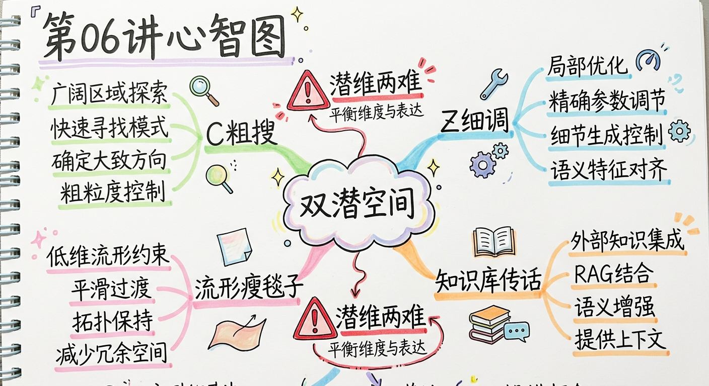

> **看图三秒：** Z 细、C 粗、知识库传话；反派是潜维两难。
**本讲赌注：** 在欧氏方盒里优化叶型，预算会先葬在自交与非法形。

---

#### 1. 生活与物理直觉引子：描述"形状"，比描述"数字"难得多

前面几讲处理的设计变量，本质上都是**一串数字**：叶型控制点的偏移量、叶片的周向平移量……变量再多，改变一个变量，形状就"连续地"变一点点。数学上这叫**欧氏空间**。

但真实工程里有一大类问题不是这样。比如：

- 一个翼型，用 **192 个点**离散描述，每点 2 坐标 → **384 个坐标标量**（结构化输入空间维，不是潜维）［原文 P06：*192 points* → *384 design variables*］。你随便挪动其中一个点，大概率得到一个**锯齿状、根本飞不起来**的怪物形状。
- 一个分子结构、一段程序代码、一个拓扑结构——这些是**离散空间**或**非欧空间**。

这类空间有两个特点：① 维度极高；② **变量之间高度耦合**（原文用词是 highly interacted），必须"成组地"改变才有意义。在这上面直接做贝叶斯优化，几乎必然失败——高斯过程会认为"每个点都可以独立乱动"。

**生成模型（GAN / VAE）给出的解法**：先学一个从"低维潜空间"到"合法形状"的映射。潜空间里每个点都对应一个**看起来像真翼型**的形状，于是在潜空间里优化就安全多了。这套两阶段流程叫做 **GMO（Generative Model-based Optimization）**。

**流形直觉：**  
在 384 维坐标里随机撒点，得到的「翼型」十有八九自交、开叉、像事故现场。  
真正合法的叶型，挤在一张弯曲的「瘦毯子」（流形）上。  
生成模型的工作，就是别再网格世界里乱跑，而在毯子上走路。

> **先猜后揭：** 若本讲反派「潜维两难」赢了，你的下一笔 CFD/实验预算会怎样被浪费？揭晓贯穿 §3–§5。

| 生活元素 | 工程元素 | 符号 |
| :--- | :--- | :--- |
| 主比喻侧 | 高维潜空间 | Z |
| 主比喻侧 | 低维潜空间 | C |
| 主比喻侧 | 生成器 | G |
| 主比喻侧 | 知识库 | ℳ(t) |

**384 坐标的诅咒：** 大多数挪法得到自交与鬼形。欧氏方盒里优化，预算先浪费在非法形。生成模型把搜索关进合法毯子。

**欧氏盒子的诅咒（加长）：**  
384 个坐标每个都能动，大多数动法得到自交与不可铣形。  
优化预算先浪费在非法区，是「还没开始就输了」。  
生成模型的价值：把搜索关进合法毯子；双潜是毯子上的粗路与细路。

**方盒子优化的一日流水：**  
早上：随机扰动坐标。  
中午：一半样本自交/尖角，CFD 预处理报错。  
下午：活下来的样本里仍有「合法但垃圾」的形。  
晚上：优化器报告「探索充分」——其实预算葬在非法区。  
流形路线把「探索充分」重新定义为：在毯子上走得充分。

**毯子上的交通规则：**  
先合法，再优化；先粗路（C），再细路（Z）；用相册（知识库）避免绕圈。  
交通规则破坏时，加算力无用。

---

#### 2. 叶轮机械中的真实工程死穴：潜空间维度，选大还是选小？

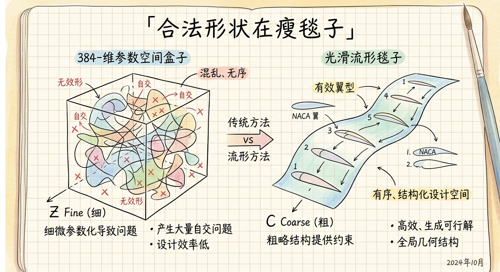

> **指读：** 左：384维乱挪自交；右：合法形挤在毯子上，Z细C粗在毯子上走。

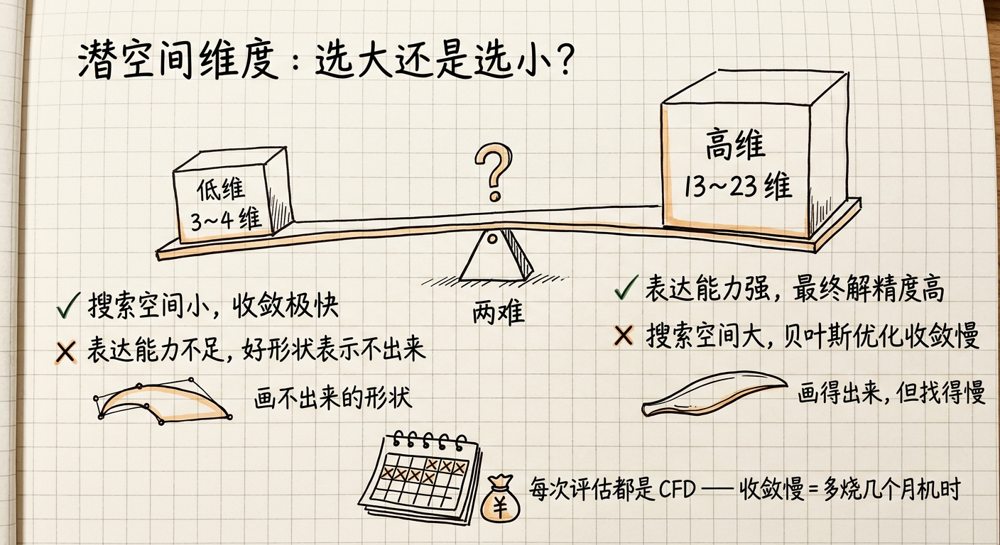

> **指读：** 这张图是本讲工程死穴的一张图版本。

GMO 好用，但有一个绕不开的抉择：**潜空间取多少维？**

这是一个**两难**：

| 潜空间维度 | 优点 | 缺点 |
| :--- | :--- | :--- |
| **低维**（主设定 C=**3**；对照 GMO-Low 曾用 **4**） | 搜索空间小，**收敛极快** | 表达能力不足，好形状可能表示不出 → 终解精度差 |
| **高维**（主设定 Z=**13**；对照把潜维拉到 **23**） | 表达能力强，**终解更准** | 搜索空间大，贝叶斯优化**收敛慢** |

原文把这个矛盾概括为：**潜空间维度难以确定，会引发"解的精度（solution accuracy）"与"收敛速率（convergence rate）"之间的冲突**［原文 P06 摘要］。

而且这个冲突在叶轮机械上格外要命：因为每次评估是 CFD，**"收敛慢"直接等于"多烧几个月的机时"**。

本文的答案很巧妙：**既然选大选小都有道理，那就同时用几个不同维度的潜空间，让它们互相帮忙。**

**现场感：** 周五下班前组长要数——你面对的不是可以慢慢推的练习题，而是**算错一次就不可回收**的预算。

**潜维两难的量化直觉（不编造具体最优维）：**  
太大：搜索浪费、样本不够填满。  
太小：表达能力不够，最优被挤扁。  
双潜是工程折中：C 快速定向，Z 精修细节；知识库负责交班。

---

#### 3. 数学公式从 0 到 1 推导

先把公式关掉，用主比喻说一遍：

> **合法叶型挤在瘦流形毯子上**  
> 本讲反派是「潜维两难」。下面公式是这句话的展开；每条核心式尽量带**回译**。知识总量不删——深潜只是阅读路径，不是垃圾桶。

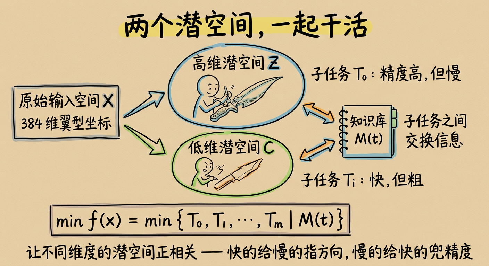

> **指读：** 先把这张图当 §3 地图，再读公式。

##### 3B. 本讲符号卡（建议截图留存）

| 符号 | 人话 | 备注 |
| :--- | :--- | :--- |
| Z | 高维潜空间 | 细 |
| C | 低维潜空间 | 粗 |
| G | 生成器 |  |
| ℳ(t) | 知识库 |  |

> 🧭 先认符号再读公式；主文核心式有「回译」，装不下的细节仍在正文完整保留（不删知识）。

##### 3C. 主路径公式与推导（知识全保留）

**第一步：把"多空间协同"写成优化框架**
**〔式〕** minₓ ∈ 𝒳 f(x) = min{T₀, T₁, …, Tₘ | ℳ(t)}

**回译：** 上式是主路径构件——先记住它在算法里负责哪一步，再抠每一个符号。

- 𝒳：结构化的原始输入空间（384 维翼型坐标）；
- T₀：在**高维潜空间** Z 上做的优化子任务；
- Tᵢ：在**低维潜空间** Cᵢ 上做的优化子任务；
- ℳ(t)：**知识库**，负责在子任务之间交换信息。

拆开写就是：
**〔式〕** T₀ = min_z ∈ Z y₀(z), T_i=min_c_i ∈ C_i y_i(c_i), i = 1, …, m

**第二步：关键设计——让潜空间之间"正相关"**

如果各个潜空间彼此独立，那"同时优化"就退化成"各自乱跑"。本文借 InfoGAN 的思路，在 GAN 的训练损失里加入**最大化互信息**的正则项：
**〔式〕** min_G max_D V_M(D, G) = V(D, G)-∑_{i=1}^{m}λ_i I(c_i; G(z))

互信息 I(c;G(z))=H(c)-H(c|G(z)) 不可直接算，用因子化高斯 Q(c|x) 做变分近似，得到下界：

**〔式〕** L_I(c;G(z)) = -∑_{j=1}^{|c|}[((c_j-μ_j)²)/(2σ_j²) + log(σ_j√(2π))] + H(c)

训练时令 μ_j = c'_j、把 H(c) 视为常数，于是优化目标变为**最小化 c 与逆推断 c' 之间的差距**：
**〔式〕** min -L_I≃min ∑_{j=1}^{|c|}[((c_j-c'_j)²)/(2σ_j²) + log(σ_j√(2π))]

**物理含义**：逼着低维潜空间 C 去"复述"高维潜空间 Z 生成出来的物体样貌。这样一来，C 的每一维都对上了物体的某个**主要变化特征**，两个空间就**正相关**了——知识才能在它们之间传递。

这个生成模型被命名为 **MFoO-GAN**。

**第三步：两个方向上的样本交换**

- **低维 → 高维（Cto Z）**：把 z=[c, z*] 里的"剩余变量" z* **固定为常数**（例如置零）。
 三个好处：① 搜索**优先沿物体的主要变化方向**推进；② 避免 z* 随机化引入噪声，使 C 中的样本在下一轮**可以复用**；③ 从 C 到 Z 的变换变得非常简单。
- **高维 → 低维（Zto C）**：走**判别器的逆推断结构**，取后验 Q(c'|x) 的均值 c'。
 相比作为先验的 c，c' 通过 σ_j² 把 z* 带来的变化也计入了，**逆推断更稳健**。

**第四步：以贝叶斯优化实例化时的两个策略**

**策略一：用低维空间的最优解，去收窄高维空间的搜索范围**

低维空间 C 捕捉的是物体的主要变化，因此它的当前最优解 c_min 很可能就落在真实最优解附近。于是用 c_min 在高维空间 Z 里划出一块**收窄区域**集中搜索，区域大小由参数 Δ 控制（**默认 0.15**）［原文 P06 §III-B-1、§IV-B］。

> 这一步的直觉：**低维潜空间先粗定方位，高维潜空间再精修。**  
> 本文主设定：MFoO-GAN 的高维潜空间 **Z=13**、低维潜空间 **C=3**［原文 P06：*high- and low-dimensional latent spaces … set to be 13 and 3*］。  
> 另有对照实验把单潜空间拉到 **23 维（GMO-High）** 与 **4 维（GMO-Low）** 以展示「维数↑更准但更慢」［原文 P06 Fig.9 一带］——**不要把 23/4 与 13/3 混成同一套旋钮。**

**策略二：把"跨空间变换来的样本"当低保真样本，用多保真 GP 消化**

从 Z 变换到 C、或从 C 变换到 Z 的样本，都伴随**精度损失**（毕竟经过了压缩/逆推断）。本文的处理很聪明：**不丢掉它们，而是把它们当作低保真样本**，构建多保真高斯过程（MFGP），用协方差矩阵作为知识库 ℳ(t)：
**〔式〕** k_M(c, C*) = [ρ₁₁k(c, C), ρ₁₂k(c, C')]

多保真核的分块形式：K_M(C*) 的对角块为 ρ₁₁ K(C) 与 ρ₂₂ K(C')，交叉块为 ρ₁₂ K(C,C') 与 ρ₂₁ K(C',C)，再加噪声对角 D。写作 
**〔式〕** K_M(C*) = Block(ρ_ab K(C_a, C_b))_a, b ∈ {1, 2} + D

其中 rhoᵢj 建模高保真与低保真样本的相关性，D 为噪声对角阵。

> 这一步与第 02 讲（Filter-GEI）的多保真思路一脉相承，但"低保真"的来源从**粗网格 CFD** 变成了**跨潜空间的变换**——这是个很漂亮的迁移。

**流形一句话考试：**  
合法叶型的集合更像瘦毯子，不像 384 维实心立方体。  
生成模型若学到毯子，优化就在毯子上走；否则你在立方体里撞墙。

---

#### 4. 算法控制流（原文 Algorithm 3）


> **指读：** 粗搜与细修分工；知识库避免重复拍烂构图。

> 🧭 **值班手册：** 先看「什么情况下走哪条分支」，公式是对白速记不是主角。

```

输入：目标优化问题、结构化输入空间的数据集 X
 1. 训练 MFoO-GAN，得到高维潜空间 Z 与若干个正相关的低维潜空间 C
 2. 用 LHS 在各潜空间生成初始样本并评估，得到 {Z, Y(Z)}、{C, Y(C)}
 3. while 未满足终止条件：
 4.   for 每个潜空间 Zi ∈ {Z, C}:
 5.       建立/更新多保真 GP 代理（MFGP）
 6.       用 EI 采集函数选出下一个查询点 z*_i = arg max EI(z_i)
 7.       评估新样本的真实目标值，更新该空间的训练集
 8.   end for
 9.   高维空间的强化开发：
        a. 用低维空间当前最优 c_min 更新 Z 的收窄区域（尺寸参数 Δ）
        b. 在收窄区域内用 EI 继续搜索
        c. 在 Z 与 C 之间做样本交换（图 3 的两个方向）
10. end while

```

> **一句话记住：** 形状在流形不在欧氏方盒；进阶：Z细C粗双潜分工。

**主比喻回扣：** 把上面的分支再翻译成「合法叶型挤在瘦流形毯子上」——若某步在生活里说不通，多半是符号没对齐。

**双潜像摄影：** C 变焦定构图，Z 对焦调纹理；知识库是相册，记录好构图。

**双潜 + 知识库的值班隐喻：**  
C：变焦定构图（粗语义快速定向）。  
Z：对焦调纹理（细结构精修）。  
ℳ(t)：相册，避免重复拍烂构图。  
缺相册时，两层会各搜各的，像两个实习生不交班。

---

#### 5. 实验验证与量化突破

**先报胜负：** 先读结论句与最大那一格，再读全表；表是证据架不是背诵清单。

**算例一：低速翼型优化**

- 原始空间：**192 个点 → 384 个设计变量**，变量高度耦合；
- 目标：最大化升阻比 L/D，用 **XFOIL** 计算；Re=1.8×10⁶、Ma_∞=0.01、AoA=0^°；
- MFoO-GAN：**高维潜空间 Z = 13，低维潜空间 C = 3**［原文 P06 明确 set to be 13 and 3］；SVD 基线潜空间维度同为 13；
- 每组实验重复 **10 次**［原文 P06 §IV-C-1］。

**算例二：亚声速翼型优化**

- 工况改为 Ma_∞=0.45（其余同低速算例）；
- MFoO-GAN：**Z = 23，C = 4**；SVD 潜空间维度 23［原文 P06 §IV-C-2］。

**算例三**：corbel（牛腿结构）设计；**算例四**：面积最大化问题［原文 P06 摘要］。

**基线共六类**［原文 P06 §IV-A］：GMO-High、GMO-Low（单潜空间 + 标准 BO）、GMO-NashEGO（多形式 BO，交替子空间**随机**生成）、SVD-BO（SVD 线性降维 + BO）、GMO-CMAES、GMO-IKEA。

**核心结论（原文明确表述，均为定性结论）**：

1. **GMFoO 的收敛速率与最终解都优于 SVD-BO。** 原因：SVD 本质上是**线性**降维模型，其潜空间的解精度不如 MFoO-GAN 这类非线性深度模型［原文 §IV-C］。
2. **GMO-Low 收敛最快、但最终解较差；GMO-High 最终解更好、但收敛更慢**——这正是第 2 节说的两难。原文原话：在 23 维设计空间中的 GMO-High，其收敛速率明显慢于在 4 维空间中的 GMO-Low［原文 §IV-C］。
3. **GMFoO 同时在两个潜空间上优化、互相补足，因而既拿到最好的解，又有更快的收敛速率。**
4. **一个重要的反例**：同样做"多形式优化"的 **GMO-NashEGO 反而差于**单潜空间的 GMO-High / GMO-Low。原因是它的交替子空间是**随机生成**的，缺少 GMFoO 那种"正相关"设计来保证知识有效传递［原文 §IV-C］。

> 📌 **这条反例特别有价值**：它证明"多空间并行"本身不带来收益，**真正带来收益的是"空间之间建立了可用 correspondence（对应关系）"**。

> ⚠️ **数字说明**：原文以收敛曲线图（10 次运行的阴影区）与最终解箱线图呈现结果，**摘要与正文未给出统一的数值表格**。本讲因此不引用任何具体提升百分比——**凡原文未给出的数字，本讲不写**。

**体感换算：** 把关键数字换成「工程师的周/月」或「一次签字的风险」——数字才进长期记忆。若原文给了墙钟时间或成本比，优先用原文换算。

---

**下游：** 07 迁移、08 反推，都站在「先有合法流形」上。

#### 6. 审稿人批判与承前启后

把软肋放上**可信度刻度**（0=完全不信，5=可当默认工具）：

| 维度 | 打分 | 人话 |
| :--- | :---: | :--- |
| 问题 | 5 | |
| 双潜 | 4 | |
| 实现 | 3 | |
| 工程 | 3 | |

**可以攻击的点：**

1. **核心问题只被缓解、未被根除**。本文的动机是"潜空间维度难定"，解法是"高低搭配"，但高维维度（13 / 23）仍是按算例人为给定，低维维度 d_L 仍要在 [3,5] 区间里试。
2. **新增两个超参**：收窄尺寸 Δ（默认 0.15）与低维维度 d_L。原文做了敏感性分析（§IV-F），但默认值仍是经验值。
3. **算例的"昂贵"程度有限**：翼型用 XFOIL（准二维、秒级求解），**并非真实的三维 RANS 叶栅**。本文没有在叶轮机械的昂贵 CFD 场景上验证——这一点必须诚实，因为"昂贵黑箱"的全部前提在本文算例中是被弱化的。
4. **生成模型依赖训练数据分布**：MFoO-GAN 在 UIUC 翼型数据库上训练；若目标形状明显偏离训练集（本讲的推论，非原文断言）（例如全新的超临界叶型、涡轮端壁），潜空间的表达能力会打折。
5. **工程链路复杂**：Python（GAN）+ MATLAB（BO）+ PERL（胶水脚本）三语言串联，复现与部署成本高。

**承前：**
- 直接延续**论文 01（CR-EI）**：CR-EI 用 GAN 做翼型参数化（13 维），本文则把"潜空间维度该怎么定"本身变成研究问题。
- 方法论上继承 GMO 两阶段框架、InfoGAN、贝叶斯优化与多保真 GP。

**启后：**
- **论文 08（SW-VAE）**：把"多潜空间 + 知识迁移"从**同一任务内的并行**推进到**跨任务迁移**——上一个型号学到的设计知识，迁移到新型号上；
- **论文 17（GTO）**：进一步引入**梯度重参数化**，让生成式潜空间能直接支撑梯度式迁移优化；
- **论文 14（VAE-NURBS 端壁参数化）**：把"生成模型学潜空间再优化"的思路从翼型推广到非轴对称端壁，但用的是 **VAE + NURBS 层**而非 GAN［出版商页面 摘要，论文 14］。

---

---

#### 附：潜维两难的选型尺

| 症状 | 可能病因 | 动作 |
| :--- | :--- | :--- |
| 大量自交/尖角 | 在欧氏坐标硬优 | 先上生成流形 |
| 潜维很大仍表达差 | 流形没学好 / 数据脏 | 查数据与解码器 |
| 潜维很小优化假收敛 | 表达能力不够 | 增维或双潜（Z 细 C 粗） |
| 两层各搜各的 | 缺知识库传话 | 加 ℳ(t) 或精英迁移 |

**摄影比喻复盘：** C 定构图，Z 调纹理；相册（知识库）避免重复拍烂构图。

---

#### 附：从「坐标优化」到「流形优化」的切换令

**切换前症状：** 大量 CFD 浪费在自交/尖角；优化器在非法区空转。  
**切换令：** 停止在 384 维盒子里挪点；先训练/借用生成模型，把搜索关进合法毯子。  
**双潜何时上：** 单潜要么太大（浪费）要么太小（表达不够）——Z 细 C 粗是折中，不是炫技。

---

#### 附：GMFoO 故障排查

| 症状 | 先查 |
| :--- | :--- |
| 大量非法形 | 解码器/数据，是否真在流形上 |
| 两层各玩各的 | 知识库 ℳ(t) 是否传精英 |
| 粗层好细层崩 | Z 维或正则 |
| 细层好粗层盲 | C 是否太小或训练不足 |

---

#### 附：流形优化的三日试点计划

**D1：** 冻结欧氏坐标优化；只评估生成样本合法率。  
**D2：** 单潜空间小规模优化，记录非法率与性能。  
**D3：** 开双潜 + 知识库，对比「有相册/无相册」的重复搜索次数。  

试点失败标准：合法率无提升、或两层不交班。失败就停，不扩算力硬刚。

---

#### 图卡：潜维两难

Z 高维精但对焦难搜，C 低维好搜但信息少。GMFoO 的答案不是二选一，而是 **C 构图 + Z 对焦** 双潜协同——一个潜空间不够。

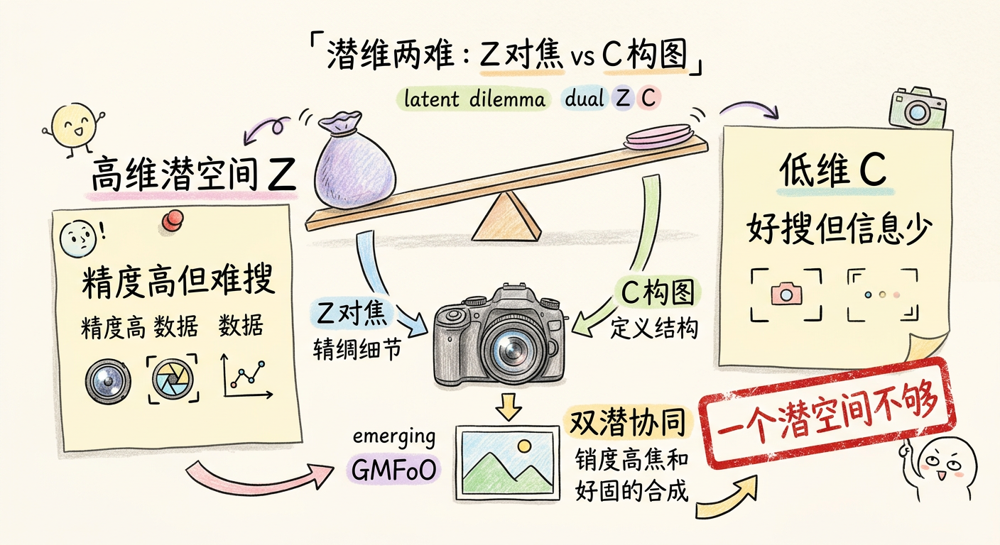

---

#### 图卡：坐标 → 流形切换令

欧氏盒子里乱采大量非法点 = 交学费；切换到瘦流形上只产合法形状。GMFoO 的第一道口令是：**还在变量坐标里硬搜吗？**

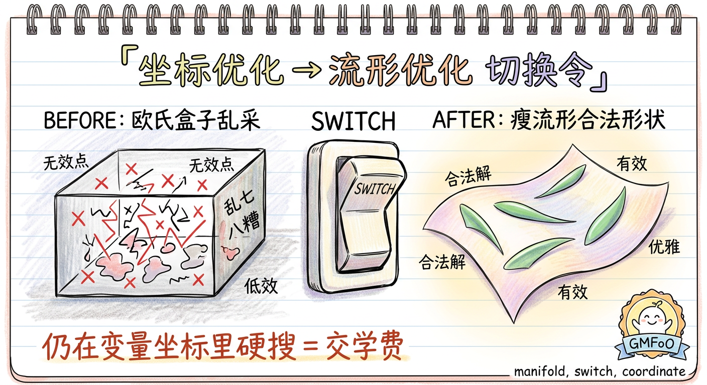

---

#### 图卡：双潜相册传话

C 负责构图、Z 负责对焦，知识库相册是两者传话的介质。双潜不是两套孤立相机。


---

#### 章末：30 秒复述 · 自测 · 元数据

**30 秒复述稿（可朗读）：** 合法形状在瘦流形上。GMFoO 用双潜：C 粗搜、Z 细修，知识库传话。反派是潜维两难——太大浪费、太小表达不够。先离开欧氏方盒，再谈优化器。

**自测（先做再对答案）：**

1. 为何不直接优化坐标？
2. Z/C？
3. 知识库？

<details>
<summary>点开看参考答案</summary>

1. 易非法/自交。
2. 细/粗。
3. 跨层传好结构。

</details>

> **本讲元数据**（读完再看，不挡故事）
> | 项 | 值 |
> | :--- | :--- |
> | 规范编号 | **06** |
> | 原始文献 | *IEEE Transactions on Cybernetics*, **2023, 53(7): 4347–4360** |
> | DOI | **`10.1109/TCYB.2022.3165044`** |
> | 作者 | Zhendong Guo, Haitao Liu, Yew-Soon Ong, Xinghua Qu, Yuzhe Zhang, Jianmin Zheng |
> | 本地原文 | `Generative_Multiform_Bayesian_Optimization.pdf` |
> | 证据等级 | **A（本地原文逐句可查）** |

> ❗ **著录更正**：仓库旧文档（README、全集汇总、论文链接整理）给出的 DOI 为 `10.1109/TCYB.2022.3168744`，**尾号错误**。原文首页印刷及第三方期刊的参考文献著录均为 **`10.1109/TCYB.2022.3165044`**。详见 `corpus/doi_verification.md`。

本讲正是下图中**第 3 阶段「生成式模型（GAN / VAE）— 更省的表征」**的开篇工作：前两阶段（代理模型、多保真）省的是"算多少次"，从本阶段起省的是"用什么来表示几何"。


> | 反派绰号 | 潜维两难 |
> | 主比喻 | 384 个坐标随便挪就会自交 |

---

<a id="lec-07" name="lec-07"></a>
### 【第07讲】SW-VAE / KT-ASO：把上一个型号的设计经验"搬"到新型号上（**论文 08**）

#### 本讲开场 90 秒

**上讲闪回：** 上讲同分布生成；本讲跨型号：经验如何帮、如何坑。

**本讲反派：** 「生搬经验」

**只要带走 3 句口诀：**

1. **迁流形与先验，不是死参数**
2. **源样本加权**
3. **120→100负荷跳跃会灾变**

**主比喻：** 红烧肉火候不能原样套牛腩

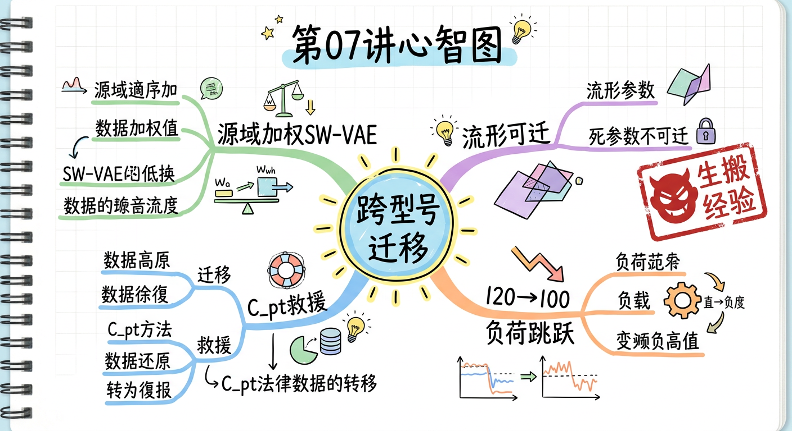

> **看图三秒：** 源域加权、流形可迁、120→100 跳跃；反派生搬经验。

**本讲赌注：** 若不加权就迁，高负荷分离泡可能直接把型号窗口打穿。

---

#### 1. 生活与物理直觉引子：为什么"相关经验"能帮你，也可能坑你


> **指读：** 左：先煸后炖可迁；右：90 分钟死表不可迁。

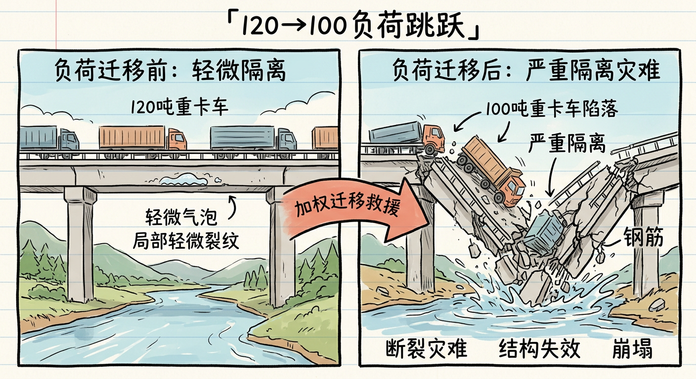

> **指读：** 左：温和分离；右：负荷一跳分离泡灾变；中间加权迁移是救援桥，不是装饰。

先看一个生活场景。你是一名厨师，已经把"红烧肉"做到了极致。现在老板让你做一道**从没做过**的"红烧牛腩"。

你会怎么做？显然不会从零开始瞎试——你会把红烧肉的经验搬过来：先煸炒、再上糖色、小火慢炖……**因为这两道菜的物理过程高度相似**。这就是**迁移学习（transfer learning）**。

但这里有个陷阱：如果你把"猪肉要炖 90 分钟"这条经验**原封不动**地套到牛腩上，可能就炖过头了。**经验有价值，但不能照搬**——用得不好，反而比不用更糟。在优化领域，这叫**负迁移（negative transfer）**。

把这个比喻映射到涡轮叶片设计：

- **源任务（source task）**：某个已经优化完成的型号（比如 GE-E3 低压涡轮叶片在原负荷下）；
- **目标任务（target task）**：新的设计要求（比如把叶片数从 120 减到 100，成为超高负荷叶片）；
- **要迁移的知识**：源任务优化过程中积累的**样本**（几何 + 对应的 CFD 评估结果）。

本文要做的事：**让这些"上一个型号"的样本，帮新型号的优化少烧几百次 CFD。**

**迁移的厨房纪律：**  
红烧肉的「先煸后炖」可以搬；「猪肉必须 90 分钟」不能死搬。  
源任务样本要**加权**，否则新型号数据会被旧型号淹没——像师傅回忆压过徒弟实测。

**纪律：** 先煸后炖可迁；必须90分钟不能死迁。

> **先猜后揭：** 若本讲反派「生搬经验」赢了，你的下一笔 CFD/实验预算会怎样被浪费？揭晓贯穿 §3–§5。

| 生活元素 | 工程元素 | 符号 |
| :--- | :--- | :--- |
| 主比喻侧 | 源/目标 | X_S/X_U |
| 主比喻侧 | 几何正则 | L_P |
| 主比喻侧 | 性能损失 | C_pt |
| 主比喻侧 | 加权VAE | SW-VAE |

**红烧肉 vs 牛腩（加长）：** 可迁的是焯水煸香慢炖的**结构**；不可迁的是「必须 90 分钟」死参数。120→100 负荷下分离泡会灾变，源域必须加权。

**红烧肉迁移实验（加长剧本）：**  
师傅 A 的牛腩秘方写着「小火 90 分钟」。师傅 B 换了五花肉，仍照 90 分钟——柴。  
可迁的是「先焯后煸再小火」的**结构**；不可迁的是时间表上的死数字。  
叶片 120→100 负荷跳跃同理：源域经验要**加权**，相关的进厨房，不相关的别污染汤底。

**失败会怎样：** 生搬几何参数表 → 分离泡灾变 → C_pt 冲到双位数 → 型号窗口关闭。迁移不是锦上添花，是救援绳。

**跨型号厨房的完整菜单：**  
- 可迁：焯水→煸香→小火的**工序结构**，以及「别把肉炸糊」的正则。  
- 不可迁：牛腩 90 分钟的死时钟、上一代最优安装角的照抄。  
120→100 的负荷跳跃，像把火突然开大：源域经验仍有用，但必须**加权**——相关的进汤，不相关的别污染。

**C_pt 是救援量表，不是刷榜量表：**  
双位数损失掉到个位数，谈的是型号窗口还在不在；小数点第三位留给已稳住的阶段。

---

#### 2. 叶轮机械中的真实工程死穴：高保真 CFD 越用越贵，预算却越来越少

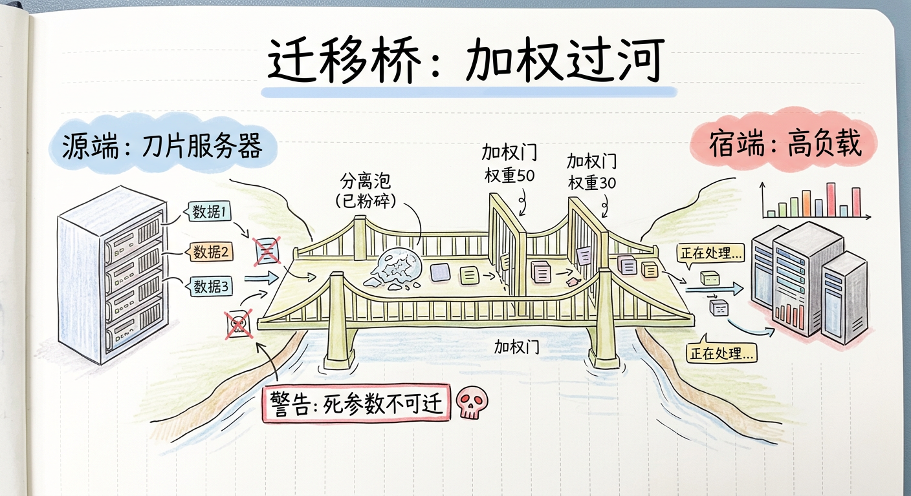

> **指读：** 源域加权过桥；死参数不能原样搬；高负荷侧分离泡要被压住。

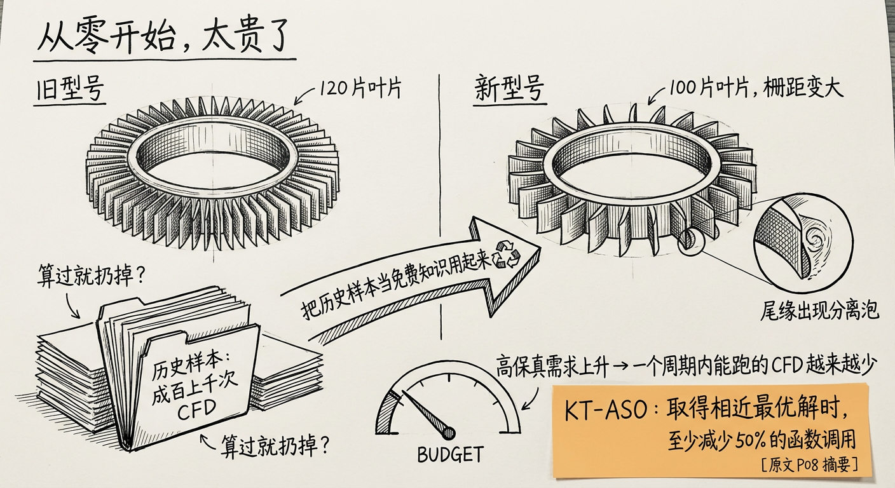

> **指读：** 这张图是本讲工程死穴的一张图版本。

原文开头的逻辑链很清晰：

> 涡轮叶片气动形状优化（ASO）是典型的昂贵黑箱问题。**随着设计要求日益严格，高保真仿真的需求上升，仿真成本急剧增加，这意味着一个优化周期内允许的仿真调用次数越来越少。**［原文 P08 摘要］

前几讲的所有方法（CR-EI、Filter-GEI、GSDE、DA-EGO）都在回答"**下一个点算在哪里**"。本文换了一个更根本的问法：

> **能不能干脆不"从零开始"？**

如果上一个型号的优化过程已经产生了成百上千个样本，而这些样本与新型号共享大量气动规律，那么**把这些历史样本当"免费的知识"用起来**，是不是就能减少新任务需要的 CFD 次数？（本讲设问，具体降幅见本讲第 5 节的原文数据）

本文给出的答案：是的，而且效果显著——**取得相近最优解时，KT-ASO 至少减少 50% 的函数调用**［原文 P08 摘要］。

**现场感：** 周五下班前组长要数——你面对的不是可以慢慢推的练习题，而是**算错一次就不可回收**的预算。

**高保真越用越贵的夹击：**  
新型号要更多 CFD，预算却更紧；还指望「把旧型号最优外形贴过来」。  
贴过来的那一刻，你可能把源域的局部最优当成了目标域的全局——这是生搬经验的数学脸。

---

#### 3. 数学公式从 0 到 1 推导

先把公式关掉，用主比喻说一遍：

> **红烧肉火候不能原样套牛腩**  
> 本讲反派是「生搬经验」。下面公式是这句话的展开；每条核心式尽量带**回译**。知识总量不删——深潜只是阅读路径，不是垃圾桶。

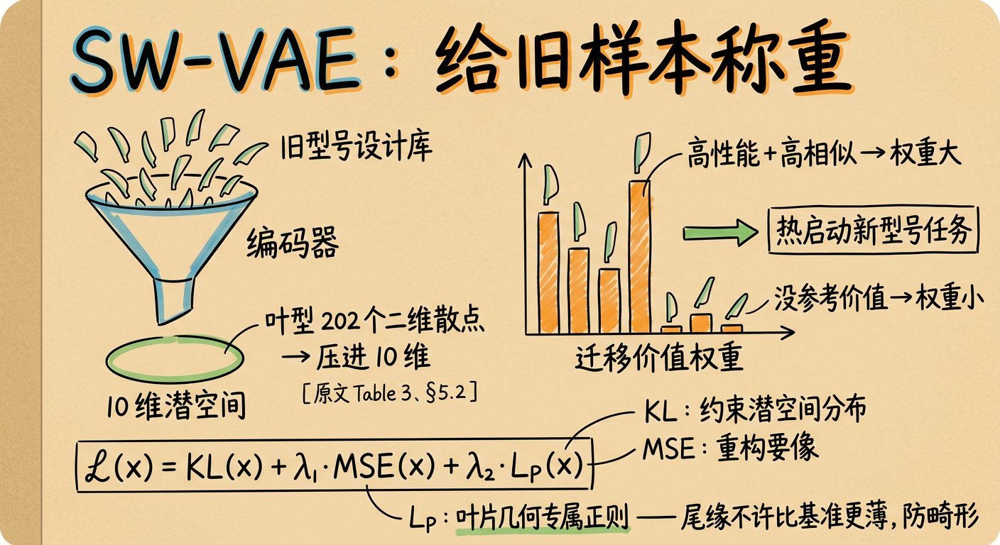

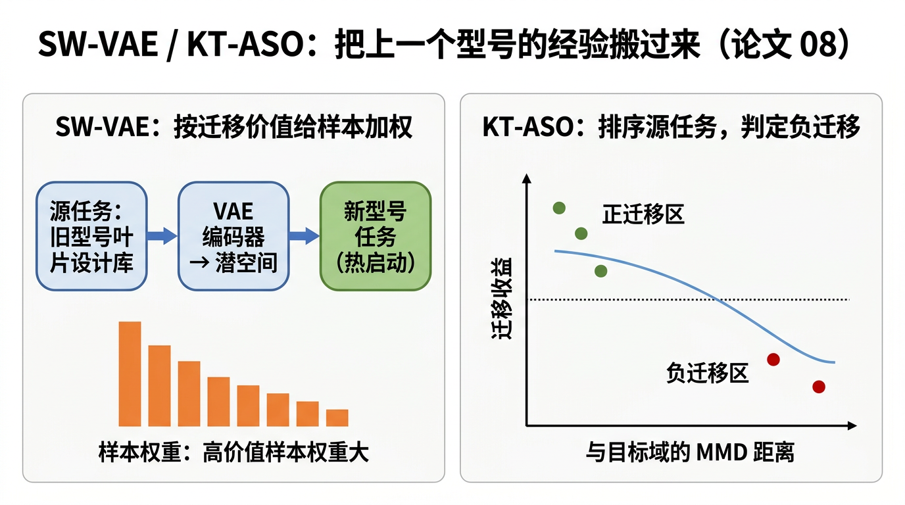

> 上图是本讲全部数学的「一张图版本」：**左图**是 SW-VAE——旧型号设计库经编码器进入潜空间后，按「迁移价值」给样本加权（橙柱高低），高性能、高相似样本权重更大，用于热启动新型号任务；**右图**是 KT-ASO 的源任务排序——横轴为与目标域的 MMD² 距离，距离近的源任务带来正迁移（绿点），远的属负迁移（红点），KT-ASO 只挑最近邻。

##### 3B. 本讲符号卡（建议截图留存）

| 符号 | 人话 | 备注 |
| :--- | :--- | :--- |
| X_S/X_U | 源/目标 |  |
| L_P | 几何正则 |  |
| C_pt | 性能损失 |  |
| SW-VAE | 加权VAE |  |

> 🧭 先认符号再读公式；主文核心式有「回译」，装不下的细节仍在正文完整保留（不删知识）。

##### 3C. 主路径公式与推导（知识全保留）

**第一步：VAE 参数化与它的损失函数**

用 VAE 把叶型（向量 x 由 **202 个二维散点**组成）压进 **10 维潜空间**（编码器输出 ∈ ℝ¹⁰）［原文 P08：*202 two-dimensional*；网络图 *Input ∈ ℝ10*］。损失函数是三项加权：
**〔式〕** L(x) = KL(x) + λ₁ MSE(x) + λ₂ L_P(x)

**回译：** 上式是主路径构件——先记住它在算法里负责哪一步，再抠每一个符号。

- KL：KL 散度，约束潜空间的分布；
- MSE：输入叶型与重构叶型的均方误差；
- L_P：**叶片几何专属的正则项**——约束尾缘不薄于基准，防止生成畸形叶型：
**〔式〕** L_P=𝔼[(max{0, (r^ref_min-r_min)/(r^ref_min)})²]

实验取 λ₁ = 1, λ₂ = 500000。

此外，解码器末端嵌入了一个 **FFD 层**：控制点为 **6×5 网格**；**每个控制点有 2 个自由度**（前缘/尾缘上的点除外），故 **主动设计变量共 50 个标量**（不是「30 个点=30 维」）［原文 P08：*6×5 grid*；*total number of variables of FFD active control points is 50*］，以保证生成叶型的光顺性。

**第二步：核心难题——为什么源样本会被"淹没"，进而引发负迁移**

原文引用 Tripp et al. 的观察：

> VAE 所学设计空间中的样本分布，**大致正比于其在训练集中的出现频率**。

这带来两个连锁问题：

1. VAE 有效训练需要**上千个**样本（本文用了 **1010** 个无标签叶型），而源样本只有**几十个**（本文每轮用 **40** 个）。直接混在一起训练，源样本的独特特征会被彻底淹没。
2. 更糟的是，源样本是"已完成任务的优化解"，它们往往**落在训练集分布之外**。于是用基础 VAE 把源样本重参数化进潜空间时，**重构出的叶型和原始叶型差得很远**——迁移过来的"知识"本身就是错的，用它引导优化只会拖后腿。这就是**负迁移**。

**第三步：样本加权训练策略（SW-VAE 的核心）**

解法分两层。第一层：**把源样本纳入训练集**（让它不再位于分布之外）。
**〔式〕** ℒ_w=∑_{i=1}^{n}^(S)L(x^(S)_i) + ∑_{j=1}^{n}^(T)L(x^(T)_j)

关键在于：**在每个 epoch 的每个 batch 中，固定源样本数 n^(S) 与无标签样本数 n^(T) 的比例**（实验中取 n^(S)/n^(T)=1），分别从源样本集 X_S 与无标签集 X_U 中随机抽取。

这样一来，哪怕源样本只占全集的极小一部分，它们的特征也能被稳定地学进去。

**第四步：为什么"纳入源样本"还有第二个好处？**

因为**源任务与目标任务的最优解，特征上是相似的**（本文的 t-SNE 可视化证实了这一点：两者的最优解落在潜空间的相近区域）。

所以，把源样本学进潜空间，等价于**人为提高了潜空间中"高分候选解"的比例**——优化器一上手就站在离好解更近的地方。

**第五步：多保真代理——把源样本当低保真数据**

源任务与目标任务的趋势"相似但不完全相同"，因此最合理的处理是：

> **源样本 = 低保真样本；目标样本 = 高保真样本。**

多保真高斯过程的协方差结构：

目标/源任务的联合核：对角块 K_T、K_S，交叉块 ρ K_ST 与 ρ K_TS，加噪声 D；预测协方差行向量 

**〔式〕** k_M(z, Z*) = [k(z, Z_T), ρ k(z, Z_S)]

**〔式〕** ŷ_M(z) = k_M(z, Z*)K_M⁻¹[Y_T, Y_S]^⊤, σ_M²(z) = k_M(z)-k_M(z, Z*)K_M⁻¹k_M(Z*, z) + σ²_n, 1

其中 ρ 建模源与目标的相关性，D 是噪声对角阵。随后用多保真版 EI 引导搜索：
**〔式〕** EI_M(z) = (y^(t)_min-ŷ_M(z))Φ(u_M) + σ_M(z) φ(u_M), u_M=(y^(t)_min-ŷ_M(z))/(σ_M(z))

> 这一步与第 02 讲（Filter-GEI）的多保真思想同源，但"低保真"的来源从**粗网格 CFD** 换成了**历史任务的样本**——这是本讲最值得记住的迁移。

---

#### 4. 算法控制流（KT-ASO）

> 🧭 **值班手册：** 先看「什么情况下走哪条分支」，公式是对白速记不是主角。

```

(1) 训练样本加权 VAE
      无标签叶型集 XU（1010 个，由基准叶型做 ±10% 几何扰动生成，不经 CFD）
    + 源样本集 {xS, yS}m（已完成任务的高分样本）
    → 按固定 n(S)/n(T) 比例分 batch 训练

(2) 用 LHS 在 VAE 潜空间生成目标任务的初始样本，做 CFD 评估 → {zT, yT}

(3) 用 VAE 编码器把源样本 {xS, yS}m 重参数化进潜空间 → {zS, yS}m

(4) 合并 {zT, yT}（高保真）与 {zS, yS}（低保真），建立多保真 GP

(5) 用多保真 EI 选下一个查询点，评估后加入 {zT, yT}

(6) 重复 (4)(5) 直至满足终止条件

```

> **一句话记住：** 迁流形与先验，不是死参数；进阶：源样本加权。

**主比喻回扣：** 把上面的分支再翻译成「红烧肉火候不能原样套牛腩」——若某步在生活里说不通，多半是符号没对齐。

**KT-ASO 值班口令（人话）：**  
1. 源域样本先过加权门（SW-VAE / 相关权重）。  
2. 几何正则 L_P 守住尾缘等不可破底线——「宁可不漂亮，不能薄到脆」。  
3. 目标域无标签点靠流形对齐，不靠抄参数表。  
4. 优化时把迁移先验嵌进搜索，而不是优化完再后悔。

**KT-ASO 值班加长版：**  
1. 源域样本过加权门（相关高权重大）。  
2. L_P 守几何底线（尾缘等）：「宁可不漂亮，不能薄到脆」。  
3. 目标域无标签点靠流形对齐，不靠抄表。  
4. 优化时迁移先验在场，而不是优化完再后悔。  
5. 出报告时同时给：加权策略、正则强度、失效案例（生搬对照）。

---

#### 5. 实验验证与量化突破

**先报胜负：** 先读结论句与最大那一格，再读全表；表是证据架不是背诵清单。

**数值验证（先验证多保真迁移本身）**［原文 Table 1、Fig. 8］

- 源任务：0.9×Ackley6d +0.1×Rosenbrock6d；目标任务：Ackley6d（均为 6 维，xᵢ∈[-2,2]）；
- 源样本先在源任务上跑标准 BO 获得；初始样本数与源样本数均设为 6 倍维度；10 次独立运行［原文 P08 Table 1 / Fig. 8］；
- 结论：多保真版（MFO）**收敛更快、最终解明显更好**。

**工程算例：GE-E3 低压涡轮第二级转子叶片（rb23）的超高负荷改型**

- 做法：把叶片数从 **120 减到 100**（栅距由 25.006 mm 增大到 **30.0072 mm**），进出口边界条件保持不变；
- 代价：尾缘出现明显分离泡，**总压损失系数 C_pt 从 4.22% 恶化到 12.99%**［原文 Table 2、§5.1］；
- 优化目标：最小化 C_pt，约束流量在基准的 [0.98,1.02] 倍内、尾缘最小半径不薄于基准；
- 边界条件：进口气流角 49.3°、进口总压 319,339.2 Pa、进口总温 1161 K、出口静压 245,618 Pa；轴向弦长 26.6 mm；
- 源任务：同一叶型在**原负荷**下的优化（假设已完成）；先在源任务上跑 10 次 BO 收集 **1400** 个中间样本，取 C_pt 最低的 **400** 个为候选，每次 KT-ASO 运行随机抽取 **40** 个作为源样本；
- 样本预算：所有对比流程统一 **140 次 CFD**，各运行 10 次。

**先看重参数化精度——这是迁移能否成立的前提**［原文 Table 4，归一化 MSE］

| 模型 | 重构误差 |
| :--- | :--- |
| 基础 VAE | (8.610 ± 3.168)×10⁻³ |
| **样本加权 VAE** | (1.986 ± 1.572)×10⁻⁴ |

> **误差降低一个数量级以上。** 原文的可视化也显示：基础 VAE 的潜空间里，40 个源样本落在**边缘区域**（几乎不被覆盖），重参数化后叶型与原叶型有明显偏差；而样本加权 VAE 的潜空间很好地覆盖了源样本，重参数化后**几乎完全重合**。

**再看最终优化结果（10 次运行的中位数）**［原文 Table 5］

| 方法 | C_pt (%) | 流量 ṁ | 出口气流角 (°) |
| :--- | :---: | :---: | :---: |
| 基准（超高负荷 rb23） | 12.99 | 475.02 | −60.86 |
| FFD-BO（传统参数化） | 4.96 | 472.45 | −61.04 |
| GAN-BO | 4.86 | 474.47 | −60.95 |
| VAE-BO（基础 VAE） | 4.85 | 470.18 | −61.25 |
| **VAE-W-BO**（样本加权 VAE） | 4.75 | 468.78 | −61.35 |
| **KT-ASO**（加权 + 多保真迁移） | **4.52** | 473.32 | −61.06 |

**这张表设计得非常干净，可以做两步"消融"：**

1. **FFD-BO → VAE-BO**（4.96 → 4.85）：验证**生成式参数化**优于传统 FFD。原因是 FFD 的设计空间是围绕**单个基准叶型**扰动出来的，而 VAE 的设计空间是从 **1010 个不同叶型**中学出来的，形状多样性（高分候选解比例）高得多。
2. **VAE-BO → VAE-W-BO**（4.85 → 4.75）：单独验证**样本加权**的收益。
3. **VAE-W-BO → KT-ASO**（4.75 → 4.52）：单独验证**多保真知识迁移**的收益。

- KT-ASO 相对基准把 C_pt 从 **12.99% 降到 4.52%**；
- 相对最好的非迁移基线 VAE-BO（4.85%），再降 **0.33 个百分点**［由 Table 5 计算］；
- 摘要给出的核心结论：**与无知识迁移的 ASO 流程相比，KT-ASO 在取得相近最优解时至少减少 50% 的函数调用**；在相同样本预算下则取得远优于对比流程的解。

**体感换算：** 把关键数字换成「工程师的周/月」或「一次签字的风险」——数字才进长期记忆。若原文给了墙钟时间或成本比，优先用原文换算。

**C_pt 救援：** 损失从双位数降到个位数，迁移是从型号失败边缘拉回——看灾难是否解除，不只看均值小数点。

---

**预习 08：** 有编码器则 embed；若只留点云，请看 GTO。

#### 6. 审稿人批判与承前启后

把软肋放上**可信度刻度**（0=完全不信，5=可当默认工具）：

| 维度 | 打分 | 人话 |
| :--- | :---: | :--- |
| 动机 | 5 | |
| 效果 | 4 | |
| 超参 | 2 | |
| 理论 | 2 | |

**可以攻击的点：**

1. **源任务与目标任务是"人为构造"的同构问题**。目标是同一 rb23 叶型减叶片数得到的超高负荷改型，源任务是同一叶型在原负荷下——两者**过于相似**。真实工程中"相关任务"未必这么规整，**源与目标差多远时迁移会失效，本文没有给出判据**。
2. **负迁移的边界未被量化**。本文用样本加权**规避**了负迁移，但没有系统扫描"源目标相似度 vs 迁移收益"的曲线。
3. **训练样本 X_U 不含气动信息**。1010 个叶型是纯几何扰动生成的、未经 CFD，只用于学形状流形——潜空间本身没有气动偏好。
4. **只是二维中截面优化**。作者本人在结论中也承认框架"可进一步扩展到三维多学科优化"，即**本文尚未做到三维**。
5. **超参偏经验**：λ₂ = 500000、n^(S)/n^(T) = 1、源样本 40 个、潜空间 10 维，均未见系统的敏感性分析。
6. **GAN-BO 基线的公平性存疑**。原文自己也说 GAN 训练更困难，且其"样本重参数化与样本加权训练"尚需研究——也就是说，GAN-BO 是个"没吃饱"的对手。

**承前：**
- 继承 VAE/GAN 参数化（**论文 06 GMFoO**）与多保真 GP（**论文 02 Filter-GEI**、**论文 06**）。
- 关键跃迁：**GMFoO 是"同一任务内多潜空间并行"，本文是"跨任务知识迁移"**——后者才是真正能把 CFD 次数降一个量级的方向。

**启后：**
- **论文 17（GTO）**：本文的迁移是"把源样本当低保真喂给代理模型"；GTO 更进一步，用 **GAN + 梯度重参数化**让源域知识能直接以梯度方式参与目标优化；
- **论文 13（EMFS / MSFO）**：两者处理的是同一个隐患——"低保真（源）样本会不会误导优化"。本文靠固定的多保真核处理，EMFS 则用 DBSCAN 主动侦测失真区，是同一问题的两种解法。

---

**C_pt 救援怎么读：**  
若性能损失从双位数掉到个位数，迁移是在救型号窗口，不是在刷榜。  
读表时盯「灾难是否解除」与约束是否仍满足，不盯小数点第 3 位。

---

#### 附：可迁 / 不可迁清单（厨房版）

| 可迁 | 不可迁 |
| :--- | :--- |
| 先焯后煸再慢炖的**结构** | 「必须 90 分钟」的死时间表 |
| 形状流形与正则 L_P | 源域最优的具体安装角照抄 |
| 加权源样本 | 不相关源等权污染 |

120→100 负荷跳跃：分离泡可能灾变——加权与正则是安全带。

---

#### 附：迁移项目开题三问

1. 源/目标负荷差是否可能触发分离机制质变？  
2. 有没有可计算的相关/权重，而不是拍脑袋 0.5？  
3. 失败定义是什么——C_pt 阈值、约束违反，还是「看起来像」？

三问答不全，先别开「全自动迁移」。

---

#### 图卡：迁移加权过河

旧型号经验搬到新型号，靠的是加权样本过河，不是死搬时钟参数。可迁的是结构与分布形状；死数字掉河里。

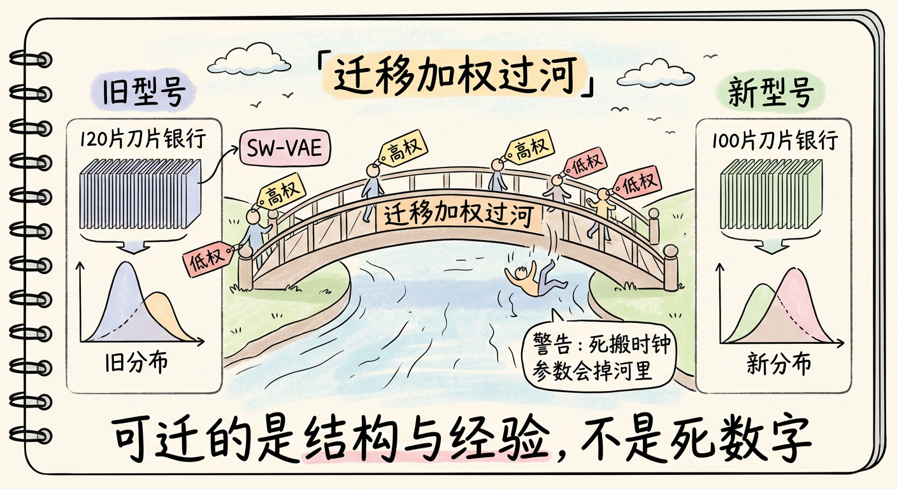

---

#### 图卡：可迁 / 不可迁清单

可迁：工序结构、损失形状、加权经验；不可迁：死时钟转速、绝对叶片数、旧网格分辨率。开题三问之前先过这张厨房清单。


---

#### 图卡：迁移开题三问

① 源任务分布差多远？② 哪些可加权哪些必须丢？③ 失败如何回退单任务？三问答不全，迁移项目不准开题。

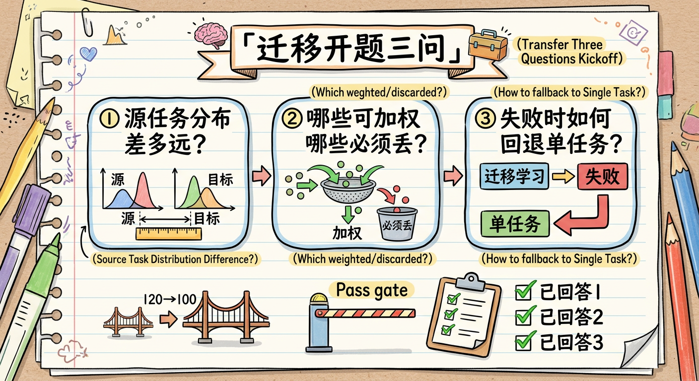

---

#### 章末：30 秒复述 · 自测 · 元数据

**30 秒复述稿（可朗读）：** 跨型号像换肉下锅：迁结构与流形，不死迁时间表。SW-VAE 加权源域，KT-ASO 把经验嵌进优化；120→100 负荷跳跃靠迁移救命。生搬参数表是反派。

**自测（先做再对答案）：**

1. 举一个可迁与一个不可迁的例子（厨房或叶片皆可）。  
2. 为什么源样本要加权？  
3. L_P 在守什么？

<details>
<summary>点开看参考答案</summary>

1. 可迁：先煸后炖的结构；不可迁：必须 90 分钟死时钟 / 照抄安装角。  
2. 源非等权，不相关会污染目标流形。  
3. 不可破的几何/工艺底线（如尾缘不能薄到脆）。

</details>

> **本讲元数据**（读完再看，不挡故事）
> | 项 | 值 |
> | :--- | :--- |
> | 规范编号 | **08** |
> | 原始文献 | *Aerospace Science and Technology*, **2024, 147: 108998** |
> | DOI | `10.1016/j.ast.2024.108998` |
> | 作者 | Zhendong Guo, Cunxi Li, Yun Chen, Liming Song\*, Jun Li, Zhenping Feng |
> | 本地原文 | `1-s2.0-S1270963824001317-main.pdf` |
> | 证据等级 | **A（本地原文逐句可查）** |

> 📌 **命名规范**：完整流程叫 **KT-ASO**（Knowledge Transfer accelerated ASO，知识迁移加速的气动形状优化）；**SW-VAE**（sample-weighted VAE）是其中的**参数化组件**。说"SW-VAE 算法"是不准确的。
> | 反派绰号 | 生搬经验 |
> | 主比喻 | 红烧肉师傅做红烧牛腩 |

---

<a id="lec-08" name="lec-08"></a>
### 【第08讲】GTO：GAN 不会"反推"，那就用梯度硬算出来（**论文 17**）

#### 本讲开场 90 秒

**上讲闪回：** 07有编码器；本讲更残：只会生成——梯度把点吸进潜空间。

**本讲反派：** 「参数化失传」

**只要带走 3 句口诀：**

1. **有G即可：梯度反推z***
2. **无编码器也能学流形**
3. **可嵌多保真思路**

**主比喻：** 前辈只留坐标点云，没有参数化图纸

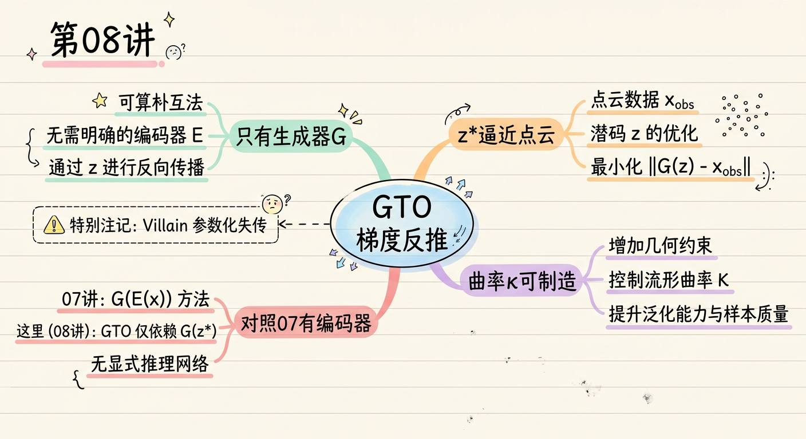

> **看图三秒：** 只有 G；z* 吸点云；对照 07 有编码器。

**本讲赌注：** 参数化失传时，不会反推 z* 就等于不会优化。

**本讲赌注：** 不会把点云吸成 z*，参数化失传就等于优化权丧失。

---

#### 1. 生活与物理直觉引子：别人给的图纸，只有一堆坐标点

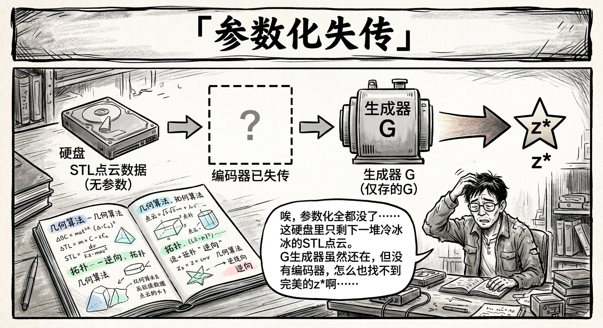

> **指读：** 硬盘里只有 STL；无编码器时用梯度把点吸进潜空间。

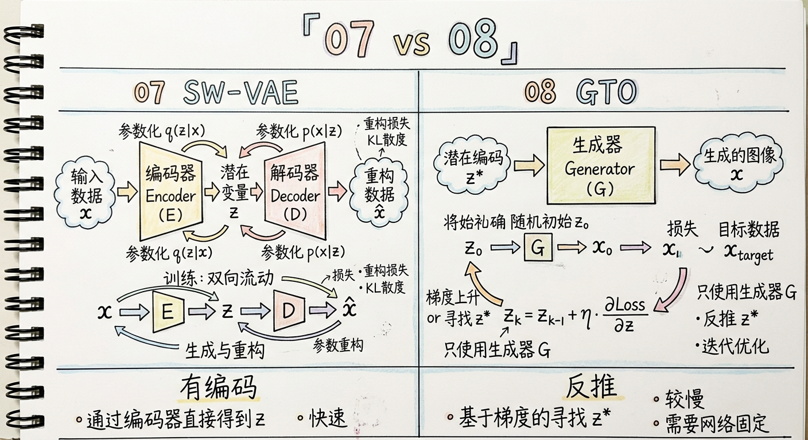

> **指读：** 左双箭头编码-生成；右只有 G，z 用梯度爬——两讲边界一眼看清。

第 07 讲讲过"把上一个型号的经验搬过来"。那里有个隐含的便利条件：**源样本是我们自己用同一套参数化方法生成的**，所以能通过 VAE 的编码器顺利映射进潜空间。

现在把场景换成更真实的工程处境：

> 你接手一个新叶型的设计任务。前辈留给你的，是**几百个优化过的叶型，每个都由上百个坐标点描述**——但**当时用的是什么参数化方法（NURBS？FFD？控制点怎么定义的？），并没有留下**（甚至这些结果来自别的单位）。

这时候，VAE 那套"用编码器逆推断"的便利没有了。更麻烦的是，如果你改用生成质量更强的 **GAN**，问题会更尖锐：**GAN 根本没有逆推断能力**——它只有生成器 G: zto x，没有编码器 xto z。

原文把这一点说得很直白：

> 当我们把源样本与目标样本一起用坐标散点表示时，可以用 GAN 学出一个**共享潜设计空间**……但**如何把已完成任务的解仿射到待求解问题的设计空间，并不是一件平凡的工作**。这可能解释了为什么迁移优化在以往的涡轮设计研究中鲜有涉及。［原文 P17 §3.1］

本文的第一个贡献，就是**给 GAN 补上这个"反推"能力**。

**07 与 08 对照（防混）：**

| | 第07讲 SW-VAE | 第08讲 GTO |
| :--- | :--- | :--- |
| 有没有编码器 | 有 | 往往没有 |
| 源样本形态 | 同参数化体系 | 可能只是坐标点云 |
| 关键动作 | 样本加权 + 迁移 BO | **梯度反推 z\*** |

**对照表请刻住：** 有无编码器，是两讲边界。

> **先猜后揭：** 若本讲反派「参数化失传」赢了，你的下一笔 CFD/实验预算会怎样被浪费？揭晓贯穿 §3–§5。

| 生活元素 | 工程元素 | 符号 |
| :--- | :--- | :--- |
| 主比喻侧 | 生成器 | G(z) |
| 主比喻侧 | 反推潜码 | z* |
| 主比喻侧 | 最大曲率 | κ_max |

**失传现场：** 硬盘只有点云，参数化脚本在离职员工笔记本。优化前必须把点塞回生成模型潜空间——即 z* 反推。

**失传现场加长：**  
文件夹名还叫 `blade_final_final2`，里面只有 STL。参数化脚本在离职员工的加密盘。  
你要做的第一件事不是开优化，而是问：有没有**生成器 G**？  
- 有编码器 → 走 07，点云可 embed。  
- 只有 G → 本讲：用梯度把 x 吸成 z*，再在潜空间动刀。

**对照表请钉住：** 07 双箭头；08 单箭头 + 爬坡。

**失传档案室（加长）：**  
- 抽屉 A：PDF 外形图，无参数。  
- 抽屉 B：STL/点云，无脚本。  
- 抽屉 C：传说中的「最终版」文件夹，编码器权重丢失。  

GTO 的立场是：**只要生成器 G 还在，点就能被梯度吸回潜空间。**  
吸回去之后，优化在 z 上做，解码回几何再评估——你重新获得「可微的参数化」，但必须用曲率等约束防止吸出不可制造的鬼形。

**和 07 的边界再钉一次：**  
| | 07 SW-VAE/KT-ASO | 08 GTO |
| :--- | :--- | :--- |
| 编码器 | 有，可 embed | **无**，靠反推 |
| 典型输入 | 成对/可编码样本 | 点云/无标签外形 |
| 核心运算 | 加权迁移 + 潜空间优化 | **argmin ‖G(z)−x‖** |

---

#### 2. 叶轮机械中的真实工程死穴：二维叶型优化的 CFD 预算

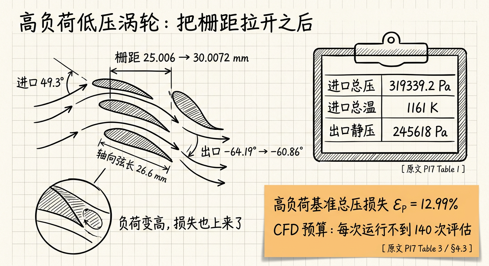

> **指读：** 这张图是本讲工程死穴的一张图版本。

本文的任务场景是**高负荷低压涡轮（LPT）叶片**设计。为什么高负荷叶片重要？

> 为响应提高航空发动机推重比的需求，目标任务是探索**高负荷**叶片——高负荷工况通过**增大原 GE-E3 低压涡轮叶片的栅距**来构造。［原文 P17 §4.1］

具体到本文：以 GE-E3 低压涡轮叶片为参考，把**栅距从 25.006 mm 增大到 30.0072 mm**，轴向弦长 26.6 mm、进口气流角 49.3°、进口总压 319 339.2 Pa、进口总温 1161 K、出口静压 245 618 Pa 均保持不变；出口气流角由 −64.19° 变为 −60.86°［原文 P17 Table 1］。高负荷基准的总压损失系数 ε_P 为 **12.99%**［原文 P17 Table 3 "Reference" 行］。

> 📎 **同一算例的更多背景来自论文 08（第 07 讲）**：该文指出这一栅距变化等价于**叶片数从 120 减到 100**，并给出原 GE-E3 叶片的损失系数 **4.22%**、以及高负荷后尾缘出现明显分离泡的流场描述［原文 P08 §5 与 Table 2］。**本文（P17）正文并未复述 4.22%、120→100 与分离泡**，这些细节请以论文 08 为出处引用。

所以目标是：在这个高负荷条件下把总压损失重新压下去——而 CFD 预算只有**每次运行不到 140 次评估**［原文 §4.3］。

**现场感：** 周五下班前组长要数——你面对的不是可以慢慢推的练习题，而是**算错一次就不可回收**的预算。

**二维叶型预算为什么仍贵：**  
即使是截面级 CFD，一轮设计要扫几何族 × 工况，次数仍轻松上千。  
生成式把搜索关进合法流形后，**每一次 CFD 更可能花在合法形上**——这是隐式省预算，不是魔法降网格成本。

---

#### 3. 数学公式从 0 到 1 推导

先把公式关掉，用主比喻说一遍：

> **前辈只留坐标点云，没有参数化图纸**  
> 本讲反派是「参数化失传」。下面公式是这句话的展开；每条核心式尽量带**回译**。知识总量不删——深潜只是阅读路径，不是垃圾桶。

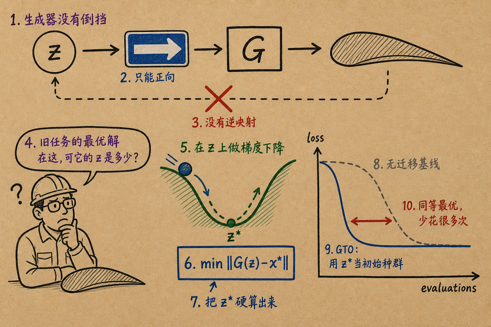

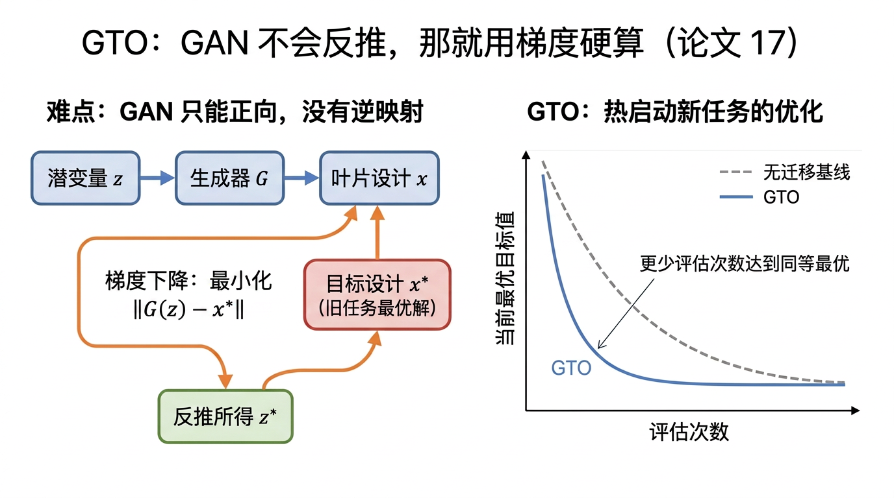

> 上图是本讲难点的「一张图版本」：**左图**是核心难点——生成器 G 只能正向 z→x、没有逆映射，想把旧任务最优解 x*「翻译」回潜空间，只能在 z 上做梯度下降、最小化 ‖G(z)−x*‖，把 z* 硬算出来；**右图**是收益——反推出的 z* 作为新任务初始种群后，GTO（蓝线）比无迁移基线（灰虚线）以更少的评估次数达到同等最优。

##### 3B. 本讲符号卡（建议截图留存）

| 符号 | 人话 | 备注 |
| :--- | :--- | :--- |
| G(z) | 生成器 |  |
| z* | 反推潜码 | argmin‖G-x‖ |
| κ_max | 最大曲率 |  |

> 🧭 先认符号再读公式；主文核心式有「回译」，装不下的细节仍在正文完整保留（不删知识）。

##### 3C. 主路径公式与推导（知识全保留）

**第一步：样本加权 GAN（沿用第 07 讲的思想，换到 GAN 上）**

GAN 损失加一项几何正则：
**〔式〕** L(x) = min_G max_D V(D, G) + λ L_P(x)

**回译：** 上式是主路径构件——先记住它在算法里负责哪一步，再抠每一个符号。

**〔式〕** min_G max_D V(D, G) = 𝔼_x∼P_data[log D(x)] + 𝔼_z∼P_z[log(1-D(G(z)))]

正则项 L_P 用**叶型最大曲率**来抑制尖角与自交（这是叶型生成的关键工程细节）：
**〔式〕** κ_max=max(|ẋÿ-ẍẏ|)/([ẋ² + ẏ²]^{1.5})

（ẋ, ẍ, ẏ, ÿ 用中心差分计算。）

训练数据两部分的**数量极不平衡**：无标签叶型 X_U 有 **1030** 个，源样本只有 **40** 个。直接混训会淹没源样本特征，于是沿用第 07 讲的**样本加权**策略：

**〔式〕** ℒ_w=∑_{i=1}^{n}^(S)L(x^(S)_i) + ∑_{j=1}^{n}^(T)L(x^(T)_j)

在每个 batch 中固定 n^(S)/n^(T)=1——**每批一半来自源样本、一半来自无标签样本**。

**第二步：本文的核心创新——梯度重参数化**

把"把一个坐标叶型 x 映射回潜向量 z"写成一个优化问题：
**〔式〕** z* = argmin_z ‖G(z)-x‖₂²

然后用 PyTorch 的自动微分做梯度下降：
**〔式〕** z⁽ⁿ⁺¹⁾ = z⁽ⁿ⁾-η·(∂‖G(z⁽ⁿ⁾)-x‖₂²)/(∂ z⁽ⁿ⁾)

> **一句话理解**：GAN 没有编码器？那就**用生成器本身做"反向搜索"**——不断调整 z，直到生成出来的叶型和目标叶型重合。

原文的可视化验证：把源样本先经梯度重参数化得到 z，再用 G(z) 重构出叶型 x̂；**原叶型与重构叶型几乎完全重合**［原文 Fig. 11、§4.2.2］。

**第三步：多保真迁移——源样本当低保真**
**〔式〕** ŷ_MFS(x) = ρ·ŷ_LF(x) + d(x)

其中 ρ 为缩放因子、d(·) 为差异函数。

**第四步：关键增强——用 EMFS 而不是普通 MFS**

原文明确指出多保真的隐患：

> 当 HF 与 LF 的函数趋势相关性不好时，只用 HF 建的单保真代理（SFS）可能比 MFS 更准；随着 HF 样本增多，SFS 也可能反超 MFS。**这时就会发生负迁移。**［原文 §3.3］

这正是第 05 讲（**论文 13**）处理的问题。本文**直接采用了论文 13 提出的 EMFS**（集成加权多保真代理，GTO 的参考文献 [36] 即该文）：
**〔式〕** ŷ_EMFS=w_G ŷ_MFS + w_L ŷ_SFS, s²_EMFS=w_G s²_MFS + w_L s²_SFS

**〔式〕** w(x) = (s_L²(x))/(s_L²(x) + s_G²(x)), w_L=sigmoid(m·w-b) = (1)/(1 + e⁻(m·w-b)), w_G=1-w_L

其中：
- s_G²：用**全部 HF 样本**建的单保真 GP 的预测不确定性；
- s_L²：用 **DBSCAN 检出的 HF 样本密集区**内的局部样本建的 GP 的预测不确定性。

直观理解：MFS 能抓住全局趋势，局部 SFS 在 HF 样本密集区更准，**EMFS 按不确定性自适应地加权融合**，两者兼得。

采集函数相应改为多保真 EI：
**〔式〕** EI_M(z) = (f^(t)_min-ŷ_M(z))Φ(u_M) + σ_M(z)φ(u_M), u_M=(f^(t)_min-ŷ_M(z))/(σ_M(z))

---

#### 4. 算法控制流（GTO / GAN-TO）

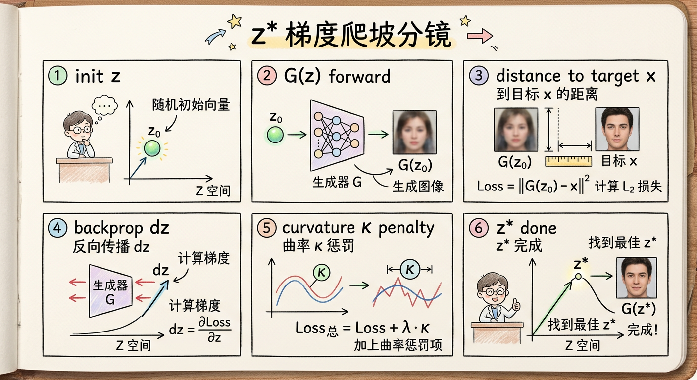

> **指读：** ①init z ②G(z) ③距离 ④反传 ⑤曲率惩罚 ⑥得 z*——参数化失传被绕开，可制造没被绕开。

> 🧭 **值班手册：** 先看「什么情况下走哪条分支」，公式是对白速记不是主角。

```

① 收集数据集 X = 无标签叶型 XU（1030 个）+ 源样本 {xS, yS}m（40 个，坐标点表示）
② 用样本加权策略训练 GAN（每 batch 中源/无标签各半）→ 共享潜设计空间 𝒵
③ 用梯度重参数化把源样本 xS 编码进潜空间 → {zS, yS}m
④ 目标侧：LHS 生成 40 个初始样本，做 CFD 评估 → HF 样本
⑤ 以源样本为低保真、目标样本为高保真，建立 EMFS（或 MFS）
⑥ 用多保真 EI 选点 → CFD 评估 → 更新样本集
⑦ 重复 ⑤⑥ 直到预算耗尽（< 140 次评估）

```

> **一句话记住：** 有G即可：梯度反推z*；进阶：无编码器也能学流形。

**主比喻回扣：** 把上面的分支再翻译成「前辈只留坐标点云，没有参数化图纸」——若某步在生活里说不通，多半是符号没对齐。

**梯度分镜：** 随机 z → 算 G(z) 与 x 距离 → 反传更新 z → 直到像。曲率约束防止走出可制造悬崖。

**反推分镜（可逐步指读）：**  
① 初始化 z；② 前向 G(z)；③ 算与目标点云/截面的距离；④ 反传 ∂/∂z；⑤ 投影/惩罚曲率 κ_max；⑥ 收敛得 z*。  
之后的优化在 z 上做，解码回几何再 CFD——**参数化失传被绕开了，可制造约束没有被绕开。**

**GTO 值班手册（可执行）：**  

```

输入：目标几何 x（点云/截面）+ 生成器 G
重复：
  ŷ = G(z)
  L = ‖ŷ - x‖ + λ·曲率/可制造惩罚
  z ← z - η ∇_z L
输出：z* ，此后在 z 邻域做设计搜索 / 迁移

```

**停损条件：** 距离不再降、或曲率惩罚爆炸（说明在逼近非法形）。  
**回扣主比喻：** 反推是「把失传图纸重新装订进可编辑的本子」，不是「徒手描一张更漂亮的图」。

---

#### 5. 实验验证与量化突破

**先报胜负：** 先读结论句与最大那一格，再读全表；表是证据架不是背诵清单。

**算例**：GE-E3 低压涡轮叶片高负荷改型（栅距 25.006 → 30.0072 mm）。

| 设置项 | 数值 |
| :--- | :--- |
| 边界条件 | 进口气流角 49.3°；进口总压 319,339.2 Pa；进口总温 1161 K；出口静压 245,618 Pa |
| 叶型 | 轴向弦长 26.6 mm；栅距 25.006 → **30.0072 mm**；出口气流角 −64.19° → −60.86° |
| 参考设计损失 | **12.99%** |
| 求解器 | RANS + **SST γ-θ 转捩模型**；对称边界 + 转捩周期；网格 **492,700** 单元 |
| 约束 | 流量在基准 [0.98,1.02] 倍内；尾缘最小半径 ≥ 0.2 mm（保证强度） |
| 预算 | 初始样本 40（LHS），每次运行总评估 **< 140**；各方法 **10 次**运行 |

**主要结果**［原文 Table 3］

| 设计 | 总压损失 ε_P (%) | 流量 ṁ | 出口气流角 (°) |
| :--- | :---: | :---: | :---: |
| 参考（高负荷） | 12.99 | 475.02 | −60.86 |
| FFD-EGO | 4.72 | 471.50 | −61.30 |
| GAN-EGO | 4.56 | 474.08 | −61.05 |
| GAN-TO-MFS | 4.35 | 473.64 | −61.10 |
| **GAN-TO-EMFS** | **4.29** | 467.70 | −61.69 |

**原文明确给出的三条结论：**

1. **为达到与 GAN-EGO 相近的优化结果，GAN-TO 所需的函数调用可减少 50% 甚至更多**［摘要与 §4.4］；
2. **GAN-TO 的结果鲁棒性明显更好**——其最优解的变动范围远小于 GAN-EGO；
3. **GAN-TO-EMFS 比 GAN-TO-MFS 收敛更快**。原因是 MFS 抓住全局趋势、局部 SFS 抓住 HF 密集区的局部趋势，EMFS 的自适应融合兼得二者。

**气动机理**：优化后尾缘附近的分离泡几乎消失，吸力面尾缘的"压力平台区"也一并消失。相比 FFD-EGO，GAN-EGO 的叶片负荷更靠前、尾缘逆压梯度更平缓；而 GAN-TO-MFS 与 GAN-TO-EMFS 的设计还出现了**二次加速（second accelerations）**，原文称其"of great help to reduce the pressure gradient along the suction surface, particularly the adverse pressure gradients"（定性表述，未给梯度数值），因而总压损失更低［原文 §4.4］。

**潜空间维度的敏感性分析（§4.5，很有价值）**

- 维度增大 → GAN 更能捕捉叶片的精细局部几何 → **重参数化精度提高**、设计空间中的真实最优更好；
- 但维度增大 → 建准代理需要**更多训练样本**；
- 在相同初始样本数与预算下：**d=3 收敛最快但最终解较差，d=30 结果最差，d=5 是最佳折中**。

**跨论文对比（与第 07 讲是同一个基准问题）**

两篇论文的 Table 1 / Table 2 数值**完全一致**（进口 49.3°、319,339.2 Pa、1161 K、245,618 Pa、26.6 mm、25.006→30.0072 mm、参考损失 12.99%）［对照原文 P08 Table 2 与 P17 Table 1］，因此可以在同一基准上排一条演进线：

| 方法 | 论文 | 总压损失 (%) |
| :--- | :--- | :---: |
| FFD-BO / FFD-EGO | 08 / 17 | 4.96 / 4.72 |
| GAN-BO / GAN-EGO | 08 / 17 | 4.86 / 4.56 |
| VAE-W-BO（样本加权，无迁移） | 08 | 4.75 |
| KT-ASO（VAE + 多保真迁移） | 08 | 4.52 |
| **GAN-TO-EMFS（GAN + 梯度重参数化 + EMFS）** | **17** | **4.29** |

> ⚠️ **对比须谨慎**：论文 08 通篇用 **BO** 作优化器、论文 17 通篇用 **EGO**，且源样本构成略有差异，**上表只能作为趋势参考，不是严格同条件对照**。

**体感换算：** 把关键数字换成「工程师的周/月」或「一次签字的风险」——数字才进长期记忆。若原文给了墙钟时间或成本比，优先用原文换算。

---

**选型：** 有编码器→07；仅生成器/无标签点云→08。

#### 6. 审稿人批判与承前启后

把软肋放上**可信度刻度**（0=完全不信，5=可当默认工具）：

| 维度 | 打分 | 人话 |
| :--- | :---: | :--- |
| 场景 | 5 | |
| 反推 | 3 | |
| 与07边界 | 4 | |
| 曲率 | 3 | |

**可以攻击的点**（其中涉及的设置与结论均出自原文 P17 §4–§5）：

1. **源任务与目标任务仍是"人为构造"的同构对**（同一叶型、靠增大栅距制造高负荷），与论文 08 的构造完全相同。**"源与目标差多远时迁移失效"这个最关键的问题，两篇都没有量化。**
2. **最优潜空间维度依赖预算**。原文自己在结论里承认"如何高效找到生成模型的最优潜空间维度"仍需更多研究——d=5 只是本文预算下的结论。
3. **梯度重参数化是逐样本的局部优化**。argmin‖G(z)-x‖² 对非凸的 G 没有全局最优保证，且每个源样本都要单独跑一次梯度下降。
4. **GAN 的训练成本未被计入"节省的 50%"**：4000 epochs、学习率调度、MMD 监控、模式崩溃风险——这些是实打实的工程开销。
5. **仍是二维叶型优化**，不涉及三维叶片与多学科约束。
   ［以上第 1–5 点均基于原文 P17 报告的方法设置与结果所作的合理质疑；其中"减少 50% 甚至更多"出自 P17 摘要与 §4.4，d=5 的敏感性结论出自 §4.5 与 §5 结论(3)］

**承前（本文是同组工作的集大成者）：**

| 继承自 | 继承的内容 |
| :--- | :--- |
| **论文 08（KT-ASO / SW-VAE）** | 样本加权训练策略、多保真迁移的整体框架（把 VAE 换成 GAN） |
| **论文 13（EMFS / MSFO）** | 多保真代理直接采用该文提出的 EMFS（含 DBSCAN 局部 SFS），见 GTO 参考文献 [36] |
| **论文 06（GMFoO）** | GAN 用于叶型参数化、潜空间优化的路线 |

**本文的独特贡献**：用**梯度重参数化**补上了 GAN 无法逆推断这一环，从而让生成质量更强的 GAN 也能用于迁移优化。

**顺带成果**：本文参考文献 [17] 提供了**论文 14（VAE-NURBS 端壁参数化）**的准确著录——C. Li, L. Song, Z. Guo, Z. Yang, J. Li, Z. Feng，ASME Turbo Expo 2024（London），论文号 **V12DT34A025**。这解决了第 09 讲那篇文献"查无此号"的问题。

---

**读高负荷改型结果的正确姿势：**  
先看是否在**可制造约束内**改善；再看相对无反推基线的增益。  
若只有「外形更花」没有约束表，工程组应退回。摘要/全文数字以本讲 §5 原表为准，不在此处另造百分比。

---

#### 附：选型树——07 还是 08？

```

有成对数据且编码器可用？
  ├─ 是 → 优先 07（embed 稳、迁移工具链成熟）
  └─ 否 → 只有 G / 点云 → 08（梯度反推 z*）
曲率/工艺约束是否进损失？
  └─ 否 → 先补约束再优化（否则 z* 可能不可铣）

```

**一句话：** 07 会编码；08 会爬坡。工具箱两把扳手都要会。

---

#### 附：反推失败模式

| 现象 | 处理 |
| :--- | :--- |
| 距离不降 | 换 init z / 加步数 |
| 曲率爆炸 | 加大 κ 惩罚，承认目标形非法 |
| 可反推但 CFD 崩 | 光顺与网格门禁未过 |
| 与 07 结果差很远 | 检查是否该用编码器路线 |

---

#### 图卡：编码器失踪案

07 讲有编码器；本讲现场更残——只剩生成器 G 与点云。GTO 用梯度把几何「吸」进潜空间得到 z*，硬算反推。

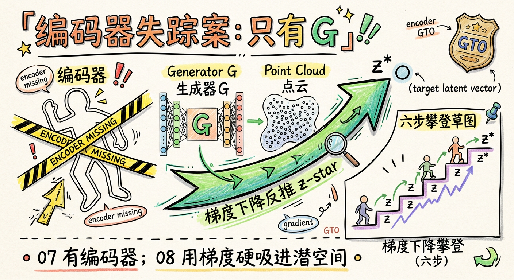

---

#### 图卡：选型树 07 还是 08

有历史编码器 → 07 迁移路径；参数化失传只剩生成器 → 08 梯度反推 z*。选型先问「还剩什么映射」，再谈算法名词。

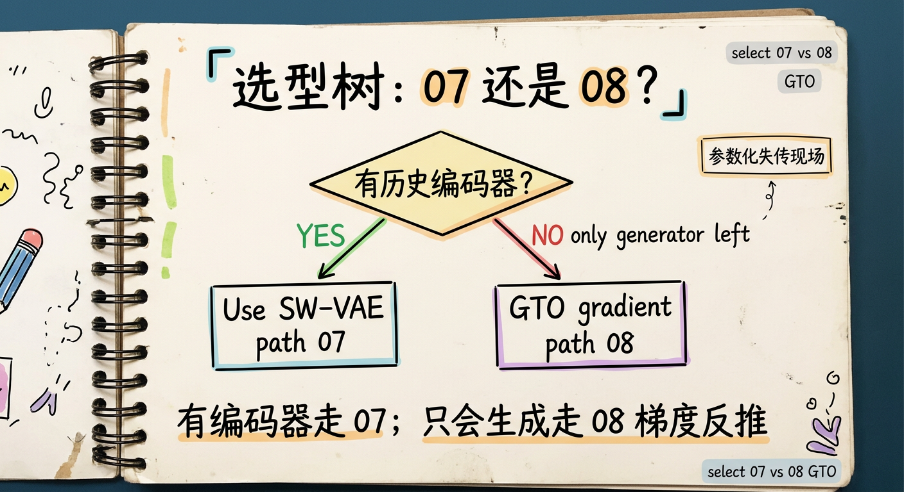

---

#### 图卡：z* 爬坡六步

无编码器时，梯度把随机 z 一步步吸到匹配点云的 z*。六步不是魔法，是可重复的硬算工序。

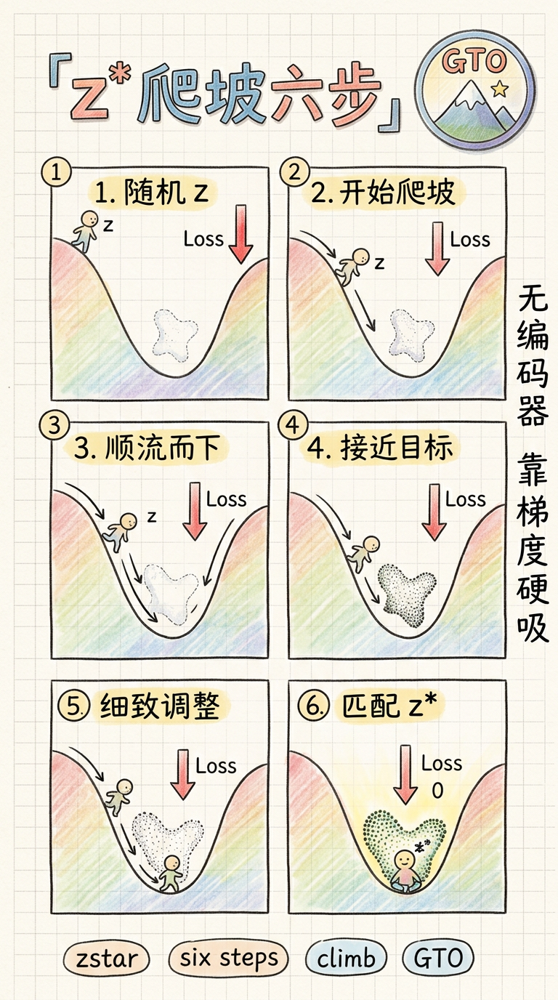

---

#### 章末：30 秒复述 · 自测 · 元数据

**30 秒复述稿（可朗读）：** 参数化失传时只剩点云。GTO 用生成器 G 与梯度把 x 吸成 z*，在潜空间再设计；曲率约束守可制造。07 有编码器可 embed，08 靠爬坡。工具箱两把扳手。

**自测（先做再对答案）：**

1. 07 与 08 的关键差别是什么？什么场景必须上 08？  
2. z* 在优化什么？曲率项为什么要进损失？  
3. 反推收敛但几何不可铣，说明值班手册缺了哪一步？

<details>
<summary>点开看参考答案</summary>

1. 07 有编码器可 embed；08 无编码靠梯度反推。点云/失传参数化 → 08。  
2. 使 G(z)≈x；曲率守可制造，防爬出非法形。  
3. 缺曲率/工艺惩罚或停损——距离降了不等于可生产。

</details>

> **本讲元数据**（读完再看，不挡故事）
> | 项 | 值 |
> | :--- | :--- |
> | 规范编号 | **17** |
> | 原始文献 | *Aerospace Science and Technology*, **2026, 177: 112324** |
> | DOI | `10.1016/j.ast.2026.112324` |
> | 作者 | Fei Zeng（中国航发湖南动力机械研究所）, Cunxi Li, Liming Song, Zhendong Guo（通讯） |
> | 本地原文 | `1-s2.0-S1270963826007042-main.pdf` |
> | 证据等级 | **A（本地原文逐句可查）** |

> 📌 **命名**：整体框架叫 **GTO**（Generative Transfer Optimization）；实验中把具体实现标为 **GAN-TO**，又分 **GAN-TO-MFS**（用 Co-kriging 多保真）与 **GAN-TO-EMFS**（用集成加权多保真）两个版本。
> | 反派绰号 | 参数化失传 |
> | 主比喻 | 别人只留给你一堆坐标点的图纸 |

---

<a id="lec-09" name="lec-09"></a>
### 【第09讲】VAE-NURBS 端壁参数化：把生成式参数化从叶型推广到非轴对称端壁（**论文 14**）

#### 本讲开场 90 秒

**上讲闪回：** 叶型生成后推到端壁：更脏、更3D、更易废。

**本讲反派：** 「轴对称偷懒」

**只要带走 3 句口诀：**

1. **轴对称省事但挡不住通道涡**
2. **VAE提案+NURBS托底**
3. **废品极多，生成式先滤合法**

**主比喻：** 端壁难捏的泥——轴对称挡不住横向流

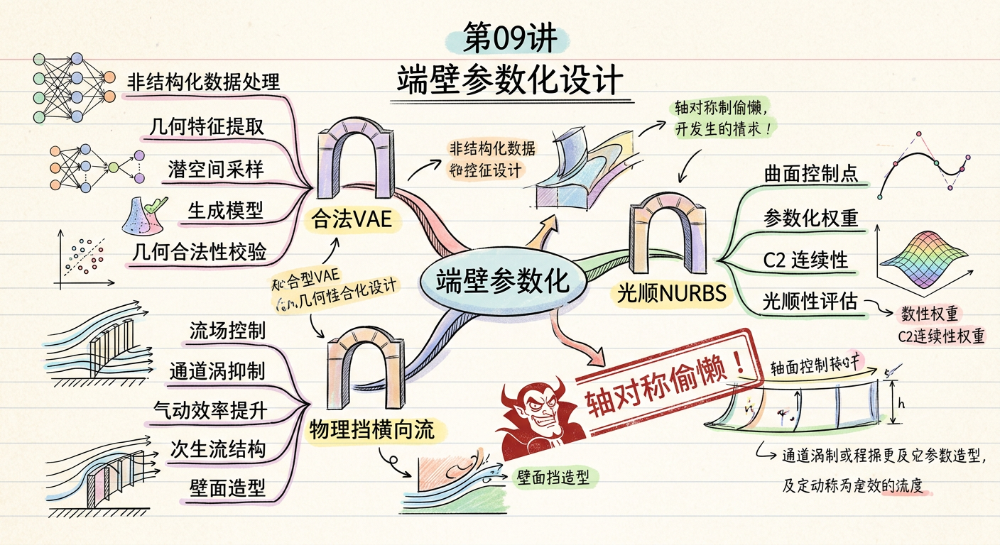

> **看图三秒：** VAE 提案、NURBS 托底、物理挡横向流；轴对称是偷懒。
**本讲赌注：** 端壁参数化若不过三关，生成的是合法废品。

---

#### 1. 生活与物理直觉引子：为什么端壁比叶型更难"捏形状"

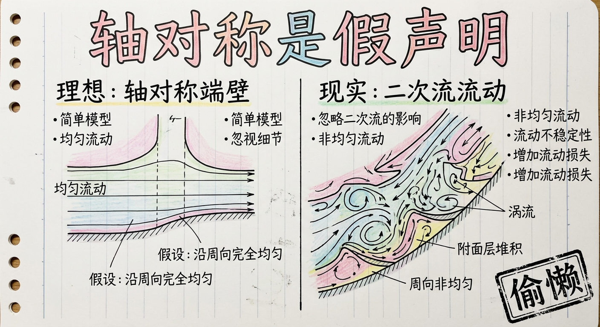

> **指读：** 周向平均好看，通道涡不吃你的平均。

前面几讲一直在处理**叶型**（叶片的横截面）。现在换一个更麻烦的对象：**端壁（endwall）**——叶片根部所依附的那个环形壁面。

传统端壁是**轴对称**的：绕发动机轴线旋转一圈，形状处处一样，像一张被旋转扫掠出来的圆盘面。它便宜、好加工，但气动上并不好——因为流道里的压力分布是**周向不均匀**的：压力面一侧压力高、吸力面一侧压力低，气流会本能地从高压侧"横着"往低压侧跑，形成**横向二次流**，卷出马蹄涡、通道涡、角涡，造成损失。

**非轴对称端壁造型（Non-axisymmetric Endwall Contouring, NEC）**的做法是：把端壁做成**周向起伏的三维曲面**——压力高的一侧"鼓起来"一点，压力低的一侧"凹下去"一点，用几何本身去抵消横向压力梯度。摘要第一句就把这一点当作已被证明的前提：NEC "has been proven effective in reducing the secondary losses of turbine cascades"［出版商页面 摘要］。

听起来很美，但工程上有一个硬骨头，摘要把它说成了一个**三角权衡**：样条类参数化在"**设计空间维度**"、"**样本多样性**"、"**畸形几何比例**"三者之间顾此失彼［出版商页面 摘要］。想让形状够丰富，控制点就得多，维度就上去了；控制点一多，随机组合出来的曲面里"长得不像端壁"的比例就飙升，白白浪费 CFD。

这正是第 06、07、08 讲那套**生成式参数化**要解决的同类问题——只不过对象从二维叶型换成了三维端壁。

**为什么端壁更烦：**  
叶型是「一条曲线的艺术」；端壁是「一圈环面还要跟叶片根接上、还不能让二次流乱窜」。  
设计空间里废品率极高——这就是 VAE 先学「什么算人样」、NURBS 层再保光顺的原因。

**三层难：** 合法、敏感、可造。

> **先猜后揭：** 若本讲反派「轴对称偷懒」赢了，你的下一笔 CFD/实验预算会怎样被浪费？揭晓贯穿 §3–§5。

| 生活元素 | 工程元素 | 符号 |
| :--- | :--- | :--- |
| 主比喻侧 | 生成提案 | VAE |
| 主比喻侧 | 光顺层 | NURBS |
| 主比喻侧 | 轮毂/机匣 | 端壁 |

**端壁更难捏：** 叶型有截面直觉；端壁缠着横向流与角区损失。轴对称等于假声明「周向无差异」。

**端壁比叶型难捏的三层原因：**  
1. 三维壁面，缺少「中弧线」那种低维经典语言。  
2. 横向流/通道涡/角区耦合，轴对称是假声明。  
3. 废品率高：刀脊、对穿、陡坎随时出现。  
所以 VAE 提案 + NURBS 托底，是「先合法再光顺」，不是「生成炫技」。

**泥与刀：**  
端壁是泥（难捏），轴对称是偷懒刀法。  
非轴对称不是为了「看起来高级」，是为了挡横向流。

---

#### 2. 叶轮机械中的真实工程死穴：设计空间里绝大部分形状是"废品"

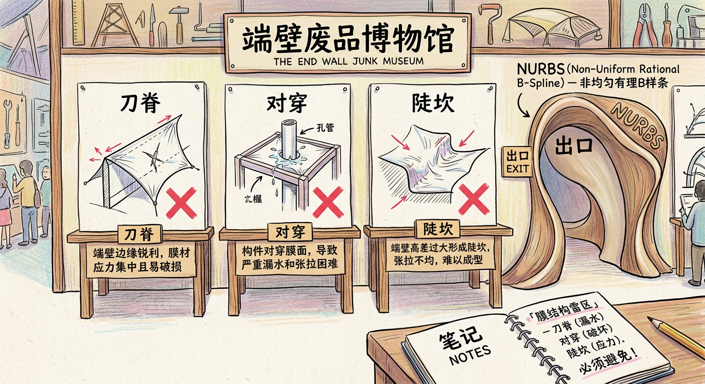

> **指读：** 生成式要把概率质量挪出这三间展厅；NURBS 是出门安检。


> **指读：** VAE 过合法关，NURBS 过光顺关，物理关才挡得住横向流。

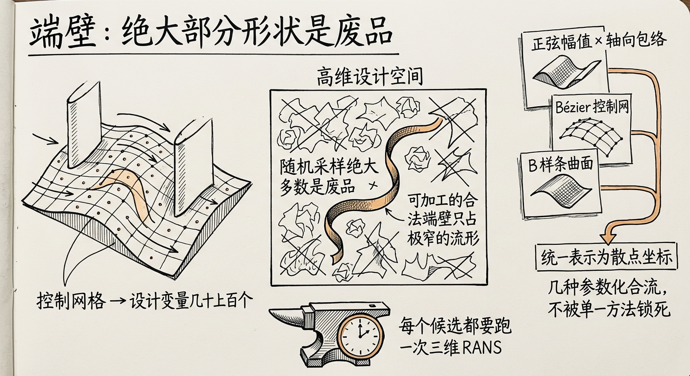

> **指读：** 这张图是本讲工程死穴的一张图版本。

把摘要的三角权衡翻译成设计师每天面对的三件事：

1. **维度高**：三维光滑曲面若用 B 样条/NURBS 控制网格描述，设计变量轻易几十上百个；
2. **流形窄**：在如此高维的空间里，"看起来像真实、可加工端壁"的形状只占极小一部分，绝大部分随机采样都是废品；
3. **评估贵**：每个候选形状都要跑一次三维 RANS 才能知道好坏。

而且端壁参数化还有一个叶型没有的麻烦：**同一个端壁可以被多种完全不同的参数化方法描述**（正弦幅值×轴向包络、Bézier 控制网、直接的 B 样条曲面……），每种方法各有自己能表达和不能表达的形状。摘要给出的处理很有工程味：**把一组经典 NEC 参数化方法各自生成的样本都收集起来，统一表示成散点坐标（scatter coordinates），拼成一个"覆盖充分"的设计空间**［出版商页面 摘要］。也就是说，训练数据不是靠一种参数化"撒网"得到的，而是几种参数化"合流"的产物——这样学到的低维流形不会被单一方法的表达能力锁死。

于是问题变成：**能不能先学出一个"只生成合法端壁"的低维潜空间，再在这个潜空间里优化？**——这就是本文标题所指的"生成模型参数化"。

**现场感：** 周五下班前组长要数——你面对的不是可以慢慢推的练习题，而是**算错一次就不可回收**的预算。

**废品率：** 随机控制点过陡、相交、不可铣。VAE 把概率放在曾合法区域；NURBS 托底光顺。

**废品博物馆导览加长：**  
刀脊：曲率爆表，铣刀与网格双杀。  
对穿：拓扑与叶片/圆角打架。  
陡坎：看起来很「非轴对称」，分离与热斑一起爆。  
VAE 把概率挪出展厅；NURBS 安检；物理关看横向流是否真被挡。

---

#### 3. 数学公式：摘要给了骨架，细节不推导

先把公式关掉，用主比喻说一遍：

> **端壁难捏的泥——轴对称挡不住横向流**  
> 本讲反派是「轴对称偷懒」。下面公式是这句话的展开；每条核心式尽量带**回译**。知识总量不删——深潜只是阅读路径，不是垃圾桶。

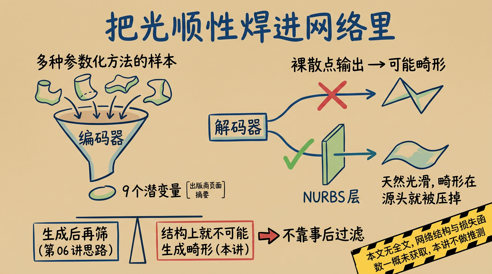

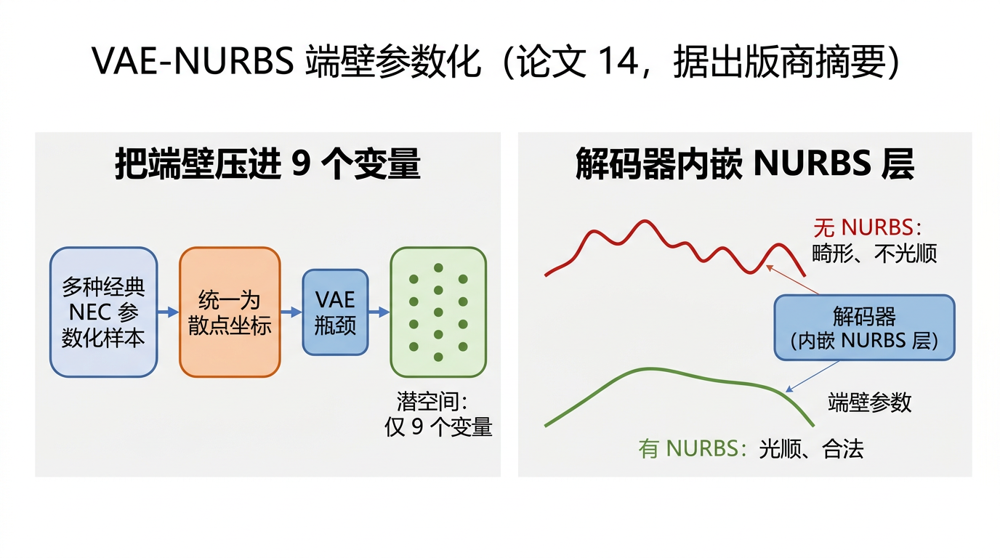

> 上图是本讲全部数学的「一张图版本」（据出版商摘要示意，正文未获取）：**左图**是压缩——多种经典 NEC 参数化方法的样本统一为散点坐标后，VAE 把端壁设计空间压进 **9 个潜变量**［出版商页面 摘要］；**右图**是合法性保障——解码器内嵌一层 NURBS，没有它生成的型面可能畸形（红线），有了它才光顺（绿线）。

> 🚫 本文无全文，**网络结构、损失函数、训练策略一概未获取，本讲不做任何推测性推导**。以下只把摘要给出的三个"骨架事实"写清楚。

##### 3B. 本讲符号卡（建议截图留存）

| 符号 | 人话 | 备注 |
| :--- | :--- | :--- |
| VAE | 生成提案 |  |
| NURBS | 光顺层 |  |
| 端壁 | 轮毂/机匣 |  |

> 🧭 先认符号再读公式；主文核心式有「回译」，装不下的细节仍在正文完整保留（不删知识）。

##### 3C. 主路径公式与推导（知识全保留）

**骨架一：生成模型是 VAE。** 摘要原话："the Variational Autoencoder (VAE) is used to learn the intrinsic dimensions of the parameterized NEC design space"［出版商页面 摘要］。这与第 07 讲论文 08 的 SW-VAE 同属一族，而与第 08 讲论文 17 的 GAN 路线不同——旧版 "GAN-Endwall" 的错名很可能就是把 17 混进来了。

**骨架二：光顺性靠结构约束，不靠事后过滤。** 摘要："a layer of NURBS is incorporated into the neural network architecture of VAE"［出版商页面 摘要］。直觉上，解码器输出的不是裸的散点坐标，而是经过一层 NURBS 映射后的曲面——只要 NURBS 层在，输出天然是光滑曲面，畸形几何在生成源头就被压掉。这一点和第 06 讲 GMFoO"生成后再筛"的思路形成对照。**但 NURBS 层的节点向量、控制点数量、是否可训练，摘要一概没说，本讲不猜。**

**骨架三：潜空间维度为 9。** 摘要："NEC parameterization … with **9 variables**"［出版商页面 摘要］。**证据等级 B：仅摘要**——不得把 9 拆成未给出的截面/控制点表；9 是优化用的潜变量个数（名义设计维），不是「9 个 CAD 控制点」。对比第 16 讲论文 03 手工 NEC 参数化的 13 个参数（优化 11 个）［原文 P03 §3.3］，9 维并非数量级的压缩——本文的卖点更在于**这 9 维覆盖了多种参数化方法的并集**，而不是把某一种方法压得更小。

想看完整的数学骨架，请读有全文支撑的相邻讲次：

| 想理解的内容 | 请读 |
| :--- | :--- |
| 潜空间优化的基本框架、GAN/VAE 如何学出设计流形 | **第 06 讲（论文 06 GMFoO）** |
| VAE 参数化 + 样本加权训练、多保真迁移 | **第 07 讲（论文 08 SW-VAE / KT-ASO）** |
| 梯度重参数化（把坐标点形状映射回潜空间） | **第 08 讲（论文 17 GTO）** |
| 非轴对称端壁的气动原理与手工参数化（13 参数） | **第 16 讲（论文 03 NAE-Purge）**、**第 17 讲（论文 09 NAE-Exp）** |

---

#### 4. 算法控制流

> 🧭 **值班手册：** 先看「什么情况下走哪条分支」，公式是对白速记不是主角。

摘要只给了粗粒度流程，按原文顺序整理如下（每步都能在摘要中找到对应句子；步内细节未获取）：

1. **收集样本**：用一组经典 NEC 参数化方法各自生成端壁样本［出版商页面 摘要］；
2. **统一表示**：把所有样本转换为统一格式的散点坐标，合并成一个设计空间［出版商页面 摘要］；
3. **训练 VAE**：学习该设计空间的内在维度（结果为 9 维），解码端含 NURBS 层［出版商页面 摘要］；
4. **潜空间优化**：以 9 个潜变量为设计变量做高压涡轮级 NEC 气动优化，并与其他 NEC 参数化方法做同样的优化作对比［出版商页面 摘要］。

> 🚫 步骤 3 的损失函数（重构项 / KL 项权重）、步骤 4 用的优化器（EGO？DE？）与评估次数上限的具体值，**均未获取**。

> **一句话记住：** 轴对称省事但挡不住通道涡；进阶：VAE提案+NURBS托底。

**主比喻回扣：** 把上面的分支再翻译成「端壁难捏的泥——轴对称挡不住横向流」——若某步在生活里说不通，多半是符号没对齐。

**生成式端壁流水线（概念）：**  
VAE 提案（合法关）→ NURBS 托底（光顺关）→ CFD/指标（物理关）。  
任一关失败都不得进入「可签字几何」库。

**流水线门禁：**  
提案出门必须持「合法牌」；入 CFD 必须持「光顺牌」；入报告必须持「物理牌」。  
缺牌者不得进入可签字库——这是配置管理，不是学术洁癖。

---

#### 5. 实验验证与量化突破

**先报胜负：** 先读结论句与最大那一格，再读全表；表是证据架不是背诵清单。

> ⚠️ **摘要只给定性结论，没有任何数字。** 本讲据此**不列出任何百分比、降幅、CFD 次数**。

摘要可确认的验证事实：

- **算例**：一个高压涡轮级（high-pressure turbine stage）的非轴对称端壁气动优化［出版商页面 摘要］；
- **对比对象**："other NEC parameterization approaches"（具体哪几种、各自变量数未获取）［出版商页面 摘要］；
- **结论原话**："the generative model based parameterization method can optimize aerodynamic performance more effectively while maintaining a lower limit on the number of performance evaluations"［出版商页面 摘要］——即在**更低的性能评估次数上限**下取得**更好的气动优化效果**。

> 🗑️ 再次明确：旧版白皮书 6.1 对比矩阵中"GAN-Endwall（2024）……**消除九成畸变几何，设计空间极度紧凑**"这一行属于**无源填充**，摘要亦不支持，继续从重建版删除。

**体感换算：** 把关键数字换成「工程师的周/月」或「一次签字的风险」——数字才进长期记忆。若原文给了墙钟时间或成本比，优先用原文换算。

---

**桥到 16–17：** 本讲先合法参数化；风洞封口在后。

#### 6. 审稿人批判与承前启后

把软肋放上**可信度刻度**（0=完全不信，5=可当默认工具）：

| 维度 | 打分 | 人话 |
| :--- | :---: | :--- |
| 问题 | 5 | |
| 骨架 | 4 | |
| 细节 | 2 | |
| 实验 | 3 | |

**可以攻击的点（基于摘要即可提出）：**

1. **收益未量化**。与第 07、08 讲（有 Table 3/Table 4 硬数据）相比，本文公开摘要只有"more effectively"，读者无法判断"更有效"是 0.1 个百分点还是 1 个百分点。
2. **流形覆盖上限被训练集锁定**。设计空间由既有参数化方法的样本"拼"成，VAE 学到的 9 维流形原则上**只能覆盖这些方法能表达的形状的并集**——若最优端壁不在任何一种经典方法的表达范围内，本方法会系统性漏掉它。摘要未讨论此风险。
3. **NURBS 层的约束强度未知**。"光顺"不等于"可加工"（还有最小曲率半径、与叶根倒圆的相容性等约束）；一句 "a layer of NURBS" 不足以判断可制造性是否被真正保证。
4. **会议论文篇幅有限**。ASME Turbo Expo 论文通常单算例、无消融实验，这本身也是本讲只能到 B 级的成因。

**承前：**
- 直接继承自**论文 06（GMFoO）**确立的"生成模型 + 潜空间优化"范式，以及**论文 08（SW-VAE）**的 VAE 参数化思路；
- 应用对象（非轴对称端壁）承接**论文 03（NAE-Purge）**与**论文 09（NAE-Exp）**所研究的端壁气动问题。

**启后：**
- **论文 17（GTO）**在参考文献 [17] 中引用本文（这也是本仓库最初取得其著录的线索），并把"生成式参数化"推进为"生成式**迁移**优化"；
- 与**论文 10（FFD-Tip）**共同构成"复杂三维几何的高效参数化"这一工程子方向：一个用生成模型，一个用自由变形（FFD）。

---

> 📎 **升级路径**：若能取得 GT2024-128792 全文 PDF，本讲可升级为 A 级证据，并补全：VAE 编码/解码结构、NURBS 层定义、训练样本数、对比的参数化方法清单、气动收益数值与评估次数上限。
> 届时请先更新 `corpus/facts/P14.md` §三/§五，再同步本讲。

---

**读端壁生成结果的三问：**  
1. 合法率相对随机采样提升了多少（若原文有表，用表；无则只定性）？  
2. 光顺后 CFD 网格是否还在「修洞」？  
3. 横向流/角区指标有没有动——没有物理关，合法形只是博物馆藏品。

**读生成端壁结果的验收序：**  
合法率 → 光顺/网格友好 → 横向流或角区指标是否动。  
第三关不过，前两关只是「合法废品生产线」。

---

#### 附：非轴对称端壁的「三关」

1. **合法关：** 不自交、不过陡、与叶片/通道拓扑兼容——VAE 提案。  
2. **光顺关：** 可铣、可铸、网格好生成——NURBS 托底。  
3. **物理关：** 真能改横向流与角区损失——最终要 16–17 的机理与实验。

**反派轴对称偷懒的具体嘴脸：**  
图纸好看、网格好画、周向平均也「说得通」，可通道涡不吃你的平均。二次流是三维的，端壁却被降成二维旋转体——这是建模偷懒，不是物理结论。

**和叶型生成的差别：**  
叶型有厚度、中弧线等经典语言；端壁更像「地形塑形」。废品率更高，所以生成式过滤合法形的价值更大。

---

#### 附：端壁参数化选型会（15 分钟版）

**议程三问：**

1. **我们有没有成对的「合法端壁」数据？**  
   - 有 → VAE/生成式可以学流形；  
   - 无 → 先别幻想端到端生成，用 NURBS/FFD 加硬约束更稳。

2. **废品率现在多少？**  
   - 随机抽样里非法/过陡/干涉占比若非法/过陡/干涉占比已经高到「随机抽样经常中招」，生成式过滤的价值立刻超过「多几个控制点」。

3. **下游谁接盘？**  
   - 只要 CFD：光顺与网格友好优先；  
   - 要进 16–17 的机理与实验：几何幅度必须落在可加工公差。

**轴对称偷懒的三种伪装：**

| 伪装 | 听起来很对 | 物理上错在哪 |
| :--- | :--- | :--- |
| 「周向平均够了」 | 通流设计常用 | 二次流是三维的 |
| 「网格好画」 | 项目经理喜欢 | 好画 ≠ 流场对 |
| 「以前型号也轴对称」 | 经验 | 负荷一变，经验过期 |

**三关检查单（合法 / 光顺 / 物理）** 过两关不够：没有物理关，参数化只是「合法废品生成器」。

---

#### 附：端壁「废品博物馆」（概念展板）

进馆三件展品（均为非法/高风险形，生成式要学会避开）：

1. **刀脊：** 局部曲率爆表，铣刀抬不起头，CFD 网格先哭。  
2. **对穿：** 端壁与叶片/圆角拓扑打架。  
3. **陡坎：** 看起来「很非轴对称」，横向流被猛打，但分离与热斑一起爆。

VAE 的价值不是「更花哨」，是把概率质量从这三间展厅挪走；NURBS 是出门安检。

---

#### 附：轴对称偷懒的三个伪装（再钉）

周向平均够了 / 网格好画 / 以前型号也这样。  
三条都能通过项目经理，三条都可能在二次流上破产。

---

#### 附：非轴对称端壁评审看板

| 关卡 | 绿 | 黄 | 红 |
| :--- | :--- | :--- | :--- |
| 合法 | 自交/干涉≈0 | 偶发可修 | 频发 |
| 光顺 | 网格一次过 | 需手工修 | 无法出网 |
| 物理 | 横向流/角区指标改善 | 持平 | 恶化 |

黄灯可带风险继续；红灯禁止入详设库。轴对称「省事」若物理红灯，仍算偷懒。

---

#### 图卡：VAE 内嵌 NURBS

潜码经解码器后过 NURBS 层，输出端壁默认合法/光顺/可加工；刀脊、对穿、陡坎进废品堆。生成式参数化的物理保险丝。

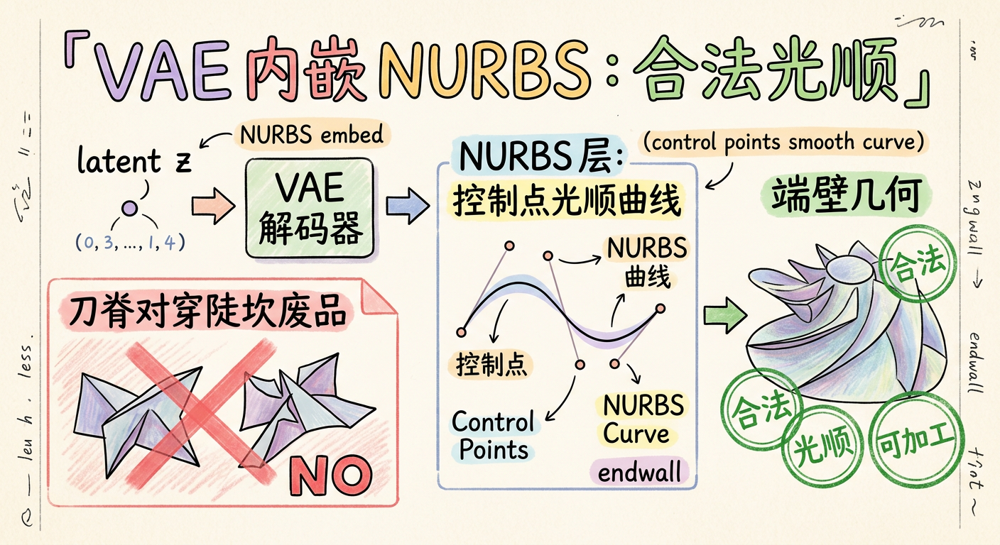

---

#### 图卡：端壁废品三件展

刀脊、对穿、陡坎三件进博物馆；出口是合法·光顺·物理三关。生成式端壁的第一课是认识废品。

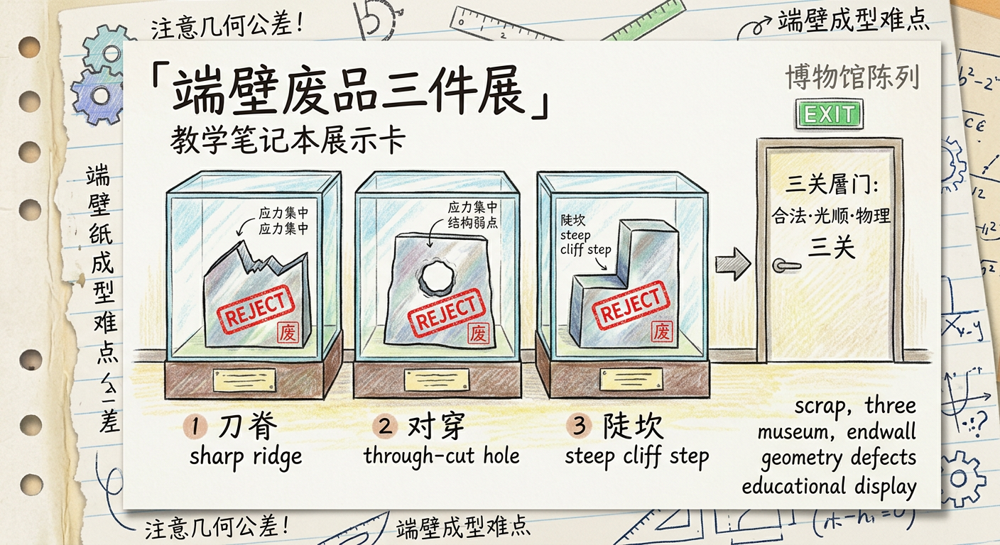

---

#### 图卡：三关闸机

端壁几何必须连过合法、光顺、物理三闸；任一失败进废品堆。NURBS 层是光顺闸的机械装置。

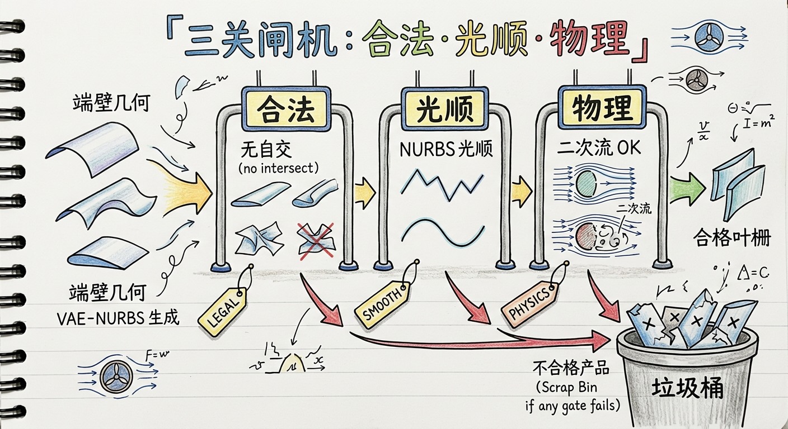

---

#### 章末：30 秒复述 · 自测 · 元数据

**30 秒复述稿（可朗读）：** 端壁比叶型难捏。VAE 提案、NURBS 光顺、物理挡横向流，三关都过才算数。轴对称是偷懒假声明，不是物理最优。

**自测（先做再对答案）：**

1. 轴对称代价？
2. NURBS？
3. 废品？

<details>
<summary>点开看参考答案</summary>

1. 二次流/角区损失。
2. 光顺可造。
3. 随机型面大量非法。

</details>

> **本讲元数据**（读完再看，不挡故事）
> | 项 | 值 |
> | :--- | :--- |
> | 规范编号 | **14** |
> | 原始文献 | **ASME Turbo Expo 2024（GT2024，London, UK，2024-06-24～28）**，Vol. 12D，论文号 **GT2024-128792**，文章号 **V12DT34A025** |
> | 作者 | Cunxi Li, Liming Song, Zhendong Guo, Zhao Yang, Jun Li, Zhenping Feng（郭老师列第三） |
> | DOI | `10.1115/GT2024-128792`（Crossref 2026-09-06 核验；在线 2024-08-28） |
> | 本地原文 | **无**（出版商摘要已获取；正文/图表需订阅） |
> | 证据等级 | **B（权威著录 + 摘要全文可查；正文方法细节与数值未获取）** |

> ⚠️ **本讲的写作边界（务必先读）**
> 本文**没有本地全文**。可核验的信息 = Crossref 著录 + 出版商页面摘要（逐字存于 `corpus/web_evidence/P14.md`）。
> 因此本讲：✅ 只写摘要明确给出的**方法定位、模型类型、变量数、验证对象与定性结论**；❌ **不写**任何百分比、损失降幅、CFD 次数、网络层数、损失函数——这些摘要没有。
>
> 🗑️ **两轮纠错记录**（都保留，便于审计）：
> ① 旧版白皮书把本文称作 "**GAN**-Endwall"，并写入"消除九成以上的无效几何生成"——**GAN 是错的，九成是编的**。
> ② 上一轮重建版虽删掉了数字，却又写成"DOI 未检索到、摘要未获取、证据等级 C"——**这也是错的**：Crossref 按题名一查即中，摘要公开。摘要显示模型是 **VAE + NURBS 层**。本讲据此重写，标题代号改为 VAE-NURBS。
> | 反派绰号 | 轴对称偷懒 |
> | 主比喻 | 端壁比叶型更难捏 |

---

<a id="part-3" name="part-3"></a>
# 第三篇 【物理增强神经算子与 AI4Turbomachinery 篇】

本篇覆盖**论文 16、12、18、19、15、20**。范式转变是：**不再预测一个标量性能，而是直接预测整个流场。*把叠加原理、流动相似性、守恒律写进网络结构（SDNO、ResUNet-Sim、TNO），再用 SHAP 把黑箱里的决策逻辑翻译给工程师看（SHAP-Turbine）。

<a id="bridge-c"></a>

### 过桥 C · 从「找最优形状」到「直接预测整场」

前两篇的共同假设是：CFD 仍是裁判，算法只是更会**点名**让裁判出场。

第三篇（第 10–15 讲）试图改裁判本人：

> 若网络能在一次前向里吐出整场（或关键场量），性能指标用物理公式积分——  
> 那么「评估」可以从小时级掉到毫秒级。

这不是否认优化，而是给优化换燃料。

| 讲 | 关键词 |
| :--- | :--- |
| 10 TNO | 基本场 → 全景性能 |
| 11 SDNO | 叠加原理写进算子 |
| 12 P-ResUNet | 相似原理 + 物理增强 |
| 13 SHAP | 赢了还要讲清配方 |
| 14 数字孪生 | 流固耦合，刚体假设破产 |
| 15 子午 AI | 方案阶段的素描级预测 |

**防晕提醒：** 本篇公式可以很凶；请紧抓每讲开场口诀，深潜框大胆跳。

---

<a id="lec-10" name="lec-10"></a>
### 【第10讲】TNO：不优化，而是让"一次评估"变得几乎免费（**论文 16**）

#### 本讲开场 90 秒

**上讲闪回：** 前九讲聪明采样；本讲切换：单次评估变便宜。

**本讲反派：** 「一指标一模型」

**只要带走 3 句口诀：**

1. **先场f_s后积分W**
2. **毫秒前向，多指标复用**
3. **抓论文矛盾数字当侦探**

**主比喻：** 与其省打车钱，不如评估近乎免费


> **看图三秒：** 几何→场→多指标；划掉一指标一模型。

**本讲赌注：** 评估不便宜，再聪明的采样也只是少流血。

---

#### 1. 生活与物理直觉引子：与其省着打车的钱，不如把打车变免费

前面九讲，我们一直在琢磨同一件事：**CFD 太贵，怎么把"打车的次数"省下来？**

- 第 01 讲：让每一次采样都更有价值（CR-EI）；
- 第 02 讲：便宜的粗网格先探路（Filter-GEI）；
- 第 03、04 讲：换个能扛高维的搜索策略（GSDE / DA-EGO）；
- 第 07、08 讲：把上一个型号的经验搬过来（KT-ASO / GTO）。

这些都属于**"省着花"**的路线。

本文换了一个完全不同的思路：

> **能不能干脆让"一次评估"本身变得几乎不要钱？**

这就是**代理模型（surrogate model）**最朴素的想法——但本文的做法远比"训一个效率预测网络"更进一步，它叫**全景式（panoramic）预测**。

**范式切换口号：**  
前九讲：让「下一次评估」更聪明。  
本讲起：让「一次评估」本身变便宜，甚至近乎免费。  
TNO 的野心是：基本场一次前向，性能指标用公式积分出来——**一指标一模型**的仓库，可以收起来了。

**赛道切换：** 采样智慧 → 评估成本。

> **先猜后揭：** 若本讲反派「一指标一模型」赢了，你的下一笔 CFD/实验预算会怎样被浪费？揭晓贯穿 §3–§5。

| 生活元素 | 工程元素 | 符号 |
| :--- | :--- | :--- |
| 主比喻侧 | 基本场 | f_s |
| 主比喻侧 | 性能 | W |
| 主比喻侧 | 神经算子 | TNO |

**打车隐喻加长：** 旧策略少打车（少 CFD，前九讲）；新策略把车费降到可随便打（代理场，本讲）。可叠加：便宜评估 + 聪明采样。

**打车公司两种降本：**  
A. 少打车（少 CFD）——前九讲的采样智慧。  
B. 把车费打到接近免费（场代理毫秒前向）——本讲。  
B 不消灭 A：便宜评估 × 聪明采样，才是完整武器库。

**一指标一模型的账单：** 效率一个网、损失一个网、载荷又一个网——换个目标就重训，数据与工程时间双爆。

**打车公司董事会纪要（加长）：**  
提案 A：严格审批出行（少 CFD）——对应 01–05 的采集函数与分解。  
提案 B：把单价打到接近零（场代理）——本讲 TNO。  
决议：A+B 同时立项。只有 B 时，人会在便宜评估上无脑采样；只有 A 时，再聪明也买不起次数。

**一指标一模型的真实成本：**  
效率网、损失网、载荷网各训各的，换目标就重采标签。  
先场后积分：基本场 f_s 一次前向，W 是积分/后处理——**新指标优先复用 f_s**。

---

#### 2. 叶轮机械中的真实工程死穴：一个代理模型只能服务一个目标

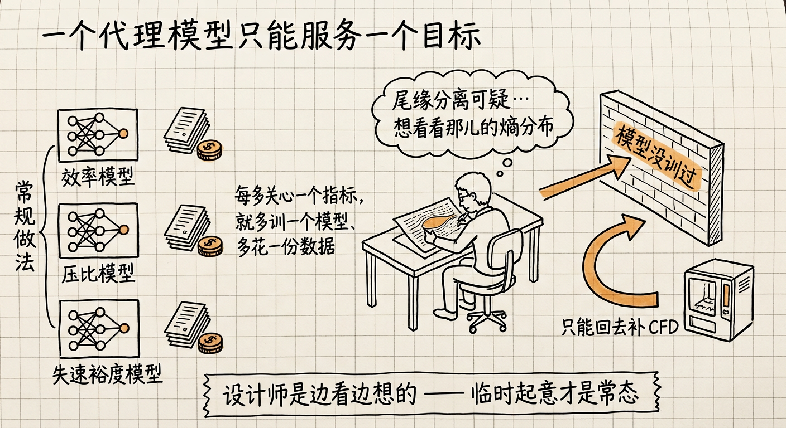

> **指读：** 这张图是本讲工程死穴的一张图版本。

先说常规做法的问题。假设你在设计叶片，关心三个指标：效率、压比、失速裕度。

常规代理建模会怎么做？**每个指标各训一个模型。** 代价是：

- 每增加一个关心的指标，就要多训一个模型、多花一份数据；
- 更麻烦的是，**中途临时想看一个新指标**（比如"我想看看某个叶高截面处的熵增分布"），对不起——**模型没训过，只能回去补 CFD**。

设计师的真实工作方式是**边看边想**的：看一眼流场，觉得尾缘分离可疑，就想看尾缘的熵分布；发现激波位置不对，又想看等熵马赫数分布。**"临时起意"是设计过程的常态。**

本文的洞察是：既然这些量**本质上都能从基本流场算出来**，那为什么不——

> **先预测流场的基本物理量，再按公式算出任何你想看的性能指标？**

原文的表述是：

> 与以往大多数直接预测所关心目标函数的模型不同，该方法**首先预测 Navier–Stokes 方程的基本参数**（温度、压力、密度等），再利用这些基本物理量**预测涡轮级子午面上的关键性能参数**。如此，该框架可**像 CFD 求解器一样工作**。［原文 P16 摘要］

**现场感：** 周五下班前组长要数——你面对的不是可以慢慢推的练习题，而是**算错一次就不可回收**的预算。

**代理模型服务一个目标的死穴：**  
设计室早上要效率，下午要热负荷，晚上要变工况。  
若每个问题重训一个黑盒，数据与工程时间双爆。  
TNO 的范式切换是：问题从「为每个 W 学一个回归」变成「为物理场学一个算子」。

---

#### 3. 数学公式从 0 到 1 推导


> **指读：** 中段场可复用；右侧多指标不再各训各的；底部划掉一指标一模型。

先把公式关掉，用主比喻说一遍：

> **与其省打车钱，不如评估近乎免费**  
> 本讲反派是「一指标一模型」。下面公式是这句话的展开；每条核心式尽量带**回译**。知识总量不删——深潜只是阅读路径，不是垃圾桶。

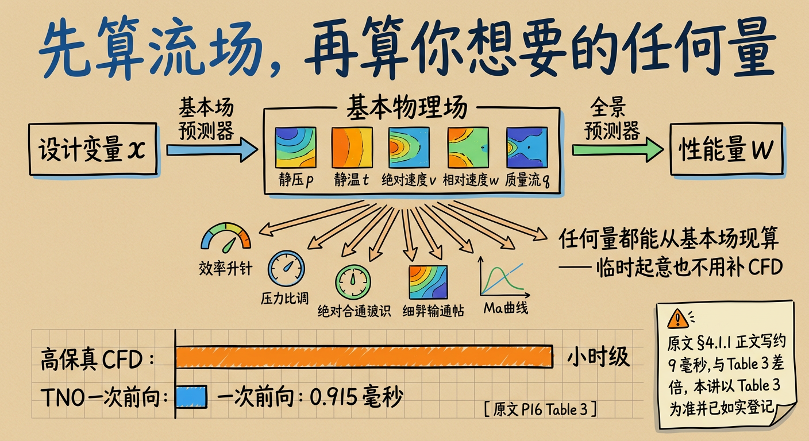

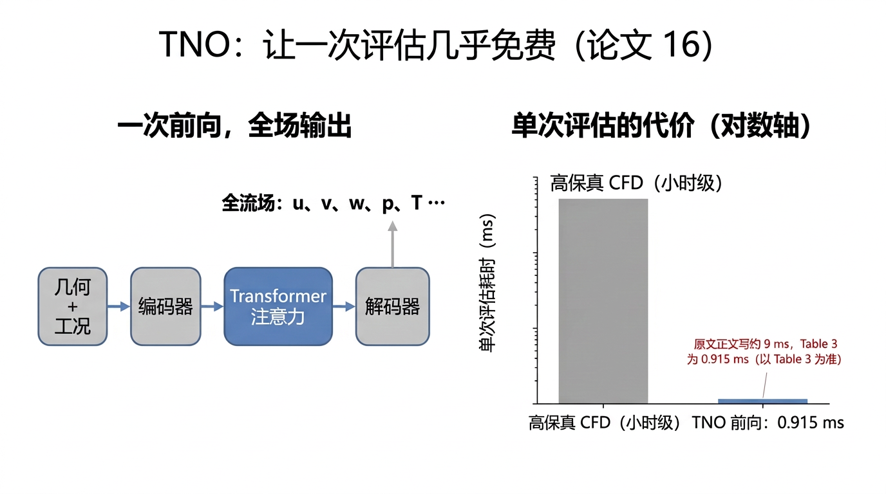

> 上图是本讲全部内容的「一张图版本」：**左图**是 TNO 的结构——几何与工况经编码器、Transformer 注意力、解码器，**一次前向就输出整个流场**（u、v、w、p、T…）；**右图**是「一次评估」的代价——高保真 CFD 是小时级，TNO 前向只要 **0.915 ms**［原文 P16 Table 3］（原文 §4.1.1 正文写约 9 ms、与 Table 3 相差 10 倍，本讲以 Table 3 为准并已如实登记该矛盾）。

##### 3B. 本讲符号卡（建议截图留存）

| 符号 | 人话 | 备注 |
| :--- | :--- | :--- |
| f_s | 基本场 |  |
| W | 性能 |  |
| TNO | 神经算子 |  |

> 🧭 先认符号再读公式；主文核心式有「回译」，装不下的细节仍在正文完整保留（不删知识）。

##### 3C. 主路径公式与推导（知识全保留）

**第一步：把"全景框架"写成两段映射**
**〔式〕** x — 基本场预测器 fₛ → fₛ — 全景预测器 → W

**回译：** 上式是主路径构件——先记住它在算法里负责哪一步，再抠每一个符号。

- x：设计变量；
- f_s：基本物理场；
- W：性能量。

**第二步：选哪些"基本物理量"？**

原文选了 5 个［§3.3］：**静压 p、静温 t、绝对速度 v、相对速度 w、质量流 q_vm**。

为了计算方便，速度取平方，于是网络要预测的是：
**〔式〕** (p, t, v², w², q_vm)

子午面被离散成 M=4096 个点。

**第三步：TNO 的网络结构（branch–trunk 框架）**
**〔式〕** F(x)(r, z) = S(Bₖ(x;h_b) ⊙ Tₖ(r, z;h_t); h_s)

- **分支网络 B（branch）**：把设计变量 x 编码成特征，用堆叠的 MLP；
- **主干网络 T（trunk）**：把查询位置 (r,z) 编码成特征，由 1 个 embedding block + 若干 **Galerkin 注意力块**串联而成：

**〔式〕** T(r, z) = P∘ Gₜₘ∘⋯∘ Gₜ₁∘ E(r, z)

- 每个 Galerkin 注意力块 = 注意力层 + 前馈网络（FFN），**均带残差连接**；
- 注意力输出：
**〔式〕** Z = Attn(P^t) = (QKᵀV)/(m), Q = P^tW^Q

**为什么用 Galerkin 注意力而不是原生 softmax 注意力？**

原文说明：采用基于 Galerkin 的**简化自注意力**替代常规注意力，**省掉了 softmax 的计算，从而提升计算速度**［§3.1］。

**为什么自注意力在这个任务上特别有效？** 原文给了一个非常有物理感的解释：

> 叶型的**局部几何改动只影响特定的流动区域**——比如尾缘的改动会影响下游的分离涡与叶尖流动。自注意力模型能捕捉这种**复杂、非均匀的空间依赖**，把几何变化映射到对应的流动区域，从而提高整场预测精度。［§3.1］

最后，TNO 接一个**共享输出网络 S**，用于**同时处理多个物理场**——这正是"全景"二字的技术实现。

**第四步：从基本场算出性能量（全景预测器）**

原文 Table 6 给出 9 个常用性能指标的**显式计算公式**，全部只依赖那 5 个基本场，例如：

| 性能量 | 计算方式 |
| :--- | :--- |
| 绝对总温 | t_v=t+(v²)/(2c_p) |
| 相对总压 | p_w=p(1+(w²)/(2c_p t))^γ/(γ-1) |
| 等熵效率 | η_is = [(p_v2/p_v1)^((γ−1)/γ) − 1] / [t_v2/t_v1 − 1] 形式的总参数之比 |
| 质量流 | ṁ = ∫_{r_h}^{r_s} ρ v_m z r dr  /  ∫_{r_h}^{r_s} z r dr（周向平均后再展向积分） |

整体量的计算被分解为**周向积分 + 展向积分**两步，可分别在流场预测之前或之后执行。

**训练目标**：MSE 损失，Adam 优化器，900 epochs。

---

#### 4. 算法控制流

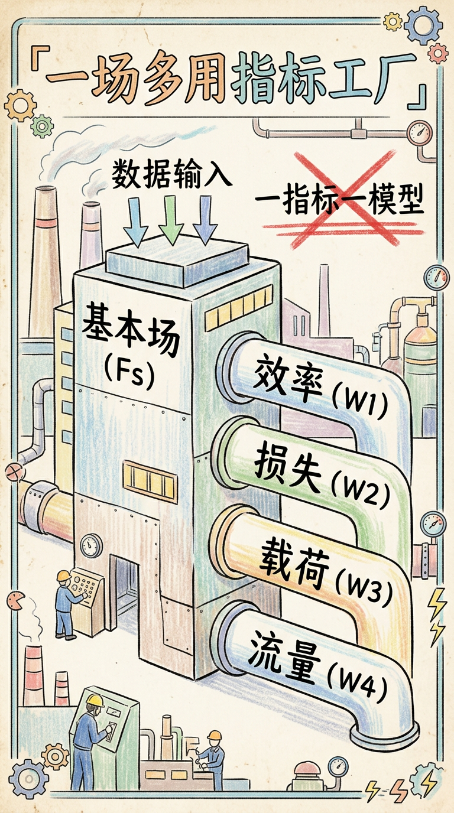

> **指读：** 中心 f_s 一次前向，右侧多指标；划掉一指标一模型。

> 🧭 **值班手册：** 先看「什么情况下走哪条分支」，公式是对白速记不是主角。

```

离线（一次性投入）：
  ① 生成 2500 个叶片几何样本 + 对应 CFD 解
  ② 把每个子午面离散为 4096 个点，提取 5 个基本场
  ③ 训练 TNO：分支网络吃设计变量，主干网络吃查询坐标，输出 5 个基本场

在线（几乎免费，可反复执行）：
  ④ 给定新设计 x → TNO 预测子午面基本场
  ⑤ 按 Table 6 的显式公式算出任意性能指标
  ⑥ 接下游任务：敏感性分析 / GA 单目标优化 / NSGA-II 多目标优化
  ⑦ 关键结论仍送回 CFD 复核

```

> **一句话记住：** 先场f_s后积分W；进阶：毫秒前向，多指标复用。

**主比喻回扣：** 把上面的分支再翻译成「与其省打车钱，不如评估近乎免费」——若某步在生活里说不通，多半是符号没对齐。

**两段式值班手册：**  

```

几何 x → 网络预测基本场 f_s → 可微/后处理积分 → 任意 W

```

新指标若是场的积分/范数，优先**复用 f_s**，不要新开一座庙。  
读论文耗时数字：网格？batch？含后处理？写「待核实」比装懂强。

**两段式上线检查单：**  
1. f_s 的物理量集合是否覆盖下游所有 W？  
2. 积分/后处理是否可微或至少稳定？  
3. 多指标时是否禁止偷偷为某个 W 单开旁路大网（除非消融证明必要）？  
4. 耗时数字是否记录硬件、batch、是否含后处理——矛盾则标「待核实」。

---

#### 5. 实验验证与量化突破


> **指读：** 网格/batch/后处理/硬件——矛盾就标待核实。

**先报胜负：** 先读结论句与最大那一格，再读全表；表是证据架不是背诵清单。

**算例**：Rotor 37 跨声速压气机叶片，**28 个设计变量**。数据集 **2500 训练 / 400 验证**［§3.3］。

**① 基本物理场预测精度（FRE，%）**［Table 4］

| 网络 | 平均误差 |
| :--- | :---: |
| MLP | 0.820 |
| UNet | 0.792 |
| DeepONet | 1.888 |
| FNO | 0.572 |
| **TNO** | **0.083** |

> 原文结论：**TNO 相对 FNO 的平均误差降低 85.5%**［§4.1.1］。验算：(0.572-0.083)/0.572=85.5% ✅

**② 网络规模与速度**［Table 3］

| 网络 | 前向显存 (MB) | 训练时间 (min) | 预测时间 (ms) |
| :--- | :---: | :---: | :---: |
| MLP | 768.0 | 19.98 | 2.198 |
| UNet | 624.5 | 114.0 | 5.075 |
| DeepONet | 822.5 | 52.9 | 0.970 |
| FNO | 558.9 | 106.5 | 1.448 |
| **TNO** | **147.13** | **40.5** | **0.915** |

> ⚠️ **原文此处自相矛盾，必须如实指出**：§4.1.1 正文写的是"TNO 的预测时间约为 **9 ms**，比 CFD 仿真低 5 个数量级"，而 Table 3 给出的是 **0.915 ms**，相差 10 倍［由正文 9 ms 与 Table 3 的 0.915 ms 计算：9/0.915≈10］。可能是排版把 "0.9 ms" 印成了 "9 ms"，也可能正文另有所指。**本讲以 Table 3 为准，并标注该处待核实。**

**③ 与传统代理模型的对比（等熵效率 PRE，‰）**［Table 8］

| 训练样本量 | 500 | 1000 | 1500 | 2000 | 2500 |
| :--- | :---: | :---: | :---: | :---: | :---: |
| FNO | 1.213 | 1.188 | 1.057 | 0.938 | 0.810 |
| GPR（传统代理最佳） | 1.425 | 1.273 | 1.156 | 1.098 | 1.075 |
| ANN | 3.697 | 3.775 | 3.799 | 3.699 | 3.706 |
| **TNO** | **0.823** | **0.460** | **0.448** | **0.439** | **0.486** |

原文结论：**15 个场景中 TNO 有 13 个最优；在训练样本超过 1500 的所有场景中，TNO 全部最优且优势显著**［§4.1.3］。

**④ 单目标优化（GA，种群 20、代数 100；所有最优解都送回 CFD 复核）**［Table 9］

| 性能量 | 方向 | 参考值 | 模型预测 | CFD 复核 | 预测相对误差 | 相对改善 |
| :--- | :---: | :---: | :---: | :---: | :---: | :---: |
| **等熵效率** | max | 0.854 | 0.871 | **0.871** | 0.001% | **+1.95%** |
| 总压损失 | min | 0.124 | 0.115 | 0.103 | 11.87% | +17.24% |
| 静熵 | min | 44.83 | 41.44 | 38.94 | 6.42% | +13.13% |
| 总压比 | max | 2.046 | 2.073 | 2.071 | 0.11% | +1.21% |
| 温比 | max | 1.265 | 1.270 | 1.271 | 0.03% | +0.44% |

［原文 P16 Table 9，数值由原文给出］
- 效率的实际改善为 **1.70%**，与作者先前在同一优化任务上的工作一致［§4.3］。
- **这张表最值得细看的一行是"总压损失"和"静熵"**：它们的预测相对误差高达 **11.87%** 与 **6.42%**，远高于效率的 0.001%。原因见下一节的批判。

**⑤ 多目标优化（NSGA-II，种群 30、代数 100）**［Table 10，节选］

| 指标 | 参考设计 | Opt-A | Opt-B | Opt-C |
| :--- | :---: | :---: | :---: | :---: |
| 等熵效率 | 0.854 | **0.871** | 0.869 | 0.863 |
| 多变效率 | 0.872 | 0.883 | 0.882 | 0.876 |
| 总压损失 | 0.124 | 0.116 | 0.116 | 0.119 |
| 总压比 | 2.046 | 2.069 | 2.045 | 2.040 |
| 质量流 | 20.266 | 20.615 | 20.439 | 20.262 |
| 熵 | 44.832 | 41.196 | 41.273 | 43.462 |

**⑥ 最有冲击力的一句话**［§4.3］

> 全景式预测框架把一个**原本需要 1000 组 CFD 计算**的优化任务，压缩到 **121 秒**内完成，**优化效率提升四个数量级**。

**⑦ 敏感性分析的额外发现**［§4.2］

28 个设计变量按叶高分组做方差敏感性分析（蒙特卡洛法）。结果显示：**span 25% 组与 span 50% 组对整体效率的影响幅度相近**，但借助全景流场预测进一步分析会发现——**两组对流场的作用方式完全不同**：span 25% 组主要影响叶高约 5%–50% 区域与 90% 附近区域，前者是同叶高位置的几何直接影响，后者是局部型线变化通过分离涡**传播到全场**的表现。
［原文 P16 §4.2］

> 这正是"全景"框架的独有优势：**传统代理只能告诉你"哪个变量重要"，而流场预测能告诉你"它通过什么流动机制起作用"。**

**体感换算：** 把关键数字换成「工程师的周/月」或「一次签字的风险」——数字才进长期记忆。若原文给了墙钟时间或成本比，优先用原文换算。

**侦探框：** 原文若出现互相矛盾的耗时数字，记录网格/后处理/硬件/batch，写「待核实」比装懂更专业。

---

**篇内坐标：** 本讲开场预测篇；11–15 从「有场」生长。

#### 6. 审稿人批判与承前启后

把软肋放上**可信度刻度**（0=完全不信，5=可当默认工具）：

| 维度 | 打分 | 人话 |
| :--- | :---: | :--- |
| 范式 | 5 | |
| 速度 | 4 | |
| 多指标 | 5 | |
| 数据 | 2 | |

**可以攻击的点：**

1. **相对误差指标在"小量纲"指标上失真**。总压损失的预测相对误差 **11.87%**、静熵 **6.42%**——也就是说，**越是接近零的损失类指标，模型越不准**。原文用同一个相对误差指标衡量不同量纲的量，这是方法论上的瑕疵。
2. **最优解落在训练集分布之外**。原文自己承认：识别出的最优解性能"significantly exceeds the distribution range of the corresponding performance indicators"（原文自评用语，未量化超出幅度）［原文 P16 §4.2］。这意味着模型在**外推**，而外推的可靠性没有任何保证。
3. **只有一个算例**（Rotor 37，一种叶片、一个子午面），泛化性未验证。
4. **预测时间自相矛盾**（正文 9 ms vs Table 3 的 0.915 ms），见上文。
5. **训练成本没有被算进"四个数量级"**。2500 个 CFD 样本是实打实的投入；本文没有与"用同样 2500 个样本做常规代理 + 优化"做**端到端的总账对比**。
6. **优化器很朴素**：GA / NSGA-II，没有用前面各讲的贝叶斯或代理辅助方法。也就是说，**TNO 的收益来自"评估便宜"，而不是"搜索聪明"**——这两条路线其实是**可以叠加**的，本文没有做这个实验。
［原文 P16 Table 9 与 §4.3，数值由原文给出］

**承前：**
- 方法论上继承神经算子（DeepONet、FNO）与 Transformer/Galerkin 注意力。
- 与第 01–09 讲的关系是**互补而非替代**：前面九讲解决"**如何用尽量少的 CFD 找到最优点**"，本文解决"**如何让一次评估本身变得几乎免费**"。**两条路线可以叠加**——用 TNO 做"廉价评估"，再用 CR-EI/DA-EGO 做"聪明搜索"，这是很自然的下一步。

**启后：**
- **论文 12（SDNO）**：同为流场预测的深度算子方向；
- **论文 18（ResUNet-Sim）**：同为"用深度学习替代/加速仿真"的工程化落地；
- **论文 19（SHAP-Turbine）**：本文的敏感性分析只是**为设计服务的副产品**，而 SHAP 那篇把"变量重要性与可解释性"本身作为研究对象。

---

**侦探框（读论文耗时）：**  
若同一工作出现 9 ms 与 0.915 ms 类并列表述，不要平均。  
记录：网格自由度？单样本还是 batch？含不含后处理？CPU/GPU？  
写「待核实」是科研素养，不是软弱。

---

#### 附：与 11/12 的接口

| 讲 | 你多得到什么 |
| :--- | :--- |
| 10 TNO | 场便宜、多指标复用 |
| 11 SDNO | 孔数外推的结构偏置 |
| 12 P-ResUNet | 跨工况的相似律 + 载荷约束 |

完整武器库 = 便宜场 × 结构外推 × 工况泛化 ×（仍可叠加 01–05 的聪明采样）。

---

#### 图卡：一指标一模型 vs 全景

左边效率/损失/压比各训各的；右边 TNO 一次前向出基本场，再积分一切性能指标。反派是「一指标一模型」，解药是全景一场。

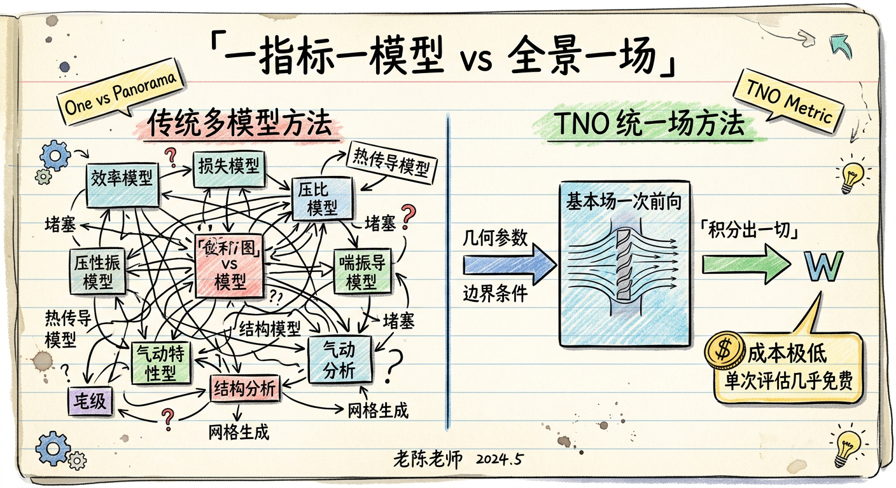

---

#### 图卡：一场多用

基本场一次前向，效率/损失/压比/堵塞等多 W 全是积分下游。换指标就重训 = 拒绝全景红利。

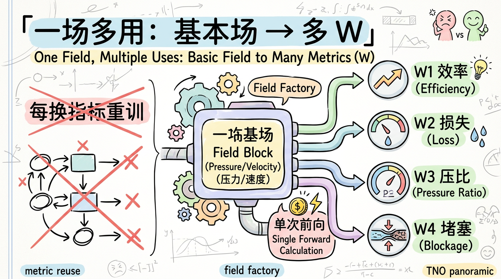

---

#### 图卡：临时起意指标陷阱

周会每冒出一个新 KPI 就新训一个小模型——这是「一指标一模型」的日常形态。全景基本场是解药。

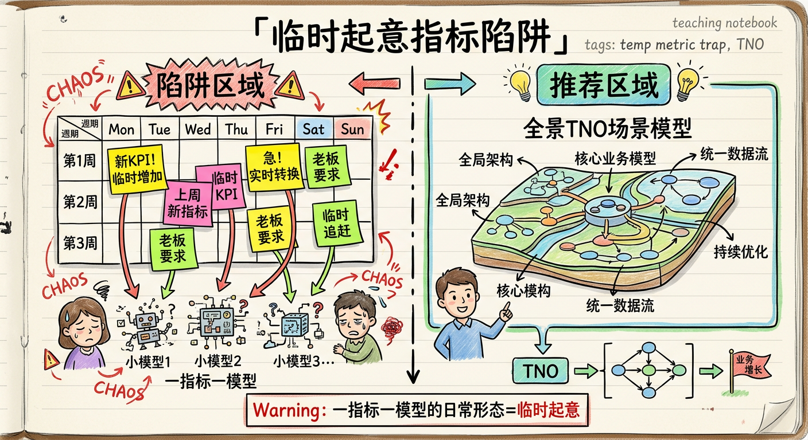

---

#### 章末：30 秒复述 · 自测 · 元数据

**30 秒复述稿（可朗读）：** 少打车与把车费打到接近免费要一起做。TNO 先预测基本场再积分出多指标，一场多用，消灭一指标一模型。读耗时数字要当侦探，矛盾就标待核实。

**自测（先做再对答案）：**

1. 为什么「先场后积分」比「一指标一模型」更适合设计室？  
2. 两段式上线检查单里，你最该先确认哪一项？  
3. 遇到互相矛盾的毫秒数，正确动作是什么？

<details>
<summary>点开看参考答案</summary>

1. 一场多用，新指标复用 f_s，免重训重采。  
2. f_s 是否覆盖下游所有 W。  
3. 记录设置并标「待核实」，不平均、不装懂。

</details>

> **本讲元数据**（读完再看，不挡故事）
> | 项 | 值 |
> | :--- | :--- |
> | 规范编号 | **16** |
> | 原始文献 | *Chinese Journal of Aeronautics*, **2025, 38(7): 103473** |
> | DOI | `10.1016/j.cja.2025.103473`（开放获取 CC BY） |
> | 作者 | Qineng Wang, Zhendong Guo, Liming Song\*, Tianyuan Liu\* |
> | 本地原文 | `1-s2.0-S1000936125000792-main.pdf` |
> | 证据等级 | **A（本地原文逐句可查）** |
> | 反派绰号 | 一指标一模型 |
> | 主比喻 | 与其省打车钱，不如把打车变免费 |

---

<a id="lec-11" name="lec-11"></a>
### 【第11讲】SDNO：让网络"照着物理公式"长——把叠加原理写进神经算子（**论文 12**）

#### 本讲开场 90 秒

**上讲闪回：** 全景场之后是孔排：组合爆炸，必须写叠加原理。

**本讲反派：** 「外推失效」

**只要带走 3 句口诀：**

1. **单孔组合多孔**
2. **Sellers可修，⊕̂可学**
3. **交换律是物理检查单**

**主比喻：** 练1–2孔上线10孔，不写叠加没资格外推

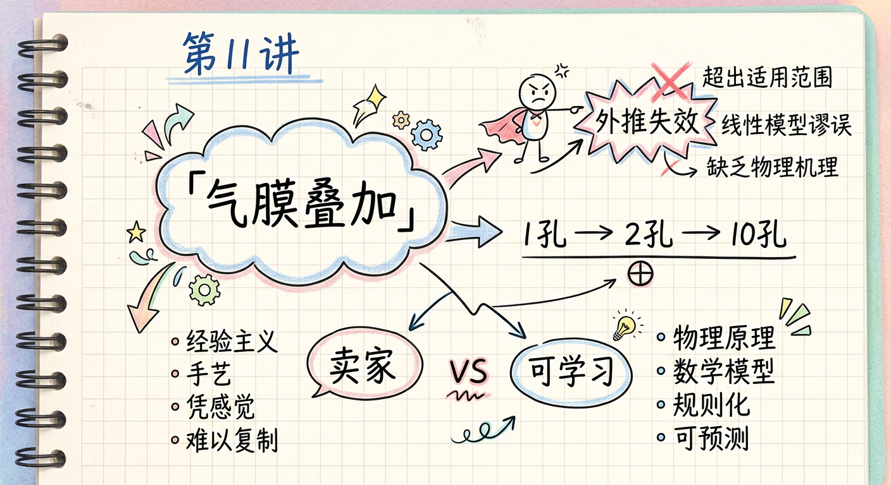

> **看图三秒：** 1→2→10 孔与 ⊕；反派外推失效。

**本讲赌注：** 孔数一变就重训，冷却设计会永远困在组合爆炸里。

---

#### 1. 生活与物理直觉引子：为什么"背过题"的 AI 一遇到新题型就崩

先说一个所有深度学习用户都踩过的坑。

你给一个网络看成千上万张"1 个喷头"和"2 个喷头"的喷水降温照片，让它学会预测地面温度分布。现在你问它：**10 个喷头同时开会怎样？**

网络大概率答不好。不是因为它笨，而是因为**它从来没见过 10 个喷头的画面**——在它的经验里，"画面里有 10 个白点"这件事根本不存在。这就是**外推失效（extrapolation failure）**。

工程上这个问题非常现实：

> 做涡轮端壁气膜冷却设计时，你不可能为"7 个孔""8 个孔""19 个孔"每一种孔数都准备一批 CFD 训练数据——**太贵了**。

那怎么办？人是怎么解决这类问题的？

人的做法是**用物理规律**。早在几十年前，气膜冷却领域就有一个非常朴素的经验规律——**叠加原理（superposition principle）**：

> 多个孔一起开的冷却效果，可以由"每个孔单独开的效果"**叠加**出来。

本文的核心想法，就是把这条**人尽皆知的物理规律，直接写进神经网络的结构里**。

**外推考试：**  
训练时只见过 1–2 个喷头，上线却要 10 个喷头——纯数据网络会慌。  
把 Sellers 叠加写进结构，等于告诉网络：「多孔 = 单孔的某种组合」，它才有资格参加外推考试。

**考试题：** 训1–2孔，考10孔。

> **先猜后揭：** 若本讲反派「外推失效」赢了，你的下一笔 CFD/实验预算会怎样被浪费？揭晓贯穿 §3–§5。

| 生活元素 | 工程元素 | 符号 |
| :--- | :--- | :--- |
| 主比喻侧 | Sellers | ⊕_seller |
| 主比喻侧 | 可学习叠加 | ⊕̂ |
| 主比喻侧 | 冷却效率 | η_C |

**喷头考试：** 训 1–2 孔，上线 10 孔。只背像素→效率且无叠加结构，等于另一门课。Sellers 与 ⊕̂ 是开卷公式。

**喷头考试加长：**  
笔试：1 孔、2 孔覆盖与效率。  
上线：燃烧室壁 10 孔真实排布。  
若模型只背「像素→η」，10 孔是另一门课；若模型会 ⊕，10 孔是组合题。

**工程师的恐惧：** 孔排一改就重做全套 CFD 矩阵——组合爆炸。叠加算子是把组合从「枚举」变成「运算」。

**喷头考试委员会纪要：**  
笔试通过：1 孔、2 孔的 η_C 与覆盖。  
上线事故：10 孔真实燃烧室壁，网络输出「像训练过的 2 孔拼贴」。  
结论：缺叠加结构的模型在背题；有 ⊕ 的模型在运算。

**组合爆炸的第二张脸：**  
孔排几何还要和吹风比、攻角、端壁型面耦合——全 CFD 矩阵不是「多跑几天」，是季度级。

---

#### 2. 叶轮机械中的真实工程死穴：端壁气膜冷却的 CFD 成本


> **指读：** 枚举树爆炸；叠加算子把组合变运算。

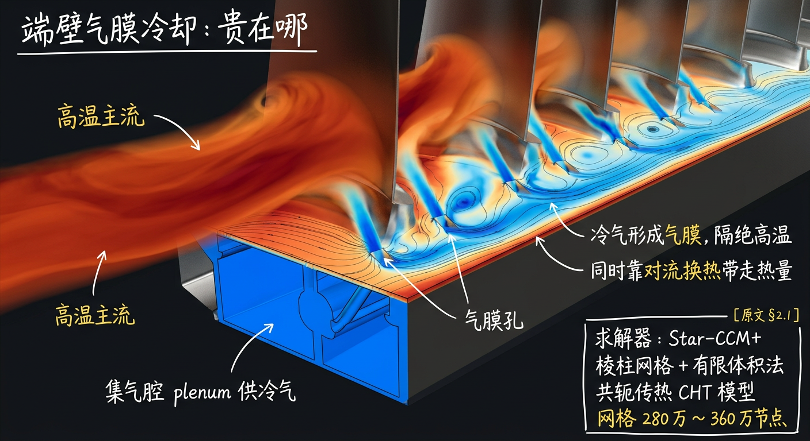

> **指读：** 这张图是本讲工程死穴的一张图版本。

先看这个工程问题有多贵。

**研究对象**：Pak-B 叶片端壁的气膜冷却。Pak-B 是气膜冷却领域的经典公开标杆几何。

**物理过程**：高温主流从一侧流过端壁；冷气从端壁下方的**集气腔（plenum）**进入，通过端壁上的**气膜孔**喷出，与主流掺混。冷气一方面形成覆盖端壁的**气膜**隔绝高温，另一方面通过对流换热带走热量。

**数值模型**［原文 §2.1］：

| 项目 | 设置 |
| :--- | :--- |
| 求解器 | **Star-CCM+**，棱柱网格 + 有限体积法，**共轭传热（CHT）**模型 |
| 网格规模 | **280 万 – 360 万**节点 |
| 单样本成本 | **4 核并行约 3 小时** |

**边界条件**［原文 Table 1］：主流出口雷诺数 1.98×10⁵；主流进/出口马赫数 0.029 / 0.047；主流进口总温 **323 K**；主流进口湍流度 **6%**；速度/动量边界层厚度 33 mm / 2.5 mm；冷气进口总温 **286 K**。

也就是说：**一个样本 3 小时**。要生成覆盖"1 到 20 个孔 × 各种位置组合"的训练集，成本是天文数字。

于是问题被逼成一句话：**能不能只在"1–5 个孔"的数据上训练，却让模型能预测"10–20 个孔"的布局？**

**现场感：** 周五下班前组长要数——你面对的不是可以慢慢推的练习题，而是**算错一次就不可回收**的预算。

**组合爆炸的量级感：**  
孔数、孔径、位置、吹风比一排列，全 CFD 矩阵会吞掉季度。  
叠加算子把「枚举」变成「运算」——这是冷却设计能迭代的前提。

**端壁气膜 CFD 成本钉钉子：**  
单孔还好说；多孔全因子是灾难。  
工程上需要：单孔响应库 + 可组合算子 + 外推验收集。  
本讲 SDNO 把第二项写进网络结构。

---

#### 3. 数学公式从 0 到 1 推导

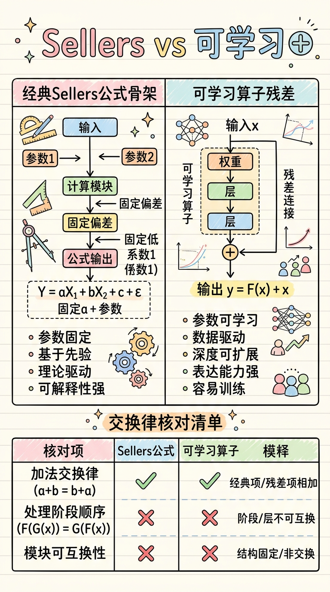

> **指读：** 左 Sellers 骨架可解释；右可学习残差捕非线性；底交换律检查单。

先把公式关掉，用主比喻说一遍：

> **练1–2孔上线10孔，不写叠加没资格外推**  
> 本讲反派是「外推失效」。下面公式是这句话的展开；每条核心式尽量带**回译**。知识总量不删——深潜只是阅读路径，不是垃圾桶。

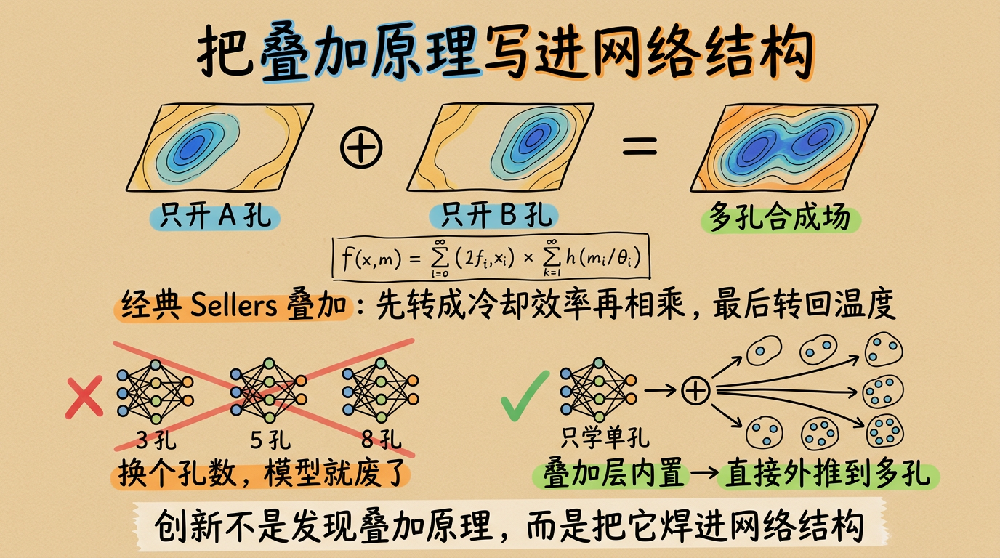

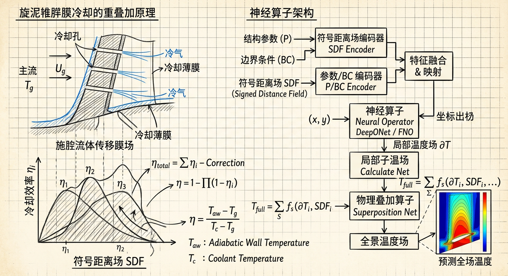

> 上图是 SDNO 的物理底座：**若干单孔的气膜有效度场，按叠加原理合成多孔场**。本文的创新不是「发现」叠加原理（它是近似的、有适用条件的），而是把它**写进网络结构**，让模型只学单孔、就能外推到多孔。

##### 3B. 本讲符号卡（建议截图留存）

| 符号 | 人话 | 备注 |
| :--- | :--- | :--- |
| ⊕_seller | Sellers |  |
| ⊕̂ | 可学习叠加 |  |
| η_C | 冷却效率 |  |

> 🧭 先认符号再读公式；主文核心式有「回译」，装不下的细节仍在正文完整保留（不删知识）。

##### 3C. 主路径公式与推导（知识全保留）

**第一步：原始的 Sellers 叠加公式**

气膜冷却领域经典的叠加原理写成：
**〔式〕** T^(AB)(ω) = T^(A)(ω)⊕_seller T^(B)(ω) = η_C⁻¹[η_C(T^(A)(ω))·η_C(T^(B)(ω))]

**回译：** 上式是主路径构件——先记住它在算法里负责哪一步，再抠每一个符号。

其中 η_C 是气膜冷却效率，T^(A)、T^(B) 分别是"只开 A 孔"与"只开 B 孔"时的温度场。

**第二步：本文的两处关键改造**
**〔式〕** T^(AB)(Ωₚ) = T^(A)(Ωₚ) ⊕̂_super(θ_S) T^(B)(Ω_p)

| 改造 | 原来 | 改成 | 为什么 |
| :--- | :--- | :--- | :--- |
| **① 算子可学习** | 固定的 ⊕_seller（Sellers 公式给死） | 参数化的 ⊕̂_super(θ_S) | 让**数据**来修正物理公式的偏差 |
| **② 计算对象升级** | 单点 ω | **子区域 Omega_psubsetΩ** | 把**孔与孔之间的相互作用**纳入叠加 |

> 第 ② 点尤其重要：Sellers 公式是**逐点**成立的，但真实流场里上游孔会改变下游孔的主流环境，这种**非局部干扰**必须靠"子区域"才能表达。

**第三步：把叠加原理实例化成网络**
**〔式〕** F̂∘ X^(AB)(Ωₚ) = Ŝ(Ĉ∘ X^(A), Ĉ∘ X^(B))(Ωₚ)

- Ĉ(·) —— **Calculate Net**（计算网络）：基于 **Transformer** 的神经算子，负责预测"**子布局**"的温度场；
- Ŝ(·) —— **Superposition Net**（叠加网络）：用 **FNO** 实现，负责把多个子布局的场**叠加**成完整布局的场。

Superposition Net 的具体结构［Table 3］：

```

输入 N×128×128×2
  → Patch 16            → 16N×32×32×2
  → Linear-1            → 16N×32×32×64
  → (Conv2d + GELU + SpectralConv2d) × 2
  → Linear-2 / Linear-3
  → Patch-reverse       → N×128×128×1
总参数量：17,089（0.07 MB）

```

**第四步：一个极其优雅的性质——交换律与结合律**

校准后的叠加算子满足：

**〔式〕** T^(A)⊕̂_super T^(B) = T^(B)⊕̂_super T^(A)

**〔式〕** T^(A)⊕̂_super T^(BC) = T^(AB)⊕̂_super T^(C)

**这意味着什么？** 意味着 Ŝ 网络可以**被反复递归调用，而且不在乎输入顺序**。

于是：你在**1–5 个孔**的数据上训练好"两两叠加"的能力，推理时就能**像搭积木一样**把 20 个孔的场一层层叠出来——**这就是"从 5 外推到 20"的机制根源。**

> 💡 这是本讲最值得记住的一点：**不是靠更大的网络记住更多，而是靠"结构符合物理"让外推变得合法。**

**第五步：SDF 预处理——别把孔画成黑白像素**

如果直接把气膜布局表示成二值像素（有孔=1、无孔=0），会有**像素化误差**：孔的位置稍微挪一点，像素矩阵可能完全不变，网络就"看不见"这个变化。

本文改用**符号距离函数（Signed Distance Function, SDF）**编码布局——SDF 记录"每个点到最近孔的距离（带符号）"，**对孔的位置变化连续敏感**。原文明确指出 SDF"**有效降低了像素化误差**"［§6 结论］。

**第六步：双路径训练 + 推理时的分解策略**

- **训练**：同一个样本走两条前向路径——
 - **standard mode**（黑箭头）：只用 Ĉ 做全监督；
 - **superposition mode**（蓝箭头）："**分解 → 预测 → 叠加**"。
 关键在于：叠加训练的反向传播不仅优化 Ŝ，**还同步调整 Ĉ 的参数**，从而丰富了 Ĉ 见到的样本排列组合，**连 Ĉ 自身的精度都被带高了**。
- **推理**：训练时随机分解，推理时改用固定的**"均质化（homogenization）"策略**——把气膜孔**均匀**分配到各子布局。原文用 Fig. 10 对比了不同分解策略，结论是均质化能最小化 OOD 样本误差。

**Sellers 与 ⊕̂ 的工程用法（再钉）：**  
- 基线必须能退回 Sellers（可解释、可审）。  
- 可学习部分优先学残差/修正，而不是推倒重来。  
- 交换律在弱非线性区做体检：孔序对调场应近似不变。  
违者按「背题网」处理，不按「深度学习很深」表彰。

---

#### 4. 算法控制流

> 🧭 **值班手册：** 先看「什么情况下走哪条分支」，公式是对白速记不是主角。

```

训练阶段：
  ① CHT 仿真生成样本：Pak-B 端壁，气膜孔数从 1 到 5，位置随机（单样本约 3 小时）
  ② 用 SDF 编码每个布局（替代二值像素）
  ③ 双路径训练：
       black：L = ||Ĉ(X) − Y||²                 （全监督，只训 Ĉ）
       blue ：分解 → Ĉ 预测子场 → Ŝ 叠加 → 与全场真值比（同时更新 Ŝ 与 Ĉ）
  ④ 微调（fine-tuning）

推理阶段：
  ⑤ 把待预测的 N 孔布局，按"均质化"策略分解为若干子布局（如 5 孔 × 4 组）
  ⑥ Ĉ 预测每个子布局的温度场
  ⑦ Ŝ 递归地把这些场两两叠加（顺序无关）
  ⑧ 得到完整布局的温度场

```

> **一句话记住：** 单孔组合多孔；进阶：Sellers可修，⊕̂可学。

**主比喻回扣：** 把上面的分支再翻译成「练1–2孔上线10孔，不写叠加没资格外推」——若某步在生活里说不通，多半是符号没对齐。

**流程：** 单孔库 → ⊕ 组合 → 多孔场 → 积分 η_C。交换律：孔序在弱非线性区不应改物理。

**上线前外推演练：**  
固定单孔库 → 用 ⊕ 组 5/10 孔 → 看误差与交换律。  
演练失败 = 禁止宣称「可外推到任意孔排」。

---

#### 5. 实验验证与量化突破

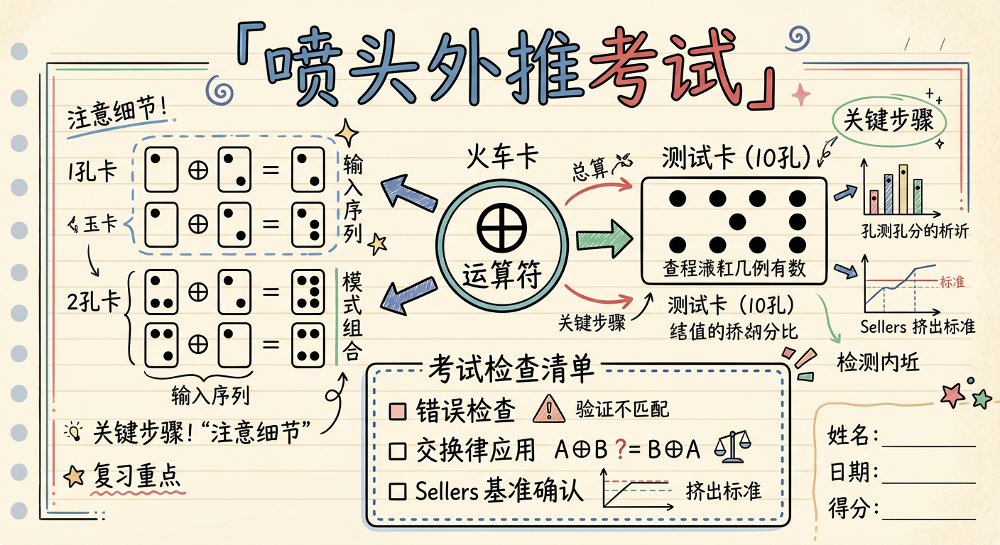

> **指读：** 验收三件：多孔误差、交换律、不弱于 Sellers。

**先报胜负：** 先读结论句与最大那一格，再读全表；表是证据架不是背诵清单。

**核心结果**（均相对**全监督基线网络**）［原文 §6 结论、§1 贡献点(3)］

| 阶段 | 样本类型 | 误差降低 |
| :--- | :--- | :--- |
| 叠加训练后 | **ID（分布内）样本** | **约 20%** |
| 叠加训练后 | **OOD（分布外）样本** | **约 70%** |
| **进一步微调后** | **外推到 20 个气膜孔** | **超过 90%** |

- **训练数据**：气膜孔数量 **1 – 5**、位置不同的样本；
- **外推目标**：训练时**从未见过**的 **10 – 20 个气膜孔**布局。

> 原文在 §5.1 中还坦白了一件重要的事：**只做叠加训练时，模型对训练集分布之外样本的预测精度"仍不足以满足工程应用需求"**；真正达到可用，是在**进一步微调之后**。这一点必须诚实呈现——**"外推到 20 孔、误差降 90%"是微调后的结果，不是零样本外推的结果。**
［原文 P12 §5.1］

**体感换算：** 把关键数字换成「工程师的周/月」或「一次签字的风险」——数字才进长期记忆。若原文给了墙钟时间或成本比，优先用原文换算。

---

**冷却线：** 16–20 织完气膜、冲击、实验、UQ。

#### 6. 审稿人批判与承前启后

把软肋放上**可信度刻度**（0=完全不信，5=可当默认工具）：

| 维度 | 打分 | 人话 |
| :--- | :---: | :--- |
| 偏置 | 5 | |
| 外推 | 4 | |
| 数据 | 4 | |
| 泛化 | 2 | |

**可以攻击的点：**

1. **本地版本是预印本**，未经同行评审；正式版（*Physics of Fluids* 36(12):126110）审稿后是否修改了数字，本讲无法核对［正式版原文未获取］。
2. **叠加原理本身是近似假设**。Sellers 公式假设各孔效果可分离叠加，而真实流场中上游孔会改变下游孔的主流环境，存在**非线性干扰**。本文用"子区域 + 可学习算子"缓解，但**没有根除**——叠加越多次，误差累积的风险越大。
3. **外推到 20 孔依赖微调**。原文自己承认叠加训练后的 OOD 精度仍不够工程可用，说明**纯零样本外推能力有限**。
4. **推理时的分解策略是试出来的**。"均质化"来自 Fig. 10 的对比实验，缺乏理论依据；换一个问题可能要重新试。
5. **只验证了温度场**，未涉及流动场、压力场，也没有接入下游优化闭环。
6. **数据成本依然很高**：280–360 万节点的 CHT 仿真，单样本 4 核 3 小时。

**承前：**
- 继承神经算子（FNO）、Transformer 算子，以及气膜冷却领域经典的**叠加原理（Sellers 公式）**。
- **与论文 16（TNO）是同一作者群在同一时期的两条算子路线**：

| | 论文 16 TNO | 论文 12 SDNO |
| :--- | :--- | :--- |
| 关键词 | **全景式** | **物理增强** |
| 思路 | 先预测基本流场，再按公式算出所有性能量 | 把已知的叠加原理**编码进网络结构** |
| 靠什么 | 靠**数据**与网络容量 | 靠**物理先验** |
| 共同点 | 都属于"让深度学习像 CFD 求解器一样工作"的路线 | |

> **二者互补**：TNO 解决"一个模型服务多个指标"，SDNO 解决"模型在分布外失效"。理想形态是把两者合起来。

**启后：**
- 把物理定律（而非仅靠数据）嵌入网络架构，是解决"深度学习外推失效"的根本路径之一；这一思路也延续到**论文 18（ResUNet-Sim）**。

---

**外推验收最小集：**  
- 多孔持出误差是否仍可控；  
- 弱非线性区交换律是否近似成立；  
- 是否不弱于 Sellers 基线。  
三项过了，才有资格说「会外推」；只报训练均值，是广告。

**外推验收日流程：**  
上午：跑 5/10 孔持出。  
下午：交换律抽检 + Sellers 对照。  
傍晚：只允许在三项都过线时，把「可外推」写进周报。

---

#### 附：外推检查单（可打印）

| 检查 | 通过标准 |
| :--- | :--- |
| 孔数外推 | 训 1–2 孔，测 ≥5 孔误差仍可控 |
| 交换律 | 弱非线性区孔序对调场近似不变 |
| Sellers 基线 | 可学习 ⊕ 至少不弱于经典叠加 |
| 物理单位 | 效率/温度场无量纲或相似参数一致 |

**失败模式点名：**  
- 背题网：换孔排布局即崩  
- 硬叠加：忽略射流相互作用的非线性  
- 只报均值：不报外推集  
本讲 SDNO 的意义是把检查单前两项写进结构。

---

#### 附：外推答辩词（给老板的 60 秒）

「我们不是用 10 孔数据硬训一个大网，而是用单孔响应 + 可学习叠加算子组合出多孔。  
这样孔数从 2 到 10 是结构外推，不是背题。  
验收看三样：多孔误差、交换律、是否不弱于 Sellers 基线。」

**若答辩失败：** 多半是 ⊕ 还在背像素，或训练分布从未见过多孔相互作用的非线性区。

---

#### 附：Sellers 与可学习 ⊕ 的分工白板

| | Sellers ⊕_seller | 可学习 ⊕̂ |
| :--- | :--- | :--- |
| 来源 | 经典气膜叠加公式 | 数据拟合残差/修正 |
| 优点 | 物理可解释、外推有骨架 | 捕捉非线性孔间干涉 |
| 风险 | 强相互作用区偏差 | 乱学可能破坏交换律 |
| 工程用法 | **基线必须保留** | 在残差上学习，验收看外推集 |

**交换律体检：** 在弱非线性区，先孔 A 后孔 B 的场，应约等于反过来。若网络对调孔序就崩，说明在背题而非学叠加。

**与 16/20 的接口：** 单孔物理在端壁角区更脏；复合冷却孔排几何会把本讲算子直接嵌进构型搜索。

---

#### 附：冷却线地图

11 叠加外推 → 16 角区涡系 → 17 实验硬通货 → 18 叶尖三难 → 20 复合冷却同一钱包。  
本讲是孔排组合的数学闸门。

---

#### 附：与 16/20 的对接句

11 解决「孔怎么组合」；16 解决「角区为什么热」；20 解决「冲击+气膜抢同一钱包」。  
三条线交汇处，才是可装机的冷却方案。

---

#### 图卡：叠加算子 ⊕

孔数组合爆炸用结构侧 ⊕ 压缩：单孔场训练，多孔场外推。Sellers 经典叠加变成可学习神经算子——外推考试的正答卷。

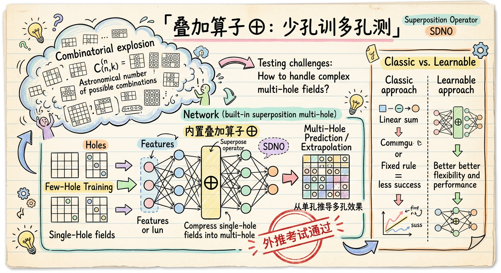

---

#### 图卡：外推考试通过卷

少孔格局训练、多孔格局测试；网络内 ⊕ 叠加算子是正答卷，死记孔位坐标是挂科卷。


---

#### 图卡：经典叠加 vs 可学习桌

左桌 Sellers 固定公式骨架；右桌可学习 ⊕ 补残差。外推考试靠结构先验，不靠死记孔位坐标。

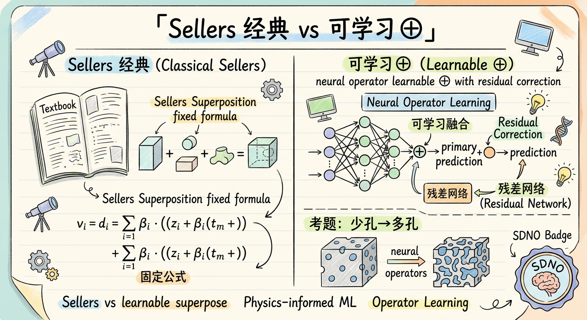

---

#### 章末：30 秒复述 · 自测 · 元数据

**30 秒复述稿（可朗读）：** 气膜孔排列组合抽不完。SDNO 把叠加原理写进算子，使单孔组合出多孔。反派是外推失效：背题网络一换孔数就崩。验收看多孔误差、交换律与 Sellers 基线。

**自测（先做再对答案）：**

1. 为什么直接回归 10 孔容易外推失败？  
2. Sellers 与可学习 ⊕ 如何分工？  
3. 交换律检查什么？

<details>
<summary>点开看参考答案</summary>

1. 组合数爆炸，训练分布盖不住。  
2. Sellers 做可解释基线，⊕̂ 学残差/非线性修正。  
3. 弱非线性区孔序不应改变物理场——违则在背题。

</details>

> **本讲元数据**（读完再看，不挡故事）
> | 项 | 值 |
> | :--- | :--- |
> | 规范编号 | **12** |
> | 标题 | Enhancing the Generalization Ability of Endwall Film Cooling Prediction by Incorporating Superposition Principle into Transformer-based Neural Operator |
> | 作者 | Qineng Wang, Liming Song, Tianyuan Liu（百度 / 北京大学）, Zhendong Guo（通讯） |
> | 发表状态 | 本地 PDF 为 **预印本（SSRN，提交至 Elsevier，2024-06-14），未经同行评审**；正式版已发表于 *Physics of Fluids* 36(12): 126110（2024-12-04） |
> | DOI | 预印本 `10.2139/ssrn.4869789` ｜ https://ssrn.com/abstract=4869789 ；正式版 `10.1063/5.0239483`（题名微调，本讲所有数字引自预印本，正式版未获取） |
> | 本地原文 | `ssrn-4869789.pdf` |
> | 证据等级 | **A（预印本正文全文本地可查）**；正式版著录经 Crossref 核实，但正式版全文未获取 |

> ⚠️ **著录纪律**：本地 PDF 每一页页脚都印着 "This preprint research paper has not been peer reviewed."
> 因此本讲**不编造任何期刊卷期页码**。若该文日后正式发表，应回到此处更新著录。
> | 反派绰号 | 外推失效 |
> | 主比喻 | 喷头降温：1 孔会了，10 孔不会 |

---

<a id="lec-12" name="lec-12"></a>
### 【第12讲】P-ResUNet：把"相似原理"写进输入，把"载荷分布"写进输出（**论文 18**）

#### 本讲开场 90 秒

**上讲闪回：** 算子要在工况间复用：先无量纲，再谈深度。

**本讲反派：** 「带单位硬学」

**只要带走 3 句口诀：**

1. **相似参数进输入**
2. **结构渐进物理跃迁**
3. **误差可数倍降［原文 P18 Table 1］**

**主比喻：** 纸飞机先除以翼展再比形状

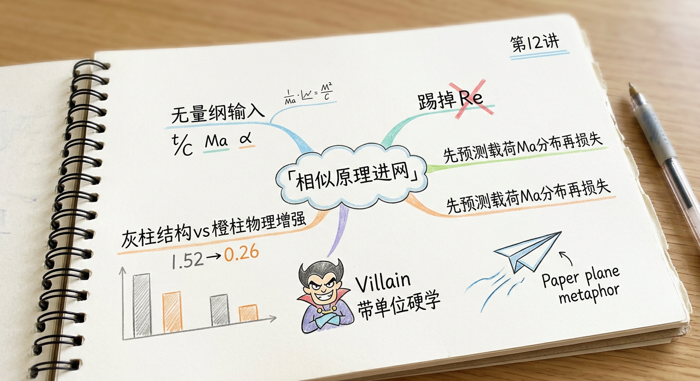

> **指读：** 纸飞机除翼展；灰柱结构渐进、橙柱物理跃迁；反派带单位硬学。

**本讲赌注：** 不先无量纲，宽工况模型会在起飞/巡航之间反复作废，数据预算打水漂。

---

#### 1. 生活与物理直觉引子：为什么做模型之前要先把单位"除掉"

先想一个日常问题。你要训练一个 AI 来预测"不同尺寸的纸飞机能飞多远"。

如果你直接把"翼展 15 厘米""翼展 30 厘米""飞行距离 4 米""飞行距离 9 米"这些**带单位的原始数字**喂给网络，它会学得很吃力——因为它必须自己发现"尺寸放大一倍，飞行模式其实一样"这件事。

但如果你先做一个简单的除法：把长度都除以翼展，得到**无量纲**的比例（比如"展弦比"），网络立刻就能抓住本质：**决定飞行的是形状比例，不是绝对大小。**

流体力学里，这个"先做除法"的智慧有个正式名字——**相似原理（similarity principle）**。

- 两架几何相似、但尺寸相差悬殊的飞机（教学类比，非原文数据），只要**雷诺数**和**马赫数**相同，它们的流场就是相似的；
- 换句话说：**流动本质上不在乎绝对尺度，只在乎那几个无量纲数。**

本文要做的第一件事，就是**把这条原理用在神经网络的输入端**：先做无量纲化，再让网络学习。

**无量纲是礼貌：**  
你不先把长度除以弦长，就逼网络自己发明相似律——它能学，但贵、脆、换工况就忘。  
结构从 MLP→UNet→ResUNet 是爬坡；物理增强是跳崖后的滑翔。

**礼貌：** 别逼网络自己发明相似律。

> **先猜后揭：** 若本讲反派「带单位硬学」赢了，你的下一笔 CFD/实验预算会怎样被浪费？揭晓贯穿 §3–§5。

| 生活元素 | 工程元素 | 符号 |
| :--- | :--- | :--- |
| 主比喻侧 | 除特征尺度 | 无量纲 |
| 主比喻侧 | 物理增强 | P-ResUNet |
| 主比喻侧 | Re/Ma | 工况 |

**纸飞机实验室：** 相似比不同却不除翼展，模型会把尺寸当新特征。无量纲后形状落同一相似类，才可迁移。

**纸飞机实验室（完整版）：**  
两架相似比不同的纸飞机。若输入是「翼展 15 cm / 30 cm、飞了 4 m / 9 m」，网络可能学成「越大飞越远」的假相关。  
先除以翼展，得到展弦比与无量纲距离后，形状落在同一相似类——**可迁移的是比例，不是厘米。**

**流体版同一句话：** 几何相似 + 关键无量纲数相近 → 流场相似。本讲把这句话写进输入端，再逼网络先说清表面载荷分布，才许输出损失数字。

---

#### 2. 叶轮机械中的真实工程死穴：换个工况，模型就废了

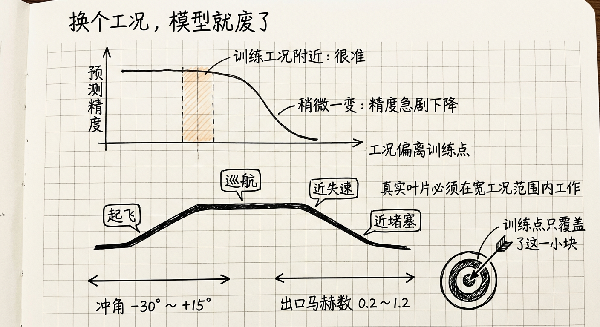

> **指读：** 这张图是本讲工程死穴的一张图版本。

上一讲（SDNO）我们看到的问题是"**换个孔数，模型就废了**"。涡轮叶片设计里有个同类的、甚至更常见的问题：

> **换个工况（马赫数、冲角、栅距），模型就废了。**

传统数据驱动模型在训练工况附近很准，一旦几何尺度或边界条件明显变化，精度就急剧下降［原文 §2.1.1］。

这对工程是致命的，因为**真实叶片必须在宽工况范围内工作**：从起飞到巡航，从设计点到近失速、近堵塞，冲角可能在 −30° 到 +15° 之间变化，出口马赫数能从 0.2 跨到 1.2。

本文的目标是：**建一个能覆盖这整个宽工况范围的预测模型，并把它接进正向/逆向设计闭环。**

**现场感：** 周五下班前组长要数——你面对的不是可以慢慢推的练习题，而是**算错一次就不可回收**的预算。

**宽工况的工程现场：**  
冲角可以从大负到大正，出口 Ma 可以从低亚声速跨到跨声速。  
训练点附近很准、离开就塌，等于只在「设计点海报」上工作。  
P-ResUNet 的目标不是再堆一层卷积，而是让模型在宽工况里**还认得同一套物理语言**。

---

#### 3. 数学公式从 0 到 1 推导

先把公式关掉，用主比喻说一遍：

> **纸飞机先除以翼展再比形状**  
> 本讲反派是「带单位硬学」。下面公式是这句话的展开；每条核心式尽量带**回译**。知识总量不删——深潜只是阅读路径，不是垃圾桶。

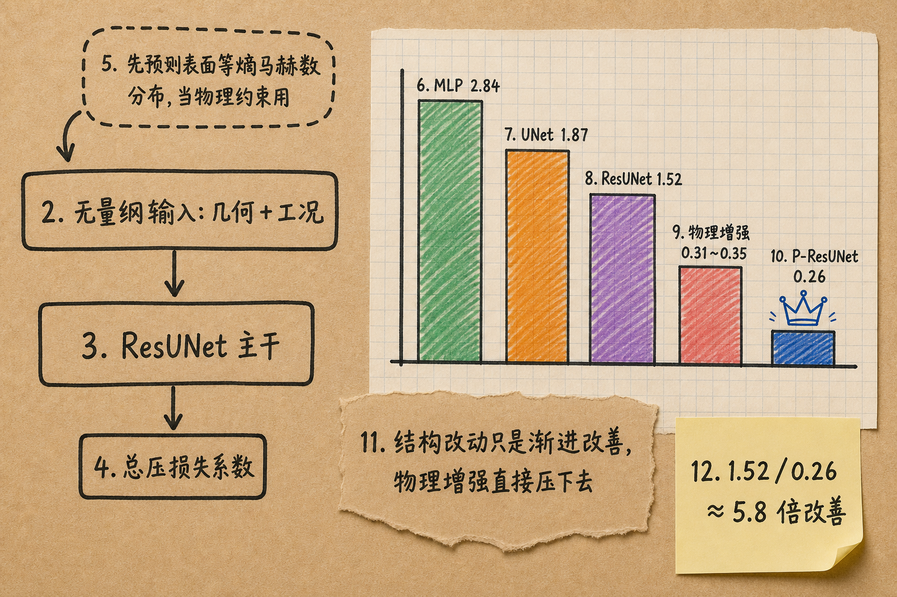

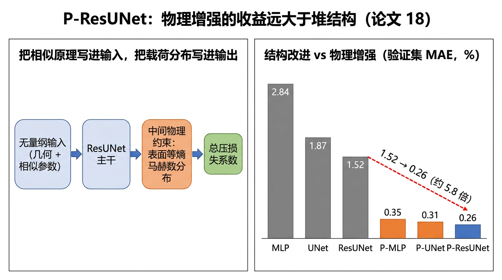

> 上图是本讲全部数学的「一张图版本」：**左图**是数据流——无量纲输入（几何 + 工况相似参数）过 ResUNet 主干，中间先预测**表面等熵马赫数分布**作为物理约束，再输出总压损失系数；**右图**是核心结论——结构改进（灰柱：MLP 2.84 → UNet 1.87 → ResUNet 1.52）只是渐进改善，物理增强（橙/蓝柱）把误差直接压到 0.31–0.35，P-ResUNet 达 **0.26**，较 ResUNet 约 **5.8 倍**改善［原文 P18 Table 1；倍数由本讲计算：1.52/0.26≈5.8］。

##### 3B. 本讲符号卡（建议截图留存）

| 符号 | 人话 | 备注 |
| :--- | :--- | :--- |
| 无量纲 | 除特征尺度 |  |
| P-ResUNet | 物理增强 |  |
| 工况 | Re/Ma |  |

> 🧭 先认符号再读公式；主文核心式有「回译」，装不下的细节仍在正文完整保留（不删知识）。

##### 3C. 主路径公式与推导（知识全保留）

**第一步：几何侧的无量纲化**

以弦长 C 为基准，把二维叶型坐标与栅距全部归一化，并提取关键无量纲特征：
**〔式〕** 相对栅距 (t)/(C)

**回译：** 上式是主路径构件——先记住它在算法里负责哪一步，再抠每一个符号。

它表征叶栅的**稠度（solidity）**。这样一来，模型就不再依赖叶片的实际物理尺寸，**设计空间的维度也被压缩了**。

**第二步：工况侧的无量纲化**

引入两个无量纲准则参数：

- **出口等熵马赫数 Maᵢs1**：建立进口总压 P*₀ 与出口静压 P₁ 之间的映射，表征流动的**可压缩性**；
- **进口冲角 α**：表征来流的**方向性**。

**第三步：一个反直觉的决定——把雷诺数踢出去**

通常教科书会告诉你：流动相似需要雷诺数和马赫数都相等。但本文明确**排除了 Re**，原文给了两条理由：

> ① 典型涡轮叶片通常工作在雷诺数的**自模化区（Re >5×10⁴）**，此时黏性效应对流场的影响相对次要；
> ② **精度验证表明，把 Re 作为输入特征反而会降低预测性能。**［原文 §2.1.1］

> 💡 这是本讲最值得记住的工程判断：**不是"物理上有这个数"就一定要喂给网络。** 特征选择本身就是一种物理建模，加错了特征比少加特征更糟。

**第四步：知识嵌入——让网络先"学会载荷分布"**

传统端到端模型直接从几何映射到损失系数，浪费了数据里丰富的空间信息。本文改为两级：
**〔式〕** 无量纲输入 — ResUNet → 表面等熵马赫数分布 Ma[中间物理约束] — → 总压损失系数 δ

为什么这样做有效？原文的解释是：

> 这一约束**迫使网络在逼近性能数据时遵守流体力学的演化规律**；原文自述该关联预测机制既提升了跨工况泛化能力，也提高了对**激波、分离区**等复杂流动结构的捕捉精度（原文用语 "significantly enhances"，此处为作者自评，量化证据见 §4 的 MRE 1.16% / MAE 0.26%）。［原文 P18 §2.1.2］

用人话说：**你逼着网络先把"压力沿叶型怎么分布"这件事说清楚，它就不太可能靠瞎蒙得到一个数字。**

**第五步：网络主体 ResUNet = U-Net + ResNet**

- **U-Net**：对称的编码器–解码器结构，因在医学图像分割中表现出色而闻名，其"精确定位"能力同样适合预测叶片表面流场；
 - **编码器**：逐层卷积 + 下采样，提取几何与气动特征（4–5 个卷积模块，各含卷积层、最大池化层、激活层）；
 - **解码器**：把低分辨率的深度特征逐步还原到原始尺度；
 - **跳跃连接（skip connection）**：U-Net 的标志性设计，直接把**高分辨率细节**从编码器传到解码器。
- **ResNet 残差模块**作为核心单元嵌入，构成 **ResUNet**。

---

#### 4. 算法控制流

> 🧭 **值班手册：** 先看「什么情况下走哪条分支」，公式是对白速记不是主角。

```

离线建库（一次性投入）：
  ① 选取 5 种工业代表叶型：GE-E3 高压涡轮、PW-E3 高/低压涡轮 + 2 种典型动力涡轮叶片
  ② 参数化：轴向弦长 Cx、进口几何角 β1、进口楔角 ε1、切向弦角 γ、出口偏转角 θ、有效出口角 β2
  ③ LHS 生成 20,000 个叶型
  ④ Python 脚本后台驱动 ANSYS：模板化自动网格 → CFX 批处理求解 → 自动后处理提取
  ⑤ 划分：训练 16,000 / 验证 4,000（4:1）

模型训练：
  ⑥ 输入无量纲化：t/C ∈ [0.3,1.0]，Mais1 ∈ [0.2,1.2]，α ∈ [−30°,15°]（不含 Re）
  ⑦ 训练 ResUNet：输入 → 表面等熵马赫数分布 Ma → 总压损失系数 δ

在线设计闭环：
  ⑧ ANOVA 变量敏感性分析 → 圈定优化空间
  ⑨ 正向设计（给定几何求性能）/ 逆向设计（给定目标载荷反求几何）
  ⑩ 单工况 → 多工况（多点）验证

```

> **一句话记住：** 相似参数进输入；进阶：结构渐进物理跃迁。

**主比喻回扣：** 把上面的分支再翻译成「纸飞机先除以翼展再比形状」——若某步在生活里说不通，多半是符号没对齐。

---

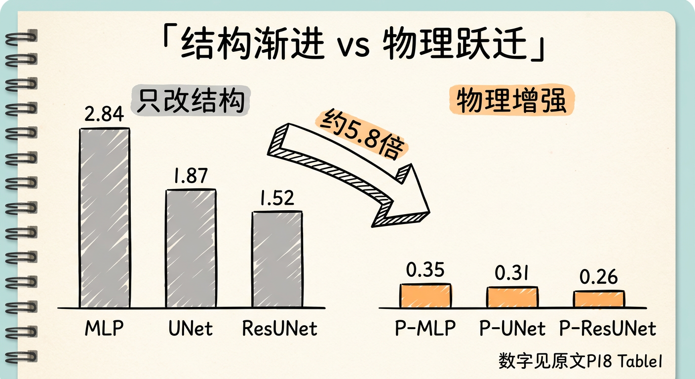

> **指读：** 灰柱只改结构渐进下降；橙柱物理增强把 MAE 从 1.52 压到 0.26［原文 P18 Table 1］。


> **指读：** 台式机约 2 分钟对 128 核约 6 小时——加速两个数量级量级［原文 P18 Table 7］。

#### 5. 实验验证与量化突破

**先报胜负：** 先读结论句与最大那一格，再读全表；表是证据架不是背诵清单。

**数值模型**［§3.2］：ANSYS CFX，二维线性叶栅，k-ω **SST** 湍流模型，近壁网格保证 **y⁺=1**，对流项与湍流项均用 **High Resolution** 格式，稳态收敛判据为所有控制方程 RMS 残差 **<10⁻⁶**。网格无关性研究表明约 **90,000** 单元时总压损失系数即收敛。

**模型可信度验证**：在冲角 **−20°、0°、10°** 三个典型工况下与**实验数据**对比，预测的吸力面等熵马赫数分布与实验吻合良好，尤其在吸力面加速区。

**核心结果：物理增强 vs 网络结构改进，谁的贡献大？**［Table 1］

| 模型 | 验证集 MRE of Ma (%) | 验证集 MAE of δ (%) |
| :--- | :---: | :---: |
| MLP | – | 2.84 |
| P-MLP | 2.16 | 0.35 |
| UNet | – | 1.87 |
| P-UNet | 1.73 | 0.31 |
| ResUNet | – | 1.52 |
| **P-ResUNet** | **1.16** | **0.26** |

> **这张表最有价值的读法**：沿着"不加物理"的一列往下看，MLP → UNet → ResUNet 只从 2.84 降到 1.52（渐进改善）；而一旦加上物理增强，ResUNet → **P-ResUNet** 直接从 **1.52 跳到 0.26**（约 **5.8 倍**改善）［由本讲上表计算：1.52/0.26≈5.8］。
>
> **结论：物理先验的收益，远大于堆网络结构的收益。**

**正向设计：单工况**［原文 P18 Table 4］

| | P-ResUNet | CFD 复核 | 绝对误差 |
| :--- | :---: | :---: | :---: |
| 基准设计 | 3.45% | 3.47% | 0.02 |
| 优化设计 | 3.14% | 3.18% | −0.04 |
| **相对改善** | **8.99%** | **8.36%** | — |

**正向设计：多工况（冲角 10° / 20° / 40°）**［原文 P18 Table 6］

| | 10° | 20° | 40° |
| :--- | :---: | :---: | :---: |
| 基准设计（模型 / CFD） | 3.74 / 3.82 | 3.64 / 3.60 | 3.78 / 3.69 |
| 优化设计（模型 / CFD） | 3.48 / 3.60 | 3.60 / 3.50 | 3.43 / 3.48 |
| **改善幅度（模型 / CFD）** | **6.95% / 5.76%** | **1.99% / 2.78%** | **9.26% / 5.69%** |

> ⚠️ 注意 **20° 冲角**这一列：模型预测改善 1.99%，CFD 复核却是 2.78%——**模型在这里低估了改善幅度**［原文 P18 Table 6］。三个工况中，中等冲角区的预测精度最弱。这是原文没有特别强调、但读表能发现的事实。

**计算成本：这是本文最直观的工程价值**［Table 7］

| 方法（硬件） | 单工况 | 多工况 |
| :--- | :---: | :---: |
| CFD（服务器：**128 核 AMD EPYC 7T83**） | 约 **6 小时** | 约 **18 小时** |
| **P-ResUNet**（台式机：**12 核 Intel i5-10400F**） | 约 **2 分钟** | 约 **5 分钟** |

> 也就是说：**一台普通台式机跑 2 分钟，顶得上 128 核服务器跑 6 小时。** 即便按最保守口径（6 h vs 5 min）计算，加速比也在 **两个数量级** 上下。
> 📌 说明：Table 7 在 PDF 中的列头抽取为四个 "Forward design"（应为"正向/逆向 × 单/多工况"），P-ResUNet 行给出 2/5/5/10 分钟四个值。本表按"正向设计单工况 ≈2 min、多工况 ≈5 min"引用，其余两列（推测为逆向设计）**不做断言**。

**变量敏感性分析（ANOVA）——一段很有工程味道的推理**［§5.1］

1. 在包含**全部变量**的分析中，**尾缘半径 R_le 是最显著的全局变量**——**尽管它的采样变化范围很小**。主效应分析显示：尾缘半径越大，总压损失系数急剧上升。物理解释很直接：**尾缘厚度直接决定尾迹掺混损失的大小。**
2. 于是作者做了一个工程决策：**把尾缘半径固定为 0.3 mm**（考虑实际制造工艺的最小约束），不再作为优化变量。
3. 固定后再分析，发现**尾缘半径的极高敏感性此前"遮蔽"了其他变量**。此时**有效出口角 β₂ 与轴向弦长 Cx** 的影响权重最突出：
 - β₂ 直接决定叶栅出口流量，为满足严格流量匹配，其变化范围须约束在 **±0.5°** 内；
 - Cx 通过改变相对栅距来影响叶道内的流动加速与载荷分布（其 SHAP 归因量值见上表）。
4. 其次敏感的是**吸力面第二段 Bézier 曲线的控制点**——说明吸力面中后段的曲率对边界层发展与流动分离至关重要。

> 💡 这段推理值得反复品味：**"先做敏感性分析 → 发现某个变量的敏感度高到遮蔽一切 → 用工艺约束把它钉死 → 再看其他变量"**，这才是真实工程设计的样子，而不是把 20 个变量一股脑丢给优化器。

**体感换算：** 把关键数字换成「工程师的周/月」或「一次签字的风险」——数字才进长期记忆。若原文给了墙钟时间或成本比，优先用原文换算。

**灰柱橙柱：** 灰=基线硬学，橙=物理增强。1.52→0.26 约 5.8×，是先验的价钱，不是调参玄学。

---

**与 15：** 12 偏叶表/载荷；15 偏子午方案期。

#### 6. 审稿人批判与承前启后

把软肋放上**可信度刻度**（0=完全不信，5=可当默认工具）：

| 维度 | 打分 | 人话 |
| :--- | :---: | :--- |
| 相似 | 5 | |
| 增益 | 5 | |
| 覆盖 | 3 | |
| 网格 | 2 | |

**可以攻击的点：**

1. **是二维线性叶栅**。未涉及三维叶片、端壁效应与二次流。
2. **排除了雷诺数**。虽然原文给出了自模化区的理由并做了精度验证，但这意味着**模型不宜外推到低雷诺数工况**（如高空巡航、小型动力装置）。这是一个明确的能力边界，使用时必须注意。
3. **"小量纲"指标的误差仍需警惕**：MAE 0.26% 是**绝对误差的均值**，而总压损失系数本身只有 3%–4% 量级，换算成相对量仍有约 6%–8% 的不确定性。
4. **20° 冲角下模型低估了改善幅度**（1.99% vs 2.78%），说明中等冲角区的预测精度弱于其他工况，原文未深入讨论。
5. **数据集同质**：20,000 个样本均由 5 种基准叶型经参数化扰动生成，本质是"同一族叶型"的插值，对**全新叶型族**的泛化能力未验证。
6. **优化器未做特别设计**：收益几乎全部来自"评估便宜"，而非"搜索聪明"——与第 10 讲 TNO 的批判相同，这两条路线本可叠加。
［原文 P18 正文与 Table，数值由原文给出］

   ［原文 P18］以上第 1–6 点均基于原文报告的方法设置与结果所作的合理质疑：MAE 0.26% 出自摘要与结论(1)，多工况改善数据出自 Table 6，y⁺=1、90,000 单元、−20°/0°/10° 实验验证出自 §3.2。

**承前：**
- 继承 U-Net / ResNet 图像式流场预测、相似原理无量纲化、叶型参数化与 ANOVA 敏感性分析。
- ANOVA 变量分析延续了**论文 11（DA-EGO）**的做法，但目的从"服务子空间分解"变成"圈定优化空间"。

**与 TNO、SDNO 共同构成"物理增强深度学习"三条路线**（这是本讲最值得总结的一点）：

| | 论文 16 TNO | 论文 12 SDNO | 论文 18 P-ResUNet |
| :--- | :--- | :--- | :--- |
| 物理先验注入位置 | **输出侧**：先预测基本场，再按公式算性能 | **结构侧**：把叠加原理写进网络 | **输入侧**（相似原理无量纲化）+ **输出侧**（载荷分布作中间约束） |
| 主要解决的问题 | 一个模型服务多个指标 | 分布外外推 | 跨工况泛化 |

**启后：** 把训练好的预测器接入**正向 + 逆向**双模式设计框架，是"AI 预测器 → 工程设计闭环"的完整示范，也是后续把"廉价评估"与"聪明搜索"结合的基础。

---

**在线闭环怎么用（值班）：**  
离线 2 万样本是一次性基建；在线只跑分钟级前向。  
ANOVA 先钉死「敏感到遮蔽一切」的变量（如尾缘半径用工艺钉死），再优化其余——这是工程，不是把 20 个旋钮扔进黑箱。

---

#### 附：三条物理增强路线对照（可打印）

| | TNO（10） | SDNO（11） | P-ResUNet（12） |
| :--- | :--- | :--- | :--- |
| 先验位置 | 输出侧先场后积分 | 结构侧叠加算子 | **输入无量纲 + 输出载荷约束** |
| 主打问题 | 多指标复用 | 孔数外推 | **跨工况泛化** |
| 反派 | 一指标一模型 | 外推失效 | 带单位硬学 |

**读 Table 1 的强制口令：** 先比「加物理前后」的跃迁，再比「换骨干网络」的渐进——先验通常比深度更值钱［原文 P18 Table 1］。

---

#### 附：特征选择的反直觉卡片

「物理上有 Re」≠「必须喂给网络」。  
自模化区 + 验证显示加 Re 伤精度 → 踢出输入［原文 P18 §2.1.1］。  
特征工程本身是物理建模；加错比少加更糟。

---

#### 图卡：带单位硬学 vs 无量纲

左侧把 mm、m/s 原数硬塞网络——工况一换就废；右侧先无量纲（Ma、相对几何、载荷分布）再入 P-ResUNet，同形异尺落同一相似类。**先验往往比再堆一层更值钱。**

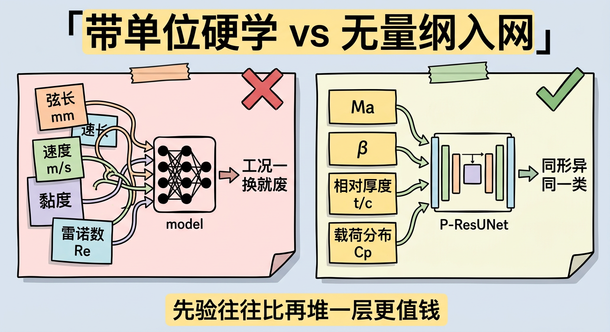

---

#### 图卡：物理增强三条路线

TNO（输出侧先场后积分）打多指标；SDNO（结构侧叠加）打孔数外推；P-ResUNet（输入无量纲 + 输出载荷约束）打跨工况。反派分别是一指标一模型、外推失效、带单位硬学。

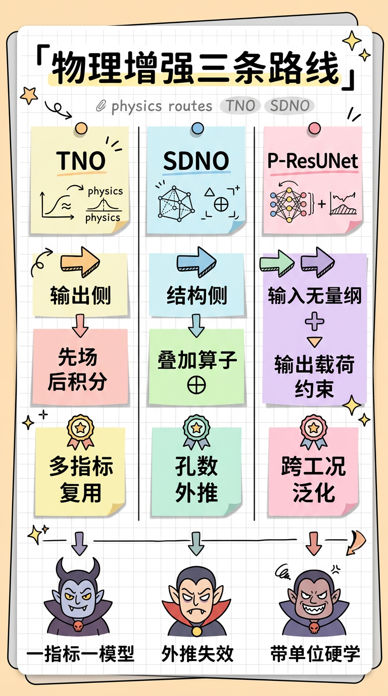

---

#### 图卡：反直觉踢掉 Re

物理上「有 Re」≠ 必须喂网。自模化区黏性次要，且验证显示加 Re 伤精度 → 踢出输入；留下 Ma、相对几何与载荷分布［原文 P18 §2.1.1］。


---

#### 图卡：灰柱渐进 vs 橙柱跃迁

只换骨干（灰）是渐进；加物理增强（橙）才是误差跃迁。读 Table 1 先比加物理前后，再比网络深浅［原文 P18 Table 1］。

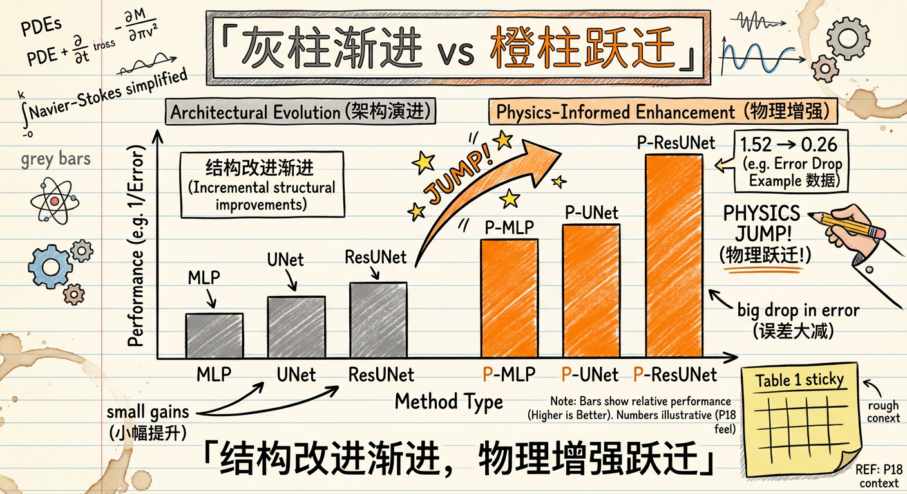

---

#### 章末：30 秒复述 · 自测 · 元数据

**30 秒复述稿（可朗读）：**  
换工况就废，常因带着单位硬学。P-ResUNet 把相似参数塞进输入，并强迫网络先预测表面载荷分布再输出损失。结构改进只是渐进，物理增强可把误差从约 1.52 压到 0.26［原文 P18 Table 1］；台式机两分钟对标服务器数小时［原文 P18 Table 7］。先验往往比再堆一层网络更值钱。

**自测（先做再对答案）：**

1. 为什么要把几何与工况先做无量纲，而不是把带单位的原始数直接喂网？  
2. 灰柱（MLP→UNet→ResUNet）与橙柱（P- 系列）在 Table 1 上说明什么？［原文 P18 Table 1］  
3. 本文为什么把雷诺数踢出输入？边界是什么？

<details>
<summary>点开看参考答案</summary>

1. 逼网络自己发明相似律又贵又脆；无量纲后同形异尺落同一相似类。  
2. 只改结构是渐进；加物理增强是跃迁（如 1.52→0.26）。  
3. 自模化区黏性次要，且验证显示加 Re 反而伤精度；低 Re 外推危险［原文 §2.1.1］。

</details>

> **本讲元数据**（读完再看，不挡故事）
> | 项 | 值 |
> | :--- | :--- |
> | 规范编号 | **18** |
> | 原始文献 | *Aerospace Science and Technology*, **2026, 177: 112351** |
> | DOI | `10.1016/j.ast.2026.112351` |
> | 作者 | Hui Cheng, Liming Song, Yuqing Ouyang（中国航发湖南动力机械研究所）, Fei Zeng, Zhendong Guo（通讯） |
> | 本地原文 | `1-s2.0-S1270963826007315-main.pdf` |
> | 证据等级 | **A（本地原文逐句可查）** |

> ❗ **两处旧文档错误，在此更正：**
> 1. 旧文档给本文填的 DOI 是 `10.1016/j.ast.2026.112440`——该 DOI 实际指向 *Accelerating Tandem-Airfoil simulations using curriculum-based GCN for initialization*（作者 Wei Xian Lim 等），**与本团队毫无关系**。正确 DOI 为 **`10.1016/j.ast.2026.112351`**。
> 2. 旧版白皮书称本文"**马赫数预测精度 98%**"——原文并无此说法。正式指标是**流场（表面等熵马赫数分布）平均相对误差 MRE = 1.16%**，且它衡量的是**分布预测**，不是"精度 98%"这种含糊表述。
［原文 P18 与出版商页面核对；旧文档错误为本次重建核对结果］
> | 反派绰号 | 带单位硬学 |
> | 主比喻 | 纸飞机：先除以翼展 |

---

<a id="lec-13" name="lec-13"></a>
### 【第13讲】SHAP：优化跑完之后，那一堆数据里到底藏着什么？（**论文 19**）

#### 本讲开场 90 秒

**上讲闪回：** 冠军叶型已出；本讲打开93维黑箱变人话准则。

**本讲反派：** 「冠军无配方」

**只要带走 3 句口诀：**

1. **SHAP分贡献到变量**
2. **目标是可执行准则**
3. **小变大影响才进手册**

**主比喻：** 神菜却说不清配方——写不进规范

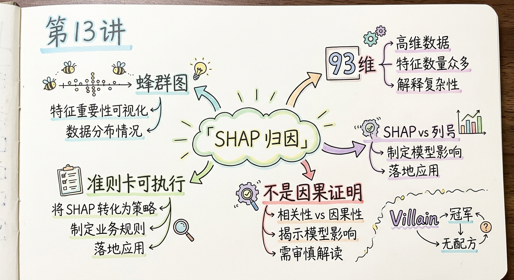

> **看图三秒：** 蜂群归因→可执行句子；不是因果证明。

**本讲赌注：** 说不清配方的冠军，进不了设计规范。

---

#### 1. 生活与物理直觉引子：赢了比赛，却说不清为什么赢

想象一位厨师参加厨艺大赛，拿了冠军。记者问他："你这道菜为什么好吃？"

如果他说"因为我放了很多调料，炒了很久"——这不算回答。真正有价值的回答是：

> "关键是**糖要在下酱油之前放**，这样能裹住肉的水分；至于火候，前两分钟必须大火，之后转小火——**这两个步骤顺序反了就会柴**。"

前十二讲，我们一直在研究**"怎么更快找到冠军"**——CR-EI、Filter-GEI、GSDE、DA-EGO、KT-ASO、GTO、TNO……每一讲都在让搜索更高效。

但这一讲要问一个**被忽略的问题**：

> **找到最优解之后，我们能说清"它为什么好吗"？**

要知道，一次优化跑下来会产生几百上千个样本（几何 + CFD 结果）。这些数据的价值**绝不只是"里面有一个最优解"**——它们记录了整个设计空间的"地形"。可惜大多数时候，我们只取走最高点，然后把地图扔了。

本文要做的事：**把这张地图读出来，变成人能理解的设计准则。**

**归因不是事后诸葛：**  
优化日志里躺着上百次 CFD，若只交出一个冠军外形，工程师无法写进设计手册。  
SHAP 要的是：**可执行的句子**——例如「尾缘半径别乱加厚」。

**手册测试：** 这句能写进设计规范吗？

> **先猜后揭：** 若本讲反派「冠军无配方」赢了，你的下一笔 CFD/实验预算会怎样被浪费？揭晓贯穿 §3–§5。

| 生活元素 | 工程元素 | 符号 |
| :--- | :--- | :--- |
| 主比喻侧 | SHAP值 | φ_i |
| 主比喻侧 | 可执行句 | 准则 |
| 主比喻侧 | 设计变量 | 93维 |

**厨房验收：** 只给总分则菜谱无法复现。SHAP 拆贡献；准则卡写成可检查区间，才能进岗位手册。

**颁奖典礼翻车：**  
优化组捧出冠军叶型，规范组问「写哪三条」。全场沉默。  
外形图不能进手册；**可检查区间**才能进手册。SHAP 是把沉默变成句子的翻译器——它翻译的是贡献，不是因果神谕。

**颁奖典礼加长版：**  
优化组：外形来了。  
规范组：写哪三条？  
工艺组：这条敏感方向铣不出来。  
强度组：那条和圆角耦合。  
SHAP 提供的是**优先调查清单**；准则卡是跨组谈判后的可执行句子。  
把 SHAP 当因果神谕，会在下一轮数据上丢脸。

---

#### 2. 叶轮机械中的真实工程死穴：93 维，人脑完全无法理解

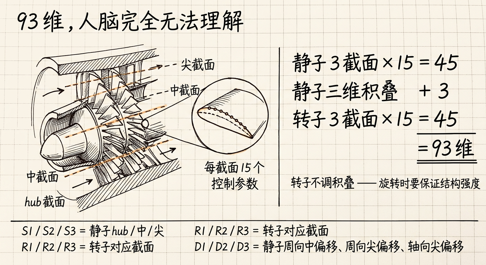

> **指读：** 这张图是本讲工程死穴的一张图版本。

本文的设计空间有多大？**93 维**（独立几何控制参数；静子 45 剖面+3 积叠，转子仅 45 剖面）［原文 P19］。

| 部件 | 变量构成 |
| :--- | :--- |
| **静子** | 3 个截面（hub / 中 / 尖）× 每截面 15 个控制参数 = **45**；外加 **3** 个三维积叠参数 |
| **转子** | 3 个截面 × 15 = **45**（**不调整积叠形状**——因为旋转时要保证结构强度） |
| **合计** | **93 维** |

命名规则：S1/S2/S3 = 静子 hub / 中 / 尖截面；R1/R2/R3 = 转子对应截面；D1/D2/D3 = 静子的**周向中偏移、周向尖偏移、轴向尖偏移**。

在 93 维空间里，人不可能像看二维图像那样"看出"规律。传统的敏感性分析能告诉你"第 37 号变量很重要"，但给不了三件更要紧的事：

1. 这个变量是**调大好**还是**调小好**？
2. 它影响的是**叶高的哪一段**？
3. 它背后的**物理机制**是什么？

SHAP 恰好能提供前两点，本文进一步把第三点也做出来了。

**现场感：** 周五下班前组长要数——你面对的不是可以慢慢推的练习题，而是**算错一次就不可回收**的预算。

**93 维的体感：**  
把 93 个旋钮同时转给一位主任看，等于没看。  
蜂群图的价值是降维叙事：先找少数「推得动目标」的方向，再谈工艺能不能做。

**93 维的会议技术：**  
禁止逐个旋钮念名。  
只允许：蜂群 Top 贡献 → 工艺可行性 → ≤3 条准则卡。  
其余进附录「次要敏感」，避免手册变成电话簿。

---

#### 3. 数学公式从 0 到 1 推导

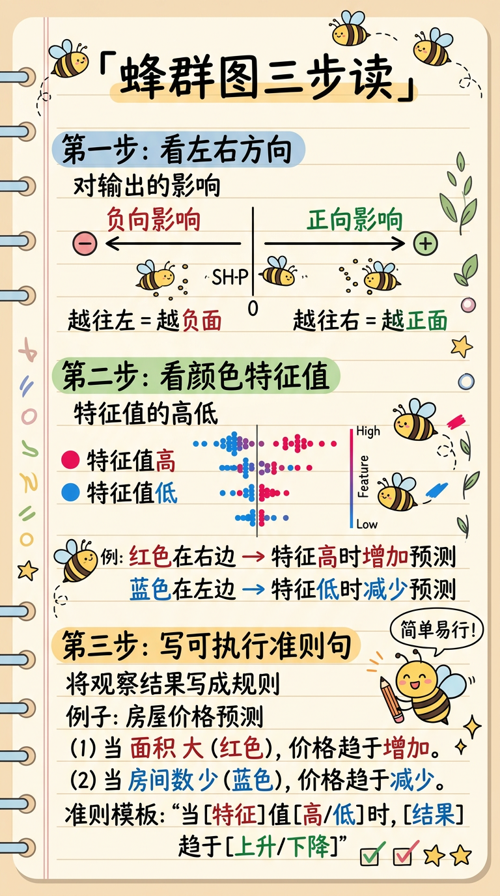

> **指读：** 停在蜂群=翻译做到一半；准则卡才进手册。

先把公式关掉，用主比喻说一遍：

> **神菜却说不清配方——写不进规范**  
> 本讲反派是「冠军无配方」。下面公式是这句话的展开；每条核心式尽量带**回译**。知识总量不删——深潜只是阅读路径，不是垃圾桶。

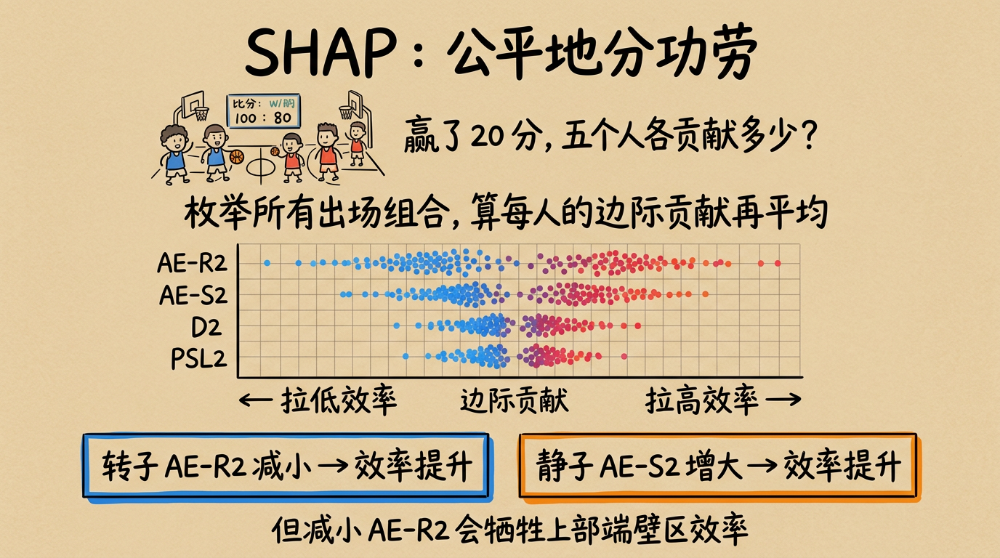

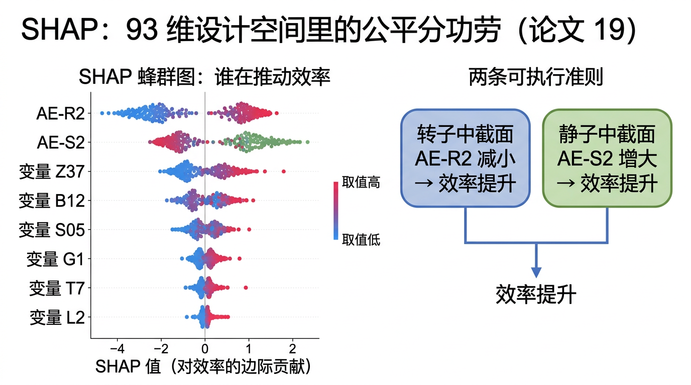

> 上图是本讲全部数学的「一张图版本」：**左图**是 SHAP 蜂群图——每行一个设计变量，点的颜色代表该变量取值高低，横轴是它对效率的边际贡献（SHAP 值），93 维空间里谁在推动效率一眼可见（机制示意，非论文原图）；**右图**是原文据此给出的两条可执行准则——转子中截面有效出口角 AE-R2 **减小**提效率、静子中截面 AE-S2 **增大**提效率［原文 P19］。

##### 3B. 本讲符号卡（建议截图留存）

| 符号 | 人话 | 备注 |
| :--- | :--- | :--- |
| φ_i | SHAP值 |  |
| 准则 | 可执行句 |  |
| 93维 | 设计变量 |  |

> 🧭 先认符号再读公式；主文核心式有「回译」，装不下的细节仍在正文完整保留（不删知识）。

##### 3C. 主路径公式与推导（知识全保留）

**第一步：SHAP 的思想——公平的"分功劳"**

一场篮球赛赢了 20 分，五个球员各自贡献多少？

朴素算法会看"谁在场时球队得分高"，但这有偏——因为球员是**组合**出场的。合作博弈论给出的公平分配方案叫 **Shapley 值**，做法是：

> 枚举**所有可能的出场组合**，计算某球员加入每个组合时带来的**边际贡献**，再对所有组合做加权平均。

把"球员"换成"设计变量"、"比赛得分"换成"模型预测值"，就是 **SHAP（SHapley Additive exPlanations）**。

**第二步：SHAP 的严格定义**
**〔式〕** φᵢ = ∑_S⊆N∖{i}(|S|! (M-|S|-1)!)/(M!)[f_x(S∪{i})-f_x(S)]

**回译：** 上式是主路径构件——先记住它在算法里负责哪一步，再抠每一个符号。

- N=1,2,…,M：全部特征的下标集，M 为特征总数；
- S：不含特征 i 的任意子集；
- fx(Scupi)-fx(S)：**特征 i 在子集 S 下的边际贡献**；
- 前面的阶乘系数：对所有子集大小做**公平加权**。

**第三步：SHAP 的可加性（这是它最实用的性质）**
**〔式〕** yᵢ = y_base + f(xᵢ1) + f(xᵢ2) + ⋯ + f(x_ik)

其中 y_base 通常是全体样本目标变量的**均值**（"平均水平"）。

- f(xᵢj)>0：该特征**推高**了预测值（对效率是正面作用）；
- f(xᵢj)<0：该特征**拉低**了预测值。

**这个性质意味着什么？** 意味着你可以把任意一次预测**精确地拆成"各个变量贡献了多少"的账本**——而且账目必须配平。这对工程师来说极其直观。

**第四步：为什么用 XGBoost 当被解释的模型？**

SHAP 需要一个"被解释的模型"。本文用 **XGBoost**：
**〔式〕** ŷᵢ^(t) = ŷᵢ^(t-1) + fₜ(xᵢ), Obj = ∑ᵢ l(yᵢ, ŷᵢ) + ∑ₖΩ(fₖ)

- 串行集成决策树，每轮拟合上一轮的**残差**；
- 目标函数 = **损失函数 + 正则项**（防过拟合）；
- 树模型天然支持高效的 SHAP 精确计算（TreeSHAP）。

本文 XGBoost 的精度：交叉验证 **RMSE = 0.0290%**，**相对误差 = 0.0274%**［§4.2］。

**第五步：本文的方法论创新——把 SHAP 从 0 维推到 1 维和 2 维**

这是本讲最值得记住的贡献：

| 层次 | 数据形态 | 能回答的问题 |
| :--- | :--- | :--- |
| **0 维** | 标量输出（级效率） | 哪些变量重要？**调大还是调小好**？ |
| **1 维** | 展向性能分布 | 这些变量影响**叶高的哪一段**？ |
| **2 维** | 子午面物理场云图 | 影响的**物理机制**是什么？ |
| 局部 | 典型样本归因 | 在这个具体设计里，各变量**贡献了多少**？ |

> 💡 传统敏感性分析止步于第 0 维。本文把它推进到"**定位到叶高位置**"和"**看到流场机制**"，这才是能指导设计的知识。

---

#### 4. 算法控制流


> **指读：** 超时未写出准则卡 = 归因项目失败。


> **指读：** 目标/区间/禁止同时极端/检查方式——规范员只收这种卡片。

> 🧭 **值班手册：** 先看「什么情况下走哪条分支」，公式是对白速记不是主角。

```

① 93 维参数化（静子 45+3，转子 45），LHS 采样，变量归一化到 (0,1)，0.5 = 基准
② NUMECA + S-A 湍流模型做 CFD，记录级效率 η 与流量 ṁ
③ 筛选：只保留流量偏离 ≤ ±1% 的样本
      1000 个 LHS 样本  →  352 个合格样本
④ 用 XGBoost 建效率代理模型（RMSE 0.0290%）
⑤ SHAP explainer 计算每个变量的 SHAP 值
⑥ 0 维：画 SHAP 条形图 → 识别显著变量
⑦ 1 维：画展向 SHAP 分布图 → 定位受影响的叶高区间
⑧ 2 维：画子午面物理场云图 → 解释物理机制
⑨ 局部：挑典型样本做归因分析
⑩ 总结设计准则 → 落到新设计 → CFD 验证

```

> **一句话记住：** SHAP分贡献到变量；进阶：目标是可执行准则。

**主比喻回扣：** 把上面的分支再翻译成「神菜却说不清配方——写不进规范」——若某步在生活里说不通，多半是符号没对齐。

**从蜂群到手册的流水线：**  
SHAP 出贡献 → 工艺划掉不可做 → 写成 ≤3 条准则卡 → 规范组验收可检查性。  
停在蜂群图 = 翻译做到一半。

**准则卡流水线 SLA：**  
T+0 出蜂群；T+1 工艺划红；T+2 写成区间与检查方式；T+3 规范组验收。  
超时未写出句子 = 归因项目失败，即使 SHAP 图很美。

---

#### 5. 实验验证与量化突破

**先报胜负：** 先读结论句与最大那一格，再读全表；表是证据架不是背诵清单。

**研究对象**：GE-E3 高压涡轮**第一级**——静子 46 片、转子 76 片，转子叶尖间隙 0.3 mm。

**数值方法**［§3.1］：NUMECA 做网格与气动仿真，**Spalart–Allmaras** 湍流模型；进口总温 **719 K**、进口总压 **344.74 kPa**、出口静压 **139.473 kPa**、转速 **8279 r/min**；网格无关性研究表明网格超过约 **150 万**时效率与压比趋于稳定，最终选用约 **200 万**节点的结构网格；静子表面等熵马赫数分布与文献实验数据吻合良好。

**评价对象**：总对总效率
**〔式〕** η = (1-T*₂/T*₀)/(1-(P*₂/P*₀)^(k-1)/k)

同时监测流量变化，以保证涡轮级在设计点附近工作。

**① 显著变量识别（对级效率）**［§4.2］

| 排名 | 变量 | 含义 |
| :---: | :--- | :--- |
| **1** | **AE** | 叶片**有效出口角**，AE=arcsin(o/t)（o 为喉部直径、t 为栅距） |
| **2** | **D** | 静子**三维积叠参数**（周向中偏移 / 周向尖偏移 / 轴向尖偏移） |
| **3** | **PSL2** | 吸力面前缘附近的**样条控制点 2** |

补充发现：在静子与转子的 6 个截面中，**转子中截面 R2 与静子中截面 S2** 的影响程度高于其他截面。

**② 三条挖出来的设计准则**［§5 结论(1)–(3)］

**准则一（有效出口角 AE）**：
- **转子中截面（AE-R2）减小有效出口角 → 提升效率**；
- **静子中截面（AE-S2）增大有效出口角 → 提升效率**；
- 二者**配合**使用可在提升效率的同时**限制流量变化**。
- 1 维 SHAP 可视化进一步显示：减小 AE-R2 能提升**中段叶高**的效率，但会**牺牲上部端壁区**的效率——这是一个典型的**权衡**，而 0 维分析看不到这一点。

**准则二（静子三维积叠 D）**：
- 叶尖处**向压力侧**偏移 → 提升**叶尖**效率；
- 中截面处同样**向压力侧**偏移 → 提升**中段**效率；
- 两者共同形成**正倾斜（positively leaned）叶片**，有助于**减小静子叶道内的径向压力梯度**，从而提升涡轮效率。

**准则三（吸力面前缘样条控制点 PSL2）**：
- 把静子与转子中截面**吸力面前缘附近的样条控制点朝"叶片减薄"方向移动**，有利于**降低前缘加速区的压力梯度**，减少不可逆流动损失，从而在**大部分叶高范围**内提升效率。

**③ 最终验证**［§5 结论(4)］

| 指标 | 值 |
| :--- | :--- |
| 最终设计效率 | **91.09%** |
| 相对参考设计提升 | **+0.65%** |
| 与数据集的关系 | **超过数据集中的最大效率值** |

> 📌 **这一点特别关键**：最终设计**不是**数据集里挑出来的最好样本，而是**遵循准则重新设计**出来的，结果**比数据集里最好的还要好**。这说明挖出来的准则具有**外推价值**，而不只是对已有数据的拟合总结。

**体感换算：** 把关键数字换成「工程师的周/月」或「一次签字的风险」——数字才进长期记忆。若原文给了墙钟时间或成本比，优先用原文换算。

**准则卡模板：** 「降损失则优先保证 A 落在…；避免 B 与 C 同时极端。」——可执行、可检查。

---

**诚实：** SHAP 是归因不是因果证明；工程上是优先调查清单。

#### 6. 审稿人批判与承前启后

把软肋放上**可信度刻度**（0=完全不信，5=可当默认工具）：

| 维度 | 打分 | 人话 |
| :--- | :---: | :--- |
| 可解释 | 5 | |
| 转化 | 4 | |
| 稳定 | 3 | |
| 因果 | 2 | |

**可以攻击的点：**

1. **样本量偏小**：93 维设计空间只有 **352 个样本**（约 3.8 个样本/维）。对 XGBoost 建模尚可，但对 SHAP 的**高阶交互**估计与结论泛化都有风险。
2. **筛选引入了选择偏差**：1000 → 352 的筛选条件是"流量偏离 ≤ ±1%"。这意味着**所有结论只在这条流量约束带内成立**，不能外推到流量偏离超出 ±1% 的工况。
3. **SHAP 解释的是 XGBoost，不是真实 CFD**。虽然 XGBoost 交叉验证 RMSE 仅 0.0290%，但解释的可靠性上界**就是代理模型的精度**；在 93 维、352 样本的条件下，代理模型在样本稀疏区域可能失真，而 SHAP 无法自证。
4. **相关性 ≠ 因果性**。SHAP 给的是"在该数据集上、该模型内的贡献归因"，**不是物理因果**。三条准则的物理机制解释（径向压力梯度、前缘加速区）是作者的**后验解读**，需要独立的机理验证。
5. **未与 Sobol 指数、主动子空间做定量对比**，只在引言中引用了他人的对比结论。
6. **版本状态**：Journal Pre-proofs，无卷期页码，且日期记载存在两处不一致。
［原文 P19 正文，数值由原文给出］

**承前：**
- **论文 11（DA-EGO）**：用 PCE/ANOVA 做变量交互分析，但那是**为子空间分解服务**的副产品；本文把"变量重要性"本身作为研究目标。
- **论文 18（P-ResUNet）**：用 ANOVA 圈定优化空间；本文用 SHAP，且能额外给出**影响的方向性**与**空间定位**。

**本文的独特价值**：前面十二讲都在问"**怎么找到最优解**"，本文问的是"**最优解为什么好**"——把优化留下的数据变成**可读的设计知识**。

**启后：**
- SHAP 框架可推广到多学科设计空间（原文结论明确提及）；
- 最自然的下一步是**闭环**：用 SHAP 挖出的准则**缩小设计空间**（例如把 PSL2、AE-S2 的变化范围收紧），再交给 DA-EGO / GSDE 去搜索。这样"知识发现"与"智能优化"就从两个独立环节变成一条流水线。

---

**读蜂群的纪律：**  
颜色是特征值高低，不是「好/坏」道德色。  
左右是贡献方向，依赖问题定义（最大/最小）。  
任何写入手册的句子，必须可被质检员用卡尺或图纸检查。

**可信度使用：**  
可解释 5 分 = 能开会；因果 2 分 = 不能当物理定律写进教材。  
准则卡要通过工艺与强度，不通过 = 归因项目未完成。

---

#### 附：从蜂群图到准则卡的三步

1. **看方向：** 点群偏右=该变量增大常推高目标（或反之，看问题定义）。  
2. **看颜色：** 颜色=特征值大小，用于「高值时贡献是否更毒」。  
3. **写句子：** 把「变量 #47 敏感」改成「叶中安装角避免与端弯同时取上界」。

**反派冠军无配方的会议室版：**  
「优化结果已出，请写入设计规范。」——若只能附一张外形图，规范组会退回。SHAP 是退回意见的技术回答。

---

#### 附：准则卡印刷厂

**不合格：** 「变量 47 很重要。」  
**合格：** 「叶中截面安装角 θ_mid 避免与端弯 δ_ew 同时取上界；优先将 θ_mid 保持在［θ_a, θ_b］（由 SHAP 蜂群与约束共同划定）。」

**从蜂群到句子的强制步骤：** 方向 → 颜色（高低特征值）→ 可执行区间 → 可检查方式（图纸/测量）。

---

#### 附：93 维会议室剧本（10 分钟）

**角色：** 优化工程师、设计规范员、强度/工艺代表。

1. 优化工程师出示冠军外形 + SHAP 蜂群。  
2. 规范员问：「哪一句能写进手册？」——禁止只回答变量编号。  
3. 工艺代表划掉不可制造的敏感方向。  
4. 输出：**≤3 条可执行准则卡** + 「优先调查清单」（非因果证明）。

**反派台词：** 「优化结束了，外形发给下游吧。」  
**英雄台词：** 「先把贡献写成可检查区间，再发图。」

---

#### 附：不合格 → 合格 对照

不合格：「变量 47 重要。」  
合格：「叶中安装角 θ_mid 避免与端弯同时取上界；θ_mid 优先落在［θ_a,θ_b］，图纸检查项第 X 条。」

---

#### 附：SHAP 项目的反模式清单

- 把蜂群截图当最终交付。  
- 用「显著」等词不写区间（本讲禁止空套话）。  
- 忽略工艺/强度划红，强行写激进准则。  
- 把相关当因果，向下一代设计硬推。  
- Top 贡献变量超过 10 个还不肯收敛成 ≤3 条句子。

正确交付物：**准则卡 PDF + 蜂群附录 + 划红记录。**

---

**准则卡印刷验收：** 每张卡必须有检查方式（图纸项/测量项）。没有检查方式的句子，规范组有权退回重写。

---

#### 附：跨组会 15 分钟沙漏

0–5 min 蜂群 Top；5–10 min 工艺/强度划红；10–15 min 写出 ≤3 句。  
超时未完成句子，下次会不得展示新外形。

---

#### 图卡：冠军无配方 → 准则卡

优化交出的冠军叶型若锁在 93 维黑箱里，等于无配方。SHAP 蜂群把方向与颜色写成三条可执行设计句，15 分钟跨组会能念完。

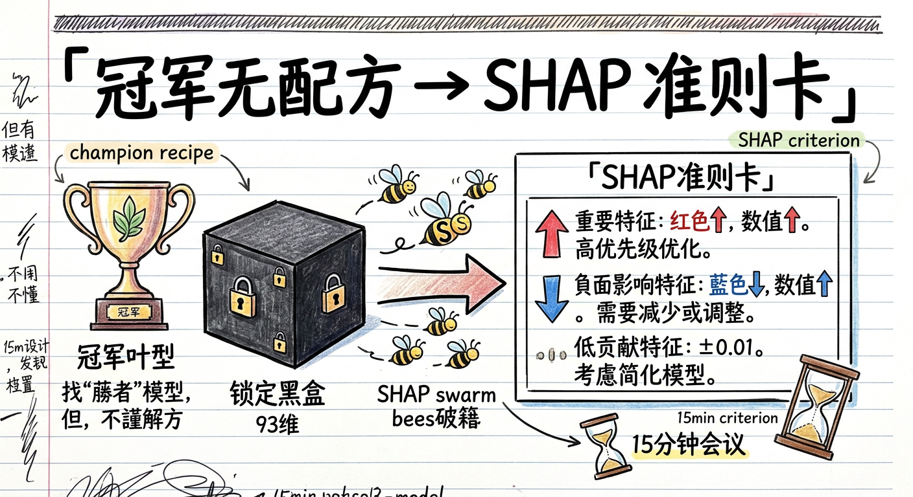

---

#### 图卡：不合格 → 合格准则句

「这个变量挺重要」是不合格句；合格句必须带方向与动作（如尾缘半径↑→损失↓，工艺钉死）。跨组会只收合格句。


---

#### 图卡：SHAP 反模式清单

只贴蜂群不写句、相关当因果、93 维讲完才散会、无红线变量——四条任一中招，跨组会失败。正答是 15 分钟沙漏 → 三条可执行句。


---

#### 章末：30 秒复述 · 自测 · 元数据

**30 秒复述稿（可朗读）：** 赢了却说不清为什么，等于没赢。SHAP 把 93 维贡献摊开，再压成可打印准则卡。它是归因与调查清单，不是因果证明。反派是冠军无配方。

**自测（先做再对答案）：**

1. 归因vs准则？
2. 蜂群怎么读？
3. 最敏感必改？

<details>
<summary>点开看参考答案</summary>

1. 分数vs可执行建议。
2. 横轴贡献色=特征。
3. 还看可制造。

</details>

> **本讲元数据**（读完再看，不挡故事）
> | 项 | 值 |
> | :--- | :--- |
> | 规范编号 | **19** |
> | 原始文献 | *Chinese Journal of Aeronautics*（**Journal Pre-proofs**，2026） |
> | DOI | `10.1016/j.cja.2026.104374` ｜ PII `S1000-9361(26)00312-2` |
> | 作者 | Zhao Yang, Yunjia Yao（太行实验室）, Liming Song, Zhendong Guo（通讯） |
> | 本地原文 | `1-s2.0-S1000936126003122-main.pdf` |
> | 证据等级 | **A（本地原文逐句可查）** |
> | ⚠️ 状态 | 预排版版本，**暂无卷期页码**；收稿/修回/录用日期在封面页与首页记载不一致（待正式版确认） |
> | 反派绰号 | 冠军无配方 |
> | 主比喻 | 冠军厨师被记者追问配方 |

---

<a id="lec-14" name="lec-14"></a>
### 【第14讲】从流体到结构：给叶片建一个"流固耦合数字孪生"（**论文 15**）

#### 本讲开场 90 秒

**上讲闪回：** 几何刚体假设破产：一弯，气动边界跟着变。

**本讲反派：** 「刚体幻想」

**只要带走 3 句口诀：**

1. **FSI双向**
2. **POD是变形姿势词典**
3. **GPR+GNN分工**

**主比喻：** 船桨会弯——弯了攻角间隙全变

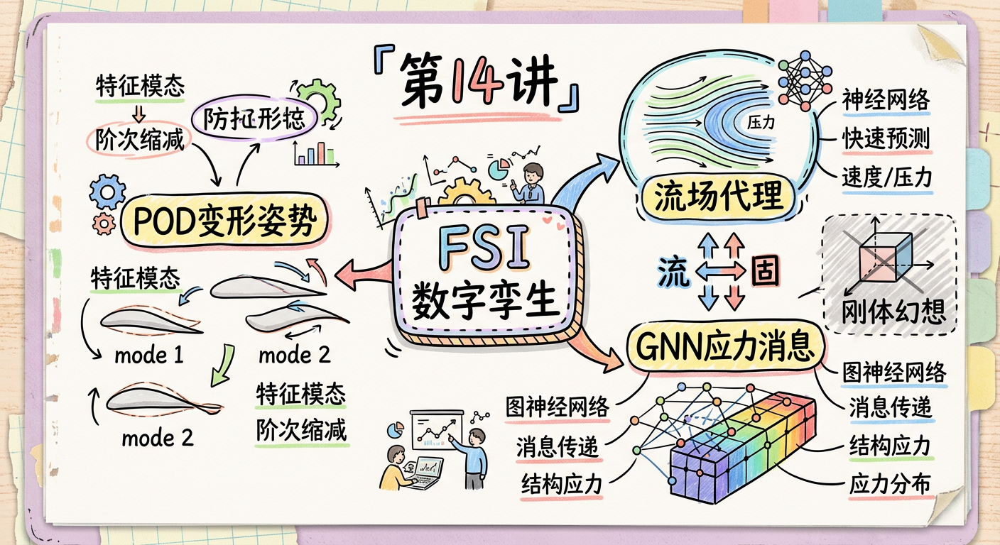

> **看图三秒：** POD / 流场 / GNN；流↔固双向。

**本讲赌注：** 当刚体签字的叶片，可能在台架上以弯曲的方式打脸。

---

#### 1. 生活与物理直觉引子：桨叶在水里，是会"弯"的

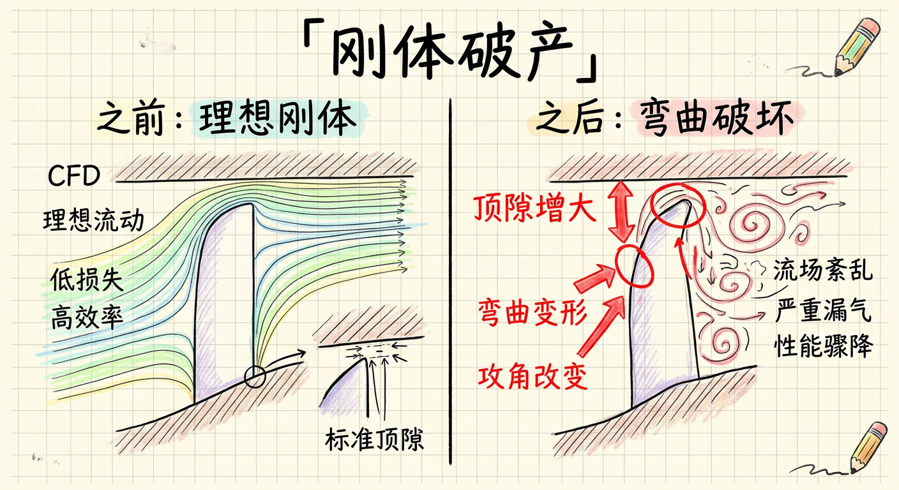

> **指读：** 弯后攻角与间隙变，原压力场作废。

前面所有讲次，我们都默认叶片是**刚体**——几何画成什么样，流场就按那个形状算。

但真实世界里，叶片在高速旋转、承受巨大气动力/水动力时**会变形**。变形之后，流场变了；流场变了，受力又变了……这是一个**双向耦合**的过程，工程上叫**流固耦合（Fluid-Structure Interaction, FSI）**。

生活里也有同样的现象：

> 船桨划水时桨叶会弯曲；风力发电机的叶片在强风下会明显扭摆；飞机机翼在机动时翼尖会上下摆动几米。

泵喷推进器的叶片尤其麻烦：它在水里高速旋转，**水动力载荷**让叶片变形，变形又反过来改变水动力，同时叶片内部还产生**应力集中**——应力过大，叶片会疲劳断裂。

于是设计目标变成**两头都要**：

1. **效率高**（流体性能好）；
2. **应力小**（结构安全可靠）。

而且这两者往往是**冲突**的——把叶片做得更薄更快，效率上去，应力也上去了。

**刚体假设破产现场：**  
转速上去，叶片一弯，攻角和间隙都变；力又变，弯再变。  
数字孪生要同时请三位代理：一个报效率，一个报变形姿势（POD），一个报应力场（GNN）。

**破产宣告：** 柔性一弯，全场边界条件改写。

> **先猜后揭：** 若本讲反派「刚体幻想」赢了，你的下一笔 CFD/实验预算会怎样被浪费？揭晓贯穿 §3–§5。

| 生活元素 | 工程元素 | 符号 |
| :--- | :--- | :--- |
| 主比喻侧 | 流固耦合 | FSI |
| 主比喻侧 | 变形字典 | POD |
| 主比喻侧 | 应力消息 | GNN |

**破产典礼：** 假设叶片不动得到压力场 → 其实弯了 → 攻角与间隙全变 → 场作废。FSI 是诚实项，不是加分项。

**刚体幻想的实验室演示：**  
同一叶片，刚体 CFD 漂亮；松开结构自由度后，弯了的叶尖间隙与攻角全变，压力场改写。  
FSI 不是「加分项仿真」，是避免签字后在台架上才发现弯的诚实项。

**破产典礼完整流程：**  
1. 刚体 CFD：压力场漂亮，效率可报。  
2. 结构松开：离心+气动载荷 → 叶片弯。  
3. 弯后：攻角、叶尖间隙、喉道面积全变。  
4. 原压力场作废；热与强度可能同时告急。  

FSI 数字孪生要回答的不是「能不能耦合」，而是「在设计周期内耦合是否算得完」。  
POD 把变形收成少数姿势；代理让流与应力在环上便宜转。

---

#### 2. 叶轮机械中的真实工程死穴：两套仿真，两份昂贵

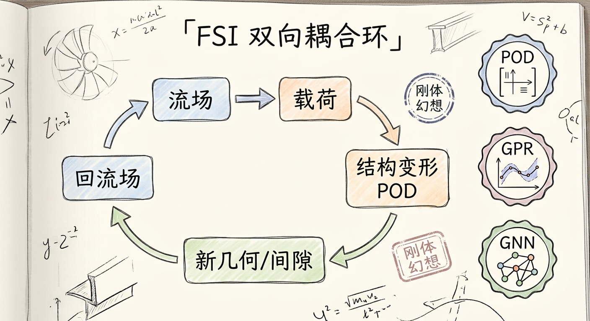

> **指读：** 刚体假设在弯后破产；POD/GPR/GNN 是让环在设计周期内转得动。

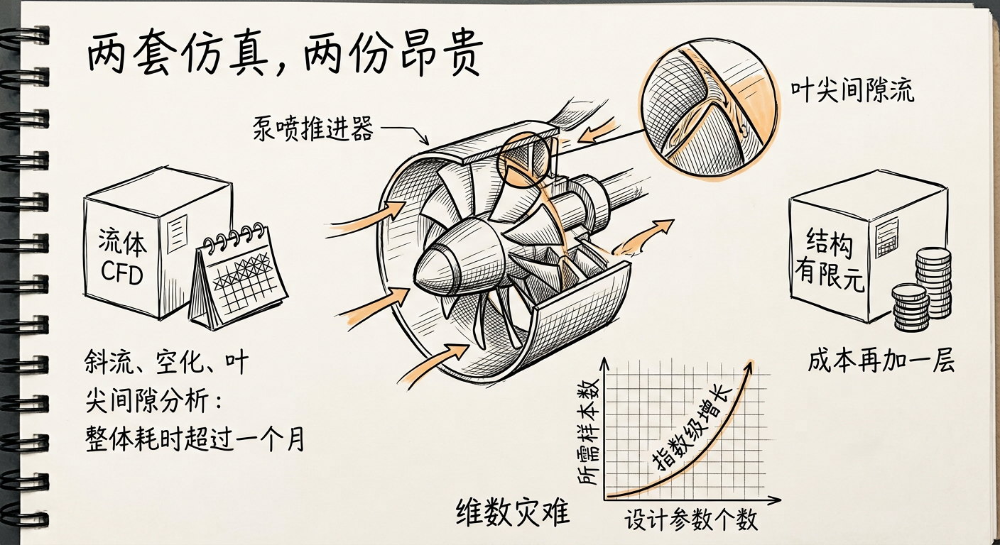

> **指读：** 这张图是本讲工程死穴的一张图版本。

传统的 PJP 设计有多贵？原文在引言中引用了同行的 CFD 分析工作：

> 分析斜流、空化与叶尖间隙流场，**整体计算耗时超过一个月**。［原文 P15 §I］

而这还只是**流体**一侧。加上**结构**一侧的有限元（FEM）分析，成本再加一层。

更麻烦的是**维数灾难**：

> 样本点的数量随着设计参数的增加呈**指数级**增长。［原文 §I］

本文的破局思路，是把前面各讲用过的三件武器**组合起来**，并且第一次把**结构场**也一起拿下：

| 环节 | 用什么 | 替代掉什么 |
| :--- | :--- | :--- |
| 水动力性能（效率） | **GPR** 高斯过程回归 | 替代 CFD |
| 叶片变形后的坐标 | **POD** 本征正交分解 | 把"整个网格"压成几个系数 |
| 叶片应力场 | **StressGNN**（本文提出的图神经网络） | 替代 FEM 结构分析 |

**现场感：** 周五下班前组长要数——你面对的不是可以慢慢推的练习题，而是**算错一次就不可回收**的预算。

**两套仿真两份贵：**  
流要算、固要算，还要耦合迭代。  
降阶（POD）与代理（GPR/GNN）不是偷懒，是让 FSI 在设计周期内算得完。

**两套仿真两份贵（加长）：**  
流的网格与时间步是一笔账；固的网格与材料模型是另一笔；耦合迭代是乘数。  
若每次设计改动都跑满阶 FSI，季度预算会在「还没优化」时烧完。  
降阶与多代理不是学术装饰，是让双向耦合活在排期内。

---

#### 3. 数学公式从 0 到 1 推导

先把公式关掉，用主比喻说一遍：

> **船桨会弯——弯了攻角间隙全变**  
> 本讲反派是「刚体幻想」。下面公式是这句话的展开；每条核心式尽量带**回译**。知识总量不删——深潜只是阅读路径，不是垃圾桶。

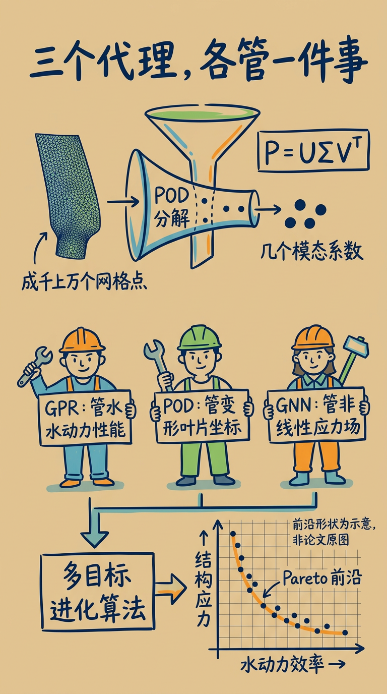

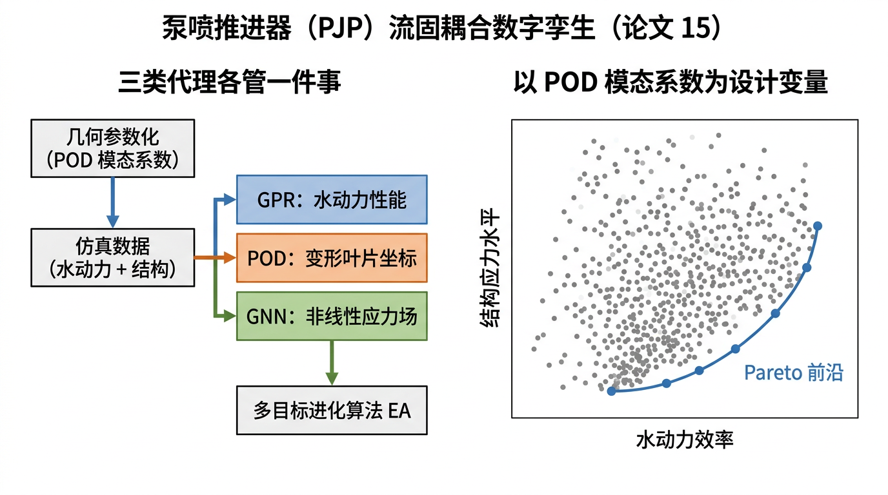

> 上图是本讲全部框架的「一张图版本」：**左图**是数字孪生的分工——几何参数化（以 POD 模态系数为设计变量）生成仿真数据后，三个代理各管一件事：GPR 管水动力性能、POD 管变形叶片坐标、GNN 管非线性应力场，最后交给多目标进化算法［原文 P15］；**右图**是多目标优化的产物——水动力效率与结构应力水平之间的 **Pareto 前沿**（前沿形状为示意，非论文原图）。

##### 3B. 本讲符号卡（建议截图留存）

| 符号 | 人话 | 备注 |
| :--- | :--- | :--- |
| FSI | 流固耦合 |  |
| POD | 变形字典 |  |
| GNN | 应力消息 |  |

> 🧭 先认符号再读公式；主文核心式有「回译」，装不下的细节仍在正文完整保留（不删知识）。

##### 3C. 主路径公式与推导（知识全保留）

**第一步：POD——把"成千上万个网格点"压缩成"几个系数"**

设 P = {P_m ∈ ℝ^{N_v}} 是不同参数下仿真得到的物理场矩阵（N_v 是网格节点数）。做奇异值分解：
**〔式〕** P = UΣ Vᵀ

**回译：** 上式是主路径构件——先记住它在算法里负责哪一步，再抠每一个符号。

其中 Σ = diag(√λ₁, √λ₂, …)，V 是 P^T P 的特征向量。于是可以定义 **POD 模态**：
**〔式〕** uⱼ = (1)/(√(λⱼ))P vⱼ, αⱼ = uⱼᵀP

各模态对原场的贡献由**特征值占比**度量：Eᵢ=lambdaᵢ/∑lambdaᵢ。取前 k 阶截断：
**〔式〕** P̃ₘ ≈ ∑_{j=1}^{k}α̃^(m)ⱼ vⱼ

> **一句话理解**：POD 找出"变形的主要模式"——叶片变形千变万化，但本质上可能只有三五种"基本变形姿势"，剩下的是这些姿势的线性组合。

**第二步：本文的关键设计——拿 POD 系数当优化变量**

传统做法是拿 B 样条控制点 P^p_1, P^c_1 当设计变量。本文改为拿**POD 模态系数 α_x, α_y, α_z（k=3）**当设计变量。

为什么？原文的发现很有意思：

> **α 的可行域比 P₁ 大得多**，因此整条 Pareto 前沿向左下方移动（即更优）。［原文 §III-C，Fig. 8］

**第三步：POD-GPR——用高斯过程预测效率**

**〔式〕** f(α_X)∼𝒢𝒫(m(α_X), K(α_X, α_X'))

RBF 核；通过**最大化边际似然**优化超参。完整链条（含应力场）：
**〔式〕** αₓ, α_y, α_z=POD^Eₓ(x), POD^E_y(y), POD^E_z(z)

**〔式〕** α_σ = POD^E_σ(σ), ᾱ_σ = GP(αₓ, α_y, α_z), σ̄ = POD^D_σ(ᾱ_σ)

**第四步：StressGNN——本文提出的图神经网络**

为什么应力场要用 GNN，而不是继续用 GPR？

因为应力场是**定义在非结构/结构化网格上的场量**，节点之间有拓扑关系；而 GPR 只擅长"输入向量 → 输出标量"。GNN 天然处理"图 → 图"的映射。

- **图表示**：节点 V ∈ ℝ^{N_v}；边特征 e_ij ∈ ℝ^{N_e×4}（相对位移及其模）；邻接矩阵由六面体网格单元定义：
**〔式〕** A_ij=1[e_ij ∈ E] (边存在取 1，否则取 0)

- **输入图** G_x = {V, A, E, X}（X 为节点坐标）；**输出图** G_y = {V, A, S, Y}（Y 为节点变形，S 为单元内嵌应力）。
- **网络结构**：编码器 → 处理器 → 解码器
**〔式〕** xᵢ' = F_X(x_i), e_ij' = F_E(e_ij)

**〔式〕** e_ij'' = F_M([x_i', x_j', e_ij'])

 即：节点/边编码到高维隐空间 → **消息传递 F_M** 更新边特征 → **聚合 F_A** → 解码回节点变形与边应力。
- **损失函数同时约束节点变形与边应力**：
**〔式〕** ℒ_B=(1)/(N_B^V)∑_i ∈ V^B(y_i-ŷ_i)² + (1)/(N_B^E)∑_i, j ∈ V^B(s_ij-ŝ_ij)²

**训练设置**：PyTorch + PyTorch Geometric；**NVIDIA A6000 RTX**；Adam，**500 epochs**；超参 **B=64, F=128, L=10, Q=128**（经搜索）。

---

#### 4. 算法控制流

> 🧭 **值班手册：** 先看「什么情况下走哪条分支」，公式是对白速记不是主角。

```

① 几何参数化：转子 50% 展向截面，螺距角 p 与弦长 c 沿径向由 3 个控制点的
   二次 B 样条定义
② 生成 36 个初始算例：CFD（ANSYS CFX）求 η，FSI（ABAQUS）求变形与应力
③ POD：把叶片变形坐标场压成模态系数 αx, αy, αz
④ GPR：以 αX 为输入，建立 η 的快速预测模型（POD-GP）
⑤ StressGNN：以节点坐标为输入，直接预测变形与应力场
⑥ NSGA-II（种群 100、每代 10 子代）以 POD 模态系数为设计变量做多目标优化
   目标：max η 与 min σMax
⑦ Pareto 解集上的代表方案送回 CFD / FSI 复核

```

> **一句话记住：** FSI双向；进阶：POD是变形姿势词典。

**主比喻回扣：** 把上面的分支再翻译成「船桨会弯——弯了攻角间隙全变」——若某步在生活里说不通，多半是符号没对齐。

**三代理合唱：** 懂流场者、懂 POD 姿势者、在网格上传应力者。单一大网常什么都学不稳。

**三代理排班表：**  
| 代理 | 负责 | 不负责 |
| POD | 变形姿势词典 | 局部应力奇异细节 |
| 流场代理 | 弯后的气动响应 | 材料本构 |
| GNN | 网格上应力消息 | 替代实验标定 |
合唱要有指挥（耦合迭代）；一个大网包打常跑调。

**三代理排班（可打印）：**  

| 班次 | 代理 | 输入 | 输出 | 交接 |
| :--- | :--- | :--- | :--- | :--- |
| 白班 | 流场代理 | 几何/边界 | 压力/载荷 | 交给结构 |
| 中班 | POD 变形 | 载荷模态 | 位移/新几何 | 更新间隙/攻角 |
| 夜班 | GNN 应力 | 网格+载荷 | 应力场 | 强度约束 |

指挥是耦合迭代：不收敛不准报 Pareto 冠军。

---

#### 5. 实验验证与量化突破

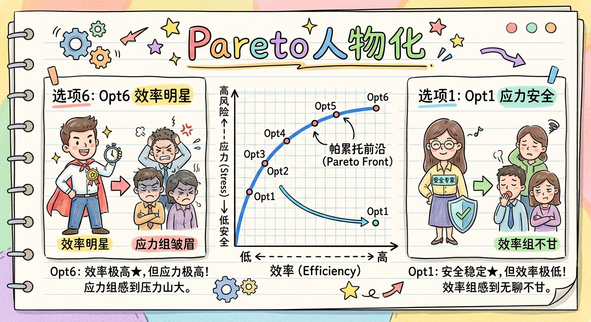

> **指读：** Opt6 与 Opt1 不是对错，是签字会要同时在场的两个角色。

**先报胜负：** 先读结论句与最大那一格，再读全表；表是证据架不是背诵清单。

**研究对象**：13 片静子 + 9 片转子；转子直径 177.14 mm；70% 半径处弦长 = 24% 直径；螺距比 1.10；转速 1200 rad/min［原文 P15 §2 泵喷几何参数表，详见 `corpus/facts/P15.md` §三］。

**求解设置**［§II］：NUMECA AutoGrid5 六面体网格（静子域 **610 万**、转子域 **480 万**单元），Ansys ICEM 划分开放水域 **900 万**单元；ANSYS CFX 求解全三维定常 N-S，**RNG k-ε** 湍流模型，SIMPLE 解耦，残差 < 0.0001；进速系数 J=0.7。结构侧用 ANSYS ICEM + **ABAQUS**，叶根全约束，材料为**双相不锈钢**。

**CFD 可信度验证**［原文 P15 Table II］：与敞水实验对比，K_T 相对误差 **0.301%**、10K_Q 误差 **1.352%**、效率 η 误差 **1.600%**（均 < 2%）；参数化后的几何误差 < 1.5%。

**① StressGNN 到底准不准？**［Table V，预测 σ_Max 的相对误差 %］

| 方法 | Case 0 | Case 10 | Case 25 | Case 35 |
| :--- | :---: | :---: | :---: | :---: |
| GPR | 3.140 | 7.666 | 4.555 | 2.349 |
| POD-GP | 0.000 | 4.757 | 4.979 | 7.669 |
| **StressGNN** | 1.178 | **0.312** | **0.330** | **0.938** |

（FSI 真值：1.540e6 / 1.543e6 / 1.518e6 / 1.647e6）

**② 整体应力场质量**［Table VI，PSNR / SSIM］

| Case | POD-GPR | **StressGNN** |
| :--- | :---: | :---: |
| 0 | 40.844 dB / 0.9919 | **47.898 dB / 0.9969** |
| 10 | 39.344 / 0.9937 | **46.307 / 0.9967** |
| 25 | 40.684 / 0.9951 | **44.798 / 0.9963** |
| 35 | 35.596 / 0.9869 | **46.997 / 0.9972** |

> **StressGNN 在全部 4 个算例上均优于 POD-GPR。**

**③ 计算成本**［Table VII］

| 模型 | 训练时间 | 推理时间 |
| :--- | :---: | :---: |
| CFX（流体） | – | **27,579.39 s**（约 7.7 小时） |
| ABAQUS（结构；原文 Table VII 拼作 "ABAQUES"） | – | **1,022.35 s**（约 17 分钟） |
| **StressGNN** | **133.86 s** | **85.04 s**（模型仅 6.27 MB） |

> 📌 **"300 倍加速"要分口径看**：原文称 StressGNN"训练完成后可实现 300 倍加速"［原文 P15 Table VII］。按下表验算［倍数由本讲按表计算］——
> - 以 **CFX 的 27,579 s** 为基准：27579/85 ≈ 324 **倍**，与原文的"300 倍"吻合；
> - 以**结构求解 ABAQUS 的 1,022 s** 为基准（原文表内拼作 "ABAQUES"）：仅约 **12 倍**。
>
> 所以**这 300 倍是针对 CFD 环节而言的**。讲的时候必须说清基准，否则会被误导。

**④ 多目标优化结果**［原文 P15 Table VIII，Pareto 解集的 6 个代表方案］

| 方案 | η（POD-GP / CFD） | η 相对基准 | σ_Max（StressGNN / FSI） | σ_Max 相对基准 |
| :--- | :---: | :---: | :---: | :---: |
| Opt1 | 0.6810 / 0.6802 | −0.10% / −0.22% | 1.3901E+06 / 1.4580E+06 | **−10.67% / −6.31%** |
| Opt3 | 0.6827 / 0.6826 | +0.15% / +0.13% | 1.6591E+06 / 1.6500E+06 | +6.61% / +6.03% |
| **Opt6** | **0.6833 / 0.6843** | **+0.23% / +0.36%** | 1.6529E+06 / 1.6500E+06 | +6.22% / +6.03% |

**两个核心结论：**

1. **η 与 σ_Max 确实相互冲突**（Pareto 前沿证实）：效率最高的 **Opt6** 效率 +0.365%（CFD 复核），但应力上升约 6%；应力最低的 **Opt1** 应力降 **6.31%**（FSI 复核），效率却略降。
2. 原文结论原话：**"初始样本点的最大效率提升仅为 0.136%，而本文优化得到的提升为 0.365%。"** 也就是说，**在初始采样点里"碰运气"最多只能碰出 0.136% 的提升，而基于模型的优化把它翻了近三倍**，同时还扩大了可行域。［以上数值均出自原文 P15 结论与 Table VIII］

**优化器设置**：NSGA-II（Pymoo），**种群 100、每代 10 个子代**；SBX 交叉（概率 0.9、分布指数 15）；多项式变异（指数 20）；开启去重。同时对比了 **NSGA-III** 与 **KGB-DMOEA**。

**体感换算：** 把关键数字换成「工程师的周/月」或「一次签字的风险」——数字才进长期记忆。若原文给了墙钟时间或成本比，优先用原文换算。

**Pareto 人物化：** Opt6 效率明星、应力组皱眉；Opt1 安全、效率组不甘。签字会是多目标物理。

---

**孪生地板：** 至少双向耦合 + 可更新代理；不是单次 CFD 截图。

#### 6. 审稿人批判与承前启后

把软肋放上**可信度刻度**（0=完全不信，5=可当默认工具）：

| 维度 | 打分 | 人话 |
| :--- | :---: | :--- |
| 真实 | 5 | |
| 多代理 | 4 | |
| Pareto | 4 | |
| 算力 | 2 | |

**可以攻击的点：**

1. **原文存在一处与数据矛盾的表述（必须指出）**。§III-C 写道"**只有 GPR 在所有算例中都表现出持续更低的相对误差**"，但 **Table V 的数据恰恰相反**——StressGNN 在 Case 10/25/35 三个算例中误差最低（0.312 / 0.330 / 0.938），远优于 GPR 的 7.666 / 4.555 / 2.349。**这句话很可能是笔误（把 StressGNN 写成了 GPR）**，原文紧接着那句"StressGNN 表现出更低误差"才与数据一致。**本讲以 Table V 数据为准。**
2. **样本量很小**：只有 **36 个**初始算例，却要同时训练 GPR、StressGNN 并支撑多目标优化，统计可靠性有限。
3. **代理模型与真值存在系统性偏差，且在收益量级上"同量级"**。Table VIII 中 η 的预测值与 CFD 复核值在 Opt1/Opt2/Opt4/Opt5 上**符号都不一致**（例如 Opt2：预测 +0.0147%，CFD 复核 −0.0587%）。当优化收益只有 0.1% 量级时，**代理模型误差与收益同量级，排序并不可靠**——这是一个必须警惕的信号。
4. **"300 倍加速"的口径问题**，见上文。
5. **POD 是线性降阶**，对强非线性变形的表征能力有限。
6. **未与燃气轮机领域的方法做对比**——本文完全在独立的水下推进器语境中展开。
［原文 P15 Table V 与 Table VIII，数值由原文给出］

   ［以上第 1–6 点均基于原文 P15 报告的方法设置与结果所作的合理质疑；其中 Table V 的误差数据与原文 §III-C 的文字表述相矛盾，本讲以 Table V 为准］

**承前：**
- 继承 GPR（本全集的代理模型主线，见论文 01/02）、POD 降阶、GNN、多目标进化算法。
- 与**论文 16（TNO）/ 论文 12（SDNO）/ 论文 18（P-ResUNet）**构成呼应：那三篇用深度算子预测**流场**，本文用 GNN 预测**结构应力场**——把"AI 替代昂贵仿真"的思路从**流体侧**扩展到了**结构侧**。
- 与**论文 19（SHAP）**呼应：二者都体现了"优化之后还要挖知识"的意识，本文挖的是"**可行域的形状**"（POD 系数 vs 原始控制点），SHAP 挖的是"**变量归因**"。

**本文在全集中的独特地位**：它是全集中**唯一一篇非燃气轮机应用**的论文，也是**唯一一篇把流固耦合整体纳入数字孪生**的论文。它证明了前面各讲的方法论具备**跨领域迁移能力**——这才是方法论真正的价值所在。

---

**Pareto 签字会剧本：**  
- 气动组推 Opt6：效率好看。  
- 强度组推 Opt1：应力裕度。  
- 项目经理问：设计点外呢？热端呢？  
数字孪生的价值是让这场会基于**同一套可更新代理**，而不是各拿各的单次 CFD 截图对喷。

---

#### 附：刚体幻想检查单

| 检查 | 通过标准 |
| :--- | :--- |
| 变形量 | 关键截面位移是否进入气动敏感区 |
| 间隙 | 叶尖/封严是否随弯变化 |
| 应力 | 热点是否在材料允许带 |
| 更新 | 代理是否在设计迭代中可重训/校准 |

全否或未知 → 禁止「刚体最优」直接进详设。

---

#### 图卡：FSI 三代理分工

流→载→弯→再流的双向环里，GPR 管标量、POD 压场、GNN 管结构图响应。刚体假设一弯即破产，必须三代理协同。

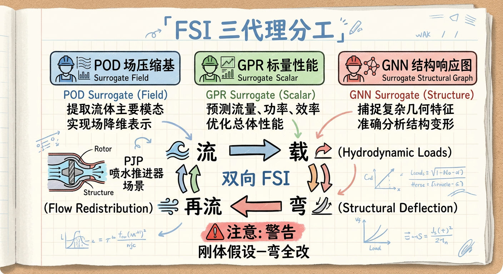

---

#### 图卡：刚体幻想检查单

永不变形？载荷回写几何？边界随弯更新？应力进 Pareto？双向环闭合？任一未勾，刚体幻想未破除。

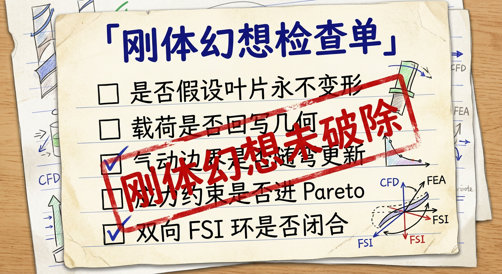

---

#### 图卡：Pareto 选角值班

效率明星与应力安全同台，不能只捧一个。FSI 的 Pareto 是选角，不是选单曲冠军。

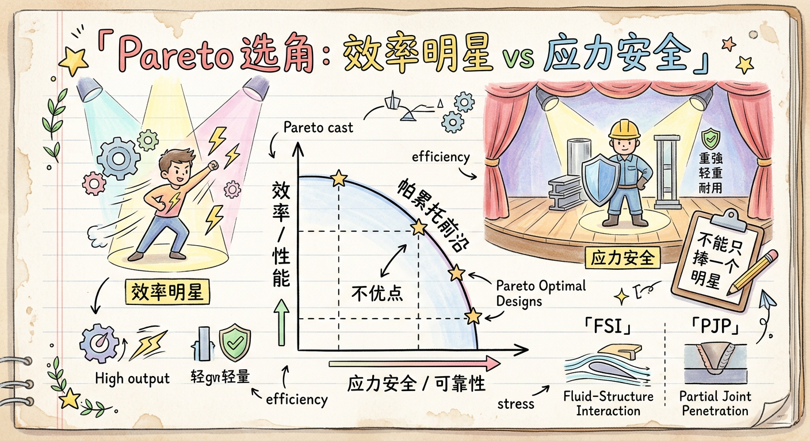

---

#### 章末：30 秒复述 · 自测 · 元数据

**30 秒复述稿（可朗读）：** 刚体幻想在弯后破产。FSI 双向：流让它弯，弯改变流。POD 是变形词典，多代理让耦合在排期内算完。Pareto 上效率明星与应力安全要一起签字。

**自测（先做再对答案）：**

1. 刚体 CFD 在什么环节破产？  
2. POD / 流场代理 / GNN 各守什么？  
3. Pareto 上 Opt6 与 Opt1 教你在签字会说什么？

<details>
<summary>点开看参考答案</summary>

1. 叶片一弯，攻角与间隙变，原压力场作废。  
2. 变形姿势；弯后气动；网格应力消息。  
3. 效率冠军可能是应力输家——多目标同时在场。

</details>

> **本讲元数据**（读完再看，不挡故事）
> | 项 | 值 |
> | :--- | :--- |
> | 规范编号 | **15** |
> | 原始文献 | **2025 IEEE Congress on Evolutionary Computation (CEC)** |
> | DOI | `10.1109/CEC65147.2025.11043110` |
> | 作者 | Yichen Hao, Linsheng Xia, Chao Bian, Zhendong Guo, Xiaofang Wang, Haitao Liu\*（大连理工大学 / 中国舰船研究设计中心 / 西安交通大学） |
> | 本地原文 | `AI-Assisted_Fluid-Structure_Modeling_and.pdf` |
> | 证据等级 | **A（本地原文逐句可查）** |

> ⚠️ **必须先说清楚的一件事**：本文的研究对象是**泵喷推进器（PJP，水下航行器用）**，**不是燃气轮机**。
> 它之所以被收入本全集，是因为**郭振东老师为共同作者**，且整套方法论与前面各讲一脉相承。
> 讲授这一讲的价值在于：**看同一套"AI 替代昂贵仿真"的方法论，能不能跨到一个完全不同的工程领域去。**
> | 反派绰号 | 刚体幻想 |
> | 主比喻 | 船桨在水里会弯 |

---

<a id="lec-15" name="lec-15"></a>
### 【第15讲】子午面全景预测：把"物理"写进 AI 预测模型的最后一块拼图（**论文 20**）

#### 本讲开场 90 秒

**上讲闪回：** 10全景、12叶表；本讲子午：方案期第三种看法。

**本讲反派：** 「三维强迫」

**只要带走 3 句口诀：**

1. **方案期先S2子午**
2. **成本阶梯：通流<子午<3D**
3. **物理增强S2是甜点**

**主比喻：** 通流一眼、子午看叶高、全 3D 看细节


> **看图三秒：** 通流便宜 → 子午方案甜点 → 全 3D 最贵；反派三维强迫。
**本讲赌注：** 方案期用全 3D 扫架构，会把详细设计的单价买成概念设计的次数。

---

#### 1. 生活与物理直觉引子：看叶片，有三种"看法"

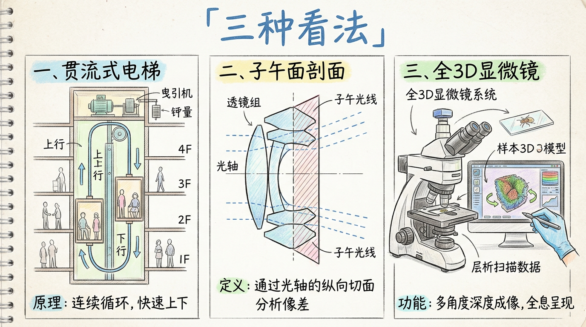

> **指读：** 方案期站中档子午；详设才上显微镜。

先建立一个贯穿本讲的空间概念。工程师看一台压气机或涡轮，有三种不同的"看法"：

| 看法 | 看的是什么 | 计算成本 |
| :--- | :--- | :--- |
| **① 通流 / 一维** | 只关心平均半径上的气流参数沿轴向的变化 | 秒级 |
| **② 子午面（S2 面）** | 看**沿叶高方向**的分布——根部怎么样、中部怎么样、尖部怎么样 | 分钟～小时级 |
| **③ 全三维叶片通道** | 看每个叶片之间完整的三维流动细节 | 小时～天级 |

**子午面（meridional plane）**是一个非常关键的中间层级。因为**叶轮机设计的核心矛盾往往是"沿叶高分布不均匀"**：根部容易分离、尖部泄漏损失大、中部效率最高；多级机的**级间匹配**问题，本质上也是子午面上的问题。

摘要把这个层级的现状概括成两个词：传统 CFD 与一维/准三维通流程序分别卡在"**being slow**"和"**being inaccurate**"上［出版商页面 摘要］。第 10 讲（论文 16 TNO）已经用"先预测基本场、再算性能"的思路把叶栅三维场预测做到了毫秒级；本文把同样的思路搬到**高压涡轮级的子午面**上。

**方案阶段的兵器谱：**  
通流像草图（秒级）、子午像铅笔素描（看叶高）、全 3D 像油画（贵）。  
论证会前夜，用油画砸所有方案，是预算自杀；本讲把物理增强借给素描。

**边界条：** 10全景·12叶表·15子午方案期。

> **先猜后揭：** 若本讲反派「三维强迫」赢了，你的下一笔 CFD/实验预算会怎样被浪费？揭晓贯穿 §3–§5。

| 生活元素 | 工程元素 | 符号 |
| :--- | :--- | :--- |
| 主比喻侧 | 子午面 | S2 |
| 主比喻侧 | 准一维 | 通流 |
| 主比喻侧 | 先验进网 | 物理增强 |

**三种看法：** 通流=概念最便宜；子午 S2=方案；全 3D=详细设计最贵。本讲站方案。

**电梯 / 剖面 / 显微镜：**  
- 通流像看整栋楼的电梯运力——快，但看不到每层装修。  
- 子午像沿叶高剖开——看见功与损失的高度分布。  
- 全 3D 像显微镜——角区、泄漏、局部分离全看见，但贵。  

方案期变量还在剧烈扫时，显微镜税会拖垮迭代次数。本讲站在中档：**物理增强的子午，是筛选错误架构的甜点。**

**显微镜税的财务语言：**  
详设单价 × 概念次数 = 破产。  
通流筛掉明显傻瓜架构，子午+物理增强再筛一轮，全 3D 只打在少数候选上——这是分辨率匹配，不是偷懒。

**三种看法的电梯演讲：**  
30 秒内必须说清：我在哪一层分辨率、为什么、下一步何时升级。  
说不清分辨率，就说不清预算。

---

#### 2. 叶轮机械中的真实工程死穴：方案论证阶段"要么太粗、要么太贵"

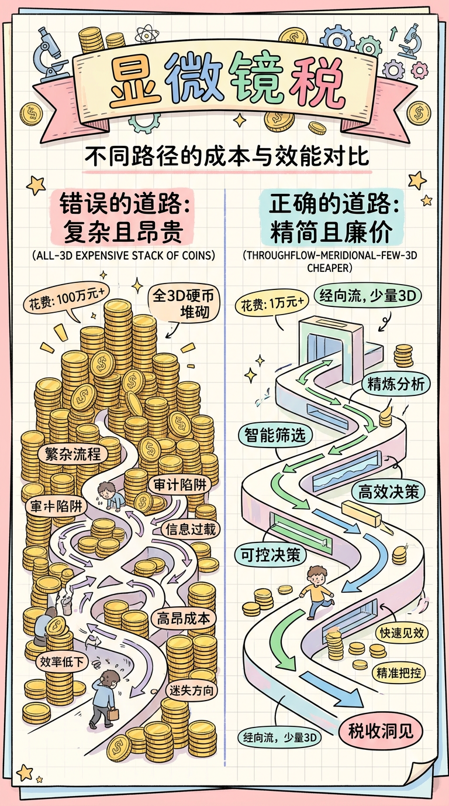

> **指读：** 错路径用详设单价买概念次数；对路径通流→子午→少数3D。

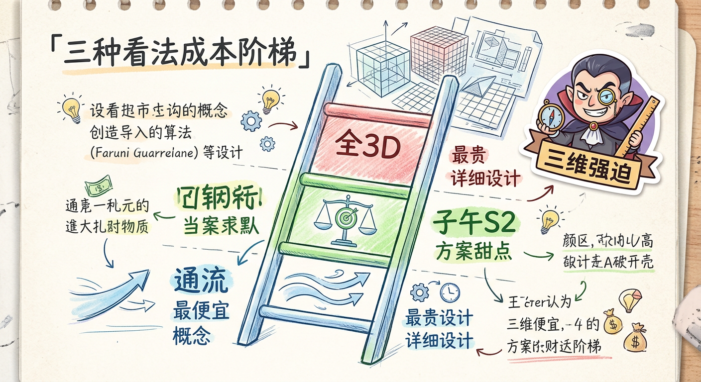

> **指读：** 中档子午是方案甜点；顶档全 3D 是详细设计；反派是三维强迫。

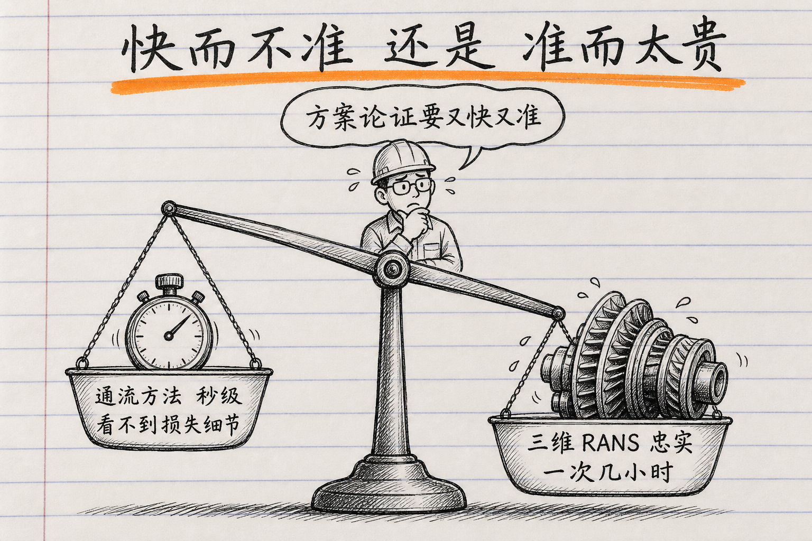

> **指读：** 这张图是本讲工程死穴的一张图版本。

工程上真正卡住的不是"最终型号要不要精算"，而是**方案论证阶段**：在几十上百个级配对、几十种子午面轮廓之间筛掉不可行的，留下两三个进入三维设计。这个筛子两端的现状是：

| 可选工具 | 为什么不能用 |
| :--- | :--- |
| **一维/二维通流方法** | 依赖经验损失模型。一旦叶型超出关联式的标定范围（高负荷、强三维分离），误差**不可控且无界**——它会给出一个"看起来很顺"的错误方案。摘要的原话是 "being inaccurate"［出版商页面 摘要］。 |
| **三维 RANS CFD** | 单样本小时级（第 03 讲的 3.5 级压气机为 1~1.5 小时／次［原文 P07 §Result analysis］；第 04 讲的多级压气机约 4200 秒／次［原文 P11 §5.2.1］）。方案阶段要评估上千个几何，成本不可承受。摘要的原话是 "being slow"［出版商页面 摘要］。 |

摘要还点了第三个坑：**纯数据驱动模型样本有限、泛化差**（"limited samples and poor generalization"）［出版商页面 摘要］——这正是全书主线三（论文 12、16、18）反复要解决的问题。本文的回答是"physics-informed"：让模型"包含 Navier–Stokes 方程的特征"［出版商页面 摘要］。

> 📎 把本文放进谱系里看物理先验的注入位置（第 10–12 讲已把前三种说清）：

| 论文 | 物理先验注入的位置 | 解决什么 |
| :--- | :--- | :--- |
| **16 TNO** | **输出侧**：先预测基本场，再按公式算性能 | 一个模型服务多个指标 |
| **12 SDNO** | **结构侧**：把叠加原理写进网络 | 分布外外推 |
| **18 P-ResUNet** | **输入侧**（相似原理无量纲化）+ **输出侧**（载荷分布作中间约束） | 跨工况泛化 |
| **20 本文** | **输出侧**（先 T、p、ρ、v 四类基本场，再综合评估子午面性能）+ 模型"包含 N-S 方程特征"（**具体形式未获取**）［出版商页面 摘要］ | 子午面全景预测 |

> 📌 **必须诚实说明**："包含 N-S 方程的特征"到底是把残差写进损失、把守恒量当中间输出、还是把方程结构编进算子——**摘要没说，正文未获取，本讲不推测**。能确认的只有"两段式：先基本场后性能"这一层。

**现场感：** 周五下班前组长要数——你面对的不是可以慢慢推的练习题，而是**算错一次就不可回收**的预算。

**三维强迫症：** 方案期变量剧变，每次全 3D 像用显微镜找大门——买不起次数。

**显微镜税计算公式（心算）：**  
成本 ≈ 全3D单价 × 架构数。  
若架构数是几十，详设单价会让你没钱做真正的详设。  
通流与子午的意义是把架构数砍到「详设买得起」的量级。

---

#### 3. 数学公式：摘要给了骨架，细节不推导

先把公式关掉，用主比喻说一遍：

> **通流一眼、子午看叶高、全3D看细节**  
> 本讲反派是「三维强迫」。下面公式是这句话的展开；每条核心式尽量带**回译**。知识总量不删——深潜只是阅读路径，不是垃圾桶。

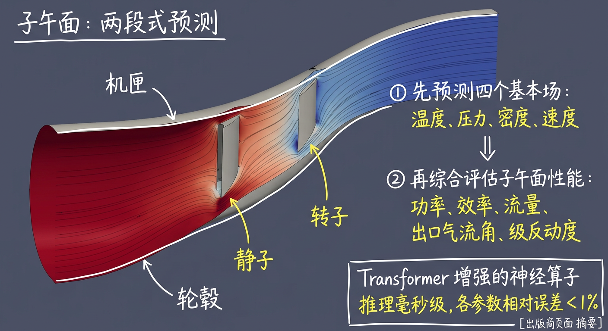

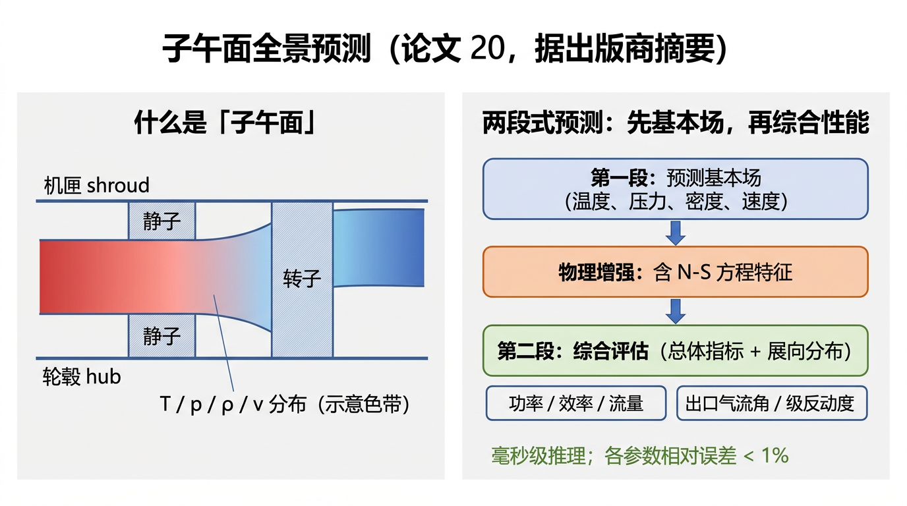

> 上图是本讲框架的「一张图版本」（据出版商摘要示意，正文未获取）：**左图**是「子午面」——轮毂与机匣之间的流道纵剖面，静子/转子叶排与 T/p/ρ/v 场的示意色带；**右图**是两段式预测——先预测温度、压力、密度、速度四个基本场，再综合评估子午面性能（功率/效率/流量等总体指标 + 出口气流角/级反动度等展向分布），网络含 N-S 方程特征，推理**毫秒级**、各参数相对误差 **< 1%**［出版商页面 摘要］。

> 🚫 本文无全文，**网络结构、损失函数、训练策略一概未获取，不做推测性推导**。以下只写摘要能支撑的三个骨架事实。

##### 3B. 本讲符号卡（建议截图留存）

| 符号 | 人话 | 备注 |
| :--- | :--- | :--- |
| S2 | 子午面 |  |
| 通流 | 准一维 |  |
| 物理增强 | 先验进网 |  |

> 🧭 先认符号再读公式；主文核心式有「回译」，装不下的细节仍在正文完整保留（不删知识）。

##### 3C. 主路径公式与推导（知识全保留）

**骨架一：两段式预测。** 摘要："The model first predicts basic variables (temperature, pressure, density, velocity) and then comprehensively evaluates meridional-plane performance parameters"［出版商页面 摘要］。这与第 10 讲论文 16 的"5 个基本场 → 9 个性能量"同构：性能量不是网络直接回归出来的，而是由预测出的基本场按气动关系式算出来的——物理一致性由"后处理公式"保证。

**骨架二：网络是 Transformer 增强的神经算子。** 摘要："a Transformer-augmented neural operator network is employed"［出版商页面 摘要］。与论文 16 的 TNO 同一家族；层数、注意力头数、算子分支未获取。

**骨架三：数据集基于 GE-E3 高压级。** 摘要："A dataset is constructed using the GE-E3 high-pressure stage"［出版商页面 摘要］。GE-E3 也是论文 02、08、17、19 反复使用的基准机型。

想理解这类模型的完整数学骨架，请读有全文支撑的相邻讲次：

| 想理解的内容 | 请读 |
| :--- | :--- |
| 5 个基本场 → 9 个性能量的完整公式、TNO 网络结构、误差数据 | **第 10 讲（论文 16 TNO）** |
| 相似原理无量纲化、为什么排除雷诺数 | **第 12 讲（论文 18 P-ResUNet）** |
| 把物理定律写进网络结构（叠加原理） | **第 11 讲（论文 12 SDNO）** |

---

#### 4. 算法控制流

> 🧭 **值班手册：** 先看「什么情况下走哪条分支」，公式是对白速记不是主角。

按摘要顺序整理（每步可在摘要中找到对应句；步内细节未获取）：

1. **构建数据集**：以 GE-E3 高压涡轮级为对象生成子午面样本（样本数、工况范围未获取）［出版商页面 摘要］；
2. **训练 Transformer 增强神经算子**：输入 → 子午面上的 T、p、ρ、v 基本场［出版商页面 摘要］；
3. **由基本场综合评估性能**：总体指标（功率、效率、流量）与展向分布（出口气流角、级反动度）［出版商页面 摘要］；
4. **测试**：各参数相对误差与推理耗时（见 §5）。

> 🚫 步骤 2 的损失函数（是否含 N-S 残差项）、步骤 3 的具体公式，**均未获取**。

> **一句话记住：** 方案期先S2子午；进阶：成本阶梯：通流<子午<3D。

**主比喻回扣：** 把上面的分支再翻译成「通流一眼、子午看叶高、全3D看细节」——若某步在生活里说不通，多半是符号没对齐。

**方案期控制流（人话）：**  
通流粗筛 → 子午+物理增强精筛 → 少数候选进全 3D/实验。  
跳步的人不是更勤奋，是在用错分辨率。

**阶梯门禁：**  
通流未过线 → 不准进子午海量扫。  
子午未显示潜力 → 不准开全 3D 矩阵。  
跳步者需书面说明「为什么分辨率必须跃迁」——默认不批准。

---

#### 5. 实验验证与量化突破

**先报胜负：** 先读结论句与最大那一格，再读全表；表是证据架不是背诵清单。

摘要给出的全部可核验结果只有两条汇总口径，本讲**只引用这两条，不做任何分项推断**：

| 项 | 摘要原话 | 本讲口径 |
| :--- | :--- | :--- |
| 精度 | "with relative errors of all parameters below 1%" | **所有参数相对误差 < 1%**（无分项表、无样本数、无工况范围）［出版商页面 摘要］ |
| 速度 | "at the millisecond level" | **毫秒级**推理（具体毫秒数未给）［出版商页面 摘要］ |

预测的量：总体性能——功率、效率、质量流量；展向分布——出口气流角、级反动度［出版商页面 摘要］。

> ⚠️ 与第 10 讲的数字**不可直接横比**：论文 16 的 0.915 ms/样本［原文 P16 Table 3］与 0.083% 基本场误差［原文 P16 Table 4］是三维叶栅场、有明确的样本与网格口径；本文只有"毫秒级 / < 1%"两个汇总词，对象是子午面。两者同属一个量级，但**本讲不写"本文比 TNO 更快/更准"**。

**体感换算：** 把关键数字换成「工程师的周/月」或「一次签字的风险」——数字才进长期记忆。若原文给了墙钟时间或成本比，优先用原文换算。

---

**篇末桥：** 场预测收束；下篇进端壁/实验/UQ/复合冷却现场。

#### 6. 审稿人批判与承前启后

把软肋放上**可信度刻度**（0=完全不信，5=可当默认工具）：

| 维度 | 打分 | 人话 |
| :--- | :---: | :--- |
| 定位 | 5 | |
| 成本 | 5 | |
| 边界 | 4 | |
| 保真 | 2 | |

**可以攻击的点（基于摘要即可提出）：**

1. **"< 1%"是汇总口径**［出版商页面 摘要］。没有分项误差、样本数、工况覆盖范围［原文未获取］，无法判断是否只在设计点附近成立；对方案论证最关键的**非设计点**表现无从得知。
2. **与论文 16（TNO）的差异性不明**。两者都是"Transformer 神经算子 + 先基本场后性能"，本文的增量到底是"对象换成子午面"还是"N-S 特征的注入方式不同"，摘要说不清，需要正文。
3. **物理增强"增强了什么"仍未定义**。"包含 N-S 方程的特征"可以有多种实现，泛化收益是否真的来自物理约束（而非数据量），摘要未给消融证据。
4. **载体**。HARCT 是液压机电与机器人控制会议（SPIE 出版），非叶轮机主流会议；2026-07 刚出版，暂无被引记录，学术影响力尚无法评估。

**承前：**
- 与**论文 16（TNO）**关系最直接：同为"先基本场后性能"的全景预测路线，同用 Transformer 增强神经算子。
- 与**论文 12（SDNO）、论文 18（P-ResUNet）**同属"物理增强 AI 预测"谱系。
- 作者团队（Song–Guo 组 + Gong/Liu）与**论文 17（GTO）、论文 19（SHAP）**高度重合，说明"全景预测 + 物理增强"是该组当前的一条在研主线。

**启后：**
- 从"叶型级预测"（TNO / P-ResUNet）走向"**级级子午面预测**"，是把 AI 预测器从**部件细节**推进到**整机匹配**的必经一步。
- 若能取得全文，本讲应优先补全：N-S 特征的具体注入形式、数据集构成、分项误差、以及与 TNO 的定量对比。

---

> 📎 **升级路径**：若能取得 Proc. SPIE 14253, 142530E 的全文，本讲可升级为 A 级证据。届时请先更新 `corpus/facts/P20.md` §三/§五，再同步本讲。
> 检索记录：2026-09-05 SPIE 站内静态检索无结果（JS 动态加载）；**2026-09-06 改用 Crossref API 按题名检索，第一条命中**，并由 SPIE 文章页取得公开摘要。

---

**方案期比分怎么读：**  
看的不是「是否接近全 3D 每一个角区细节」，而是「能否在可负担次数内把错误架构淘汰掉」。  
子午 + 物理增强的胜负手是**筛选效率**，不是取代详细设计。

**方案期 KPI：**  
不是「与全 3D 每个角区一致」，而是「单位预算淘汰的错误架构数」。  
物理增强子午赢在筛选效率，不在取代详设。

---

#### 附：方案期工作流（人话）

```

概念通流（分钟级）→ 扫大量架构
        ↓
子午 S2 + 物理增强 AI（本讲，分钟~十分钟级）
        ↓
筛出少数候选
        ↓
全 3D CFD / 实验（小时~天级）精修

```

**三维强迫症的账单：**  
若在第一步就全 3D，你是在用详细设计的单价买概念设计的次数——通常买破产。

**与 10/12 不混：**  
10 偏整机/级场全景算子；12 偏叶表结构与相似；15 偏子午叶高方向的方案工具。

---

#### 附：方案期「显微镜税」计算器（心算）

设：全 3D 一次 = 10，子午一次 = 1，通流一次 = 0.1（相对单位）。  
方案期要扫 N 个架构：

| 策略 | 相对成本 | 风险 |
| :--- | :--- | :--- |
| 全 3D × N | 10N | 买不起次数，参数未收敛 |
| 通流 × N → 3D × k | 0.1N + 10k | 通流太粗，k 仍可能很大 |
| 通流 × N → **子午+物理增强** × m → 3D × k | 0.1N + m + 10k | **本讲甜点**：m 中等、k 很小 |

**三种看法对照（钉住）：**

| 看法 | 看见什么 | 看不见什么 | 本讲？ |
| :--- | :--- | :--- | :--- |
| 通流 | 功/流量大账 | 叶高细节 | 否 |
| 子午 S2 | 叶高功/损失分布 | 全三维角区 | **是** |
| 全 3D | 角区/泄漏/局部 | （太贵） | 详细设计 |

**与 10/12 不混用一句话：**  
10 是「场算子让评估变便宜」；12 是「相似律进输入」；15 是「方案期站在哪一层看法」。

---

#### 附：10/12/15 一句话边界

10：场算子让评估变便宜。  
12：相似律与载荷约束抓跨工况。  
15：方案期站在哪一层看法（子午甜点）。

---

#### 附：方案期周会模板

1. 本周淘汰了几个错误架构？（KPI）  
2. 通流/子午/3D 各花了多少次？单价是否匹配分辨率？  
3. 是否有人跳步开全 3D 矩阵？有 → 复盘。  
4. 进入详设的候选是否 ≤ 预算允许的 k？  

显微镜税一旦失控，详设阶段会只剩「没钱做对的事」。

---

**分辨率升级申请书（必填）：** 当前层淘汰率、剩余候选数、升级后预算、不升级的风险。空表不准开全 3D。

---

#### 附：候选降维漏斗数字墙（示例填空）

通流 N0 → 子午 N1 → 全 3D N2，目标 N2≪N0。  
若 N2 降不下来，不是 3D 不够多，是前两层筛子破了。

---

#### 图卡：三种看法成本阶梯

通流秒级、子午分钟、全 3D 小时。方案期先爬低阶再上显微镜；全 3D 扫架构 = 显微镜税。

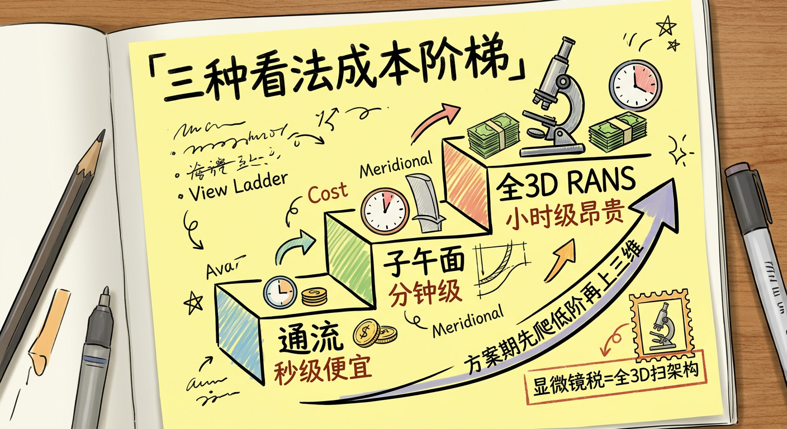

---

#### 图卡：显微镜税心算

全 3D 候选数 × 单次小时 = 税单。通流筛 → 子午缩 → 全 3D 精算才是方案期正经路径；**禁止全 3D 扫架构**。


---

#### 图卡：候选降维漏斗

宽口通流大量候选，中段子午收窄，尖底全 3D 精算。10/12/15 边界：全景叶表、工况泛化、方案期子午——各管一段，不抢戏。

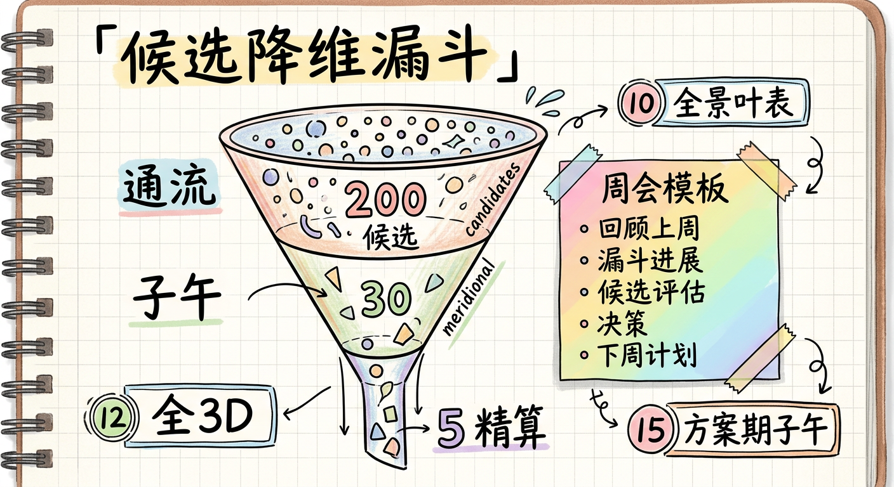

---

#### 章末：30 秒复述 · 自测 · 元数据

**30 秒复述稿（可朗读）：** 通流快、子午看叶高、全 3D 最贵。方案期站在子午物理增强甜点，用可负担次数淘汰错误架构。反派是三维强迫症。

**自测（先做再对答案）：**

1. 方案期为何不3D强迫？
2. 不替代谁？
3. 子午看什么？

<details>
<summary>点开看参考答案</summary>

1. 太贵，参数还在剧变。
2. 详细设计全3D。
3. 叶高功/损失分布。

</details>

> **本讲元数据**（读完再看，不挡故事）
> | 项 | 值 |
> | :--- | :--- |
> | 规范编号 | **20** |
> | 标题 | Physics-enhanced AI model for panoramic prediction of the meridional performance of turbomachinery cascades |
> | 载体 | **Proc. SPIE 14253**, Second International Conference on Hydromechatronics and Advanced Robot Control Technology (**HARCT 2026**，Shaoguan, 2026-03-27～29)，文章号 **142530E** |
> | 出版 | **2026-07-07** |
> | 作者 | Cunzhong Gong, Zhendong Guo, Zhongcheng Liu, Liming Song（郭老师列第二） |
> | DOI | `10.1117/12.3117536`（Crossref 2026-09-06 核验） |
> | 本地原文 | **无**（SPIE 出版商页面摘要已获取；正文需订阅） |
> | 证据等级 | **B（权威著录 + 摘要全文可查；正文/图表/分项数值未获取）** |

> ⚠️ **本讲的写作边界（务必先读）**
> 本文**没有本地全文**。可核验的信息 = Crossref 著录 + SPIE 页面摘要（逐字存于 `corpus/web_evidence/P20.md`）。
> 本讲：✅ 只写摘要明确给出的对象、物理增强方式、网络类型、输出量与两项汇总指标；❌ **不写**网络层数、损失函数形式、样本数、分项误差。
>
> 🗑️ **两轮纠错记录**（都保留，便于审计）：
> ① 旧版白皮书 6.1 矩阵称本文"将几何守恒定律与流体力学能量守恒约束直接写入损失函数"——摘要只说模型"包含 N-S 方程的特征"，**损失函数形式至今未获取，该句仍不得写**。
> ② 上一轮重建版把本文降为"证据等级 C、连摘要都没有"，并断言"'毫秒级'无任何来源，属套用论文 16"——**这两条本身是错的**：摘要公开，且原话就是 "at the millisecond level"。本讲据此重写。
> | 反派绰号 | 三维强迫 |
> | 主比喻 | 看叶片的三种看法 |

---

<a id="part-4" name="part-4"></a>
# 第四篇 【流动控制、气动热耦合与风洞实验篇】

本篇覆盖**论文 03、09、10、04、05**。回到物理本体：**端壁二次流怎么控、叶尖怎么修、冷气怎么给、实验结果站不站得住。** 非轴对称端壁从数值优化（NAE-Purge）走到跨声速风洞实测验证（NAE-Exp），并用不确定性量化（Slot-UQ）回答一个工程上最要命的问题：**加工公差和工况波动，会让我的设计偏离标称值多远？**

<a id="bridge-d"></a>

### 过桥 D · 从网络回到气流：实验、公差与冷却

算法篇把「算得起」往前推了一大步。第四篇（第 16–20 讲）把镜头拧回硬件：

> 端壁的涡、叶尖的缝、冷气的孔、加工的公差、风洞的曲线——  
> **再漂亮的代理，也要过物理与实验的脸。**

| 讲 | 现场 |
| :--- | :--- |
| 16 | 端壁三涡与气膜 |
| 17 | 跨声速风洞：Ma=0.8 与降损 14.0%［原文 P09 摘要］ |
| 18 | 叶尖间隙与 FFD |
| 19 | 不确定性量化 |
| 20 | 冲击 + 气膜复合冷却 |

读法：少公式、多画面；数字必须带工况。你若是做试验的同学，本篇是主场；你若是做算法的同学，本篇是「你的指标到底在物理上意味什么」的校准器。

---

<a id="lec-16" name="lec-16"></a>
### 【第16讲】端壁：涡轮里最热、最难冷却、也最容易被忽略的角落（**论文 03**）

#### 本讲开场 90 秒

**上讲闪回：** 转入流动控制现场：端壁最热最脏最易被忽略。

**本讲反派：** 「墙角油污」

**只要带走 3 句口诀：**

1. **马蹄/通道/角三涡**
2. **气膜要冷到墙角**
3. **MFR是账单不是越大越好**

**主比喻：** 厨房墙角最难擦——涡把脏东西卷回角


> **看图三秒：** 马蹄/通道/角；气膜冷角；MFR 账单。

**本讲赌注：** 忽略角区，中径再漂亮也是假冷却。

---

#### 1. 生活与物理直觉引子：为什么厨房的墙角最难擦干净


> **指读：** 中径报表好看不等于角区灭火。

先做一个生活类比。你打扫厨房，台面中间一擦就干净——因为那里"通透"。但**墙角**呢？永远积着油污，因为：

- 角落里空气**流动慢**，脏东西容易沉积；
- 更糟的是，那里会形成**小旋涡**，把油烟**卷着贴到墙面上**。

涡轮端壁就是这样一个"墙角"，只不过"油污"换成了**上千度的高温燃气**。

端壁（endwall）是叶片根部所依附的那个环形壁面。它是涡轮中**最热、最难冷却、也最容易被忽略**的区域，原因有三：

1. **主流温度最高**（涡轮进口）；
2. **二次流最复杂**——马蹄涡、通道涡、横向流在这里扎堆；
3. **冷却最难布置**——冷气从上游的**封严缝（purge slot）**吹出来，还没铺开就被通道涡卷走了。

更麻烦的是趋势：

> 随着涡轮进口温度与叶片负荷不断攀升，**叶片负荷的增大会加剧横向流动与叶片–端壁相互作用**，使端壁设计成为真正的难题。［原文 P03 摘要］

**墙角物理学：**  
中间通道「通风好」；端壁角区流速低、还有涡把热气卷回壁面。  
冷却设计若只照顾中展，墙角会先烧穿——这是本篇物理线的情感动机。

**物理：** 角区慢，涡把热卷回壁。

> **先猜后揭：** 若本讲反派「墙角油污」赢了，你的下一笔 CFD/实验预算会怎样被浪费？揭晓贯穿 §3–§5。

| 生活元素 | 工程元素 | 符号 |
| :--- | :--- | :--- |
| 主比喻侧 | 马蹄/通道/角 | 三涡 |
| 主比喻侧 | 吹风比 | MFR |
| 主比喻侧 | 表面膜 | 气膜 |

**厨房分镜：** 油烟在墙角最厚；只擦中心；角又黑。气膜只盖中径，角区三涡卷回热燃气——同一剧本。

**擦墙角完整分镜：**  
① 油烟总在墙角最厚；② 你只擦中心瓷砖；③ 次日墙角又黑。  
端壁气膜只覆盖中径 = 同一剧本。三涡把热燃气卷回角区；冷却设计必须**点名角区**。

**擦墙角项目失败复盘：**  
中心瓷砖反光，验收拍照好看。  
墙角油烟次日回潮，用户投诉。  
端壁气膜同构：中径覆盖率报表很美，角区三涡回收热燃气。  
设计评审必须投影角区，不只投影中径。

---

#### 2. 叶轮机械中的真实工程死穴：端壁上盘踞着三个涡

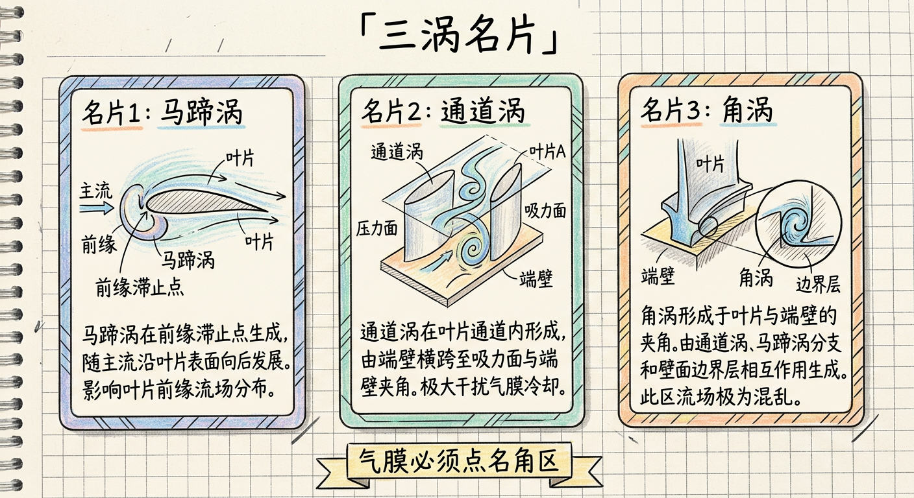

> **指读：** 点名三涡；气膜必须冷到角区，不能只擦中径。

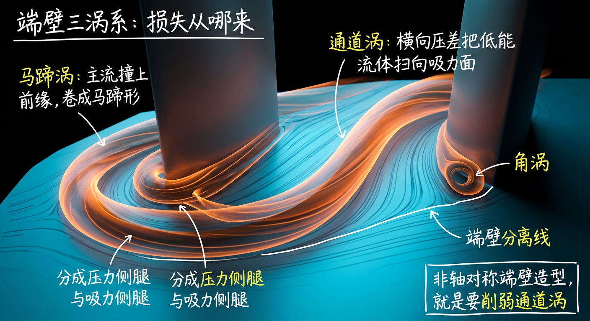

> **指读：** 这张图是本讲工程死穴的一张图版本。

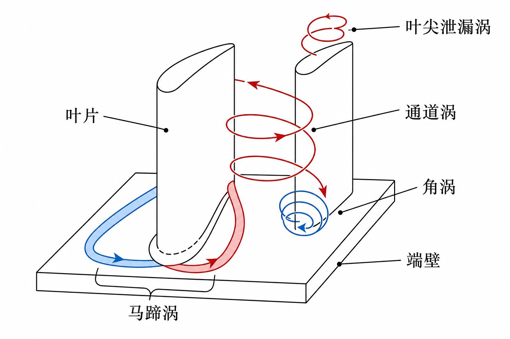

> 上图是端壁二次流的「全家福」：**马蹄涡**在叶片前缘被劈成两支，**通道涡**横扫整个通道，**角涡**盘踞在吸力面与端壁的夹角，再加上叶尖的**泄漏涡**——本讲要「擦干净的墙角」，就是它们造成的。

要設計端壁，先得知道端壁上到底发生了什么。原文用涡核轨迹可视化（Q 准则）给出了清晰的图像［§4.2］：

| 涡 | 从哪来 | 干什么坏事 |
| :--- | :--- | :--- |
| **马蹄涡 HV** | 进口边界层撞击**叶片前缘与端壁的交界处**并卷起 | 分成两支：**HVPS**（压力侧分支，横穿叶道）与 **HVSS**（吸力侧分支，紧贴吸力面移动）。HVPS 最终被卷入通道涡，**进一步强化通道涡**；它还让前缘–端壁交界处极难冷却 |
| **通道涡 PV** | 由 **PS → SS 的强横向流**供能 | 卷吸 HVPS，不断被增强；同时**把冷气扫向吸力侧**，破坏气膜覆盖 |
| **分离涡 SV** | 封严缝下游（冷气先分离再附着） | 影响冷气初期的铺展 |

> **一句话**：端壁问题的本质，是**三个涡把热气往壁面上按、把冷气从壁面上掀**。

**现场感：** 周五下班前组长要数——你面对的不是可以慢慢推的练习题，而是**算错一次就不可回收**的预算。

**三涡名片：** 马蹄绕前缘；通道向角区扫；角涡贴墙低速。冷却设计要点名。

**三涡供能链：**  
横向压力梯度喂通道涡；马蹄在前缘分叉；角涡贴墙低速。  
气膜若只喷中径，角区成为热污回收站——与厨房墙角同一物理。

**角区是产品：**  
中径覆盖是手段，角区灭热点才是产品。  
三涡名片要贴在设计室墙上，评审时逐个点名。

---

#### 3. 数学公式从 0 到 1 推导

先把公式关掉，用主比喻说一遍：

> **厨房墙角最难擦——涡把脏东西卷回角**  
> 本讲反派是「墙角油污」。下面公式是这句话的展开；每条核心式尽量带**回译**。知识总量不删——深潜只是阅读路径，不是垃圾桶。

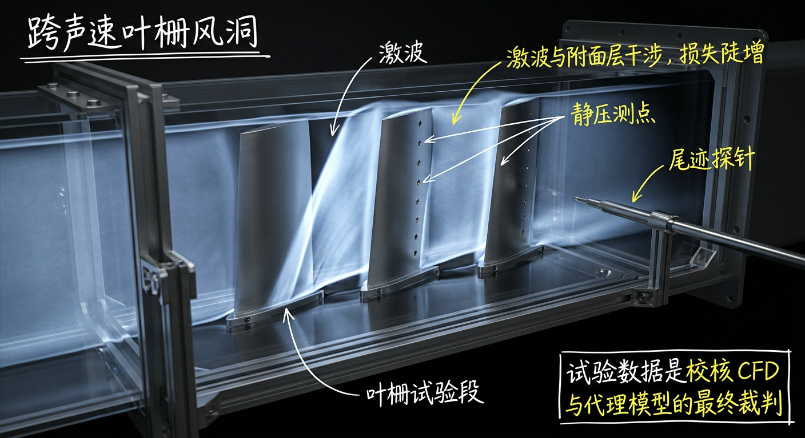

> **指读：** 先把这张图当 §3 地图，再读公式。

##### 3B. 本讲符号卡（建议截图留存）

| 符号 | 人话 | 备注 |
| :--- | :--- | :--- |
| 三涡 | 马蹄/通道/角 |  |
| MFR | 吹风比 |  |
| 气膜 | 表面膜 |  |

> 🧭 先认符号再读公式；主文核心式有「回译」，装不下的细节仍在正文完整保留（不删知识）。

##### 3C. 主路径公式与推导（知识全保留）

**第一步：三个必须同时看的性能指标**

端壁设计不能只看气动，也不能只看冷却，必须三个一起看。本文的三个目标函数：

| 目标 | 表达式 | 含义 |
| :--- | :--- | :--- |
| **气动 AD** | min ξ̄_{p,t} | 整个叶栅通道的**总压损失系数** |
| **气膜 FC** | max etaₐve | **前半段**端壁的面平均**气膜冷却效率** |
| **换热 HT** | min (h/h₀)ₐve | 整个端壁的面平均**换热系数** |

具体定义：
**〔式〕** ξ̄ₚ, t = (ṁ_∞ pₜ, ∞ + ṁ_c p_t, c-(ṁ_∞ + ṁ_c) p_t, out)/(ρ_∞ U_∞²/2)

**回译：** 上式是主路径构件——先记住它在算法里负责哪一步，再抠每一个符号。

**〔式〕** η = (T_∞-T_aw)/(T_∞-T_c), h = (q_w)/(T_aw-T_w), Nu = (hC)/(λ)

**〔式〕** MFR = (ṁ_c)/(ṁ_∞) (吹风比：冷气流量 / 主流流量)

> 📌 注意气膜效率只统计**前半段**端壁——原文明确解释：由于**通道涡的卷吸作用，封严冷气只能覆盖前半段端壁**。这个细节本身就说明了端壁冷却有多难。

**第二步：为什么要"两处造型"？**

传统非轴对称端壁（NEC）方法通常只针对**横向流**（即只在相邻叶片之间造型）。本文指出还有第二个祸源——**马蹄涡**。因此提出**全端壁造型**：

1. **叶片前缘附近**：形成**斜坡状（ramp-like）几何** → **削弱马蹄涡**；
2. **相邻叶片之间**：形成非轴对称端壁 → **削弱横向流**。

**第三步：参数化（13 个参数）**

- **前段（叶片前缘附近）——5 个参数**
 - 切向造型曲线：由**两个半周期三角函数**构成（压力侧、吸力侧各一个），周期决定各自的切向宽度 W_ps、W_ss，两条曲线在**叶片中弧线处达到峰值**；
 - 轴向幅值曲线：同样由两个半周期三角函数合成，保证平滑过渡到平端壁；由**最大幅值 H**、起止位置 L₀、L₁ 控制（幅值上限见原文 Table 2）。

- **后段（相邻叶片之间）——8 个参数**
 - 切向曲线从**前一叶片的压力侧中弧线**起、到**相邻叶片的吸力侧中弧线**止，用**周期等于两倍栅距的半周期三角函数**拟合；
 - PS 侧与 SS 侧的高度各由一条轴向幅值曲线控制，该曲线用**非均匀 B 样条**拟合、终止于叶片尾缘；
 - 后段造型：**共 8 个控制点**（压力侧 P₁–P₄、吸力侧 S₁–S₄），其中**中间 4 个可沿展向（Z）移动**，首尾各 2 点固定以保光顺 → 后段 **8 个设计参数**；全文端壁合计 **13 个设计参数**（后段 8 + 前段等其余参数）［原文 P03：*eight design parameters* for rear-part；*13 design parameters* for entire contoured endwall］；
 - **Z 坐标为正 → 凸面；为负 → 凹面。**

**第四步：优化设置**

- 13 个参数中只优化 **11 个**（造型区起止位置固定为 L₀=0.1Cₐx、L₁=0.15Cₐx）；
- 优化器：**Kriging + EGO**（与本全集论文 01/02 同一族方法）；
- 样本：**73 个**（67 个初始均匀样本 + **6 个**按 EI 加点准则补充）；
- 在 **MFR = 1.0%** 这一代表工况下优化。［以上设置均出自原文 P03 §3.2、§3.3 与 Table 4］

**第五步：一个很有意思的方法论选择——为什么做三次单目标，而不是一次多目标？**

原文说得很清楚：

> 为了**排除三目标之间的相互影响**、尽可能清晰地揭示 NEC 背后的流动–传热机理，本文**分别进行三次单目标优化**以寻找代表性解。［§3.3］

> 💡 **这一点值得单独记住**：在这里，**优化是"提取代表性样本"的工具，而不是最终目的**——真正的目的是理解机理、提炼准则。这种"优化作为研究工具"的定位，与第 13 讲（SHAP）"优化之后还要挖知识"的意识是相通的。

---

#### 4. 算法控制流

> 🧭 **值班手册：** 先看「什么情况下走哪条分支」，公式是对白速记不是主角。

```

① 参数化：13 个参数（前段 5 + 后段 8）→ 生成非轴对称端壁几何
② 自动化：脚本录制技术生成网格 / CFD / 后处理模板（批量运行）
③ 每个设计做两次 CFD：
     - 端壁为绝热无滑移壁面     → 算气膜冷却效率 η
     - 端壁为恒热流 q_w=1000 W/m² → 算换热系数 h
④ LHS 生成 67 个初始样本，Kriging 建三个代理模型（AD / FC / HT）
⑤ 三次单目标 EGO 优化 + EI 加点 6 次 → AD-Opt / FC-Opt / HT-Opt
⑥ 三个最优设计在 MFR = 0.5% / 1.0% / 1.5% 下与平板端壁对比（后两个为外推验证）
⑦ Q 准则涡核轨迹可视化 → 揭示流动机理 → 提炼设计准则

```

> **一句话记住：** 马蹄/通道/角三涡；进阶：气膜要冷到墙角。

**主比喻回扣：** 把上面的分支再翻译成「厨房墙角最难擦——涡把脏东西卷回角」——若某步在生活里说不通，多半是符号没对齐。

**角区冷却控制流（概念）：**  
识别马蹄/通道/角 → 看气膜覆盖是否留白 → 调孔排/吹风比 → 用 MFR 账单问整机是否更亏。  
「再开一排孔」不是默认动作，是冷气预算审批项。

**角区优先控制流：**  
点名马蹄/通道/角 → 覆盖图是否留白 → 调孔排/MFR → 用整机账单问是否更亏。  
「再开一排」默认拒绝，除非角区热点仍在且冷气预算未尽。

---

#### 5. 实验验证与量化突破


> **指读：** 抽气吃循环；角区灭火优先于中径锦上添花。

**先报胜负：** 先读结论句与最大那一格，再读全表；表是证据架不是背诵清单。

**基准模型**：源自 Papa 等 [2] 的公开实验几何（大转角燃气涡轮叶片），**平板端壁 + 上游封严缝 + 冷气供气腔**。

| 设置项 | 数值 |
| :--- | :--- |
| 封严缝 | 倾角 **45°**；宽度 **4.00 mm**；长度 **25.50 mm**；位置 **12.96 mm** |
| 边界层厚度 | δ=22 mm，θ=2.2 mm（先做二维边界层模拟复现实验值） |
| 雷诺数 / 马赫数 | Reₑxit=600,000；Maᵢn=0.045；Maₑxit=0.14 |
| 冷气 / 主流总温 | **298.15 K / 308.15 K** |
| 吹风比 MFR | **0.5% / 1.0% / 1.5%** |
| 网格 | NUMECA 9.1-2 多块结构网格，叶片周围 O 型拓扑；**>430 万**后网格无关，最终用 **490 万** |
| 求解器 | ANSYS CFX 14.5，稳态 RANS，元素基有限体积法，点隐式求解器 + 代数多重网格 |

［原文 P03 数值方法与算例设置，数值由原文给出］
**核心结果（均相对平板端壁基准）**［Fig. 10］

| 指标 | MFR = 0.5% | MFR = 1.0% | MFR = 1.5% |
| :--- | :---: | :---: | :---: |
| **AD-Opt：总压损失系数** | **−3.9%** | **−4.4%** | **−4.0%** |
| **FC-Opt：面平均气膜效率** | **+8.3%** | **+65.2%** | **+25.1%** |
| AD-Opt / HT-Opt：气膜效率提升 | — | 可达 **50%** | 可达 **20%** |
| **HT-Opt：面平均换热系数** | **−3.4%** | **−8.3%** | **−4.4%** |
| FC-Opt：总压损失系数 | 略升 | 略升 | 略升 |

［原文 P03 Table，数值由原文给出］
［原文 P03 §4.1；三次优化均在 MFR = 1.0% 下进行，0.5% 与 1.5% 为外推验证］

**怎么读这张表？三种最优设计是三种"性格"：**

| 设计 | 性格 | 表现 |
| :--- | :--- | :--- |
| **AD-Opt**（气动最优） | **全面改善型** | 气动损失降 3.9–4.4%，气膜效率同时提升（MFR 1.0% 时可达 50%）［原文 P03 §4.1］ |
| **HT-Opt**（换热最优） | **全面改善型，且最理想** | 换热系数降 3.4–8.3%，气动也改善；**原文判定它是最理想的方案** |
| **FC-Opt**（气膜最优） | **单项突出型** | 气膜效率暴涨（MFR=1.0% 时 +65.2%），但**气动损失反而略升**，换热几乎无改善 |

［原文 P03 正文与 Table，数值由原文给出］
**流动机理：为什么几何不同，效果就不同？**

1. **三个最优设计有一个共同点**：都在**叶片前缘附近形成了斜坡状凸起**。原因是这一凸起能有效**削弱马蹄涡及其两个分支**（MFR=1.0% 时 HVPS 削弱最明显；原文为定性描述，未给涡强度数值），并减弱前缘附近的湍流掺混。原文因此指出：**前缘附近的凸型对所有三项指标都有利。**
2. **AD-Opt 与 HT-Opt 的区别性特征**：在**吸力侧后段形成凹陷（valley）**。凹陷**降低了横向压力梯度**，从而削弱横向流与通道涡 → 气动损失与换热系数同步下降。两者的几何相似，所以性能也接近。
3. **FC-Opt 的区别性特征**：在**吸力面中部形成明显凸起**（原文为定性几何描述）。该凸起**加速冷气并使其贴附端壁表面**，从而增强前端壁的气膜覆盖——代价是破坏了气动性能。
［原文 P03 正文，机理分析］

> 💡 **最有价值的设计准则**：**前缘凸起（削弱马蹄涡）+ 吸力侧后段凹陷（削弱横向流）** 是一对"共赢"组合；而**吸力面中部凸起**虽然对气膜极好，却要付出气动代价。

**体感换算：** 把关键数字换成「工程师的周/月」或「一次签字的风险」——数字才进长期记忆。若原文给了墙钟时间或成本比，优先用原文换算。

**MFR 账单：** 冷气来自压气机抽气，吃循环效率。局部更冷可能整机更亏。

---

**下一讲：** 非轴对称端壁进风洞，支票变硬通货。

#### 6. 审稿人批判与承前启后

把软肋放上**可信度刻度**（0=完全不信，5=可当默认工具）：

| 维度 | 打分 | 人话 |
| :--- | :---: | :--- |
| 画面 | 5 | |
| 机理 | 4 | |
| 定量 | 3 | |
| 构型 | 3 | |

**可以攻击的点：**

1. **优化只在 MFR = 1.0% 下进行**，0.5% 与 1.5% 只是外推验证。若实际工作需要在多个吹风比下达标，应做多工况优化。
2. **样本量偏小**：11 维设计空间只有 **73 个样本**（其中仅 6 个是 EI 加点）。对 Kriging 建模而言相当稀疏，代理模型的可靠性存疑。
3. **优化后的端壁没有实验验证**——实验对比只针对基准平板端壁，三个最优设计全部只有 CFD 支撑。
4. **气动与热是两次独立仿真**（绝热壁 vs 恒热流壁），**不是共轭传热（CHT）**耦合求解。
5. **三次单目标优化无法刻画三者的权衡曲面**（Pareto 前沿）。原文承认这是为了机理清晰所做的取舍，但这也意味着**"最佳折中方案"并未被真正找到**。
6. **变形幅度受限**（控制点范围仅 ±0.025S / ±0.04S），可能压低了造型的收益上限。
［原文 P03 正文；批判性归纳为本次重建所加，其中样本量等数值由原文给出］

**承前：**
- 继承非轴对称端壁（NEC）研究与 Kriging + EGO 优化平台（与本全集论文 01/02 同一族方法）。
- **与全集中其他"优化"论文的定位不同**：本文的优化**不是为满足某个工程指标**，而是**为提取代表性设计以揭示物理机理**——"优化作为研究工具"的范例。

**启后：**
- **论文 14（VAE-NURBS 端壁参数化）**：本文用手工参数化做 NEC（13 个参数），论文 14 改用 **VAE 生成模型**（高压涡轮级算例 9 个变量）做端壁参数化［出版商页面 摘要，论文 14］；
- **论文 09（NAE-Exp）**：本文是纯数值研究，论文 09 把非轴对称端壁送到**风洞实验**中验证；
- **论文 04（Slot-UQ）**：本文研究封严缝下游的流动，论文 04 进一步研究这类结构在**制造与运行不确定性**下的性能退化。

---

**MFR 读表纪律：**  
局部更冷 ≠ 整机更优。冷气来自抽气，吃循环效率。  
角区灭热点优先；中径已经够冷时，下一分冷气要问墙角。

**MFR 账单审计：**  
冷气来源（哪级抽气）→ 掺混损失 → 循环效率影响 → 热点是否真灭。  
缺任一行，不允许写「冷却效果良好」。

---

#### 附：角区冷却的「擦墙角」复盘

只喷中径 = 只擦瓷砖中心。  
三涡（马蹄/通道/角）负责把热污送回墙角。  
气膜设计必须**点名**覆盖角区；MFR 账单上每一分冷气都要问：是在灭热点，还是在制造掺混损失？

---

#### 附：MFR 与「灭火 vs 制造烟雾」

吹风比加大，局部可能更冷，也可能：

- 冷气射流掀起，覆盖变差；  
- 掺混损失上升，气动变差；  
- 抽气吃循环效率，整机更亏。

**角区优先原则：** 中径已经够冷时，下一分冷气应问「墙角灭了没」。三涡名片（马蹄/通道/角）是点名工具，不是装饰。

**和 17 的交接：** 机理故事在本讲讲完；Ma 绑定的百分比在风洞交卷。

---

#### 附：与 17 的交接条

本讲交付：三涡名片 + 角区必须点名。  
17 交付：Ma 绑定的降损百分比与油流证据。  
缺 17，16 是故事；缺 16，17 是无机理的数。

---

#### 附：三涡 → 动作

| 涡 | 动作提示 |
| :--- | :--- |
| 马蹄 | 前缘/端壁接合带 |
| 通道 | 横向驱赶，改端壁型面或孔排 |
| 角 | 墙角覆盖，禁止只喷中径 |

---

#### 附：角区覆盖验收拍照规范

- 必拍：前缘马蹄区、通道中部、角区近壁。  
- 禁止：只交中径一张「好看的覆盖图」。  
- 旁注：MFR、孔排编号、是否牺牲中径换角区。  

与 17 交接时，实验组应能指着角区说「这里是设计意图，不是意外」。

---

**角区产品经理口令：** 中径是渠道，角区是产品。渠道漂亮而产品未交付，项目不计成功。

---

#### 附：与叶尖/复合冷却的联席议题

角区气膜、叶尖泄漏、冲击内冷是否抢同一冷气？  
联席表不齐，不允许分系统各自报喜。

---

#### 图卡：三涡 → 动作

马蹄涡对前缘修型、通道涡对端壁压梯度、角涡对角区气膜覆盖。**机理不清不许开冷却孔**——先点名涡系，再下动作。

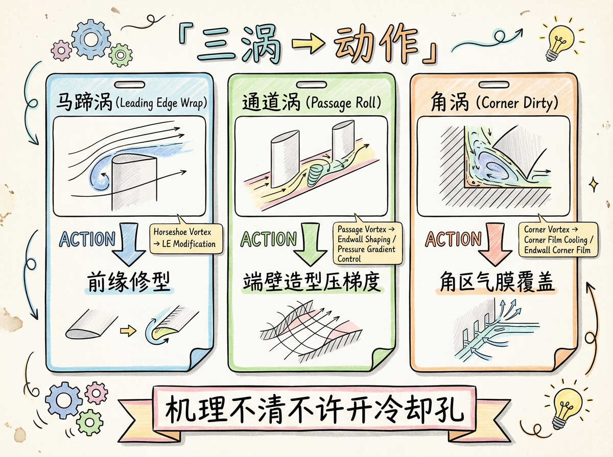

---

#### 图卡：角区验收拍照规范

角区全入镜、孔排编号可见、同光照同角度前后对比；禁止只拍中心流道冒充覆盖完成。验收是工序，不是美工精选。

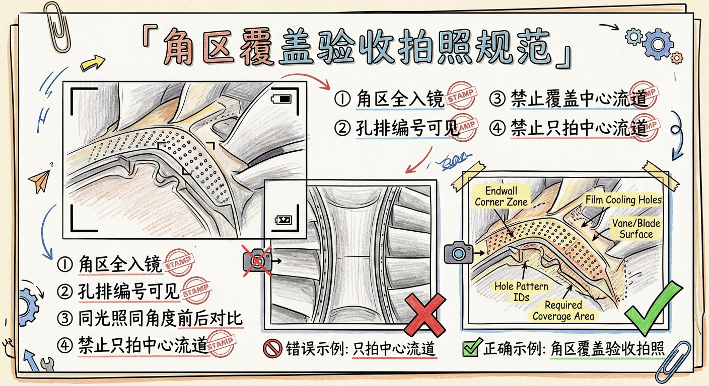

---

#### 图卡：灭火 vs 制造烟雾

真灭火打最热点；制造烟雾只让平均温度好看。MFR 账单上：**局部更冷 ≠ 整机更优**。

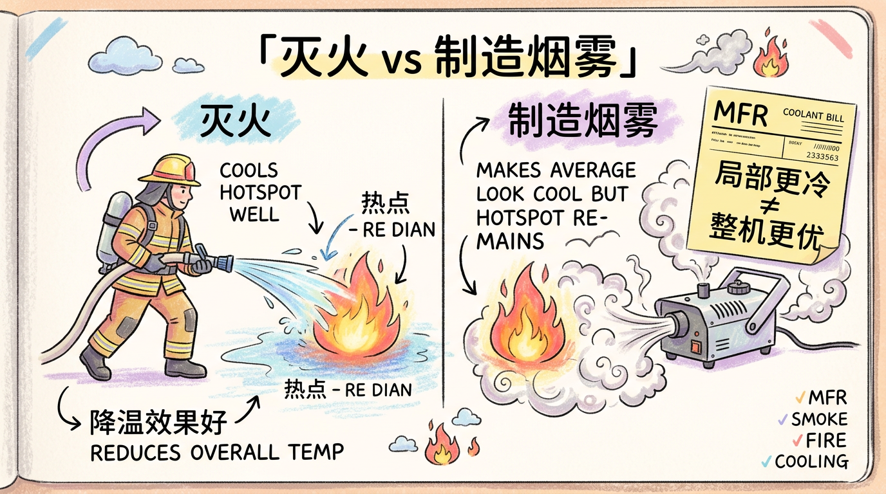

---

#### 章末：30 秒复述 · 自测 · 元数据

**30 秒复述稿（可朗读）：** 端壁像厨房墙角：马蹄/通道/角三涡把热卷回。气膜必须点名角区；MFR 是账单不是越大越好。忽略端壁，中心叶型再漂亮也枉然。

**自测（先做再对答案）：**

1. 墙角为何热？
2. 三涡？
3. MFR越大越冷？

<details>
<summary>点开看参考答案</summary>

1. 回流+涡卷热燃气。
2. 前缘绕、通道扫、角贴墙。
3. 否，过量有掺混与供气成本。

</details>

> **本讲元数据**（读完再看，不挡故事）
> | 项 | 值 |
> | :--- | :--- |
> | 规范编号 | **03** |
> | 原始文献 | *International Journal of Heat and Mass Transfer*, **2021, 178: 121626** |
> | DOI | `10.1016/j.ijheatmasstransfer.2021.121626` |
> | 作者 | Zhi Tao, Zhendong Guo, Boyang Yu, Liming Song\*, Jun Li |
> | 本地原文 | `1-s2.0-S0017931021007298-main.pdf` |
> | 证据等级 | **A（本地原文逐句可查）** |
> | 反派绰号 | 墙角油污 |
> | 主比喻 | 厨房墙角最难擦 |

---

<a id="lec-17" name="lec-17"></a>
### 【第17讲】把端壁真的送进风洞：跨声速涡轮转子的非轴对称端壁实验（**论文 09**）

#### 本讲开场 90 秒

**上讲闪回：** 16机理清；本讲非轴对称端壁进跨声速转子风洞。

**本讲反派：** 「只信仿真」

**只要带走 3 句口诀：**

1. **横向梯度驱二次流**
2. **实验硬通货**
3. **降损%必须带工况：Ma=0.8下14.0%［原文 P09 摘要］**

**主比喻：** 云图是支票，风洞是硬通货

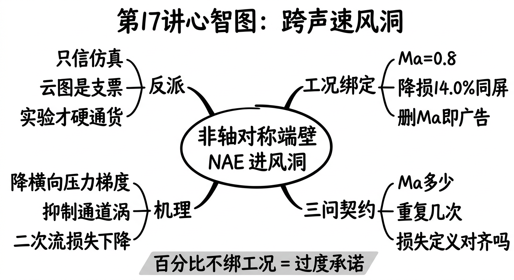

> **看图三秒：** 中心 NAE 进风洞；四支——反派只信仿真、工况绑定 Ma=0.8 与降损 14.0% 同屏［原文 P09 摘要］、机理降横向梯度抑通道涡、三问契约；底条「百分比不绑工况=过度承诺」。
**本讲赌注：** 不带工况的降损百分比，会变成周会上的过度承诺。

---

#### 1. 生活与物理直觉引子：模拟做得再漂亮，也要过"真机"这一关

前面十六讲，绝大多数结论都来自**数值仿真（CFD）**。但工程界有一句老话：

> **"Nobody believes a simulation except the person who did it. Everybody believes an experiment except the person who did it."**
> （仿真只有做的人信，实验除了做的人别人都信。）

这话虽刻薄，却道出了实验的地位：**仿真是"我认为"，实验是"实测是"。**

第 16 讲（论文 03）用 CFD 证明了非轴对称端壁（NAE）能同时改善气动与换热——但那**只是 CFD 说的**。本讲要做的，是把一个精心设计的 NAE 模型**真的加工出来、装进风洞、在跨声速条件下实测**。

而且本文挑了个硬骨头：**跨声速（exit Mach 0.6–0.95）**。为什么难？因为跨声速工况下有**激波**，激波会与端壁二次流相互作用，流动结构比低速情形复杂得多——这也正是此前 NAE 研究相对薄弱的区间。

**实验日 Vlog（压缩版）：**  
清晨装 cascade → 中午校 Ma=0.8 → 傍晚读损失曲线。  
仿真组的同事在玻璃外张望：数字对上了，才敢在周会上用「Ma=0.8 降 14.0%」这个词［原文 P09 摘要］。  
记住：**14.0% 必须连着 Ma=0.8 读**，去掉工况就是过度承诺。

**实验日时间线（加长版，方便代入）：**

1. **08:00** 装夹叶栅，检查端壁面轮廓与泄漏密封。  
2. **10:30** 风洞启动，工况向 Ma = 0.8 逼近；任何抖动都写进日志。  
3. **14:00** 基线（轴对称端壁）与优化构型轮流测总压损失。  
4. **17:30** 曲线出来：在 **Ma = 0.8** 工况下，损失相对下降 **14.0%**［原文 P09 摘要］——这句话里的工况三个字，一个都不能删。  
5. **次日例会** 仿真组对照：对上了，才有资格把「非轴对称端壁」写进设计规范草案。

横向压力梯度是本讲物理反派的真身：压力面高、吸力面低，端壁附面层被推着横向走，二次流加强。非轴对称造型，本质上是在**用几何挡那条横向的推**。

**信任链：** 百分比不带工况，进不了周会标题。

> **先猜后揭：** 若本讲反派「只信仿真」赢了，你的下一笔 CFD/实验预算会怎样被浪费？揭晓贯穿 §3–§5。

| 生活元素 | 工程元素 | 符号 |
| :--- | :--- | :--- |
| 主比喻侧 | 马赫数 | Ma |
| 主比喻侧 | 驱二次流 | 横向梯度 |
| 主比喻侧 | 终审 | 风洞 |

**实验日 Vlog：** 早装叶栅检漏；午 Ma 爬升；晚采集损失。同一改型在 Ma=0.8 报约 14.0% 降损［原文 P09 摘要］——这才是周会标题。

**信任游戏加长一幕：**  
仿真组："云图已经很像了。"  
实验组："Ma 多少？重复几次？损失定义对齐了吗？"  
三问答不全，云图只是海报。本讲存在的理由，就是让这三问变成工序而不是甩锅。

**信任游戏加长第二幕：**  
仿真组贴云图。  
实验组要：工况、重复、损失定义。  
三问全答上，Ma=0.8 下的 14.0% 才能进标题［原文 P09 摘要］。  
答不上，云图回海报墙，不进规范草案。

---

#### 2. 叶轮机械中的真实工程死穴：横向压力梯度

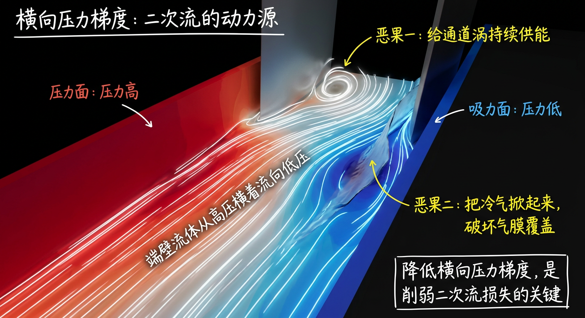

> **指读：** 这张图是本讲工程死穴的一张图版本。

**横向流的「推」与 NAE 的「挡」（加长）：**  
把通道想象成一条有坡度的旱道：压力面是高坡，吸力面是低洼。端壁附面层的流体不沿主流直走，而被压差推着横切。  
通道涡靠这股横切持续喂食；气膜冷气也会被掀向吸力侧。  
非轴对称端壁的几何，本质是**改旱道的坡**——让横切变弱。油流显示里「更贴压力侧」就是这句人话的实验版［原文 P09 摘要］。

要理解 NAE 为什么有用，只需抓住一个物理量：**横向压力梯度**。

在叶栅通道里，叶片**压力面（PS）一侧压力高、吸力面（SS）一侧压力低**。端壁附近的流体处于这个压力差之中，于是本能地从高压侧往低压侧横着流——这就是**横向流（cross flow）**。

横向流会带来两个恶果：

1. 它**给通道涡持续供能**，让通道涡越滚越大；
2. 它**把冷气从端壁上"掀"起来、扫向吸力侧**，破坏气膜覆盖。

所以：**降低端壁附近的横向压力梯度，是削弱二次流损失的关键。**

本文的核心发现正是围绕这一点展开的（详见第 5 节）。

**现场感：** 周五下班前组长要数——你面对的不是可以慢慢推的练习题，而是**算错一次就不可回收**的预算。

**横向梯度一句话：** 通道两侧压力不同，流体被推着做三维运动；端壁改型改的是这股被推的路径。

**横向梯度的现场口令：**  
压力面高、吸力面低，端壁附面层被推着横切。  
NAE 改的是「坡」，不是改「海报颜色」。  
实验组若只报损失不报静压/油流，机理链断裂。

---

#### 3. 数学公式：本讲**不推导**。原因与替代方案

先把公式关掉，用主比喻说一遍：

> **云图是支票，风洞是硬通货**  
> 本讲反派是「只信仿真」。下面公式是这句话的展开；每条核心式尽量带**回译**。知识总量不删——深潜只是阅读路径，不是垃圾桶。

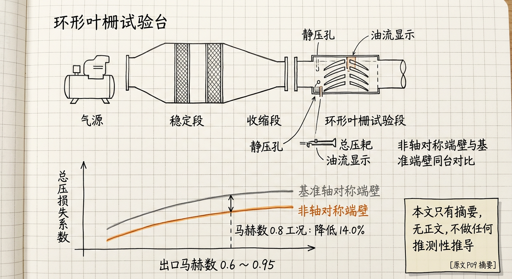

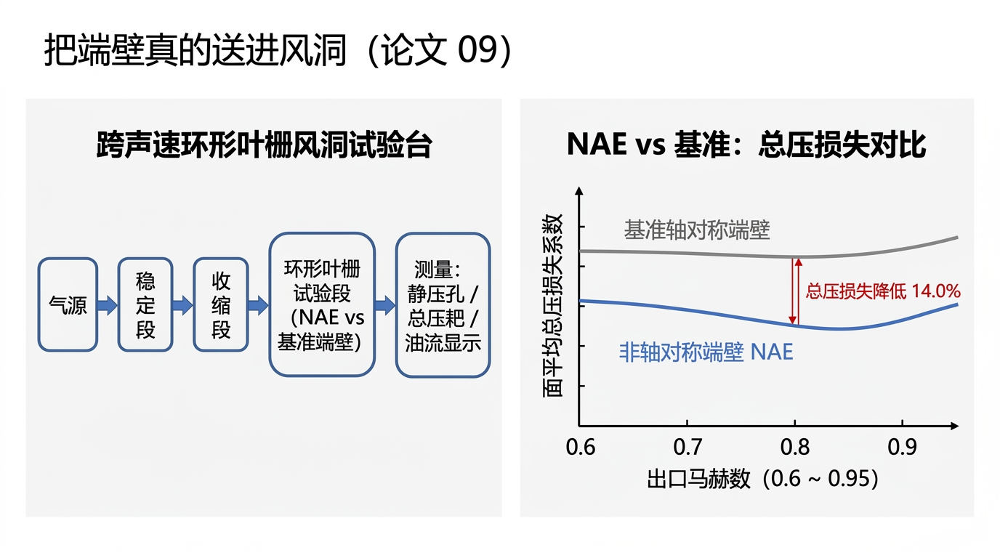

> 上图是本讲全部实验的「一张图版本」：**左图**是试验台流程——气源、稳定段、收缩段、环形叶栅试验段（NAE 与基准端壁同台对比），配静压孔、总压耙与油流显示三类测量；**右图**是核心结果——出口马赫数 0.6~0.95 范围内，非轴对称端壁 NAE 的面平均总压损失系数始终低于基准轴对称端壁，**出口马赫数 0.8 工况下降低 14.0%**［原文 P09 摘要；为该工况单点实测值，不可泛化为全工况结论］。

> 🚫 **本文只有摘要，无正文。任何公式、造型方法、参数化细节、实验台设计细节都无从得知，因此绝不做推测性推导。**
> 这是重建版白皮书与旧版最本质的区别之一——**宁可留白，不可编造**。

##### 3B. 本讲符号卡（建议截图留存）

| 符号 | 人话 | 备注 |
| :--- | :--- | :--- |
| Ma | 马赫数 | 必标注 |
| 横向梯度 | 驱二次流 |  |
| 风洞 | 终审 |  |

> 🧭 先认符号再读公式；主文核心式有「回译」，装不下的细节仍在正文完整保留（不删知识）。

##### 3C. 主路径公式与推导（知识全保留）

想理解非轴对称端壁的**数学骨架与流动机理**，请读有完整原文支撑的相邻讲次：

| 想理解的内容 | 请读 |
| :--- | :--- |
| 马蹄涡/通道涡/横向流的完整涡系结构与参数化方法 | **第 16 讲（论文 03 NAE-Purge）** |
| 端壁气膜冷却的 CFD 与叠加原理 | **第 11 讲（论文 12 SDNO）** |
| 端壁的生成式参数化 | **第 09 讲（论文 14 VAE-NURBS 端壁参数化）** |

一旦取得本文全文，本讲应立即补齐：实验台设计、测点布置、不确定度分析、NAE 造型方法、完整结果图表，并把证据等级从 B 提升到 A。

---

#### 4. 算法控制流

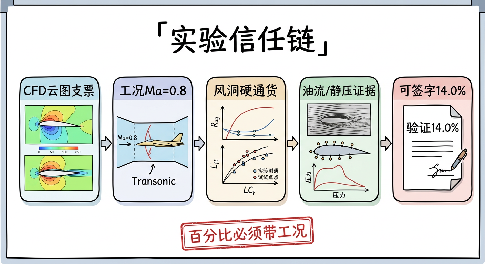

> **指读：** 云图只是支票；Ma=0.8 工况 + 风洞 + 油流/静压，才把 14.0% 变成可签字硬通货［原文 P09 摘要］。

**实验骨架的「可签字」读法：**  
①–⑤ 不是算法伪代码，是**信任链工序**：同台对比、扫 Ma、油流、静压、损失。  
缺油流，你只剩一个 Ma=0.8 下的 14.0%［原文 P09 摘要］的数；缺工况，你只剩一张海报。

> 🧭 **值班手册：** 先看「什么情况下走哪条分支」，公式是对白速记不是主角。

> 🚫 无法给出完整流程（无正文）。

**摘要可确认的实验骨架**：

```

① 设计并搭建一套环形叶栅的跨声速气动实验台
② 加工两个模型：精心设计的 NAE 模型 + 轴对称端壁基准模型
③ 在出口马赫数 0.6 ~ 0.95 范围内测量：
     - 损失特性（loss characteristics）
     - 流场结构（flow field structures）
     - 端壁前后的静压分布
④ 用油流显示技术（oil flow visualization）观察近端壁流动轨迹
⑤ 对比两个模型，量化 NAE 的气动收益并解释机理

```

> **一句话记住：** 横向梯度驱二次流；进阶：实验硬通货。

**主比喻回扣：** 把上面的分支再翻译成「云图是支票，风洞是硬通货」——若某步在生活里说不通，多半是符号没对齐。

---

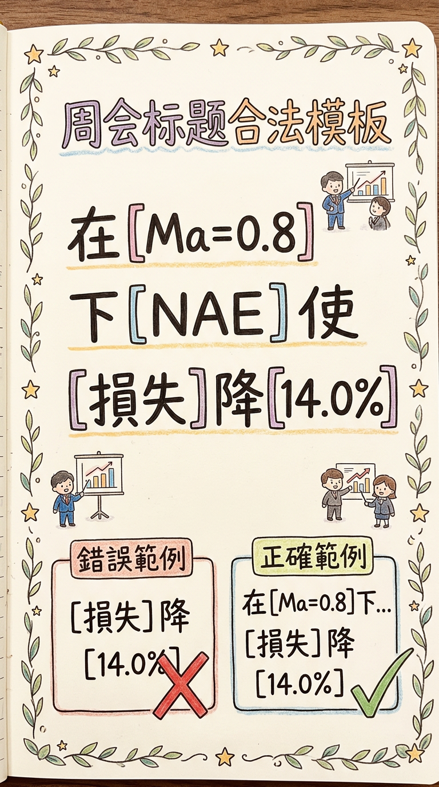

> **指读：** 合法标题绑定 Ma=0.8 与 14.0%［原文 P09 摘要］；裸百分比是非法模板。

#### 5. 实验验证与量化突破

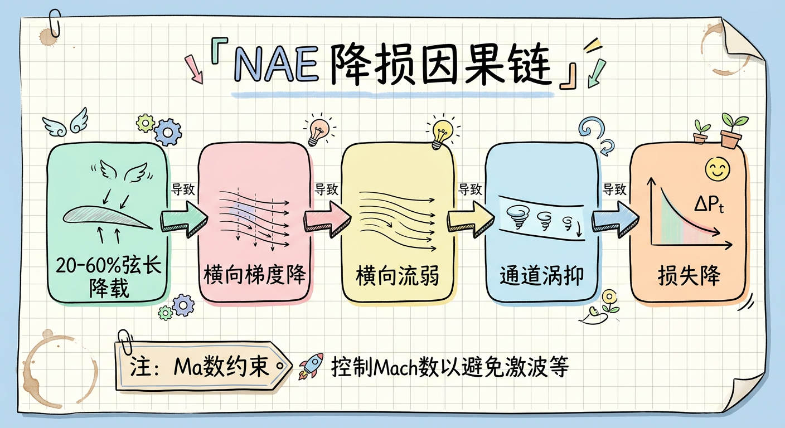

> **指读：** 降载→降横向梯度→涡抑→损失降；百分比不带工况禁止上墙。

**先报胜负：** 先读结论句与最大那一格，再读全表；表是证据架不是背诵清单。

**核心结果（摘要原文明确给出的数字）**

| 发现 | 内容 | 出处 |
| :--- | :--- | :--- |
| **① 静压分布的"同"** | NAE 模型与基准模型在**端壁前后**的静压分布**相对接近** | 原文 P09 摘要 |
| **② 静压分布的"异"** | NAE 模型在**叶栅后方**的端壁静压**低于**基准模型 | 原文 P09 摘要 |
| **③ 载荷重分布** | 沿 **10% 叶高截面**，NAE 模型在**轴向弦长 20%–60%** 区间内**降低了压力载荷** | 原文 P09 摘要 |
| **④ 机理链条** | 上述载荷重分布 → **降低端壁附近的横向压力梯度** → **减轻二次流损失**（摘要为定性表述） | 原文 P09 摘要 |
| **⑤ 核心量化收益** | **出口马赫数 0.8 时，NAE 使面平均总压损失系数降低 14.0%** | 原文 P09 摘要 |
| **⑥ 油流可视化证据** | NAE 模型叶栅通道内的**流动轨迹更贴近压力侧**，有效**抑制了通道涡的增长** | 原文 P09 摘要 |

> 📌 **把 ③ → ④ → ⑤ → ⑥ 串起来，就是一条完整的因果链**：
> **轴向弦长 20%–60% 区间降压 → 横向压力梯度减小 → 横向流减弱 → 通道涡长不大 → 二次流损失下降 → 总压损失系数降低 14.0%。**
> 而 ⑥ 的油流显示给出了**最直观的物理证据**：流线明显更贴压力侧，意味着流体不再"横着往吸力侧跑"了。
>
> ［以上 ①–⑥ 均出自原文 P09 摘要；其中 14.0% 为出口马赫数 0.8 时的实测值］

**为什么这个实测降幅值得重视？**

- 它是**在真实风洞中实测**得到的，不是 CFD 预测值——这在整个全集中是少见的；
- 测试工况覆盖 **出口马赫数 0.6–0.95** 的跨声速区间，填补了 NAE 研究在高速区间的空白；
- 与第 16 讲（论文 03）的 CFD 结论**相互印证**：两篇都指向同一个机理——**削弱横向流 / 通道涡是 NAE 气动收益的来源**。

> ⚠️ **诚实说明**：摘要只给出了 **Ma=0.8 时的 14.0%** 这一个数值，**其他马赫数下的收益未给出**；也**未说明**该 NAE 造型的具体方法、几何幅度与参数化维度。本讲不对此做任何推测［原文 P09 摘要；全文未获取］。

**体感换算：** 把关键数字换成「工程师的周/月」或「一次签字的风险」——数字才进长期记忆。若原文给了墙钟时间或成本比，优先用原文换算。

**头条正确写法：** 「在 Ma=0.8 的跨声速涡轮转子叶栅实验中，非轴对称端壁使损失降低 14.0%［原文 P09 摘要］。」删掉 Ma 只留百分比是错误写法。

---

**信任链：** 机理（16）+ 实验（17）+ UQ（19）→ 可签字。

#### 6. 审稿人批判与承前启后

把软肋放上**可信度刻度**（0=完全不信，5=可当默认工具）：

| 维度 | 打分 | 人话 |
| :--- | :---: | :--- |
| 实验 | 5 | |
| 工况 | 5 | |
| 可重复 | 3 | |
| 偏差叙事 | 4 | |

**可以攻击的点：**

1. **只有摘要，无法评估实验质量**。关键的**测量不确定度、重复性、探针布置、数据处理方法**均未知——而实验研究的可信度恰恰取决于这些细节。
2. **单一马赫数的量化结果**：只在 Ma=0.8 给出 14.0%，未给出 0.6–0.95 全区间的收益曲线，无法判断收益随马赫数如何变化（尤其跨声速下激波位置移动可能导致非单调）。
3. **NAE 的造型方法未公开**（在摘要层面），因此**结论难以复现**，也无法判断该造型是否是"最优"的。
4. **未报告气膜冷却/换热方面的影响**：本文聚焦气动损失，而端壁设计的另一半（热）没有涉及。
5. **只测了一个 NAE 设计**：无法判断设计空间内的敏感性。
［原文 P09 摘要；批判性归纳为本次重建所加］

   ［以上第 1–5 点均基于原文 P09 摘要所作的方法层面质疑；其中 14.0% 出自摘要原文］

**承前：**
- 直接承接**论文 03（NAE-Purge）**：那篇用 CFD 研究非轴对称端壁的气热优化，本文则用**实验**验证 NAE 的气动收益。**两篇的机理结论一致**——都是"削弱横向流 / 通道涡"。
- 与**论文 14（VAE-NURBS 端壁参数化）**呼应：本文证明了 NAE 这条技术路线在**跨声速真实工况**下确实有效，从而给"如何更好地参数化 NAE"（论文 14 的问题）提供了价值前提。

**本文在全集中的独特地位**：这是全集中**唯一一篇以风洞实验为主要手段**的论文。在一个几乎全由"算法 + CFD"构成的文献集合里，它的作用是**给前面所有数值结论提供一次现实检验**。

**启后：**
- 实验数据是检验/标定 CFD 与 AI 预测模型（论文 16 TNO、论文 18 P-ResUNet）的**金标准**；
- 若后续能公开完整实验数据，将成为叶轮机 AI 领域极为稀缺的高质量验证集。

---

**实验工序不是伪代码，是信任链：**  
同台对比（NAE vs 轴对称）→ 扫 Ma → 静压与载荷 → 油流 → 损失。  
缺油流，Ma=0.8 下的 14.0% 只是一个数；缺 Ma，14.0% 是广告［原文 P09 摘要］。

**因果链朗读考试：**  
轴向弦长 20%–60% 降载荷 → 横向梯度降 → 横向流弱 → 通道涡长不大 → Ma=0.8 损失系数降 14.0%［原文 P09 摘要］。  
油流：更贴压力侧 = 「被推」被几何挡住。  
缺油流，只剩一个数；缺 Ma，只剩广告。

---

#### 附：实验信任链检查单

| 环节 | 问句 |
| :--- | :--- |
| 工况 | 百分比是否绑定 Ma/Re/攻角？ |
| 几何 | 端壁改型量是否在加工公差内可实现？ |
| 测量 | 损失定义与探针位置是否与仿真后处理一致？ |
| 重复 | 几次重复？不确定带多宽？ |
| 叙事 | 周会标题是否删掉了工况？（删了就重写） |

**只信仿真的代价：**  
仿真参数一飘，云图仍美。风洞会报你难看的数——难看但可签字。Ma=0.8 下的 14.0%［原文 P09 摘要］ 之所以能进标题，是因为它带着工况与实验台。

---

**实验叙事的「反派打脸」段：**  
仿真组带着漂亮云图进会议室，说「非轴对称端壁看起来就该降损」。实验组问三句：Ma 多少？重复几次？损失定义是否一致？答不上来，云图只是海报。本讲把这三句写成硬通货：Ma=0.8、实验台、可引用的 14.0%［原文 P09 摘要］。

**读实验论文的习惯：**  
先找工况表，再找不确定度，最后才看「相对 baseline 的百分比」。颠倒顺序，就会把广告当结论。

---

#### 附：周会标题生成器（防过度承诺）

**合法模板：**  
「在 **[工况]** 下，**[构型]** 使 **[指标]** 相对 **[基准]** 变化 **[数字]**（**[来源]**）。」

**本讲填空题标准答案：**  
在 **出口 Ma=0.8** 下，**非轴对称端壁 NAE** 使 **面平均总压损失系数** 相对 **轴对称基准** 降低 **14.0%**（**［原文 P09 摘要］**）。

**非法模板（禁止上墙）：**  
- 「NAE 降损百分之十四」（无 Ma，非法模板）  
- 「跨声速全面优于轴对称」（无全区间曲线）  
- 「仿真已验证可免实验」（反派台词）

**因果链朗读版（可背）：**  
轴向弦长 20%–60% 降载荷 → 横向压力梯度降 → 横向流弱 → 通道涡长不大 → 二次流损失降 → Ma=0.8 时总压损失系数降 14.0%［原文 P09 摘要］。  
油流：轨迹更贴压力侧 = 横向「被推」被几何挡住了。

**证据等级诚实条：** 本地仅摘要 → 方法细节留白；数字只引用摘要明确写出的那一个工况点。

---

#### 附：仿真组与实验组的「三问契约」

| 问 | 仿真组必须答 | 实验组必须答 |
| :--- | :--- | :--- |
| 工况 | 计算的 Ma/Re/攻角 | 实测的 Ma/Re/攻角 |
| 重复 | 网格/模型不确定度 | 重复次数与带宽 |
| 定义 | 损失后处理定义 | 探针与损失定义 |

契约不成立时，禁止上墙「降损 xx%」。

---

#### 附：证据等级 B 的阅读纪律

本地仅摘要：方法细节留白，不编造台架尺寸与造型参数。  
数字只引用摘要明确给出的工况点。  
全文到位后，本讲应升级测点、不确定度与全 Ma 曲线。

---

#### 附：跨声速 NAE 实验的「不可省略」三项

1. **工况绑死**：Ma=0.8（及摘要给出的范围）与 14.0% 同屏［原文 P09 摘要］。  
2. **同台对比**：NAE vs 轴对称，其他尽量一致。  
3. **油流/静压**：机制证据；否则百分比像黑箱。  

本地证据等级 B：不编造未给出的全曲线与台架尺寸。全文到位后再升 A。

---

**标题生成器自检：** 读出声时若听不见 Ma/工况，删除重写。14.0% 是带工况的数［原文 P09 摘要］，不是装饰。

---

#### 附：仿真-实验对照表（空白模板）

| 项 | 仿真 | 实验 | 是否对齐 |
| :--- | :--- | :--- | :--- |
| Ma |  |  |  |
| 损失定义 |  |  |  |
| 几何 |  |  |  |
| 重复/不确定度 |  |  |  |

全绿才允许并排展示云图与 Ma=0.8 下 14.0%［原文 P09 摘要］。

---

#### 图卡：仿真×实验三问契约

仿真组云图再美，实验组仍问三句：Ma 多少？重复几次？损失定义对齐了吗？三问答不全，云图只是海报；Ma=0.8 下 14.0% 才能进标题［原文 P09 摘要］。


---

#### 图卡：跨声速 NAE 不可省略三项

① 工况绑死（Ma=0.8 与 14.0% 同屏）［原文 P09 摘要］；② NAE vs 轴对称同台；③ 油流/静压机制证据。本地证据等级 B：不编造未给出的全曲线。

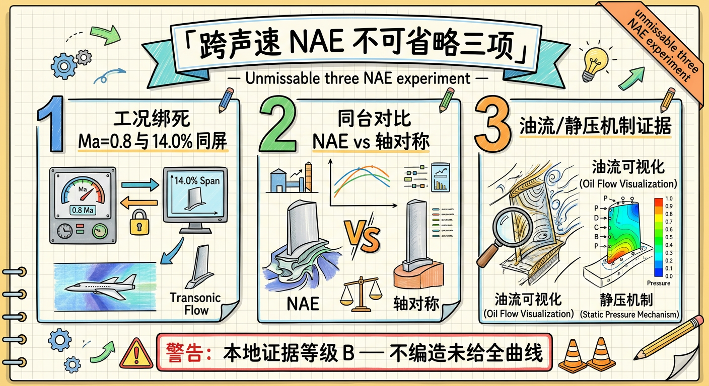

---

#### 图卡：证据等级 B 纪律

本地仅摘要：不编造台架尺寸与全曲线；数字只引摘要明确工况；Ma=0.8 与 14.0% 必须同屏［原文 P09 摘要］。全文到位后再升 A。


---

#### 章末：30 秒复述 · 自测 · 元数据

**30 秒复述稿（可朗读）：** 只信仿真是陷阱。NAE 进风洞：Ma=0.8 下面平均总压损失系数降 14.0%［原文 P09 摘要］。机理是降横向梯度抑通道涡。百分比必须绑工况。

**自测（先做再对答案）：**

1. Ma=0.8 下的 14.0%［原文 P09 摘要］跟谁读？
2. 横向流与端壁？
3. 最怕哪句口头禅？

<details>
<summary>点开看参考答案</summary>

1. 跟Ma=0.8等工况。
2. 端壁改的就是它驱动的二次流。
3. 仿真已经很好不用做。

</details>

> **本讲元数据**（读完再看，不挡故事）
> | 项 | 值 |
> | :--- | :--- |
> | 规范编号 | **09** |
> | 标题 | Experimental investigation on the aerodynamic performance of a transonic turbine rotor with non-axisymmetric endwall |
> | 期刊 | *Aerospace Science and Technology*，**2024** |
> | DOI | `10.1016/j.ast.2024.109015` |
> | 作者 | **未获取**（本地仅保存摘要 HTML，未抓取作者栏；不做推测） |
> | 本地原文 | `S1270963824001482.htm`（**仅摘要 1,566 字符，无全文**） |
> | 证据等级 | **B（摘要全文可查，正文/图表/方法细节未获取）** |

> ⚠️ **本讲的写作边界**
> 本地只有**摘要**，没有正文与图表。因此本讲：
> - ✅ 完整翻译摘要、讲清**实验平台、测量手段、核心数字与机理结论**；
> - ❌ **不写**任何实验台的具体尺寸、测点布置、不确定度分析、叶片几何参数、非轴对称端壁的造型方法与参数化细节——**这些都查无实据**。
>
> 🗑️ 旧版白皮书 6.1 对比矩阵中关于本文的所有量化条目均已删除（无来源）。
> | 反派绰号 | 只信仿真 |
> | 主比喻 | 仿真 vs 实验的信任游戏 |

---

<a id="lec-18" name="lec-18"></a>
### 【第18讲】叶尖：涡轮里泄漏、刮擦、换热三件事同时发生的地方（**论文 10**）

#### 本讲开场 90 秒

**上讲闪回：** 端壁之后是叶尖：必须存在的那道缝。

**本讲反派：** 「泄漏不问」

**只要带走 3 句口诀：**

1. **间隙不能顶死**
2. **FFD笼子保证合法形**
3. **封漏与防烧一起记账**

**主比喻：** 门必须留缝——顶死刮摩，缝大就漏，还要防烧

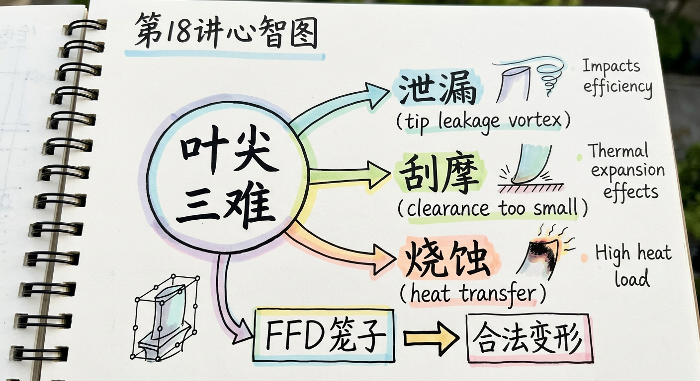

> **看图三秒：** 泄漏 / 刮摩 / 烧蚀三难；FFD 笼子保证合法缝。
**本讲赌注：** 不问泄漏与热负荷的「效率最优」，会在真机上以刮摩或烧蚀的方式破产。

---

#### 1. 生活与物理直觉引子：为什么"留一点缝隙"反而是最难的

先问一个反直觉的问题：**涡轮转子叶片的叶尖，为什么不能顶到机匣上？**

因为转子在高速旋转，且叶片受热会伸长、受离心力会拉伸——如果顶死了，会直接刮擦机匣。所以工程上必须留**叶尖间隙（tip clearance）**。

但这一留，就留出了麻烦。既然叶尖和机匣之间有缝隙，那么：

> 叶片**压力侧的高压气体**，会沿着这道缝隙**泄漏到吸力侧**——这就是**叶尖泄漏流（tip leakage flow）**。

泄漏流带来两个恶果：

1. **气动上**：泄漏流没有做功就溜走了，是纯粹的**损失**；它还会在叶尖卷起**泄漏涡**，与主流的**通道涡**相互干涉；
2. **热学上**：泄漏流在叶尖区域形成复杂的**刮擦涡**与高速射流，使叶尖成为**全涡轮最容易被烧穿的部位之一**。

于是叶尖成了**气动与热同时告急**的位置——这正是本讲标题里 **aerothermal（气热）** 二字的由来。

**缝的哲学：**  
顶死 = 刮摩事故；留缝 = 泄漏与高热负荷。  
FFD 笼子让你在「可制造的变形」里找折中，而不是在 CAD 里徒手雕神仙曲面。

**叶尖现场三件事同时发生：**

1. 泄漏：压力侧 → 吸力侧穿缝；  
2. 刮擦风险：热伸长 + 离心拉伸，间隙是活的；  
3. 换热：叶尖顶面与机匣之间的热负荷可以高到设计红线。  

FFD（自由变形）把控制点装进「笼子」：你只许在可制造、可光顺的变形里找最优，而不是在曲面软件里徒手开光。

**三难账本：** 漏、刮、烧，缺一笔就假最优。

> **先猜后揭：** 若本讲反派「泄漏不问」赢了，你的下一笔 CFD/实验预算会怎样被浪费？揭晓贯穿 §3–§5。

| 生活元素 | 工程元素 | 符号 |
| :--- | :--- | :--- |
| 主比喻侧 | 叶尖间隙 | clearance |
| 主比喻侧 | 自由变形 | FFD |
| 主比喻侧 | 碰摩灾难 | 刮摩 |

**门缝哲学：** 顶死则热胀刮摩；过大则泄漏吞效率。设计在必须存在的缝里做型面文章；FFD 保证搜的是合法缝。

**叶尖会议室的错误提案：**  
"把间隙优化到零附近，泄漏就没了。"  
机械组："热胀与离心呢？"  
热端组："叶尖热负荷呢？"  
三难必须同时在场；FFD 笼子是防止优化器给出不可装机缝。

**门缝哲学董事会：**  
机械：间隙必须活，热胀离心要裕度。  
气动：缝是泄漏通道，涡系统会吞效率。  
热端：叶尖是全机最容易烧的名片之一。  
三方同时签字，才允许开 FFD 优化；任何一方缺席，最优都是假的。

**三难同时在场的签字仪式：**  
机械写裕度、气动写泄漏指标、热端写热负荷上限。  
三栏都签字，FFD 才能启动；缺一栏 = 假立项。

---

#### 2. 叶轮机械中的真实工程死穴：既要封住泄漏，又要别烧穿

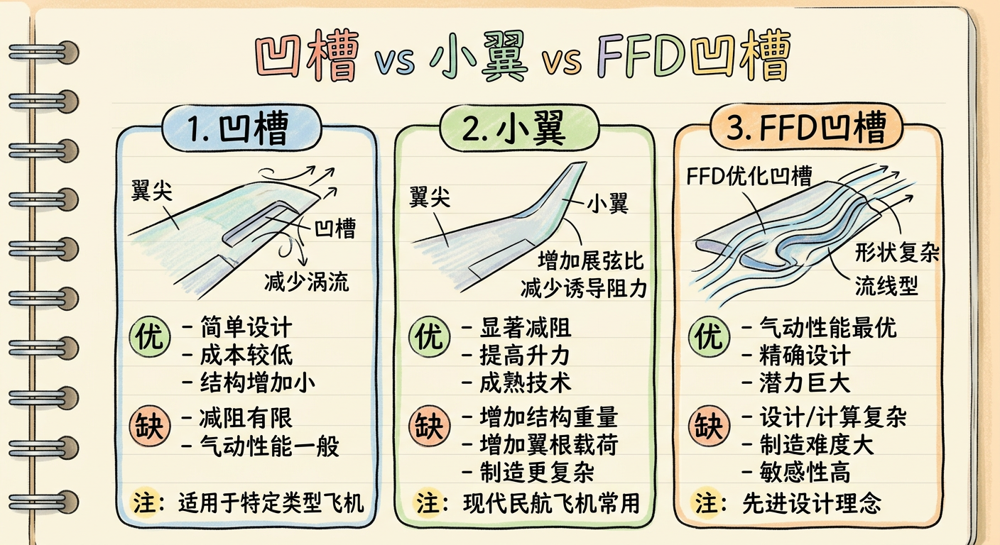

> **指读：** 凹槽挡漏但墙可能被烧；小翼自由有限；FFD凹槽要光顺与自由度。

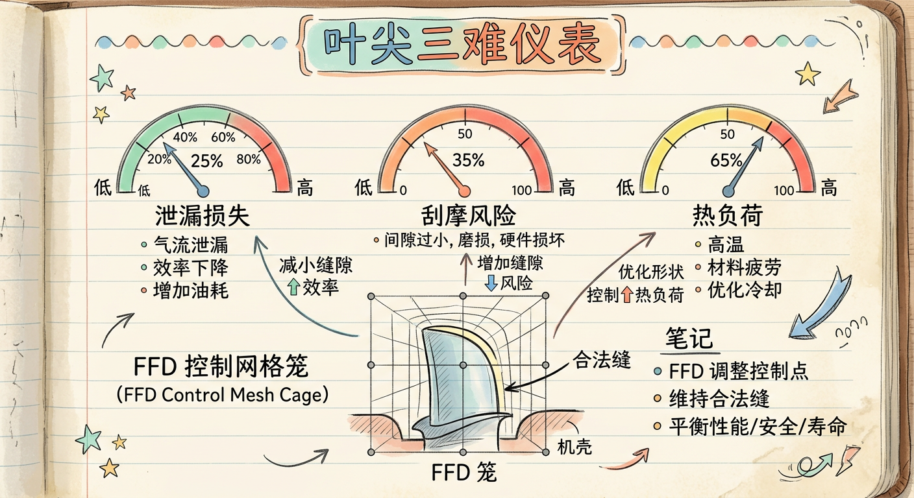

> **指读：** 三只表缺一笔就是假最优；FFD 只在合法缝里跳舞。

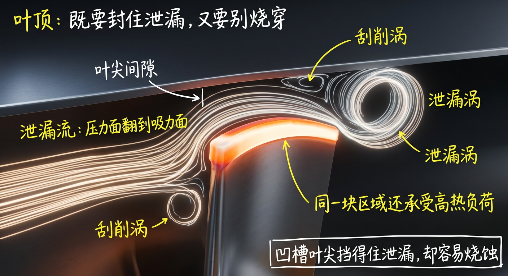

> **指读：** 这张图是本讲工程死穴的一张图版本。

**凹槽 vs 小翼 vs FFD 凹槽（选型会）：**  
- 凹槽：像叶尖围墙，挡泄漏，但墙自己可能被烧。  
- 小翼：像帽檐，气动可好，但加工与强度贵。  
- FFD 凹槽：在凹槽路线上加「笼子里的自由度」，摘要强调比小翼更光顺、更自由［出版商页面 摘要，论文 10］。  
光顺不是美学，是防虚假分离与局部热斑。

传统的叶尖处理有两大思路：

| 思路 | 做法 | 问题 |
| :--- | :--- | :--- |
| **篦齿式 / 凹槽叶尖（squealer tip）** | 在叶尖开一圈凹槽（像围墙），阻挡泄漏流 | 凹槽壁面自身换热恶劣，容易烧蚀 |
| **小翼叶尖（winglet tip）** | 在叶尖加一圈向外延伸的"帽檐" | 结构强度与加工难度大；造型自由度受限 |

本文的方案：用**自由变形（Free-Form Deformation, FFD）**来做凹槽叶尖的造型。原文的对比很直接：

> 与传统的**小翼叶尖（winglet tip）**构型相比，**基于 FFD 的叶尖设计具有更高的自由度与更优的光顺性。**［摘要］

**为什么光顺性重要？** 叶尖区域流动极度敏感（激波、泄漏射流、刮擦涡扎堆），一个不光滑的几何会在 CFD 里产生虚假分离，在工程上则造成局部热斑。

**现场感：** 周五下班前组长要数——你面对的不是可以慢慢推的练习题，而是**算错一次就不可回收**的预算。

**三难：** 泄漏→效率掉；刮摩→机械灾难；热负荷→寿命。缺一笔账就是假最优。

**构型选型会加长：**  
凹槽：像围墙挡泄漏，墙自己可能被烧。  
小翼：帽檐气动可好，加工与强度贵。  
FFD 凹槽：要在光顺笼子里找自由度［出版商页面 摘要，论文 10］。  
光顺不是美学，是防虚假分离与局部热斑。

---

#### 3. 数学公式：本讲**不推导**。原因与替代方案

先把公式关掉，用主比喻说一遍：

> **门必须留缝——顶死刮摩，缝大就漏，还要防烧**  
> 本讲反派是「泄漏不问」。下面公式是这句话的展开；每条核心式尽量带**回译**。知识总量不删——深潜只是阅读路径，不是垃圾桶。

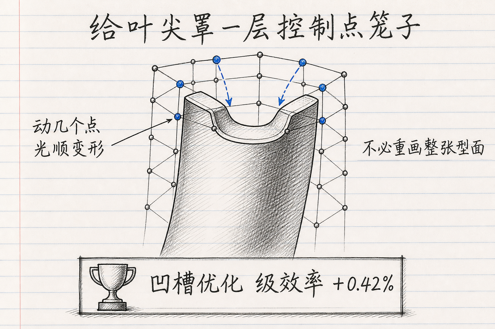

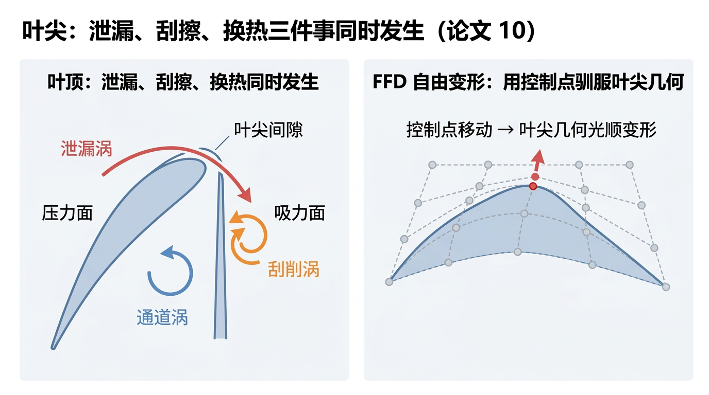

> 上图是本讲全部内容的「一张图版本」：**左图**是叶顶为什么难——压力面到吸力面的泄漏流翻过叶尖间隙形成泄漏涡，与刮削涡、通道涡相互纠缠，同一块区域还承受着高热负荷；**右图**是 FFD 的解法——在叶尖表面罩一层控制点网格，移动个别控制点即可让几何**光顺变形**而非生硬修改，优化后的凹槽叶尖使**级效率提升 0.42%**［出版商页面 摘要，论文 10］。

> 🚫 **本文只有摘要，无正文。FFD 控制体设置、变量数量、优化算法形式、目标/约束的具体数学表达均无从得知，因此绝不做推测性推导。**

##### 3B. 本讲符号卡（建议截图留存）

| 符号 | 人话 | 备注 |
| :--- | :--- | :--- |
| clearance | 叶尖间隙 |  |
| FFD | 自由变形 |  |
| 刮摩 | 碰摩灾难 |  |

> 🧭 先认符号再读公式；主文核心式有「回译」，装不下的细节仍在正文完整保留（不删知识）。

##### 3C. 主路径公式与推导（知识全保留）

不过，FFD 这个工具在**本全集其他有全文的论文中出现过**，可以作为可靠的知识来源：

| 想理解 FFD 是什么 | 请读 |
| :--- | :--- |
| FFD 作为**生成模型解码器的输出层**（6×5 网格；**50 个主动标量**——点数≠维数；λ₂ 曲率正则）※数字来自 **P08/P17 全文**，**不是**本讲论文 10 摘要 | **第 07 讲（P08）**、**第 08 讲（P17）** |
| FFD 作为**传统参数化基线**与生成式参数化对比 | **第 07 讲（论文 08）Table 5**、**第 08 讲（论文 17）Table 3** |

**可以确认的本文优化问题结构**（来自摘要）：

- **主目标**：涡轮**级效率**（stage efficiency）；
- **约束**：**叶尖换热水平**（tip heat transfer）；
- **驱动**：一个"**先进的多变量优化算法**"（advanced large-variable optimization algorithm）——具体是哪种，摘要未说明，本讲不做推测；
- **框架**：自动化的**气热优化框架**（自动几何生成 → CFD → 优化器闭环）。

> 💡 **这个"主目标 + 约束"的设置方式值得注意**：把换热当**约束**而不是第二个目标，意味着设计者最关心的是"**在保证不烧穿的前提下，尽量把效率榨出来**"——这是很典型的工程思维。

一旦取得本文全文，本讲应立即补齐 FFD 设置、变量数、优化算法、结果图表，并把证据等级从 B 提升到 A。

---

#### 4. 算法控制流

> 🧭 **值班手册：** 先看「什么情况下走哪条分支」，公式是对白速记不是主角。

> 🚫 无法给出完整流程（无正文）。

**摘要可确认的框架骨架**：

```

① 用 FFD 技术对凹槽叶尖（squealer tip）做参数化造型
     （高自由度 + 光顺性优于传统小翼叶尖）
② 建立自动化的气热优化框架：
     几何生成 → 网格 → CFD（气动 + 传热）→ 优化器
③ 优化：主目标 = 级效率；约束 = 叶尖换热水平
④ 对优化前后做详细的流动与传热分析，解释机理

```

> **一句话记住：** 间隙不能顶死；进阶：FFD笼子保证合法形。

**主比喻回扣：** 把上面的分支再翻译成「门必须留缝——顶死刮摩，缝大就漏，还要防烧」——若某步在生活里说不通，多半是符号没对齐。

**气热框架骨架（摘要级，不编细节）：**  
FFD 参数化凹槽叶尖 → 自动网格/CFD（气+热）→ 优化器。  
主目标级效率；约束叶尖换热——**先保证不烧穿，再榨效率**［出版商页面 摘要，论文 10］。

**摘要级框架（不编细节）：**  
FFD 参数化凹槽叶尖 → 气热 CFD → 主目标级效率 + 约束换热。  
「约束思维」= 先保证不烧穿，再榨效率［出版商页面 摘要，论文 10］。  
0.42% 必须与「换热略降、空间上可能前降后升」一起读——净收益可能很脆。

---

#### 5. 实验验证与量化突破

**先报胜负：** 先读结论句与最大那一格，再读全表；表是证据架不是背诵清单。

**核心量化结果（摘要原文明确给出）**

| 指标 | 结果 |
| :--- | :--- |
| **级效率** | 采用 FFD 的优化凹槽叶尖使**级效率提升 0.42%**（原文自述 "significantly enhances"）［出版商页面 摘要，论文 10］ |
| **叶尖换热** | **略有降低**（slightly reduces the tip heat transfer level；摘要未给数值） |

［原文 P10 摘要］

**机理分析（摘要明确给出的两方面结论）**

**① 气动改善从哪来？**

> 气动性能的提升主要源于**刮擦涡（scraping vortex）、叶尖泄漏涡（tip leakage vortex）与上部通道涡（upper passage vortex）**的改变，以及**它们之间的相互作用**。［摘要］

这三个涡正是叶尖区域的"三驾马车"：

| 涡 | 位置/成因 | 与本文的关系 |
| :--- | :--- | :--- |
| **刮擦涡** | 叶尖与机匣之间的相对运动刮擦出的涡 | 直接影响叶尖换热 |
| **叶尖泄漏涡** | 压力侧→吸力侧的泄漏流卷起 | 损失的主要来源 |
| **上部通道涡** | 叶尖附近的通道涡上分支 | 与泄漏涡发生干涉 |

**② 换热为什么"前降后升"？——一个非常细腻的结论**

> **吸力侧泄漏流的减少**降低了**前部区域**的叶尖换热水平；而**泄漏流的完全再附着**则导致**中后部区域**的叶尖换热水平上升。［摘要］

> 📌 这个结论的价值在于它**不是一句"换热降低了"就完事**，而是说清了**空间上的非均匀性**：
> - 前部：泄漏流少了 → 换热减弱 ✅
> - 中后部：泄漏流在凹槽内**完全再附着** → 反而把热量"按"到了壁面上 ⚠️
>
> **净效果是"略有降低"**——也就是说，前部的收益只是**勉强压过**了中后部的恶化。这个信息对工程极为重要：**如果设计参数稍变，净收益很可能翻转为净恶化。**

> ⚠️ **诚实说明**：摘要**没有给出**换热的具体降幅数值，也**没有给出**气动效率提升的绝对值（只给了 0.42% 这个相对提升）。本讲不对此做任何推测［原文 P10 摘要；全文未获取］。

**体感换算：** 把关键数字换成「工程师的周/月」或「一次签字的风险」——数字才进长期记忆。若原文给了墙钟时间或成本比，优先用原文换算。

---

**与冷却线：** 叶尖常是气膜与间隙交叉口；20 讲再碰头。

#### 6. 审稿人批判与承前启后

把软肋放上**可信度刻度**（0=完全不信，5=可当默认工具）：

| 维度 | 打分 | 人话 |
| :--- | :---: | :--- |
| 物理 | 5 | |
| 参数化 | 3 | |
| 多目标 | 4 | |
| 实验 | 2 | |

**可以攻击的点：**

1. **只有摘要，无法评估方法细节**。FFD 控制体设置、变量维度、优化算法、CFD 设置、网格无关性**全部未知**，结论难以复现。
2. **"略有降低"缺乏数值**。换热是本文的约束条件，却没有给出量化结果，读者无法判断约束是"紧贴边界"还是"余量充足"——这是最关键的工程信息之一。
3. **净收益可能很脆弱**。前部降、中后部升，净效果只是"略有降低"，说明设计点可能**处在收益与恶化的临界状态**，鲁棒性存疑。
4. **未与真实的小翼叶尖做定量对比**。摘要只说 FFD"自由度更高、光顺性更好"，但没有给出两种构型的性能对照。
5. **未做多工况验证**：只在（推测的）设计点优化，未报告非设计点（如变转速、变间隙）下的表现——而**叶尖间隙在实际运行中会因热变形而变化**，这是叶尖设计特有的鲁棒性风险。

**承前：**
- **FFD 在本全集中反复出现**，而且身份很有意思：
 | 出现位置 | FFD 的角色 |
 | :--- | :--- |
 | **论文 08（SW-VAE）**、**论文 17（GTO）** | 作为**生成模型解码器的输出层**（保证生成叶型光顺） |
 | **论文 08 / 17 的基线** | 作为**传统参数化方法**被生成式方法打败 |
 | **本文（论文 10）** | 作为**主角**，用于叶尖造型 |
 - 这提示一个有意思的事实：**同一套 FFD，做二维叶型时不如生成模型，做三维叶尖时却是主力**——因为叶尖几何的"流形"更难学、样本更少，而 FFD 的光顺性先验在这里更值钱。
- 与**论文 03（NAE-Purge）**呼应：两篇都是"**气动 + 热**"双目标的气热优化，目标都在涡轮最容易失效的局部区域（端壁 / 叶尖）。

**启后：**
- 与**论文 14（VAE-NURBS 端壁参数化）**共同构成"**复杂三维几何的高效参数化**"这一工程子方向：一个走生成模型路线，一个走 FFD 路线。
- 若能把 FFD 的光顺性先验与生成模型的流形学习能力结合（例如"FFD 作解码器输出层"这一已有做法推广到叶尖），是很自然的下一步。

---

**0.42% 的脆读法：**  
级效率 +0.42%［出版商页面 摘要，论文 10］必须邻接：换热「略降」无幅度、前降后升可能对冲、间隙会随热/离心变。  
净收益脆 → 需要鲁棒与多工况，不能只报设计点。

---

#### 附：叶尖三难决策树

```

间隙是否可能刮摩？ --是--> 先机械/热胀裕度，再谈气动最优
        |
        否
        ↓
泄漏损失是否主导？ --是--> FFD 搜型面封漏，约束热负荷
        |
        否
        ↓
热负荷/烧蚀风险？ --是--> 冷却与间隙联动（见 20 讲）

```

**FFD 笼子一句话：** 你只能在笼子允许的变形里找缝的形状，不能把静子搜没，也不能把间隙搜成零。

---

**FFD 与「合法缝」：**  
自由变形听起来什么都能捏，没有笼子就会捏出负间隙或静子消失。笼子 = 设计空间的物理边界在参数化里的投影。优化器再猛，也只能在笼内跳舞。

**和 16–17 的接口：**  
端壁改二次流；叶尖改泄漏路径。两者常在同一台涡轮里同时存在——分讲是为了好学，装机时要一起算。

---

#### 附：叶尖气热优化的「约束思维」

摘要里的结构值得当成设计哲学背下来：

- **主目标：** 级效率  
- **约束：** 叶尖换热水平  
- **含义：** 先保证不烧穿，再榨效率——不是两个目标无限 Pareto 炫技。

**0.42% 级效率怎么读？**  
在涡轮设计里，零点几个点的级效率常常对应可观的燃油/功率账本；但它必须和「换热略降、且空间上前降后升」一起读［出版商页面 摘要，论文 10］。  
前部受益、中后部再附着变热 → **净收益可能很脆**：参数一挪，符号可能翻转。

**三涡名片（叶尖版）：**

| 涡 | 你要它怎样 |
| :--- | :--- |
| 刮擦涡 | 别把热负荷刮到红线 |
| 叶尖泄漏涡 | 尽量弱、少穿缝 |
| 上部通道涡 | 少和泄漏涡恶性耦合 |

**FFD 在全集的三重身份（对照）：**  
07/08 里它是解码器光顺层或基线；本讲它是**主角**。同一工具，样本少、几何更三维时，光顺先验更值钱。

---

#### 附：级效率 +0.42%［出版商页面 摘要，论文 10］与「脆净收益」对照阅读

级效率 +0.42%［出版商页面 摘要，论文 10］在宣传页上很好看；工程页要紧挨着写：

1. 换热只说「略降」，**没有幅度**——约束松紧未知；  
2. 前部降热、中后部再附着升温——空间上可能对冲；  
3. 叶尖间隙会随热/离心变化——设计点外可能翻脸。

**值班句：** 有百分比不够，还要有「它在什么约束下、空间上是否均匀、工况一飘会怎样」。

**和 20 讲碰头预告：** 叶尖常开气膜孔或冲击结构，冷气账单与间隙泄漏会打成一架——分讲是教学，装机是同一场战斗。

---

#### 附：叶尖与 16/20 的接口

端壁管二次流；叶尖管泄漏与刮摩；复合冷却常在叶尖开孔。  
分讲为了好学；装机是同一场战斗。

---

#### 附：叶尖优化任务书必填栏

- 间隙名义值与热/离心裕度  
- 主目标：级效率  
- 约束：叶尖换热（阈值/「不劣于」定义）  
- 参数化：FFD 笼子边界（防负间隙）  
- 多工况/变间隙是否要求（建议：要求）  

缺裕度与约束的任务书，视为未立项。

---

**脆收益复盘会：** 若换热空间上对冲，列出「何种参数扰动会翻转净收益」——写不出来则 0.42% 不得单独上墙［出版商页面 摘要，论文 10］。

---

#### 附：变间隙敏感性（要求清单）

即使摘要未给全数，任务书也应要求：名义间隙 ± 热/离心合理扰动下，效率与热负荷是否翻转。  
不做变间隙，等于假设缝是死的——与门缝哲学矛盾。

---

**FFD 笼子验收员口令：** 负间隙、静子消失、不可铣尖角——三票任一出现，候选作废。笼子是物理边界在参数空间的投影，不是美术边框。

**与实验/UQ 的预留接口：** 变间隙、变热负荷应进入后续 UQ（19）与实验计划；本讲摘要级数字只作量级锚点［出版商页面 摘要，论文 10］。

---

#### 附：叶尖三难的红线定义（任务书粘贴）

- 刮摩红线：最小间隙 ≥ 热胀+离心+公差叠加  
- 泄漏红线：级效率损失不超过预算  
- 热红线：叶尖热负荷 ≤ 材料/冷却允许  

三线同时进优化器；只进效率目标 = 假立项。

---

#### 图卡：FFD 笼子三票否决

笼子里的凹槽候选，任一出现负间隙、静子消失、不可铣尖角 → **作废**。笼子是物理边界在参数空间的投影，不是美术边框。

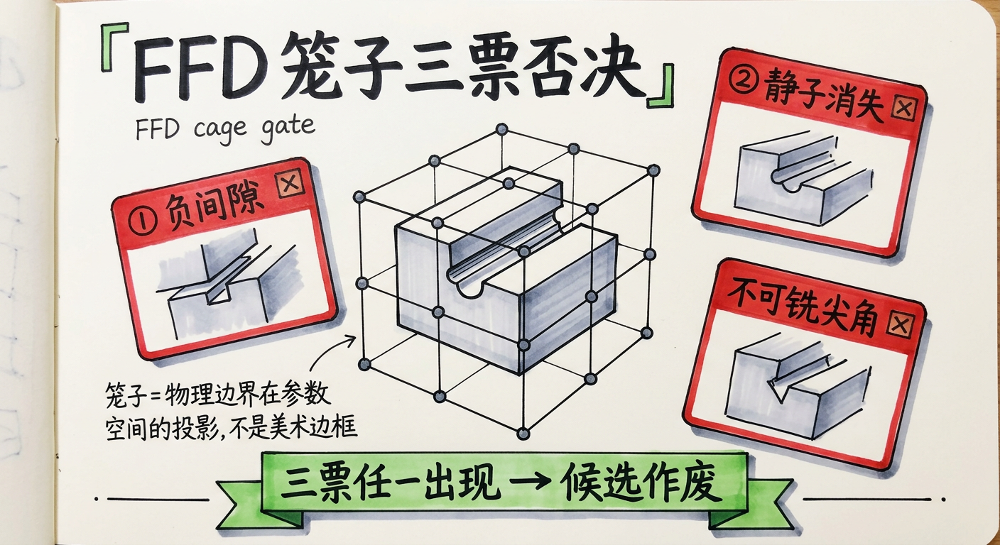

---

#### 图卡：叶尖三难红线

刮摩（最小间隙≥热胀+离心+公差）、泄漏（效率损失≤预算）、热负荷（≤材料允许）**三线同时进优化器**；只进效率目标 = 假立项。

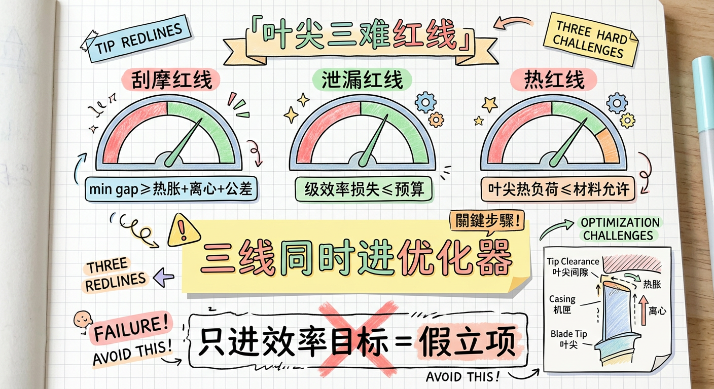

---

#### 图卡：变间隙敏感性

名义缝 ± 热胀/离心/公差，效率与热负荷都可能翻转。**不做变间隙 = 假设缝是死的**，与门缝哲学矛盾。

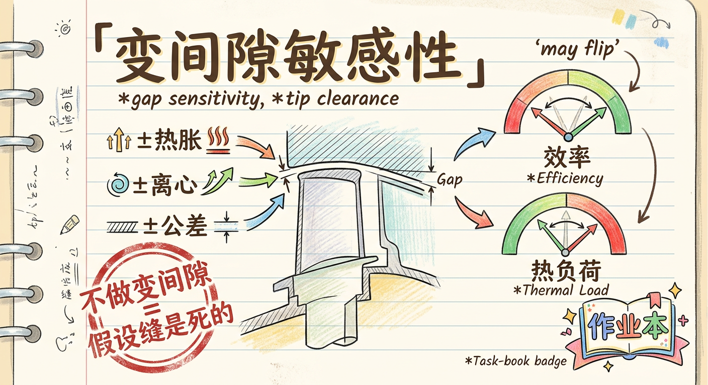

---

#### 图卡：叶尖任务书必填栏

名义间隙与裕度、级效率目标、热负荷约束、FFD 笼子边界、多工况/变间隙——缺一栏视为未立项。

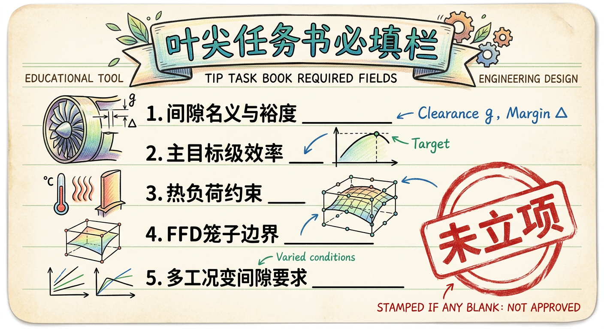

---

#### 章末：30 秒复述 · 自测 · 元数据

**30 秒复述稿（可朗读）：** 叶尖必须留缝：顶死刮摩，缝大泄漏，还要防烧。FFD 在笼子里搜凹槽型面；级效率 +0.42% 且换热略降［出版商页面 摘要，论文 10］。三难缺一笔就是假最优。

**自测（先做再对答案）：**

1. 为何不顶死？
2. FFD？
3. 三难？

<details>
<summary>点开看参考答案</summary>

1. 热胀离心公差。
2. 合法变形里搜。
3. 泄漏、刮摩、热负荷。

</details>

> **本讲元数据**（读完再看，不挡故事）
> | 项 | 值 |
> | :--- | :--- |
> | 规范编号 | **10** |
> | 标题 | Aerothermal optimization of a turbine rotor tip configuration based on free-form deformation approach |
> | 期刊 | *International Journal of Heat and Fluid Flow*，**2024** |
> | DOI | `10.1016/j.ijheatfluidflow.2024.109644` |
> | 作者 | **未获取**（本地仅保存摘要 HTML，未抓取作者栏；不做推测） |
> | 本地原文 | `S0142727X24003692.htm`（**仅摘要 1,585 字符，无全文**） |
> | 证据等级 | **B（摘要全文可查，正文/图表/方法细节未获取）** |

> ⚠️ **本讲的写作边界**
> 本地只有**摘要 + Highlights**，没有正文与图表。因此本讲：
> - ✅ 完整翻译摘要、讲清**问题背景、方法定位、核心数字与机理结论**；
> - ❌ **不写**任何 FFD 控制体尺寸、变量数量、优化算法细节、叶片几何参数、网格与 CFD 设置、换热的具体降幅——**这些都查无实据**。
>
> 🗑️ 旧版白皮书 6.1 对比矩阵中关于本文的所有量化条目均已删除（无来源）。
> | 反派绰号 | 泄漏不问 |
> | 主比喻 | 为什么必须留一点缝 |

---

<a id="lec-19" name="lec-19"></a>
### 【第19讲】图纸上挑不出毛病的设计，造出来还好用吗？——端壁气热性能的不确定性量化（**论文 04**）

#### 本讲开场 90 秒

**上讲闪回：** 图纸上挑不出毛病≠装机一定好用。手抖写成UQ。

**本讲反派：** 「菜谱手抖」

**只要带走 3 句口诀：**

1. **几何与工况不确定分开记账**
2. **UQ问名义最优扰动下还香吗**
3. **最敏感方向才收紧公差**

**主比喻：** 同菜谱盐抖火不稳，味道就飘

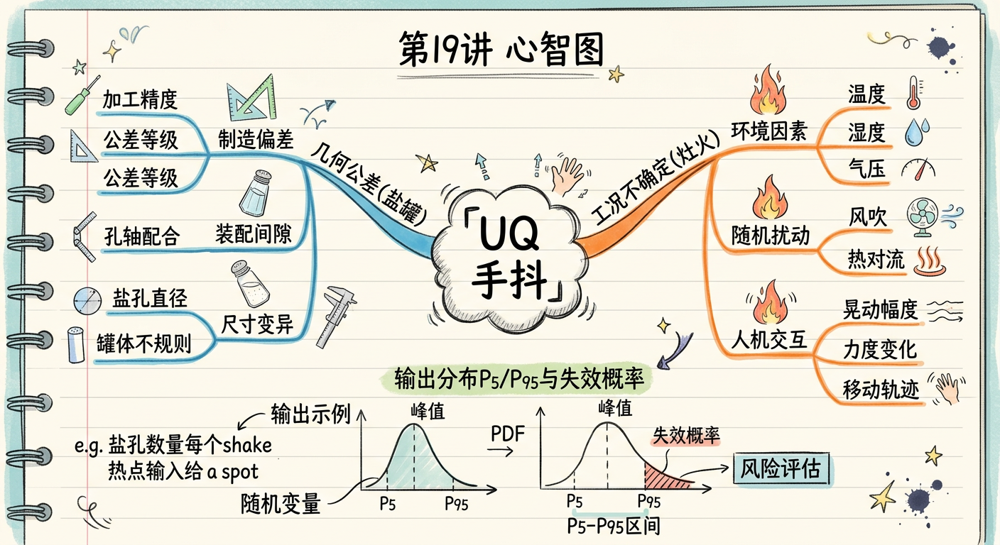

> **看图三秒：** 左几何公差、右工况不确定，底部分位数与失效概率。
**本讲赌注：** 只有名义最优、没有分布，装机厨房会把「手抖」误判成「仿真骗子」。

---

#### 1. 生活与物理直觉引子：菜谱写得再准，每次炒出来也不一样

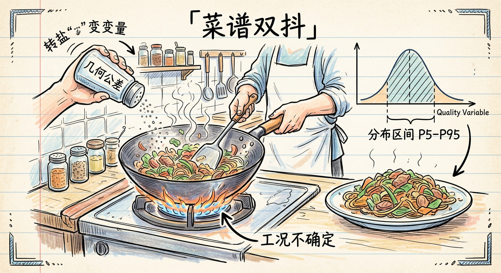

> **指读：** 两类不确定分开记账；输出是味道分布带，不是一盘示范菜。

先讲一个厨房里的道理。一份菜谱写着"盐 3 克、油温 180°C、翻炒 90 秒"。你严格照做，但每次成品还是有差别。为什么？

因为总有些**你控制不了的东西**：

- **盐撒的时候手一抖**，实际是 3.2 克（**制造偏差**）；
- **灶火今天气压不稳**，实际油温 175°C（**工况波动**）。

大多数时候这些偏差无所谓。但如果这道菜是**舒芙蕾**（对温度极其敏感），3°C 的偏差就能让它塌掉。

涡轮端壁就是发动机里的"舒芙蕾"。原文开篇即指出：

> 随着气动与热负荷不断攀升，现代燃气轮机的端壁已成为**易受制造与运行不确定性影响的关键区域，极易发生热失效**。因此，**量化输入不确定性对端壁气热性能的影响至关重要**。［原文 P04 摘要］

前面各讲（第 16 讲论文 03）我们花了很大力气优化端壁——但那个最优解是"**图纸上的**"。本文要问的是：

> **造出来、装上、跑起来之后，它还最优吗？**

**两份噪声账单：**  
几何公差是「盐手抖」；工况波动是「火候不稳」。  
UQ 不是吓你，是告诉你：**哪道工序的公差最值当去收紧。**

**UQ 的两张账单怎么读：**

- **几何不确定**：加工公差、圆角、孔位——像菜谱里盐克数的手抖；  
- **工况不确定**：进口角、雷诺数、转速——像灶火气压不稳。  

Kriging 等代理的作用，是让你不用对每一个公差组合都跑一次全 CFD，也能估计**性能分布的宽度**。宽度大的方向，就是该收紧公差或加稳健设计的地方。

**排期：** 最宽又最敏感的方向，最先收。

> **先猜后揭：** 若本讲反派「菜谱手抖」赢了，你的下一笔 CFD/实验预算会怎样被浪费？揭晓贯穿 §3–§5。

| 生活元素 | 工程元素 | 符号 |
| :--- | :--- | :--- |
| 主比喻侧 | 不确定量化 | UQ |
| 主比喻侧 | 制造偏差 | 公差 |
| 主比喻侧 | 边界飘 | 工况不确定 |

**菜谱双抖：** 盐罐手抖=几何公差；灶火不稳=工况不确定。名义最优下两次「炒」的味道分布，才是 UQ 输出。

**装机厨房投诉电话：**  
「图纸上挑不出毛病，装机飘了，仿真是骗子。」  
UQ 工程师的翻译：名义点之外的分布从未被问过；手抖被误判成模型道德问题。  
几何公差是盐罐，工况是灶火——双抖要分账。

**示范盘与装机盘：**  
名义最优是菜谱示范盘；UQ 是同一菜谱在盐抖火飘时的出餐分布。  
投诉「仿真骗子」前，先问分布做了没有。

---

#### 2. 叶轮机械中的真实工程死穴：两类不确定性

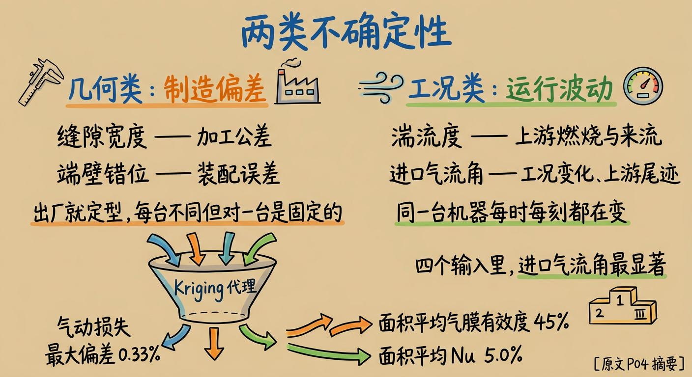

> **指读：** 这张图是本讲工程死穴的一张图版本。

**为什么「再跑一次名义 CFD」不够：**  
名义点是菜谱上的一盘菜；UQ 要的是同一菜谱在盐抖、火飘时的**味道分布**。  
设计验收若只盯名义最优，装机后的投诉会看起来像「仿真不准」，其实是**问题问窄了**。

本文考察的**四个不确定性输入**，可以干净地分成两类：

| 类别 | 变量 | 来自哪里 |
| :--- | :--- | :--- |
| **几何类（制造偏差）** | 缝隙宽度（slot width） | 加工公差 |
| | 端壁错位（endwall misalignment） | 装配误差 |
| **工况类（运行波动）** | 湍流度（turbulence intensity） | 上游燃烧/来流状态 |
| | 进口气流角（inlet flow angle） | 工况变化、上游叶片尾迹 |

这两类有个重要区别：

- **几何偏差**在出厂时就定型了（每台机器不同，但对某一台而言是固定的）；
- **工况波动**则在运行中不断变化（同一台机器，不同时刻不同）。

因此，如果某个**工况类**变量被证明是最敏感的参数，就意味着：**哪怕几何做得理想，性能也会在运行中漂移。**

**现场感：** 周五下班前组长要数——你面对的不是可以慢慢推的练习题，而是**算错一次就不可回收**的预算。

**两类不确定的会计科目：**  
几何公差：制造/安装/磨损。  
工况不确定：边界、转速、畸变、环境。  
混科目做 UQ，会得到好看但不可执行的分布。

---

#### 3. 数学公式：本讲只讲"框架"，不讲实现

先把公式关掉，用主比喻说一遍：

> **同菜谱盐抖火不稳，味道就飘**  
> 本讲反派是「菜谱手抖」。下面公式是这句话的展开；每条核心式尽量带**回译**。知识总量不删——深潜只是阅读路径，不是垃圾桶。

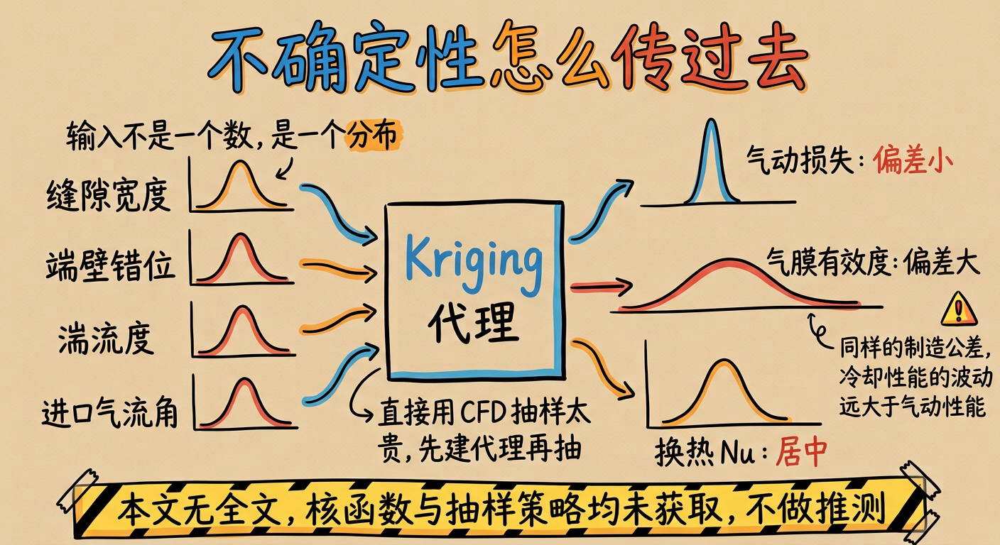

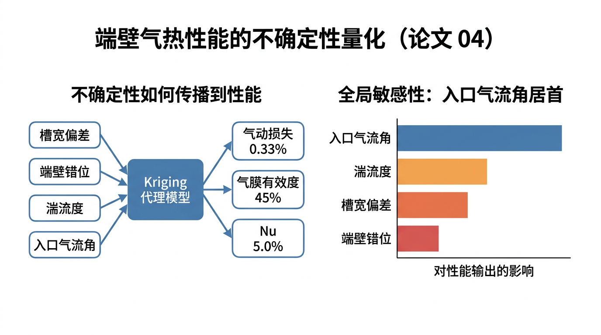

> 上图是本讲全部框架的「一张图版本」：**左图**是不确定性传播——槽宽偏差、端壁错位、湍流度、入口气流角四个输入不确定性经 Kriging 代理传到性能端，气动损失、面积平均气膜有效度、面积平均 Nu 的最大偏差分别达 **0.33%、45%、5.0%**［原文 P04 摘要］；**右图**是全局敏感性排序——**入口气流角**是四个输入中最显著的一个［原文 P04 摘要］。

> 🚫 **本文无全文，Kriging 核函数、采样点数、UQ 抽样策略（蒙特卡洛？多项式混沌？）均无从得知，绝不做推测。**

##### 3B. 本讲符号卡（建议截图留存）

| 符号 | 人话 | 备注 |
| :--- | :--- | :--- |
| UQ | 不确定量化 |  |
| 公差 | 制造偏差 |  |
| 工况不确定 | 边界飘 |  |

> 🧭 先认符号再读公式；主文核心式有「回译」，装不下的细节仍在正文完整保留（不删知识）。

##### 3C. 主路径公式与推导（知识全保留）

**可以确认的方法骨架**（摘要明确给出）：

**第一步：为什么 UQ 需要代理模型？**

不确定性量化（UQ）的标准做法是对输入做**大量抽样**，每个样本算一次输出，再统计输出的分布。但 CFD 一次要几小时——**抽一万个样本就要几万小时**，完全不可行。

解法与前面各讲一脉相承：**先用少量 CFD 样本建 Kriging 代理模型，再在代理模型上做大规模抽样。**
**〔式〕** UQ 流程：少量 CFD 样本[几十 几百次] —Kriging → f̂(x) —大规模抽样 → 输出分布

**回译：** 上式是主路径构件——先记住它在算法里负责哪一步，再抠每一个符号。

> 💡 这正是第 01–08 讲反复出现的"**代理模型**"思想的又一次应用——只不过目的从"找最优"变成了"**刻画不确定性**"。

**第二步：为什么还要做全局灵敏度分析（GSA）？**

UQ 告诉你"**输出会波动多少**"，GSA 告诉你"**波动主要怪谁**"。后者对工程更有价值——因为你能针对性地收紧公差或加强控制。

**第三步：三个被考察的性能指标**

1. **气动损失**（aerodynamic loss）
2. **面平均气膜冷却效率**（area-averaged film cooling effectiveness）
3. **面平均努塞尔数**（area-averaged Nusselt number）

---

#### 4. 算法控制流

> 🧭 **值班手册：** 先看「什么情况下走哪条分支」，公式是对白速记不是主角。

依据摘要可确认的骨架（**实现细节原文未获取**）：

```

① 确定四个不确定性输入及其分布：
     几何类：缝隙宽度、端壁错位
     工况类：湍流度、进口气流角
② 用少量 CFD 样本建立 Kriging 代理模型（三个性能指标各建一个）
③ 在代理模型上做大规模抽样，得到每个性能指标的统计分布
      → 量化"实际性能偏离名义值"的概率与幅度
      → 识别对不确定性最敏感的关键区域（critical regions）
④ 全局灵敏度分析：给四个输入变量排序
⑤ 对最显著的变量（进口气流角）做流动与传热机理分析

```

> **一句话记住：** 几何与工况不确定分开记账；进阶：UQ问名义最优扰动下还香吗。

**主比喻回扣：** 把上面的分支再翻译成「同菜谱盐抖火不稳，味道就飘」——若某步在生活里说不通，多半是符号没对齐。

**传播沙盘：** 输入扰动 → 代理 → 输出分布 → 分位数/失效概率。名义 CFD 一个点；UQ 一条带。

**UQ 最小闭环：**  
定义几何公差 + 工况带 → 代理传播 → 输出分布 → 分位数/失效概率 → 公差排期。  
名义 CFD 给点；UQ 给带；签字要带。

**UQ 会上三张图的发言顺序：**  
先输入扰动定义（别偷换分布）→ 再传播路径 → 最后才扔直方图与失效概率。  
倒序发言的人在做恐吓，不是在做排期。

---

#### 5. 实验验证与量化突破

**先报胜负：** 先读结论句与最大那一格，再读全表；表是证据架不是背诵清单。

**核心量化结果**［原文 P04 摘要，逐字确认］

| 性能指标 | 相对名义值的**最大偏移** |
| :--- | :---: |
| 气动损失 | **0.33%** |
| **面平均气膜冷却效率** | **45%** |
| 面平均努塞尔数 | **5.0%** |

> 📌 **这张表必须这样读，否则会误用**：
> - 这是**四个不确定性输入共同作用下**，各性能指标可能出现的**最大偏移幅度**；
> - **不是**"某个单一变量造成的偏移"，也**不是**"正攻角单独导致气膜效率漂移 45%"。
>
> 🗑️ **旧版白皮书的错误**：6.1 矩阵写作"发现**正攻角使气膜冷却效率最大漂移 45%**"——**数字本身与原文一致，但归因是错误的**，已在重建版中修正。
>
> ［本表与上述解读均出自原文 P04 摘要］

**三个更重要的定性结论**

1. **端壁的实际性能有很高的概率偏离其名义值**（"the actual performance of endwalls has a high probability of deviating from its nominal value"）。
 > 这句话是全文最刺骨的一句：**你在图纸上优化出来的那个"最优"，在真实机器上大概率拿不到。**
2. **识别出了对输入不确定性最敏感的关键区域**（critical regions）——这些区域在设计中应重点保护或放宽安全裕度。
3. **四个输入变量中，进口气流角最显著**；并且——
 > **正攻角（positive incidence angle）对端壁的气动性能与热防护双向不利。**［摘要原文：a positive incidence angle is found to be detrimental to both the aerodynamic performance and the thermal management of endwalls］

> 💡 **工程含义非常直接**：既然**进口气流角**这个**工况类**变量排第一，说明**光靠收紧加工公差是没用的**——你必须在设计阶段就考虑"来流角度会变"这一现实，例如做**多工况稳健设计**，而不是单点优化。

**机理**：摘要说明，作者通过对流动场与热场的基础分析，**澄清了进口气流角影响端壁气热性能的作用机制**——具体机制内容需全文，本讲不做推测。

**体感换算：** 把关键数字换成「工程师的周/月」或「一次签字的风险」——数字才进长期记忆。若原文给了墙钟时间或成本比，优先用原文换算。

**公差预算会：** 最敏感且最宽的方向优先加严；不敏感方向省检测成本。

---

**收束前夜：** 下讲复合冷却，冷气账单与均匀性一次算清。

#### 6. 审稿人批判与承前启后

把软肋放上**可信度刻度**（0=完全不信，5=可当默认工具）：

| 维度 | 打分 | 人话 |
| :--- | :---: | :--- |
| 问题 | 5 | |
| 决策 | 4 | |
| 传播 | 3 | |
| 样本 | 2 | |

**可以攻击的点：**

1. **只有四个输入变量**。真实的制造与运行不确定性远不止这些（表面粗糙度、气膜孔加工偏差、冷气温度波动、热障涂层厚度……）。结论的**完备性受限**。
2. **不确定性输入的分布假设未公开**。UQ 的结果强烈依赖"输入服从什么分布"这一假设，而摘要未说明这些分布是实测的还是假设的。
3. **UQ 精度上界是 Kriging 代理**。而端壁流场是强非线性问题，Kriging 在样本稀疏区域的误差会直接污染 UQ 结果。
4. **"最大偏移"的统计口径不明**：是置信区间上限？还是抽样极值？摘要未说明。
5. **未给出稳健设计（robust design）的解法**。本文只做了"**诊断**"（性能会漂多少、怪谁），没有做"**治疗**"（如何设计一个对不确定性不敏感的方案）。

**承前：**
- 直接承接**论文 03（NAE-Purge）**：那篇优化出"图纸上最优"的端壁，本文则检验"**造出来之后还最优吗**"。**两篇形成"优化 → 稳健性检验"的完整链条。**
- 方法上承接 Kriging 代理（论文 01/02/03）与全局灵敏度分析（与论文 11 DA-EGO 的 ANOVA、论文 19 SHAP 同源，但目的不同：**为稳健性服务，而非为分解或知识发现**）。

**本文在全集中的独特地位**：这是全集中**唯一一篇系统做不确定性量化（UQ）**的论文。它提出了一个前面所有讲次都回避了的问题——**优化结果的鲁棒性**。

**启后：**
- 与**论文 10（FFD-Tip）**呼应：叶尖间隙同样受制造装配与热变形影响，叶尖设计尤其需要 UQ；
- 与**论文 19（SHAP）**呼应：SHAP 揭示"哪个变量重要"，UQ 揭示"**哪个变量的不确定性最致命**"——二者结合才能做真正的稳健设计。

---

**UQ 结果上墙的正确姿势：**  
名义值一行、分位数一行、失效概率一行；再附「建议加严的公差条目」。  
缺分位数的「最优」海报，装机厨房不收。

**签字页审计：**  
名义值有 → 分位数有 → 失效概率有 → 建议加严公差条目有。  
缺分位数：退回。  
只有最坏情况恐吓、没有排期：退回。

---

#### 附：UQ 会上的三张图（概念）

1. **输入：** 几何公差带 + 工况扰动带（双色）  
2. **传播：** 代理沙盘，箭头从输入到输出  
3. **输出：** 性能分布，标名义值、P5/P95、失效阈  

**名义冠军的尴尬：**  
确定性优化冠军队在分布均值可能一般，在 P5 可能翻车。UQ 逼你问「最坏合理情况」。

**公差排期：** 敏感×当前宽 → 优先加严；不敏感×已很紧 → 可放松省成本。

---

**UQ 不是悲观主义：**  
它是把「手抖」从会议室形容词变成分布。名义最优仍可保留，但签字页应附 P5/P95 或失效概率。没有分布的冠军，是只在纸面上的冠军。

**与 13 讲 SHAP 的分工：**  
SHAP 回答「谁在推名义性能」；UQ 回答「推的时候手抖会怎样」。一个归因，一个稳健。

---

#### 附：UQ 签字页应有的三行字

1. **名义值：** 确定性优化给出的冠军性能。  
2. **分位数：** 至少 P10/P90 或 P5/P95（问题定）。  
3. **失效概率：** 低于规范阈值的概率（若有硬约束）。

缺任何一行，签字页都不完整——这不是文牍，是「手抖」的工程化。

**两类不确定对照（再钉）：**

| 类型 | 生活 | 设计室动作 |
| :--- | :--- | :--- |
| 几何 | 盐罐手抖 | 公差、加工、安装 |
| 工况 | 灶火不稳 | 边界条件、转速、进口畸变 |

**与 SHAP（13）联用：**  
SHAP 指出「该收紧谁」；UQ 验证「收紧以后分布是否真变窄」。先归因后传播，避免对不敏感变量花检测预算。

**反派菜谱手抖的会议室版：**  
「图纸上挑不出毛病」→ 装机飘了 → 有人说仿真骗子。其实是名义点之外的分布从未被问过。

---

#### 附：从「名义冠军」到「可装机冠军」的四步

```

① 确定性优化 → 名义点 x*
② SHAP/归因（可选，见 13）→ 谁在撑名义性能
③ 扰动定义 → 几何公差 + 工况带
④ 代理传播 → 性能分布 → 分位数 / 失效概率

```

若只做 ①，你得到的是菜谱上的示范盘；②–④ 才回答装机厨房的手抖。

**检测预算口令：** 敏感且宽 → 加严；不敏感且已紧 → 放松省钱。UQ 是排期工具。

---

#### 附：代理传播的最小可行配置（概念）

不绑定某篇未公开实现细节，只给可执行骨架：

1. **输入：** 对关键几何尺寸设公差分布；对 Ma/流量等设工况带。  
2. **代理：** Kriging/多项式混沌等（选你算得起的）。  
3. **采样：** 在输入分布上抽 N 组 → 代理预测性能。  
4. **输出：** 直方图 + P5/P95 + 相对规范的失效概率。  
5. **决策：** 加严最敏感且最宽的公差；记录剩余风险。

**一句话：** 名义 CFD 给点；UQ 给带；签字要带。

---


> **指读：** 名义值 + 分位数 + 失效概率，缺一行签字页不完整。

#### 附：UQ × SHAP

SHAP：谁在撑名义性能。  
UQ：撑的时候手抖会怎样。  
先归因后传播，检测预算打在刀刃上。

---

#### 附：UQ 排期看板（两周）

**W1：** 锁定几何公差带与工况带（分科目）；选定代理。  
**W2：** 传播 → 出 P5/P95 与失效概率 → 提「加严/放松」清单。  

验收：签字页三行齐全；检测预算有增有减（不是只加严）。  
与 13 联用：先 SHAP 缩变量，再 UQ 打在刀刃。

---

**分布先于道德：** 装机飘了，先贴签字页三行。没有三行，不准开「仿真道德审判」。

---

#### 附：公差「加严/放松」对照输出

| 变量 | 当前宽 | 敏感度 | 动作 | 检测成本 |
| :--- | :--- | :--- | :--- | :--- |
|  |  | 高 | 加严 |  |
|  |  | 低 | 可放松 | 省 |

只有加严没有放松，说明 UQ 还在恐吓模式。

---

**装机验收的分布语言：** 「名义达标」不够；要说「P10 仍高于阈值」或「失效概率低于 x」。说不出分布语言，就还在菜谱示范盘阶段。

**双抖分账口令：** 几何问题找公差与工艺；工况问题找运行包线与控制。混账会开错药方。

---

**UQ 不是悲观海报：** 它是把检测预算从「处处加严」改成「敏感处加严、迟钝处放松」。做不到放松，说明还在恐吓，不在排期。

---

#### 附：名义冠军的「分布打脸」剧本

确定性优化庆功会后，UQ 贴出 P5 掉出规范。  
正确反应：加严敏感公差或改设计点，而不是先骂仿真。  
错误反应：删 UQ 报告、只留名义海报。

---

#### 图卡：双抖分账

几何不确定找公差与工艺；工况不确定找运行包线与控制。**混账会开错药方。** UQ 传播后要出 P5/P95 与失效概率。

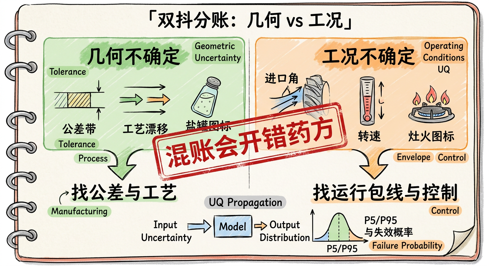

---

#### 图卡：名义冠军 vs 分布打脸

确定性优化的名义达标只是示范盘；UQ 若显示 P5 掉出规范，正确反应是加严敏感公差或改设计点——**删 UQ 报告是错误反应**。签字页必须有分位数。

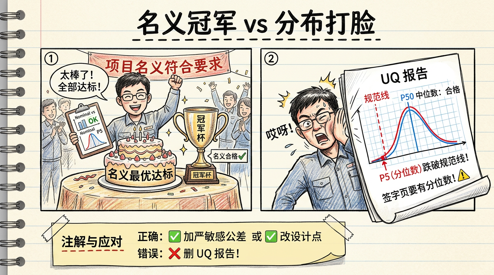

---

#### 图卡：加严 / 放松对照

高敏感加严、低敏感放松并省检测费。只有加严没有放松 = 恐吓模式，不是 UQ 排期。

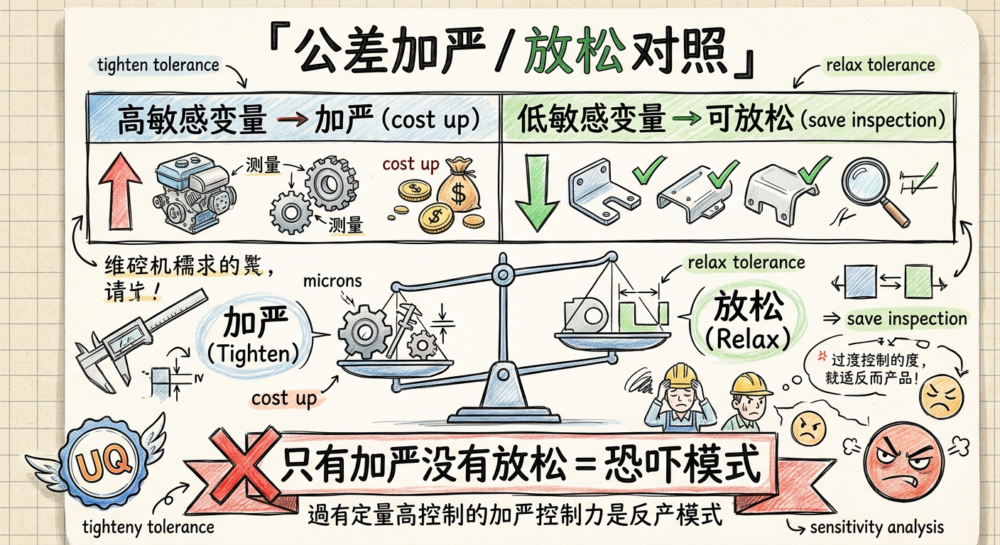

---

#### 图卡：UQ 两周排期看板

W1 锁几何/工况带并选代理；W2 传播出 P5/P95 与失效概率，并给出加严/放松清单。验收：签字页三行齐全，检测预算有增有减。


---

#### 章末：30 秒复述 · 自测 · 元数据

**30 秒复述稿（可朗读）：** 菜谱手抖：几何与工况两类不确定分开记账。UQ 传播扰动，输出分布与失效概率。名义冠军是示范盘；签字页要有分位数。

**自测（先做再对答案）：**

1. 两类不确定？
2. UQ多回答什么？
3. 最敏感必加严？

<details>
<summary>点开看参考答案</summary>

1. 几何vs工况。
2. 分布与失效概率。
3. 还看成本可测。

</details>

> **本讲元数据**（读完再看，不挡故事）
> | 项 | 值 |
> | :--- | :--- |
> | 规范编号 | **04** |
> | 标题 | Uncertainty Quantification of Aero-Thermal Performance of a Blade Endwall Considering Slot Geometry Deviation and Mainstream Fluctuation |
> | 作者 | Zhi Tao, Zhendong Guo, Liming Song, Jun Li |
> | 期刊 | *ASME Journal of Turbomachinery*, **143(11): 111013**（14 页） |
> | 论文号 | TURBO-20-1425 ｜ DOI `10.1115/1.4051416` |
> | 发表 | 线上 2021-06-23（正式期号 2021-11）；Received 2020-12-15 / Revised 2021-05-24 |
> | 本地原文 | **无（ASME 订阅墙）** |
> | 证据等级 | **B（出版商页面 + 摘要全文）** |

> ⚠️ **本讲的写作边界**：本文无本地全文，以下内容取自出版商页面的著录信息**与摘要原文**。
> **凡摘要未给出的数字（样本量、Kriging 核函数、抽样策略、灵敏度具体贡献率），本讲一律不写。**
> | 反派绰号 | 菜谱手抖 |
> | 主比喻 | 同一菜谱每次味道不同 |

---

<a id="lec-20" name="lec-20"></a>
### 【第20讲】内外夹攻：冲击冷却 + 气膜冷却的复合冷却构型（**论文 05**）

#### 本讲开场 90 秒

**上讲闪回：** 全书收束冷却：服务涡轮前温度。

**本讲反派：** 「单通道思维」

**只要带走 3 句口诀：**

1. **冲击+气膜内外夹攻**
2. **冷气与压损同一笔账**
3. **孔排在够匀与费压间走钢丝**

**主比喻：** 夏天只扇或只冲都偏科——要复合

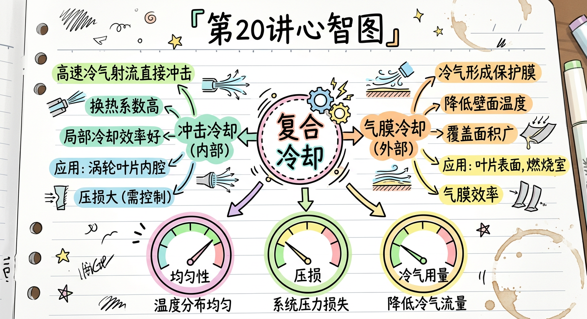

> **看图三秒：** 内外夹攻；均匀性 / 压损 / 冷气同一钱包。
**本讲赌注：** 单通道思维（只冲击或只气膜）会在最热点或压损账单上翻车。

---

#### 1. 生活与物理直觉引子：夏天降温，扇扇子还是冲凉？


> **指读：** A冲击 B气膜 C复合；C 必须过同一钱包审批。

先做一个夏日类比。天气 40°C，你怎么给自己降温？

- **方案 A：吹风扇**。风带走皮肤表面的热量——但气温比体温还高时，风扇效果有限；
- **方案 B：冲凉水**。水直接接触皮肤，降温极快——但冲完一会儿就又热了；
- **方案 C：先冲凉、再吹风扇**（皮肤湿着吹风）——**又快又持久**。

涡轮叶片的冷却，恰好对应这三种方案：

| 方案 | 涡轮里的对应技术 | 机制 |
| :--- | :--- | :--- |
| A 吹风扇 | **外部气膜冷却（film cooling）** | 从表面小孔喷出冷气，在壁面上铺一层"冷气毯"，把高温燃气与壁面隔开 |
| B 冲凉 | **内部冲击冷却（jet impingement）** | 冷气从内部高速射流**直接打在壁面背面**，换热系数极高 |
| C 先冲凉再吹风 | **复合冷却（impingement + film）** | 内部冲击把壁面"泡冷"，外部气膜再把热气挡在外面 |

本文研究的就是**方案 C**——原文称这类复合方案"因其卓越的性能而备受关注"［摘要］。

**降温三方案对照收束全书冷却线：**  
只吹（气膜）/ 只浇（冲击）/ 先浇再吹（复合）。  
三矛盾——冷得够、冷得匀、压损可控——是设计变量的指挥棒。

**复合冷却的设计直觉：**

- 冲击孔：把冷气「砸」到内壁，局部换热极强；  
- 气膜孔：在外壁铺一层冷气毯，隔开高温燃气；  
- 两者抢的是同一笔冷气与压损预算。  

三矛盾（够、匀、费压）不是口号，而是你改 Pᵢ、Dᵢ、H、D_f 时的计分板。

**记账：** 抢同一笔冷气与压损——扇与冲要一起算。

> **先猜后揭：** 若本讲反派「单通道思维」赢了，你的下一笔 CFD/实验预算会怎样被浪费？揭晓贯穿 §3–§5。

| 生活元素 | 工程元素 | 符号 |
| :--- | :--- | :--- |
| 主比喻侧 | 内冷 | 冲击 |
| 主比喻侧 | 外防 | 气膜 |
| 主比喻侧 | 气动代价 | 压损 |

**夏天降温 ABC：** 只扇=内部猛外表仍可能被舔；只冲=有膜内部热点还在；复合=内外夹攻，但冷气与压损同一钱包。

**夏天降温项目复盘：**  
只扇：内部可能仍热点。  
只冲凉：外表有膜，内部金属温度仍可能超。  
复合：有效，但冷气与压损同一钱包——财务与气动要共签。  
涡轮前温度每抬一点，冷却账单就重一点；智能设计最后仍要服务循环效率。

**偏科冠军的两种死法（加长）：**  
只冲击：外表面仍可能被燃气舔出热点。  
只气膜：内部金属温度与孔排压损可能双重爆。  
复合不是「两个都上就好」，是「两个都上且共账」。

---

#### 2. 叶轮机械中的真实工程死穴：端壁冷却的三重矛盾

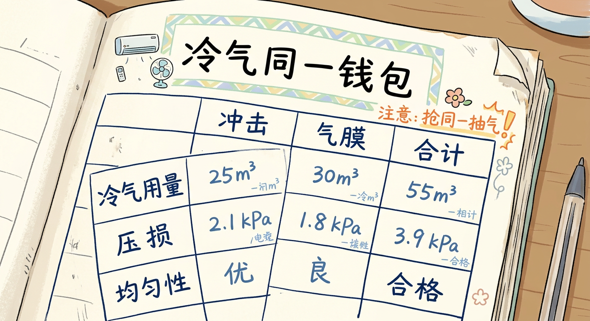

> **指读：** 冲击与气膜抢同一笔抽气与压损；均匀性是第三只表。

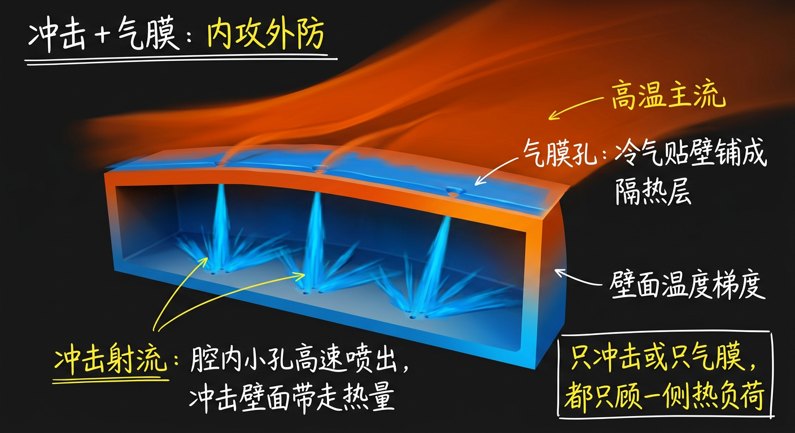

> **指读：** 这张图是本讲工程死穴的一张图版本。

端壁为什么特别难冷却？（这一点在第 16 讲已铺垫过，这里再补一层）

> 随着涡轮进口温度的提高与**预混燃烧（premixed combustion）**的应用，涡轮部件——尤其是**涡轮端壁**——工作在严苛环境中，必须被有效冷却才能保证部件寿命。［原文 P05 摘要］

值得注意的是这里提到的**预混燃烧**：它是低排放燃烧室的主流技术，但副作用是**出口温度分布更均匀、更平**——意味着端壁承受的热载荷不再有"低温区"可以喘息。

更麻烦的是，设计一个复合冷却系统要同时满足三个**互相打架**的要求：

1. **冷得够**（综合冷却效率要高）；
2. **冷得匀**（不能有局部热斑——热斑是裂纹的起点）；
3. **别太费压**（冷气从压气机抽来，抽多了循环效率就掉）。

本文用**三个评价指标**把这三重矛盾量化了下来（见第 3 节）。

**现场感：** 周五下班前组长要数——你面对的不是可以慢慢推的练习题，而是**算错一次就不可回收**的预算。

**三矛盾仪表：** ① 冷却够匀（热点定寿命）② 压损可控 ③ 冷气用省。只优化一维的冠军可能是整机输家。

**三矛盾仪表的误用：**  
只盯平均温度 → 掩盖最热点。  
只盯压损 → 可能欠冷却。  
只盯冷气量 → 可能孔排乱开。  
三表同时绿，才叫方案；一表独秀叫偏科冠军。

---

#### 3. 数学公式：本讲只讲"框架"，不讲实现

先把公式关掉，用主比喻说一遍：

> **夏天只扇或只冲都偏科——要复合**  
> 本讲反派是「单通道思维」。下面公式是这句话的展开；每条核心式尽量带**回译**。知识总量不删——深潜只是阅读路径，不是垃圾桶。

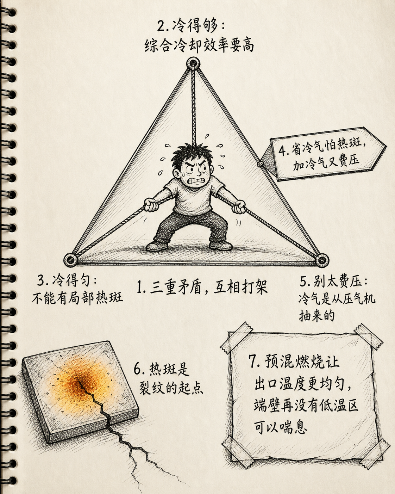

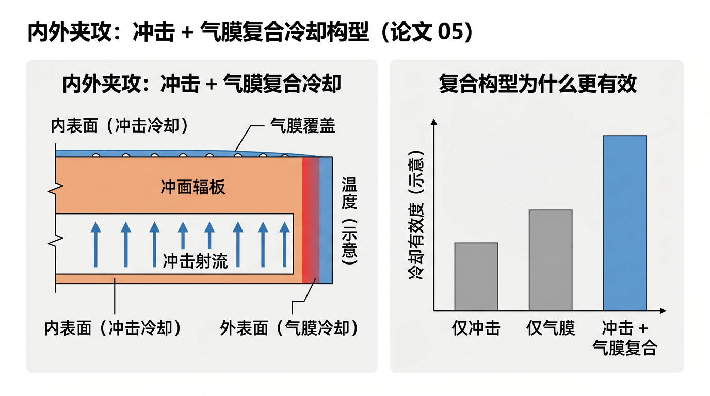

> 上图是本讲全部内容的「一张图版本」：**左图**是复合冷却的布局——内表面靠冲击射流「内攻」（冷气从腔内小孔高速喷出、冲击壁面带走热量），外表面靠气膜孔「外防」（冷气贴壁铺成隔热气膜）；**右图**是为什么要复合——仅冲击或仅气膜都只顾一侧热负荷，冲击 + 气膜复合构型两侧同时覆盖（柱高为示意；该构型经实验验证，四个设计变量与均匀设计试验见第 5 节）［摘要原文，论文 05］。

> 🚫 **本文无全文。ANOVA 的具体形式、各参数的显著性排序、均匀设计表的规模、CFD 设置均无从得知，绝不做推测。**

##### 3B. 本讲符号卡（建议截图留存）

| 符号 | 人话 | 备注 |
| :--- | :--- | :--- |
| 冲击 | 内冷 |  |
| 气膜 | 外防 |  |
| 压损 | 气动代价 |  |

> 🧭 先认符号再读公式；主文核心式有「回译」，装不下的细节仍在正文完整保留（不删知识）。

##### 3C. 主路径公式与推导（知识全保留）

**可以确认的方法骨架**（摘要明确给出）：

**第一步：四个几何设计变量**

| 变量 | 含义 | 属于 |
| :--- | :--- | :--- |
| Pᵢ | 冲击孔**间距**（impingement hole-to-hole pitch） | 内部冲击侧 |
| Dᵢ | 冲击孔**直径**（impingement hole diameter） | 内部冲击侧 |
| H | 冲击腔**高度**（impingement channel height） | 内部冲击侧 |
| D_f | 气膜孔**直径**（film hole diameter） | 外部气膜侧 |

**第二步：三个评价指标——本文最值得学习的地方**

| 指标 | 衡量什么 | 为什么重要 |
| :--- | :--- | :--- |
| **面平均综合冷却效率** | 冷得**够不够** | 主性能指标 |
| **综合冷却效率的**标准差**** | 冷得**匀不匀** | 直接对应**热斑风险** |
| **冷却系统总压降系数** | 冷气**费不费压** | 直接对应**循环效率代价** |

> ⭐ **这张表本身就是一条重要的工程方法论**：
> 很多优化只盯第一个指标（平均值），但**真正决定寿命的往往是第二个指标（均匀性）**——一个"平均很冷但局部很热"的方案，比一个"平均一般但处处均匀"的方案**更容易失效**。
> 把**标准差**单独列为一个评价指标，是本文很值得借鉴的做法。

**第三步：试验设计用"均匀设计"（uniform design）**

原文明确说明：用**均匀设计方法**收集覆盖四维设计空间的数据库。

> 📌 **注意**：是**均匀设计**，不是正交设计，也不是拉丁超立方（LHS）。旧版文档写作"均匀设计表"，**这一处是准确的**，予以保留。
>
> 顺带一提：本全集其他论文（论文 07 GSDE、论文 08 KT-ASO、论文 18 P-ResUNet、论文 19 SHAP）用的都是 **LHS**。**本文用均匀设计，是一个可以对比记忆的差异点。**

**第四步：ANOVA 方差分析**

用 ANOVA 分析四个参数对三个指标的影响，据此**挑出表现最好与最差的典型构型**，再做流动与传热机理剖析。

> 💡 这与第 13 讲（**论文 19 SHAP**）的思路是同一个家族——**先统计归因，再挑典型案例做机理分析**，最后"**提出针对同类冷却方案的设计建议**"。区别只在于工具：本文用 ANOVA，论文 19 用 SHAP。

---

#### 4. 算法控制流（依据摘要可确认的骨架）

> 🧭 **值班手册：** 先看「什么情况下走哪条分支」，公式是对白速记不是主角。

```

① 建立带射流冲击 + 气膜冷却的端壁数值模型
② 用实验数据标定/验证该数值模型   ← 本文可信度的关键支点
③ 选定四个几何变量 Pi / Di / H / Df，在合理范围内取值
④ 用均匀设计方法生成覆盖四维空间的方案库
⑤ 对每个方案做 CFD，计算三个评价指标：
     面平均综合冷却效率 / 冷却效率标准差 / 冷却系统总压降系数
⑥ ANOVA 方差分析：识别各参数的影响
⑦ 挑出"最好"与"最差"的典型构型
⑧ 对比剖析其流动与传热机理 → 提出设计建议

```

> **一句话记住：** 冲击+气膜内外夹攻；进阶：冷气与压损同一笔账。

**主比喻回扣：** 把上面的分支再翻译成「夏天只扇或只冲都偏科——要复合」——若某步在生活里说不通，多半是符号没对齐。

**复合冷却控制流（概念）：**  
摸清热点在内还是在外 → 决定冲击/气膜/复合 → 冷气与压损入同一账本 → 均匀性看最热点不是平均值。  
「再开一排孔」必须过冷气预算审批。

**复合冷却审批流：**  
热点在内？ → 冲击。  
热点在外？ → 气膜。  
都有？ → 复合，但同一钱包：冷气+压损+均匀性（看最热点）。  
「再开一排孔」需预算与压损双签。

---

#### 5. 实验验证与量化突破

**先报胜负：** 先读结论句与最大那一格，再读全表；表是证据架不是背诵清单。

**本文最大的可信度支点**：

> 数值模型**经实验验证**（validated against the experiment）。［摘要原文］

这在全集中是相对稀缺的——与第 17 讲（**论文 09** 风洞实验）一样，属于"**有实测背书**"的工作。

**可确认的内容**：

| 项目 | 内容 | 出处 |
| :--- | :--- | :--- |
| 冷却方案 | 内部**射流冲击** + 外部**气膜冷却**的复合构型 | 摘要 |
| 四个设计变量 | Pᵢ、Dᵢ、H、D_f | 摘要 |
| 试验设计 | **均匀设计** | 摘要 |
| 三个评价指标 | 面平均综合冷却效率 / 冷却效率标准差 / 冷却系统总压降系数 | 摘要 |
| 分析方法 | **ANOVA** → 挑最好/最差构型 → 机理剖析 → 设计建议 | 摘要 |
| 模型验证 | **经实验验证** | 摘要 |

> ⚠️ **重要提醒（数字纪律）**：
> 摘要**没有给出**各参数对三个指标的具体贡献率/显著性排序，也**没有给出**最优构型相对基准的量化提升幅度。
> 因此本讲**不列出任何百分比、贡献率或提升数值**。
>
> 🗑️ 旧版白皮书 6.1 对比矩阵中关于本文的任何数字均属无源填充，已全部删除。

**体感换算：** 把关键数字换成「工程师的周/月」或「一次签字的风险」——数字才进长期记忆。若原文给了墙钟时间或成本比，优先用原文换算。

**全书收束句：** 智能设计是为在冷气、强度、公差、实验等真实约束下，让涡轮前温度与效率的权衡可计算、可解释、可签字。

---

**选题提示：** 01–05 借采样、10–15 借场、16–20 借物理与实验，拼一条算力够用的闭环。

#### 6. 审稿人批判与承前启后

把软肋放上**可信度刻度**（0=完全不信，5=可当默认工具）：

| 维度 | 打分 | 人话 |
| :--- | :---: | :--- |
| 构型 | 5 | |
| 矛盾 | 5 | |
| 定量 | 2 | |
| 收束 | 5 | |

**可以攻击的点：**

1. **摘要未给出任何量化结果**。作为一篇以"参数影响分析"为主旨的论文，缺了显著性排序与贡献率，读者无法判断"哪个参数最该优先控制"——**这是本文最要紧的结论，恰恰无法从摘要获得**。
2. **只有四个几何变量**。复合冷却系统还有大量其他自由度（冲击孔排布形式、气膜孔倾角、射流雷诺数、冷气流量分配……）。
3. **三个指标未被综合**。本文分别报告三个指标，但没有给出多目标权衡（例如"冷却效率 vs 压降"的 Pareto 前沿），因此**最优构型依赖设计者的权重选择**。
4. **均匀设计的样本量未知**，ANOVA 的统计功效无法评估。
5. **未做不确定性/稳健性分析**。冷却孔的加工偏差（尤其是直径 D_f）对气膜效率影响极大——这一点恰好是第 19 讲（**论文 04**）的主题，本文未涉及。

**承前：**
- 承接**论文 03（NAE-Purge）**与**论文 12（SDNO）**所研究的端壁冷却问题，但把视角从"**端壁造型 + 封严缝**"推进到"**复合冷却构型**"。
- 试验设计传统上承接**论文 19（SHAP）**与**论文 11（DA-EGO）**的"统计归因 + 机理剖析"范式（工具不同：ANOVA vs SHAP vs PCE/ANOVA）。

**启后：**
- 与**论文 04（Slot-UQ）**是天然的下一步：**本文告诉你哪些参数重要，论文 04 告诉你这些参数的偏差会带来多大风险**——两者结合才能做稳健的冷却系统设计。
- 与**论文 12（SDNO）**呼应：SDNO 用 AI 预测端壁气膜冷却温度场，可为本文这类"冷却构型参数研究"提供廉价的评估手段。

---

## 全书收束：二十讲讲完了，它们其实在回答同一个问题

读完二十讲，你可能会觉得内容很杂：贝叶斯优化、生成模型、神经算子、图神经网络、不确定性量化、风洞实验……但它们全部指向同一个工程困境：

> **一次 CFD 太贵，而设计空间太大。**

二十讲给出的解法，可以归纳为**五条互相独立的降本路线**：

| 路线 | 思路 | 代表讲次 |
| :--- | :--- | :--- |
| **① 让每一次采样更值** | 改进采集函数与加点准则 | 第 01 讲（CR-EI）、第 02 讲（Filter-GEI） |
| **② 换能扛高维的搜索器** | 分解 / 进化 / 迁移 | 第 04 讲（DA-EGO）、第 03 讲（GSDE）、第 07、08 讲（KT-ASO / GTO） |
| **③ 用历史任务的知识** | 迁移学习 | 第 07、08 讲 |
| **④ 让"一次评估"变便宜** | AI 替代 CFD | 第 10、11、12、14 讲（TNO / SDNO / P-ResUNet / StressGNN） |
| **⑤ 把优化留下的知识挖出来** | 数据挖掘 | 第 13 讲（SHAP）、第 19 讲（UQ） |

而第 16、17、18、20 讲提醒我们：**所有这些方法，最终都要接受物理与实验的检验**——马蹄涡、通道涡、叶尖泄漏涡、气膜覆盖、热斑，这些才是设计的真正对象。

> **最后一句**：这五条路线**可以叠加**。用 AI 预测器做廉价评估 + 用 CR-EI/DA-EGO 做聪明搜索 + 用 SHAP 挖知识缩小空间 + 用 UQ 保证鲁棒——这才是"智能设计"的完整形态，也是这套文献留给后来者最清晰的路线图。

---

**复合冷却实验/仿真对照阅读：**  
先问冷气从哪一级抽、压损记在谁头上；再问热点位置是内壁还是气膜覆盖空洞。  
只报「平均温度下降」而不报最热点与压损，是半本账。

**读冷却结果的整机视角：**  
平均温度下降若伴随最热点没动，是报表骗局。  
冷气增加若循环效率掉超阈值，是整机亏损。  
冲击/气膜要一起记账，不能各报各的胜利。

---

#### 附：复合冷却的整机视角

冷气不是「免费的水」，是压气机抽气，直接进入循环效率方程。  
冲击把热从内壁搬走；气膜把燃气与壁面隔开；二者抢同一笔冷气与压损预算。

**单通道思维的两种死法：**  
- 只冲击：外表面仍可能出现不可接受热点  
- 只气膜：内部冷却不足，或孔排压损拖垮气动  

**全书闭环：** 采样聪明（01–05）× 形状合法（06–09）× 场便宜（10–15）× 物理与实验诚实（16–20）。毕业时拼一条你算力够用的链，而不是二十篇论文各抄一段。

---

#### 附：复合冷却的「同一钱包」账本

| 支出项 | 冲击冷却 | 气膜冷却 | 备注 |
| :--- | :--- | :--- | :--- |
| 冷气用量 | 高（多射流） | 高（多孔排） | **抢同一抽气** |
| 压损 | 内冷通道压降 | 孔排与掺混 | 吃涡轮膨胀比 |
| 均匀性 | 内壁热点 | 气膜覆盖空洞 | 寿命看最热点 |
| 加工 | 冲击靶面/隔板 | 气膜孔钻/激光 | 成本与公差 |

**ABC 决策树：**

```

外表面是否已有不可接受热点？
  ├─ 是 → 气膜必须上（B 或 C）
  └─ 否 → 仍可能要冲击处理内部（A 或 C）
内部金属温度是否超限？
  ├─ 是 → 冲击必须上
  └─ 否 → 可评估是否过度冷却
冷气预算是否见底？
  └─ 是 → 停加孔，改排布/改冲击阵列，不要「再开一排」

```

**全书收束（给读者的毕业句）：**  
智能设计的终点不是表格里多 0.1 个点，而是在冷气、强度、公差、实验都在场时，仍能解释并签字。

---

#### 附：全书闭环一句

采样聪明（01–05）× 形状合法（06–09）× 场便宜（10–15）× 物理与实验诚实（16–20）。  
毕业设计挑一条算力够用的闭环，不抄二十段。

---

#### 附：复合冷却「同一钱包」月报

| 项 | 本月 | 阈值 | 状态 |
| :--- | :--- | :--- | :--- |
| 冷气用量 |  |  |  |
| 压损 |  |  |  |
| 最热点温度 |  |  |  |
| 平均温度（仅参考） |  |  |  |

最热点红、平均值绿 → 报表骗局，重开方案。  
全书收束：冷却最终服务涡轮前温度与循环，不是局部云图。

---

**整机财务联席：** 气动、热端、总体循环同一表格看冷气与压损。分表报喜视为违规。

---

#### 附：冲击孔阵与气膜孔排的联立约束

- 冷气总预算上限  
- 压损上限  
- 最热点上限  
- 可制造最小孔径/最小壁厚  

四条联立求解；拆开单目标最优，整机常假。

---

**复合冷却成功的唯一定义：** 最热点达标 ∧ 压损达标 ∧ 冷气预算达标 ∧ 可制造。四条件缺一，不得称为成功，即使平均温度很好看。

**收束到涡轮前温度：** 冷却是抬涡轮前温度的代价中心；智能设计让代价可算、可解释、可签字。

---

#### 附：冷气来源追溯

每一分冷气写清：从哪级压气机抽、管道压损、对循环效率的一阶影响。  
追溯不清的冷却方案，财务与总体有权一票否决。

---

#### 图卡：复合冷却成功四条件

成功 = 最热点达标 ∧ 压损达标 ∧ 冷气预算达标 ∧ 可制造。平均温度很好看 **≠** 成功。

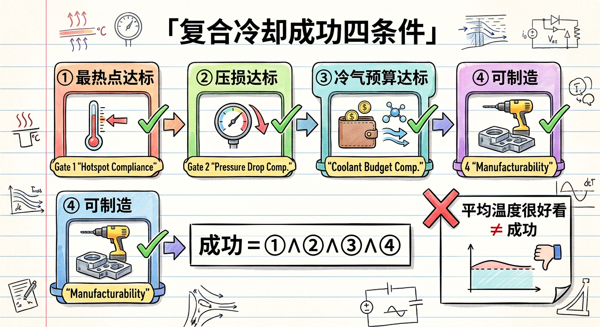

---

#### 图卡：内外夹攻

冲击射流冷内部、气膜防外表，抢同一笔冷气与压损。只扇会热点、只冲费压损；冷却最终服务涡轮前温度与循环。

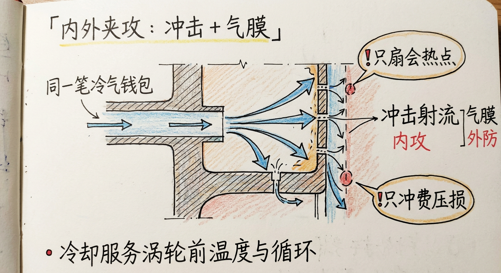

---

#### 图卡：冷气来源追溯

每一分冷气写清：从哪级压气机抽、管道压损、对循环效率的一阶影响。追溯不清 → 财务/总体一票否决。

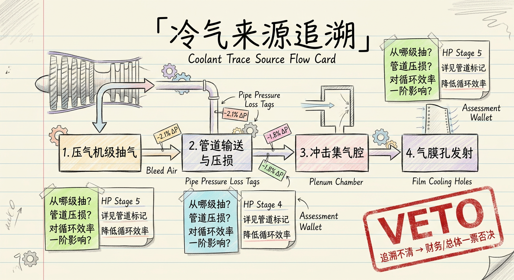

---

#### 图卡：冷气钱包月报

月报必看冷气用量、压损、最热点；平均温度仅参考。最热点红、平均值绿 = 报表骗局，重开方案。

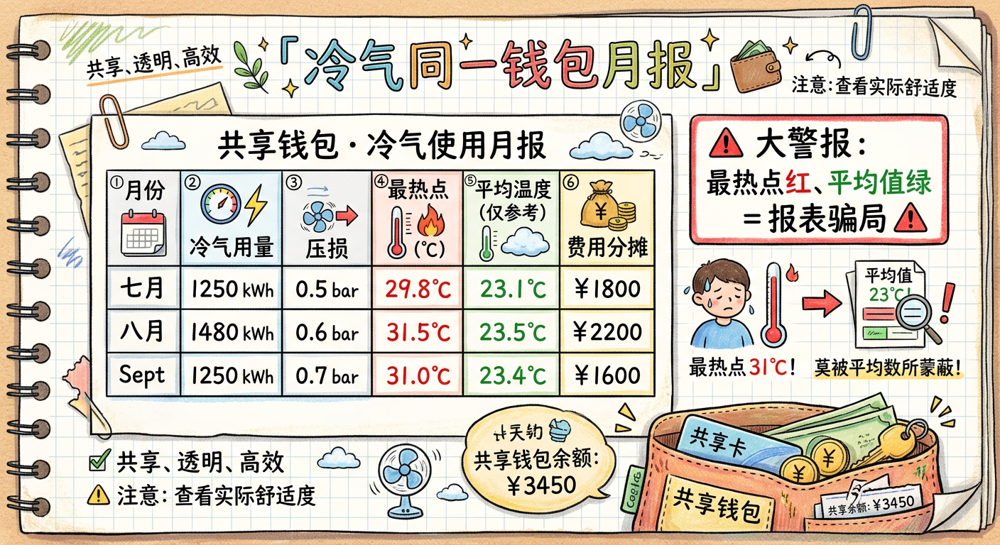

---

#### 章末：30 秒复述 · 自测 · 元数据

**30 秒复述稿（可朗读）：** 冲击冷内部、气膜防外表，抢同一笔冷气与压损。复合是内外夹攻；单通道思维会在最热点或整机效率翻车。冷却服务涡轮前温度与循环。

**自测（先做再对答案）：**

1. 复合冷却？
2. 三矛盾？
3. 冷气代价？

<details>
<summary>点开看参考答案</summary>

1. 冲击+气膜等。
2. 均匀、压损、冷气量。
3. 压气机抽气吃循环效率。

</details>

> **本讲元数据**（读完再看，不挡故事）
> | 项 | 值 |
> | :--- | :--- |
> | 规范编号 | **05** |
> | 标题 | Effects of Cooling Configurations on the Aerothermal Performance of a Turbine Endwall With Jet Impingement and Film Cooling |
> | 作者 | Hongyan Bu, Zhendong Guo, Liming Song, Jun Li（Bu 与 Guo 并列第一作者；引文格式 Bu, H., Guo, Z., Song, L., and Li, J.） |
> | 期刊 | *ASME Journal of Turbomachinery*, **143(6): 061013**（12 页） |
> | 论文号 | TURBO-20-1334 ｜ DOI `10.1115/1.4050358` |
> | 发表 | 正式 2021-06（线上 2021-04-13）；Received 2020-11-10 / Revised 2021-01-06 / Accepted 2021-01-06 |
> | 本地原文 | **无（ASME 订阅墙）** |
> | 证据等级 | **B（出版商页面 + 摘要全文）** |

> ✅ **一处难得的"旧版正确"**：白皮书第 20 讲标注的卷期 `143(6): 061013` **与出版商页面完全一致**，是旧版中少数准确的著录，予以保留。
> | 反派绰号 | 只吹或只浇 |
> | 主比喻 | 夏天降温：扇扇子还是冲凉 |

---

<a id="part-5" name="part-5"></a>
# 第五篇 【实践与代码篇】可运行算法原型库

本篇所有代码均**逐字取自 `code/` 目录下的真实文件**，由 `tools/build_whitepaper.py` 自动嵌入。
换句话说：**你在这里看到的代码，就是仓库里能跑起来的那个文件**，不存在「文档里一份、仓库里另一份」的情况。

运行环境与依赖见 `code/requirements.txt`（仅 numpy）与 `code/README.md`。

<a id="code-benchmarks-py" name="code-benchmarks-py"></a>
### `code/benchmarks.py`

```python

"""benchmarks.py —— 优化算法测试函数集

本模块收集本全集中各篇论文反复使用的**解析基准函数**，用于在没有 CFD 的情况下
验证优化算法的正确性与相对优劣。

选这些函数的理由（都对应到具体论文）：
  * Hartman6 / Shekel4 / Camel6 / Trid10 —— 论文 01（CR-EI）的 7 个基准函数中的 4 个
  * Ackley / Rosenbrock（含 6 维版本）—— 论文 06（GMFoO）与论文 08（KT-ASO）的
    源/目标任务构造直接使用了 Ackley6d 与 0.9·Ackley6d + 0.1·Rosenbrock6d
  * Ackley5 / Hartman6 —— 论文 02（Filter-GEI）Table 4 的测试函数
  * 30~90 维版本 —— 论文 11（DA-EGO）在 21 个 30~90 维函数上验证
  * 50~100 维版本 —— 论文 07（GSDE）的数值验证区间

**重要提醒**：这些函数是"廉价黑箱"，与真实 CFD 的昂贵性无关；它们只能验证
"算法的搜索逻辑"，不能验证"算法在昂贵场景下的样本效率"。真要评估后者，必须
统计**函数评估次数**（本模块中每个 Problem 都会记录 eval_count）。

运行自检：
    python code/benchmarks.py
自检内容：已知全局最优值、维度与边界一致性、评估计数、以及"越接近最优点函数值越小"的
    单调性抽查。
"""

from __future__ import annotations

from typing import Callable, Dict, List, Optional, Tuple

import numpy as np

__all__ = [
    "Problem",
    "get_problem",
    "list_problems",
    "sphere", "rosenbrock", "ackley", "griewank", "levy", "trid",
    "hartman6", "shekel4", "branin", "camel6",
]

# --------------------------------------------------------------------------- 容器
class Problem:
    """一个带边界、已知最优值与评估计数的优化问题（统一按**最小化**处理）。"""

    def __init__(self,
                 name: str,
                 func: Callable[[np.ndarray], float],
                 dim: int,
                 bounds: List[Tuple[float, float]],
                 fmin: float,
                 xmin: Optional[np.ndarray] = None,
                 note: str = ""):
        self.name = name
        self.func = func
        self.dim = dim
        self.bounds = bounds
        self.fmin = fmin                      # 已知全局最小值（文献值）
        self.xmin = None if xmin is None else np.asarray(xmin, dtype=float)
        self.note = note
        self.eval_count: int = 0              # 昂贵评估次数统计
        self.history: List[float] = []        # 每次评估的目标值（便于画收敛曲线）

    def __call__(self, x: np.ndarray) -> float:
        x = np.asarray(x, dtype=float).ravel()
        if x.size != self.dim:
            raise ValueError(f"{self.name} 期望 {self.dim} 维，收到 {x.size} 维")
        y = float(self.func(x))
        self.eval_count += 1
        self.history.append(y)
        return y

    def reset(self) -> None:
        """清空评估计数与历史（做多次独立重复实验时用）。"""
        self.eval_count = 0
        self.history.clear()

    def best_so_far(self) -> float:
        """当前已评估样本中的最优值（用于画收敛曲线）。"""
        if not self.history:
            return float("inf")
        return float(np.min(self.history))

    def regret(self) -> float:
        """当前最优值与已知全局最优的差（越小越好，0 表示已找到全局最优）。"""
        return self.best_so_far() - self.fmin

    def __repr__(self) -> str:  # pragma: no cover - 仅用于调试输出
        return f"Problem({self.name}, dim={self.dim}, f*={self.fmin:.6g}, n_eval={self.eval_count})"

# --------------------------------------------------------------------------- 基本函数
def sphere(x: np.ndarray) -> float:
    """Sphere：最平凡的凸单峰函数，全局最优 0（原点）。"""
    x = np.asarray(x, dtype=float).ravel()
    return float(np.sum(x ** 2))

def rosenbrock(x: np.ndarray) -> float:
    """Rosenbrock：经典"香蕉谷"，全局最优 0（全 1 向量）。

    论文 06/08 用的是带平移的版本：f(x) = Σ(0.4 - x_i)² + 20·Σ(x_i - x_{i+1})²，
    即最优在 x_i = 0.4；本处提供标准版本，平移版本见 make_shifted_rosenbrock()。
    """
    x = np.asarray(x, dtype=float).ravel()
    return float(np.sum(100.0 * (x[1:] - x[:-1] ** 2) ** 2 + (1.0 - x[:-1]) ** 2))

def make_shifted_rosenbrock(dim: int = 6) -> Callable[[np.ndarray], float]:
    """论文 08（KT-ASO）数值验证中使用的平移 Rosenbrock：
       f(x) = Σ_{i=1}^{d}(0.4 - x_i)²  +  20·Σ_{i=1}^{d-1}(x_i - x_{i+1})²
    定义域 x_i ∈ [-2, 2]，最优在 x_i = 0.4，最优值 0。
    """
    def f(x: np.ndarray) -> float:
        x = np.asarray(x, dtype=float).ravel()
        return float(np.sum((0.4 - x) ** 2) + 20.0 * np.sum((x[:-1] - x[1:]) ** 2))
    f.__name__ = f"shifted_rosenbrock{dim}d"
    return f

def ackley(x: np.ndarray, a: float = 20.0, b: float = 0.2, c: float = 2.0 * np.pi) -> float:
    """Ackley：海量局部极小 + 全局最优 0（原点）。高维优化的常用试金石。"""
    x = np.asarray(x, dtype=float).ravel()
    d = x.size
    s1 = np.sum(x ** 2)
    s2 = np.sum(np.cos(c * x))
    return float(-a * np.exp(-b * np.sqrt(s1 / d)) - np.exp(s2 / d) + a + np.e)

def griewank(x: np.ndarray) -> float:
    """Griewank：乘积型多峰，全局最优 0（原点）。"""
    x = np.asarray(x, dtype=float).ravel()
    d = x.size
    i = np.arange(1, d + 1, dtype=float)
    return float(1.0 + np.sum(x ** 2) / 4000.0 - np.prod(np.cos(x / np.sqrt(i))))

def levy(x: np.ndarray) -> float:
    """Levy：全局最优 0（全 1 向量）。"""
    x = np.asarray(x, dtype=float).ravel()
    w = 1.0 + (x - 1.0) / 4.0
    term1 = np.sin(np.pi * w[0]) ** 2
    term3 = (w[-1] - 1.0) ** 2 * (1.0 + np.sin(2.0 * np.pi * w[-1]) ** 2)
    term2 = np.sum((w[:-1] - 1.0) ** 2 * (1.0 + 10.0 * np.sin(np.pi * w[:-1] + 1.0) ** 2))
    return float(term1 + term2 + term3)

def trid(x: np.ndarray) -> float:
    """Trid：全局最优 -d(d+4)(d-1)/6（论文 01 用 Trid10，最优值 -210）。"""
    x = np.asarray(x, dtype=float).ravel()
    d = x.size
    s1 = np.sum((x - 1.0) ** 2)
    s2 = np.sum(x[1:] * x[:-1])
    return float(s1 - s2)

def branin(x: np.ndarray) -> float:
    """Branin（2 维）：三个全局最优点，最优值 0.397887。"""
    x = np.asarray(x, dtype=float).ravel()
    x1, x2 = x[0], x[1]
    a, b, c, r, s, t = 1.0, 5.1 / (4.0 * np.pi ** 2), 5.0 / np.pi, 6.0, 10.0, 1.0 / (8.0 * np.pi)
    return float(a * (x2 - b * x1 ** 2 + c * x1 - r) ** 2 + s * (1.0 - t) * np.cos(x1) + s)

def camel6(x: np.ndarray) -> float:
    """Six-Hump Camel（2 维）：六个局部极小，两个全局最优点，最优值 -1.0316。
    论文 01（CR-EI）用它做参数敏感性分析。"""
    x = np.asarray(x, dtype=float).ravel()
    x1, x2 = x[0], x[1]
    return float((4.0 - 2.1 * x1 ** 2 + x1 ** 4 / 3.0) * x1 ** 2
                 + x1 * x2 + (-4.0 + 4.0 * x2 ** 2) * x2 ** 2)

_H6_ALPHA = np.array([1.0, 1.2, 3.0, 3.2])
_H6_A = np.array([[10.0, 3.0, 17.0, 3.5, 1.7, 8.0],
                  [0.05, 10.0, 17.0, 0.1, 8.0, 14.0],
                  [3.0, 3.5, 1.7, 10.0, 17.0, 8.0],
                  [17.0, 8.0, 0.05, 10.0, 0.1, 14.0]])
_H6_P = 1e-4 * np.array([[1312, 1696, 5569, 124, 8283, 5886],
                         [2329, 4135, 8307, 3736, 1004, 9991],
                         [2348, 1451, 3522, 2883, 3047, 6650],
                         [4047, 8828, 8732, 5743, 1091, 381]])

def hartman6(x: np.ndarray) -> float:
    """Hartman6（6 维，域 [0,1]^6）：6 个局部最优，全局最小 -3.32237。
    论文 01 中明确提到"Hartman6 有 6 个局部最优"。"""
    x = np.asarray(x, dtype=float).ravel()
    return float(-np.sum(_H6_ALPHA * np.exp(-np.sum(_H6_A * (x[None, :] - _H6_P) ** 2, axis=1))))

_S4_A = np.array([[4.0, 4.0, 4.0, 4.0],
                  [1.0, 1.0, 1.0, 1.0],
                  [8.0, 8.0, 8.0, 8.0],
                  [6.0, 6.0, 6.0, 6.0],
                  [3.0, 7.0, 3.0, 7.0],
                  [2.0, 9.0, 2.0, 9.0],
                  [5.0, 5.0, 3.0, 3.0],
                  [8.0, 1.0, 8.0, 1.0],
                  [6.0, 2.0, 6.0, 2.0],
                  [7.0, 3.6, 7.0, 3.6]], dtype=float)
_S4_C = np.array([0.1, 0.2, 0.2, 0.4, 0.4, 0.6, 0.3, 0.7, 0.5, 0.5])

def shekel4(x: np.ndarray) -> float:
    """Shekel / Shekel4（4 维，域 [0,10]^4）：论文 01 Table 1 使用的函数之一。
    这里采用 m=10 的常用 Shekel 形式，全局最小约 -10.5364。"""
    x = np.asarray(x, dtype=float).ravel()
    inner = np.sum((x[None, :] - _S4_A) ** 2, axis=1) + _S4_C
    return float(-np.sum(1.0 / inner))

# --------------------------------------------------------------------------- 注册表
def _reg() -> Dict[str, Problem]:
    p: Dict[str, Problem] = {}

    def add(prob: Problem) -> None:
        p[prob.name] = prob

    add(Problem("sphere5", sphere, 5, [(-5.12, 5.12)] * 5, 0.0, np.zeros(5),
                "凸单峰，用于 sanity check"))
    add(Problem("branin2", branin, 2, [(-5.0, 10.0), (0.0, 15.0)], 0.397887,
                np.array([-np.pi, 12.275]),
                "2 维，3 个全局最优点"))
    add(Problem("camel6", camel6, 2, [(-3.0, 3.0), (-2.0, 2.0)], -1.031628,
                np.array([0.0898, -0.7126]),
                "论文 01 参数敏感性算例"))
    add(Problem("hartman6", hartman6, 6, [(0.0, 1.0)] * 6, -3.322368,
                np.array([0.20169, 0.150011, 0.476874, 0.275332, 0.311652, 0.6573]),
                "论文 01/02 均使用；6 个局部最优"))
    add(Problem("shekel4", shekel4, 4, [(0.0, 10.0)] * 4, -10.5364,
                np.array([4.0, 4.0, 4.0, 4.0]),
                "论文 01 Table 1 使用"))
    add(Problem("trid10", trid, 10, [(-100.0, 100.0)] * 10, -210.0,
                np.arange(1, 11) * (11 - np.arange(1, 11)),
                "论文 01 Table 1 使用；最优值 -d(d+4)(d-1)/6"))
    add(Problem("ackley5", ackley, 5, [(-32.768, 32.768)] * 5, 0.0, np.zeros(5),
                "论文 02 Table 4 使用"))
    add(Problem("ackley6", ackley, 6, [(-2.0, 2.0)] * 6, 0.0, np.zeros(6),
                "论文 06/08 数值验证的目标任务"))
    add(Problem("rosenbrock6", make_shifted_rosenbrock(6), 6, [(-2.0, 2.0)] * 6, 0.0,
                np.full(6, 0.4),
                "论文 08 的平移 Rosenbrock（最优在 x_i=0.4）"))
    add(Problem("griewank10", griewank, 10, [(-600.0, 600.0)] * 10, 0.0, np.zeros(10),
                "乘积型多峰"))
    add(Problem("levy10", levy, 10, [(-10.0, 10.0)] * 10, 0.0, np.ones(10),
                "多峰，最优在全 1 向量"))
    add(Problem("rosenbrock30", rosenbrock, 30, [(-2.048, 2.048)] * 30, 0.0, np.ones(30),
                "论文 11 的 30 维量级"))
    add(Problem("ackley50", ackley, 50, [(-32.768, 32.768)] * 50, 0.0, np.zeros(50),
                "论文 07 的 50~100 维量级"))
    add(Problem("sphere100", sphere, 100, [(-5.12, 5.12)] * 100, 0.0, np.zeros(100),
                "论文 07 的 100 维量级"))
    return p

_REGISTRY: Dict[str, Problem] = _reg()

def list_problems() -> List[str]:
    """返回所有可用基准问题的名字。"""
    return sorted(_REGISTRY)

def get_problem(name: str) -> Problem:
    """按名字取一个**全新的** Problem 实例（每次调用都会重置评估计数）。"""
    if name not in _REGISTRY:
        raise KeyError(f"未知问题 {name!r}，可用：{list_problems()}")
    src = _REGISTRY[name]
    return Problem(src.name, src.func, src.dim, list(src.bounds), src.fmin, src.xmin, src.note)

# --------------------------------------------------------------------------- 自检
def _self_test() -> None:
    # 1) 已知函数的最优值核对（含论文 01 提到的 Trid10 = -210）
    checks = [
        ("sphere5", np.zeros(5), 0.0),
        ("branin2", np.array([-np.pi, 12.275]), 0.397887),
        ("camel6", np.array([0.0898, -0.7126]), -1.0316),
        ("hartman6", np.array([0.20169, 0.150011, 0.476874, 0.275332, 0.311652, 0.6573]), -3.32237),
        ("trid10", np.arange(1, 11) * (11 - np.arange(1, 11)), -210.0),
        ("ackley5", np.zeros(5), 0.0),
        ("ackley6", np.zeros(6), 0.0),
        ("rosenbrock6", np.full(6, 0.4), 0.0),
        ("griewank10", np.zeros(10), 0.0),
        ("levy10", np.ones(10), 0.0),
    ]
    for name, xstar, fstar in checks:
        pr = get_problem(name)
        got = pr(xstar)
        assert abs(got - fstar) < 5e-3, f"{name} 最优值不符：{got} vs {fstar}"
        assert got <= pr.fmin + 5e-3, f"{name} 的 fmin 登记值偏小"

    # 2) 维度与边界一致
    for name in list_problems():
        pr = get_problem(name)
        assert len(pr.bounds) == pr.dim, f"{name} 边界数与维度不一致"
        for lo, hi in pr.bounds:
            assert hi > lo, f"{name} 存在非法边界"

    # 3) 评估计数与收敛记录
    pr = get_problem("hartman6")
    rng = np.random.default_rng(7)
    for _ in range(10):
        pr(rng.random(6))
    assert pr.eval_count == 10, "评估计数错误"
    assert len(pr.history) == 10, "历史长度错误"
    assert pr.best_so_far() == min(pr.history), "best_so_far 计算错误"
    pr.reset()
    assert pr.eval_count == 0 and not pr.history, "reset 未清空"

    # 4) 维度错误应报错
    try:
        pr(rng.random(5))
    except ValueError:
        pass
    else:
        raise AssertionError("维度不匹配未报错")

    # 5) 单调性抽查：沿"当前点->全局最优点"连线插值，函数值应大体下降
    pr = get_problem("ackley5")
    lo = np.array([b[0] for b in pr.bounds])
    hi = np.array([b[1] for b in pr.bounds])
    start = lo + 0.25 * (hi - lo)
    vals = [pr(start + t * (pr.xmin - start)) for t in np.linspace(0, 1, 9)]
    assert vals[-1] < vals[0], "沿指向最优点的路径函数值未下降"

    print(f"[benchmarks.py] 自检通过：{len(list_problems())} 个问题，"
          f"最优值/边界/计数/单调性 全部正确")

if __name__ == "__main__":
    _self_test()

```

<a id="code-decomposition-py" name="code-decomposition-py"></a>
### `code/decomposition.py`

```python

"""decomposition.py —— 高维分解：变量交互检测、子空间分组、精英点聚合（DA-EGO）

第 04 讲（**论文 11，DA-EGO**）要解决的是第 03 讲（论文 07，GSDE）留下的另一个方向：
GSDE 选择"放弃贝叶斯、拥抱进化"，DA-EGO 则反问"能不能改造贝叶斯框架本身来扛高维"。
它的答案是 **动态分解与聚合**：

    [知识] → 构造子任务（分解方案 + 搜索范围）
                ↓
         各子空间独立做基于代理的优化
                ↓
       子任务数据挖掘（摄动法 + ANOVA 检测交互）
                ↓
    [知识更新] → 下一轮的分解方案与搜索范围

其中的三个关键构件，本模块都给出了可运行实现：

| 函数 | 对应论文 11 的环节 |
| :--- | :--- |
| `interaction_scores` | 变量交互强度打分（对应原文的 PCE 灵敏度系数 SPCE_ij） |
| `select_interaction_pairs` | 把变量对分成 **确认交互 P_C / 疑似交互 P_S / 非交互** |
| `group_variables` | 据已确认的交互对把 d 维空间切成若干低维子空间 |
| `combine_into_elite` | **精英点（elite-point）**：把各子空间的最优解拼回全空间 |
| `shrink_bounds` | 依据历史精英点收缩搜索范围 |

> ⚠️ **两处必须说清楚的实现差异**：
> 1. 原文的交互打分用**多项式混沌展开（PCE）的灵敏度系数 SPCE_ij**；本模块用的是
>    **在代理模型上做蒙特卡洛 ANOVA 的二阶交互效应**。PCE 需要专门的基函数与系数
>    求解（且原文自己都承认"高维 PCE 代理精度有限，会导致交互变量对选取出现误差"），
>    本实现选择了一个同样基于方差分解、但更省事且行为可预期的替代方案。
> 2. 原文 P_S 中的疑似交互还要**再用低维代理模型验证确认**；本模块把这一步留成
>     `confirm_pairs` 的回调接口（可用 `code/gp.py` 的 Kriging 实现）。

**只依赖 numpy**。运行自检：
    python code/decomposition.py
"""

from __future__ import annotations

from typing import Callable, Dict, Iterable, List, Optional, Sequence, Tuple

import numpy as np

__all__ = [
    "interaction_scores", "select_interaction_pairs", "group_variables",
    "combine_into_elite", "shrink_bounds", "subspace_bounds",
]

_TINY = 1e-12

# --------------------------------------------------------------------------- 交互强度
def interaction_scores(model: Callable[[np.ndarray], np.ndarray],
                       bounds: Sequence[Tuple[float, float]],
                       pairs: Optional[Iterable[Tuple[int, int]]] = None,
                       n_mc: int = 1024,
                       seed: int = 0) -> Dict[Tuple[int, int], float]:
    """估计每一对变量的**二阶交互效应**（归一化到总方差，越大越该放同一子空间）。

    采用 pick-freeze（Sobol 经典套路）在**代理模型**上做蒙特卡洛：给定两张独立的
    随机矩阵 A、B，记 A^{i←B} 为把 A 的第 i 列换成 B 的第 i 列，则"纯交互"部分可用
    混合二阶差分刻画：

        Δ_ij = f(A) − f(A^{i←B}) − f(A^{j←B}) + f(A^{ij←B})
        S_ij^int = E[Δ_ij²] / (4·Var(f))

    若 x_i 与 x_j 可加分离（无交互），Δ_ij ≡ 0，故该分数为 0。

    成本提示：每个变量对需要 4 次长度为 n_mc 的代理评估；d=126 时共 7875 对
    （126×125/2），即约 3 万次批量评估。这正是为什么必须先用**便宜的代理**而不是 CFD。
    """
    bounds = np.asarray(bounds, float)
    d = bounds.shape[0]
    lo, span = bounds[:, 0], bounds[:, 1] - bounds[:, 0]
    rng = np.random.default_rng(seed)

    if pairs is None:
        pairs = [(i, j) for i in range(d) for j in range(i + 1, d)]
    pairs = [tuple(sorted(p)) for p in pairs]
    for i, j in pairs:
        if not (0 <= i < d and 0 <= j < d) or i == j:
            raise ValueError(f"非法的变量对：({i}, {j})")

    A = lo + rng.random((n_mc, d)) * span
    B = lo + rng.random((n_mc, d)) * span

    def f(X: np.ndarray) -> np.ndarray:
        return np.asarray(model(X), float).ravel()

    fA = f(A)
    tot = float(np.var(np.concatenate([fA, f(B)])))
    if tot <= _TINY:
        return {p: 0.0 for p in pairs}

    cache: Dict[int, np.ndarray] = {}
    def col_swap(src: np.ndarray, k: int) -> np.ndarray:
        """把 src 的第 k 列换成 B 的第 k 列。"""
        key = (id(src), k)
        if key in cache:
            return cache[key]
        out = src.copy()
        out[:, k] = B[:, k]
        cache[key] = out
        return out

    scores: Dict[Tuple[int, int], float] = {}
    for (i, j) in pairs:
        Ai = col_swap(A, i)
        Aj = col_swap(A, j)
        Aij = col_swap(Ai, j)
        delta = fA - f(Ai) - f(Aj) + f(Aij)
        scores[(i, j)] = float(np.mean(delta ** 2) / (4.0 * tot))
    return scores

def select_interaction_pairs(scores: Dict[Tuple[int, int], float],
                             confirmed: Optional[Iterable[Tuple[int, int]]] = None,
                             n_suspected: int = 10,
                             threshold: float = 0.01) -> Dict[str, List[Tuple[int, int]]]:
    """把变量对分成三类［原文 P11 §3.2.1］：

    * `confirmed`（P_C）：已确认有交互的变量对
    * `suspected`（P_S）：在**剩余**变量对里分数最高的一批，待验证
    * `ignored`：其余（认为交互很弱，可以安全地分进不同子空间）

    threshold 是"分数低于此值就认为无交互"的门槛；n_suspected 控制 P_S 的规模。
    """
    confirmed = [tuple(sorted(c)) for c in (confirmed or [])]
    rest = {p: s for p, s in scores.items()
            if p not in set(confirmed) and s >= threshold}
    ranked = sorted(rest.items(), key=lambda kv: -kv[1])
    suspected = [p for p, _ in ranked[:max(0, int(n_suspected))]]
    suspected_set = set(suspected)
    return {
        "confirmed": confirmed,
        "suspected": suspected,
        "ignored": [p for p in scores if p not in set(confirmed) and p not in suspected_set],
    }

# --------------------------------------------------------------------------- 子空间分组
def group_variables(d: int, pairs: Iterable[Tuple[int, int]]) -> List[List[int]]:
    """据交互对做并查集分组：有交互的变量必须落进**同一个**子空间，
    相互独立的变量单独成组。返回若干组变量下标。"""
    parent = list(range(d))

    def find(a: int) -> int:
        while parent[a] != a:
            parent[a] = parent[parent[a]]
            a = parent[a]
        return a

    def union(a: int, b: int) -> None:
        ra, rb = find(a), find(b)
        if ra != rb:
            parent[max(ra, rb)] = min(ra, rb)

    for i, j in pairs:
        if not (0 <= i < d and 0 <= j < d):
            raise ValueError(f"非法的变量对：({i}, {j})")
        union(int(i), int(j))

    groups: Dict[int, List[int]] = {}
    for v in range(d):
        groups.setdefault(find(v), []).append(v)
    return [sorted(g) for _, g in sorted(groups.items(), key=lambda kv: kv[1][0])]

def subspace_bounds(bounds: Sequence[Tuple[float, float]],
                    groups: Sequence[Sequence[int]]) -> List[np.ndarray]:
    """取出每个子空间对应的变量边界，便于在各子空间里独立跑 EGO。"""
    b = np.asarray(bounds, float)
    out = []
    for g in groups:
        idx = list(g)
        out.append(b[idx].copy())
    return out

# --------------------------------------------------------------------------- 精英点聚合
def combine_into_elite(elite: np.ndarray,
                       solutions: Sequence[Tuple[Sequence[int], np.ndarray]]) -> np.ndarray:
    """精英点（elite-point）聚合［原文 P11 §3］。

    `solutions` 是一串 (变量下标, 该子空间的最优解) 对；函数把每个子空间的最优片段
    **写回精英点对应的维度**，得到一个全空间的完整可行解。

    这一步的意义：子空间是低维的、好优化的，但只有"局部视野"；精英点把各局部视野的
    最优解**拼装成一个全局可行解**，保证子空间优化不会跑偏到全空间的劣解上。
    """
    out = np.array(elite, dtype=float).copy()
    for idx, vals in solutions:
        idx = list(idx)
        vals = np.asarray(vals, float).ravel()
        if len(idx) != vals.size:
            raise ValueError("子空间变量下标数与解的长度不一致")
        if np.max(idx) >= out.size:
            raise ValueError("子空间下标越界")
        out[idx] = vals
    return out

# --------------------------------------------------------------------------- 搜索范围收缩
def shrink_bounds(bounds: Sequence[Tuple[float, float]],
                  elite_history: Sequence[np.ndarray],
                  rate: float = 0.5,
                  keep_center_last: bool = True) -> np.ndarray:
    """依据历史精英点收缩搜索范围［原文 P11 §3.2.2］。

    若此前求解过**相似子任务**（变量相同、精英点不同），可依据累积经验缩小搜索范围，
    从而同时提升优化效率与交互分析的精度。

    做法：以历史精英点的取值范围为基准，按 `rate` 向中心收缩（rate=0.5 表示新区间
    宽度是历史精英点范围的一半），并与原边界取交集，保证不越界。
    """
    b = np.asarray(bounds, float).copy()
    H = np.atleast_2d(np.asarray(elite_history, float))
    if H.size == 0 or H.shape[0] < 2:
        return b
    if not (0.0 < rate <= 1.0):
        raise ValueError("rate 应落在 (0, 1]")

    lo_h, hi_h = H.min(axis=0), H.max(axis=0)
    center = 0.5 * (lo_h + hi_h) if not keep_center_last else H[-1]
    half = 0.5 * rate * (hi_h - lo_h)
    new_lo = np.maximum(b[:, 0], center - half)
    new_hi = np.minimum(b[:, 1], center + half)
    bad = new_hi <= new_lo
    new_lo[bad], new_hi[bad] = b[bad, 0], b[bad, 1]
    return np.column_stack([new_lo, new_hi])

# --------------------------------------------------------------------------- 自检
def _self_test() -> None:
    rng = np.random.default_rng(20240905)
    d = 5
    bounds = [(0.0, 1.0)] * d

    # 真值函数：(0,1) 强交互；(2,3) 弱交互；其余项可加分离（交互应恰为 0）
    def truth(X: np.ndarray) -> np.ndarray:
        X = np.atleast_2d(np.asarray(X, float))
        strong = 5.0 * X[:, 0] * X[:, 1]                  # 强交互
        weak = 0.3 * X[:, 2] * X[:, 3]                    # 弱交互
        additive = 1.0 * X[:, 2] + 0.8 * X[:, 3] ** 2     # 可加项
        tiny = 0.05 * X[:, 4]                             # 几乎无影响
        return strong + weak + additive + tiny

    scores = interaction_scores(truth, bounds, n_mc=4096, seed=3)
    assert len(scores) == d * (d - 1) // 2, "变量对数量不对"
    pairs_sorted = sorted(scores.items(), key=lambda kv: -kv[1])
    top = pairs_sorted[0][0]
    assert top == (0, 1), f"最强交互对应被误判：{top}"
    assert scores[(0, 1)] > 5 * scores[(0, 2)], "交互项未显著高于无关变量对"
    # 可加部分（1·x2 + 0.8·x3²）之间不应产生交互，估计值应恰为 0
    assert scores[(0, 4)] < 1e-12, f"可加项被误判为有交互：{scores[(0, 4)]}"
    assert scores[(1, 4)] < 1e-12, f"可加项被误判为有交互：{scores[(1, 4)]}"
    # 弱交互应被检出，但量级远小于强交互
    assert 0 < scores[(2, 3)] < 0.05 * scores[(0, 1)], \
        f"弱交互量级不对：{scores[(2, 3)]}"
    assert all(v >= 0 for v in scores.values()), "交互分数不应为负"

    # 分类：确认对 + 疑似对 + 其余（三者必须构成全集的划分）
    sel = select_interaction_pairs(scores, confirmed=[(0, 1)],
                                   n_suspected=3, threshold=1e-4)
    assert (0, 1) in sel["confirmed"], "已确认对丢失"
    assert len(sel["suspected"]) <= 3 and len(sel["suspected"]) >= 1, "疑似对数量不对"
    assert (0, 1) not in sel["suspected"], "已确认对不应再进疑似集"
    assert (2, 3) in sel["suspected"], "弱交互对应进入疑似集待验证"
    assert len(sel["confirmed"]) + len(sel["suspected"]) + len(sel["ignored"]) == len(scores)
    assert not (set(sel["confirmed"]) & set(sel["suspected"])), "三类划分存在重叠"

    # 分组：有交互的必须同组，其余各自成组
    groups = group_variables(d, [(0, 1)])
    assert [0, 1] in groups, f"(0,1) 未分到同组：{groups}"
    assert len(groups) == 4, f"应分成 4 组，实为 {len(groups)}：{groups}"
    assert sorted(sum(groups, [])) == list(range(d)), "分组未覆盖全部变量"
    # 传递性：(0,1) 与 (1,4) → {0,1,4} 必须同组
    g2 = group_variables(d, [(0, 1), (1, 4)])
    assert [0, 1, 4] in g2, f"并查集未体现传递性：{g2}"

    # 子空间边界
    sb = subspace_bounds(bounds, groups)
    assert len(sb) == len(groups), "子空间边界数量不对"
    assert sb[0].shape == (2, 2), "含 2 个变量的子空间应有 2 条边界"

    # 精英点聚合：把两个子空间的最优片段写回
    elite = np.zeros(d)
    new_elite = combine_into_elite(elite, [([0, 1], np.array([0.9, 0.8])),
                                           ([2], np.array([0.3]))])
    assert np.allclose(new_elite, [0.9, 0.8, 0.3, 0.0, 0.0]), "精英点聚合错误"
    assert np.allclose(elite, np.zeros(d)), "聚合不应修改原精英点（应返回新数组）"

    # 搜索范围收缩：新区间必须落在原区间内，且不宽于原区间
    hist = [np.array([0.4, 0.4, 0.4, 0.4, 0.4]),
            np.array([0.6, 0.6, 0.6, 0.6, 0.6])]
    nb = shrink_bounds(bounds, hist, rate=0.5)
    assert np.all(nb[:, 0] >= 0.0) and np.all(nb[:, 1] <= 1.0), "收缩后越界"
    assert np.all((nb[:, 1] - nb[:, 0]) <= 0.5 + 1e-12), "收缩幅度不足"
    assert np.all((nb[:, 1] - nb[:, 0]) > 0), "收缩后区间退化"
    # 只有一个历史精英点时不收缩
    assert np.allclose(shrink_bounds(bounds, hist[:1]), np.asarray(bounds, float))

    # 端到端：在这个"只有一对交互"的函数上，分解后应识别出 1 个 2 维子空间 + 3 个 1 维
    sel2 = select_interaction_pairs(scores, n_suspected=8, threshold=0.005)
    confirmed = [p for p in sel2["suspected"] if scores[p] > 0.2 * scores[(0, 1)]]
    g3 = group_variables(d, confirmed)
    assert [0, 1] in g3, f"端到端分解未把 (0,1) 归入同组：{g3}"

    # 异常输入
    for bad in [lambda: interaction_scores(truth, bounds, pairs=[(0, 0)]),
                lambda: interaction_scores(truth, bounds, pairs=[(0, 9)]),
                lambda: group_variables(d, [(0, 7)]),
                lambda: combine_into_elite(np.zeros(d), [([0, 1], np.array([1.0]))]),
                lambda: combine_into_elite(np.zeros(d), [([9], np.array([1.0]))]),
                lambda: shrink_bounds(bounds, hist, rate=1.5)]:
        try:
            bad()
        except ValueError:
            pass
        else:
            raise AssertionError("非法输入未报错")

    print(f"[decomposition.py] 自检通过：交互检测(top={top}, S={scores[(0, 1)]:.3f}) / "
          f"三类划分 / 并查集分组{g3} / 精英点聚合 / 边界收缩")

if __name__ == "__main__":
    _self_test()

```

<a id="code-gp-py" name="code-gp-py"></a>
### `code/gp.py`

```python

"""gp.py —— 普通 Kriging（高斯过程回归）与 EGO 采集函数

本全集中以 **Kriging / 高斯过程** 为方法核心或基础组件的论文（均可在 corpus/ 中核对）：
  * 论文 01（CR-EI）、论文 02（Filter-GEI）—— 在 Kriging 上构造期望改善类采集函数［原文 P01 §2 / P02 §2］
  * 论文 03 —— 端壁造型三项指标各建 Kriging 代理，再用 EGO 分别优化［原文 P03 §2.4］
  * 论文 04 —— 基于 Kriging 代理的高效 UQ + 全局灵敏度分析［出版商页面 摘要，论文 04］
  * 论文 06（GMFoO）、论文 08（KT-ASO）—— 贝叶斯优化内核以 GP 为代理［原文 P06 §III / P08 §3］
  * 论文 17（GTO）—— 对比"co-kriging 型 MFS"与 EMFS 两种多保真代理［原文 P17 §4］
  * 论文 16 —— 仅把 GPR 作为与 TNO 对比的 5 种传统代理之一［原文 P16 Table 7］
本模块给出"单保真度普通 Kriging"的最小可用实现：各向异性高斯相关函数、ARD 长度尺度
的集中似然估计、预测均值/方差，以及 EI / GEI 形式（论文 02）的采集函数。
（本模块不实现任何论文专有变体；论文 05 用的是均匀设计 + 方差分解而非 Kriging，见 sampling.py。）

数学形式（普通 Kriging 的标准写法）：
     Y(x) = μ + Z(x),   Corr[Z(x), Z(x')] = exp( - Σ_j θ_j (x_j - x'_j)² )
超参数 (μ, σ², θ) 由**集中对数似然**最大化得到：
     ln L = -n/2·ln σ̂² - 1/2·ln|R|
其中 σ̂² = (y-1μ̂)' R⁻¹ (y-1μ̂)/n，μ̂ = (1'R⁻¹y)/(1'R⁻¹1)。

**只依赖 numpy**：超参数搜索用"坐标方向黄金分割 + 随机重启"实现（不引入 scipy）。

运行自检：
    python code/gp.py
自检内容：训练点插值性质、留一误差量级、超参数恢复、EI 在已知最优处为 0、
    预测方差 ≥0、以及 GP 代 ANOVA 一阶效应（论文 04 思路）的排序正确性。
"""

from __future__ import annotations

import math
from typing import Callable, List, Optional, Sequence, Tuple

import numpy as np

__all__ = [
    "Kriging",
    "squared_exponential_corr",
    "expected_improvement",
    "generalized_expected_improvement",
    "first_order_effects",
    "anova_variance_shares",
]

_TINY = 1e-12
_ERF = np.vectorize(math.erf, otypes=[float])

# --------------------------------------------------------------------------- 相关函数
def squared_exponential_corr(X: np.ndarray, Y: np.ndarray, theta: np.ndarray) -> np.ndarray:
    """各向异性（ARD）高斯相关矩阵：R[i,j] = exp(-Σ_k θ_k (X_ik - Y_jk)²)。

    X: (n, d)，Y: (m, d)，theta: (d,)。X 与 Y 应已按同一尺度归一化。
    """
    X = np.asarray(X, dtype=float)
    Y = np.asarray(Y, dtype=float)
    theta = np.asarray(theta, dtype=float).ravel()
    if X.ndim == 1:
        X = X.reshape(1, -1)
    if Y.ndim == 1:
        Y = Y.reshape(1, -1)
    if X.shape[1] != Y.shape[1]:
        raise ValueError("X 与 Y 的维度不一致")
    if theta.size == 1 and X.shape[1] > 1:
        theta = np.repeat(theta, X.shape[1])
    # (n,1,d) - (1,m,d) -> (n,m,d) -> 加权平方 -> (n,m)
    diff = X[:, None, :] - Y[None, :, :]
    d2 = np.einsum("nmk,k->nm", diff ** 2, theta)
    return np.exp(-d2)

def _chol_solve(L: np.ndarray, b: np.ndarray) -> np.ndarray:
    """用下三角 Cholesky 因子 L 解 (L Lᵀ) z = b。"""
    y = np.linalg.solve(L, b)
    return np.linalg.solve(L.T, y)

def _stable_chol(R: np.ndarray) -> Optional[np.ndarray]:
    """尝试 Cholesky 分解；失败返回 None（表明 θ 过大/样本重复导致矩阵接近奇异）。"""
    try:
        return np.linalg.cholesky(R)
    except np.linalg.LinAlgError:
        return None

# --------------------------------------------------------------------------- 主类
class Kriging:
    """普通 Kriging（常数趋势 + 高斯相关 + 小 nugget）。

    典型用法：:
        gp = Kriging().fit(X, y)          # X: (n,d) 原始尺度；y: (n,)
        mu, sd = gp.predict(Xs)           # 返回均值与标准差
        loocv = gp.leave_one_out_rmse()   # 模型可信度自检
    """

    def __init__(self,
                 nugget: float = 1e-8,
                 theta0: Optional[np.ndarray] = None,
                 n_restarts: int = 3,
                 seed: int = 0):
        self.nugget = float(nugget)
        self.theta0 = None if theta0 is None else np.asarray(theta0, float).ravel()
        self.n_restarts = int(n_restarts)
        self.seed = int(seed)

        # 拟合后写入
        self.X: Optional[np.ndarray] = None      # 归一化后的训练点 (n,d)
        self.y: Optional[np.ndarray] = None      # **标准化后**的响应（零均值单位方差）
        self.y_mean: float = 0.0                 # 标准化用的均值
        self.y_std: float = 1.0                  # 标准化用的标准差
        self.theta: Optional[np.ndarray] = None  # ARD 长度尺度参数（归一化尺度）
        self.mu: float = 0.0                    # 常数趋势 μ̂
        self.sigma2: float = 1.0                # 过程方差 σ̂²
        self.xmin: Optional[np.ndarray] = None  # 原始尺度下界
        self.xspan: Optional[np.ndarray] = None  # 原始尺度跨度
        self.Rinv_y: Optional[np.ndarray] = None
        self.loglik: float = -np.inf

    # ---------------- 归一化工具
    def _to_unit(self, A: np.ndarray) -> np.ndarray:
        return (np.asarray(A, float) - self.xmin) / self.xspan

    def _from_unit(self, A: np.ndarray) -> np.ndarray:
        return np.asarray(A, float) * self.xspan + self.xmin

    # ---------------- 集中似然
    def _loglik(self, theta: np.ndarray) -> Tuple[float, Optional[dict]]:
        """给定 θ 计算集中对数似然；同时返回中间量，避免重复分解。"""
        R = squared_exponential_corr(self.X, self.X, theta)
        R[np.diag_indices_from(R)] += self.nugget
        L = _stable_chol(R)
        if L is None:
            return -np.inf, None
        one = np.ones(self.X.shape[0])
        Rinv_one = _chol_solve(L, one)
        Rinv_y = _chol_solve(L, self.y)
        mu = float(one @ Rinv_y) / float(one @ Rinv_one)
        resid = self.y - one * mu
        sigma2 = float(resid @ _chol_solve(L, resid)) / self.X.shape[0]
        if sigma2 <= 0:
            return -np.inf, None
        logdet = 2.0 * float(np.sum(np.log(np.diag(L))))
        ll = -0.5 * self.X.shape[0] * math.log(sigma2) - 0.5 * logdet
        return ll, {"L": L, "mu": mu, "sigma2": sigma2, "Rinv_y": Rinv_y,
                    "Rinv_one": Rinv_one, "theta": np.asarray(theta, float).copy()}

    def _search_theta(self, d: int) -> np.ndarray:
        """坐标方向黄金分割 + 随机重启搜索 log10(θ) ∈ [-3, 2]。"""
        rng = np.random.default_rng(self.seed)

        def golden(f: Callable[[float], float], a: float, b: float, iters: int = 18) -> float:
            gr = (math.sqrt(5.0) - 1.0) / 2.0
            c, dd = b - gr * (b - a), a + gr * (b - a)
            fc, fd = f(c), f(dd)
            for _ in range(iters):
                if fc > fd:
                    b, dd, fd = dd, c, fc
                    c = b - gr * (b - a)
                    fc = f(c)
                else:
                    a, c, fc = c, dd, fd
                    dd = a + gr * (b - a)
                    fd = f(dd)
            return (a + b) / 2.0

        starts: List[np.ndarray] = []
        if self.theta0 is not None and self.theta0.size == d:
            starts.append(np.log10(np.clip(self.theta0, 1e-3, 1e2)))
        starts.append(np.zeros(d))            # θ = 1
        starts.append(np.full(d, -1.0))       # θ = 0.1（平滑）
        for _ in range(max(0, self.n_restarts - len(starts))):
            starts.append(rng.uniform(-2.5, 1.5, size=d))

        best_ll, best = -np.inf, np.zeros(d)
        for s in starts:
            cur = s.copy()
            cur_ll, _ = self._loglik(10.0 ** cur)
            if not np.isfinite(cur_ll):
                cur_ll = -np.inf
            for _ in range(3):                 # 3 轮坐标扫描
                for k in range(d):
                    def f(v: float, k=k, cur=cur) -> float:
                        trial = cur.copy()
                        trial[k] = v
                        ll, _ = self._loglik(10.0 ** trial)
                        return -np.inf if not np.isfinite(ll) else ll
                    cur[k] = golden(f, -3.0, 2.0)
                cur_ll, _ = self._loglik(10.0 ** cur)
            if np.isfinite(cur_ll) and cur_ll > best_ll:
                best_ll, best = cur_ll, cur.copy()
        return 10.0 ** best

    # ---------------- 拟合
    def fit(self, X: np.ndarray, y: np.ndarray) -> "Kriging":
        X = np.asarray(X, dtype=float)
        y = np.asarray(y, dtype=float).ravel()
        if X.ndim == 1:
            X = X.reshape(-1, 1)
        if X.shape[0] != y.shape[0]:
            raise ValueError("X 与 y 的样本数不一致")
        if X.shape[0] < 2:
            raise ValueError("至少需要 2 个样本")

        self.xmin = X.min(axis=0)
        self.xspan = X.max(axis=0) - self.xmin
        self.xspan[self.xspan <= 0] = 1.0      # 常数列保护
        # 输入归一化到 [0,1]^d，输出标准化到零均值单位方差
        # ——两步都只为数值稳定：Kriging 的相关矩阵在原始量纲下条件数可能高达 1e8 以上，
        #   会使"训练点处精确插值"这一理论性质在浮点运算中丢失。
        self.X = self._to_unit(X)
        self.y_mean = float(np.mean(y))
        self.y_std = float(np.std(y))
        self.y_std = self.y_std if self.y_std > _TINY else 1.0
        self.y = (y - self.y_mean) / self.y_std

        self.theta = self._search_theta(X.shape[1])
        ll, aux = self._loglik(self.theta)
        if aux is None:                        # 极端退化时退回平滑先验
            self.theta = np.full(X.shape[1], 0.1)
            ll, aux = self._loglik(self.theta)
        if aux is None:                        # pragma: no cover
            raise RuntimeError("Kriging 拟合失败：相关矩阵奇异")
        self.mu = aux["mu"]
        self.sigma2 = aux["sigma2"]
        self.Rinv_y = aux["Rinv_y"]
        self.Rinv_one = aux["Rinv_one"]
        self.L = aux["L"]
        self.loglik = ll
        return self

    # ---------------- 预测
    def predict(self, Xs: np.ndarray, return_var: bool = False):
        """返回 (均值, 标准差)；return_var=True 时第二项改为方差。"""
        Xs = np.asarray(Xs, dtype=float)
        if Xs.ndim == 1:
            Xs = Xs.reshape(1, -1)
        Zs = self._to_unit(Xs)
        n = self.X.shape[0]
        mu_list, s2_list = [], []
        for z in Zs:                            # 逐点（n 通常不大，代码保持直白）
            r = squared_exponential_corr(z.reshape(1, -1), self.X, self.theta).ravel()
            Rinv_r = _chol_solve(self.L, r)
            mu = self.mu + float(r @ (self.Rinv_y - self.mu * self.Rinv_one))
            s2 = self.sigma2 * max(0.0, 1.0 + self.nugget - float(r @ Rinv_r))
            mu_list.append(mu)
            s2_list.append(max(s2, 0.0))
        mean = np.array(mu_list) * self.y_std + self.y_mean
        var = np.array(s2_list) * (self.y_std ** 2)
        return (mean, var) if return_var else (mean, np.sqrt(var))

    # ---------------- 诊断
    def leave_one_out_rmse(self) -> float:
        """留一交叉验证 RMSE（衡量代理模型可信度；论文 03/14 的模型验证思路）。"""
        n = self.X.shape[0]
        errs = []
        for i in range(n):
            keep = np.ones(n, dtype=bool)
            keep[i] = False
            sub = Kriging(nugget=self.nugget, theta0=self.theta,
                          n_restarts=1, seed=self.seed).fit(self.X[keep], self.y[keep])
            # 子模型直接在"标准化坐标"里拟合与预测，故误差也是标准化单位
            mu, _ = sub.predict(self.X[i].reshape(1, -1), return_var=False)
            errs.append(float(mu[0]) - float(self.y[i]))
        # 换算回原始量纲
        return float(np.sqrt(np.mean(np.square(errs))) * self.y_std)

    def r2(self, X: np.ndarray, y: np.ndarray) -> float:
        """在独立测试集上的决定系数 R²。"""
        mu, _ = self.predict(X)
        y = np.asarray(y, float).ravel()
        ss_res = float(np.sum((y - mu) ** 2))
        ss_tot = float(np.sum((y - np.mean(y)) ** 2))
        if ss_tot <= _TINY:
            return 1.0 if ss_res <= _TINY else 0.0
        return 1.0 - ss_res / ss_tot

# --------------------------------------------------------------------------- 采集函数
def expected_improvement(mean: np.ndarray, sd: np.ndarray, f_best: float,
                         xi: float = 0.0) -> np.ndarray:
    """经典 EI（论文 01 的 CR-EI 即在此基础上替换"当前最优"的定义）。

    EI(x) = (f_best - ξ - μ)·Φ(u) + s·φ(u)，u = (f_best - ξ - μ)/s
    其中 φ、Φ 为标准正态密度与分布函数（用 math.erf 实现，不依赖 scipy）。
    """
    mean = np.asarray(mean, float)
    sd = np.asarray(sd, float)
    imp = f_best - xi - mean
    out = np.zeros_like(mean)
    pos = sd > _TINY
    u = np.zeros_like(mean)
    u[pos] = imp[pos] / sd[pos]
    phi = np.exp(-0.5 * u ** 2) / math.sqrt(2.0 * math.pi)
    Phi = 0.5 * (1.0 + _ERF(u / math.sqrt(2.0)))
    out[pos] = imp[pos] * Phi[pos] + sd[pos] * phi[pos]
    return out

def generalized_expected_improvement(mean: np.ndarray, sd: np.ndarray,
                                     f_best: float, g: int = 1) -> np.ndarray:
    """广义期望改善 GEI（论文 02 的 Filter-GEI 所用准则）：

        GEI_g(x) = s^g · Σ_{k=0}^{g} (-1)^k · C(g,k) · u^{g-k} · T_k
    其中 u = (f_best - μ)/s，T_k 由递推 T_0 = Φ(u)、T_1 = -φ(u)、
    T_k = -u^{k-1} φ(u) + (k-1) T_{k-2} 给出。g=1 时退化为经典 EI。
    """
    mean = np.asarray(mean, float)
    sd = np.asarray(sd, float)
    u = np.where(sd > _TINY, (f_best - mean) / np.where(sd > _TINY, sd, 1.0), 0.0)
    phi = np.exp(-0.5 * u ** 2) / math.sqrt(2.0 * math.pi)
    Phi = 0.5 * (1.0 + _ERF(u / math.sqrt(2.0)))

    T = [Phi, -phi]
    for k in range(2, g + 1):
        T.append(-(u ** (k - 1)) * phi + (k - 1) * T[k - 2])

    out = np.zeros_like(mean)
    for k in range(g + 1):
        coef = math.comb(g, k) * ((-1.0) ** k)
        out += coef * (u ** (g - k)) * T[k]
    return (sd ** g) * out

# --------------------------------------------------------------------------- 方差分解（论文 04/05）
def first_order_effects(model: Callable[[np.ndarray], np.ndarray],
                        bounds: Sequence[Tuple[float, float]],
                        n_mc: int = 4096,
                        seed: int = 0) -> Tuple[np.ndarray, np.ndarray]:
    """用代理模型（如拟合好的 Kriging）做一阶效应分析，对应论文 04 的 Sobol 敏感性。

    采用 Saltelli 式两矩阵（A、B 与混合矩阵）的 Jansen 估计器：
        S_i ≈ (1/(2N)) Σ (f(B) - f(Bⁱ))² / Var(f)
    其中 Bⁱ 是 B 的第 i 列换成 A 的第 i 列。返回 (一阶指数, 各变量"主效应曲线"的方差)。
    """
    rng = np.random.default_rng(seed)
    bounds = np.asarray(bounds, float)
    d = bounds.shape[0]
    lo, span = bounds[:, 0], bounds[:, 1] - bounds[:, 0]
    A = lo + rng.random((n_mc, d)) * span
    B = lo + rng.random((n_mc, d)) * span
    fA = np.asarray(model(A), float).ravel()
    fB = np.asarray(model(B), float).ravel()

    tot = float(np.var(np.concatenate([fA, fB])))
    if tot <= _TINY:
        return np.zeros(d), np.zeros(d)

    s1 = np.zeros(d)
    eff_var = np.zeros(d)
    for i in range(d):
        Bi = B.copy()
        Bi[:, i] = A[:, i]
        fBi = np.asarray(model(Bi), float).ravel()
        s1[i] = float(np.mean((fB - fBi) ** 2)) / (2.0 * tot)
        # 主效应：沿第 i 维把其它维固定在 A 上扫一遍，取响应的方差
        grid = np.tile(A, (1, 1))
        sweep = np.linspace(0.0, 1.0, 21)
        curve = []
        for t in sweep:
            g = grid.copy()
            g[:, i] = lo[i] + t * span[i]
            curve.append(float(np.mean(model(g))))
        eff_var[i] = float(np.var(curve))
    return np.clip(s1, 0.0, 1.0), eff_var

def anova_variance_shares(model: Callable[[np.ndarray], np.ndarray],
                          bounds: Sequence[Tuple[float, float]],
                          n_mc: int = 4096,
                          seed: int = 0) -> np.ndarray:
    """把一阶指数归一化为"方差贡献占比（%）"，便于与论文 04/05 的 ANOVA 结论对照。"""
    s1, _ = first_order_effects(model, bounds, n_mc=n_mc, seed=seed)
    s = float(np.sum(s1))
    if s <= _TINY:
        return np.zeros_like(s1)
    return 100.0 * s1 / s

# --------------------------------------------------------------------------- 自检
def _self_test() -> None:
    rng = np.random.default_rng(20240905)

    # 用一个 2 维解析函数做真值
    def camel6(x: np.ndarray) -> np.ndarray:
        x = np.atleast_2d(np.asarray(x, float))
        x1, x2 = x[:, 0], x[:, 1]
        return (4.0 - 2.1 * x1 ** 2 + x1 ** 4 / 3.0) * x1 ** 2 + x1 * x2 + (-4.0 + 4.0 * x2 ** 2) * x2 ** 2

    bounds = [(-3.0, 3.0), (-2.0, 2.0)]
    lo = np.array([b[0] for b in bounds])
    span = np.array([b[1] - b[0] for b in bounds])

    # 1) 采样拟合
    n = 40
    X = lo + rng.random((n, 2)) * span
    y = camel6(X)
    gp = Kriging(nugget=1e-8, n_restarts=2, seed=1).fit(X, y)

    # 2) 插值性质：训练点处预测应几乎等于观测值（用响应量程做相对容差）
    mu_tr, sd_tr = gp.predict(X)
    rel_err = float(np.max(np.abs(mu_tr - y)) / (np.max(y) - np.min(y)))
    assert rel_err < 1e-3, f"Kriging 未通过训练点（插值性质失效，相对误差 {rel_err:.2e}）"
    assert np.all(sd_tr >= 0), "预测方差出现负值"

    # 3) 泛化：独立测试集 R² 应明显为正
    Xt = lo + rng.random((500, 2)) * span
    yt = camel6(Xt)
    r2 = gp.r2(Xt, yt)
    assert r2 > 0.8, f"测试集 R² 过低：{r2:.3f}"

    # 4) 远离训练数据的地方，预测方差应大于近邻处
    _, sd_far = gp.predict(np.array([[2.9, 1.9]]))
    _, sd_near = gp.predict(X[:1])
    assert sd_far[0] > sd_near[0], "外推区不确定性未增大"

    # 5) 留一误差应小于响应量级
    loo = gp.leave_one_out_rmse()
    assert loo < 0.5 * (yt.max() - yt.min()), f"留一 RMSE 过大：{loo}"

    # 6) EI：在当前最优处为 0，且非负；GEI(g=1) 应与 EI 一致
    fbest = float(np.min(y))
    mu_t, sd_t = gp.predict(Xt)
    ei = expected_improvement(mu_t, sd_t, fbest)
    assert np.all(ei >= -1e-12), "EI 出现负值"
    ei_at_best = expected_improvement(np.array([fbest]), np.array([1e-6]), fbest)[0]
    assert abs(ei_at_best) < 1e-6, "EI 在当前最优处应为 0"
    gei1 = generalized_expected_improvement(mu_t, sd_t, fbest, g=1)
    assert np.allclose(ei, gei1, atol=1e-8), "GEI(g=1) 与 EI 不一致"
    gei2 = generalized_expected_improvement(mu_t, sd_t, fbest, g=2)
    assert np.all(gei2 >= -1e-12), "GEI(g=2) 出现负值"

    # 7) 一阶效应：camel6 对 x1 更敏感（x1 的项量级更大）
    s1, _ = first_order_effects(lambda Z: gp.predict(Z)[0], bounds, n_mc=512, seed=3)
    assert s1[0] > s1[1], f"一阶效应排序不符：{s1}"
    shares = anova_variance_shares(lambda Z: gp.predict(Z)[0], bounds, n_mc=512, seed=3)
    assert abs(float(np.sum(shares)) - 100.0) < 1e-6, "占比未归一化到 100%"

    # 8) 异常输入
    try:
        Kriging().fit(np.zeros((5, 2)), np.zeros(3))
    except ValueError:
        pass
    else:
        raise AssertionError("样本数不匹配未报错")

    print(f"[gp.py] 自检通过：插值性 R²={r2:.3f} / 留一RMSE={loo:.3f} / "
          f"EI-GEI 一致 / 一阶效应 S1={np.round(s1, 3)}")

if __name__ == "__main__":
    _self_test()

```

<a id="code-metrics-py" name="code-metrics-py"></a>
### `code/metrics.py`

```python

"""metrics.py —— 叶轮机械气动与传热评价指标

本全集所有"优化目标"最终都落在几个物理量上。要读懂各篇论文的表格，必须先把这些
指标的定义钉死。本模块给出**行业内通行的教科书定义**（不是某篇论文独创的公式），
并统一处理"面平均 / 质量平均""相对变化量""不确定度汇总"这三件最容易出错的事。

覆盖的指标与出处对照：
  * **总压损失系数** ω —— 第 17 讲（论文 09）报告"出口马赫数 0.8 时面积平均总压
    损失系数下降 14.0%"；第 03 讲（论文 07）用等熵效率评价 126 维叶栅优化
  * **面积平均气膜冷却有效度** η_aw、**面积平均努塞尔数** Nu —— 第 19 讲（论文 04）
    UQ 的两个热学输出："面积平均气膜冷却效率最大偏差 45%，面积平均 Nu 最大偏差 5.0%"
  * **面积平均综合冷却效率** φ 及其**标准差** —— 第 20 讲（论文 05）三个评价指标中的
    前两个（第三个是总压降系数）
  * **级等熵效率** —— 第 18 讲（论文 10）叶尖优化的目标函数

> ⚠️ **关于"面平均"的诚实提醒**：论文里说"面积平均"，实务中有按**几何面积**加权和
> 按**质量流量**加权两种做法，二者在强三维流场里差异可观。本模块两者都提供
> （`area_average` / `mass_average`），请在使用时明确用的是哪一种——这是本全集
> 第 19 讲反复强调的"可复现性"底线。

**只依赖 numpy**。运行自检：
    python code/metrics.py
"""

from __future__ import annotations

from typing import Dict, Sequence

import numpy as np

__all__ = [
    "area_average", "mass_average", "area_average_with_std",
    "total_pressure_loss_coefficient", "static_pressure_coefficient",
    "adiabatic_film_effectiveness", "overall_cooling_effectiveness",
    "nusselt_number", "heat_transfer_coefficient",
    "isentropic_efficiency", "compressor_efficiency",
    "relative_change", "percentage_point_change",
    "describe", "deviation_band",
]

_TINY = 1e-12

# --------------------------------------------------------------------------- 平均方式
def area_average(values: np.ndarray, areas: np.ndarray) -> float:
    """面积（或任意权重）平均：Σ w_i·v_i / Σ w_i。"""
    v = np.asarray(values, float).ravel()
    w = np.asarray(areas, float).ravel()
    if v.size != w.size:
        raise ValueError("values 与 areas 的长度不一致")
    if np.any(w < 0):
        raise ValueError("权重（面积）不能为负")
    s = float(np.sum(w))
    if s <= _TINY:
        raise ValueError("权重（面积）之和为 0")
    return float(np.sum(w * v) / s)

def mass_average(values: np.ndarray, mass_flows: np.ndarray) -> float:
    """质量流量加权平均：Σ ṁ_i·v_i / Σ ṁ_i。

    与 `area_average` 的区别只在权重的物理含义；接口分开是为了避免混用。
    """
    v = np.asarray(values, float).ravel()
    m = np.asarray(mass_flows, float).ravel()
    if v.size != m.size:
        raise ValueError("values 与 mass_flows 的长度不一致")
    if np.any(m < 0):
        raise ValueError("质量流量不能为负")
    s = float(np.sum(m))
    if s <= _TINY:
        raise ValueError("质量流量之和为 0")
    return float(np.sum(m * v) / s)

def area_average_with_std(values: np.ndarray, areas: np.ndarray) -> tuple:
    """面积平均及其（面积加权的）标准差——对应论文 05 的"综合冷却效率 + 其标准差"
    这对指标。返回 (均值, 标准差)。"""
    v = np.asarray(values, float).ravel()
    w = np.asarray(areas, float).ravel()
    mean = area_average(v, w)
    var = area_average((v - mean) ** 2, w)
    return mean, float(np.sqrt(max(var, 0.0)))

# --------------------------------------------------------------------------- 气动指标
def total_pressure_loss_coefficient(pt_in: float, pt_out: float,
                                    ps_in: float) -> float:
    """总压损失系数 ω = (p_t,in − p_t,out) / (p_t,in − p_s,in)。

    分母用**进口动压头**，所以 ω 越接近 0 越好；若出口总压高于进口（有做功或数值
    异常），ω 为负，此时应回头检查而不是直接采信。
    """
    denom = float(pt_in) - float(ps_in)
    if abs(denom) <= _TINY:
        raise ValueError("进口动压头为 0，无法定义总压损失系数")
    return (float(pt_in) - float(pt_out)) / denom

def static_pressure_coefficient(p: float, p_ref: float, q_ref: float) -> float:
    """静压系数 Cp = (p − p_ref) / q_ref（q_ref 为参考动压）。

    第 17 讲（论文 09）用它刻画非轴对称端壁对端壁静压的改变。
    """
    if abs(float(q_ref)) <= _TINY:
        raise ValueError("参考动压不能为 0")
    return (float(p) - float(p_ref)) / float(q_ref)

def isentropic_efficiency(pt_in: float, pt_out: float,
                          Tt_in: float, Tt_out: float,
                          gamma: float = 1.4) -> float:
    """涡轮等熵效率 η = (1 − T_t,out/T_t,in) / (1 − (p_t,out/p_t,in)^((γ−1)/γ))。

    分子是**实际焓降**，分母是**等熵焓降**，故 η ∈ (0,1)。
    """
    Tt_in = float(Tt_in)
    if Tt_in <= _TINY:
        raise ValueError("进口总温必须为正")
    pr = float(pt_out) / float(pt_in)
    if pr <= 0 or pr > 1.0:
        raise ValueError("涡轮的出口总压应低于进口总压（压比 ≤ 1）")
    actual = 1.0 - float(Tt_out) / Tt_in
    ideal = 1.0 - pr ** ((gamma - 1.0) / gamma)
    if abs(ideal) <= _TINY:
        raise ValueError("等熵焓降趋近 0，效率无定义")
    return actual / ideal

def compressor_efficiency(pt_in: float, pt_out: float,
                          Tt_in: float, Tt_out: float,
                          gamma: float = 1.4) -> float:
    """压气机等熵效率 η = (PR^((γ−1)/γ) − 1) / (T_t,out/T_t,in − 1)。"""
    pr = float(pt_out) / float(pt_in)
    if pr < 1.0:
        raise ValueError("压气机的压比应 ≥ 1")
    ideal = pr ** ((gamma - 1.0) / gamma) - 1.0
    actual = float(Tt_out) / float(Tt_in) - 1.0
    if abs(actual) <= _TINY:
        raise ValueError("实际温升趋近 0，效率无定义")
    return ideal / actual

# --------------------------------------------------------------------------- 传热指标
def adiabatic_film_effectiveness(T_inf: float, T_aw: float, T_c: float) -> float:
    """绝热气膜冷却有效度 η_aw = (T_∞ − T_aw) / (T_∞ − T_c)。

    T_∞ 主流温度、T_aw 绝热壁温、T_c 冷气温度。
    η=0 表示气膜完全没起作用（壁温等于主流温度），η=1 表示壁温被压到冷气温度。
    """
    denom = float(T_inf) - float(T_c)
    if abs(denom) <= _TINY:
        raise ValueError("主流与冷气温差为 0，气膜有效度无定义")
    return (float(T_inf) - float(T_aw)) / denom

def overall_cooling_effectiveness(T_inf: float, T_w: float, T_c: float) -> float:
    """综合冷却效率 φ = (T_∞ − T_w) / (T_∞ − T_c)。

    与 η_aw 的区别：φ 用的是**真实壁温**（含内部冷却），η_aw 用的是**绝热壁温**
    （只含外部气膜）。第 20 讲（论文 05）的三个指标之一就是"面积平均综合冷却效率"。
    """
    denom = float(T_inf) - float(T_c)
    if abs(denom) <= _TINY:
        raise ValueError("主流与冷气温差为 0，综合冷却效率无定义")
    return (float(T_inf) - float(T_w)) / denom

def nusselt_number(h: float, L: float, k: float) -> float:
    """努塞尔数 Nu = h·L / k（h 对流换热系数、L 特征长度、k 流体导热系数）。"""
    if abs(float(k)) <= _TINY:
        raise ValueError("导热系数不能为 0")
    return float(h) * float(L) / float(k)

def heat_transfer_coefficient(nu: float, L: float, k: float) -> float:
    """由 Nu 反算对流换热系数 h = Nu·k / L（`nusselt_number` 的逆运算）。"""
    if abs(float(L)) <= _TINY:
        raise ValueError("特征长度不能为 0")
    return float(nu) * float(k) / float(L)

# --------------------------------------------------------------------------- 变化量
def relative_change(new: float, base: float) -> float:
    """相对变化量（%）：(new − base)/|base| × 100。

    > 强烈建议统一用这个函数，而不是随手写 `a/b - 1`。第 03 讲（论文 07）里
    > "GSDE 拿到 DE 约 99% 的效率增益"就是 1.104/1.115 这种**比值**口径，而
    > "总压损失下降 14.0%"是**相对变化**口径，两者不能混为一谈。
    """
    if abs(float(base)) <= _TINY:
        raise ValueError("基准值为 0，相对变化量无定义")
    return 100.0 * (float(new) - float(base)) / abs(float(base))

def percentage_point_change(new: float, base: float) -> float:
    """百分点变化：直接相减（用于本身就是百分比的量，如效率 91.2% → 91.6%）。"""
    return float(new) - float(base)

def deviation_band(mu: float, sigma: float, k: float = 2.0) -> tuple:
    """不确定度区间 [μ − kσ, μ + kσ]（k=2 约对应 95% 置信度）。

    第 19 讲（论文 04）的 UQ 输出需要这种"均值 ± 偏差"的表述。
    """
    mu = float(mu)
    s = abs(float(sigma)) * abs(float(k))
    return (mu - s, mu + s)

def describe(values: np.ndarray, weights: np.ndarray = None) -> Dict[str, float]:
    """对一组样本给出统一的统计摘要（可选按面积加权）。

    返回 dict：n / mean / std / min / max / rsd（相对标准差 %）/ p05 / p95。
    """
    v = np.asarray(values, float).ravel()
    if v.size == 0:
        raise ValueError("输入为空")
    if weights is None:
        mean = float(np.mean(v))
        std = float(np.std(v))
    else:
        mean, std = area_average_with_std(v, weights)
    p05, p95 = np.percentile(v, [5, 95])
    return {
        "n": int(v.size),
        "mean": mean,
        "std": std,
        "min": float(np.min(v)),
        "max": float(np.max(v)),
        "rsd": (100.0 * std / abs(mean)) if abs(mean) > _TINY else float("nan"),
        "p05": float(p05),
        "p95": float(p95),
    }

# --------------------------------------------------------------------------- 自检
def _self_test() -> None:
    rng = np.random.default_rng(5)

    # 1) 面积平均：常数场 → 均值等于该常数；两块不同面积 → 手算核对
    assert abs(area_average(np.full(10, 3.0), np.ones(10)) - 3.0) < 1e-12
    assert abs(area_average(np.array([1.0, 2.0]), np.array([3.0, 1.0])) - 1.25) < 1e-12
    assert abs(mass_average(np.array([1.0, 2.0]), np.array([3.0, 1.0])) - 1.25) < 1e-12
    mu, sd = area_average_with_std(np.array([1.0, 3.0]), np.array([1.0, 1.0]))
    assert abs(mu - 2.0) < 1e-12 and abs(sd - 1.0) < 1e-12, "面积加权均值/标准差错误"
    assert area_average_with_std(np.full(5, 2.0), np.ones(5))[1] == 0.0, "常数场标准差应为 0"

    # 2) 总压损失系数：无损失为 0，全损失为 1
    assert abs(total_pressure_loss_coefficient(100.0, 100.0, 90.0)) < 1e-12
    assert abs(total_pressure_loss_coefficient(100.0, 90.0, 90.0) - 1.0) < 1e-12
    # 第 17 讲论文 09 的 -14.0%：损失系数下降 14% 是"相对变化"口径
    w_ref, w_new = 0.0500, 0.0500 * 0.86
    assert abs(relative_change(w_new, w_ref) + 14.0) < 1e-9, "相对变化口径错误"

    # 3) 静压系数
    assert abs(static_pressure_coefficient(101325.0, 100000.0, 5000.0) - 0.265) < 1e-3

    # 4) 气膜有效度：上下界与中点
    Tinf, Tc = 1500.0, 600.0
    assert abs(adiabatic_film_effectiveness(Tinf, Tinf, Tc)) < 1e-12, "无气膜时应为 0"
    assert abs(adiabatic_film_effectiveness(Tinf, Tc, Tc) - 1.0) < 1e-12, "完美气膜时应为 1"
    assert abs(adiabatic_film_effectiveness(Tinf, 1050.0, Tc) - 0.5) < 1e-12
    # 综合冷却效率用真实壁温：内部冷却把壁温压到 900K → φ=0.667
    assert abs(overall_cooling_effectiveness(Tinf, 900.0, Tc) - 2.0 / 3.0) < 1e-12
    # 同一壁温下，φ 一定 ≥ η_aw（绝热壁温不低于真实壁温）
    assert overall_cooling_effectiveness(Tinf, 900.0, Tc) >= \
        adiabatic_film_effectiveness(Tinf, 1000.0, Tc)

    # 5) Nu 与 h 互为逆运算
    h, L, k = 850.0, 0.02, 0.06
    nu = nusselt_number(h, L, k)
    assert abs(nu - 283.3333333) < 1e-4, f"Nu 计算错误：{nu}"
    assert abs(heat_transfer_coefficient(nu, L, k) - h) < 1e-9, "h 反算不一致"

    # 6) 等熵效率：用一组自洽的数据，η 必须落在 (0,1)
    # 自洽算例：p_t 1000→550 kPa、T_t,in = 1600 K、γ=1.33 时等熵温降约 124 K，
    # 取实际温降 200 K（对应出口总温 1400 K）→ η ≈ 0.90
    eta = isentropic_efficiency(1000.0, 550.0, 1600.0, 1400.0, gamma=1.33)
    assert 0.0 < eta < 1.0, f"等熵效率超出 (0,1)：{eta}"
    # 等熵过程（实际温降 = 理想温降）时效率应为 1
    Tout_ideal = 1600.0 * (550.0 / 1000.0) ** ((1.33 - 1.0) / 1.33)
    assert abs(isentropic_efficiency(1000.0, 550.0, 1600.0, Tout_ideal, 1.33) - 1.0) < 1e-9
    # 压气机
    eta_c = compressor_efficiency(100.0, 300.0, 288.0, 480.0, 1.4)
    assert 0.0 < eta_c < 1.0, f"压气机效率超出 (0,1)：{eta_c}"

    # 7) 百分点 vs 相对变化（第 18 讲论文 10 的 +0.42% 是"效率增量"，属百分点口径）
    assert abs(percentage_point_change(91.62, 91.20) - 0.42) < 1e-9
    assert abs(relative_change(91.62, 91.20) - 0.4605) < 1e-3

    # 8) 不确定度区间与 describe
    lo_b, hi_b = deviation_band(0.35, 0.05, k=2.0)
    assert abs(lo_b - 0.25) < 1e-12 and abs(hi_b - 0.45) < 1e-12
    x = rng.normal(10.0, 2.0, size=5000)
    s = describe(x)
    assert s["n"] == 5000 and abs(s["mean"] - 10.0) < 0.2 and abs(s["std"] - 2.0) < 0.2
    assert s["min"] <= s["p05"] <= s["p95"] <= s["max"]
    sw = describe(x, weights=np.ones_like(x))
    assert abs(sw["mean"] - s["mean"]) < 1e-9, "等权重的加权均值应等于算术均值"

    # 9) 异常输入
    for bad in [lambda: area_average(np.ones(3), np.ones(4)),
                lambda: area_average(np.ones(3), np.zeros(3)),
                lambda: total_pressure_loss_coefficient(100.0, 90.0, 100.0),
                lambda: adiabatic_film_effectiveness(600.0, 800.0, 600.0),
                lambda: isentropic_efficiency(550.0, 1000.0, 1600.0, 1250.0),
                lambda: compressor_efficiency(300.0, 100.0, 288.0, 480.0),
                lambda: relative_change(1.0, 0.0),
                lambda: describe(np.zeros(0))]:
        try:
            bad()
        except ValueError:
            pass
        else:
            raise AssertionError("非法输入未报错")

    print(f"[metrics.py] 自检通过：平均/损失系数/气膜有效度/Nu/等熵效率"
          f"(η_t={eta:.4f}, η_c={eta_c:.4f})/变化量口径/统计摘要/异常输入")

if __name__ == "__main__":
    _self_test()

```

<a id="code-moo-py" name="code-moo-py"></a>
### `code/moo.py`

```python

"""moo.py —— 多目标优化：非支配排序、拥挤距离、NSGA-II 与性能评价指标

本全集中有两处明确使用 **NSGA-II** 做多目标优化：
  * **论文 16（第 10 讲，TNO）**：NSGA-II，种群 30、代数 100［原文 P16 Table 10］
  * **论文 15（第 14 讲，流固耦合数字孪生）**：NSGA-II，种群 100、每代 10 个子代，
    以 POD 模态系数为设计变量，优化目标为效率与最大应力［原文 P15 §III］
此外，第 16 讲与第 20 讲在"审稿人批判"里都指出：**只做若干次单目标优化，无法刻画
目标之间的权衡曲面（Pareto 前沿）**，因此"最佳折中方案"其实没被真正找到
［原文 P16 §局限；原文 P05 讨论］。多目标模块因此是本代码库必要的一环。

本模块提供：
  * `dominates` / `non_dominated_sort` / `crowding_distance` —— NSGA-II 的两个核心算子
  * `nsga2` —— 完整的多目标进化算法（SBX 交叉 + 多项式变异 + (μ+λ) 精英保留）
  * `hypervolume_2d` / `hypervolume_mc` —— 超体积指标（2 目标精确、多目标蒙特卡洛）
  * `igd` / `spread` —— 与参考前沿的距离与分布均匀性
  * `pareto_front` —— 从一堆解里筛出非支配解

**只依赖 numpy**。运行自检：
    python code/moo.py
"""

from __future__ import annotations

from typing import Callable, List, Optional, Sequence, Tuple

import numpy as np

__all__ = [
    "dominates", "non_dominated_sort", "crowding_distance", "pareto_front",
    "nsga2", "hypervolume_2d", "hypervolume_mc", "igd", "spread",
]

_TINY = 1e-12

# --------------------------------------------------------------------------- 支配关系
def dominates(a: Sequence[float], b: Sequence[float]) -> bool:
    """（最小化意义下）a 支配 b：a 在所有目标上不劣于 b，且至少一维严格更优。"""
    a = np.asarray(a, float).ravel()
    b = np.asarray(b, float).ravel()
    if a.size != b.size:
        raise ValueError("目标维数不一致")
    return bool(np.all(a <= b) and np.any(a < b))

def non_dominated_sort(F: np.ndarray) -> Tuple[np.ndarray, List[List[int]]]:
    """快速非支配排序（NSGA-II 原文算法）。

    返回 (rank, fronts)：rank[i] 是个体 i 所属前沿编号（0 为最优前沿），
    fronts[k] 是第 k 层前沿的个体下标列表。
    """
    F = np.asarray(F, float)
    n = F.shape[0]
    if n == 0:
        return np.zeros(0, dtype=int), []

    # 暴力 O(n²m)：n 为种群规模（几十~几百），完全够用，代码也最直白
    dom_sets: List[List[int]] = [[] for _ in range(n)]   # i 支配了谁
    be_dominated = np.zeros(n, dtype=int)                # 有多少个体支配 i
    for i in range(n):
        for j in range(i + 1, n):
            if dominates(F[i], F[j]):
                dom_sets[i].append(j)
                be_dominated[j] += 1
            elif dominates(F[j], F[i]):
                dom_sets[j].append(i)
                be_dominated[i] += 1

    rank = np.full(n, -1, dtype=int)
    fronts: List[List[int]] = []
    cur = [i for i in range(n) if be_dominated[i] == 0]
    k = 0
    while cur:
        fronts.append(sorted(cur))
        for i in cur:
            rank[i] = k
        nxt: List[int] = []
        for i in cur:
            for j in dom_sets[i]:
                be_dominated[j] -= 1
                if be_dominated[j] == 0:
                    nxt.append(j)
        cur = nxt
        k += 1
    return rank, fronts

def crowding_distance(F: np.ndarray, front: Sequence[int]) -> np.ndarray:
    """同一前沿内的拥挤距离（边界个体记为 +inf，保证多样性）。

    距离越大代表该个体周围越"空旷"，越应被保留。
    """
    F = np.asarray(F, float)
    idx = list(front)
    m = len(idx)
    dist = np.zeros(m)
    if m <= 2:
        dist[:] = np.inf
        return dist

    sub = F[idx]
    rng = sub.max(axis=0) - sub.min(axis=0)
    for j in range(F.shape[1]):
        order = np.argsort(sub[:, j])
        dist[order[0]] = np.inf
        dist[order[-1]] = np.inf
        span = rng[j]
        if span <= _TINY:
            continue
        for t in range(1, m - 1):
            dist[order[t]] += (sub[order[t + 1], j] - sub[order[t - 1], j]) / span
    return dist

def pareto_front(F: np.ndarray) -> np.ndarray:
    """返回非支配解的下标（第 0 层前沿）。"""
    _, fronts = non_dominated_sort(F)
    return np.array(fronts[0], dtype=int)

# --------------------------------------------------------------------------- 遗传算子
def _sbx(p1: np.ndarray, p2: np.ndarray, eta: float, rng: np.random.Generator,
         lo: np.ndarray, hi: np.ndarray) -> Tuple[np.ndarray, np.ndarray]:
    """模拟二进制交叉 SBX。"""
    u = rng.random(p1.size)
    beta = np.where(u <= 0.5,
                    (2.0 * u) ** (1.0 / (eta + 1.0)),
                    (1.0 / (2.0 * (1.0 - u))) ** (1.0 / (eta + 1.0)))
    c1 = 0.5 * ((1 + beta) * p1 + (1 - beta) * p2)
    c2 = 0.5 * ((1 - beta) * p1 + (1 + beta) * p2)
    return np.clip(c1, lo, hi), np.clip(c2, lo, hi)

def _poly_mutate(x: np.ndarray, eta: float, pm: float, rng: np.random.Generator,
                 lo: np.ndarray, hi: np.ndarray) -> np.ndarray:
    """多项式变异。"""
    out = x.copy()
    mask = rng.random(x.size) < pm
    if not np.any(mask):
        return out
    u = rng.random(np.sum(mask))
    delta = np.where(u < 0.5,
                     (2.0 * u) ** (1.0 / (eta + 1.0)) - 1.0,
                     1.0 - (2.0 * (1.0 - u)) ** (1.0 / (eta + 1.0)))
    out[mask] = out[mask] + delta * (hi[mask] - lo[mask])
    return np.clip(out, lo, hi)

# --------------------------------------------------------------------------- NSGA-II
def nsga2(func: Callable[[np.ndarray], np.ndarray],
          bounds: Sequence[Tuple[float, float]],
          pop_size: int = 100,
          n_gen: int = 100,
          n_offspring: Optional[int] = None,
          eta_c: float = 20.0,
          eta_m: float = 20.0,
          p_cross: float = 0.9,
          seed: int = 0,
          return_history: bool = False):
    """NSGA-II 主循环（(μ+λ) 精英保留）。

    参数
    ----
    func         : 目标函数，输入 (d,) 或 (n,d)，输出 (m,) 或 (n,m)；统一按**最小化**
    bounds       : 变量上下界
    pop_size     : 种群规模 μ（论文 16 用 30，论文 15 用 100）
    n_gen        : 代数（论文 16 用 100 代）
    n_offspring  : 每代子代数 λ，默认 = pop_size（论文 15 用每代 10 个子代）
    return_history : 是否返回每代的最优目标值轨迹

    返回 (X, F) 或 (X, F, history)。
    """
    rng = np.random.default_rng(seed)
    bounds = np.asarray(bounds, float)
    lo, hi = bounds[:, 0], bounds[:, 1]
    d = bounds.shape[0]
    lam = int(n_offspring) if n_offspring else int(pop_size)
    pm = 1.0 / d

    def evaluate(P: np.ndarray) -> np.ndarray:
        F = np.asarray(func(P), float)
        if F.ndim == 1:
            F = F.reshape(1, -1)
        return F

    # 初始化：均匀随机种群
    P = lo + rng.random((pop_size, d)) * (hi - lo)
    F = evaluate(P)
    m = F.shape[1]
    history: List[float] = []

    for _ in range(n_gen):
        # --- 繁殖
        children = []
        while len(children) < lam:
            i, j = rng.integers(0, pop_size, size=2)
            if rng.random() < p_cross:
                c1, c2 = _sbx(P[i], P[j], eta_c, rng, lo, hi)
            else:
                c1, c2 = P[i].copy(), P[j].copy()
            children.append(_poly_mutate(c1, eta_m, pm, rng, lo, hi))
            if len(children) < lam:
                children.append(_poly_mutate(c2, eta_m, pm, rng, lo, hi))
        C = np.array(children[:lam])
        FC = evaluate(C)

        # --- (μ+λ) 合并后按 非支配层级 → 拥挤距离 排序截断
        Pall = np.vstack([P, C])
        Fall = np.vstack([F, FC])
        rank, fronts = non_dominated_sort(Fall)
        keep: List[int] = []
        for fr in fronts:
            if len(keep) + len(fr) <= pop_size:
                keep.extend(fr)
            else:
                cd = crowding_distance(Fall, fr)
                order = np.argsort(-cd)          # 拥挤距离大的优先
                need = pop_size - len(keep)
                keep.extend(np.array(fr)[order][:need].tolist())
                break
        P, F = Pall[keep], Fall[keep]

        if return_history:
            history.append(float(np.min(F[:, 0])))
    return (P, F, np.array(history)) if return_history else (P, F)

# --------------------------------------------------------------------------- 评价指标
def hypervolume_2d(F: np.ndarray, ref: Sequence[float]) -> float:
    """2 目标超体积（精确，梯形累加法）。ref 为被所有解支配的参考点。"""
    F = np.asarray(F, float)
    ref = np.asarray(ref, float).ravel()
    if F.size == 0:
        return 0.0
    front = F[pareto_front(F)]
    front = front[np.argsort(front[:, 0])]
    hv = 0.0
    for k in range(len(front)):
        width = (ref[0] - front[k, 0]) if k == len(front) - 1 \
            else (front[k + 1, 0] - front[k, 0])
        hv += width * (ref[1] - front[k, 1])
    return float(max(hv, 0.0))

def hypervolume_mc(F: np.ndarray, ref: Sequence[float], n_mc: int = 100000,
                   seed: int = 0) -> float:
    """任意目标数的超体积（蒙特卡洛估计）：在 [最优点, ref] 盒子里随机撒点，
    统计被至少一个解支配的比例，乘以盒子体积。"""
    F = np.asarray(F, float)
    ref = np.asarray(ref, float).ravel()
    if F.size == 0:
        return 0.0
    lo = np.minimum(F.min(axis=0), ref)
    box = float(np.prod(ref - lo))
    if box <= _TINY:
        return 0.0
    rng = np.random.default_rng(seed)
    pts = lo + rng.random((n_mc, F.shape[1])) * (ref - lo)
    hit = np.zeros(n_mc, dtype=bool)
    for i in range(F.shape[0]):
        hit |= np.all(F[i] <= pts, axis=1)
    return float(box * np.mean(hit))

def igd(F: np.ndarray, ref_front: np.ndarray) -> float:
    """反世代距离 IGD：参考前沿上每个点到最近解的平均距离（越小越好）。"""
    F = np.asarray(F, float)
    R = np.asarray(ref_front, float)
    if F.size == 0 or R.size == 0:
        return float("inf")
    d2 = np.sum((R[:, None, :] - F[None, :, :]) ** 2, axis=2)
    return float(np.mean(np.sqrt(np.min(d2, axis=1))))

def spread(F: np.ndarray) -> float:
    """分布均匀性（越小越均匀）：前沿上相邻点距离的标准差除以均值。

    仅对 2 目标有意义；目标数 >2 时退化为对第一维排序后的相邻距离统计。
    """
    front = np.asarray(F, float)
    if front.shape[0] < 3:
        return 0.0
    front = front[np.argsort(front[:, 0])]
    gaps = np.linalg.norm(np.diff(front, axis=0), axis=1)
    mean = float(np.mean(gaps))
    if mean <= _TINY:
        return 0.0
    return float(np.std(gaps) / mean)

# --------------------------------------------------------------------------- 自检
def _self_test() -> None:
    rng = np.random.default_rng(20240905)

    # 1) 支配关系
    assert dominates([1, 1], [2, 2]), "支配判定错误"
    assert not dominates([1, 2], [2, 1]), "不可比却判为支配"
    assert not dominates([1, 1], [1, 1]), "相同点不应互相支配"
    assert not dominates([2, 2], [1, 1]), "支配方向反了"

    # 2) 非支配排序：构造三层前沿
    F = np.array([[1.0, 5.0], [2.0, 4.0], [3.0, 3.0], [4.0, 2.0], [5.0, 1.0],
                  [2.0, 6.0], [3.0, 5.0], [6.0, 6.0]])
    rank, fronts = non_dominated_sort(F)
    assert len(fronts) == 3, f"前沿层数应为 3，实为 {len(fronts)}"
    assert fronts[0] == [0, 1, 2, 3, 4], f"第一层前沿不对：{fronts[0]}"
    assert fronts[1] == [5, 6], f"第二层前沿不对：{fronts[1]}"
    assert fronts[2] == [7], f"第三层前沿不对：{fronts[2]}"
    assert np.array_equal(rank, [0, 0, 0, 0, 0, 1, 1, 2]), "rank 数组不对"
    assert set(pareto_front(F).tolist()) == {0, 1, 2, 3, 4}, "pareto_front 不对"

    # 3) 拥挤距离：边界必须最大
    cd = crowding_distance(F, fronts[0])
    assert np.isinf(cd[0]) and np.isinf(cd[-1]), "边界个体拥挤距离应为 inf"
    assert cd[2] > 0, "中间个体拥挤距离应为正"

    # 4) 超体积：加入更优解后 HV 必须变大；MC 估计应接近 2 目标精确值
    ref = [6.5, 6.5]
    hv1 = hypervolume_2d(np.array([[3.0, 3.0]]), ref)
    hv2 = hypervolume_2d(np.array([[3.0, 3.0], [2.0, 2.0]]), ref)
    assert hv2 > hv1 > 0, "超体积单调性错误"
    hvmc = hypervolume_mc(np.array([[3.0, 3.0], [2.0, 2.0]]), ref, n_mc=200000, seed=1)
    assert abs(hvmc - hv2) / hv2 < 0.02, f"MC 超体积与精确值偏差过大：{hvmc} vs {hv2}"

    # 5) IGD：解集越贴近参考前沿，IGD 越小；重复解不降低 IGD
    ref_front = np.column_stack([np.linspace(0, 1, 21), 1 - np.linspace(0, 1, 21) ** 2])
    good = ref_front.copy()
    bad = ref_front + 0.5
    assert igd(good, ref_front) < igd(bad, ref_front), "IGD 未反映贴近程度"
    assert abs(igd(good, ref_front)) < 1e-9, "完全重合时 IGD 应为 0"

    # 6) NSGA-II 真的能逼近已知 Pareto 前沿
    #    经典双目标问题：f1 = x1，f2 = g·(1 - sqrt(x1/g))，g = 1 + 9·mean(x2:)
    def zdt1_like(P: np.ndarray) -> np.ndarray:
        P = np.atleast_2d(np.asarray(P, float))
        f1 = P[:, 0]
        g = 1.0 + 9.0 * np.mean(P[:, 1:], axis=1)
        f2 = g * (1.0 - np.sqrt(np.maximum(f1 / g, 0.0)))
        return np.column_stack([f1, f2])

    bounds = [(0.0, 1.0)] * 6
    X, Fp, hist = nsga2(zdt1_like, bounds, pop_size=60, n_gen=120,
                        seed=7, return_history=True)
    pf = Fp[pareto_front(Fp)]
    assert pf.shape[0] >= 40, f"非支配解数量偏少：{pf.shape[0]}"
    assert np.min(pf[:, 0]) < 0.05, "未能找到 f1 极小端"
    assert np.min(pf[:, 1]) < 0.15, "未能找到 f2 极小端"
    # 前沿上任意两点不应互相支配
    for i in range(0, pf.shape[0], 7):
        for j in range(0, pf.shape[0], 7):
            if i != j:
                assert not dominates(pf[i], pf[j]), "输出解集中存在互相支配的点"

    ref_true = np.column_stack([np.linspace(0, 1, 51), 1 - np.sqrt(np.linspace(0, 1, 51))])
    igd_now = igd(pf, ref_true)
    assert igd_now < 0.05, f"IGD 偏大，前沿质量不足：{igd_now:.4f}"
    assert spread(pf) < 2.0, f"前沿分布过于不均：{spread(pf):.3f}"

    # 7) 进化过程应当是"有效"的：跑到 120 代的前沿应优于只跑 20 代
    _, F_short, _ = nsga2(zdt1_like, bounds, pop_size=60, n_gen=20, seed=7,
                          return_history=True)
    igd_short = igd(F_short[pareto_front(F_short)], ref_true)
    assert igd_now < igd_short, "多跑代数后前沿质量没有提升"

    # 8) 异常输入
    try:
        dominates([1, 2], [1, 2, 3])
    except ValueError:
        pass
    else:
        raise AssertionError("目标维数不一致未报错")
    assert igd(np.zeros((0, 2)), ref_true) == float("inf"), "空解集 IGD 应为 inf"
    assert hypervolume_2d(np.zeros((0, 2)), [1, 1]) == 0.0, "空解集 HV 应为 0"

    print(f"[moo.py] 自检通过：排序3层 / 拥挤距离 / HV单调(MC误差{abs(hvmc - hv2) / hv2:.2%}) / "
          f"NSGA-II 前沿 {pf.shape[0]} 点，IGD={igd_now:.4f}")

if __name__ == "__main__":
    _self_test()

```

<a id="code-multifidelity-py" name="code-multifidelity-py"></a>
### `code/multifidelity.py`

```python

"""multifidelity.py —— 多保真度建模与"把钱花在刀刃上"的样本分流

多保真是本全集贯穿始终的主线之一。本模块实现其中**可复现、且原文给出明确公式**的
几件事：

| 函数 / 类 | 对应论文 | 说明 |
| :--- | :--- | :--- |
| `CoKriging` | 论文 02（原文结构）；论文 17 以之为对比基线；论文 13 的 MFS 属同类但公式未获取 | 自回归（AR1）Co-Kriging：y_HF = ρ·y_LF + Z_DF |
| `filter_gei_threshold` | **论文 02（Filter-GEI）式 10–12** | 自适应权重 ω 与分流阈值 T 的**原文公式** |
| `hierarchical_decluster` | **论文 02** 第四步 | 层次聚类去掉重叠候选点 |
| `fidelity_split` | **论文 02** 第 6 步 | 预测优于 T 的送 HF，其余送 LF |
| `dbscan` | **论文 13（EMFS/MSFO）** | 密度聚类找出"多保真代理建不准"的失真区 |
| `EMFSEnsemble` | **论文 13（EMFS）** | MFS 与局部单保真代理的自适应加权融合 |

**两处必须说清楚的诚实声明**：
1. 论文 13 的 **DBSCAN 参数（ε、MinPts）与自适应权重公式原文未给出**（第 05 讲已标注
   "原文未获取，本讲不作推测"）。因此 `dbscan` 实现的是标准 DBSCAN 算法（公开算法），
   而 `EMFSEnsemble` 的权重公式是**本代码库自己的工程选择**，不是论文数值。
2. `CoKriging` 的预测方差采用**常用简化**：s²_HF = ρ²·s²_LF + s²_DF（把 LF 与差异函数
   两个 GP 视为相互独立）。严格做法需展开二者协方差，工程量与收益不成比例，
   在"用方差做探索"这一用途上该简化被广泛采用。

代理模型通过 `gp_factory` 注入（鸭子接口：`.fit(X,y)` → self，`.predict(Xs)` → (mean, sd)）。
默认使用本模块内置的精简 Kriging（`_TinyKriging`）；若要用 `code/gp.py` 的完整实现，
传入 `gp_factory=lambda: Kriging()` 即可。**注意：code/ 下的模块互不 import，是刻意的
零耦合设计**（每个模块都能单独拷贝出去用）。

**只依赖 numpy**。运行自检：
    python code/multifidelity.py
"""

from __future__ import annotations

import math
from typing import Callable, List, Optional, Sequence, Tuple

import numpy as np

__all__ = [
    "CoKriging", "filter_gei_threshold", "hierarchical_decluster",
    "fidelity_split", "dbscan", "EMFSEnsemble", "hedge_choose",
]

_TINY = 1e-12
_ERF = np.vectorize(math.erf, otypes=[float])

# --------------------------------------------------------------------------- 内置精简 Kriging
class _TinyKriging:
    """模块内置的精简普通 Kriging（ARD 高斯相关 + 坐标下降搜超参）。

    存在的唯一原因：让 `CoKriging` 开箱即用。需要更严谨的实现请用 `code/gp.py`。
    """

    def __init__(self, nugget: float = 1e-8, seed: int = 0):
        self.nugget = nugget

    @staticmethod
    def _corr(A: np.ndarray, B: np.ndarray, theta: np.ndarray) -> np.ndarray:
        diff = A[:, None, :] - B[None, :, :]
        return np.exp(-np.einsum("nmk,k->nm", diff ** 2, theta))

    def _loglik(self, theta: np.ndarray) -> Tuple[float, Optional[dict]]:
        R = self._corr(self.X, self.X, theta)
        R[np.diag_indices_from(R)] += self.nugget
        try:
            L = np.linalg.cholesky(R)
        except np.linalg.LinAlgError:
            return -np.inf, None
        one = np.ones(self.X.shape[0])
        Ri1 = np.linalg.solve(L.T, np.linalg.solve(L, one))
        Riy = np.linalg.solve(L.T, np.linalg.solve(L, self.y))
        mu = float(one @ Riy) / float(one @ Ri1)
        r = self.y - one * mu
        s2 = float(r @ np.linalg.solve(L.T, np.linalg.solve(L, r))) / self.X.shape[0]
        if s2 <= 0:
            return -np.inf, None
        ll = (-0.5 * self.X.shape[0] * math.log(s2)
              - float(np.sum(np.log(np.diag(L)))))
        return ll, {"L": L, "mu": mu, "s2": s2, "Ri1": Ri1, "Riy": Riy}

    def fit(self, X: np.ndarray, y: np.ndarray) -> "_TinyKriging":
        X = np.atleast_2d(np.asarray(X, float))
        y = np.asarray(y, float).ravel()
        self.xmin = X.min(axis=0)
        self.xspan = X.max(axis=0) - self.xmin
        self.xspan[self.xspan <= 0] = 1.0
        self.X = (X - self.xmin) / self.xspan
        self.y_mean, self.y_std = float(np.mean(y)), float(np.std(y))
        self.y_std = self.y_std if self.y_std > _TINY else 1.0
        self.y = (y - self.y_mean) / self.y_std

        d = self.X.shape[1]
        cur = np.zeros(d)
        best_ll, best = -np.inf, cur.copy()
        for start in (np.log10(0.1), 0.0, 1.0):
            cur = np.full(d, start)
            for _ in range(2):
                for k in range(d):
                    grid = np.linspace(-2.5, 2.5, 21)
                    vals = []
                    for v in grid:
                        t = cur.copy()
                        t[k] = v
                        ll, _ = self._loglik(10.0 ** t)
                        vals.append(ll)
                    cur[k] = grid[int(np.argmax(vals))]
            ll, _ = self._loglik(10.0 ** cur)
            if ll > best_ll:
                best_ll, best = ll, cur.copy()
        self.theta = 10.0 ** best
        ll, aux = self._loglik(self.theta)
        if aux is None:
            self.theta = np.full(d, 0.1)
            ll, aux = self._loglik(self.theta)
        self.L, self.mu, self.sigma2 = aux["L"], aux["mu"], aux["s2"]
        self.Ri1, self.Riy = aux["Ri1"], aux["Riy"]
        self.loglik = ll
        return self

    def predict(self, Xs: np.ndarray) -> Tuple[np.ndarray, np.ndarray]:
        Z = (np.atleast_2d(np.asarray(Xs, float)) - self.xmin) / self.xspan
        mus, s2s = [], []
        for z in Z:
            r = self._corr(z.reshape(1, -1), self.X, self.theta).ravel()
            Rir = np.linalg.solve(self.L.T, np.linalg.solve(self.L, r))
            mus.append(self.mu + float(r @ (self.Riy - self.mu * self.Ri1)))
            s2s.append(max(self.sigma2 * (1.0 + self.nugget - float(r @ Rir)), 0.0))
        return (np.array(mus) * self.y_std + self.y_mean,
                np.sqrt(np.array(s2s)) * self.y_std)

# --------------------------------------------------------------------------- Co-Kriging
class CoKriging:
    """自回归（AR1）Co-Kriging：y_HF(x) = ρ·y_LF(x) + Z_DF(x)。

    本全集中与之直接对应的论文：
      * 论文 02（Filter-GEI）用它做代理，并由 σ²_DF / σ²_LF 决定滤波阈值［原文 P02 §2–3］；
      * 论文 17（GTO）把"co-kriging 型 MFS"作为与 EMFS 对照的多保真基线［原文 P17 §4］；
      * 论文 13（EMFS/MSFO）以某种 MFS 为底、在失真区改建 SFS，但其 MFS 具体公式未获取
        ［出版商页面 摘要，论文 13］；论文 08（KT-ASO）用"含相关系数 ρ 的多保真代理"
        把源任务样本当作低保真信息［原文 P08 术语表/§3.3］，与 AR1 形式一致但细节以原文为准。

    用法：
        ck = CoKriging().fit(X_lf, y_lf, X_hf, y_hf)
        mu, sd = ck.predict(Xs)
        print(ck.rho, ck.sigma2_lf, ck.sigma2_df)
    """

    def __init__(self, gp_factory: Optional[Callable[[], object]] = None,
                 rho_grid: Sequence[float] = tuple(np.linspace(-2.0, 3.0, 51))):
        self.gp_factory = gp_factory if gp_factory is not None else (lambda: _TinyKriging())
        self.rho_grid = np.asarray(rho_grid, float)

    def fit(self, X_lf: np.ndarray, y_lf: np.ndarray,
            X_hf: np.ndarray, y_hf: np.ndarray) -> "CoKriging":
        X_lf = np.atleast_2d(np.asarray(X_lf, float))
        X_hf = np.atleast_2d(np.asarray(X_hf, float))
        y_lf = np.asarray(y_lf, float).ravel()
        y_hf = np.asarray(y_hf, float).ravel()
        if X_lf.shape[1] != X_hf.shape[1]:
            raise ValueError("低保真与高保真样本的维度不一致")
        if X_lf.shape[0] < 3 or X_hf.shape[0] < 2:
            raise ValueError("样本太少：LF 至少 3 个、HF 至少 2 个")

        self.gp_lf = self.gp_factory().fit(X_lf, y_lf)
        self.sigma2_lf = float(np.var(y_lf)) if np.var(y_lf) > _TINY else _TINY

        # 在 HF 点上取 LF 的预测，构造差异样本 d = y_HF − ρ·ŷ_LF
        mu_lf_at_hf, _ = self.gp_lf.predict(X_hf)

        def _fit_df(rho: float):
            d = y_hf - float(rho) * mu_lf_at_hf
            try:
                gp_df = self.gp_factory().fit(X_hf, d)
            except (ValueError, np.linalg.LinAlgError):
                return None, -np.inf
            return gp_df, getattr(gp_df, "loglik", -np.inf)

        best_ll, best, best_model = -np.inf, 1.0, None
        for rho in self.rho_grid:
            m, ll = _fit_df(rho)
            if m is not None and ll > best_ll:
                best_ll, best, best_model = ll, float(rho), m
        if best_model is None:
            raise RuntimeError("Co-Kriging 拟合失败：所有 ρ 都无法建立差异模型")

        # 在最优网格点的邻域内做黄金分割细化（网格步长可能较粗）
        i = int(np.argmin(np.abs(self.rho_grid - best)))
        a = float(self.rho_grid[max(0, i - 1)])
        b = float(self.rho_grid[min(len(self.rho_grid) - 1, i + 1)])
        gr = (math.sqrt(5.0) - 1.0) / 2.0
        c, e = b - gr * (b - a), a + gr * (b - a)
        mc, llc = _fit_df(c)
        me, lle = _fit_df(e)
        for _ in range(12):
            if llc > lle:
                b, e, me, lle = e, c, mc, llc
                c = b - gr * (b - a)
                mc, llc = _fit_df(c)
            else:
                a, c, mc, llc = c, e, me, lle
                e = a + gr * (b - a)
                me, lle = _fit_df(e)
        for cand, m, ll in ((c, mc, llc), (e, me, lle)):
            if m is not None and ll > best_ll:
                best_ll, best, best_model = ll, float(cand), m

        self.rho = best
        self.gp_df = best_model
        self.sigma2_df = float(np.var(y_hf - best * mu_lf_at_hf))
        self.loglik = best_ll
        return self

    def predict(self, Xs: np.ndarray) -> Tuple[np.ndarray, np.ndarray]:
        mu_lf, sd_lf = self.gp_lf.predict(Xs)
        mu_df, sd_df = self.gp_df.predict(Xs)
        mu = self.rho * mu_lf + mu_df
        # 简化方差：把 LF 与差异函数两个 GP 视为独立（见模块文档声明）
        sd = np.sqrt(np.maximum((self.rho ** 2) * sd_lf ** 2 + sd_df ** 2, 0.0))
        return mu, sd

# --------------------------------------------------------------------------- Filter-GEI（论文 02）
def filter_gei_threshold(sigma2_df: float, sigma2_lf: float,
                         y_hf_min: float, y_hf_mean: float) -> Tuple[float, float]:
    """论文 02（Filter-GEI）的自适应权重与分流阈值［原文式 10–12］：

        ω = 1 / (1 + (σ̂²_DF / σ̂²_LF)^0.5)
        T = ω·y_HF-min + (1 − ω)·y_HF-mean

    含义：LF 与 HF 越相关 → σ²_DF 越小 → ω→1 → T 贴近当前最优 → **只给非常好的点投 HF**；
    相关性越差 → ω→0 → T 贴近历史均值 → 扩大 HF 投放区域、加强全局探索。
    """
    if sigma2_lf <= _TINY:
        raise ValueError("σ̂²_LF 必须为正")
    if sigma2_df < 0:
        raise ValueError("σ̂²_DF 不能为负")
    omega = 1.0 / (1.0 + math.sqrt(sigma2_df / sigma2_lf))
    T = omega * float(y_hf_min) + (1.0 - omega) * float(y_hf_mean)
    return float(omega), float(T)

def hierarchical_decluster(X: np.ndarray, d_T: float) -> List[List[int]]:
    """层次聚类去重叠［论文 02 第四步］。

    逐个合并距离最近的两类，直到**最小的类间距离大于阈值 d_T** 为止。返回每类的下标列表。
    """
    X = np.atleast_2d(np.asarray(X, float))
    n = X.shape[0]
    if n == 0:
        return []
    if d_T < 0:
        raise ValueError("距离阈值 d_T 不能为负")

    def _dist(a: List[int], b: List[int]) -> float:
        """类间距离 = 两类间**最近**两点（单链接）。"""
        A, B = X[a], X[b]
        diff = A[:, None, :] - B[None, :, :]
        return float(np.sqrt(np.min(np.einsum("nmk,nmk->nm", diff, diff))))

    clusters: List[List[int]] = [[i] for i in range(n)]
    while len(clusters) > 1:
        best, bi, bj = np.inf, 0, 1
        for i in range(len(clusters)):
            for j in range(i + 1, len(clusters)):
                dd = _dist(clusters[i], clusters[j])
                if dd < best:
                    best, bi, bj = dd, i, j
        if best > d_T:
            break
        merged = clusters[bi] + clusters[bj]
        clusters = [c for k, c in enumerate(clusters) if k not in (bi, bj)] + [merged]
    return [sorted(c) for c in clusters]

def fidelity_split(pred: np.ndarray, T: float) -> Tuple[np.ndarray, np.ndarray]:
    """按阈值 T 分流［论文 02 第 6 步］：预测值**优于** T（最小化意义下即 < T）的送 HF，
    其余送 LF。返回 (hf_indices, lf_indices)。"""
    pred = np.asarray(pred, float).ravel()
    hf = np.where(pred < T)[0]
    lf = np.where(pred >= T)[0]
    return hf, lf

def budget_report(n_hf: int, n_lf: int, cost_ratio: float = 0.1) -> dict:
    """把"HF/LF 各用了多少次"折算成**等效 HF 次数**（论文 02 的工程算例中
    LF 与 HF 的成本比为 0.1，一次 HF 的钱能做十次 LF）。"""
    if cost_ratio <= 0:
        raise ValueError("成本比必须为正")
    return {"n_hf": int(n_hf), "n_lf": int(n_lf), "cost_ratio": float(cost_ratio),
            "equivalent_hf": int(n_hf) + float(cost_ratio) * int(n_lf)}

# --------------------------------------------------------------------------- DBSCAN（论文 13）
def dbscan(X: np.ndarray, eps: float, min_samples: int = 5) -> np.ndarray:
    """标准 DBSCAN 密度聚类（论文 13 用它识别"多保真代理建不准"的失真区）。

    返回标签数组：-1 表示噪声点，其余为簇编号。
    参数 ε 与 MinPts 的具体取值**原文未给出**，需按样本尺度自行标定。
    """
    X = np.atleast_2d(np.asarray(X, float))
    n = X.shape[0]
    if eps <= 0:
        raise ValueError("eps 必须为正")
    if min_samples < 1:
        raise ValueError("min_samples 至少为 1")
    if n == 0:
        return np.zeros(0, dtype=int)

    diff = X[:, None, :] - X[None, :, :]
    D = np.sqrt(np.einsum("nmk,nmk->nm", diff, diff))
    labels = np.full(n, -2, dtype=int)        # -2 未访问，-1 噪声
    c = 0
    for p in range(n):
        if labels[p] != -2:
            continue
        seeds = list(np.where(D[p] <= eps)[0])
        if len(seeds) < min_samples:
            labels[p] = -1
            continue
        labels[p] = c
        q = 0
        while q < len(seeds):
            j = int(seeds[q])
            if labels[j] == -1:
                labels[j] = c                # 噪声点被核心点"收编"为边界点
            elif labels[j] == -2:
                labels[j] = c
                nbrs = list(np.where(D[j] <= eps)[0])
                if len(nbrs) >= min_samples:
                    seeds += [int(t) for t in nbrs if t not in seeds]
            q += 1
        c += 1
    return labels

# --------------------------------------------------------------------------- EMFS 集成（论文 13）
class EMFSEnsemble:
    """MFS + 局部单保真代理（local SFS）的自适应加权集成［论文 13 的 EMFS 思路］。

    论文流程：① 用 HF+LF 建多保真代理 MFS；② 用 DBSCAN 找出 MFS 建不准的失真区；
    ③ 在失真区内**只用 HF** 建局部单保真代理 local SFS；④ 用自适应权重把两者融合。

    > ⚠️ 论文 13 的**权重公式原文未给出**（第 05 讲已标注"原文未获取"）。本实现采用
    > 一个直接的工程方案：**按局部留一误差的倒数加权**——哪个模型在这一点附近历史上
    > 更准，谁的权重就更大。这是我们的选择，不是论文数值。
    """

    def __init__(self, gp_factory: Optional[Callable[[], object]] = None,
                 eps: float = 0.25, min_samples: int = 4, delta: float = 1e-6):
        self.gp_factory = gp_factory if gp_factory is not None else (lambda: _TinyKriging())
        self.eps = float(eps)
        self.min_samples = int(min_samples)
        self.delta = float(delta)

    def fit(self, X_lf: np.ndarray, y_lf: np.ndarray,
            X_hf: np.ndarray, y_hf: np.ndarray) -> "EMFSEnsemble":
        X_hf = np.atleast_2d(np.asarray(X_hf, float))
        y_hf = np.asarray(y_hf, float).ravel()
        self.X_hf, self.y_hf = X_hf, y_hf

        # ① 多保真代理
        self.mfs = CoKriging(gp_factory=self.gp_factory).fit(X_lf, y_lf, X_hf, y_hf)
        # ② 失真区检测：在 HF 样本上做密度聚类
        self.labels = dbscan(X_hf, eps=self.eps, min_samples=self.min_samples)
        self.regions = [np.where(self.labels == c)[0]
                        for c in sorted(set(self.labels) - {-1})]
        # ③ 每个失真区里只用 HF 建局部单保真代理
        self.locals: List[object] = []
        self.local_err: List[float] = []
        for idx in self.regions:
            if idx.size < 5:                      # 样本太少就建不了局部模型
                self.locals.append(None)
                self.local_err.append(np.inf)
                continue
            try:
                m = self.gp_factory().fit(X_hf[idx], y_hf[idx])
                err = self._loo_rmse(X_hf[idx], y_hf[idx])
            except (ValueError, np.linalg.LinAlgError):
                m, err = None, np.inf
            self.locals.append(m)
            self.local_err.append(err)
        # 全局单保真代理（噪声点所在区域没有局部模型时的兜底）
        try:
            self.sfs = self.gp_factory().fit(X_hf, y_hf)
            self.sfs_err = self._loo_rmse(X_hf, y_hf)
        except (ValueError, np.linalg.LinAlgError):
            self.sfs, self.sfs_err = None, np.inf
        self.mfs_err = self._loo_rmse(X_hf, y_hf, model=self.mfs)
        return self

    @staticmethod
    def _loo_rmse(X: np.ndarray, y: np.ndarray, model: Optional[object] = None,
                  gp_factory: Optional[Callable[[], object]] = None) -> float:
        """留一 RMSE（用于给各模型定权重）。"""
        factory = gp_factory if gp_factory is not None else (lambda: _TinyKriging())
        errs = []
        for i in range(X.shape[0]):
            keep = np.ones(X.shape[0], dtype=bool)
            keep[i] = False
            try:
                m = model if model is None else None
                # 有现成模型时无法"去掉一个样本"，故统一重新拟合
                if m is None:
                    m = factory().fit(X[keep], y[keep])
                pred = m.predict(X[i].reshape(1, -1))
                errs.append(float(np.asarray(pred[0]).ravel()[0]) - float(y[i]))
            except (ValueError, np.linalg.LinAlgError):
                errs.append(float("nan"))
        return float(np.sqrt(np.nanmean(np.square(errs))))

    def _nearest_region(self, x: np.ndarray) -> int:
        if not self.regions:
            return -1
        dists = [float(np.min(np.linalg.norm(self.X_hf[idx] - x, axis=1)))
                 for idx in self.regions]
        return int(np.argmin(dists))

    def predict(self, Xs: np.ndarray) -> Tuple[np.ndarray, np.ndarray]:
        Xs = np.atleast_2d(np.asarray(Xs, float))
        mu_mfs, sd_mfs = self.mfs.predict(Xs)
        out_mu = np.empty(Xs.shape[0])
        out_sd = np.empty(Xs.shape[0])
        for i, x in enumerate(Xs):
            k = self._nearest_region(x)
            loc = self.locals[k] if k >= 0 else None
            e_loc = self.local_err[k] if k >= 0 else np.inf
            if loc is None:                       # 没局部模型 → 用全局 SFS
                loc, e_loc = self.sfs, self.sfs_err
            if loc is None:                       # 连全局 SFS 都建不起来 → 退回 MFS
                out_mu[i], out_sd[i] = mu_mfs[i], sd_mfs[i]
                continue
            mu_sfs, sd_sfs = loc.predict(x.reshape(1, -1))
            mu_sfs = float(np.asarray(mu_sfs).ravel()[0])
            sd_sfs = float(np.asarray(sd_sfs).ravel()[0])
            # ④ 自适应权重：误差越小权重越大（本代码库的工程选择，非论文公式）
            w_mfs = 1.0 / (self.mfs_err + self.delta)
            w_sfs = 1.0 / (e_loc + self.delta)
            s = w_mfs + w_sfs
            w_mfs, w_sfs = w_mfs / s, w_sfs / s
            out_mu[i] = w_mfs * float(mu_mfs[i]) + w_sfs * mu_sfs
            out_sd[i] = math.sqrt(max(w_mfs * float(sd_mfs[i]) ** 2
                                      + w_sfs * sd_sfs ** 2, 0.0))
        return out_mu, out_sd

# --------------------------------------------------------------------------- 通用组合选择
def hedge_choose(gains: Sequence[float], eta: float = 0.5,
                 rng: Optional[np.random.Generator] = None) -> int:
    """按累积收益的 softmax 概率选择一个候选（多采集函数"组合策略"的通用做法）。

        p_k ∝ exp(η·g_k)

    说明：本全集的第 02 讲用**多个不同 g 的 GEI 并行加点**，但并未给出如何在多个采集
    准则之间做选择的公式；这里的 softmax 对冲是优化领域的通用技巧，**不对应某篇具体
    论文**，请勿当作原文方法引用。
    """
    g = np.asarray(gains, float).ravel()
    if g.size == 0:
        raise ValueError("gains 不能为空")
    if eta <= 0:
        raise ValueError("eta 必须为正")
    z = eta * (g - np.max(g))
    p = np.exp(z)
    p = p / np.sum(p)
    if rng is None:
        return int(np.argmax(p))
    return int(rng.choice(len(p), p=p))

# --------------------------------------------------------------------------- 自检
def _self_test() -> None:
    rng = np.random.default_rng(20240905)

    # ---- 1) Filter-GEI 的自适应权重与阈值（论文 02 式 10–12）
    w, T = filter_gei_threshold(0.0, 1.0, y_hf_min=2.0, y_hf_mean=5.0)
    assert abs(w - 1.0) < 1e-12 and abs(T - 2.0) < 1e-12, "σ²_DF=0 时 ω、T 取值错误"
    w, T = filter_gei_threshold(1.0, 1.0, 2.0, 5.0)
    assert abs(w - 0.5) < 1e-12 and abs(T - 3.5) < 1e-12, "σ²_DF=σ²_LF 时 ω 应为 0.5"
    w2, _ = filter_gei_threshold(100.0, 1.0, 2.0, 5.0)
    assert w2 < 0.1, "LF 与 HF 相关性差时 ω 应趋近 0"
    # 单调性：σ²_DF 越大（相关性越差），ω 越小、T 越靠近历史均值
    ws = [filter_gei_threshold(s, 1.0, 2.0, 5.0) for s in (0.0, 0.25, 1.0, 4.0, 25.0)]
    assert all(ws[i][0] > ws[i + 1][0] for i in range(len(ws) - 1)), "ω 应随 σ²_DF 单调下降"
    assert all(ws[i][1] < ws[i + 1][1] for i in range(len(ws) - 1)), "T 应随 σ²_DF 单调上升"

    # ---- 2) 层次聚类去重叠：合并"距离最近的两类"，直到最小类间距离 > d_T
    X = np.array([[0.0], [0.01], [1.0], [5.0]])
    cl = hierarchical_decluster(X, d_T=0.1)
    # 只有 0 与 1（距离 0.01 ≤ 0.1）被合并；此后最小类间距离 0.99 > 0.1，停止
    assert len(cl) == 3, f"应聚成 3 类，实为 {len(cl)}：{cl}"
    assert sorted(sum(cl, [])) == [0, 1, 2, 3], "聚类结果未覆盖全部点"
    assert [0, 1] in cl, "最近的两点应被合并"
    assert len(hierarchical_decluster(X, d_T=10.0)) == 1, "阈值极大时应聚成 1 类"
    assert len(hierarchical_decluster(X, d_T=0.0)) == 4, "阈值 0 时只有重合点才会被合并"

    # ---- 3) 分流与成本折算
    pred = np.array([1.0, 3.0, 5.0])
    hf_idx, lf_idx = fidelity_split(pred, T=3.5)
    assert list(hf_idx) == [0, 1] and list(lf_idx) == [2], "分流结果错误"
    rep = budget_report(10, 50, cost_ratio=0.1)
    assert abs(rep["equivalent_hf"] - 15.0) < 1e-12, "等效 HF 次数错误"

    # ---- 4) DBSCAN：两簇 + 一个噪声点
    Xd = np.vstack([rng.normal(0.0, 0.05, size=(20, 2)),
                    rng.normal(5.0, 0.05, size=(20, 2)),
                    np.array([[20.0, 20.0]])])
    lab = dbscan(Xd, eps=0.5, min_samples=4)
    assert len(set(lab) - {-1}) == 2, f"应识别出 2 个簇，实为 {set(lab)}"
    assert lab[-1] == -1, "孤立点应被标为噪声"
    assert np.all(lab[:20] == lab[0]) and np.all(lab[20:40] == lab[20]), "簇内标签不一致"
    assert lab[0] != lab[20], "两簇标签不应相同"

    # ---- 5) Co-Kriging：应当优于"只用少量 HF"的单保真模型
    def lf(x: np.ndarray) -> np.ndarray:
        x = np.atleast_2d(np.asarray(x, float))
        return (np.sin(2.0 * np.pi * x[:, 0]) + 0.5 * x[:, 1]).ravel()

    def hf(x: np.ndarray) -> np.ndarray:
        x = np.atleast_2d(np.asarray(x, float))
        return (1.6 * (np.sin(2.0 * np.pi * x[:, 0]) + 0.5 * x[:, 1])
                + 0.8 * (x[:, 0] - 0.5) ** 2).ravel()

    Xlf = rng.random((40, 2))
    ylf = lf(Xlf)
    Xhf = rng.random((6, 2))
    yhf = hf(Xhf)
    ck = CoKriging().fit(Xlf, ylf, Xhf, yhf)
    Xt = rng.random((300, 2))
    yt = hf(Xt)
    mu_ck, sd_ck = ck.predict(Xt)
    r2_ck = 1.0 - np.sum((yt - mu_ck) ** 2) / np.sum((yt - np.mean(yt)) ** 2)
    only_hf = _TinyKriging().fit(Xhf, yhf)
    mu_hf, _ = only_hf.predict(Xt)
    r2_hf = 1.0 - np.sum((yt - mu_hf) ** 2) / np.sum((yt - np.mean(yt)) ** 2)
    assert r2_ck > r2_hf, f"Co-Kriging({r2_ck:.3f}) 未优于仅用 HF({r2_hf:.3f})"
    assert r2_ck > 0.8, f"Co-Kriging 精度不足：{r2_ck:.3f}"
    assert 0.8 < ck.rho < 2.5, f"ρ 估计偏离真值 1.6 太远：{ck.rho}"
    assert np.all(sd_ck >= 0), "预测标准差出现负值"
    # 训练点处应接近插值
    mu_at_hf, _ = ck.predict(Xhf)
    assert np.max(np.abs(mu_at_hf - yhf)) < 0.35 * (yhf.max() - yhf.min() + _TINY), \
        "Co-Kriging 在 HF 训练点处偏离过大"

    # ---- 6) EMFS 集成：能跑通，且权重确实偏向误差更小的模型
    em = EMFSEnsemble(eps=0.9, min_samples=4).fit(Xlf, ylf, Xhf, yhf)
    mu_em, sd_em = em.predict(Xt)
    assert np.all(np.isfinite(mu_em)) and np.all(sd_em >= 0), "EMFS 预测出现异常值"
    r2_em = 1.0 - np.sum((yt - mu_em) ** 2) / np.sum((yt - np.mean(yt)) ** 2)
    assert r2_em > 0.5, f"EMFS 精度过低：{r2_em:.3f}"

    # ---- 7) softmax 对冲：收益越高被选中概率越大
    p = np.array([hedge_choose([0.0, 0.0, 0.0], eta=1.0,
                               rng=np.random.default_rng(s)) for s in range(300)])
    assert set(np.unique(p).tolist()) == {0, 1, 2}, "收益相同时各策略都应可能被选中"
    q = np.array([hedge_choose([0.0, 5.0, 0.0], eta=1.0,
                               rng=np.random.default_rng(s)) for s in range(200)])
    assert np.mean(q == 1) > 0.9, "高收益策略应被大概率选中"

    # ---- 8) 异常输入
    for bad in [lambda: filter_gei_threshold(1.0, 0.0, 1.0, 2.0),
                lambda: filter_gei_threshold(-1.0, 1.0, 1.0, 2.0),
                lambda: hierarchical_decluster(np.zeros((3, 2)), d_T=-1.0),
                lambda: dbscan(np.zeros((3, 2)), eps=0.0),
                lambda: dbscan(np.zeros((3, 2)), eps=0.5, min_samples=0),
                lambda: budget_report(1, 1, cost_ratio=0.0),
                lambda: hedge_choose([], eta=1.0),
                lambda: CoKriging().fit(np.zeros((2, 2)), np.zeros(2),
                                        np.zeros((2, 3)), np.zeros(2))]:
        try:
            bad()
        except ValueError:
            pass
        else:
            raise AssertionError("非法输入未报错")

    print(f"[multifidelity.py] 自检通过：ω/T单调 / 层次聚类 / DBSCAN(2簇+噪声) / "
          f"CoKriging(R²={r2_ck:.3f} vs 仅HF {r2_hf:.3f}, ρ={ck.rho:.2f}) / "
          f"EMFS(R²={r2_em:.3f}) / 对冲选择")

if __name__ == "__main__":
    _self_test()

```

<a id="code-optimizer-py" name="code-optimizer-py"></a>
### `code/optimizer.py`

```python

"""optimizer.py —— 昂贵黑箱优化器：DE / PSO / EGO / CR-EI / 代理辅助 DE

本模块把本全集讨论过的几类"搜索策略"实现成可直接调用的函数，方便对照：

| 函数 | 对应论文 | 要点 |
| :--- | :--- | :--- |
| `differential_evolution` | 论文 07（GSDE 的底座） | best/1 与 rand/1 变异、二项/指数交叉 |
| `pso` | 论文 07（GSDE 用 PSO 在局部 RBF 上找预测父点） | 标准惯性权重 + 个体/群体最优 |
| `ego` | 论文 01/02/04/11 的公共底座 | 代理 + 期望改善（EI）的序贯加点 |
| `calibrated_ei` / `recalibrated_ei` / `cr_ei_step` | **论文 01（CR-EI）** | 抬高原 incumbent 治过度探索、互补分区治过度开发 |
| `surrogate_assisted_de` | **论文 07（GSDE）** | 代理**直接参与生成子代基因**（紧耦合），而非只做筛选 |

关于 CR-EI 的一句话原理（第 01 讲）：
EI 的 incumbent 固定为当前最优 y_PBS 时，建议点会越来越"往远处瞎逛"。
CR-EI 不动 σ，而是**改 incumbent ξ**：把 ξ 抬高到 ξ_Calibrated 得到 CEI（收紧到近处
开发），并用与 CEI 采样区**互补**的 REI 保持全局探索；三者由一个"突破计数器 + 中位数
阈值"调度切换［原文 P01 式 17–18］。

代理模型的**鸭子接口**（本模块不 import 任何具体模型，避免耦合）：
    obj = factory()            # 工厂，每次调用返回新模型
    obj.fit(X, y)              # X:(n,d) 原始尺度，y:(n,)
    obj.predict(Xs) -> (mean, sd)   # 两个数组，形状均为 (m,)
`code/gp.py` 的 `Kriging.predict` 正好符合；`code/rbf.py` 的 RBF 只有均值，需要包一层。

**只依赖 numpy**。运行自检：
    python code/optimizer.py
"""

from __future__ import annotations

import math
from typing import Callable, Dict, List, Optional, Sequence, Tuple

import numpy as np

__all__ = [
    "differential_evolution", "pso", "expected_improvement",
    "calibrated_ei", "recalibrated_ei", "cr_ei_step",
    "ego", "surrogate_assisted_de",
]

_TINY = 1e-12
_ERF = np.vectorize(math.erf, otypes=[float])

# --------------------------------------------------------------------------- 公共工具
def _norm_pdf(u: np.ndarray) -> np.ndarray:
    return np.exp(-0.5 * np.asarray(u, float) ** 2) / math.sqrt(2.0 * math.pi)

def _norm_cdf(u: np.ndarray) -> np.ndarray:
    erf = _ERF
    return 0.5 * (1.0 + erf(np.asarray(u, float) / math.sqrt(2.0)))

def expected_improvement(mean: np.ndarray, sd: np.ndarray,
                         incumbent: float) -> np.ndarray:
    """标准 EI：EI = (ξ − μ)·Φ(u) + s·φ(u)，u = (ξ − μ)/s。"""
    mean = np.asarray(mean, float)
    sd = np.asarray(sd, float)
    imp = float(incumbent) - mean
    out = np.zeros_like(mean)
    pos = sd > _TINY
    u = np.zeros_like(mean)
    u[pos] = imp[pos] / sd[pos]
    out[pos] = imp[pos] * _norm_cdf(u[pos]) + sd[pos] * _norm_pdf(u[pos])
    return out

# --------------------------------------------------------------------------- 差分进化
def differential_evolution(func: Callable[[np.ndarray], float],
                           bounds: Sequence[Tuple[float, float]],
                           pop_size: int = 50,
                           F: float = 0.7,
                           CR: float = 0.9,
                           max_nfe: int = 1000,
                           strategy: str = "best/1",
                           crossover: str = "bin",
                           seed: int = 0,
                           return_history: bool = False):
    """差分进化（DE）。

    strategy  : 'best/1'（开发强）或 'rand/1'（探索强）
    crossover : 'bin'（二项交叉）或 'exp'（指数交叉，GSDE 用的是指数交叉）
    """
    rng = np.random.default_rng(seed)
    bounds = np.asarray(bounds, float)
    lo, hi = bounds[:, 0], bounds[:, 1]
    d = bounds.shape[0]
    if pop_size < 4:
        raise ValueError("pop_size 至少为 4（DE 需要 3 个不同的随机个体）")

    P = lo + rng.random((pop_size, d)) * (hi - lo)
    f = np.array([float(func(x)) for x in P])
    nfe = pop_size
    best_idx = int(np.argmin(f))
    hist: List[float] = [float(f[best_idx])]

    while nfe < max_nfe:
        for i in range(pop_size):
            if nfe >= max_nfe:
                break
            # --- 变异
            idxs = [j for j in range(pop_size) if j != i]
            r1, r2, r3 = rng.choice(idxs, size=3, replace=False)
            if strategy == "best/1":
                base = P[best_idx]                 # v = x_best + F·(x_r1 − x_r2)
            elif strategy == "rand/1":
                base = P[r3]                       # v = x_r3 + F·(x_r1 − x_r2)
            else:
                raise ValueError(f"未知策略：{strategy}")
            v = np.clip(base + F * (P[r1] - P[r2]), lo, hi)

            # --- 交叉
            u = P[i].copy()
            if crossover == "bin":
                jrand = int(rng.integers(0, d))
                mask = rng.random(d) < CR
                mask[jrand] = True            # 至少一维来自变异向量
                u = np.where(mask, v, u)
            elif crossover == "exp":
                k = int(rng.integers(0, d))
                L = 0
                while rng.random() < CR and L < d:
                    u[k] = v[k]
                    k = (k + 1) % d
                    L += 1
            else:
                raise ValueError(f"未知交叉方式：{crossover}")

            fu = float(func(u))
            nfe += 1
            if fu <= f[i]:                    # 贪婪替换
                P[i], f[i] = u, fu
                if fu < f[best_idx]:
                    best_idx = i
            hist.append(float(f[best_idx]))

    if return_history:
        return P[best_idx], float(f[best_idx]), np.array(hist)
    return P[best_idx], float(f[best_idx])

# --------------------------------------------------------------------------- 粒子群
def pso(func: Callable[[np.ndarray], float],
        bounds: Sequence[Tuple[float, float]],
        n_particles: int = 50,
        n_iter: int = 100,
        w: float = 0.72,
        c1: float = 1.49,
        c2: float = 1.49,
        seed: int = 0,
        return_history: bool = False):
    """标准粒子群优化（PSO）。

    论文 07（GSDE）在**局部 RBF 代理**上用 PSO（种群 50、迭代 100 次）寻找"预测父点"
    x_i*，因此这里的 PSO 既可直接用于真实函数，也可用于代理模型。
    """
    rng = np.random.default_rng(seed)
    bounds = np.asarray(bounds, float)
    lo, hi = bounds[:, 0], bounds[:, 1]
    d = bounds.shape[0]

    X = lo + rng.random((n_particles, d)) * (hi - lo)
    V = rng.uniform(-1.0, 1.0, size=(n_particles, d)) * (hi - lo) * 0.1
    f = np.array([float(func(x)) for x in X])
    pbest_x, pbest_f = X.copy(), f.copy()
    gbest_i = int(np.argmin(pbest_f))
    gbest_x, gbest_f = pbest_x[gbest_i].copy(), float(pbest_f[gbest_i])
    hist = [gbest_f]

    for _ in range(n_iter):
        r1 = rng.random((n_particles, d))
        r2 = rng.random((n_particles, d))
        V = w * V + c1 * r1 * (pbest_x - X) + c2 * r2 * (gbest_x - X)
        X = np.clip(X + V, lo, hi)
        f = np.array([float(func(x)) for x in X])
        improved = f < pbest_f
        pbest_x[improved] = X[improved]
        pbest_f[improved] = f[improved]
        i = int(np.argmin(pbest_f))
        if pbest_f[i] < gbest_f:
            gbest_f, gbest_x = float(pbest_f[i]), pbest_x[i].copy()
        hist.append(gbest_f)

    if return_history:
        return gbest_x, gbest_f, np.array(hist)
    return gbest_x, gbest_f

# --------------------------------------------------------------------------- CR-EI（论文 01）
def calibrated_ei(mean: np.ndarray, sd: np.ndarray, xi_calibrated: float) -> np.ndarray:
    """CEI：把 incumbent 抬到 ξ_Calibrated（> y_PBS）后的 EI。

    抬高 incumbent 会让原本 z ≤ 0 的点变成 z̃ > 0，从而把采样区重新约束在
    ŷ(x*) < ξ_Calibrated 之内，抑制"过度探索"。
    """
    return expected_improvement(mean, sd, xi_calibrated)

def recalibrated_ei(mean: np.ndarray, sd: np.ndarray, xi_calibrated: float,
                    X: np.ndarray, x_pbs: np.ndarray,
                    d_T: float, eps: float = 1e-3) -> np.ndarray:
    """REI：CEI 乘以**互补**分区掩码 δ₂ —— 只在 x_PBS 的 d_T 邻域**之外**取点。

    δ₁ = 1 当 ε < ‖x − x_PBS‖ ≤ d_T（近处，归 CEI）
    δ₂ = 1 − δ₁                              （远处，归 REI）
    三者合起来覆盖整个设计空间，这是 CR-EI 同时抗过度探索与过度开发的关键。
    """
    dist = np.linalg.norm(np.asarray(X, float) - np.asarray(x_pbs, float).ravel(), axis=1)
    d1 = ((dist > eps) & (dist <= d_T)).astype(float)
    return calibrated_ei(mean, sd, xi_calibrated) * (1.0 - d1)

def cr_ei_step(mean: np.ndarray, sd: np.ndarray, X: np.ndarray,
               y: np.ndarray, x_pbs: np.ndarray,
               d_T: float, beta: float = 0.1,
               n_breakthrough: int = 0, eps: float = 1e-3) -> Dict[str, object]:
    """CR-EI 一步决策［原文 P01 式 17–18］。

    参数
    ----
    mean, sd : 候选点上的代理预测
    X, y     : 已评估样本（用于取中位数阈值 y_T 与当前最优 y_PBS）
    x_pbs    : 当前最优样本坐标
    d_T      : 距离阈值，划分"近处/远处"
    beta     : incumbent 参数，原文扫描后取 β=0.1 综合最优
    n_breakthrough : 突破计数器（>0 表示 EI 仍在取得进展）

    返回 dict：{'mode': ..., 'indices': [...]}，indices 是本轮建议评估的候选点下标
    （最多 2 个，对应原论文的"EI + REI 并行"）。
    """
    X = np.asarray(X, float)
    y = np.asarray(y, float).ravel()
    if X.shape[0] != y.size:
        raise ValueError("X 与 y 样本数不一致")
    if not 0.0 < beta < 1.0:
        raise ValueError("beta 应落在 (0,1)")

    y_pbs = float(np.min(y))
    y_T = float(np.median(y))
    # ξ_Calibrated：把 incumbent 从 y_PBS 抬高，抬升幅度按 |y| 量级缩放
    scale = max(abs(y_pbs), abs(y_T), _TINY)
    xi_calibrated = y_pbs + beta * abs(y_T - y_pbs) if abs(y_T - y_pbs) > _TINY \
        else y_pbs + beta * scale

    ei = expected_improvement(mean, sd, y_pbs)
    i_ei = int(np.argmax(ei))

    if n_breakthrough == 0:
        return {"mode": "EI", "indices": [i_ei],
                "xi_calibrated": xi_calibrated, "y_T": y_T}

    cei = calibrated_ei(mean, sd, xi_calibrated)
    dist = np.linalg.norm(X - np.asarray(x_pbs, float).ravel(), axis=1)
    d1 = ((dist > eps) & (dist <= d_T)).astype(float)
    i_cei = int(np.argmax(cei * d1)) if np.any(d1 > 0) else i_ei

    rei = recalibrated_ei(mean, sd, xi_calibrated, X, x_pbs, d_T, eps)
    i_rei = int(np.argmax(rei))

    if float(y[i_ei]) < y_T or n_breakthrough > 0 and float(ei[i_ei]) > 0:
        # EI 有进展：继续用 EI，同时派 REI 去远处
        mode = "EI+REI"
        idxs = [i_ei, i_rei]
    else:
        # EI 疑似过度探索：换 CEI（近处开发）+ REI（远处探索）
        mode = "CEI+REI"
        idxs = [i_cei, i_rei]

    out: List[int] = []
    for i in idxs:
        if i not in out:
            out.append(i)
    return {"mode": mode, "indices": out, "xi_calibrated": xi_calibrated, "y_T": y_T}

# --------------------------------------------------------------------------- EGO 主循环
def ego(func: Callable[[np.ndarray], float],
        bounds: Sequence[Tuple[float, float]],
        surrogate_factory: Callable[[], object],
        n_init: int = 20,
        n_iter: int = 30,
        n_candidates: int = 2048,
        seed: int = 0,
        return_history: bool = False):
    """贝叶斯优化的标准 EGO 循环：初始采样 → 循环 {拟合代理 → 最大化 EI → 真实评估}。

    surrogate_factory 是**工厂函数**，每轮返回一个新模型（鸭子接口见模块文档）。
    """
    rng = np.random.default_rng(seed)
    bounds = np.asarray(bounds, float)
    lo, span = bounds[:, 0], bounds[:, 1] - bounds[:, 0]
    d = bounds.shape[0]

    X = lo + rng.random((n_init, d)) * span
    y = np.array([float(func(x)) for x in X])
    hist = [float(np.min(y))]

    for _ in range(n_iter):
        mdl = surrogate_factory().fit(X, y)
        Xc = lo + rng.random((n_candidates, d)) * span
        mean, sd = mdl.predict(Xc)
        ei = expected_improvement(mean, sd, float(np.min(y)))
        x_new = Xc[int(np.argmax(ei))]
        y_new = float(func(x_new))
        X = np.vstack([X, x_new])
        y = np.append(y, y_new)
        hist.append(float(np.min(y)))

    i = int(np.argmin(y))
    if return_history:
        return X[i], float(y[i]), np.array(hist)
    return X[i], float(y[i])

# --------------------------------------------------------------------------- GSDE（论文 07）
def surrogate_assisted_de(func: Callable[[np.ndarray], float],
                          bounds: Sequence[Tuple[float, float]],
                          surrogate_factory: Callable[[], object],
                          pop_size: int = 50,
                          F: float = 0.7,
                          CR: float = 0.9,
                          top_T: int = 9,
                          pso_particles: int = 50,
                          pso_iters: int = 100,
                          local_k: Optional[int] = None,
                          local_radius: float = 0.25,
                          max_nfe: int = 300,
                          seed: int = 0,
                          return_history: bool = False):
    """代理辅助差分进化——GSDE 的骨架（论文 07）。

    与"松散耦合"的差别：代理模型**直接参与生成子代基因**。流程为
      1. 对每个父代 x_i，取它的 k 个最近邻样本建**局部代理**（GSDE 用局部 RBF）；
      2. 用 PSO 在这个局部代理上、于 x_i 的邻域内找"预测父点" x_i*；
      3. best/1 变异得到 v_i，再用**指数交叉**把 v_i 与 x_i* 缝合成候选 u_i；
      4. 按**父代适应度**给候选排序，只挑前 T 个做真实评估（原文 T=9）并替换最差的 T 个。

    > 原文的关键工程动机：每轮若把全部候选都送去做 CFD，开销不可承受；而"优秀父代
    > 产生的子代更可能携带好基因"，所以只评估最好的 T 个［原文 P07 §Proposed algorithm］。
    >
    > **实现说明**：原文未公开 k（邻居数）与局部邻域半径的取值，本实现的
    > `local_k` 与 `local_radius` 是我们自己的工程选择，不是论文数值。
    """
    rng = np.random.default_rng(seed)
    bounds = np.asarray(bounds, float)
    lo, hi = bounds[:, 0], bounds[:, 1]
    d = bounds.shape[0]
    lo_arr, span_arr = lo, hi - lo
    if top_T < 1 or top_T > pop_size:
        raise ValueError("top_T 应落在 [1, pop_size]")

    P = lo + rng.random((pop_size, d)) * span_arr
    f = np.array([float(func(x)) for x in P])
    nfe = pop_size
    hist = [float(np.min(f))]

    def unit_to_raw(Z: np.ndarray) -> np.ndarray:
        return lo_arr + np.asarray(Z, float) * span_arr

    while nfe < max_nfe:
        # 0. 归一化坐标（代理一律在 [0,1]^d 上工作）
        Z = (P - lo_arr) / span_arr
        k_nb = int(local_k) if local_k else min(pop_size, max(d + 2, 3 * d + 6))

        # 1~2. 逐父代建**局部**代理，并用 PSO 在其邻域内找"预测父点" x_i*
        x_stars = np.empty_like(P)
        for i in range(pop_size):
            dist = np.linalg.norm(Z - Z[i], axis=1)
            nb = np.argsort(dist)[:k_nb]
            try:
                mdl = surrogate_factory().fit(Z[nb], f[nb])
            except ValueError:
                mdl = None

            if mdl is None:
                x_stars[i] = P[i]
                continue

            def neg_pred(z: np.ndarray, _mdl=mdl) -> float:
                z = np.atleast_2d(np.asarray(z, float))
                val = _mdl.predict(z)
                mean = val[0] if isinstance(val, tuple) else val
                return float(np.asarray(mean).ravel()[0])

            # 局部邻域：以父代为中心、半径 local_radius（归一化尺度），并被设计域截断
            zc = Z[i]
            box = [(max(0.0, zc[j] - local_radius), min(1.0, zc[j] + local_radius))
                   for j in range(d)]
            zbest, fbest_sur, = pso(neg_pred, box, n_particles=pso_particles,
                                    n_iter=pso_iters, seed=int(rng.integers(1 << 30)))
            # 代理的建议若不如父代本身，就退回父代（避免代理误导 —— 即"负迁移"的同类风险）
            x_stars[i] = P[i] if float(fbest_sur) >= float(f[i]) else unit_to_raw(zbest)

        # 3. best/1 变异 + 与预测父点的指数交叉
        i_best = int(np.argmin(f))
        cand, parent_idx = [], []
        for i in range(pop_size):
            idxs = [j for j in range(pop_size) if j != i]
            r1, r2 = rng.choice(idxs, size=2, replace=False)
            v = np.clip(P[i_best] + F * (P[r1] - P[r2]), lo, hi)
            u = v.copy()
            k = int(rng.integers(0, d))
            L = 0
            while rng.random() < CR and L < d:
                u[k] = x_stars[i][k]          # 代理的"好基因"直接进入子代
                k = (k + 1) % d
                L += 1
            cand.append(np.clip(u, lo, hi))
            parent_idx.append(i)
        cand = np.array(cand)

        # 4. 按父代适应度排序，只评估前 T 个
        order = np.argsort(f[np.array(parent_idx)])
        pick = order[:top_T]
        for i in pick:
            fu = float(func(cand[i]))
            nfe += 1
            j = parent_idx[i]
            if fu < f[j]:
                P[j], f[j] = cand[i], fu
            hist.append(float(np.min(f)))
            if nfe >= max_nfe:
                break

    i = int(np.argmin(f))
    if return_history:
        return P[i], float(f[i]), np.array(hist)
    return P[i], float(f[i])

# --------------------------------------------------------------------------- 自检
class _DemoSurrogate:
    """自检用的轻量代理（三次 RBF + 线性尾项，sd 用"到最近样本的距离"近似）。

    放在自检里而不是模块顶层，是为了保持 `optimizer.py` 与具体代理模型解耦。
    """

    def __init__(self):
        self.X = None
        self.y = None
        self.nn_scale = 1.0

    def fit(self, X: np.ndarray, y: np.ndarray) -> "_DemoSurrogate":
        X = np.asarray(X, float)
        y = np.asarray(y, float).ravel()
        self.X, self.y = X, y
        diff = X[:, None, :] - X[None, :, :]
        D = np.sqrt(np.einsum("nmk,nmk->nm", diff, diff))
        Phi = D ** 3
        Pd = np.hstack([np.ones((X.shape[0], 1)), X])
        m = Pd.shape[1]
        A = np.zeros((X.shape[0] + m, X.shape[0] + m))
        A[:X.shape[0], :X.shape[0]] = Phi
        A[:X.shape[0], X.shape[0]:] = Pd
        A[X.shape[0]:, :X.shape[0]] = Pd.T
        self.sol = np.linalg.lstsq(A, np.concatenate([y, np.zeros(m)]), rcond=None)[0]
        self.d = X.shape[1]
        off = D[~np.eye(X.shape[0], dtype=bool)]
        self.nn_scale = float(np.mean(off)) if off.size else 1.0
        return self

    def predict(self, Xs: np.ndarray) -> Tuple[np.ndarray, np.ndarray]:
        Xs = np.atleast_2d(np.asarray(Xs, float))
        diff = Xs[:, None, :] - self.X[None, :, :]
        D = np.sqrt(np.einsum("nmk,nmk->nm", diff, diff))
        Phi = D ** 3
        Pd = np.hstack([np.ones((Xs.shape[0], 1)), Xs])
        mean = Phi @ self.sol[:self.X.shape[0]] + Pd @ self.sol[self.X.shape[0]:]
        nn = D.min(axis=1)
        sd = np.clip(nn / max(self.nn_scale, _TINY), 1e-6, 1.0) * (np.std(self.y) + 1e-9)
        return mean, sd

def _self_test() -> None:
    # ---- 目标函数（2 维 Branin，全局最优 0.397887）
    def branin(x: np.ndarray) -> float:
        x = np.atleast_1d(np.asarray(x, float))
        x1, x2 = x[0], x[1]
        a, b, c, r, s, t = 1.0, 5.1 / (4 * np.pi ** 2), 5 / np.pi, 6.0, 10.0, 1 / (8 * np.pi)
        return float(a * (x2 - b * x1 ** 2 + c * x1 - r) ** 2 + s * (1 - t) * np.cos(x1) + s)

    b2 = [(-5.0, 10.0), (0.0, 15.0)]

    # 1) DE：两种策略、两种交叉都能收敛到接近全局最优
    for strat in ("best/1", "rand/1"):
        for cx in ("bin", "exp"):
            xb, fb, hist = differential_evolution(branin, b2, pop_size=30, max_nfe=1500,
                                                  strategy=strat, crossover=cx,
                                                  seed=3, return_history=True)
            assert fb < 0.5, f"DE {strat}/{cx} 未收敛：{fb}"
            assert hist[-1] <= hist[0] + 1e-12, "最优值历史应单调不增"

    # 2) PSO：能找到合理解
    xp, fp, hp = pso(branin, b2, n_particles=40, n_iter=200, seed=5, return_history=True)
    assert fp < 0.6, f"PSO 未收敛：{fp}"
    assert hp[-1] <= hp[0] + 1e-12, "PSO 历史应单调不增"

    # 3) EI 的数学性质
    mean = np.array([0.0, 1.0, 2.0])
    sd = np.array([1.0, 1.0, 1.0])
    ei = expected_improvement(mean, sd, incumbent=0.0)
    assert np.all(ei >= -1e-12), "EI 应为非负"
    # 最小化问题：预测均值越低（看似越好），EI 越大
    assert ei[0] > ei[1] > ei[2], "均值越低 EI 应越大"
    assert expected_improvement(np.array([0.0]), np.array([0.0]), 0.0)[0] == 0.0
    # 方差越大（越不确定）EI 越大
    assert expected_improvement(np.array([1.0]), np.array([2.0]), 0.0)[0] > \
        expected_improvement(np.array([1.0]), np.array([0.5]), 0.0)[0]

    # 4) CEI / REI 的分区互补性（论文 01 的核心结构）
    rng = np.random.default_rng(0)
    X = rng.random((200, 2))
    x_pbs = np.array([0.5, 0.5])
    d_T = 0.3
    mean = np.zeros(200)
    sd = np.ones(200)
    cei = calibrated_ei(mean, sd, xi_calibrated=1.0)
    rei = recalibrated_ei(mean, sd, 1.0, X, x_pbs, d_T)
    near = np.linalg.norm(X - x_pbs, axis=1) <= d_T
    assert np.all(rei[near] == 0.0), "REI 不应在近处取点"
    assert np.any(rei[~near] > 0.0), "REI 应在远处有值"
    # 互补性：CEI·δ₁ + REI ≡ CEI（近处归 CEI，远处归 REI，合起来覆盖全空间）
    dist_all = np.linalg.norm(X - x_pbs, axis=1)
    delta1 = ((dist_all > 1e-3) & (dist_all <= d_T)).astype(float)
    assert np.allclose(cei * delta1 + rei, cei), "CEI 与 REI 的分区不互补"

    # 5) CR-EI 的三种调度模式都能被触发，且返回合法下标
    y = np.linspace(-3.0, 3.0, 200)
    res0 = cr_ei_step(mean, sd, X, y, x_pbs, d_T, beta=0.1, n_breakthrough=0)
    assert res0["mode"] == "EI" and len(res0["indices"]) == 1
    res1 = cr_ei_step(mean, sd, X, y, x_pbs, d_T, beta=0.1, n_breakthrough=5)
    assert res1["mode"] in ("EI+REI", "CEI+REI"), res1["mode"]
    assert len(res1["indices"]) <= 2 and all(0 <= i < 200 for i in res1["indices"])
    # ξ_Calibrated 必须高于当前最优（这是 CEI 的定义）
    assert res1["xi_calibrated"] > float(np.min(y))
    # beta 越大，抬升幅度越大
    a = cr_ei_step(mean, sd, X, y, x_pbs, d_T, beta=0.1, n_breakthrough=1)["xi_calibrated"]
    bb = cr_ei_step(mean, sd, X, y, x_pbs, d_T, beta=0.5, n_breakthrough=1)["xi_calibrated"]
    assert bb > a, "β 越大 incumbent 抬升应越多"

    # 6) EGO：在 Branin 上，30 轮加点后应显著优于初始随机采样
    xg, fg, hg = ego(branin, b2, _DemoSurrogate, n_init=15, n_iter=40,
                     n_candidates=1500, seed=11, return_history=True)
    assert fg < 0.45, f"EGO 未收敛：{fg}"
    assert hg[-1] <= hg[0] + 1e-12, "EGO 历史应单调不增"
    assert hg[-1] < hg[0], "EGO 相对初始采样应有改进"

    # 7) GSDE 骨架：同样的真实评估预算（240 次）下，应优于纯随机搜索。
    #    随机搜索单次结果波动很大，故取 3 个随机种子的平均最优值做基线。
    xs, fs, hs = surrogate_assisted_de(branin, b2, _DemoSurrogate,
                                       pop_size=20, top_T=5,
                                       pso_particles=10, pso_iters=20,
                                       max_nfe=240, seed=13, return_history=True)
    lo = np.array([b[0] for b in b2])
    sp = np.array([b[1] - b[0] for b in b2])
    rand_bests = []
    for rs in (99, 7, 11):
        r = np.random.default_rng(rs)
        rand_bests.append(min(float(branin(lo + r.random(2) * sp)) for _ in range(240)))
    rand_mean = float(np.mean(rand_bests))
    assert fs < rand_mean, f"GSDE({fs:.4f}) 未优于随机搜索均值({rand_mean:.4f})"
    assert hs[-1] <= hs[0] + 1e-12, "GSDE 历史应单调不增"

    # 8) 异常输入
    for bad in [lambda: differential_evolution(branin, b2, pop_size=3),
                lambda: differential_evolution(branin, b2, strategy="cur/1"),
                lambda: differential_evolution(branin, b2, crossover="weird"),
                lambda: surrogate_assisted_de(branin, b2, _DemoSurrogate,
                                              pop_size=5, top_T=9),
                lambda: cr_ei_step(mean, sd, X, y[:10], x_pbs, d_T),
                lambda: cr_ei_step(mean, sd, X, y, x_pbs, d_T, beta=1.5)]:
        try:
            bad()
        except ValueError:
            pass
        else:
            raise AssertionError("非法输入未报错")

    print(f"[optimizer.py] 自检通过：DE(4 组合)/PSO({fp:.4f})/EI性质/"
          f"CR-EI三模式/EGO({fg:.4f})/GSDE({fs:.4f} vs 随机均值 {rand_mean:.4f})")

if __name__ == "__main__":
    _self_test()

```

<a id="code-rbf-py" name="code-rbf-py"></a>
### `code/rbf.py`

```python

"""rbf.py —— 径向基函数（RBF）代理模型

为什么单独给 RBF 一个模块：本全集第 03 讲（**论文 07，GSDE**）在 126 维叶栅优化里
**明确放弃了 Kriging 而选择 RBF**，理由是"高维设计空间中 RBF 的预测精度强于其他常见
代理，且训练时间随变量数增长仍可接受"［原文 P07 §Proposed algorithm］。GSDE 使用的是

    ŷ(x) = Σ_i λ_i·φ(‖x − x_i‖) + c₀ + Σ_j c_j·x_j        （φ(r)=r³，三次 RBF + 线性尾项）

即**三次径向基 + 线性多项式尾项**。这个结构有两个必须知道的性质：

1. **插值性**：只要样本点互不相同，线性系统满秩，模型必定精确通过所有训练点；
2. **线性再生性**：带线性尾项后，若真实函数是一次多项式，模型可以**精确复现**。

代价是：RBF 不自带不确定性估计（不像 Kriging 有 σ），所以它更适合"进化算法里当
局部加速器"，而不适合直接拿去做 EI 类采集函数——这正是 GSDE 把它嵌进 DE、而不是
拿它做贝叶斯优化的原因。

**只依赖 numpy**。运行自检：
    python code/rbf.py
自检内容：插值性、线性再生性、留一误差、边界外推行为、异常输入。
"""

from __future__ import annotations

from typing import Callable, Optional, Sequence, Tuple

import numpy as np

__all__ = ["RBFInterpolant", "cubic_kernel", "linear_kernel",
           "thin_plate_kernel", "gaussian_kernel", "fit_rbf", "leave_one_out_rmse"]

_TINY = 1e-12

# --------------------------------------------------------------------------- 核函数
def cubic_kernel(r: np.ndarray) -> np.ndarray:
    """三次核 φ(r) = r³（GSDE 使用）。"""
    return np.asarray(r, dtype=float) ** 3

def linear_kernel(r: np.ndarray) -> np.ndarray:
    """线性核 φ(r) = r。"""
    return np.asarray(r, dtype=float)

def thin_plate_kernel(r: np.ndarray) -> np.ndarray:
    """薄板样条核 φ(r) = r²·ln r（约定 r=0 时取 0）。"""
    r = np.asarray(r, dtype=float)
    out = np.zeros_like(r)
    m = r > _TINY
    out[m] = r[m] ** 2 * np.log(r[m])
    return out

def gaussian_kernel(r: np.ndarray, eps: float = 1.0) -> np.ndarray:
    """高斯核 φ(r) = exp(−(εr)²)。"""
    r = np.asarray(r, dtype=float)
    return np.exp(-(eps * r) ** 2)

def _pairwise_dist(A: np.ndarray, B: np.ndarray) -> np.ndarray:
    """欧氏距离矩阵 (n, m)。"""
    diff = A[:, None, :] - B[None, :, :]
    return np.sqrt(np.einsum("nmk,nmk->nm", diff, diff))

# --------------------------------------------------------------------------- 主类
class RBFInterpolant:
    """三次（默认）RBF + 线性多项式尾项插值器。

    用法：
        m = RBFInterpolant().fit(X, y)      # 或 fit_rbf(X, y)
        yhat = m(Xs)                        # 也支持 m.predict(Xs)
    """

    def __init__(self,
                 kernel: Callable[[np.ndarray], np.ndarray] = cubic_kernel,
                 smooth: float = 0.0,
                 normalize: bool = True):
        """
        kernel    : 径向基核，默认三次核（GSDE 的选择）
        smooth    : 正则化/平滑量 λ（0 = 严格插值；样本有噪声时取小正数）
        normalize : 是否把输入归一化到 [0,1]^d（强烈建议保持 True，改善条件数）
        """
        self.kernel = kernel
        self.smooth = float(smooth)
        self.normalize = bool(normalize)

        self.X: Optional[np.ndarray] = None      # 归一化后的训练点
        self.y: Optional[np.ndarray] = None
        self.lam: Optional[np.ndarray] = None    # 径向基系数
        self.coef: Optional[np.ndarray] = None   # 多项式尾项系数 [c0, c1, ..., cd]
        self.xmin: Optional[np.ndarray] = None
        self.xspan: Optional[np.ndarray] = None

    # ---- 工具
    def _to_unit(self, A: np.ndarray) -> np.ndarray:
        A = np.asarray(A, dtype=float)
        if not self.normalize:
            return A
        return (A - self.xmin) / self.xspan

    def _design(self, X: np.ndarray) -> np.ndarray:
        """多项式尾项设计矩阵 [1, x1, ..., xd]。"""
        return np.hstack([np.ones((X.shape[0], 1)), X])

    # ---- 拟合
    def fit(self, X: np.ndarray, y: np.ndarray) -> "RBFInterpolant":
        X = np.asarray(X, dtype=float)
        y = np.asarray(y, dtype=float).ravel()
        if X.ndim == 1:
            X = X.reshape(-1, 1)
        n, d = X.shape
        if n != y.size:
            raise ValueError("X 与 y 的样本数不一致")
        if n < d + 2:
            raise ValueError(f"样本数不足：需要 ≥ d+2 = {d + 2} 个，实到 {n} 个")

        self.xmin = X.min(axis=0)
        self.xspan = X.max(axis=0) - self.xmin
        self.xspan[self.xspan <= 0] = 1.0
        Z = self._to_unit(X)
        self.X, self.y = Z, y

        Phi = self.kernel(_pairwise_dist(Z, Z))
        if self.smooth > 0:
            Phi[np.diag_indices_from(Phi)] += self.smooth
        P = self._design(Z)
        m = P.shape[1]

        A = np.zeros((n + m, n + m))
        A[:n, :n] = Phi
        A[:n, n:] = P
        A[n:, :n] = P.T
        rhs = np.concatenate([y, np.zeros(m)])
        sol = np.linalg.lstsq(A, rhs, rcond=None)[0]   # 用 lstsq 而非 solve：容忍近似共线
        self.lam, self.coef = sol[:n], sol[n:]
        return self

    # ---- 预测
    def predict(self, Xs: np.ndarray) -> np.ndarray:
        Xs = np.asarray(Xs, dtype=float)
        if Xs.ndim == 1:
            Xs = Xs.reshape(1, -1)
        Z = self._to_unit(Xs)
        Phi = self.kernel(_pairwise_dist(Z, self.X))
        return Phi @ self.lam + self._design(Z) @ self.coef

    __call__ = predict

    # ---- 诊断
    def r2(self, X: np.ndarray, y: np.ndarray) -> float:
        y = np.asarray(y, float).ravel()
        pred = self.predict(X)
        ss_res = float(np.sum((y - pred) ** 2))
        ss_tot = float(np.sum((y - np.mean(y)) ** 2))
        if ss_tot <= _TINY:
            return 1.0 if ss_res <= _TINY else 0.0
        return 1.0 - ss_res / ss_tot

def fit_rbf(X: np.ndarray, y: np.ndarray, **kw) -> RBFInterpolant:
    """便捷函数：一步拟合一个默认（三次核 + 线性尾项）RBF 模型。"""
    return RBFInterpolant(**kw).fit(X, y)

def leave_one_out_rmse(X: np.ndarray, y: np.ndarray, **kw) -> float:
    """留一交叉验证 RMSE：判断这套样本/这个核是否够用（成本高：会重拟合 n 次）。"""
    X = np.asarray(X, float)
    y = np.asarray(y, float).ravel()
    errs = []
    for i in range(X.shape[0]):
        keep = np.ones(X.shape[0], dtype=bool)
        keep[i] = False
        try:
            sub = RBFInterpolant(**kw).fit(X[keep], y[keep])
            errs.append(float(sub.predict(X[i].reshape(1, -1))[0]) - float(y[i]))
        except (ValueError, np.linalg.LinAlgError):
            errs.append(float("nan"))
    return float(np.sqrt(np.nanmean(np.square(errs))))

# --------------------------------------------------------------------------- 自检
def _self_test() -> None:
    rng = np.random.default_rng(11)

    # 1) 插值性：光滑函数上，训练点处必须精确穿过
    def f(x: np.ndarray) -> np.ndarray:
        x = np.atleast_2d(np.asarray(x, float))
        return np.sin(2.0 * x[:, 0]) + 0.5 * x[:, 1] ** 2

    X = rng.uniform(-2.0, 2.0, size=(50, 2))
    y = f(X)
    mdl = fit_rbf(X, y)
    assert np.max(np.abs(mdl(X) - y)) < 1e-6, "RBF 未精确通过训练点"

    # 2) 线性再生性：真实函数为一次多项式时应几乎零误差
    w = np.array([1.5, -2.0, 0.7])
    Xl = rng.uniform(-1.0, 1.0, size=(40, 2))
    yl = w[0] + Xl @ w[1:]
    ml = fit_rbf(Xl, yl)
    Xt = rng.uniform(-1.0, 1.0, size=(200, 2))
    assert np.max(np.abs(ml(Xt) - (w[0] + Xt @ w[1:]))) < 1e-6, "线性尾项未能再生线性函数"

    # 3) 测试集表现
    Xte = rng.uniform(-2.0, 2.0, size=(400, 2))
    assert mdl.r2(Xte, f(Xte)) > 0.9, "RBF 测试集 R² 过低"

    # 4) 留一误差应远小于响应量程
    loo = leave_one_out_rmse(X, y)
    assert loo < 0.2 * (y.max() - y.min()), f"留一 RMSE 过大：{loo}"

    # 5) 平滑量 smooth 会牺牲插值性（正则化效果）
    ms = fit_rbf(X, y, smooth=1e-2)
    assert np.max(np.abs(ms(X) - y)) > 1e-6, "smooth>0 时不应仍精确插值"

    # 6) 不同核都能跑通并给出合理精度
    for kern in (cubic_kernel, linear_kernel, thin_plate_kernel,
                 lambda r: gaussian_kernel(r, eps=1.0)):
        mk = fit_rbf(X, y, kernel=kern)
        assert mk.r2(Xte, f(Xte)) > 0.5, f"核 {kern} 精度过低"

    # 7) 异常输入：维数/样本数/坐标维不匹配
    for bad in [lambda: fit_rbf(np.zeros((5, 2)), np.zeros(4)),
                lambda: fit_rbf(np.zeros((3, 2)), np.zeros(3))]:
        try:
            bad()
        except ValueError:
            pass
        else:
            raise AssertionError("非法输入未报错")
    try:
        mdl(rng.uniform(size=(3, 5)))
    except (ValueError, IndexError):
        pass
    else:
        raise AssertionError("预测维数不匹配未报错")

    print(f"[rbf.py] 自检通过：插值性 / 线性再生 / 测试R²={mdl.r2(Xte, f(Xte)):.3f} / "
          f"留一RMSE={loo:.4f} / 四种核 / 异常输入")

if __name__ == "__main__":
    _self_test()

```

<a id="code-sampling-py" name="code-sampling-py"></a>
### `code/sampling.py`

```python

"""sampling.py —— 试验设计（DoE）与尺度变换工具

本模块只依赖 numpy 与标准库，提供全书各讲算法都要用到的两件小事：

1. **拉丁超立方采样（Latin Hypercube Sampling, LHS）**
   把每一维等分成 n 个区间，每维在每个区间内恰好取一个点，再随机配对。
   相比纯随机采样，LHS 在样本量很少时也能保证一维投影上的均匀覆盖，
   这正是昂贵黑箱优化（HEB）第一步最需要的性质。

   依据：本全集的论文 07（GSDE）、论文 08（KT-ASO）、论文 11（DA-EGO）、
   论文 16（TNO）、论文 18（P-ResUNet）、论文 19（SHAP）均明确使用 LHS
   生成初始样本（如论文 11 用 50 个、论文 08 用 11·d_L 个）。

2. **单位立方体 <-> 物理空间的线性尺度变换**
   绝大多数代理模型假设输入已归一化到 [0,1]^d，因此需要在"优化器看到的
   空间"与"仿真器看到的空间"之间来回变换。

运行自检：
    python code/sampling.py
自检内容：LHS 的分层性质（每维每个区间恰一个点）、边界正确性、往返变换一致性。
"""

from __future__ import annotations

from typing import Optional, Sequence, Tuple

import numpy as np

__all__ = [
    "latin_hypercube",
    "random_uniform",
    "to_unit",
    "from_unit",
    "scale_matrix",
    "sobol_first_order_indices",
]

def _as_bounds(bounds: Sequence[Sequence[float]]) -> np.ndarray:
    b = np.asarray(bounds, dtype=float)
    if b.ndim != 2 or b.shape[1] != 2:
        raise ValueError("bounds 必须是形如 [(lo, hi), ...] 的 (d, 2) 数组")
    if np.any(b[:, 1] <= b[:, 0]):
        raise ValueError("每个维度的上界必须严格大于下界")
    return b

def latin_hypercube(n: int,
                    dim: int,
                    rng: Optional[np.random.Generator] = None,
                    criterion: str = "random") -> np.ndarray:
    """生成 n 个 dim 维拉丁超立方样本，返回值域为 [0, 1]^dim。

    参数
    ----
    n      : 样本数（必须 >= 1）
    dim    : 维度（必须 >= 1）
    rng    : numpy 随机发生器；为 None 时用 default_rng()
    criterion :
        "random"  —— 每层内随机取点（标准 LHS）
        "center"  —— 每层取区间中点（即确定性分层，等价于均匀设计的近似）

    返回
    ----
    (n, dim) 数组，每行一个样本，取值在 [0, 1) 内。

    实现要点
    --------
    先对每一维独立生成一个 0..n-1 的随机排列（决定"第 k 个样本落在第几层"），
    再在层内加一个 [0,1) 的随机偏移。这样可保证：对任意一维，n 个样本
    恰好落在 n 个互不重叠的等宽区间中 —— 这就是 LHS 的"分层性"。
    """
    if n < 1 or dim < 1:
        raise ValueError("n 与 dim 都必须 >= 1")
    rng = np.random.default_rng() if rng is None else rng

    u = np.empty((n, dim), dtype=float)
    for j in range(dim):
        perm = rng.permutation(n)
        if criterion == "center":
            offset = 0.5
        elif criterion == "random":
            offset = rng.random(n)
        else:
            raise ValueError("criterion 只支持 'random' 或 'center'")
        u[:, j] = (perm + offset) / float(n)
    return u

def random_uniform(n: int,
                   bounds: Sequence[Sequence[float]],
                   rng: Optional[np.random.Generator] = None) -> np.ndarray:
    """在给定 bounds 内生成 n 个均匀随机样本（作为 LHS 的对照基线）。"""
    b = _as_bounds(bounds)
    rng = np.random.default_rng() if rng is None else rng
    u = rng.random((n, b.shape[0]))
    return from_unit(u, b)

def to_unit(x: np.ndarray, bounds: Sequence[Sequence[float]]) -> np.ndarray:
    """把物理空间的点线性变换到 [0,1]^d。"""
    b = _as_bounds(bounds)
    x = np.atleast_2d(np.asarray(x, dtype=float))
    if x.shape[1] != b.shape[0]:
        raise ValueError("x 的维度与 bounds 不一致")
    return (x - b[:, 0]) / (b[:, 1] - b[:, 0])

def from_unit(u: np.ndarray, bounds: Sequence[Sequence[float]]) -> np.ndarray:
    """把 [0,1]^d 的点线性变换回物理空间。"""
    b = _as_bounds(bounds)
    u = np.atleast_2d(np.asarray(u, dtype=float))
    if u.shape[1] != b.shape[0]:
        raise ValueError("u 的维度与 bounds 不一致")
    return b[:, 0] + u * (b[:, 1] - b[:, 0])

def scale_matrix(bounds: Sequence[Sequence[float]]) -> Tuple[np.ndarray, np.ndarray]:
    """返回 (下界向量, 缩放向量)，便于手写 x = lo + u * span。"""
    b = _as_bounds(bounds)
    return b[:, 0].copy(), (b[:, 1] - b[:, 0]).copy()

def sobol_first_order_indices(samples: np.ndarray, values: np.ndarray) -> np.ndarray:
    """给定 (n, d) 样本与 (n,) 目标值，用"按维分组求条件均值"估计一阶敏感性。

    这是一个**教学用的粗估计**（把每一维当作单一分组，直接比较组内均值波动
    与总体方差），用于快速判断"哪个变量看起来更重要"。

    严格的 Sobol 一阶指数需要成对（A/B/A_B^i）采样设计，本模块不提供；
    需要严格版本请使用蒙特卡洛 Sobol 设计。

    返回
    ----
    (d,) 数组，每个元素是该维的"解释方差比"（越大越重要）。
    """
    x = np.atleast_2d(np.asarray(samples, dtype=float))
    y = np.asarray(values, dtype=float).ravel()
    if x.shape[0] != y.shape[0]:
        raise ValueError("samples 与 values 的样本数不一致")
    n, d = x.shape
    total_var = np.var(y)
    if total_var <= 1e-300:
        return np.zeros(d)

    # 把每一维按中位数分成两组，比较组间均值差所解释的方差
    idx = np.zeros(d)
    for j in range(d):
        med = np.median(x[:, j])
        mask = x[:, j] <= med
        if mask.sum() < 2 or (~mask).sum() < 2:
            idx[j] = 0.0
            continue
        m1, m2 = y[mask].mean(), y[~mask].mean()
        n1, n2 = mask.sum(), (~mask).sum()
        # 组间方差（加权）
        grand = y.mean()
        between = (n1 * (m1 - grand) ** 2 + n2 * (m2 - grand) ** 2) / n
        idx[j] = between / total_var
    return np.clip(idx, 0.0, 1.0)

# --------------------------------------------------------------------------- 自检
def _self_test() -> None:
    rng = np.random.default_rng(20240905)

    # 1) LHS 的分层性：每维在 n 个等宽区间内各恰有一个点
    n, d = 32, 6
    u = latin_hypercube(n, d, rng=rng)
    assert u.shape == (n, d), "LHS 形状错误"
    assert (u >= 0).all() and (u < 1).all(), "LHS 越界"
    for j in range(d):
        bins = np.floor(u[:, j] * n).astype(int)
        assert sorted(bins.tolist()) == list(range(n)), f"第 {j} 维不满足分层性"

    # 2) center 模式是确定性的，且每层落在中点附近
    uc = latin_hypercube(n, d, criterion="center")
    assert np.allclose(uc * n - np.floor(uc * n), 0.5), "center 模式未落在层中点"

    # 3) 尺度变换往返一致
    bounds = [(0.0, 1.0), (-2.0, 3.5), (1.0e-3, 2.0e-3)]
    up = to_unit(np.array([[0.5, 1.0, 1.5e-3]]), bounds)
    back = from_unit(up, bounds)
    assert np.allclose(back, [[0.5, 1.0, 1.5e-3]]), "往返变换不一致"
    lo, span = scale_matrix(bounds)
    # lo=[0,-2,1e-3]，span=[1,5.5,1e-3]，故 50% 处应为 [0.5, 0.75, 1.5e-3]
    assert np.allclose(lo + 0.5 * span, [0.5, 0.75, 1.5e-3]), "scale_matrix 结果不符"

    # 4) 敏感性粗估计：y 只依赖第 1 维时，第 1 维应显著更重要
    xs = rng.random((400, 3))
    ys = np.sin(3.0 * xs[:, 1]) + 0.02 * rng.standard_normal(400)
    s = sobol_first_order_indices(xs, ys)
    assert np.argmax(s) == 1, f"敏感性排序错误：{s}"

    # 5) 错误输入应报错
    for bad in ([(1.0, 0.0)], [(0.0, 1.0, 2.0)]):
        try:
            _as_bounds(bad)
        except ValueError:
            pass
        else:
            raise AssertionError("非法 bounds 未报错")

    print("[sampling.py] 自检通过：LHS 分层性 / 边界 / 往返变换 / 敏感性排序 / 异常输入")

if __name__ == "__main__":
    _self_test()

```

<a id="code-transfer-py" name="code-transfer-py"></a>
### `code/transfer.py`

```python

"""transfer.py —— 知识迁移：源任务筛选、负迁移检测、样本加权（论文 08 / KT-ASO）

第 07 讲（**论文 08，SW-VAE / KT-ASO**）要解决的问题是：上一个型号的优化已经产生了
成百上千个样本，能不能把它们当成"免费的知识"用到新型号上，从而少做 CFD？原文的结论是
**取得相近最优解时，KT-ASO 至少减少 50% 的函数调用**［原文 P08 摘要］。

但这条路有个致命陷阱 —— **负迁移**。原文引用 Tripp et al. 的观察：VAE 所学设计空间中的
样本分布**大致正比于其在训练集中的出现频率**。源样本只有几十个（本文每轮用 **40** 个），
而无标签叶型有上千个（本文 **1010** 个），直接混训会让源样本的特征被彻底淹没；更糟的是
源样本是"已完成任务的优化解"，往往落在训练集分布之外，重参数化回来就已经失真。

本模块把这条链路中**可计算、可验证**的几个环节实现出来：

| 函数 | 作用 | 与论文的对应 |
| :--- | :--- | :--- |
| `mmd2` | 用 MMD² 量化源/目标样本的分布差异 | 判断源样本是否"落在分布之外" |
| `rank_source_tasks` | 按相似度给候选源任务排序 | 选哪个历史任务来迁移 |
| `negative_transfer_check` | 用验证集误差判定是否发生负迁移 | 原文反复强调的失败模式 |
| `weighted_batches` | 每 batch 固定 n_S/n_U 比例的采样器 | **SW-VAE 的核心**：论文取 n_S/n_U = 1 |
| `trailing_edge_penalty` | 叶片几何正则项 L_P | 原文公式：E[(max{0,(r_ref_min−r_min)/r_ref_min})²] |
| `vae_loss` | 加权总损失 | 原文：L = KL + λ₁·MSE + λ₂·L_P，λ₁=1、λ₂=5×10⁵ |
| `ffd_control_grid` | FFD 控制点网格 | 论文 08 的解码器末端 FFD 层：6×5 网格 |

**未包含的部分**：VAE 本身的网络结构与训练循环（需要深度学习框架，本代码库限定
只依赖 numpy）。"把源样本当**低保真数据**"的多保真 GP 部分，请用
`code/multifidelity.py` 的 `CoKriging`（把源任务样本作为 X_lf/y_lf、目标任务样本作为
X_hf/y_hf），这正是原文 ρ 相关结构的用法。

**只依赖 numpy**。运行自检：
    python code/transfer.py
"""

from __future__ import annotations

from typing import Dict, List, Optional, Sequence, Tuple

import numpy as np

__all__ = [
    "mmd2", "rank_source_tasks", "negative_transfer_check",
    "weighted_batches", "trailing_edge_penalty", "vae_loss",
    "ffd_control_grid",
]

_TINY = 1e-12

# --------------------------------------------------------------------------- 分布差异
def mmd2(X: np.ndarray, Y: np.ndarray, sigma: Optional[float] = None) -> float:
    """高斯核 MMD²（最大均值差异的平方），衡量两组样本的分布差异。

        MMD² = E[k(x,x')] + E[k(y,y')] − 2·E[k(x,y)],   k(a,b)=exp(−‖a−b‖²/(2σ²))

    MMD² = 0 当且仅当两个分布相同（在核的特征空间意义下）；值越大差异越大。
    sigma 未给定时，用两组样本合并后的**中位距离**启发式设定（常用做法）。
    """
    X = np.atleast_2d(np.asarray(X, float))
    Y = np.atleast_2d(np.asarray(Y, float))
    if X.shape[1] != Y.shape[1]:
        raise ValueError("两组样本的维度不一致")
    if X.shape[0] == 0 or Y.shape[0] == 0:
        raise ValueError("样本集不能为空")

    def sqdist(A: np.ndarray, B: np.ndarray) -> np.ndarray:
        diff = A[:, None, :] - B[None, :, :]
        return np.einsum("nmk,nmk->nm", diff, diff)

    if sigma is None:
        allsq = np.concatenate([sqdist(X, X).ravel(), sqdist(Y, Y).ravel()])
        med = float(np.median(allsq))
        sigma = float(np.sqrt(med / 2.0)) if med > _TINY else 1.0
    if sigma <= 0:
        raise ValueError("sigma 必须为正")

    g = 2.0 * sigma ** 2
    kxx = float(np.mean(np.exp(-sqdist(X, X) / g)))
    kyy = float(np.mean(np.exp(-sqdist(Y, Y) / g)))
    kxy = float(np.mean(np.exp(-sqdist(X, Y) / g)))
    return float(max(kxx + kyy - 2.0 * kxy, 0.0))

def rank_source_tasks(X_target: np.ndarray,
                      sources: Sequence[Tuple[str, np.ndarray]],
                      sigma: Optional[float] = None) -> List[Tuple[str, float]]:
    """按"与目标的分布差异"给候选源任务排序（MMD² 越小越相似，越适合迁移）。

    返回 [(任务名, MMD²), ...]，按 MMD² 升序。
    """
    out = [(name, mmd2(X_target, Xs, sigma=sigma)) for name, Xs in sources]
    return sorted(out, key=lambda kv: kv[1])

# --------------------------------------------------------------------------- 负迁移判定
def negative_transfer_check(err_with_source: float,
                            err_without_source: float,
                            tol: float = 0.0) -> Dict[str, object]:
    """判定是否发生**负迁移**：加入源样本后，验证集误差反而变差。

    返回 dict：{'negative': bool, 'delta': 误差变化量, 'ratio': 相对恶化幅度}
    tol 允许一个容忍带（例如 1e-3），避免把数值噪声当成负迁移。
    """
    a = float(err_with_source)
    b = float(err_without_source)
    delta = a - b
    ratio = (delta / abs(b)) if abs(b) > _TINY else float("nan")
    return {"negative": bool(delta > tol), "delta": delta, "ratio": ratio}

# --------------------------------------------------------------------------- 样本加权批次（SW-VAE）
def weighted_batches(n_source: int,
                     n_unlabeled: int,
                     n_source_per_batch: int,
                     ratio: float = 1.0,
                     n_batches: int = 10,
                     seed: int = 0) -> List[Tuple[np.ndarray, np.ndarray]]:
    """生成**每个 batch 内源样本数与无标签样本数比例固定**的采样方案。

    这是 SW-VAE 的第一层解法［原文 P08 §第三步］：在每个 epoch 的每个 batch 中，
    固定源样本数 n⁽ˢ⁾ 与无标签样本数 n⁽ᵀ⁾ 的比例（**实验中取 n⁽ˢ⁾/n⁽ᵀ⁾ = 1**），
    分别从源样本集 X_S 与无标签集 X_U 中随机抽取。

    这样哪怕源样本只占全集的极小一部分，它们的特征也能被稳定地学进去，
    从而避免"源样本被淹没"。

    返回 [(源样本下标数组, 无标签样本下标数组), ...]，共 n_batches 个 batch。
    """
    if n_source <= 0 or n_unlabeled <= 0:
        raise ValueError("源样本数与无标签样本数均需为正")
    if n_source_per_batch <= 0 or n_source_per_batch > n_source:
        raise ValueError("每批源样本数应落在 [1, n_source]")
    if n_batches <= 0:
        raise ValueError("batch 数量必须为正")
    if ratio <= 0:
        raise ValueError("比例必须为正")

    n_unl_per_batch = max(1, int(round(n_source_per_batch / ratio)))
    if n_unl_per_batch > n_unlabeled:
        raise ValueError("按比例算出的无标签样本数超过其总量")

    rng = np.random.default_rng(seed)
    batches = []
    for _ in range(int(n_batches)):
        s = rng.choice(n_source, size=n_source_per_batch, replace=False)
        u = rng.choice(n_unlabeled, size=n_unl_per_batch, replace=False)
        batches.append((np.sort(s), np.sort(u)))
    return batches

# --------------------------------------------------------------------------- 几何正则项
def trailing_edge_penalty(r_min: np.ndarray, r_min_ref: float) -> float:
    """叶片几何专属正则项 L_P［原文 P08 公式］：

        L_P = E[ ( max{ 0, (r_min^ref − r_min) / r_min^ref } )² ]

    含义：**约束尾缘不薄于基准**，防止生成畸形叶型。
    r_min 是一批叶型的尾缘最小厚度（或半径），r_min^ref 是基准值。
    """
    r = np.asarray(r_min, float).ravel()
    if r.size == 0:
        raise ValueError("r_min 不能为空")
    if abs(float(r_min_ref)) <= _TINY:
        raise ValueError("基准尾缘厚度 r_min^ref 必须非零")
    viol = np.maximum(0.0, (float(r_min_ref) - r) / float(r_min_ref))
    return float(np.mean(viol ** 2))

def vae_loss(kl: float, mse: float, lp: float,
             lam1: float = 1.0, lam2: float = 500000.0) -> float:
    """SW-VAE 的总损失［原文 P08 公式］：L = KL + λ₁·MSE + λ₂·L_P。

    实验取值 **λ₁ = 1、λ₂ = 500000**（原文明确给出）。
    """
    return float(kl) + float(lam1) * float(mse) + float(lam2) * float(lp)

# --------------------------------------------------------------------------- FFD 控制网格
def ffd_control_grid(nu: int = 6, nv: int = 5) -> Tuple[np.ndarray, int]:
    """生成 FFD（自由变形）控制点网格的坐标与总数。

    论文 08 在解码器末端嵌入 FFD 层，**控制点网格为 6×5，主动变量共 50 个**
    ［原文 Table 3、§5.2］，用以保证生成叶型的光顺性。

    返回 (坐标数组 (nu·nv, 2), 控制点总数)。
    """
    if nu < 2 or nv < 2:
        raise ValueError("网格至少为 2×2")
    u = np.linspace(0.0, 1.0, int(nu))
    v = np.linspace(0.0, 1.0, int(nv))
    U, V = np.meshgrid(u, v, indexing="ij")
    return np.column_stack([U.ravel(), V.ravel()]), int(nu) * int(nv)

# --------------------------------------------------------------------------- 自检
def _self_test() -> None:
    rng = np.random.default_rng(20240905)

    # ---- 1) MMD²
    X = rng.normal(0.0, 1.0, size=(200, 3))
    Y = rng.normal(0.0, 1.0, size=(200, 3))
    Z = rng.normal(6.0, 1.0, size=(200, 3))
    assert abs(mmd2(X, X)) < 1e-12, "同分布样本与自身的 MMD² 应为 0"
    assert abs(mmd2(X, Y) - mmd2(Y, X)) < 1e-12, "MMD² 应对称"
    assert mmd2(X, Y) < mmd2(X, Z), "分布差异更大的一组 MMD² 应更大"
    assert mmd2(X, Y) >= 0.0, "MMD² 不应为负"

    # ---- 2) 源任务排序：越相似的排得越前
    T = rng.normal(0.0, 1.0, size=(100, 2))
    S_near = rng.normal(0.2, 1.0, size=(100, 2))
    S_far = rng.normal(5.0, 1.0, size=(100, 2))
    ranked = rank_source_tasks(T, [("far", S_far), ("near", S_near)])
    assert [n for n, _ in ranked] == ["near", "far"], f"源任务排序错误：{ranked}"

    # ---- 3) 负迁移判定
    r = negative_transfer_check(0.30, 0.20)
    assert r["negative"] and abs(r["delta"] - 0.10) < 1e-12, "负迁移判定错误"
    assert abs(r["ratio"] - 0.5) < 1e-12, "相对恶化幅度计算错误"
    r2 = negative_transfer_check(0.15, 0.20)
    assert not r2["negative"], "误差下降不应判为负迁移"
    assert negative_transfer_check(0.2005, 0.20, tol=1e-3)["negative"] is False, \
        "容忍带内的波动不应判为负迁移"

    # ---- 4) SW-VAE 的加权批次采样：每个 batch 内源/无标签比例固定
    batches = weighted_batches(n_source=40, n_unlabeled=1010,
                               n_source_per_batch=8, ratio=1.0,
                               n_batches=12, seed=1)
    assert len(batches) == 12, "batch 数量不对"
    for s_idx, u_idx in batches:
        assert s_idx.size == 8, "每个 batch 的源样本数不固定"
        assert u_idx.size == 8, "ratio=1 时无标签样本数应与源样本数相同"
        assert np.all(s_idx < 40) and np.all(u_idx < 1010), "下标越界"
        assert len(set(s_idx.tolist())) == s_idx.size, "batch 内源样本重复"
    # 比例随 ratio 变化
    b2 = weighted_batches(40, 1010, 8, ratio=0.5, n_batches=3, seed=1)
    assert b2[0][1].size == 16, "ratio=0.5 时无标签样本数应为源样本的 2 倍"
    # 源样本被"轮转"使用：多个 batch 合起来应覆盖到大部分源样本
    used = set(np.concatenate([b[0] for b in batches]).tolist())
    assert len(used) >= 30, f"源样本覆盖率偏低：{len(used)}/40"

    # ---- 5) 尾缘正则项 L_P
    assert trailing_edge_penalty(np.array([1.0, 1.2]), r_min_ref=1.0) == 0.0, \
        "不薄于基准时惩罚应为 0"
    p = trailing_edge_penalty(np.array([0.5]), r_min_ref=1.0)
    assert abs(p - 0.25) < 1e-12, f"半厚时的惩罚应为 0.25，实为 {p}"
    p2 = trailing_edge_penalty(np.array([0.0, 1.0]), r_min_ref=1.0)
    assert abs(p2 - 0.5) < 1e-12, f"期望 0.5，实为 {p2}"
    # 越薄惩罚越大（单调）
    vals = [trailing_edge_penalty(np.array([t]), 1.0) for t in (1.0, 0.8, 0.6, 0.4)]
    assert all(vals[i] < vals[i + 1] for i in range(len(vals) - 1)), "L_P 应随厚度减小而增大"

    # ---- 6) VAE 总损失：λ₁=1、λ₂=5×10⁵（原文取值）
    assert abs(vae_loss(0.0, 0.0, 0.0)) < 1e-12
    assert abs(vae_loss(1.0, 2.0, 3.0) - (1.0 + 2.0 + 1.5e6)) < 1e-6, "损失加权错误"
    assert vae_loss(0.0, 0.0, 1e-4) > vae_loss(1.0, 1.0, 0.0), \
        "尾缘惩罚被 λ₂ 放大后应主导损失（这正是原文取 λ₂=5e5 的用意）"

    # ---- 7) FFD 控制点网格：论文 08 为 6×5
    grid, n = ffd_control_grid(6, 5)
    assert grid.shape == (30, 2) and n == 30, f"6×5 网格应有 30 个控制点，实为 {n}"
    assert abs(grid[0, 0]) < 1e-12 and abs(grid[-1, 0] - 1.0) < 1e-12, "网格端点不对"

    # ---- 8) 异常输入
    for bad in [lambda: mmd2(np.zeros((3, 2)), np.zeros((3, 3))),
                lambda: mmd2(np.zeros((0, 2)), np.zeros((3, 2))),
                lambda: weighted_batches(0, 10, 2),
                lambda: weighted_batches(5, 10, 9),
                lambda: weighted_batches(5, 10, 2, ratio=0.0),
                lambda: weighted_batches(5, 10, 2, n_batches=0),
                lambda: weighted_batches(5, 3, 2, ratio=0.1),
                lambda: trailing_edge_penalty(np.array([1.0]), 0.0),
                lambda: trailing_edge_penalty(np.zeros(0), 1.0),
                lambda: ffd_control_grid(1, 5)]:
        try:
            bad()
        except ValueError:
            pass
        else:
            raise AssertionError("非法输入未报错")

    print(f"[transfer.py] 自检通过：MMD²(近 {mmd2(T, S_near):.4f} < 远 {mmd2(T, S_far):.4f}) / "
          f"源任务排序 / 负迁移判定 / 加权批次(8+8) / L_P / 损失加权 / FFD 6×5={n}")

if __name__ == "__main__":
    _self_test()

```

---

<a id="part-6" name="part-6"></a>
# 第六篇 【对比、批判与前瞻篇】

> 🧭 **本章读法：** 先看 6.5 的一句话收口与口诀墙，再按需钻进矩阵。矩阵是证据架，不是第一夜必背课文。


本篇是全书的收口。前四篇按"一篇一条主线"讲完了 20 篇论文，但**跨论文的横向比较**才能暴露真正的规律与缺口：同一个百分点量级的效率提升，在 3.5 级压气机上是 1500 次 CFD 换来的［原文 P07 Table 3］，在单级涡轮上则可能落在模型噪声之内。本篇只回答三件事——**这些工作各自做到了什么可核实的量级、它们共享哪些没人承认的软肋、以及下一步真正值得做的题是什么。**

> ⚠️ **本篇的写作红线**：每一个数字都必须能在 `corpus/facts/PXX.md` 的第三节表格中找到，且该表格标明了原文位置。凡查不到出处的，一律写 `［原文未获取］`，**绝不用形容词补位**。旧版白皮书在此处编造过的数字，已在 6.4 节集中公示并全部删除。

---

<a id="sec-6-0" name="sec-6-0"></a>
## 6.0 二十讲口诀墙（一张纸版）

> 考试前、开题前、犯困时：只看这一节。

| 讲 | 反派 | 三字经（再压缩） |
| :---: | :--- | :--- |
| 01 | 瞎逛 | 改 ξ 不改 σ |
| 02 | 空转 | LF 铺路 HF 拍板 |
| 03 | 失明 | 高维换 RBF+DE |
| 04 | 假交互 | 分房施工 |
| 05 | 假优 | 后期要验尸 |
| 06 | 两难 | 高低潜空间 |
| 07 | 生搬 | 迁流形要加权 |
| 08 | 失传 | 梯度反推 z* |
| 09 | 偷懒 | 端壁要 NURBS |
| 10 | 单指标 | 场→一切性能 |
| 11 | 外推 | 叠加写进网 |
| 12 | 带单位 | 先无量纲 |
| 13 | 无配方 | SHAP 出准则 |
| 14 | 刚体 | POD+GNN 孪生 |
| 15 | 强迫 | 子午素描 |
| 16 | 墙角 | 三涡+气膜 |
| 17 | 只信仿真 | 风洞硬通货 |
| 18 | 泄漏 | 缝与 FFD |
| 19 | 手抖 | 两类不确定 |
| 20 | 单通道 | 冲击+气膜 |

**毕业设计怎么选题（实用 30 秒）：**  
从 §6.2 六个软肋里挑你最痛的一条 → 看对应讲的「启后」→ 用 §6.3 的题目句式改成你的开题报告第一段。不要从零空想「做一个 AI」。

<a id="sec-6-1" name="sec-6-1"></a>
## 6.1 全景对比矩阵

矩阵按四大主线分列。列定义固定为：**可核实的量化突破**（只放有出处的数字）／**代价**（要付多少 CFD 或数据）／**证据等级**（A=本地原文可查，B=出版商页面或摘要，C=仅学者主页线索）。

### 6.1.1 主线一：贝叶斯优化与高维代理模型（论文 01、02、07、11、13）

| 编号 | 代号 | 年份 / 载体 | 一句话机制 | 可核实的量化突破 | 代价 | 证据 |
| :---: | :--- | :--- | :--- | :--- | :--- | :---: |
| 01 | CR-EI | 2021，*Struct. Multidisc. Optim.* | 校准期望改进量的探索—开发权衡 | 翼型 L/D 由 EGO 的 −239.34 改善到 **−246.34**，提升 **2.92%**；标准差 8.60→3.56，**离散度降低 58.6%**［原文 P01 Table 2，本表为换算］ | 未增加评估次数［原文 P01 §IV］ | A |
| 02 | Filter-GEI | 2021，*Struct. Multidisc. Optim.* | 在广义 EI 上叠一层自适应过滤，抑制低保真误导 | GE-E3 算例中达到最优所需迭代 **13±1**，而 EI 需 36±0、augmented-EI 需 51±6［原文 P02 Table 8］ | 预算固定为**消耗 35 个 HF 样本**［原文 P02 §4.1］ | A |
| 07 | GSDE | 2023，*Aerosp. Sci. Technol.* | 局部 RBF 代理 + 差分进化，扛住超百维 | 126 维、3.5 级压气机：效率 85.825%→**86.929%**（**+1.104 个百分点**）［原文 P07 Table 3］ | **1500 次** CFD；对比经典 DE 需 **20,000 次**才取得相近收益（+1.115%）［原文 P07 Table 3 / 摘要］ | A |
| 11 | DA-EGO | 2024（2025 卷期），*Eng. Optimization* | 动态子空间分解 + 聚合，把高维切碎再拼 | 多级压气机效率提升 **+1.65%**（0.8539→0.8707）；Rotor 37 **+1.070%**（88.072%→89.142%）［原文 P11 §5.1–5.2 结果表］ | 单样本约 **4200 s**（2.3×10⁷ 节点）［原文 P11 §5.2.1］ | A |
| 13 | EMFS / MSFO | 2024，*ASME J. Turbomach.* | 用 DBSCAN 定位"低保真失真区"，在该区改建单保真代理 | **摘要层面无可核实数字**；仅在 GE-E3 叶片与端壁气膜排布两算例上"验证有效"［原文 P13 摘要］ | 失真区需额外 HF 样本，摘要未量化［原文未获取］ | B |

**读法提示**：07 的 +1.104% 与 11 的 +1.070% 数值接近，但 07 是**126 维 / 3.5 级**、11 是 **25–54 维 / 2 级**［原文 P07 Table 3；原文 P11 §5.1–5.2 结果表］——维度与级数不同，不可直接比"谁更强"。

### 6.1.2 主线二：生成式模型与跨任务知识迁移（论文 06、08、14、17）

| 编号 | 代号 | 年份 / 载体 | 一句话机制 | 可核实的量化突破 | 代价 | 证据 |
| :---: | :--- | :--- | :--- | :--- | :--- | :---: |
| 06 | GMFoO | 2023，*IEEE Trans. Cybernetics* | 多隐空间多形式生成：高维潜空间兜底、低维潜空间提效 | 把"192 点 / **384 变量**"的翼型表示压进 d_L∈[3,5] 的低维潜空间搜索［原文 P06 §IV-C］ | 初始样本在两个潜空间**对半分配**［原文 P06 §IV-C］ | A |
| 08 | SW-VAE / KT-ASO | 2024，*Aerosp. Sci. Technol.* | 样本加权 VAE 挑源任务样本 + 多保真迁移 | 超高负荷叶栅 C_pt 从 **12.99% → 4.52%**；比最佳非迁移基线 VAE-BO（4.85%）再降 **0.33 个百分点**［原文 P08 §5.1 Table 3，本表为换算］ | 需先跑 10 次源任务 BO 收集 **1400** 个样本，取 C_pt 最低 **400** 个［原文 P08 §4］ | A |
| 14 | VAE-NURBS 端壁参数化 | 2024，ASME Turbo Expo GT2024-128792（V12DT34A025，DOI 10.1115/GT2024-128792） | 汇集多种经典 NEC 参数化样本 → VAE 学内在维度，网络内嵌 NURBS 层保证光顺 | 高压涡轮级算例压缩到 **9 个变量**；摘要仅有定性结论"在更低评估次数上限内更有效"，**无百分比**［出版商页面 摘要］ | 需先收集多套参数化样本；正文未获取 | B |
| 17 | GTO | 2026，*Aerosp. Sci. Technol.* | GAN 潜空间 + 梯度重参数化迁移 + 多保真 | 总压损失 **4.29%**，优于 GAN-EGO（4.56%）与 FFD-EGO（4.72%）［原文 P17 §4 结果表］ | GAN 预训练 **4000 epochs**［原文 P17 §3］ | A |

**关键对照**：08（VAE 路线，4.52%）与 17（GAN 路线，4.29%）用的是**同一高负荷叶栅基准（rb23，C_pt=12.99%）**［原文 P08 §5.1 / P17 §4］，这是全书**唯一可直接横向比较的两条生成式路线**；结论是"GAN 潜空间 + 重参数化"在该算例上略优 0.23 个百分点——仅此而已，不外推。

### 6.1.3 主线三：物理增强神经算子与全景预测（论文 12、15、16、18、19、20）

| 编号 | 代号 | 年份 / 载体 | 一句话机制 | 可核实的量化突破 | 代价 | 证据 |
| :---: | :--- | :--- | :--- | :--- | :--- | :---: |
| 12 | SDNO | 2024，SSRN 预印本 | 把"多孔气膜=单孔解的线性叠加"写进网络 | 仅用 **1–5 孔**训练，外推到 **10–20 孔**；分布内误差降约 **20%**、分布外降约 **70%**、微调后外推误差降**超过 90%**［原文 P12 §6 结论］ | Superposition Net 仅 **17,089 参数（0.07 MB）**［原文 P12 Table 3］ | A |
| 15 | AI-PJP | 2025，IEEE CEC | StressGNN 替代流固耦合双向迭代 | 推理 **85.04 s** vs CFX+ABAQUS 的 **27,579.39 s + 1,022.35 s**；叶尖应力最大降 **10.67%**（Opt1）［原文 P15 §4 表］ | CFD 自身误差需先验证：K_T 0.301%、10K_Q 1.352%、η 1.600%［原文 P15 Table II］ | A |
| 16 | TNO | 2025，*Chin. J. Aeronaut.* | Transformer 增强神经算子，全景预测 N-S 场 | 基本场平均误差 **0.083%** vs FNO **0.572%**，**降低 85.5%**［原文 P16 Table 4，本表为换算］；15 个场景中 **13 个最优**［原文 P16 Table 8］ | 训练 2500 样本；预测 **0.915 ms/样本**［原文 P16 §3.3 / Table 3］ | A |
| 18 | ResUNet-Sim | 2026，*Aerosp. Sci. Technol.* | 以流动相似原理构造宽工况训练集 + P-ResUNet | 验证集马赫数 **MRE 1.16%**、损失系数 **MAE 0.26%**，为六类网络中最佳［原文 P18 Table，MLP/UNet/ResUNet 同表对比］ | 需 **20,000** 个 CFD 样本（16,000 训练 / 4,000 验证）［原文 P18 §3］ | A |
| 19 | SHAP 数据挖掘 | 2026，*Chin. J. Aeronaut.* | 对 93 维高压涡轮级设计空间做 Shapley 归因 | 最终设计效率 **91.09%**，较参考设计 **+0.65%**，且**超过数据集中最大效率值**［原文 P19 §4 结果］ | 代理 XGBoost 交叉验证 RMSE **0.0290%**［原文 P19 §4］ | A |
| 20 | 物理增强子午面全景预测 | 2026-07，*Proc. SPIE* 14253（HARCT 2026，142530E，DOI 10.1117/12.3117536） | 先预测 T/p/ρ/v 基本场，再综合出子午面性能；Transformer 增强神经算子 | GE-E3 高压级：**毫秒级**推理、总体指标与展向分布的相对误差**均 < 1%**［出版商页面 摘要］；分项误差与样本数未获取 | 正文未获取，无法核对数据集规模 | B |

**必须记住的反例**：16 的原文在 §4.1.1 正文写"TNO 预测时间约 **9 ms**，比 CFD 低 5 个数量级"，而同文 Table 3 给的是 **0.915 ms**——**相差 10 倍**［原文 P16 §4.1.1 / Table 3；倍数由本注重算］。本矩阵以 Table 3 为准，并把该矛盾如实记入第 10 讲；这类"正文与表格不一致"提醒我们：**引用单一数字不如引用可交叉验证的一组数字。**

### 6.1.4 主线四：流动控制、气动热与风洞实验（论文 03、04、05、09、10）

| 编号 | 代号 | 年份 / 载体 | 一句话机制 | 可核实的量化突破 | 代价 | 证据 |
| :---: | :--- | :--- | :--- | :--- | :--- | :---: |
| 03 | NAE-Purge | 2021，*Int. J. Heat Mass Transfer* | 非轴对称端壁 + 轮缘密封冷气耦合，三目标分头优化 | 气动目标：总压损失系数 **−3.9% / −4.4% / −4.0%**（MFR=0.5/1.0/1.5%）；气膜目标：面平均气膜效率 **+8.3% / +65.2% / +25.1%**；换热目标：面平均换热系数 **−3.4% / −8.3% / −4.4%**［原文 P03 §4 结果表］ | 三目标各得各的最优，**没有一个设计同时拿到三项**（见 6.2 第 3 条） | A |
| 04 | Slot-UQ | 2021，*ASME J. Turbomach.* 143(11):111013 | Kriging 上做 UQ + 全局灵敏度 | 四类不确定性下最大偏移：气动损失 **0.33%**、面平均气膜效率 **45%**、Nu **5.0%**；最显著变量为**进口气流角**；**正攻角对气动与热防护双向不利**［原文 P04 摘要］ | 全文未获取，采样点数与核函数不可考［原文未获取］ | B |
| 05 | Impingement-Film | 2021，*ASME J. Turbomach.* 143(6):061013 | 4 几何变量 × 均匀设计 × CFD × ANOVA | 结构型结论：4 变量、3 指标（面平均综合冷却效率、其标准差、总压降系数）、数值模型**经实验验证**；**摘要无任何百分比**［原文 P05 摘要］ | 各参数贡献率未获取［原文未获取］ | B |
| 09 | NAE-Exp | 2024，*Aerosp. Sci. Technol.* 147:109015 | 自建跨声速环形叶栅风洞实测 NAE | 出口 Ma=0.8 时面平均总压损失系数降低 **14.0%**；机理：10% 叶高、**20%–60% 弦长**区间载荷再分布 → 横向压力梯度下降 → 二次流受抑；试验范围 Ma **0.6–0.95**［原文 P09 摘要］ | 其他马赫数下的降幅未获取；**只有 0.8 这一个亮点值** | A |
| 10 | FFD-Tip | 2024，*Int. J. Heat Fluid Flow* 110:109644 | FFD 表达 squealer 叶尖 + 传热作约束 | 级效率 **+0.42%**；叶尖传热"略微降低"（原文用词 *slightly*，**不可量化**）；传热呈**分区非单调**：前缘区降、中后部区升［原文 P10 摘要］ | FFD 变量维数、CFD 次数均未获取［原文未获取］ | A |

---

<a id="sec-6-2" name="sec-6-2"></a>
## 6.2 横向批判：这 20 篇共享的六个软肋

单篇审稿只会说"实验不足"。把 20 篇摆在一起，才能看清**共性**——共性才是下一个顶刊选题的位置。

**① 收益量级普遍小于"可核实的测量链误差"，却几乎无人报告置信区间。**
03 的气动收益是 −4.4%［原文 P03 §4］，10 的级效率收益是 +0.42%［原文 P10 摘要］，19 的效率收益是 +0.65%［原文 P19 §4］。07 是少数给出重复统计的（多次独立运行、报告 13±1 这类离散度［原文 P02 Table 8；P07 §Performance validation］）。**多数论文没有说明"这个提升是否大于 CFD 数值噪声 + 网格不确定度"**——而 16 的正文与表格差了 10 倍这一事实，恰好证明这种噪声真实存在。

**② "节省了多少 CFD"这一最有价值的指标，几乎只在优化类论文里出现，且口径互不可比。**
可核实的只有：07 的 **1500 次 vs 20,000 次**［原文 P07 Table 3］、16 的"把原本需 1000 组 CFD 的优化压缩到 **121 秒**"［原文 P16 §4.3］。13（EMFS/MSFO）恰恰在最需要该数字处**只字未给**［原文未获取］。因此"代理模型加速 N 倍"这类跨论文比较，在本合集中**基本不成立**。

**③ 多目标问题普遍被"拆成单目标"回避。**
03 最典型：AD-Opt 拿到 −4.4% 损失，但气膜效率几乎不动；FC-Opt 拿到 +65.2% 气膜效率，代价是总压损失"略升（未给数值）"［原文 P03 §4］。**没有一个设计同时赢得三项**，而原文未给出 Pareto 前沿上的工程选点依据。与之对照，16 用了 NSGA-II 并给出 Opt-A/B/C 三解［原文 P16 Table 10］——这是本合集里少数正面处理权衡的工作。

**④ 迁移学习类工作（08、17）从未回答"源与目标差多远时迁移失效"。**
两篇都用"同一叶型、靠增大栅距制造高负荷"来**人为构造**同构任务对（08 的栅距 25.006→30.0072 mm，叶片数 120→100［原文 P08 Table 2］）。在这个设定下迁移必然有效——因为它有效的那部分差异被设计掉了。**真正的负迁移边界无人量化**，这是该路线最脆弱的假设。

**⑤ 小样本训练的泛化能力被反复"宣称"而非"证明"。**
12 的卖点是一到五孔训练外推到二十孔（外推误差降超 90%［原文 P12 §6］），但其数值基线本身建立在 **280 万–360 万节点、单样本 4 核约 3 小时**的 CHT 计算之上［原文 P12 §2.1］——"小样本"是相对神经算子惯例而言的小，不是工程意义上的便宜。19 更极端：93 维设计空间仅 **73 个样本**（其中只有 6 个是 EI 加点）［原文 P19 §4］，其 Kriging/XGBoost 可靠性存疑（这一点第 13 讲已如实指出）。

**⑥ 证据链在"会议论文 / 预印本"上集体断裂。**
05、12、14、20 四篇分别处于"仅有摘要""本地仅 SSRN 预印本（正式版 *Physics of Fluids* 36(12):126110 未获取）""仅有 Crossref 著录 + ASME 摘要""仅有 Crossref 著录 + SPIE 摘要"的状态［见 `corpus/web_evidence/`］。其中 14 与 20 **摘要以外的全部技术细节不可核实**（14 的样本量与优化收益、20 的分项误差与数据集规模均未公开于摘要）。这不是作者的过错，而是本合集的结构性弱点：**优化算法类工作靠期刊论文传播，而端壁/叶尖的几何生成式方法却首先出现在会议上**，导致最需要的实现细节（代码、控制点定义、潜空间维度）散落在无法获取的载体里。

---

<a id="sec-6-3" name="sec-6-3"></a>
## 6.3 前瞻选题：从上述六个软肋直接生长出来

每个选题都写清"**缺口来自哪一篇的哪一处**"，因此可证伪、可交接。

| # | 选题 | 立论缺口（出处） | 为什么值得做 | 最小可行验证 |
| :---: | :--- | :--- | :--- | :--- |
| T1 | **收益显著性检验框架**：把网格无关性、迭代残差、并行求解器不确定性合成"最小可分辨效率增量 Δη_min"，所有优化论文必须声明 Deltaη>Δη_min | 6.2①；16 正文 9 ms 与 Table 3 的 0.915 ms 相差 10 倍［原文 P16 §4.1.1 / Table 3］ | 叶轮机械优化论文的可比性目前**接近为零**，一个公开的显著性判据可成为方法论标准 | 用 07 的 126 维算例复算 3 档网格，报 Δη_min 并回判其 +1.104% |
| T2 | **负迁移边界的定量刻画**：把源/目标差异做成可控标量（栅距、负荷系数、Ma 连续变化），找出迁移收益变号为 0 的临界点 | 6.2④；08 与 17 均用同构对［原文 P08 Table 2；P17 §4］ | 迁移优化要进工业界，必须先知道"何时不该迁移" | 复用 08 的 rb23 叶栅族，扫 5 档栅距 × 3 档 Ma |
| T3 | **以失真率为目标的自适应保真调度**：把 13 的 DBSCAN 后处理改为**在线**判据，并显式报告"为此多花了多少 HF 样本" | 6.2②③；13 摘要无量化［原文 P13 摘要；`corpus/web_evidence/P13.md` §五］ | 多保真的"负收益"是该路线公认痛点，却缺一个可复现的开源基准 | 在 02 的 5 算例基准上复现 Filter-GEI，再叠加在线失真判据 |
| T4 | **Pareto 一致的多目标端壁造型**：把 03 的三个单目标统一为带约束的多目标，并给出可加工性约束下的前沿集 | 6.2③；03 各目标此得彼失［原文 P03 §4］ | 端壁是"最热、最难冷却、最易被忽略"的部位，工程上必须同时给三者的折中 | 03 的平板端壁 + 封严缝算例（Re=600,000、Maₑxit=0.14）可直接复用［原文 P03 §3］ |
| T5 | **全场预测模型的不确定性传播**：把 16/18 的神经算子与 04 的 UQ 打通，输出"带置信带的流场"，而非点预测 | 6.2①⑤；04 只做性能级 UQ，且全文未获取［原文 P04 摘要］ | 神经算子进入设计流程的唯一拦路虎正是"不知道它哪里不准" | 用 18 的宽工况数据集（Maᵢs1∈[0.2,1.2]、冲角 [-30^°,15^°]［原文 P18 §3］）做共形预测 |
| T6 | **可核实的加速比定义**：提议以"HF 样本数×单样本核时"为唯一口径，替代各家自说的"倍速" | 6.2②；07 的 1500 次 vs 16 的 121 秒不可比［原文 P07 Table 3；P16 §4.3］ | 成本口径统一后，代理方法学才能真正横向评估 | 用 11 的 4200 s/样本、12 的 3 h/样本即可先建表［原文 P11 §5.2.1；P12 §2.1］ |
| T7 | **端壁气膜的叠加原理边界**：12 依赖"多孔=单孔线性叠加"，需给出该假设的失效判据（孔间距/吹风比阈值） | 6.2⑤；12 的 90% 外推收益建立在叠加性上［原文 P12 §6］ | 叠加原理是其全部泛化能力的支点，支点未校核 | 在 12 的 Pak-B 端壁上把孔距从近到远扫，测叠加残差 |
| T8 | **生成式参数化的"漏解率"度量**：14/17 用潜空间换合法几何，但未量化"最优解落在潜流形外"的概率 | 6.2④；14 仅有摘要（9 维 VAE 潜空间，未报告覆盖率）［出版商页面 摘要；`corpus/web_evidence/P14.md` §三］ | 这是生成式路线唯一真正的科学问题，目前无人回答 | 以 17 的 GAN 潜空间（5 维）对比其 50 个 FFD 变量全空间做覆盖率实验［原文 P17 §3］ |

---

<a id="sec-6-4" name="sec-6-4"></a>
## 6.4 已删除的旧版虚构数字（公示，避免复现）

本节存在只有一个理由：**让"零虚构"可被审计，而不只是被宣称**。以下条目在旧版白皮书中出现过，经核查无出处，已从全书删除，任何后续修订不得恢复。

| 旧版断言 | 所在位置 | 核查结果 | 现依据 |
| :--- | :--- | :--- | :--- |
| ResUNet"宽工况马赫数预测精度达 **98%**" | 6.1 矩阵 | 原文无此说法；正式指标为流场 **MRE 1.16%**、δ **MAE 0.26%**［原文 P18 摘要与结果表］ | 见 `corpus/facts/P18.md` §三；`corpus/doi_verification.md` §附 |
| 论文 14 "用 **GAN** 学端壁潜空间"、"消除 **90% 以上**无效几何生成" | 第 09 讲 | **均无来源**：出版商摘要写明用的是 **VAE + NURBS 层**，且无任何百分比［出版商页面 摘要］；正文未获取 | `corpus/web_evidence/P14.md` §二、§六 |
| EMFS"节省 **250 次 CFD**" / "15D~30D" / "消除低保真失真误导现象" | 第 05 讲 | 摘要未给任何数字，属填充 | `corpus/web_evidence/P13.md` §五 |
| Slot-UQ"**正攻角**使气膜效率最大漂移 **45%**" | 第 19 讲 | 45% 属实但**归因错误**［原文 P04 摘要］：它是四类不确定性共同作用下的最大偏移，非正攻角单独造成 | `corpus/web_evidence/P04.md` §三 |
| 论文 20 "**毫秒级**"预测（旧版判定为"无来源"并删除） | 6.1 矩阵 | **旧判定本身有误**：2026-09-06 取得 SPIE 摘要后确认"millisecond level"与"所有参数相对误差 < 1%"均为摘要原话，已恢复并加注［出版商页面 摘要］；仍不可写的是任何分项误差与样本数 | `corpus/web_evidence/P20.md` §二、§六 |
| 论文 15 发表于 **IEEE 2024** | 旧版第 14 讲 / README（**已更正**） | 原文 DOI `10.1109/CEC65147.2025.11043110` → **IEEE CEC 2025** | `corpus/doi_verification.md` 硬伤 3 |

> 表中最后一条**只改了白皮书、漏改了 README 与两份索引文档**——该不一致已由 `tools/verify_all.py` 的 D4 项纳入自动检查（见 `docs/重建计划.md` §五）。

---

<a id="sec-6-5" name="sec-6-5"></a>
## 6.5 全书收口：一句话版

把 20 篇放在一起看，这条研究主线做的其实是**同一件事的四个层次**：
**少算点（01、02）→ 少表示（06、08、14、17）→ 干脆不算（12、15、16、18、19、20）→ 回到真实物理兑现（03、04、05、09、10）**。
其中第三层最年轻、也最脆弱：模型越快，"这个收益是否真实存在"就越取决于第一、二层提供的采样效率与第四层提供的实验锚点。**全书最有价值的一句话因此不是任何数字，而是 6.2 的第①条：在叶轮机械里，未经显著性检验的效率增益，不能被称为成果。**

---

<a id="appendix" name="appendix"></a>
# 附录 · 双语对照图册

> **主阅读路径只用讲义里的中文图。**  
> 本附录只收**英文标注对照版**（与主路径中文图成对、但未嵌入各讲正文的那一侧），供对照与审稿，并保证仓库 `images/` 无孤儿文件（验收 C2）。  
> 定稿口径：每讲正文 ≥10 张教学图；全书讲义引用与本附录合计覆盖 `images/` 全部文件。

| 英文对照图 | 对应主题（主路径见各讲中文图） |
| :--- | :--- |
| gaussian process and acquisition | 第 01 讲 GP / 采集函数 |
| filter GEI multifidelity parallel | 第 02 讲 Filter-GEI |
| gas turbine working principle | 第零章 燃气轮机原理 |
| GSDE and DA-EGO high dim | 第 03–04 讲 高维路线 |
| EMFS MSFO late stage trap | 第 05 讲 后期假优 |
| SW-VAE KT-ASO transfer | 第 07 讲 迁移 |
| GTO gradient inversion | 第 08 讲 梯度反推 |
| VAE NURBS endwall | 第 09 讲 端壁生成 |
| film cooling superposition | 第 11 讲 叠加原理 |
| turbine blade vortex systems | 第 16 讲 涡系 |

---

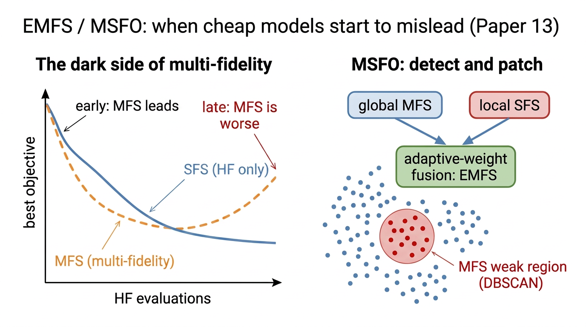

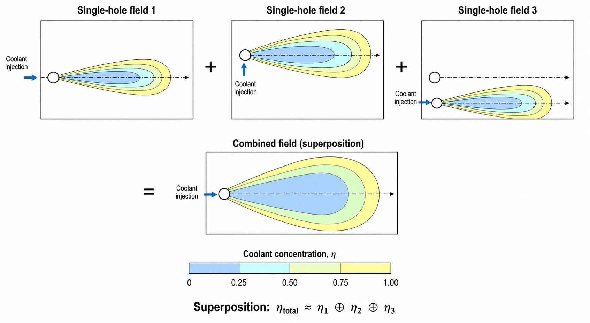

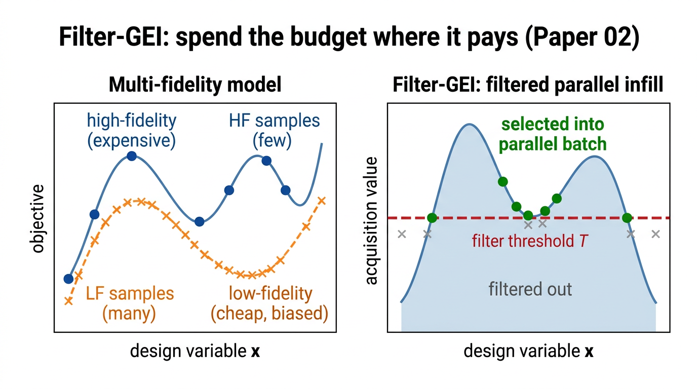


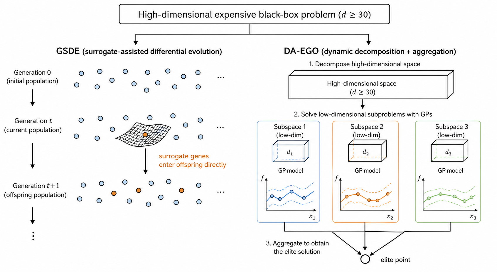

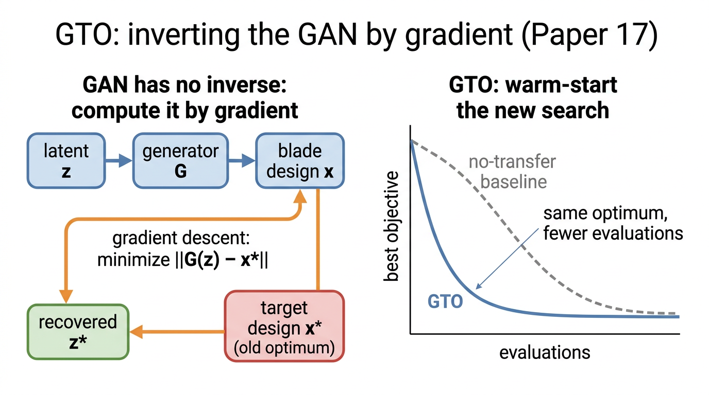

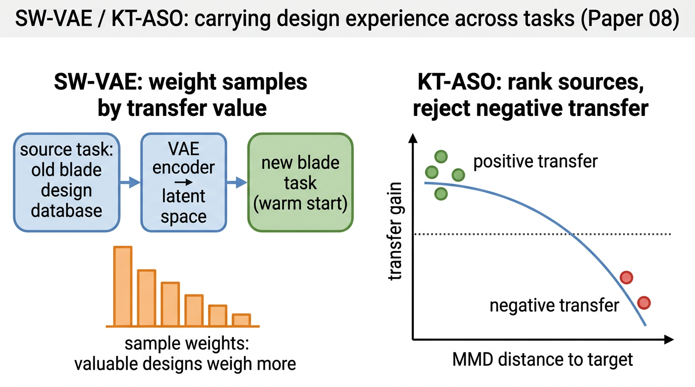


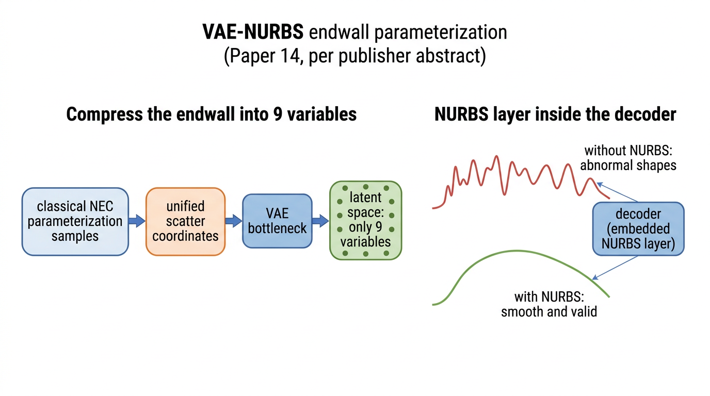
